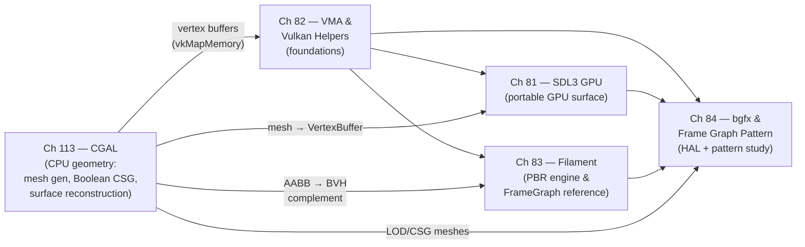

# Part XVIII — Rendering Abstraction Libraries

The chapters in Parts I–XVII trace the Linux graphics stack from **DRM** kernel internals and **Mesa** driver architecture up through the **Wayland** compositor, display server, and application-level APIs such as **Vulkan**, **OpenGL**, and **EGL**. Part XVIII stands one level above that stack. The libraries covered here — **SDL3 GPU**, **VMA**, **Filament**, **bgfx**, and **CGAL** — are not part of the OS or the driver; they are userspace libraries that applications link against to gain portable, ergonomic access to GPU resources without writing raw **Vulkan** bootstrap code or implementing their own memory allocators, frame graphs, physically based shading pipelines, or geometry processing algorithms. This layer exists because the expressiveness of **Vulkan** and the verbosity of **Vulkan** are the same thing: every application that uses explicit GPU APIs must solve the same set of structural problems, and the libraries in this part factor out those solutions so that application code can focus on what is unique to each program. **CGAL** occupies a distinct but complementary role: it operates entirely on the CPU, generating geometrically correct meshes that are subsequently uploaded to the GPU, and it is the canonical answer to the question of what happens upstream of `vkMapMemory`.

## Chapters in This Part

**Chapter 81 — SDL3 GPU: Cross-Platform Graphics Made Simple** introduces the **SDL_GPU** API (`SDL_gpu.h`), the first-party GPU layer added to **SDL3** in 2024 and stabilised in **SDL** 3.2.0 (January 2025). Readers learn how **SDL_GPU** wraps **Vulkan** on Linux (and **Metal** on macOS, **Direct3D 12** on Windows) behind a **Metal**-inspired command-buffer model — devices, pipelines, textures, samplers, render passes, and compute passes — that requires far less boilerplate than raw **Vulkan** while preserving explicit control over upload timing and command recording. The chapter is the natural starting point for developers who want a gentle on-ramp to explicit GPU programming before confronting full **Vulkan**.

**Chapter 82 — VMA and Vulkan Helper Libraries** surveys the ecosystem of single-header and small libraries that eliminate **Vulkan** bootstrapping ceremony without hiding **Vulkan** objects. The centrepiece is **VMA** (**Vulkan Memory Allocator**), AMD's single-header allocator used by **DXVK**, **Godot Engine**, and the **Khronos** Vulkan-Samples; the chapter covers its **TLSF**-inspired suballocation, `VMA_MEMORY_USAGE_AUTO` type selection, `VmaVirtualBlock` for offset-based management, and memory aliasing for transient resources. Surrounding **VMA** are **volk** (a function-pointer meta-loader that eliminates the **Vulkan** loader trampoline), **vk-bootstrap** (a fluent builder chain reducing 300-line setup to ~40 lines), **SPIRV-Reflect** (runtime **SPIR-V** introspection for auto-generated pipeline layouts), **Dear ImGui** with a **Vulkan** backend, shader hot-reload via **inotify** and **libshaderc**, and **Tracy** GPU profiling. This chapter is aimed squarely at developers writing raw **Vulkan** C/C++ who want to reduce mechanical boilerplate without giving up control.

**Chapter 83 — Filament: Google's Physically Based Rendering Engine** examines **Filament** as a production **PBR** rendering library embedded in applications rather than a game engine. The chapter covers the layered architecture (the **filament::Engine** resource factory, **filament::Scene** entity container, **filament::Renderer** submission loop, and the **filament::backend::Driver** abstraction routing to **Vulkan**, **OpenGL**, **Metal**, and **WebGPU** backends), the lightweight **ECS** (opaque `utils::Entity` handles managed by **RenderableManager**, **LightManager**, and **TransformManager**), the offline **FILAMAT** material pipeline (**matc** tool compiling `.mat` domain-specific surface shaders through **glslang** → **spirv-opt** → **spirv-cross** into multi-backend binary packages), the **Cook-Torrance PBR BRDF** with **GGX** NDF, the **FrameGraph** that performs pass culling, memory aliasing, and automatic **VkImageMemoryBarrier** insertion, and the post-processing pipeline (**TAA**, **SSAO**, **bloom**, **DoF**, **ACES** tone mapping). Readers who need a complete high-level shading pipeline on Linux without writing their own frame graph or **BRDF** will find **Filament** a production-ready reference.

**Chapter 84 — bgfx and the Frame Graph Pattern** covers two related topics. The first half examines **bgfx**, a cross-platform rendering **HAL** targeting eight backends (**Vulkan**, **OpenGL** 3.1+, **OpenGL ES**, **Direct3D** 11/12, **Metal**, **WebGL**, **WebGPU**) from a single API surface, with its typed 16-bit opaque handle system, `.sc` shader dialect compiled by its own **shaderc** tool through **glslang** and **DXC**, view-sorted draw-call submission, and multi-threaded `bgfx::Encoder` model. The second half — which applies beyond **bgfx** to **Filament**, **Unreal**'s **Render Dependency Graph**, **Bevy**'s **RenderGraph**, and **Firefox WebRender** — introduces the frame graph pattern as a principled answer to the ownership, barrier, and aliasing problems that arise in multi-pass rendering, culminating in an implementation deep-dive using **Filament**'s **FrameGraph** as the reference and a survey of transient resource allocators built on **VMA** `VMA_POOL_CREATE_LINEAR_ALGORITHM_BIT` pools and `VmaVirtualBlock`.

**Chapter 113 — CGAL and Computational Geometry on the Linux Graphics Stack** covers the **Computational Geometry Algorithms Library** (CGAL 6.x, now fully header-only since CGAL 5.0) as the robust CPU-side geometry preprocessing layer that feeds rendered scenes. The chapter opens with CGAL's kernel parametrization model and its floating-point interval filter — the mechanism that eliminates orientation-predicate sign errors without paying multi-precision cost on the common path — and then follows geometry from creation to GPU handoff. The core topics are `Surface_mesh` and the halfedge data structure, the explicit CPU–GPU boundary at `vkMapMemory`/`glBufferData` where a flat `std::vector<float>` leaves CGAL property maps and enters a **Vulkan** vertex buffer, **Boolean CSG** via **PMP corefinement** and `Nef_polyhedron_3`, Delaunay triangulation in 2D and 3D, surface reconstruction from point clouds (`Poisson_surface_reconstruction_3`, `Advancing_front_surface_reconstruction`), `AABB_tree` for ray-intersection preprocessing that complements `VK_KHR_acceleration_structure` BVH builders, alpha shapes and convex hull for LOD generation, and tetrahedral mesh generation with the **Mesh_3** package for FEA/CFD visualization pipelines. A section on **TBB**-tag-dispatch parallelism explains why CGAL's parallelism model is CPU-centric rather than CUDA/SYCL-based. The chapter closes with integration pathways to **VTK**/**ParaView** for scientific visualization and the **CGAL::draw()** / **Qt6 OpenGL** quick-visualization path. Audiences are graphics application developers building asset pipelines, DCC tool engineers integrating robust Boolean and remeshing operations, and scientific visualization developers connecting CGAL mesh generation to GPU renderers.

## How the Chapters Interrelate

The five chapters form a layered dependency graph that mirrors the abstraction levels they describe, with **CGAL** (Ch113) occupying a distinct upstream position as the CPU-side geometry source that produces vertex data consumed by all four GPU-facing libraries.

**Chapter 82** (VMA and helpers) is the lowest-level GPU-side chapter and a prerequisite for the others. **VMA** itself reappears in Chapter 84 as the transient resource allocator powering the frame graph pattern, and **VMA**'s `VmaVirtualBlock` and `vmaCreateAliasingImage()` are the concrete tools used to implement memory aliasing in **Filament**'s **FrameGraph** (Chapter 83 §10). The **volk** and **vk-bootstrap** helpers from Chapter 82 surface implicitly wherever a library spins up its own **Vulkan** device: **Filament** uses its own **bluevk** function loader (structurally identical to **volk**), and **bgfx**'s `renderer_vk.cpp` performs exactly the device-selection ceremony that **vk-bootstrap** automates. Reading Chapter 82 first gives readers the vocabulary — `VkPhysicalDeviceMemoryProperties`, `VkDescriptorPool`, `vkGetDeviceProcAddr`, `SpvReflectShaderModule` — that later chapters use without re-explaining.

**Chapter 81** (SDL3 GPU) sits alongside Chapter 82 on the lower tier but attacks a different problem: it is a complete, opinionated GPU surface rather than a collection of helpers. Chapter 81 is independent of Chapter 82 in the sense that **SDL_GPU** hides **VMA** and device selection internally; however, Chapter 82's mental model of **Vulkan** objects (command buffers, render passes, pipeline state) is shared by **SDL_GPU** and makes Chapter 81 easier to appreciate. Chapter 81 also serves as the windowing layer for the minimal application skeleton in Chapter 82 §10, which uses **SDL3** for surface creation alongside **volk**, **vk-bootstrap**, and **VMA**. Chapter 84 explicitly positions **bgfx** relative to **SDL3 GPU** and describes both as alternatives on the cross-platform portability spectrum, so readers who study Chapters 81 and 84 together will have a clear picture of when each is appropriate.

**Chapter 83** (Filament) builds on both: it relies on the same **Vulkan** concepts introduced in Chapter 82, and it constitutes the primary concrete reference implementation for the frame graph pattern introduced theoretically in Chapter 84 §7–8. **Filament**'s **fg/** directory is examined in both chapters from different angles — as a production PBR system in Chapter 83 and as a pattern study in Chapter 84 — so the two chapters are best read together or with Chapter 83 immediately preceding Chapter 84. The **bgfx** view-sorted submission model (Chapter 84 §2–6) can be read independently of the frame graph sections (§7–9), making Chapter 84 separable into two self-contained halves if needed.

**Chapter 113** (CGAL) is architecturally upstream of all four GPU-facing chapters. It does not depend on **VMA**, **SDL_GPU**, **Filament**, or **bgfx**, but it feeds all of them: **Boolean CSG** and **Mesh_3** tetrahedral generation produce vertex and index arrays that are uploaded via the mechanisms described in Chapter 82; surface reconstruction and LOD meshes computed in Chapter 113 become the `VertexBuffer`/`IndexBuffer` resources managed by **SDL_GPU** (Ch81) or **bgfx** (Ch84); and the **AABB_tree** ray-intersection preprocessing in Chapter 113 is the CPU-side complement to the `VK_KHR_acceleration_structure` BVH builders that Filament's Vulkan backend uses for GPU-accelerated ray tracing. Readers building DCC or asset-pipeline tools will typically read Chapter 113 before Chapters 81–84; readers focused purely on GPU runtime programming may read it independently after the GPU chapters.

A unifying theme runs through all five chapters: **the management of GPU resource lifetimes across frame boundaries**, and — introduced by Chapter 113 — **the correctness of the geometry that fills those resources**. Every library in this part solves a variant of the same problem: **SDL_GPU** with `SDL_ReleaseGPUBuffer`, **VMA** with pool suballocation and defragmentation, **Filament**'s **FrameGraph** with virtual resource versioning, **bgfx** with its double-buffered frame model and encoder-merge step, and **CGAL** with exact arithmetic kernels and robust predicate evaluation. Readers who trace this thread across the five chapters will finish Part XVIII with a principled understanding of why the frame graph pattern emerged, what properties a correct implementation must have, and why geometrically correct input data is a prerequisite for visually correct output.

## Prerequisites and What Comes Next

Readers should be comfortable with the **Vulkan** object model — instances, physical and logical devices, queues, command buffers, render passes, memory types, and synchronisation barriers — as covered in Parts IV and V of this book, and should be familiar with the **Mesa** Vulkan driver architecture (Parts II and III) to appreciate how library-internal **VkDevice** creation maps to the underlying **RADV**, **ANV**, or **NVK** driver paths. For Chapter 113, familiarity with C++ template programming is assumed; prior knowledge of computational geometry is not required. Part XIX builds on this foundation by examining full-featured game engines and scene graph frameworks — **Godot**, **Bevy**, and **Unreal** on Linux — which embed the kinds of frame graphs, PBR pipelines, memory allocators, and geometry processing algorithms studied here as internal implementation details rather than as standalone libraries.

---

## Part Roadmap Summary

*Synthesised from the Roadmap sections of this part's chapters.*

### Near-term (6–12 months)

- **Vulkan 1.3/1.4 alignment across the helper stack.** VMA is absorbing `VK_EXT_memory_priority` and `VK_KHR_maintenance5` into its default flag set; vk-bootstrap is prototyping `set_required_features_14` selectors covering `VkPhysicalDeviceVulkan14Features`; and bgfx is adopting `VK_KHR_dynamic_rendering` and `VK_KHR_synchronization2` to retire its per-view `VkRenderPass` caching on RADV and ANV.
- **WebGPU backend hardening.** Both SDL_GPU (community PR #12046) and bgfx are closing feature-parity gaps against their Vulkan backends to enable browser deployment via Emscripten; Filament's Dawn-backed WGSL path is being hardened for Flutter Web and Chrome OS, targeting VSM shadows and GTAO parity.
- **Wayland and Linux-specific polish.** Filament is making `VK_KHR_wayland_surface` fully first-class, adding correct fractional-scale handling via `wp_fractional_scale_v1` and explicit synchronisation with `linux-drm-syncobj-v1`. SDL_GPU is broadening HDR support through `VK_EXT_swapchain_colorspace`.
- **Pipeline and profiling ergonomics.** SDL_GPU is discussing an explicit `SDL_GPUPipelineCache` handle to reduce first-frame shader-compilation stalls; Tracy 0.12 is improving `VK_EXT_calibrated_timestamps` on Mesa/RADV and ANV to address drift in long profiling sessions; and Dear ImGui's Vulkan/SDL3 backend is gaining `ImGuiBackendFlags_RendererHasTextures` for automatic font-atlas management.
- **CGAL 6.2 stability pass.** The `Triangulations` API refactor, non-manifold self-intersection repair in `Polygon_mesh_processing`, and CVD-based remeshing (`approximated_centroidal_Voronoi_diagram_remeshing()`) are all targeting non-experimental status in the 6.2 release.

### Medium-term (1–3 years)

- **Bindless and descriptor-buffer adoption.** SDL_GPU, Filament, and bgfx/frame-graph implementations are converging on `VK_EXT_descriptor_indexing` and `VK_EXT_descriptor_buffer` to replace per-draw descriptor-set allocation with GPU-resident descriptor tables, reducing CPU overhead for scenes with large numbers of unique materials and render passes.
- **Mesh shaders across the abstraction stack.** As `VK_EXT_mesh_shader` reaches broad coverage on AMD RDNA 2+, Intel Xe, and NVIDIA Turing+, Filament (GPU-driven froxel culling), bgfx (opt-in extension mechanism), and indirectly VMA (geometry amplification outputs) will adopt task/mesh pipelines to reduce geometry-stage CPU load.
- **Async compute and multi-queue scheduling.** Filament's FrameGraph is gaining async-compute queue support to overlap compute and graphics passes; SDL_GPU's most-requested architectural addition is a two-queue model (main + async-transfer) aligned with RADV and ANV's dedicated transfer queues; and frame graph allocators will benefit from VMA 3.x first-class sparse resource support and improved VRAM budget tracking via `VK_EXT_memory_budget`.
- **Shader toolchain convergence.** SPIRV-Reflect and glslang are moving toward a unified C ABI for shader introspection; `VK_EXT_shader_object` is expected to enable atomic hot-swap of shaders without full pipeline recreation in the Ch82 hot-reload pattern; and SDL_GPU is exploring closer integration with `SDL_shader_tools`/SPIRV-Cross for single-source GLSL-to-MSL/DXIL/SPIR-V translation.
- **CGAL geometry processing pipeline and GPU-accelerated BVH.** CGAL's mid-term goal is a unified point-set → reconstruction → remeshing pipeline without intermediate file I/O; an optional path dispatching `AABB_tree` bulk ray and closest-point queries to Vulkan compute shaders (with CPU fallback for exact arithmetic) is under community discussion, directly complementing `VK_KHR_acceleration_structure` BVH builders described in Ch113.

### Long-term

- **GPU-driven and GPU-resident rendering.** Filament, bgfx's frame graph, and SDL_GPU are all on trajectories toward fully GPU-driven architectures — single indirect-draw-call-per-frame models where the GPU culls, sorts, and instantiates geometry — and toward GPU-resident dependency graphs where the pass DAG and barrier sequence are resolved by a compute shader, eliminating the CPU compilation phase for stable frame topologies.
- **Ray tracing as a primary path.** Once `VK_KHR_ray_tracing_pipeline` support matures uniformly across NVK, RADV, and ANV, SDL_GPU will add a conservative ray-tracing sub-API, Filament will offer hardware-accelerated shadow and reflection passes replacing PCSS and split-sum IBL approximations, and bgfx will need to reconcile diverging Metal/D3D12/Vulkan ray-tracing surfaces through a common intermediate representation above SPIR-V.
- **Exact arithmetic on GPU and CGAL license evolution.** CGAL maintainers are exploring whether orientation and in-circle predicates could be offloaded to GPU compute via INT64 or emulated rational types, enabling GPU-accelerated Delaunay refinement for very large point clouds. In parallel, GeometryFactory is moving GPL-licensed packages (notably `Nef_polyhedron_3`) toward LGPL to remove commercial-integration barriers in DCC tools, which would make the Ch113 Boolean CSG pipeline usable in proprietary asset pipelines without copyleft obligations.
- **Standardised bootstrap and USD geometry integration.** The Khronos Vulkan working group is discussing a loader-level mechanism that would subsume parts of vk-bootstrap's device-scoring logic, potentially reducing the need for third-party bootstrap libraries; and CGAL is positioned to become the computation backend for USD's procedural geometry layer as USD adoption in VFX and scientific pipelines grows.

---

*Copyright © 2026 jreuben11. Licensed under [CC BY 4.0](https://creativecommons.org/licenses/by/4.0/).*
