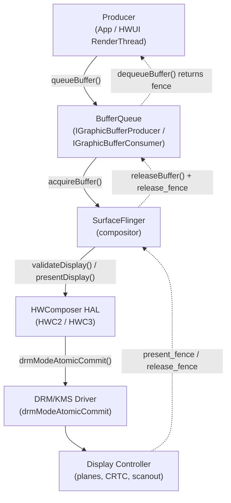
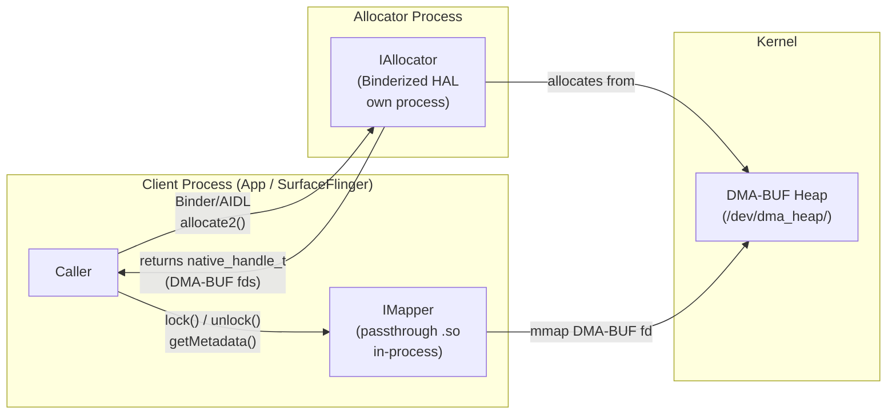
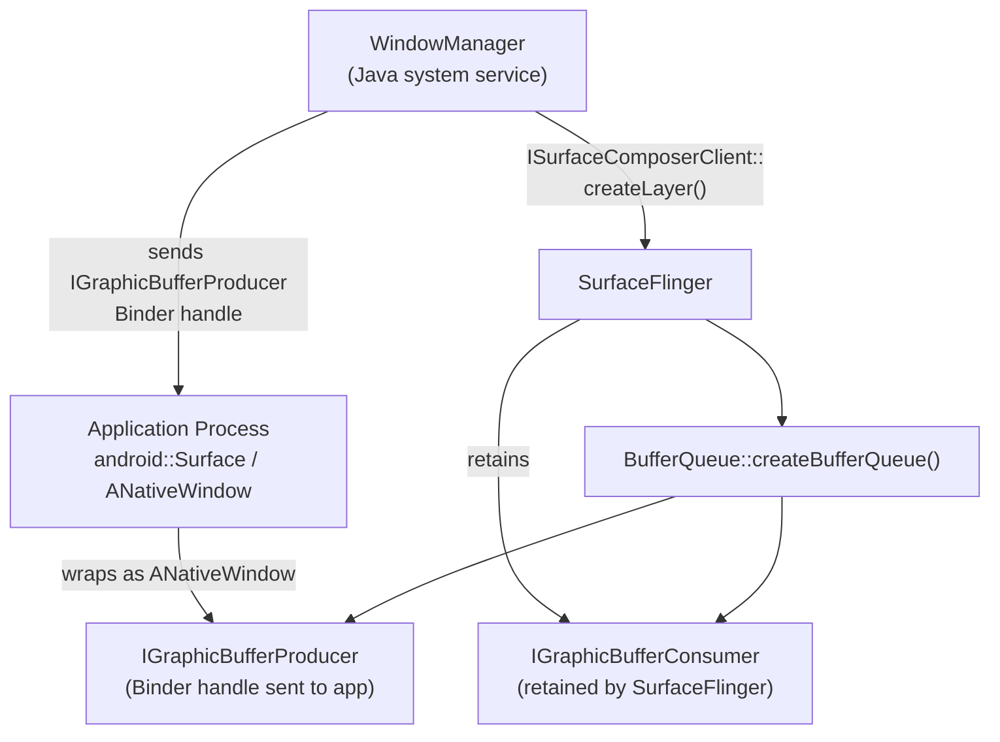
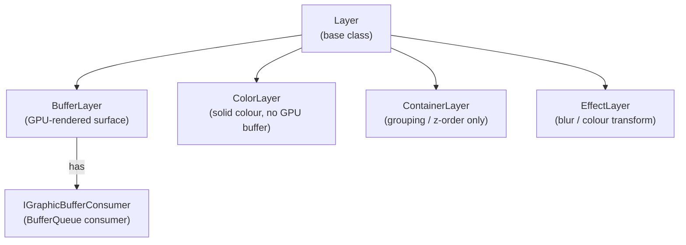
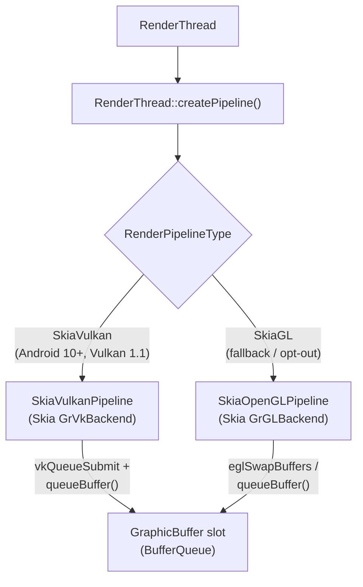

# Chapter 85: Android Compositor — SurfaceFlinger, HardwareBuffer, and the Buffer Pipeline

> **Part**: Part XIX — Android Graphics
> **Audience**: Systems and driver developers comparing Android's compositor to Wayland; graphics application developers targeting Android; browser engineers where Android is a primary Chromium/Chrome platform
> **Status**: First draft — 2026-06-17

---

## Table of Contents

1. [Android's Graphics Architecture Overview](#1-androids-graphics-architecture-overview)
    - [1.3 Consolidation Efforts: Where the Stacks Are Converging](#13-consolidation-efforts-where-the-stacks-are-converging)
2. [Gralloc: Android's GPU Memory Allocator](#2-gralloc-androids-gpu-memory-allocator)
3. [AHardwareBuffer — The Public Buffer API](#3-ahardwarebuffer--the-public-buffer-api)
4. [BufferQueue: The Producer-Consumer Pipeline](#4-bufferqueue-the-producer-consumer-pipeline)
5. [SurfaceFlinger: Android's Compositor](#5-surfaceflinger-androids-compositor)
6. [HWComposer and Direct Scanout](#6-hwcomposer-and-direct-scanout)
7. [ASurfaceControl: Modern Surface Transactions](#7-asurfacecontrol-modern-surface-transactions)
8. [HWUI: Android's UI Rendering Engine](#8-hwui-androids-ui-rendering-engine)
9. [Sync Fences in Android](#9-sync-fences-in-android)
10. [Android Display Pipeline End-to-End](#10-android-display-pipeline-end-to-end)
11. [Color Management and HDR on Android](#11-color-management-and-hdr-on-android)
12. [Integrations](#integrations)
13. [References](#references)

---

## Scope

This chapter examines Android's compositor and buffer-sharing stack for three audiences.

- **Systems and driver developers** — learn how Android maps the Linux DRM/KMS kernel layer onto its own HAL and framework compositors — a concrete case study in building a production compositor on top of the same primitives used by Wayland desktops.
- **Graphics application developers** — find the complete AHardwareBuffer and ASurfaceControl NDK surface, the producer-consumer BufferQueue model, and how EGL and Vulkan bind to native buffers.
- **Browser engineers** — see how Chromium/Chrome's Android path uses the same SurfaceFlinger and HWComposer subsystems that every other Android app traverses, and how Android's fence model underpins zero-copy video and WebGL rendering.

---

## 1. Android's Graphics Architecture Overview

Android's graphics stack is a four-layer sandwich built on top of the Linux kernel. Understanding which layer handles which responsibility is essential before diving into any single component. [Source: Android Graphics Architecture](https://source.android.com/docs/core/graphics/architecture)

At the kernel layer, **DRM/KMS** provides display control, **DMA-BUF** heaps (replacing the legacy **ION** allocator from Android 12 / **GKI** 2.0) provide shared memory, and the **sync_file** / **dma_fence** infrastructure provides GPU synchronisation primitives. Above the kernel sits the **HAL** layer: **Gralloc** (**IAllocator** + **IMapper**, evolving from **HIDL** through **AIDL** across Android versions) allocates shared GPU buffers returned as opaque **native_handle_t** file-descriptor bundles wrapping **DMA-BUF** fds, while **HWComposer** (**HWC2** / **HWC3**) wraps **DRM** atomic commits to let the display hardware composite layers directly. The framework layer hosts **SurfaceFlinger** — Android's compositor — which manages a hierarchy of layer types (**BufferLayer**, **ColorLayer**, **ContainerLayer**, **EffectLayer**), orchestrates the validate-then-present **HWC2** flow (`validateDisplay()` / `presentDisplay()`), and integrates with **WindowManager** for window policy. Buffers flow from producers to **SurfaceFlinger** through **BufferQueue**, a producer-consumer pipeline whose **IGraphicBufferProducer** / **IGraphicBufferConsumer** **Binder** interfaces support double- and triple-buffering slot models. The public NDK surface for buffer management is **AHardwareBuffer** (introduced in API 26), which can be locked for CPU access, shared cross-process via **Unix domain sockets** or **Binder Parcel**, imported into **EGL** via `EGL_NATIVE_BUFFER_ANDROID` and `EGLImageKHR`, and imported into **Vulkan** via `VK_ANDROID_external_memory_android_hardware_buffer` (`vkGetAndroidHardwareBufferPropertiesANDROID()` / `vkAllocateMemory()` with **VkImportAndroidHardwareBufferInfoANDROID**). Atomic surface updates from native code are exposed through **ASurfaceControl** / **ASurfaceTransaction** (`ASurfaceTransaction_apply()` maps to `ISurfaceComposer::setTransactionState()`), which supports multi-surface atomic commits analogous to **DRM** atomic. Android's UI rendering engine **HWUI** bridges the Java **View** system to the GPU: the **Choreographer** drives a **UI thread** that records draw operations into **DisplayList** / **RenderNode** trees via **SkiaRecordingCanvas**, and a dedicated **RenderThread** replays them using either **SkiaVulkanPipeline** (`GrVkBackend`) or **SkiaOpenGLPipeline** (`GrGLBackend`), with **DispSync** phase offsets (**VSYNC-app** / **VSYNC-sf**) tuned per device. Fence coordination throughout the pipeline relies on **android::Fence** wrapping **sync_file** file descriptors (passed over **Binder** as file-descriptor attachments), which is Android's counterpart to **wp_linux_drm_syncobj** in the Wayland world. The chapter closes with the full end-to-end display pipeline trace from `Canvas.drawRect()` to panel scanout, and with Android's color-management and **HDR** support: wide-color-gamut **Display P3** (Android 8.0+), **HDR10** / **HLG** / **Dolby Vision** via `Display.HdrCapabilities`, per-layer **HAL_DATASPACE** metadata (**HAL_DATASPACE_BT2020_PQ**, **HAL_DATASPACE_DISPLAY_P3**, etc.) consumed by **SurfaceFlinger** and **HWC**, and **Vulkan** swapchain color spaces via `VK_EXT_swapchain_colorspace`. Throughout, direct comparisons with the **Wayland** / **GBM** / **wlroots** ecosystem show how Android and Linux desktop compositors solve the same problems with the same kernel primitives but different userspace interfaces.

### 1.1 Layer Model

```
┌────────────────────────────────────────────────────────────────┐
│  Application Layer                                             │
│  Canvas/View, Vulkan NDK, OpenGL ES via EGL, HWUI             │
├────────────────────────────────────────────────────────────────┤
│  Framework Layer                                               │
│  SurfaceFlinger (compositor), BufferQueue, HWUI RenderThread  │
│  WindowManager, ASurfaceControl (NDK), ANativeWindow           │
├────────────────────────────────────────────────────────────────┤
│  HAL Layer                                                     │
│  Gralloc (buffer allocator), HWComposer (display controller), │
│  EGL platform implementation, Camera HAL, Audio HAL           │
├────────────────────────────────────────────────────────────────┤
│  Linux Kernel Layer                                            │
│  DRM/KMS (display), DMA-BUF heaps (memory), ion (legacy),     │
│  GPU driver (Adreno, Mali, PowerVR...), sync_file fences       │
└────────────────────────────────────────────────────────────────┘
```

### 1.2 Key Differences from Wayland

Android and Wayland compositors share the same Linux kernel primitives — DRM/KMS for display control, DMA-BUF for buffer sharing, and sync_file for GPU fences — but their userspace architectures diverge substantially. The table below captures these differences across eleven key attributes, giving a quick orientation before the detailed sections that follow. Cross-references to the Wayland-side counterparts appear throughout this chapter.

| Attribute | Android (SurfaceFlinger / HWUI) | Linux/Wayland (wlroots/Mutter + KMS) |
|---|---|---|
| Buffer protocol | BufferQueue / ANativeWindow (Binder IPC) | linux-dmabuf-v1 (Wayland protocol over Unix socket) |
| IPC mechanism | Android Binder (kernel driver, parcels) | Wayland wire protocol (Unix domain socket, event objects) |
| Compositor model | SurfaceFlinger (C++, always-on system service) | Per-session: Mutter/KWin/Sway/etc. (user-space daemon) |
| GPU fence model | Android sync timeline (sw_sync; sync_file) | drm_syncobj (binary and timeline) + DMA-BUF implicit fences |
| Hardware compositing | HWComposer HAL (abstraction over gralloc + DRM) | KMS atomic commit (direct DRM plane assignment) |
| Colour management (HDR) | Display HAL + SurfaceControl HDR metadata | wp_color_management_v1 + wp_color_representation_v1 (Wayland) |
| Multi-display | DisplayManager → SurfaceFlinger displays | KMS CRTC/connector per output; wl_output |
| Screenshot/capture | MediaProjection API (privileged) | xdg-desktop-portal screencopy (PipeWire) |
| Application sandbox | Android permission model (uid isolation) | Wayland isolation (no global screen capture; no input injection) |
| Gralloc / buffer allocation | Gralloc HAL (vendor-specific) | GBM (Generic Buffer Manager) + libdrm |
| Vulkan WSI | VK_KHR_android_surface (ANativeWindow) | VK_KHR_wayland_surface + VK_EXT_acquire_drm_display |

While Android runs on the same Linux kernel DRM/KMS stack described in Ch1 and Ch2, the userspace above it differs fundamentally from the Wayland ecosystem:

| Dimension | Wayland (Linux desktop) | Android |
|---|---|---|
| Compositor protocol | Wire protocol (Wayland IPC) | Binder IPC with Java/NDK wrappers |
| Buffer allocation | GBM (`gbm_bo_create`) | Gralloc HAL (`IAllocator`) |
| Buffer sharing | `wl_drm` / `linux-dmabuf` | `AHardwareBuffer` / `native_handle_t` |
| Compositor | wlroots/Mutter/KWin | SurfaceFlinger |
| Display control | DRM atomic commit directly | HWComposer HAL wrapping DRM |
| Sync primitives | `wp_linux_drm_syncobj` / sync_file | android::Fence (sync_file) |

Despite this different userspace surface, the kernel base is identical: SurfaceFlinger ultimately drives the display through DRM/KMS atomic commits, and GPU buffers are DMA-BUF objects under the hood.

#### Why the differences exist

The divergences above follow a single pattern: Android was designed in 2007–2009 for a resource-constrained, single-user, hostile-app-store mobile environment running on heterogeneous vendor silicon, and solved each problem in-process or behind a HAL at a time when the corresponding Linux kernel and Mesa primitives either did not exist or were not mature enough. Wayland arrived from 2008–2012 on the Linux desktop, could assume standardised DRM drivers and POSIX process isolation, and built its architecture directly on kernel-native primitives from the start. They now share the same kernel layer — `dma_fence`, DMA-BUF, `drmModeAtomicCommit` — but the userspace differs because the two stacks were designed for different threat models and hardware realities, roughly five years apart.

**Binder IPC vs. Wayland wire protocol.** Android chose OpenBinder (originally from Be/Palm) because Binder is a kernel driver (`/dev/binder`) that mediates every IPC transaction and stamps each with the caller's verified UID. On a phone where arbitrary third-party apps run alongside privileged system services, kernel-enforced identity per call was necessary. Wayland came later for Linux desktops, where POSIX uid/pid isolation was already trusted and a lightweight Unix domain socket was sufficient — no kernel transaction broker needed.

**SurfaceFlinger as always-on system service vs. per-session compositor.** Android has no concept of logout. The compositor must run from boot to shutdown, managing the lock screen, status bar, and all apps within a fixed single-user session. A per-session daemon model doesn't fit: SurfaceFlinger crashing triggers a `system_server` restart (visible as a soft reboot). Wayland compositors crash and restart silently because the session model tolerates it.

**Gralloc HAL vs. GBM.** In 2009–2015, every Android SoC (Qualcomm, MediaTek, Samsung Exynos, etc.) had its own proprietary buffer allocation mechanism — different tiling formats, IOMMU mapping quirks, camera-specific YUV layouts. Gralloc gave each OEM a stable interface to hide that detail below the HAL line. GBM arrived on the Linux desktop where Mesa's generic DRM drivers made a single interface practical from the start; OEM diversity was not the design problem to solve.

**HWComposer HAL vs. direct KMS atomic.** Display controller behaviour varies more across SoCs than GPU behaviour does. HWC lets vendor BSPs implement overlay scheduling, plane assignment, and HDR tone mapping in proprietary code beneath the HAL boundary. Desktop compositors (wlroots, Mutter, KWin) call `drmModeAtomicCommit()` directly because the DRM KMS API is a stable, open, well-specified kernel interface that the same drivers implement uniformly.

**`android::Fence` (sw_sync timeline) vs. drm_syncobj.** Android's sync timeline predates the kernel's `drm_syncobj` by several years. Google solved the GPU fence problem via `sw_sync` — a synthetic timeline in the kernel's `sync_file` subsystem — because the DRM drivers on early Android SoCs did not expose `dma_fence` objects cleanly to userspace. The desktop route (`drm_syncobj`, `wp_linux_drm_syncobj`) arrived later, is aligned with DRM-native primitives, and is now what new Android driver work targets as well.

**MediaProjection API vs. xdg-desktop-portal screencopy.** Android's screen-capture API requires an explicit user consent dialog enforced by the platform, reflecting the mobile threat model: background screen recording by malicious apps must be blocked at the OS level. Wayland's compositor isolation already prevents unauthenticated screen capture by default; xdg-desktop-portal adds the consent dialog at a higher layer (via PipeWire and the portal daemon) without baking it into the compositor itself.

### 1.3 Consolidation Efforts: Where the Stacks Are Converging

Now that the Linux kernel primitives — DMA-BUF, `dma_fence`/`sync_file`, DRM/KMS atomic, `drm_syncobj` — are mature and Wayland is the established Linux desktop compositor protocol, there are active efforts to consolidate or align the two stacks. None of these amount to a wholesale merger; Android's HAL abstraction layer and Binder IPC are load-bearing for OEM diversity in ways that Wayland's wire protocol is not. But at every layer, the gap is narrowing.

#### DMA-BUF heaps: ION removal and shared kernel ABI

The most complete consolidation has already happened at the allocator layer. Android's ION allocator (`drivers/staging/android/ion/`) was the original DMA-BUF heap implementation — it predated the mainline equivalent and never made it out of staging. From **Linux 5.6** (2020), the DMA-BUF heaps subsystem (`drivers/dma-buf/heaps/`) replaced ION with a clean per-heap interface (`/dev/dma_heap/<name>`, `DMA_HEAP_IOCTL_ALLOC`). Android 12 with GKI 2.0 mandated DMA-BUF heaps exclusively — `CONFIG_ION` is disabled in the Android 12 ACK (Android Common Kernel) kernel from March 2021. ION has since been removed from mainline Linux entirely. The result: Android and Linux desktop now share the same kernel ABI for DMA-BUF allocation. A buffer allocated by Mesa's GBM on a Linux desktop and a buffer allocated by Android's Gralloc HAL are both DMA-BUF file descriptors produced by the same heap infrastructure. [Source: Android DMA-BUF Heaps](https://source.android.com/docs/core/architecture/kernel/dma-buf-heaps), [Kernel docs](https://docs.kernel.org/userspace-api/dma-buf-heaps.html)

#### Generic Kernel Image (GKI): "upstream first" for DRM drivers

Android 12 introduced **GKI 2.0**, which establishes a stable kernel module interface (KMI) — SoC vendors must move their display and GPU drivers either upstream into mainline Linux or into a loadable vendor kernel module that attaches to the stable KMI. This has forced Qualcomm and others to upstream code that previously lived in private Android BSP trees. Google's stated policy since 2021 is "upstream first": new Android kernel features must land in mainline before AOSP. Qualcomm's `drm/msm` driver (covering Adreno GPUs and Snapdragon display controllers) is now the upstream path; Adreno A8xx patches for Snapdragon 8 Elite were posted to LKML in October 2025. The net effect: the same DRM driver serves both a mainline Linux Wayland desktop and an Android GKI device. [Source: Android GKI](https://source.android.com/docs/core/architecture/kernel/generic-kernel-image)

#### drm_hwcomposer: HWC HAL backed by direct DRM/KMS

**drm_hwcomposer** ([gitlab.freedesktop.org/drm-hwcomposer/drm-hwcomposer](https://gitlab.freedesktop.org/drm-hwcomposer/drm-hwcomposer)) is an open-source Android HWComposer HAL implementation that calls `drmModeAtomicCommit()` directly, with no vendor binary blob below it. It eliminates the proprietary HWC between SurfaceFlinger and the display driver, replacing it with the same DRM atomic commit path that Wayland compositors use. Maintained by Roman Stratiienko, it is actively used in: ChromeOS ARC++, the AOSP Cuttlefish/ranchu emulator, GloDroid, Android-x86, and ARM Mali downstream BSPs. As of 2025 it is transitioning from HIDL `composer@2.x` to **AIDL `composer3`** (`android.hardware.graphics.composer3`). This is the most direct bridge: the same DRM atomic calls, the same kernel plane objects, whether the compositor above is SurfaceFlinger or a Wayland compositor.

#### minigbm: Gralloc HAL backed by GBM/libdrm

**minigbm** ([chromium.googlesource.com/chromiumos/platform/minigbm](https://chromium.googlesource.com/chromiumos/platform/minigbm/)) is Google's actively maintained GBM-backed Gralloc HAL, used in ChromeOS and ARCVM. Its `cros_gralloc` backend implements the Android Gralloc HAL on top of `libdrm` GBM for Intel, AMD, Qualcomm MSM, Rockchip, and others — i.e., it allocates Android `native_handle_t` buffers using the same GBM `gbm_bo_create()` path that a wlroots compositor would use on the same machine. A Rust-based successor, **rutabaga_gralloc** (part of crosvm's `rutabaga_gfx` library), targets broader cross-platform compatibility beyond ChromeOS. Also in AOSP at `android.googlesource.com/platform/external/minigbm/`.

#### Explicit sync convergence: sync_file → drm_syncobj → wp_linux_drm_syncobj_v1

Android's `sync_file` (carrying `dma_fence` objects across process boundaries via file descriptors) originated in Android's BSP around 2012 and was upstreamed to Linux mainline in **Linux 4.9** (2016). `drm_syncobj` — GPU timeline semaphores in the DRM subsystem — arrived in mainline shortly after. The **`wp_linux_drm_syncobj_v1`** Wayland protocol (added to wayland-protocols 1.34, authored by Chromium Authors, Intel, Collabora, and Simon Ser) wraps `drm_syncobj` as a first-class Wayland object, giving Wayland clients and compositors explicit GPU synchronisation with the same semantics Android has had for years. As of 2025–2026, `wp_linux_drm_syncobj_v1` is implemented by KWin (v6.6), Mutter (v49.2), Sway (v1.11), Hyprland, Weston (v14), Gamescope, and more. XWayland 24.1 (2024) shipped explicit sync support, resolving the primary NVIDIA/Wayland stutter issue. The circle closes: the kernel primitive (`dma_fence` wrapped in `sync_file`) that Android invented is now the standard fence mechanism for both stacks. [Source: Collabora blog — Bridging the synchronization gap](https://www.collabora.com/news-and-blog/blog/2022/06/09/bridging-the-synchronization-gap-on-linux/), [Protocol spec](https://wayland.app/protocols/linux-drm-syncobj-v1)

#### Mesa serving both stacks from a single driver

Mesa builds for Android using the NDK (`meson` + `--cross-file android`), producing Vulkan ICD `.so` files dropped into `/vendor/lib64/hw/vulkan.<soc>.so`. The same driver codebase serves Linux desktop (via GBM/Wayland WSI) and Android (via `VK_KHR_android_surface` / `ANativeWindow`):

| Mesa driver | Linux desktop | Android |
|---|---|---|
| **Turnip** (Adreno Vulkan) | wlroots / KDE / GNOME | AOSP Cuttlefish, ARC++, Steam Frame |
| **Panfrost / Panthor** (Mali) | Mainline Linux | Mainlined Android devices |
| **NVK** (NVIDIA) | Wayland + X11 | Android (experimental) |
| **llvmpipe / lavapipe** | Software rendering | Emulator / CI |

Turnip reached Vulkan 1.3 compliance on Adreno 6xx and became the **default ARM64 Mesa driver in Mesa 25.1** (2025). Adreno 8xx support arrived in Mesa 26.0. The practical effect: a developer debugging a Mesa Turnip regression can do so on a Linux desktop with a USB-attached phone's GPU exposed via KMS, using the same driver binary that runs on Android. [Source: Mesa Android docs](https://docs.mesa3d.org/android.html)

#### ChromeOS Exo: a compositor that speaks both languages

ChromeOS **Exo** is the most production-grade example of a compositor that bridges both worlds simultaneously. Exo is a Wayland server (part of Chrome's Ash compositor) that:
- Serves **Linux Crostini** containers via **Sommelier** (a Wayland proxy that translates guest Wayland protocol to host Exo Wayland, with zero-copy buffer sharing via `virtio-gpu`).
- Serves **Android ARCVM** apps running inside **crosvm** (a Rust VMM) via `virtio-gpu` and a `virtio_wl` Wayland passthrough. The **rutabaga_gfx** library (Rust, inside crosvm) implements the cross-domain context type, sharing DMA-BUF fences zero-copy between the Android guest and the ChromeOS host.

Both paths ultimately deliver DMA-BUF-backed buffers to the same Exo compositor, which then composites them via KMS atomic commit. The fence model uses `sync_file` throughout. This is the production proof-of-concept that the two stacks can coexist above a shared kernel layer. [Source: ChromeOS ARCVM blog](https://chromeos.dev/en/posts/making-android-runtime-on-chromeos-more-secure-and-easier-to-upgrade-with-arcvm)

#### WayDroid and wlroots-android-bridge: Wayland on Android

**WayDroid** ([waydro.id](https://waydro.id)) runs a full AOSP image inside an LXC container on a Linux/Wayland host. Its `hwcomposer.wayland` replaces SurfaceFlinger's HWC with a Wayland client — Android's display pipeline terminates at a `wl_surface` on the host compositor rather than a DRM plane. Android apps appear as normal Wayland windows.

A complementary experiment, **wlroots-android-bridge** (Xtr126, GitHub, 2025), goes the other direction: a wlroots-based Wayland compositor running *inside* Android, using `AHardwareBuffer` as the `wlr_allocator` backend and `ASurfaceTransaction_setBuffer()` to present Wayland client surfaces via SurfaceFlinger. Multi-window support was added in August 2025. Neither project is in AOSP, but both prove the buffer and fence primitives are now compatible enough to support cross-protocol composition.

> **Note on Wayland as a first-class Android surface**: Faith Ekstrand's analysis ([gfxstrand.net — Wayland on Android](https://www.gfxstrand.net/faith/projects/wayland/wayland-android/)) documents a fundamental EGL protocol mismatch: Android EGL drivers don't guarantee synchronous buffer queuing from `eglSwapBuffers()`, and `EGL_BUFFER_PRESERVED` semantics conflict with Wayland's assumption of a fresh buffer on every commit. There is no official AOSP effort to make Wayland a first-class Android display surface; these are community experiments. `android.googlesource.com/platform/external/wayland/` ships the Wayland library as a build dependency for tooling, not as an app-facing API.

#### AHardwareBuffer / DMA-BUF: Vulkan as the unification layer

At the Vulkan level, the two buffer worlds are already interoperable in principle. `VK_ANDROID_external_memory_android_hardware_buffer` (Android) and `VK_EXT_external_memory_dma_buf` (Linux desktop) are parallel extensions over the same underlying DMA-BUF file descriptor — the difference is the handle type enum (`VK_EXTERNAL_MEMORY_HANDLE_TYPE_ANDROID_HARDWARE_BUFFER_BIT_ANDROID` vs. `VK_EXTERNAL_MEMORY_HANDLE_TYPE_DMA_BUF_BIT_EXT`). Mesa's Vulkan drivers implement both. `AHardwareBuffer_getNativeHandle()` exposes the DMA-BUF fd from an AHardwareBuffer, and `AHardwareBuffer_createFromHandle()` (NDK API 29+) goes the other way. Cross-OS buffer sharing via Vulkan external memory is structurally complete at the kernel level; the remaining gap is the handle-type abstraction that each platform's Vulkan extension exposes.

#### Summary

| Area | Status |
|---|---|
| DMA-BUF heap kernel ABI | **Fully converged** — same `/dev/dma_heap/` on both |
| DRM driver upstreaming (GKI) | **In progress** — Qualcomm MSM, Panfrost, Panthor mainlined; Adreno 8xx in 2025 |
| HWComposer via DRM atomic | **Production** — drm_hwcomposer in ChromeOS, AOSP emulator, GloDroid |
| Gralloc via GBM | **Production** — minigbm/cros_gralloc in ChromeOS/ARCVM; rutabaga_gralloc WIP |
| Explicit sync (drm_syncobj) | **Fully converged** — `sync_file` in both; `wp_linux_drm_syncobj_v1` Wayland-side |
| Mesa drivers (Turnip/Panfrost) | **Production** — same source, both platforms, Mesa 25.1+ |
| Binder IPC → Wayland wire protocol | **Not converging** — different session models; no AOSP commitment |
| SurfaceFlinger → Wayland compositor | **Experimental only** — WayDroid HWC shim; no AOSP plan |
| AHardwareBuffer ↔ DMA-BUF via Vulkan | **Structurally complete** — different handle-type enums, same fd underneath |

### 1.4 Data Flow Overview

Frames flow through three major choke points:

1. **Producer → BufferQueue**: An application (or HWUI's RenderThread) renders into a GraphicBuffer and calls `queueBuffer()` to hand it to SurfaceFlinger's side of the BufferQueue.
2. **SurfaceFlinger → HWComposer**: SurfaceFlinger acquires the buffer, asks HWComposer whether the display hardware can composite the layer directly (hardware overlay) or whether GPU composition is needed.
3. **HWComposer → DRM/KMS**: HWComposer calls into the vendor DRM driver via `drmModeAtomicCommit()` to program the display controller's planes and scanout the final image.



---

## 2. Gralloc: Android's GPU Memory Allocator

Gralloc (Graphics Allocation) is Android's equivalent of GBM (`libgbm`): it allocates shared GPU/display buffers that can be passed between the GPU, display controller, CPU, and video codecs without copying. [Source: BufferQueue and Gralloc](https://source.android.com/docs/core/graphics/arch-bq-gralloc)

### 2.1 Architecture: Allocator + Mapper

Gralloc is divided into two HAL services:

- **IAllocator**: A Binderized HAL service running in its own process that allocates new buffers. Callers connect via Binder/AIDL. The allocator returns opaque `native_handle_t` file descriptors that refer to the underlying DMA-BUF objects.
- **IMapper**: A passthrough HAL service (runs in-process, loaded as a `.so`) that maps, locks, and unlocks buffers for CPU access, and queries metadata (stride, plane offsets, format details).



### 2.2 Gralloc HIDL → AIDL Evolution

Android has iterated through several Gralloc versions:

| Version | Interface | Android version |
|---|---|---|
| Gralloc 2.0 | HIDL `android.hardware.graphics.allocator@2.0` | Android 8.0 |
| Gralloc 3.0 | HIDL `android.hardware.graphics.allocator@3.0` | Android 10 |
| Gralloc 4.0 (Mapper4) | HIDL `android.hardware.graphics.mapper@4.0` | Android 11 |
| Gralloc 5 (IAllocator AIDL) | AIDL `android.hardware.graphics.allocator` | Android 13–14 (IMapper5 stable C API: Android 14) |

The current AIDL `IAllocator` interface (Gralloc5) provides:

```java
// hardware/interfaces/graphics/allocator/aidl/android/hardware/graphics/allocator/IAllocator.aidl
@VintfStability
interface IAllocator {
    // Allocate 'count' buffers matching descriptor; returns AllocationResult
    AllocationResult allocate2(in BufferDescriptorInfo descriptor, in int count);

    // Test if a descriptor is allocatable without actually allocating
    boolean isSupported(in BufferDescriptorInfo descriptor);

    // Returns suffix for loading IMapper SP-HAL at /vendor/lib[64]/hw/mapper.<suffix>.so
    String getIMapperLibrarySuffix();
}
```

[Source: IAllocator AIDL — android.googlesource.com](https://android.googlesource.com/platform/hardware/interfaces/+/refs/heads/main/graphics/allocator/aidl/android/hardware/graphics/allocator/IAllocator.aidl)

### 2.3 native_handle_t — The Cross-Process Buffer Reference

The result of every Gralloc allocation is a `native_handle_t`, the opaque cross-process buffer reference:

```c
// system/core/include/cutils/native_handle.h
typedef struct native_handle {
    int version;        /* sizeof(native_handle_t) */
    int numFds;         /* number of file descriptors in data[] */
    int numInts;        /* number of integers in data[] */
    int data[0];        /* numFds file descriptors, then numInts ints */
} native_handle_t;
```

On a modern Android device using DMA-BUF heaps, `data[0]` through `data[numFds-1]` are file descriptors referencing `/dev/dma_heap/<heap_name>` allocations. The `numInts` section contains vendor-specific metadata (width, height, stride, format, usage flags). These file descriptors can be passed over Binder or Unix domain sockets using `SCM_RIGHTS` for cross-process zero-copy buffer sharing.

### 2.4 Usage Flags

Usage flags guide Gralloc in selecting the right memory layout and heap:

```c
// Commonly used Gralloc HIDL usage flags (from gralloc1.h / BufferUsage enum)
GRALLOC_USAGE_HW_RENDER        // Buffer will be written by the GPU
GRALLOC_USAGE_HW_TEXTURE       // Buffer will be read by the GPU as a texture
GRALLOC_USAGE_HW_COMPOSER      // Buffer will be used by HWComposer overlay engine
GRALLOC_USAGE_HW_2D            // Buffer will be used by a 2D hardware blitter
GRALLOC_USAGE_SW_READ_OFTEN    // CPU will read frequently (use cached linear memory)
GRALLOC_USAGE_SW_WRITE_OFTEN   // CPU will write frequently
GRALLOC_USAGE_PROTECTED        // DRM-protected, not readable by CPU or software
```

For example, a buffer intended for GPU rendering and then compositor scanout would carry `GRALLOC_USAGE_HW_RENDER | GRALLOC_USAGE_HW_COMPOSER`. Gralloc uses this combination to decide whether to allocate from a compressed-framebuffer heap (if the display controller understands the compression format) or a linear heap.

### 2.5 DMA-BUF Heaps vs. ION

On Android 12+ with GKI 2.0 (`android12-5.10` kernel branch), the `CONFIG_ION` legacy allocator was disabled and replaced by **DMA-BUF heaps**. Each heap is a separate character device under `/dev/dma_heap/`:

```
/dev/dma_heap/system          # Cached system heap (default for most buffers)
/dev/dma_heap/system-uncached # Uncached, for DMA-coherent access
/dev/dma_heap/system-secure   # Protected memory (vendor-specific suffix)
```

The `libdmabufheap` library abstracts allocation:

```cpp
// frameworks/native/libs/ui/include/ui/BufferAllocator.h (simplified)
BufferAllocator allocator;
int fd = allocator.Alloc("system", size);  // Returns DMA-BUF fd
```

[Source: Transition from ION to DMA-BUF heaps](https://source.android.com/docs/core/architecture/kernel/dma-buf-heaps)

Gralloc implementations on Android 12+ call `libdmabufheap` internally; the caller still sees only `native_handle_t`.

### 2.6 Comparison with GBM

| | GBM (Linux desktop) | Gralloc (Android) |
|---|---|---|
| Allocation call | `gbm_bo_create(dev, w, h, fmt, flags)` | `IAllocator::allocate2(descriptor, count)` |
| Handle type | `gbm_bo*` (wraps a GEM handle + DMA-BUF fd) | `native_handle_t` (one or more DMA-BUF fds) |
| Modifiers | `GBM_BO_WITH_MODIFIERS2` | Embedded in Gralloc metadata via IMapper4 |
| Runs in-process | Yes (`libgbm.so`) | Allocator: remote Binder; Mapper: passthrough |
| Kernel backing | `drm_gem_object` (GEM) | DMA-BUF heaps or ION (legacy) |

---

## 3. AHardwareBuffer — The Public Buffer API

`AHardwareBuffer` is the NDK-facing abstraction over a Gralloc-allocated buffer. It was introduced in Android 8.0 (API 26) as the stable public replacement for the private `GraphicBuffer` class. [Source: AHardwareBuffer NDK Reference](https://developer.android.com/ndk/reference/group/a-hardware-buffer)

### 3.1 Buffer Description and Allocation

```c
// android/hardware_buffer.h (NDK public header)

typedef struct AHardwareBuffer_Desc {
    uint32_t    width;      // width in pixels
    uint32_t    height;     // height in pixels
    uint32_t    layers;     // number of images for arrays/cube maps
    uint32_t    format;     // AHARDWAREBUFFER_FORMAT_* constant
    uint64_t    usage;      // AHARDWAREBUFFER_USAGE_* bitmask
    uint32_t    stride;     // output only: row stride in pixels
    uint32_t    rfu0;       // reserved for future use
    uint64_t    rfu1;       // reserved for future use
} AHardwareBuffer_Desc;

// Allocate a buffer. Returns 0 on success, negative errno on failure.
int AHardwareBuffer_allocate(const AHardwareBuffer_Desc *desc,
                             AHardwareBuffer **outBuffer);
```

A typical RGBA render target allocation:

```c
AHardwareBuffer_Desc desc = {
    .width  = 1920,
    .height = 1080,
    .layers = 1,
    .format = AHARDWAREBUFFER_FORMAT_R8G8B8A8_UNORM,
    .usage  = AHARDWAREBUFFER_USAGE_GPU_FRAMEBUFFER |
              AHARDWAREBUFFER_USAGE_GPU_SAMPLED_IMAGE |
              AHARDWAREBUFFER_USAGE_COMPOSER_OVERLAY,
};

AHardwareBuffer *hwbuf = NULL;
int ret = AHardwareBuffer_allocate(&desc, &hwbuf);
// hwbuf->handle is a native_handle_t wrapping a DMA-BUF fd
```

Key format constants:

| Constant | Vulkan equivalent | Use |
|---|---|---|
| `AHARDWAREBUFFER_FORMAT_R8G8B8A8_UNORM` | `VK_FORMAT_R8G8B8A8_UNORM` | Standard RGBA render target |
| `AHARDWAREBUFFER_FORMAT_R10G10B10A2_UNORM` | `VK_FORMAT_A2B10G10R10_UNORM_PACK32` | HDR-ready 10-bit |
| `AHARDWAREBUFFER_FORMAT_R16G16B16A16_FLOAT` | `VK_FORMAT_R16G16B16A16_SFLOAT` | Wide color / HDR render target |
| `AHARDWAREBUFFER_FORMAT_Y8Cb8Cr8_420` | — | YUV video frame |
| `AHARDWAREBUFFER_FORMAT_BLOB` | — | Opaque data buffer (SSBO, etc.) |

### 3.2 CPU Access via Lock/Unlock

```c
// Lock for CPU write access (waits on acquire_fence if >= 0)
void *ptr = NULL;
AHardwareBuffer_lock(hwbuf,
    AHARDWAREBUFFER_USAGE_CPU_WRITE_OFTEN,
    -1,    // fence fd: -1 means wait until ready
    NULL,  // restrict to full buffer (NULL = entire buffer)
    &ptr);

memset(ptr, 0xFF, stride * height * 4);  // fill white

int32_t release_fence = -1;
AHardwareBuffer_unlock(hwbuf, &release_fence);
// release_fence is a sync_file fd the GPU can wait on
```

For YUV formats, `AHardwareBuffer_lockPlanes()` returns per-plane addresses (Y, Cb, Cr) via `AHardwareBuffer_Planes`.

### 3.3 Cross-Process Sharing

An `AHardwareBuffer` can be transmitted between processes using Unix domain sockets:

```c
// Sender (producer process)
AHardwareBuffer_sendHandleToUnixSocket(hwbuf, socket_fd);

// Receiver (consumer process)
AHardwareBuffer *received = NULL;
AHardwareBuffer_recvHandleFromUnixSocket(socket_fd, &received);
// Both processes now hold DMA-BUF fds referencing the same physical pages
```

On Android 13+ (API 34), Binder Parcel transfer is also available via `AHardwareBuffer_writeToParcel` / `AHardwareBuffer_readFromParcel`.

### 3.4 EGL Integration: AHardwareBuffer → EGLImage

The `EGL_ANDROID_get_native_client_buffer` extension bridges `AHardwareBuffer` to EGL:

```c
// Step 1: Obtain EGLClientBuffer from AHardwareBuffer
//   Extension function pointer loaded via eglGetProcAddress
PFNEGLGETNATIVECLIENTBUFFERANDROIDPROC eglGetNativeClientBufferANDROID =
    (PFNEGLGETNATIVECLIENTBUFFERANDROIDPROC)
    eglGetProcAddress("eglGetNativeClientBufferANDROID");

EGLClientBuffer client_buf = eglGetNativeClientBufferANDROID(hwbuf);

// Step 2: Create EGLImage from the EGLClientBuffer
EGLint attribs[] = { EGL_NONE };
EGLImageKHR image = eglCreateImageKHR(
    egl_display,
    EGL_NO_CONTEXT,
    EGL_NATIVE_BUFFER_ANDROID,   // target: Android native buffer
    client_buf,
    attribs);

// Step 3: Bind to a GL texture
glBindTexture(GL_TEXTURE_2D, tex_id);
glEGLImageTargetTexture2DOES(GL_TEXTURE_2D, image);
// tex_id now samples directly from the DMA-BUF pages — zero copy
```

[Source: EGL_ANDROID_get_native_client_buffer](https://registry.khronos.org/EGL/extensions/ANDROID/EGL_ANDROID_get_native_client_buffer.txt)

### 3.5 Vulkan Integration: AHardwareBuffer Import

The `VK_ANDROID_external_memory_android_hardware_buffer` extension enables Vulkan to import or export `AHardwareBuffer` objects.

**Import chain — alloc → query → bind:**

```c
// Step 1: Allocate (or receive) an AHardwareBuffer
AHardwareBuffer *hwbuf = ...;   // from AHardwareBuffer_allocate or IPC

// Step 2: Query Vulkan memory properties for this buffer
VkAndroidHardwareBufferPropertiesANDROID ahb_props = {
    .sType = VK_STRUCTURE_TYPE_ANDROID_HARDWARE_BUFFER_PROPERTIES_ANDROID,
};
// Chain format properties to get VkFormat, YCbCr conversion info, etc.
VkAndroidHardwareBufferFormatPropertiesANDROID fmt_props = {
    .sType = VK_STRUCTURE_TYPE_ANDROID_HARDWARE_BUFFER_FORMAT_PROPERTIES_ANDROID,
};
ahb_props.pNext = &fmt_props;

vkGetAndroidHardwareBufferPropertiesANDROID(vk_device, hwbuf, &ahb_props);
// ahb_props.allocationSize: memory size in bytes
// ahb_props.memoryTypeBits: compatible Vulkan memory type mask

// Step 3: Create VkImage with external memory
VkExternalMemoryImageCreateInfo ext_img_ci = {
    .sType       = VK_STRUCTURE_TYPE_EXTERNAL_MEMORY_IMAGE_CREATE_INFO,
    .handleTypes = VK_EXTERNAL_MEMORY_HANDLE_TYPE_ANDROID_HARDWARE_BUFFER_BIT_ANDROID,
};
VkImageCreateInfo img_ci = {
    .sType  = VK_STRUCTURE_TYPE_IMAGE_CREATE_INFO,
    .pNext  = &ext_img_ci,
    .format = fmt_props.format,     // VkFormat derived from AHB format
    .usage  = VK_IMAGE_USAGE_COLOR_ATTACHMENT_BIT | VK_IMAGE_USAGE_SAMPLED_BIT,
    /* .extent, .mipLevels, .tiling, etc. as normal */
};
VkImage vk_image;
vkCreateImage(vk_device, &img_ci, NULL, &vk_image);

// Step 4: Import the AHardwareBuffer's memory into a VkDeviceMemory
VkImportAndroidHardwareBufferInfoANDROID import_info = {
    .sType  = VK_STRUCTURE_TYPE_IMPORT_ANDROID_HARDWARE_BUFFER_INFO_ANDROID,
    .buffer = hwbuf,
};
VkMemoryAllocateInfo mem_ai = {
    .sType           = VK_STRUCTURE_TYPE_MEMORY_ALLOCATE_INFO,
    .pNext           = &import_info,
    .allocationSize  = ahb_props.allocationSize,
    .memoryTypeIndex = /* lowest set bit of ahb_props.memoryTypeBits */,
};
VkDeviceMemory vk_memory;
vkAllocateMemory(vk_device, &mem_ai, NULL, &vk_memory);
vkBindImageMemory(vk_device, vk_image, vk_memory, 0);
// vk_image now renders into / samples from the AHardwareBuffer's DMA-BUF pages
```

[Source: VK_ANDROID_external_memory_android_hardware_buffer](https://registry.khronos.org/vulkan/specs/latest/man/html/VK_ANDROID_external_memory_android_hardware_buffer.html)

This is how Chromium/ANGLE imports a SurfaceFlinger-provided `AHardwareBuffer` into a Vulkan render target, and how Android's camera system shares frames with the GPU without any copy.

---

## 4. BufferQueue: The Producer-Consumer Pipeline

`BufferQueue` is the core mechanism for passing rendered frames from an application (producer) to SurfaceFlinger (consumer). It was designed to be efficient — "buffer contents are never copied by BufferQueue; instead, buffers are always passed by a handle." [Source: BufferQueue and Gralloc](https://source.android.com/docs/core/graphics/arch-bq-gralloc)

### 4.1 Interfaces and Ownership

```
┌──────────────────────────────────────────────────────┐
│  Producer Process (App / GPU)                        │
│  IGraphicBufferProducer (BBinder proxy)              │
│    dequeueBuffer()   ──►  slot N, fence              │
│    requestBuffer()   ──►  GraphicBuffer for slot N   │
│    queueBuffer()     ──►  slot N + fence             │
└────────────────────────┬─────────────────────────────┘
                         │  Binder IPC
┌────────────────────────▼─────────────────────────────┐
│  Consumer Process (SurfaceFlinger)                   │
│  IGraphicBufferConsumer (BBinder server)             │
│    acquireBuffer()   ──►  BufferItem (slot, fence)   │
│    releaseBuffer()   ──►  slot N + release fence     │
└──────────────────────────────────────────────────────┘
```

The consumer creates and owns the `BufferQueue`. When an application Surface is created via `WindowManager`, the system calls `SurfaceFlinger::createLayer()`, which internally calls `BufferQueue::createBufferQueue()` to instantiate the paired producer/consumer interfaces. WindowManager sends the `IGraphicBufferProducer` Binder handle to the app; SurfaceFlinger retains the `IGraphicBufferConsumer`.



[Source: frameworks/native/libs/gui — android.googlesource.com](https://android.googlesource.com/platform/frameworks/native/+/refs/heads/main/libs/gui/)

### 4.2 The Slot Model

`BufferQueueDefs::NUM_BUFFER_SLOTS = 64` is the maximum number of buffer slots the queue can track simultaneously. Each slot holds:

- A `GraphicBuffer` (the actual allocation; initially null, populated on first `requestBuffer()`)
- A `BufferState` (FREE, DEQUEUED, QUEUED, ACQUIRED)

Typical rendering uses only 2–3 slots (double/triple buffering). The slot count bounds cross-process ring-buffer behaviour without requiring re-allocation for every frame.

### 4.3 Produce-Consume Cycle

```
Producer                       BufferQueueCore               Consumer
   │                                 │                            │
   │──dequeueBuffer(w,h,fmt,usage)──►│                            │
   │◄──(slot=2, fence=F1)────────────│                            │
   │──requestBuffer(slot=2)─────────►│                            │
   │◄──GraphicBuffer(slot=2)─────────│                            │
   │                                 │                            │
   │   [GPU renders into GraphicBuffer slot 2]                    │
   │                                 │                            │
   │──queueBuffer(slot=2, fence=F2)─►│                            │
   │                                 │──acquireBuffer()──────────►│
   │                                 │◄──BufferItem(slot=2, F2)───│
   │                                 │   [Consumer waits on F2,   │
   │                                 │    composites/displays]    │
   │                                 │──releaseBuffer(slot=2,F3)─►│
   │◄──(onBufferReleased)────────────│◄──(slot=2 is FREE again)───│
```

Key details:
- `dequeueBuffer()` returns a **fence** the producer must wait on before writing (the GPU's release fence from the consumer's last use of that slot).
- `queueBuffer()` takes an **acquire fence** the consumer must wait on before reading (the GPU's render-complete fence from the producer).
- `acquireBuffer()` returns the `BufferItem` containing the buffer's slot index and the acquire fence.
- `releaseBuffer()` passes a **release fence** back so the producer knows when the consumer (e.g., the display scanout) is done reading.

### 4.4 Double and Triple Buffering

Double buffering uses 2 slots: while slot 0 is on display (ACQUIRED by SurfaceFlinger), slot 1 is being rendered (DEQUEUED by the app). This minimises latency at the cost of occasional stuttering if rendering takes longer than one vsync period.

Triple buffering adds a third slot: if slot 1 isn't ready when vsync fires, SurfaceFlinger can pick up slot 2 (the last completed frame), and slot 1's render can complete into the next vsync without dropping a frame. Android's `BufferQueue` implements this automatically — the slot count is negotiated between producer and consumer via `setMaxDequeuedBufferCount()` / `setMaxAcquiredBufferCount()`.

### 4.5 android::Surface and ANativeWindow

The NDK type `ANativeWindow` (exposed as `EGLNativeWindowType` to EGL) is the producer-side handle an application uses. The framework `android::Surface` class wraps `IGraphicBufferProducer` and implements the `ANativeWindow` function table so EGL/Vulkan swapchains can call `dequeueBuffer` / `queueBuffer` through the standard window system integration layer. When an EGL surface is created with `eglCreateWindowSurface(display, config, anw, NULL)`, the EGL driver calls `ANativeWindow_dequeueBuffer` on the vsync cadence, renders, and `ANativeWindow_queueBuffer` to present.

---

## 5. SurfaceFlinger: Android's Compositor

SurfaceFlinger is Android's Wayland compositor equivalent — a privileged system service that acquires GPU buffers from all on-screen applications, composites them into a single final frame, and hands the result to the Hardware Composer HAL for display. [Source: SurfaceFlinger and WindowManager](https://source.android.com/docs/core/graphics/surfaceflinger-windowmanager)

### 5.1 Layer Model

SurfaceFlinger manages a hierarchy of layers, each corresponding to a visual surface:

- **`BufferLayer`**: Has a BufferQueue consumer; represents a Surface backed by rendered GPU content (the common case for app windows).
- **`ColorLayer`**: A solid-color rectangle with no BufferQueue; used for dimming overlays, scrims, and splash screens.
- **`ContainerLayer`**: A non-rendering grouping node used by WindowManager to organise z-order hierarchies.
- **`EffectLayer`**: Applies visual effects (blur, colour transform) to its subtree.



Each layer carries metadata: position, transform (rotation/scale), z-order, crop region, blend mode (opaque, premultiplied, coverage), dataspace (for colour management), and HDR metadata.

[Source: frameworks/native/services/surfaceflinger — android.googlesource.com](https://android.googlesource.com/platform/frameworks/native/+/refs/heads/main/services/surfaceflinger/)

### 5.2 The Composition Loop

SurfaceFlinger runs on the hardware vsync cadence. A simplified view of one frame:

```
VSYNC event
    │
    ▼
SurfaceFlinger::onMessageReceived(INVALIDATE)
    │ Walk layer list; call acquireBuffer() on each BufferLayer's consumer
    │ Latch new buffers from BufferQueues
    │
    ▼
SurfaceFlinger::onMessageReceived(REFRESH)
    │ Call HWComposer::prepare() → HWC2::validateDisplay()
    │ HWC responds: each layer gets HWC2_COMPOSITION_DEVICE or
    │              HWC2_COMPOSITION_CLIENT
    │
    ├── If any layers are HWC2_COMPOSITION_CLIENT:
    │       SurfaceFlinger composites those layers with GPU
    │       into the "client target" framebuffer
    │       Sets clientTarget on HWC
    │
    ▼
HWComposer::commit() → HWC2::presentDisplay()
    │ HWC programs DRM planes; calls drmModeAtomicCommit()
    │
    ▼
present fence returned → SurfaceFlinger signals release fences
    │ BufferQueue release fences propagate back to producers
```

### 5.3 Acquire and Release Fences

For each acquired `BufferItem`, SurfaceFlinger receives an **acquire fence** — a sync_file file descriptor that signals when the producer's GPU rendering into that buffer is complete. SurfaceFlinger (or HWC) waits on this fence before scanning out or compositing the layer.

After the display has scanned out the frame, SurfaceFlinger receives a per-layer **release fence** from HWC (distinct from the display-level **present fence** returned by `presentDisplay()`). It passes this back to the BufferQueue's `releaseBuffer()` call so the producer knows when the slot is safe to dequeue again. This fence-passing chain ensures zero-copy buffer reuse with no busy-waiting: the GPU and display controller coordinate through the kernel's `dma_fence` infrastructure.

### 5.4 WindowManager Integration

`WindowManager` (a Java system service) manages the policy layer: which windows exist, their z-order, input routing, animations, and visibility. For each `Window` object, WindowManager requests a layer from SurfaceFlinger via the `ISurfaceComposerClient` Binder interface. SurfaceFlinger returns a `SurfaceControl` token. WindowManager uses `SurfaceTransaction` (the Java-side wrapper around SurfaceFlinger's transaction mechanism) to update layer properties atomically.

---

## 6. HWComposer and Direct Scanout

HWComposer (HWC) is Android's equivalent of DRM atomic modesetting with plane assignment (Ch2). It lets the display hardware composite layers directly — bypassing the GPU — when the hardware supports it. [Source: Implement Hardware Composer HAL](https://source.android.com/docs/core/graphics/implement-hwc)

### 6.1 HWC2 Composition Flow

HWC2 (introduced in Android 7.0, HIDL; HWC3 in Android 13, AIDL) defines a validate-then-present protocol:

```
Per-vsync cycle:
  1. SurfaceFlinger sets layer properties:
       HWC2::Layer::setLayerBuffer(buffer, acquire_fence)
       HWC2::Layer::setLayerBlendMode(HWC2_BLEND_MODE_PREMULTIPLIED)
       HWC2::Layer::setLayerCompositionType(HWC2_COMPOSITION_DEVICE)
       HWC2::Layer::setLayerDisplayFrame(display_frame)

  2. SurfaceFlinger calls HWC2::Display::validateDisplay()
       → HWC HAL examines each layer
       → For each layer HWC cannot handle:
            changes type to HWC2_COMPOSITION_CLIENT

  3. SurfaceFlinger calls HWC2::Display::getChangedCompositionTypes()
       → Retrieves the updated composition type per layer

  4. SurfaceFlinger calls HWC2::Display::acceptDisplayChanges()

  5. For layers typed HWC2_COMPOSITION_CLIENT:
       SurfaceFlinger GPU-composites them into clientTarget framebuffer
       Calls HWC2::Display::setClientTarget(fb, fence, dataspace)

  6. SurfaceFlinger calls HWC2::Display::presentDisplay()
       → HWC programs DRM planes (drmModeAtomicCommit)
       → Returns present_fence, release_fences per layer
```

### 6.2 Composition Types

| HWC2 type | Meaning |
|---|---|
| `HWC2_COMPOSITION_DEVICE` | HWC will composite directly via hardware overlay plane |
| `HWC2_COMPOSITION_CLIENT` | SurfaceFlinger must composite to clientTarget via GPU |
| `HWC2_COMPOSITION_SOLID_COLOR` | HWC fills layer with a constant colour (no buffer) |
| `HWC2_COMPOSITION_CURSOR` | HWC handles via hardware cursor plane |
| `HWC2_COMPOSITION_SIDEBAND` | Secure/protected stream handled by display controller |
| `HWC2_COMPOSITION_DISPLAY_DECORATION` | Screen decoration rendered by the display controller |

### 6.3 Three Composition Modes in Practice

**Pure HWC mode**: All layers get `HWC2_COMPOSITION_DEVICE`. The display controller reads each layer's DMA-BUF directly, blends them in hardware, and drives the panel. GPU is idle. Ideal for a simple home screen.

**Mixed mode**: Some layers (e.g., a transparent notification shade with blur) require `HWC2_COMPOSITION_CLIENT` because the HWC cannot implement the required blend. SurfaceFlinger GPU-composites those layers into the client target buffer; HWC then composites the client target with the remaining `DEVICE` layers.

**Pure GLES mode**: All layers require GPU composition. HWC presents only the single client target framebuffer.

### 6.4 Comparison with DRM/KMS Plane Assignment (Ch2)

HWComposer's layer → plane assignment mirrors the KMS plane model:

| KMS concept | HWC2 equivalent |
|---|---|
| `drmModeAtomicCommit()` | `HWC2::Display::presentDisplay()` |
| Overlay plane | `HWC2_COMPOSITION_DEVICE` layer |
| Primary plane | Client target framebuffer |
| Cursor plane | `HWC2_COMPOSITION_CURSOR` layer |
| `DRM_MODE_ATOMIC_NONBLOCK` | HWC's asynchronous present |

On devices that use `drm_hwcomposer` (the open-source HWC HAL backed by DRM/KMS), the mapping is literal: each `HWC2_COMPOSITION_DEVICE` layer becomes a DRM plane configured via `drmModeAtomicAddProperty`. [Source: drm_hwcomposer](https://android.googlesource.com/platform/external/drm_hwcomposer)

---

## 7. ASurfaceControl: Modern Surface Transactions

`ASurfaceControl` is the NDK API for atomic surface updates, introduced in Android 10 (API 29). It exposes SurfaceFlinger's transaction model directly to native code, enabling zero-latency animations that bypass Java's `WindowManager` overhead. [Source: Android 10 features — ASurfaceControl](https://developer.android.com/about/versions/10/features)

### 7.1 Creating ASurfaceControl

```c
// From an ANativeWindow (e.g., obtained from ANativeActivity or SurfaceView)
ASurfaceControl *sc = ASurfaceControl_createFromWindow(
    native_window,
    "MyLayer" /* debug_name */);

// Or nest under an existing ASurfaceControl (child layer)
ASurfaceControl *child = ASurfaceControl_create(sc, "ChildLayer");
```

### 7.2 Building and Applying a Transaction

```c
// Create a transaction (collects updates to be applied atomically)
ASurfaceTransaction *txn = ASurfaceTransaction_create();

// Attach a new buffer to display
ASurfaceTransaction_setBuffer(txn, sc,
    ahardware_buffer,
    acquire_fence_fd);   // -1 if buffer is already ready

// Set position relative to parent
ASurfaceTransaction_setPosition(txn, sc, 100, 200);

// Set alpha (0.0 = fully transparent, 1.0 = fully opaque)
ASurfaceTransaction_setBufferAlpha(txn, sc, 0.85f);

// Set z-order (higher values appear on top)
ASurfaceTransaction_setZOrder(txn, sc, 5);

// Crop the visible region
ARect crop = { .left = 0, .top = 0, .right = 640, .bottom = 360 };
ASurfaceTransaction_setCrop(txn, sc, &crop);

// Apply: sends all changes to SurfaceFlinger atomically
ASurfaceTransaction_apply(txn);

// Clean up (safe to delete before the next vsync — apply() is non-blocking)
ASurfaceTransaction_delete(txn);
```

[Source: ASurfaceTransaction NDK Reference](https://developer.android.com/ndk/reference/group/native-activity#asurfacetransaction)

### 7.3 Internal Mapping to SurfaceFlinger

`ASurfaceTransaction_apply()` sends a `Parcel` to SurfaceFlinger via the `ISurfaceComposer::setTransactionState()` Binder call. SurfaceFlinger merges incoming transactions on vsync in priority order (system > default > background). Each call to `apply()` produces a single atomic update that either takes effect entirely or not at all — analogous to a DRM atomic commit's TEST_ONLY/ALLOW semantics.

### 7.4 Comparison with Wayland

| Wayland | ASurfaceControl |
|---|---|
| `wl_surface.attach(buffer)` | `ASurfaceTransaction_setBuffer(txn, sc, buf, fence)` |
| `wp_viewport.set_destination(w, h)` | `ASurfaceTransaction_setScale(txn, sc, sx, sy)` |
| `wl_surface.set_opaque_region()` | (no direct equivalent; SurfaceFlinger infers from blend mode) |
| `wl_surface.commit()` | `ASurfaceTransaction_apply(txn)` — but also batches multiple surfaces |
| `wl_subsurface` parent-child | `ASurfaceControl_create(parent_sc, name)` |

The key difference: an `ASurfaceTransaction` can atomically update **multiple** surfaces at once, where Wayland requires per-surface commits plus `wp_presentation` for synchronised multi-surface updates. This makes `ASurfaceControl` particularly attractive for media players and game engines that need to update video + HUD layers in a single atomic step.

### 7.5 Example: Sliding Animation

```c
// Animate a surface across the screen — one transaction per frame
for (int x = 0; x < screen_width; x += 10) {
    ASurfaceTransaction *txn = ASurfaceTransaction_create();
    ASurfaceTransaction_setPosition(txn, surface_control, x, 0);
    // No buffer update needed: just reposition
    ASurfaceTransaction_apply(txn);
    ASurfaceTransaction_delete(txn);
    // Call choreographer to time next frame to vsync
}
```

Position-only transactions are extremely cheap: they carry no buffer attachment and require only property update propagation through SurfaceFlinger's layer state machine.

---

## 8. HWUI: Android's UI Rendering Engine

HWUI (Hardware UI) is Android's framework-layer rendering engine for the View system — the stack between Java `View` objects and the GPU. It is the Android analogue of a browser's compositing pipeline (Ch36), recording draw operations on the main thread and replaying them on a dedicated RenderThread. [Source: HWUI SkiaVulkanPipeline](https://android.googlesource.com/platform/frameworks/base/+/c3a1498/libs/hwui/pipeline/skia/SkiaVulkanPipeline.cpp)

### 8.1 Thread Architecture

```
Main Thread (UI Thread)
    Choreographer receives VSYNC callback
    → View.draw() → SkiaRecordingCanvas records operations
    → RenderNode tree updated (synchronized to RenderThread)

RenderThread (dedicated GPU thread)
    → Receives RenderNode tree from main thread sync
    → Replays DisplayList into Skia commands
    → Skia submits to SkiaPipelineVulkan or SkiaOpenGLPipeline
    → GPU renders into GraphicBuffer (slot in BufferQueue)
    → queueBuffer() → SurfaceFlinger
```

The main thread never blocks on GPU work. The RenderThread manages the GPU submission independently, using Choreographer vsync offsets to target the next frame deadline.

### 8.2 DisplayList Recording

On the main thread, `RecordingCanvas` (backed by `SkiaRecordingCanvas`) records all draw calls into a `DisplayList` data structure — an ordered sequence of recorded Skia operations:

```java
// Java — simplified View.draw() path
@Override
protected void onDraw(Canvas canvas) {
    canvas.drawRoundRect(0, 0, 200, 100, 8, 8, paint);
    canvas.drawText("Hello", 10, 50, textPaint);
    // These don't execute immediately; they're recorded into DisplayList
}
```

Each `View` owns a `RenderNode`, which caches its `DisplayList`. When only part of the hierarchy changes (e.g., one animated View), HWUI can sync only the changed `RenderNode` subtree rather than re-recording everything.

### 8.3 Skia Pipeline Selection

HWUI selects between two Skia backends at initialisation time:

- **`SkiaOpenGLPipeline`**: Uses Skia's OpenGL ES backend. Default on devices that don't fully support Vulkan or have opted out.
- **`SkiaVulkanPipeline`**: Uses Skia's Vulkan backend (Skia's `GrVkBackend`). Default on Android 10+ devices with Vulkan 1.1 support. Benefits: reduced driver overhead, explicit memory management, lower power consumption.



```cpp
// frameworks/base/libs/hwui/renderthread/RenderThread.cpp (simplified)
std::unique_ptr<IRenderPipeline> RenderThread::createPipeline() {
    if (Properties::getRenderPipelineType() == RenderPipelineType::SkiaVulkan) {
        return std::make_unique<skiapipeline::SkiaVulkanPipeline>(*this);
    }
    return std::make_unique<skiapipeline::SkiaOpenGLPipeline>(*this);
}
```

### 8.4 Frame Timeline

A single frame through HWUI:

```
T=0ms   VSYNC-app signal → Choreographer wakes UI thread
T=2ms   UI thread: Input → Animation → Traversal (measure/layout) → DisplayList record
T=4ms   RenderThread sync: main thread pushes RenderNode tree to RenderThread
T=4ms   RenderThread: Skia replays DisplayList → Vulkan commands
T=8ms   GPU executes commands asynchronously
T=16ms  queueBuffer() with acquire fence → SurfaceFlinger picks up on next VSYNC-sf

T=16ms  VSYNC-sf signal → SurfaceFlinger wakes
T=18ms  SurfaceFlinger acquires buffer (waits on acquire fence)
T=20ms  HWC composition → drmModeAtomicCommit
T=22ms  Display scanout begins
```

The vsync offsets (`VSYNC-app` and `VSYNC-sf`) are tuned per device by SurfaceFlinger's `DispSync` component to give the application the maximum time to render while still meeting the display's scanout deadline.

---

## 9. Sync Fences in Android

Android's fence model is built on the same Linux kernel `dma_fence` infrastructure that underlies Wayland's explicit sync (Ch75), but wraps it in Android-specific idioms that predate the Vulkan sync primitive unification. [Source: Android Sync Framework](https://source.android.com/docs/core/graphics/sync)

### 9.1 Kernel Primitives: dma_fence and sync_file

At the kernel level, Android fences rest on two kernel objects:

- **`dma_fence`** (`include/linux/dma-fence.h`): A reference-counted object representing a single GPU or hardware operation. It can be in state "pending" or "signaled". GPU drivers create `dma_fence` objects when submitting work to the hardware.
- **`sync_file`** (`include/linux/sync_file.h`): An anonymous file descriptor (not a character device) that wraps a `dma_fence` — or a merge of multiple fences — so it can be passed to userspace. Drivers create a `sync_file` via `sync_file_create()`, obtain an fd with `get_unused_fd_flags()`, and install it with `fd_install()`. Userspace can `poll()`, `ioctl(SYNC_IOC_FILE_INFO)`, and pass these FDs between processes. (The `/dev/sw_sync` character device is a separate, test-only facility for creating software-signalled timelines; it is not the normal fence path.) [Source: Linux sync_file driver API](https://www.kernel.org/doc/html/latest/driver-api/sync_file.html)

> **Note**: The brief for this chapter states that `android::Fence` "wraps a DRM sync object export." This should be clarified: `android::Fence` wraps a **sync_file** file descriptor. `drm_syncobj` is a separate DRM object that can *export to* a sync_file via `DRM_IOCTL_SYNCOBJ_HANDLE_TO_FD`. Both ultimately wrap `dma_fence`. The shared primitive is `dma_fence`; the sync_file is the userspace-passable form of it.

### 9.2 android::Fence in the Framework

```cpp
// frameworks/native/libs/ui/include/ui/Fence.h (simplified)
class Fence : public LightRefBase<Fence>, public Flattenable<Fence> {
public:
    static const sp<Fence> NO_FENCE;   // -1 fd: always-signaled

    // Wait for the fence to signal, optionally with a timeout
    status_t wait(int timeout);   // timeout in ms; -1 = infinite
    status_t waitForever(const char *logname);

    // Merge two fences: result signals when BOTH have signaled
    static sp<Fence> merge(const String8 &name, const sp<Fence> &f1,
                           const sp<Fence> &f2);

    int getFd() const { return mFenceFd; }   // raw sync_file fd

private:
    base::unique_fd mFenceFd;
};
```

The `mFenceFd` is a sync_file file descriptor. When SurfaceFlinger passes a release fence to `BufferQueue::releaseBuffer()`, it is this file descriptor that travels over Binder (as a file descriptor attachment in the Parcel) to the producer process.

### 9.3 Acquire and Release Fences in BufferQueue

The fence flow through a full produce-consume cycle:

```
Producer (GPU renders into slot 2)
    GPU finishes → dma_fence signals
    → sync_file fd = export_fence_from_gpu()
    → queueBuffer(slot=2, acquire_fence=sync_file_fd)

SurfaceFlinger (composites / HWC scans out slot 2)
    → acquireBuffer() → gets acquire_fence fd
    → passes acquire_fence to HWC: "wait on this before scanning slot 2"
    → HWC signals release_fence after scanout complete
    → releaseBuffer(slot=2, release_fence=hwc_fence_fd)

Producer (receives release fence)
    → next dequeueBuffer(slot=2) returns release_fence
    → GPU waits on release_fence before writing slot 2 again
```

This chain ensures the GPU never overwrites a buffer that the display controller is still scanning, and the display never reads a buffer the GPU is still filling — all without any CPU busy-waiting.

### 9.4 Debugging Fences

```bash
# List all active sync timelines and fence state (Android debug builds)
adb shell cat /sys/kernel/debug/sync/info

# Or with newer kernels (dmabuf fence state via dma-buf sysfs):
adb shell ls /sys/kernel/debug/dma_buf/
adb shell cat /sys/kernel/debug/dma_buf/bufinfo
```

`SyncFileInfo` from `SYNC_IOC_FILE_INFO` ioctl exposes:
- `name`: fence timeline name (usually GPU driver + context ID)
- `status`: 1 (active), 0 (signaled), negative (error)
- `num_fences`: number of constituent dma_fences (for merged fences)

### 9.5 Comparison with Wayland Explicit Sync (Ch75)

| Android | Wayland (`wp_linux_drm_syncobj`) |
|---|---|
| `android::Fence` wraps `sync_file` | `linux_drm_syncobj_timeline_v1` wraps `drm_syncobj` |
| Passed via Binder `Parcel` as FD | Passed via Wayland wire protocol as fd |
| Implicit in BufferQueue API | Explicit per-commit: `set_acquire_point`, `set_release_point` |
| Producer pushes fence with `queueBuffer` | Client pushes acquire point with `wl_surface.commit` |
| Compositor pushes release fence via `releaseBuffer` | Compositor pushes release point via `release` event |
| `dma_fence` kernel primitive | `dma_fence` kernel primitive (same) |

Both ecosystems converged on the same kernel primitive (`dma_fence` / `sync_file`); the difference is purely in the IPC transport and how explicitly the protocol exposes the sync primitives to applications.

---

## 10. Android Display Pipeline End-to-End

Tracing a single frame from a Java `Canvas.drawRect()` call to pixels on the display:

### 10.1 Step-by-Step Trace

```
Step 1: Application (UI Thread)
  canvas.drawRect(0, 0, 200, 100, paint)
  → SkiaRecordingCanvas records DrawRect op into View's DisplayList
  → View hierarchy marking: "I need a redraw next vsync"

Step 2: Choreographer (UI Thread)
  VSYNC-app fires
  → Choreographer.doFrame() → traversal → measure/layout/draw
  → RenderNode.DisplayList updated for changed views
  → Main thread "syncs" RenderNode tree to RenderThread

Step 3: RenderThread
  → SkiaVulkanPipeline (or SkiaOpenGLPipeline)
  → Skia begins frame: vkBeginCommandBuffer
  → Replays DisplayList as Skia draw calls
  → Skia submits Vulkan commands: vkCmdDraw*, etc.
  → dequeueBuffer() from app-side BufferQueue (slot N)
  → Skia targets slot N's VkImage as the framebuffer attachment
  → vkQueueSubmit with render_complete_fence
  → queueBuffer(slot N, acquire_fence=render_complete_fence)

Step 4: SurfaceFlinger (woken by VSYNC-sf)
  → acquireBuffer(slot N) — stores acquire_fence
  → Builds layer list: BufferLayer (app), StatusBar, NavBar, ...
  → Calls HWComposer::prepare() → validateDisplay()
  → HWC says: app window → DEVICE, StatusBar → DEVICE, NavBar → DEVICE
  → No CLIENT layers → no GPU fallback needed

Step 5: HWComposer / DRM driver
  → setLayerBuffer(app_layer, slot_N_dmabuf, acquire_fence)
  → presentDisplay()
  → Vendor HWC HAL calls drmModeAtomicCommit:
      Plane 0 (primary):  fb = slot_N_dmabuf, CRTC = main display
      Plane 1 (overlay):  fb = statusbar_dmabuf
      Plane 2 (overlay):  fb = navbar_dmabuf
  → Kernel DRM driver programs display controller registers
  → Flips at next VBLANK

Step 6: Display Controller / Panel
  → At VBLANK: display controller starts scanning slot_N_dmabuf
  → Pixels transmitted to panel via DSI/HDMI/DP
  → Panel displays frame (panel-specific propagation delay)

Step 7: Fence Return Path
  → After VBLANK: present_fence signals
  → HWC returns release_fence per layer to SurfaceFlinger
  → SurfaceFlinger: releaseBuffer(slot N, release_fence)
  → App's next dequeueBuffer(slot N) blocks on release_fence
  → GPU waits on release_fence before writing slot N again
```

### 10.2 Timing Diagram (60 Hz, 16.67 ms frame budget)

```
ms:  0          8         16.67      33.3
     │          │            │          │
     ├──VSYNC-app            │          │
     │  UI thread runs       │          │
     │  4ms                  │          │
     │    ├─────────────────►│          │
     │    RenderThread renders (GPU)    │
     │             ├─────────┤          │
     │                    VSYNC-sf (≈6ms after VSYNC-app on Pixel)
     │                    SurfaceFlinger runs
     │                    HWC commit
     │                         VBLANK → display scanout
     │                                  │
     │                                  ├──VSYNC-app (frame 2)
```

The exact `VSYNC-app` and `VSYNC-sf` phase offsets are calibrated per device in SurfaceFlinger's `SurfaceFlingerProperties` sysprop to maximise the render window while hitting the display's scanout deadline.

---

## 11. Color Management and HDR on Android

### 11.1 Wide Color Gamut (Android 8.0+)

Android 8.0 (API 26) introduced wide color gamut (WCG) support for devices with Display P3 panels:

- **Display P3** uses DCI-P3 primaries with the sRGB transfer function — approximately 26% more colour volume than sRGB.
- An activity opts into WCG with `android:colorMode="wideColorGamut"` in the manifest or programmatically via `Window.setColorMode(ActivityInfo.COLOR_MODE_WIDE_COLOR_GAMUT)`.
- Bitmaps loaded in WCG mode use `ColorSpace.Named.DISPLAY_P3`.

Hardware requirements for WCG:
- A `Display.isWideColorGamut()` == true panel
- HWC2 driver reporting Display-P3 mode capability
- EGL extensions: `EGL_EXT_gl_colorspace_display_p3`, `EGL_EXT_pixel_format_float` (for FP16)

[Source: Enhance graphics with wide color content](https://developer.android.com/training/wide-color-gamut)

### 11.2 HDR Content (Android 8.0+, API 26)

Android 8.0 added `Display.getHdrCapabilities()` and `Display.HdrCapabilities` for querying HDR support:

```java
Display.HdrCapabilities hdr = display.getHdrCapabilities();
int[] hdrTypes = hdr.getSupportedHdrTypes();
// Types: Display.HdrCapabilities.HDR_TYPE_HDR10,
//        Display.HdrCapabilities.HDR_TYPE_HLG,
//        Display.HdrCapabilities.HDR_TYPE_HDR10_PLUS,
//        Display.HdrCapabilities.HDR_TYPE_DOLBY_VISION

float maxLuminance      = hdr.getDesiredMaxLuminance();   // nits
float minLuminance      = hdr.getDesiredMinLuminance();   // nits
float maxAverageLevel   = hdr.getDesiredMaxAverageLuminance();
```

For HDR rendering, allocate an FP16 `AHardwareBuffer`:

```c
AHardwareBuffer_Desc hdr_desc = {
    .width  = 3840,
    .height = 2160,
    .layers = 1,
    .format = AHARDWAREBUFFER_FORMAT_R16G16B16A16_FLOAT,
    .usage  = AHARDWAREBUFFER_USAGE_GPU_FRAMEBUFFER |
              AHARDWAREBUFFER_USAGE_GPU_SAMPLED_IMAGE |
              AHARDWAREBUFFER_USAGE_COMPOSER_OVERLAY,
};
```

### 11.3 Per-Layer Dataspace and HAL_DATASPACE

SurfaceFlinger performs per-layer colour management using the **dataspace** metadata attached to each buffer. The dataspace encodes the colour primaries, transfer function, and range:

```cpp
// system/core/include/system/graphics-base.h (simplified)
// Relevant dataspaces:
HAL_DATASPACE_SRGB              // sRGB primaries, sRGB transfer
HAL_DATASPACE_DISPLAY_P3        // DCI-P3 primaries, sRGB transfer
HAL_DATASPACE_BT2020_HLG        // BT.2020 primaries, HLG transfer
HAL_DATASPACE_BT2020_PQ         // BT.2020 primaries, ST2084 PQ transfer (HDR10)
HAL_DATASPACE_ARBITRARY         // Vendor-defined / pass-through
```

When a layer's buffer arrives with `HAL_DATASPACE_BT2020_PQ` (HDR10), SurfaceFlinger must perform **tone mapping** if the display is SDR (sRGB), reducing the HDR peak brightness into the SDR range. On displays that natively support HDR10 (signalled by HWC's `HdrCapabilities`), SurfaceFlinger can pass the HDR layer directly to HWC as a `HWC2_COMPOSITION_DEVICE` layer, letting the display controller handle it without GPU tone mapping.

[Source: Android Color Management](https://source.android.com/docs/core/display/color-mgmt)

### 11.4 Vulkan and EGL Color Space

For Vulkan swapchains, the extension `VK_EXT_swapchain_colorspace` exposes Android's wide color support:

```c
VkSurfaceFormatKHR chosen_format = {
    .format     = VK_FORMAT_R16G16B16A16_SFLOAT,
    .colorSpace = VK_COLOR_SPACE_DISPLAY_P3_NONLINEAR_EXT,
    // or:
    // .colorSpace = VK_COLOR_SPACE_HDR10_HLG_EXT    (for HLG HDR, BT.2020 primaries)
    // .colorSpace = VK_COLOR_SPACE_HDR10_ST2084_EXT (for HDR10/PQ)
};
```

SurfaceFlinger translates the Vulkan color space to the corresponding `HAL_DATASPACE` for HWC layer metadata.

### 11.5 Comparison with Linux HDR (Ch74)

Android's HDR pipeline and the Linux desktop HDR pipeline share the same kernel DRM infrastructure but differ in how colour metadata is expressed:

| | Android | Linux desktop (KMS) |
|---|---|---|
| Metadata location | `HAL_DATASPACE` per BufferQueue slot | `DRM_MODE_OBJECT_BLOB` HDRMD property per plane |
| Tone mapping | SurfaceFlinger (software) or HWC (hardware) | Compositor (Mutter/KWin), or display controller |
| HDR protocol to app | `Display.HdrCapabilities` Java API | `wp_color_management_v1` Wayland protocol (Ch74) |
| HDR format signals | `AHARDWAREBUFFER_FORMAT_R16G16B16A16_FLOAT` | KMS modifiers + DRM framebuffer format |

---

## 12. Integrations

This chapter connects to many other parts of the book:

- **Ch1 — DRM Architecture**: Android uses the same Linux DRM subsystem. SurfaceFlinger's HWC HAL ultimately calls `drmModeAtomicCommit()` with the same KMS objects (planes, CRTCs, connectors) described in Ch1.

- **Ch2 — KMS Display Pipeline**: HWComposer's `DEVICE`/`CLIENT` composition type assignment mirrors KMS plane assignment. The `drm_hwcomposer` open-source HWC HAL makes this mapping explicit, with each HWC layer becoming a KMS `drmModePlane`.

- **Ch4 — GPU Memory Management**: Android's DMA-BUF heaps (`/dev/dma_heap/`) are an alternative userspace interface to the same kernel DMA-BUF subsystem used by Mesa, GBM, and Wayland linux-dmabuf. `AHardwareBuffer` wraps these DMA-BUF fds, making the buffer crossing ABI the same at the kernel level.

- **Ch20 — Wayland Protocol Fundamentals**: The `wl_buffer` / `wl_surface.commit()` model is the Wayland equivalent of `BufferQueue`'s `queueBuffer()` / `acquireBuffer()`. Both implement a producer-consumer double-buffer pipeline; the mechanisms differ (Wayland wire protocol vs. Binder IPC) while the kernel primitives (DMA-BUF) are identical.

- **Ch21 — Building Compositors with wlroots**: SurfaceFlinger serves the same role as a wlroots-based compositor: acquiring buffers from clients, delegating to the display hardware where possible, GPU-compositing where not. Comparing SurfaceFlinger's HWC integration with wlroots's DRM backend shows how the same KMS API can support radically different compositor architectures above it.

- **Ch22 — Production Compositors (Mutter/KWin)**: SurfaceFlinger vs. Mutter or KWin: all three compositors drive KMS atomic commits, manage a layer/surface hierarchy, and handle GPU fallback. The differences lie in the client IPC (Binder vs. Wayland) and the buffer allocation API (Gralloc vs. GBM).

- **Ch34 — ANGLE**: ANGLE is the OpenGL ES implementation used by Chromium on Android. On Android, ANGLE can import `AHardwareBuffer`-backed surfaces via the same `EGL_NATIVE_BUFFER_ANDROID` path described in §3.4, enabling Chromium's WebGL renderer to render directly into SurfaceFlinger-managed buffers.

- **Ch37 — Skia**: HWUI uses Skia directly — specifically the `GrVkBackend` (Vulkan) or `GrGLBackend` (OpenGL ES) Ganesh backends. The same Skia library used by Chromium and Flutter is the rendering workhorse of Android's View system (§8).

- **Ch38 — PipeWire**: PipeWire's camera/screen-capture pipeline on Linux uses DMA-BUF sharing to avoid copies, mirroring Android's AHardwareBuffer-based zero-copy camera pipeline. Android's Camera HAL3 uses a similar buffer-passing model (buffers allocated by Gralloc, passed via HAL interfaces).

- **Ch74 — HDR**: Android's HDR display pipeline (§11) and the Linux desktop HDR pipeline (Ch74) share the same DRM/KMS HDR metadata properties at the kernel level. The application APIs differ (Android: `Display.HdrCapabilities`; Linux desktop: `wp_color_management_v1`) but converge on the same HDR10/HLG standards.

- **Ch75 — Explicit GPU Sync**: Android's `android::Fence` (wrapping `sync_file`) and Wayland's `wp_linux_drm_syncobj` both export `dma_fence` objects to userspace. Both solve the same problem — coordinating GPU production and display consumption of DMA-BUF buffers — using the same kernel primitive but different IPC transports (Binder vs. Wayland protocol).

- **Ch86 — Vulkan on Android**: The `VK_ANDROID_external_memory_android_hardware_buffer` extension (§3.5) is the primary topic of Ch86, which covers the full Vulkan on Android path in depth, including `VkSwapchainKHR` over `ANativeWindow`, protected content, and the Vulkan validation layers on Android.

---

## References

[1] Android Graphics Architecture — [source.android.com](https://source.android.com/docs/core/graphics/architecture)

[2] BufferQueue and Gralloc — [source.android.com](https://source.android.com/docs/core/graphics/arch-bq-gralloc)

[3] AHardwareBuffer NDK Reference — [developer.android.com](https://developer.android.com/ndk/reference/group/a-hardware-buffer)

[4] ASurfaceTransaction NDK Reference — [developer.android.com](https://developer.android.com/ndk/reference/group/native-activity#asurfacetransaction)

[5] Implement Hardware Composer HAL — [source.android.com](https://source.android.com/docs/core/graphics/implement-hwc)

[6] SurfaceFlinger and WindowManager — [source.android.com](https://source.android.com/docs/core/graphics/surfaceflinger-windowmanager)

[7] Android Color Management — [source.android.com](https://source.android.com/docs/core/display/color-mgmt)

[8] Wide Color Gamut — developer guide — [developer.android.com](https://developer.android.com/training/wide-color-gamut)

[9] Transition from ION to DMA-BUF heaps — [source.android.com](https://source.android.com/docs/core/architecture/kernel/dma-buf-heaps)

[10] Android Sync Framework — [source.android.com](https://source.android.com/docs/core/graphics/sync)

[11] EGL_ANDROID_get_native_client_buffer — [registry.khronos.org](https://registry.khronos.org/EGL/extensions/ANDROID/EGL_ANDROID_get_native_client_buffer.txt)

[12] VK_ANDROID_external_memory_android_hardware_buffer — [registry.khronos.org](https://registry.khronos.org/vulkan/specs/latest/man/html/VK_ANDROID_external_memory_android_hardware_buffer.html)

[13] IAllocator AIDL — [android.googlesource.com](https://android.googlesource.com/platform/hardware/interfaces/+/refs/heads/main/graphics/allocator/aidl/android/hardware/graphics/allocator/IAllocator.aidl)

[14] drm_hwcomposer — [android.googlesource.com](https://android.googlesource.com/platform/external/drm_hwcomposer)

[15] frameworks/native/services/surfaceflinger — [android.googlesource.com](https://android.googlesource.com/platform/frameworks/native/+/refs/heads/main/services/surfaceflinger/)

[16] SkiaVulkanPipeline.cpp — [android.googlesource.com](https://android.googlesource.com/platform/frameworks/base/+/c3a1498/libs/hwui/pipeline/skia/SkiaVulkanPipeline.cpp)

[17] Android Frame Timeline (Perfetto) — [perfetto.dev](https://perfetto.dev/docs/data-sources/frametimeline)

[18] Android 10 Features — [developer.android.com](https://developer.android.com/about/versions/10/features)

## Roadmap

### Near-term (6–12 months)
- **HWC3 (AIDL) wider adoption**: Android 13 introduced the HWC3 AIDL interface; near-term work focuses on migrating the remaining vendor HIDL HWC2 implementations to AIDL, with the `drm_hwcomposer` open-source HAL tracking the transition to provide a stable reference path for GKI devices.
- **Gralloc5 / IMapper5 stabilisation**: The stable C API for `IMapper5` (landed in Android 14) is being picked up by more vendor Gralloc implementations; near-term activity includes testing and bug-fixing across Adreno, Mali, and PowerVR stacks to broaden the AIDL-first allocator ecosystem.
- **Front-buffer rendering improvements**: Google is actively iterating on low-latency stylus and gaming paths that render directly into front buffers via `ASurfaceTransaction`; API additions and SurfaceFlinger scheduling changes to reduce input-to-display latency below one vsync period are in review.
- **Android Frame Pacing updates**: The Android Game Development Kit's frame-pacing library is being updated to expose pipeline-depth controls and jank-detection hooks that feed into SurfaceFlinger's `FrameTimeline` Perfetto tracing, giving game developers tighter feedback loops.

### Medium-term (1–3 years)
- **Vulkan-only composition path for SurfaceFlinger**: Google has stated intent to move SurfaceFlinger's GPU fallback path from OpenGL ES to Vulkan exclusively, aligning with the broader deprecation of OpenGL ES in Android's framework and enabling GPU-driven layer blending via compute shaders.
- **Display HDR10+ and Dolby Vision dynamic metadata**: Current HWC2/HWC3 support for dynamic HDR metadata (HDR10+, Dolby Vision profile 5/8) is vendor-specific; medium-term roadmap items include standardised AIDL `PerFrameMetadata` extensions so SurfaceFlinger can pass scene-by-scene tone-mapping instructions without vendor workarounds.
- **AHardwareBuffer plane metadata via IMapper5**: The `IMapper5` stable C API opened the door to richer per-plane metadata (compression modifier, chroma siting, DRM format modifier); medium-term work aims to expose these through `AHardwareBuffer_describe()` extensions so NDK callers can query layout without dropping to vendor-specific Gralloc internals.
- **Wayland compatibility layer research**: Several AOSP contributors have explored running Wayland applications on Android via a translation layer that maps `wl_buffer` and `wl_surface.commit` to `AHardwareBuffer` and `ASurfaceTransaction`; this remains experimental but is driving alignment between the two buffer-sharing ABIs.

### Long-term
- **Unified Linux/Android graphics HAL**: The convergence of Android's Generic Kernel Image (GKI) with mainline Linux DRM and the growing use of `drm_hwcomposer` points toward a long-term future where a single DRM-backed compositor stack can serve both Wayland and Android clients, with SurfaceFlinger and a Wayland compositor sharing a common display-HAL layer.
- **Hardware-accelerated AI compositing**: Display controllers and NPUs on future SoCs are expected to handle tone mapping, super-resolution (analogous to Arm's `FidelityFX` proposals), and motion compensation in hardware; Android's HWC interface will need new composition type enumerants and metadata structures to expose these capabilities to SurfaceFlinger.
- **Post-quantum secure Binder transport**: As the Android ecosystem moves toward hardware-attested secure channels for inter-process communication, the Binder FD-passing mechanism used to share `sync_file` fences and `AHardwareBuffer` handles is a candidate for cryptographic attestation, ensuring that display buffers containing sensitive content cannot be intercepted mid-pipeline.

---

*Copyright © 2026 jreuben11. Licensed under [CC BY 4.0](https://creativecommons.org/licenses/by/4.0/).*
