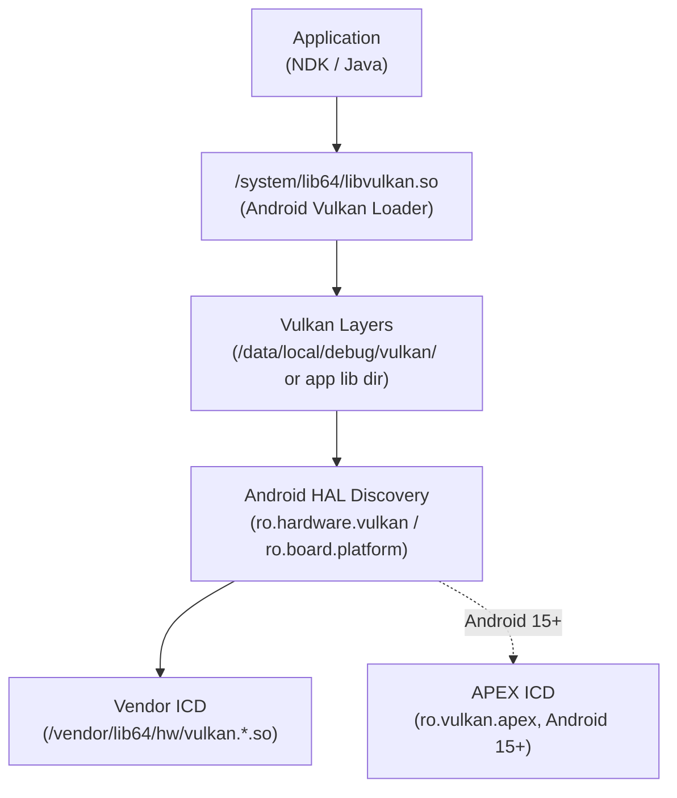
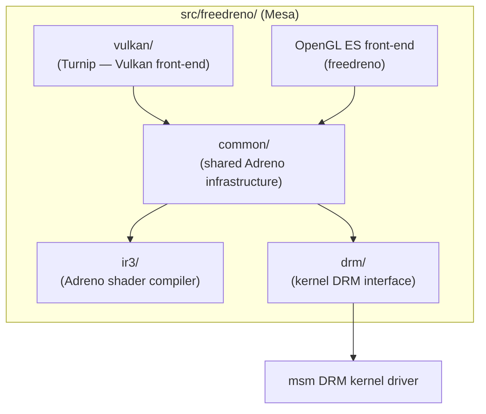
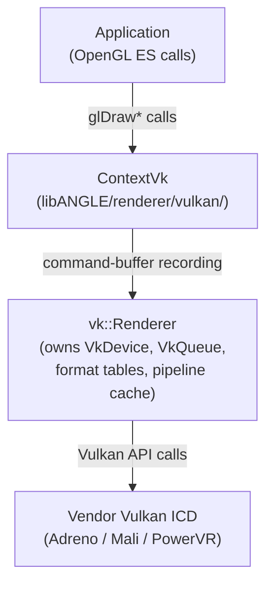
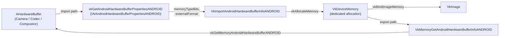
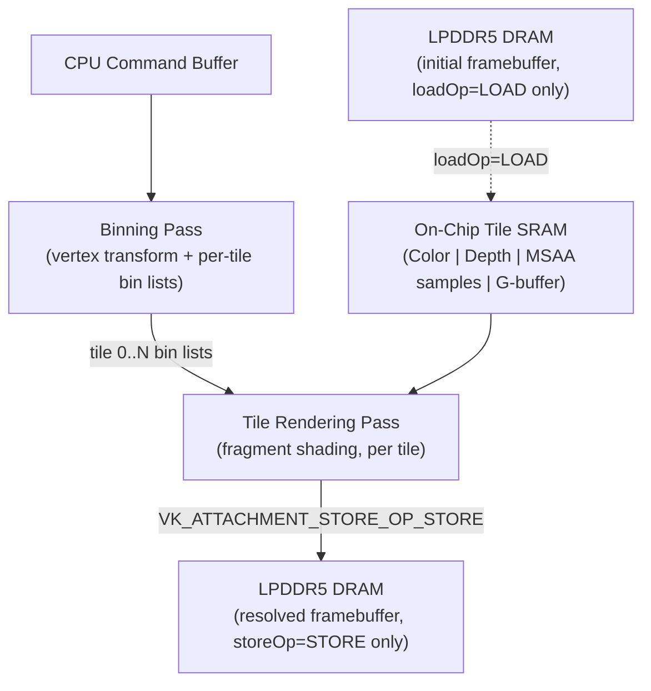
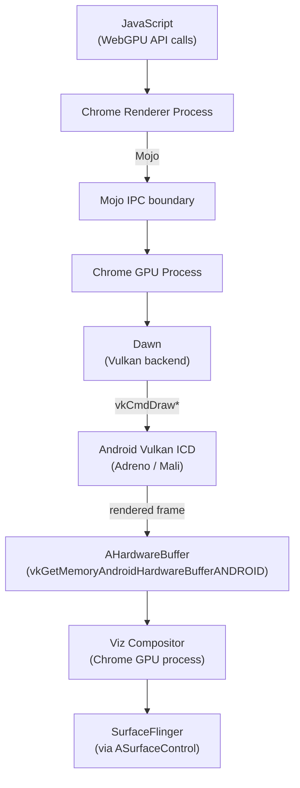

# Chapter 86 — Vulkan on Android: Drivers, ANGLE, Mesa, and Mobile GPU Performance

> **Audiences:** Graphics application developers targeting Android with Vulkan or OpenGL ES; systems developers who want to understand the mobile GPU driver stack; browser engineers working on Chrome's GPU process for Android.

---

## Table of Contents

1. [Android Vulkan Requirements and History](#1-android-vulkan-requirements-and-history)
2. [The Android Vulkan Loader](#2-the-android-vulkan-loader)
3. [GPU Vendor Drivers on Android](#3-gpu-vendor-drivers-on-android)
4. [Mesa on Android — Turnip and freedreno](#4-mesa-on-android--turnip-and-freedreno)
5. [ANGLE on Android](#5-angle-on-android)
6. [AHardwareBuffer and Vulkan Interop](#6-ahardwarebuffer-and-vulkan-interop)
7. [Android-Specific Vulkan Extensions](#7-android-specific-vulkan-extensions)
8. [Shader Compilation on Android](#8-shader-compilation-on-android)
9. [Memory Management on Mobile](#9-memory-management-on-mobile)
10. [Mobile GPU Architecture — Tile-Based Deferred Rendering](#10-mobile-gpu-architecture--tile-based-deferred-rendering)
11. [Android GPU Performance Tools](#11-android-gpu-performance-tools)
12. [Chrome and Chromium on Android](#12-chrome-and-chromium-on-android)
13. [Integrations](#13-integrations)

---

## 1. Android Vulkan Requirements and History

Android was one of the earliest mainstream platforms to mandate **Vulkan** as a first-class graphics API, turning the Linux graphics stack's investment in **Vulkan** into a mobile-scale deployment overnight. This chapter surveys the full Android Vulkan ecosystem: version requirements, the platform loader, vendor drivers, open-source alternatives, the translation layer, buffer interop, platform-specific extensions, shader compilation, memory management, GPU architecture, performance tooling, and Chrome's integration with the Android GPU stack.

Section 1 (this section) covers the version mandate history — from optional **Vulkan 1.0** in **Android 7.0 Nougat** to the required **Vulkan 1.1** floor on 64-bit devices in **Android 10**, and the **Android Vulkan Profiles** (**AVP**) that define guaranteed feature floors per year (AVP 2021, AVP 2022, AVP 2025).

Section 2 examines the **Android Vulkan Loader** (`/system/lib64/libvulkan.so`), which differs substantially from the Khronos desktop loader. It covers ICD enumeration via **Android HAL** system properties (`ro.hardware.vulkan`, `ro.board.platform`), the **`hwvulkan_device_t`** HAL interface (exporting **`EnumerateInstanceExtensionProperties()`**, **`CreateInstance()`**, **`GetInstanceProcAddr()`**), Vulkan layer loading rules for debuggable versus non-debuggable apps, **APEX** package delivery of ICDs (since **Android 15** via `ro.vulkan.apex`), and loader thread safety.

Section 3 surveys the three dominant GPU vendors shipping proprietary **Vulkan** ICDs on Android: **Qualcomm Adreno** (Snapdragon, **Adreno 740**, **Adreno 830**), **ARM Mali** (G-series, **Mali-G715**), and **Imagination PowerVR**. It describes structural properties common to all proprietary Android drivers: closed-source binaries in `/vendor`, vendor-proprietary shader IR (not **NIR** or **LLVM IR**), and tight kernel-driver coupling (e.g. the `msm`, `mali`, and `pvr` kernel modules).

Section 4 covers **Mesa**'s open-source drivers for **Qualcomm Adreno** hardware: **freedreno** (OpenGL ES) and **Turnip** (Vulkan), both communicating with the **`msm`** DRM kernel driver. It explains how to build **Mesa** for Android using **`Android.bp`** and **meson**, walks through the **`src/freedreno/`** source tree (including the **`ir3/`** shader compiler and **`src/freedreno/vulkan/`** Turnip front-end), shows runtime detection via **`VK_DRIVER_ID_MESA_TURNIP`** and **`vkGetPhysicalDeviceProperties2()`**, and describes Turnip's widespread adoption in the emulator ecosystem.

Section 5 covers **ANGLE** (Almost Native Graphics Layer Engine), which translates **OpenGL ES** calls into **Vulkan** on Android. It explains **ANGLE**'s evolution into the system GLES driver on Pixel devices, **APEX** delivery via `com.android.angle`, how to enable **ANGLE** per-app via **ADB** or the Android 17+ manifest `<meta-data>` opt-in, the internal architecture built around **`vk::Renderer`** and **`ContextVk`**, and the **`EGL_ANDROID_GLES_layers`** debug layer mechanism.

Section 6 addresses **`AHardwareBuffer`** and **Vulkan** interop via **`VK_ANDROID_external_memory_android_hardware_buffer`**. It covers the import and export paths (**`vkGetAndroidHardwareBufferPropertiesANDROID()`**, **`vkGetMemoryAndroidHardwareBufferANDROID()`**), key structs (**`VkAndroidHardwareBufferPropertiesANDROID`**, **`VkImportAndroidHardwareBufferInfoANDROID`**, **`VkExternalFormatANDROID`**, **`VkAndroidHardwareBufferFormatPropertiesANDROID`**), a complete camera-frame-to-**`VkImage`** import workflow using **`VkMemoryDedicatedAllocateInfo`**, **YUV** camera formats and **`VkSamplerYcbcrConversion`**, and the reverse export path from **`VkImage`** to **`AHardwareBuffer`**.

Section 7 catalogues Android-specific **Vulkan** extensions: **`VK_KHR_android_surface`** and **`ANativeWindow`** for swapchain creation; **`VK_ANDROID_external_memory_android_hardware_buffer`** (guaranteed in AVP 2022); **`VK_ANDROID_external_format_resolve`** for in-tile **YCbCr** resolve; **`VK_EXT_swapchain_colorspace`** for wide-gamut and **HDR** display (guaranteed in AVP 2021); **`VK_GOOGLE_display_timing`** (**`vkGetRefreshCycleDurationGOOGLE()`**, **`vkGetPastPresentationTimingGOOGLE()`**) used by the **Android Frame Pacing** library (**Swappy**); **`VK_KHR_present_wait`** / **`VK_KHR_present_id`** for back-pressure control; and **`VK_QCOM_render_pass_transform`** for pre-rotation to avoid **DPU** bandwidth penalties.

Section 8 covers shader compilation on Android: **SPIR-V** is mandatory for **`vkCreateShaderModule()`** (no runtime GLSL path). It explains ahead-of-time compilation with **`glslc`** (bundled in the **NDK** under `<ndk>/shader-tools/`), runtime GLSL-to-SPIR-V compilation with the **`shaderc`** C++ library, deploying **`VK_LAYER_KHRONOS_validation`** on Android (APK bundle, `/data/local/debug/vulkan/`, or Play Store delivery), and the **SPIR-V** capability constraints imposed by the **AVP** profiles.

Section 9 addresses memory management under Android's unified-memory topology (no discrete VRAM; **CPU** and **GPU** share **LPDDR5** or **LPDDR5X**). It covers the simplified **`VkPhysicalDeviceMemoryProperties`** heap structure on Android, **`VK_MEMORY_PROPERTY_LAZILY_ALLOCATED_BIT`** for **MSAA** transient attachments that never leave on-chip tile **SRAM**, `VK_IMAGE_USAGE_TRANSIENT_ATTACHMENT_BIT`, optimal **MSAA** render pass patterns (`VK_ATTACHMENT_STORE_OP_DONT_CARE`), and using **VMA** (`VMA_MEMORY_USAGE_GPU_LAZILY_ALLOCATED`) to handle lazy allocation portably.

Section 10 explains **Tile-Based Deferred Rendering** (**TBDR**), the universal architecture of **Qualcomm Adreno**, **ARM Mali**, and **Imagination PowerVR** GPUs, contrasting it with the Immediate Mode Rendering (**IMR**) of desktop GPUs (**RDNA**, **Arc**, **NVIDIA**). It covers the binning pass / rendering pass split and the role of on-chip tile **SRAM**, maps **`loadOp`**/**`storeOp`** declarations in **`VkRenderPass`** to DRAM bandwidth, explains why explicit **`VkRenderPass`** objects remain important on mobile despite **`VK_KHR_dynamic_rendering`**, describes subpass merging for deferred renderers, and introduces **`VK_EXT_multisampled_render_to_single_sampled`** as a simplified MSAA path on **TBDR** hardware.

Section 11 surveys Android GPU performance tools: **Snapdragon Profiler** for **Adreno** hardware-counter and timeline analysis; **ARM Performance Studio** (including **Streamline**, **Graphics Analyzer**, and **Frame Advisor**) for **Mali**; **Android GPU Inspector** (**AGI**) (and its successor **Android Performance Analyzer** (**APA**)) for cross-vendor frame capture via Vulkan layer APK and **Perfetto**-based system profiling; the **Perfetto** GPU counter track (Android 12+); and **GFXReconstruct** for portable Vulkan API stream capture and replay.

Section 12 covers **Chrome** and **Chromium** on Android: **ANGLE**-on-**Vulkan** as Chrome's **OpenGL ES** backend, **WebGPU** shipping in Chrome 121 (Android 12+) via **Dawn**'s **Vulkan** backend with frames shared via **`AHardwareBuffer`** through **Mojo** IPC to the **Viz** compositor and on to **SurfaceFlinger** via **`ASurfaceControl`**, **WebGPU** compatibility mode on OpenGL ES 3.1 for older devices, and a comparison table of the Android GPU process versus the desktop (**GBM**, **DMA-BUF**, **DRM/KMS**) equivalent.

### Version milestones

**Android 7.0 Nougat (2016)** introduced the Vulkan 1.0 API as an optional feature. Devices that implemented it were required to expose the `android.hardware.vulkan.level` and `android.hardware.vulkan.version` feature flags so that the package manager could signal availability to apps. However, Nougat devices were not *required* to ship Vulkan hardware support; the feature was additive.

**Android 10 Q (2019)** changed the calculus: all 64-bit Android 10 devices that are not classified as "low memory" must support Vulkan 1.1 or higher. This is the hardware-mandate that matters in practice — at Android 10 the API surface is guaranteed on the vast majority of shipping handsets. [Source: Android Implement Vulkan](https://source.android.com/docs/core/graphics/implement-vulkan)

The requirement schedule from official AOSP documentation is:

| Android Version | Minimum Vulkan Version |
|---|---|
| 7.0–9.0 | Vulkan 1.0 (optional) |
| 10–12 | Vulkan 1.1 (required on 64-bit non-low-memory) |
| 13–15 | Vulkan 1.3 (per AOSP implement-vulkan docs; Google's stated target) |
| 16+ | Vulkan 1.4 (per AOSP implement-vulkan docs; Google's stated target) |

Devices declare compliance by copying the appropriate feature-XML into `PRODUCT_COPY_FILES`, for example:

```bash
# From a device's BoardConfig.mk (AOSP pattern)
PRODUCT_COPY_FILES += \
    frameworks/native/data/etc/android.hardware.vulkan.version-1_3.xml:$(TARGET_COPY_OUT_VENDOR)/etc/permissions/android.hardware.vulkan.version-1_3.xml
```

[Source: AOSP Implement Vulkan](https://source.android.com/docs/core/graphics/implement-vulkan)

### Android Vulkan Profiles (formerly Baseline Profiles)

Khronos and Google maintain *Android Vulkan Profiles* (AVP, previously called Android Baseline Profiles or ABP) that define a guaranteed feature floor per year, enabling developers to write to a stable capability set rather than querying every feature individually. As of 2025 the landscape is:

| Profile | Device coverage | Vulkan version | Notable additions |
|---|---|---|---|
| AVP 2021 | 95.5 % | 1.0 | ASTC/ETC, `VK_EXT_swapchain_colorspace` |
| AVP 2022 | 86.5 % | 1.1 | `shaderInt16`, `VK_ANDROID_external_memory_android_hardware_buffer`, `VK_KHR_driver_properties` |
| AVP 2025 | 80.1 % | — | `VK_KHR_external_memory_fd`, `VK_KHR_vulkan_memory_model`, extended pixel formats |

[Source: Android Vulkan Profiles documentation](https://developer.android.com/ndk/guides/graphics/android-vulkan-profile)

---

## 2. The Android Vulkan Loader

Android ships its own Vulkan loader, distinct from the Khronos desktop loader used on Linux desktops. Understanding the differences clarifies why Android Vulkan setup differs from a desktop `VK_LAYER_PATH` environment.

### Loader location and source

The loader is compiled into `/system/lib64/libvulkan.so` (and `/system/lib/libvulkan.so` for 32-bit). Its source lives at:

```
platform/frameworks/native/vulkan/
  libvulkan/   ← core loader implementation
  nulldrv/     ← stub ICD used in testing
  vkjson/      ← JSON utilities for device properties
  vkprofiles/  ← Android Vulkan Profile support
  scripts/     ← code generator (code_generator.py)
```

[Source: Android Vulkan loader AOSP](https://android.googlesource.com/platform/frameworks/native/+/refs/heads/main/vulkan/)

The Android loader is lean compared to the Khronos desktop loader — it does not need to handle multiple ICDs (only one driver is ever active) and it integrates directly with the Android HAL discovery mechanism.



### ICD enumeration

The loader searches for the driver `.so` using the Android HAL path convention, probing two system properties in order:

```
/vendor/lib64/hw/vulkan.<ro.hardware.vulkan>.so
/vendor/lib64/hw/vulkan.<ro.board.platform>.so
```

(32-bit variants under `/vendor/lib/hw/`.) The loader opens the first file that exists and calls `open()` with the constant string `HWVULKAN_DEVICE_0` to obtain the `hw_device_t`. Only one ICD is supported per device. This is a deliberate simplification — Android hardware always ships exactly one GPU, so the multiple-ICD discovery loop the desktop loader maintains adds unnecessary complexity.

Since **Android 15** the loader also supports loading a Vulkan ICD from an APEX package by reading the `ro.vulkan.apex` system property. When set, the loader looks inside the named APEX module rather than in `/vendor`. [Source: AOSP implement-vulkan](https://source.android.com/docs/core/graphics/implement-vulkan)

### HAL interface

The `hw_device_t` the loader opens is a `hwvulkan_device_t` that exports exactly three entry points as defined in `vulkan/include/hardware/hwvulkan.h` in the frameworks/native tree:

```c
// From hwvulkan_device_t (platform/frameworks/native/vulkan/include/hardware/hwvulkan.h)
EnumerateInstanceExtensionProperties()
CreateInstance()
GetInstanceProcAddr()
```

All other Vulkan functions are discovered dynamically via `GetInstanceProcAddr()` / `vkGetDeviceProcAddr()`. This keeps the HAL ABI minimal and stable across driver updates. Any non-trivial resource allocation should be deferred to `vkCreateInstance` rather than performed when the `hwvulkan_device_t` is opened. [Source: hwvulkan.h in AOSP frameworks/native](https://android.googlesource.com/platform/frameworks/native/+/master/vulkan/include/hardware/hwvulkan.h)

### Layer loading

How layers are discovered depends on app debuggability:

- **Debuggable apps** (or apps with `android:debuggable="true"`): the loader also searches `/data/local/debug/vulkan/` for layer libraries. This path is writable without root on debuggable builds, making it the standard location to push `libVkLayer_khronos_validation.so` during development.
- **Non-debuggable apps**: the loader searches *only* the app's own native library directory (`/data/app/.../lib/`), preventing injection attacks. Layer names must match the pattern `libVKLayer_*.so`.
- **Since Android 10**: an additional APK-layer mechanism allows loading layers from a separate "layer APK" installed alongside the target app. This is how tools like Android GPU Inspector inject their capture layers into released builds when the device is in developer mode. [Source: AOSP implement-vulkan](https://source.android.com/docs/core/graphics/implement-vulkan)

### Thread safety

The Android Vulkan loader delegates thread safety to the underlying driver, consistent with the Vulkan specification's external-synchronisation requirements for objects. Applications must not call `vkCreateInstance` or `vkDestroyInstance` concurrently from multiple threads without external synchronisation.

---

## 3. GPU Vendor Drivers on Android

Three silicon vendors account for virtually all Android GPU hardware. Each ships a proprietary Vulkan ICD that is tightly coupled to their hardware micro-architecture.

### Qualcomm Adreno

Qualcomm's Adreno GPU family powers the Snapdragon SoC line. On shipping devices the proprietary Vulkan ICD lands in the vendor partition as `libvulkan_adreno.so` (name varies by platform). The Snapdragon 8 Gen 3 (Adreno 740) and Snapdragon 8 Elite (Adreno 830) support Vulkan 1.3.

Adreno drivers are widely regarded as the best-performing proprietary Vulkan implementation on Android, with strong support for Vulkan extensions, good conformance test pass rates, and aggressive tile-based deferred rendering (TBDR) optimisations (discussed in Section 10). Qualcomm publishes detailed Vulkan best-practice guidance for Adreno via the Snapdragon Game Toolkit. [Source: Qualcomm Snapdragon Game Toolkit](https://docs.qualcomm.com/bundle/publicresource/topics/80-78185-2/mobile_best_practices.html)

### ARM Mali

ARM's Mali GPU series ships in MediaTek Dimensity and some Samsung Exynos SoCs. The proprietary Vulkan ICD supports Vulkan 1.1 on older G-series parts and Vulkan 1.2 on recent cores such as the Mali-G715 (found in Dimensity 9200). Mali's driver is closed-source and updated through OEM firmware; unlike desktop discrete GPUs, Mali driver versions are tied to Android system image releases.

ARM publishes Mali best practices through their Arm Performance Studio toolchain and the older PerfDoc layer (now merged into the Khronos validation layer). Key guidance for Mali Vulkan includes explicit render pass structuring to enable hardware early-Z and the Hidden Surface Removal (HSR) engine. [Source: Arm Performance Studio](https://developer.arm.com/Tools%20and%20Software/Arm%20Performance%20Studio%20for%20Mobile)

### Imagination PowerVR

Imagination Technologies' PowerVR GPUs appear in some Android TV and embedded Android devices. The proprietary Vulkan driver supports Vulkan 1.0–1.1 depending on generation. Note: vendor-specific Vulkan version data for PowerVR on specific Android devices is not well-documented in public sources — readers should query `VkPhysicalDeviceProperties.apiVersion` at runtime.

### Characteristics common to all proprietary Android drivers

All three families differ from desktop Mesa in important structural ways:

1. **No open source**: the driver `.so` is a pre-compiled binary in `/vendor`. OEMs bear responsibility for updating it, which in practice means driver bugs may persist for the lifetime of a device.
2. **Vendor-specific shader IR**: none use Mesa's NIR or LLVM IR pipelines. Each vendor maintains a proprietary front-end that compiles SPIR-V directly to their own intermediate representation.
3. **Kernel driver coupling**: the userspace `.so` depends on a specific version of the kernel GPU driver (e.g. `msm`, `mali`, `pvr`). Cross-version compatibility is not guaranteed, which is why the kernel driver and userspace ICD are always co-versioned within the same vendor image.

---

## 4. Mesa on Android — Turnip and freedreno

Alongside the proprietary ecosystem, Mesa's open-source drivers provide a Vulkan path on Qualcomm Adreno hardware, with implications for emulators, reference platforms, and eventually shipping products.

### freedreno and Turnip

**freedreno** is Mesa's OpenGL ES driver for Adreno GPUs, supporting OpenGL ES 3.2 and desktop OpenGL 4.5 across Adreno 2xx–6xx. **Turnip** is Mesa's Vulkan driver for Adreno, built on top of the same kernel interface that freedreno uses. Both drivers communicate with the `msm` DRM kernel driver. [Source: Mesa freedreno documentation](https://docs.mesa3d.org/drivers/freedreno.html)

Turnip targets Adreno 6xx and 7xx GPUs. From the official Mesa documentation:

> "Turnip is a Vulkan 1.3 driver for Adreno 6xx GPUs."

Adreno 7xx support was merged in 2023 (A730, A740 initially). By 2024–2025 the A750 was also supported, and work on mesh shaders and ray tracing had begun for newer Adreno generations. The Adreno 830 (Snapdragon 8 Elite, 2024) introduced significant architectural changes and Turnip support for that generation was still under active development as of mid-2026.

Turnip achieved **Vulkan 1.1 conformance** (Adreno 618) in 2021, establishing it as the first fully conformant open-source mobile Vulkan driver. By 2022 Turnip was advertising Vulkan 1.3 support. [Source: Phoronix Turnip 1.1 conformance](https://www.phoronix.com/news/TURNIP-Vulkan-1.1-Conformance) [Source: FOSDEM 2024 Turnip talk](https://archive.fosdem.org/2024/schedule/event/fosdem-2024-2033-turnip-update-on-open-source-vulkan-driver-for-adreno-gpus/)

### Building Mesa for Android

Mesa's Android build uses the `Android.bp` build-system files. To build Turnip for an AArch64 Android target:

```bash
# From the Mesa source root
# https://gitlab.freedesktop.org/mesa/mesa/-/blob/main/Android.mk
meson setup build-android \
    --cross-file=crossfiles/android-aarch64.ini \
    -Dgallium-drivers= \
    -Dvulkan-drivers=freedreno \
    -Dandroid-stub=true \
    -Dplatforms=android
ninja -C build-android
```

The resulting `vulkan.adreno.so` (or `libvulkan_freedreno.so`, naming depends on build configuration) can then be pushed to `/vendor/lib64/hw/` on a device with an unlocked bootloader or installed into a Magisk module for development use.

The freedreno source tree lives under:

```
src/freedreno/
  vulkan/    ← Turnip Vulkan front-end
  drm/       ← kernel DRM interface
  common/    ← shared Adreno infrastructure
  ir3/       ← Adreno shader compiler (ISA 3, covers a5xx–a7xx)
```



[Source: Mesa freedreno source](https://gitlab.freedesktop.org/mesa/mesa/-/tree/main/src/freedreno)

### Identifying Turnip at runtime

An application can confirm it is running on Turnip by checking the driver ID:

```cpp
// Requires VK_KHR_driver_properties (promoted to Vulkan 1.2 core)
VkPhysicalDeviceDriverProperties driverProps = {
    .sType = VK_STRUCTURE_TYPE_PHYSICAL_DEVICE_DRIVER_PROPERTIES,
};
VkPhysicalDeviceProperties2 props2 = {
    .sType = VK_STRUCTURE_TYPE_PHYSICAL_DEVICE_PROPERTIES_2,
    .pNext = &driverProps,
};
vkGetPhysicalDeviceProperties2(physicalDevice, &props2);

if (driverProps.driverID == VK_DRIVER_ID_MESA_TURNIP) {
    // Open-source Turnip driver on Adreno
}
```

`VK_DRIVER_ID_MESA_TURNIP` is defined in `<vulkan/vulkan_core.h>`. The corresponding driver name string is `"Turnip"` and the conformance version reflects the CTS version Turnip was tested against.

### Turnip's use in the emulator ecosystem

Beyond direct hardware use, Turnip has found widespread adoption in Nintendo Switch and PlayStation 2/3 emulators running on Android (FEX + Turnip for x86-translated games, Yuzu/Suyu for Switch). This usage drives significant real-world testing of Turnip's Vulkan 1.3 feature support. [Source: Pocketgaming 2026 guide](https://pocket-gaming.org/2026/06/15/the-definitive-guide-to-android-turnip-drivers-hardware-compatibility-2026/)

---

## 5. ANGLE on Android

ANGLE (Almost Native Graphics Layer Engine) translates OpenGL ES API calls into Vulkan, Metal, or Direct3D. On Android it has evolved from a debugging aid into a core component of the OS graphics stack.

### ANGLE as the system OpenGL ES driver

Google has progressively replaced the vendor-provided OpenGL ES driver with ANGLE on Pixel devices. The rationale is compelling: ANGLE, running on top of the vendor's Vulkan ICD, is easier to update out-of-band (via Play Store APEX delivery) than the proprietary GLES driver baked into the system image.

- **Android 15+**: ANGLE ships as an optional GLES layer. Users and developers can opt in.
- **Android 17+**: Applications can signal preference for ANGLE via a manifest `<meta-data>` tag (see below).
- Longer-term trajectory: Google has stated that OpenGL ES on Android will eventually be available only through ANGLE on Vulkan.

[Source: Android Vulkan Overview](https://developer.android.com/games/develop/vulkan/overview)

### APEX delivery

Since Android 15, the Vulkan loader (`libvulkan.so`) supports loading an ICD from an APEX package by reading `ro.vulkan.apex`. The same APEX mechanism also delivers ANGLE, allowing the GLES implementation to be updated independently of the system partition via `com.android.angle` APEX. [Source: AOSP implement-vulkan](https://source.android.com/docs/core/graphics/implement-vulkan)

### Enabling ANGLE

**Developer option (ADB):**

```bash
# Force ANGLE for a specific package
adb shell settings put global angle_gl_driver_selection_pkgs com.example.myapp
adb shell settings put global angle_gl_driver_selection_values angle

# Remove the override
adb shell settings delete global angle_gl_driver_selection_pkgs
adb shell settings delete global angle_gl_driver_selection_values
```

**Manifest opt-in (Android 17+):**

```xml
<!-- AndroidManifest.xml -->
<application android:appCategory="game">
    <meta-data
        android:name="com.android.graphics.driver.prefer_angle"
        android:value="true" />
</application>
```

[Source: Android Vulkan overview](https://developer.android.com/games/develop/vulkan/overview)

### ANGLE architecture on Android

ANGLE's Vulkan backend (`libANGLE/renderer/vulkan/`) is structured around two central classes:

- **`vk::Renderer`**: represents the `EGLDisplay`. Owns the `VkDevice`, `VkQueue`, format tables, and shared pipeline-cache objects.
- **`ContextVk`**: implements the OpenGL ES rendering context backend. Translates `glDraw*` calls into Vulkan command-buffer recording.

The backend maintains an explicit render-pass state machine (unstarted, active, inactive) and accumulates Vulkan image/buffer barriers before recording, enabling it to batch barrier transitions efficiently. [Source: ANGLE Vulkan backend README](https://github.com/google/angle/blob/main/src/libANGLE/renderer/vulkan/README.md)



### ANGLE debug layers: EGL_ANDROID_GLES_layers

The `EGL_ANDROID_GLES_layers` extension (Android 10+) allows inserting OpenGL ES debug layers between an app and ANGLE, mirroring Vulkan's layer mechanism. This is used by the Android GPU Inspector and vendor tools to intercept GLES calls for tracing and profiling without modifying the application.

---

## 6. AHardwareBuffer and Vulkan Interop

`AHardwareBuffer` is Android's cross-subsystem buffer type, used for zero-copy sharing between the camera, codec, compositor, and GPU. Vulkan's Android-specific external-memory extension is the bridge between these two worlds.

### Extension overview

`VK_ANDROID_external_memory_android_hardware_buffer` (promoted into AVP 2022 as a guaranteed feature) provides:

- **Import**: wrap an existing `AHardwareBuffer` as a `VkDeviceMemory`, then bind it to a `VkImage`.
- **Export**: allocate a `VkDeviceMemory` that backs an `AHardwareBuffer`, retrievable with `vkGetMemoryAndroidHardwareBufferANDROID`.

All relevant types are defined in `<vulkan/vulkan_android.h>`. [Source: Khronos Vulkan-Headers](https://raw.githubusercontent.com/KhronosGroup/Vulkan-Headers/main/include/vulkan/vulkan_android.h)



### Key struct definitions

```c
// vulkan/vulkan_android.h

typedef struct VkAndroidHardwareBufferPropertiesANDROID {
    VkStructureType    sType;     // VK_STRUCTURE_TYPE_ANDROID_HARDWARE_BUFFER_PROPERTIES_ANDROID
    void*              pNext;
    VkDeviceSize       allocationSize;  // size in bytes required for the allocation
    uint32_t           memoryTypeBits; // bitmask of compatible memory types
} VkAndroidHardwareBufferPropertiesANDROID;

typedef struct VkAndroidHardwareBufferFormatPropertiesANDROID {
    VkStructureType                  sType;
    void*                            pNext;
    VkFormat                         format;           // VK_FORMAT_UNDEFINED for opaque formats
    uint64_t                         externalFormat;   // opaque handle for driver-internal format
    VkFormatFeatureFlags             formatFeatures;
    VkComponentMapping               samplerYcbcrConversionComponents;
    VkSamplerYcbcrModelConversion    suggestedYcbcrModel;
    VkSamplerYcbcrRange              suggestedYcbcrRange;
    VkChromaLocation                 suggestedXChromaOffset;
    VkChromaLocation                 suggestedYChromaOffset;
} VkAndroidHardwareBufferFormatPropertiesANDROID;

typedef struct VkImportAndroidHardwareBufferInfoANDROID {
    VkStructureType            sType;  // VK_STRUCTURE_TYPE_IMPORT_ANDROID_HARDWARE_BUFFER_INFO_ANDROID
    const void*                pNext;
    struct AHardwareBuffer*    buffer; // the AHardwareBuffer to import
} VkImportAndroidHardwareBufferInfoANDROID;

typedef struct VkExternalFormatANDROID {
    VkStructureType    sType;
    void*              pNext;
    uint64_t           externalFormat;  // value from VkAndroidHardwareBufferFormatPropertiesANDROID
} VkExternalFormatANDROID;

typedef struct VkMemoryGetAndroidHardwareBufferInfoANDROID {
    VkStructureType    sType;
    const void*        pNext;
    VkDeviceMemory     memory; // memory object to export
} VkMemoryGetAndroidHardwareBufferInfoANDROID;
```

### Function signatures

```c
// Query memory requirements and format properties
VKAPI_ATTR VkResult VKAPI_CALL vkGetAndroidHardwareBufferPropertiesANDROID(
    VkDevice                                    device,
    const struct AHardwareBuffer*               buffer,
    VkAndroidHardwareBufferPropertiesANDROID*   pProperties);

// Export a VkDeviceMemory as an AHardwareBuffer
VKAPI_ATTR VkResult VKAPI_CALL vkGetMemoryAndroidHardwareBufferANDROID(
    VkDevice                                             device,
    const VkMemoryGetAndroidHardwareBufferInfoANDROID*   pInfo,
    struct AHardwareBuffer**                             pBuffer);
```

[Source: vulkan_android.h in KhronosGroup/Vulkan-Headers](https://raw.githubusercontent.com/KhronosGroup/Vulkan-Headers/main/include/vulkan/vulkan_android.h)

### Complete camera-frame-to-Vulkan-texture import

The following demonstrates the full workflow for importing an `AHardwareBuffer` obtained from the Android Camera2 `ImageReader` (which vends `YUV_420_888` frames) into a `VkImage` for sampling in a fragment shader.

```cpp
// File: vulkan_ahardwarebuffer_import.cpp
// Requires: Android API 28+, VK_ANDROID_external_memory_android_hardware_buffer

#include <android/hardware_buffer.h>  // AHardwareBuffer NDK API
#include <vulkan/vulkan.h>
#include <vulkan/vulkan_android.h>

VkImage    g_image;
VkDeviceMemory g_memory;

void ImportCameraFrameToVulkan(
        VkDevice           device,
        VkPhysicalDevice   physDevice,
        AHardwareBuffer*   ahb)
{
    // Step 1: Acquire a reference so the buffer stays alive during import
    AHardwareBuffer_acquire(ahb);

    // Step 2: Query buffer description for width/height/format
    AHardwareBuffer_Desc bufDesc;
    AHardwareBuffer_describe(ahb, &bufDesc);

    // Step 3: Chain format-properties query into the properties call
    VkAndroidHardwareBufferFormatPropertiesANDROID fmtProps = {
        .sType = VK_STRUCTURE_TYPE_ANDROID_HARDWARE_BUFFER_FORMAT_PROPERTIES_ANDROID,
        .pNext = nullptr,
    };
    VkAndroidHardwareBufferPropertiesANDROID bufProps = {
        .sType = VK_STRUCTURE_TYPE_ANDROID_HARDWARE_BUFFER_PROPERTIES_ANDROID,
        .pNext = &fmtProps,  // chain in format query
    };
    vkGetAndroidHardwareBufferPropertiesANDROID(device, ahb, &bufProps);
    // bufProps.memoryTypeBits: which heap types accept this buffer
    // fmtProps.externalFormat: opaque driver format (used for YCbCr)
    // fmtProps.suggestedYcbcrModel / suggestedYcbcrRange: for sampler conversion

    // Step 4: Create the VkImage with external-memory flag
    // For camera YUV, format == VK_FORMAT_UNDEFINED; use externalFormat instead
    VkExternalFormatANDROID extFmt = {
        .sType          = VK_STRUCTURE_TYPE_EXTERNAL_FORMAT_ANDROID,
        .pNext          = nullptr,
        .externalFormat = fmtProps.externalFormat,  // opaque YCbCr format
    };
    VkExternalMemoryImageCreateInfo extMemInfo = {
        .sType       = VK_STRUCTURE_TYPE_EXTERNAL_MEMORY_IMAGE_CREATE_INFO,
        .pNext       = &extFmt,
        .handleTypes = VK_EXTERNAL_MEMORY_HANDLE_TYPE_ANDROID_HARDWARE_BUFFER_BIT_ANDROID,
    };
    VkImageCreateInfo imgCI = {
        .sType         = VK_STRUCTURE_TYPE_IMAGE_CREATE_INFO,
        .pNext         = &extMemInfo,
        .imageType     = VK_IMAGE_TYPE_2D,
        .format        = VK_FORMAT_UNDEFINED,  // opaque external format
        .extent        = { bufDesc.width, bufDesc.height, 1 },
        .mipLevels     = 1,
        .arrayLayers   = 1,
        .samples       = VK_SAMPLE_COUNT_1_BIT,
        .tiling        = VK_IMAGE_TILING_OPTIMAL,
        .usage         = VK_IMAGE_USAGE_SAMPLED_BIT,
        .sharingMode   = VK_SHARING_MODE_EXCLUSIVE,
        .initialLayout = VK_IMAGE_LAYOUT_UNDEFINED,
    };
    vkCreateImage(device, &imgCI, nullptr, &g_image);

    // Step 5: Allocate VkDeviceMemory importing the AHardwareBuffer.
    // Importing a non-BLOB AHardwareBuffer (e.g. camera YUV image) requires a
    // DEDICATED allocation — VUID-VkMemoryAllocateInfo-pNext-02386 mandates
    // VkMemoryDedicatedAllocateInfo in the chain when importing an image-backed AHB.
    VkImportAndroidHardwareBufferInfoANDROID importInfo = {
        .sType  = VK_STRUCTURE_TYPE_IMPORT_ANDROID_HARDWARE_BUFFER_INFO_ANDROID,
        .pNext  = nullptr,
        .buffer = ahb,
    };
    // Dedicated allocation: ties the memory object to exactly g_image
    VkMemoryDedicatedAllocateInfo dedicated = {
        .sType  = VK_STRUCTURE_TYPE_MEMORY_DEDICATED_ALLOCATE_INFO,
        .pNext  = &importInfo,   // import info chained behind dedicated
        .image  = g_image,       // must match the image created in Step 4
        .buffer = VK_NULL_HANDLE,
    };
    // Pick the lowest-index memory type that satisfies memoryTypeBits
    uint32_t memTypeIdx = __builtin_ctz(bufProps.memoryTypeBits);
    VkMemoryAllocateInfo allocInfo = {
        .sType           = VK_STRUCTURE_TYPE_MEMORY_ALLOCATE_INFO,
        .pNext           = &dedicated,            // ← dedicated + import chained here
        .allocationSize  = bufProps.allocationSize,
        .memoryTypeIndex = memTypeIdx,
    };
    vkAllocateMemory(device, &allocInfo, nullptr, &g_memory);

    // Step 6: Bind memory to image
    vkBindImageMemory(device, g_image, g_memory, /*offset=*/0);

    // Step 7 (not shown): create VkSamplerYcbcrConversion using
    // fmtProps.suggestedYcbcrModel, suggestedYcbcrRange,
    // samplerYcbcrConversionComponents, externalFormat
    // Then use that conversion in VkSampler + VkImageView for sampling.

    // The AHardwareBuffer reference is now held by the VkDeviceMemory.
    // Release the local reference acquired in step 1.
    AHardwareBuffer_release(ahb);
}
```

When finished, `vkFreeMemory` releases the implementation's reference on the `AHardwareBuffer`.

### YUV camera formats and VkExternalFormatANDROID

Camera frames in `AHARDWAREBUFFER_FORMAT_Y8Cb8Cr8_420` (YUV 4:2:0) cannot be represented as a standard `VkFormat`. The driver exposes an *external format* opaque handle via `fmtProps.externalFormat`. A `VkSamplerYcbcrConversion` must be created with that external format and the `suggested*` fields from `VkAndroidHardwareBufferFormatPropertiesANDROID` to perform the YCbCr→RGB conversion in the sampler. `VkExternalFormatANDROID` carries this handle through the image-creation and sampler-creation chains.

### Reverse direction: VkImage → AHardwareBuffer export

To produce an `AHardwareBuffer` that the Android media or compositor stack can consume, the memory object backing the image must also use a dedicated allocation:

```cpp
// Step 1: create the exportable VkImage first (same as import but without external format)
// ... vkCreateImage with VkExternalMemoryImageCreateInfo in pNext chain ...

// Step 2: Allocate memory with dedicated allocation + export handle type
VkExportMemoryAllocateInfo exportInfo = {
    .sType       = VK_STRUCTURE_TYPE_EXPORT_MEMORY_ALLOCATE_INFO,
    .pNext       = nullptr,
    .handleTypes = VK_EXTERNAL_MEMORY_HANDLE_TYPE_ANDROID_HARDWARE_BUFFER_BIT_ANDROID,
};
VkMemoryDedicatedAllocateInfo dedicated = {
    .sType  = VK_STRUCTURE_TYPE_MEMORY_DEDICATED_ALLOCATE_INFO,
    .pNext  = &exportInfo,    // export info chained behind dedicated
    .image  = exportImage,    // the VkImage created above
    .buffer = VK_NULL_HANDLE,
};
VkMemoryAllocateInfo allocInfo = {
    .sType           = VK_STRUCTURE_TYPE_MEMORY_ALLOCATE_INFO,
    .pNext           = &dedicated,
    .allocationSize  = memReqs.size,
    .memoryTypeIndex = memTypeIdx,
};
vkAllocateMemory(device, &allocInfo, nullptr, &memory);
vkBindImageMemory(device, exportImage, memory, 0);

// Step 3: Retrieve the AHardwareBuffer
VkMemoryGetAndroidHardwareBufferInfoANDROID getInfo = {
    .sType  = VK_STRUCTURE_TYPE_MEMORY_GET_ANDROID_HARDWARE_BUFFER_INFO_ANDROID,
    .memory = memory,
};
AHardwareBuffer* exportedAhb;
vkGetMemoryAndroidHardwareBufferANDROID(device, &getInfo, &exportedAhb);
// exportedAhb can now be passed to MediaCodec, SurfaceTexture, etc.
```

The returned `AHardwareBuffer` holds a reference; the caller must call `AHardwareBuffer_release` when done.

---

## 7. Android-Specific Vulkan Extensions

Several Vulkan extensions exist specifically to integrate with Android platform primitives. Understanding which extensions are guaranteed (by the AVP profiles) versus optional is essential for portable Android Vulkan code.

### VK_KHR_android_surface

Creates the Vulkan surface from an `ANativeWindow*` — the native Android window handle. `ANativeWindow` is the producer end of a BufferQueue; the swapchain's presentation engine is the consumer.

```c
// vulkan_android.h
typedef struct VkAndroidSurfaceCreateInfoKHR {
    VkStructureType                   sType;  // VK_STRUCTURE_TYPE_ANDROID_SURFACE_CREATE_INFO_KHR
    const void*                       pNext;
    VkAndroidSurfaceCreateFlagsKHR    flags;  // reserved, must be 0
    struct ANativeWindow*             window; // the ANativeWindow to render into
} VkAndroidSurfaceCreateInfoKHR;

VKAPI_ATTR VkResult VKAPI_CALL vkCreateAndroidSurfaceKHR(
    VkInstance                                  instance,
    const VkAndroidSurfaceCreateInfoKHR*        pCreateInfo,
    const VkAllocationCallbacks*                pAllocator,
    VkSurfaceKHR*                               pSurface);
```

[Source: vulkan_android.h](https://raw.githubusercontent.com/KhronosGroup/Vulkan-Headers/main/include/vulkan/vulkan_android.h)

Usage in a game or app:

```cpp
// Obtain an ANativeWindow from the Java NativeActivity or SurfaceHolder
// android_app->window is the ANativeWindow* from the Android GameActivity
VkAndroidSurfaceCreateInfoKHR surfCI = {
    .sType  = VK_STRUCTURE_TYPE_ANDROID_SURFACE_CREATE_INFO_KHR,
    .window = app->window,  // from android_app struct (NDK)
};
VkSurfaceKHR surface;
vkCreateAndroidSurfaceKHR(instance, &surfCI, nullptr, &surface);
```

The swapchain then presents to the system compositor via this `ANativeWindow` reference. The compositor (SurfaceFlinger, described in Ch85) is the ultimate consumer of the swapchain images.

Note: `ANativeWindow` and `ASurfaceControl` serve distinct roles. `vkCreateAndroidSurfaceKHR` takes an `ANativeWindow*`, obtained from the Android GameActivity (`android_app->window`) or `SurfaceHolder.getSurface()`. `ASurfaceControl` is a separate, lower-level presentation path: instead of going through a swapchain, native code using `ASurfaceControl` submits `AHardwareBuffer`s directly to SurfaceFlinger via `ASurfaceTransaction_setBuffer`. This is the path Chrome's Viz compositor uses (Section 12), but it is distinct from the Vulkan swapchain path described here.

### VK_ANDROID_external_memory_android_hardware_buffer

Covered in depth in Section 6. This extension is part of AVP 2022, meaning it is guaranteed on all Android 12+ Vulkan devices. [Source: Android Vulkan Profiles](https://developer.android.com/ndk/guides/graphics/android-vulkan-profile)

### VK_ANDROID_external_format_resolve

This extension (promoted in Vulkan 1.3 maintenance) allows a render pass to resolve a multisampled attachment to an external-format (`VkExternalFormatANDROID`) single-sampled attachment directly, without requiring a separate copy pass or CPU-side YCbCr conversion. It is particularly useful for camera preview rendering where the destination must remain in YCbCr format for efficient display by the compositor.

### VK_EXT_swapchain_colorspace

Enables wide-gamut and HDR color spaces on Android displays. Guaranteed in AVP 2021. Applications targeting Display-P3 or BT.2020 colour spaces pass the desired `VkColorSpaceKHR` when creating the swapchain:

```cpp
VkSwapchainCreateInfoKHR swapCI = {
    // ...
    .imageColorSpace = VK_COLOR_SPACE_DISPLAY_P3_NONLINEAR_EXT,
};
```

### VK_GOOGLE_display_timing

Allows scheduling a `vkQueuePresentKHR` call to occur no earlier than a target display time (nanoseconds), aligned to Vsync boundaries. The Android Frame Pacing library (Swappy) uses this extension internally to align frame submissions with Android Choreographer ticks, eliminating tearing and reducing latency.

Key entry points:

- `vkGetRefreshCycleDurationGOOGLE` — returns the display refresh period in nanoseconds.
- `vkGetPastPresentationTimingGOOGLE` — retrieves actual presentation timestamps for past frames, enabling feedback-controlled pacing.
- `VkPresentTimesInfoGOOGLE` chained into `VkPresentInfoKHR` — carries per-image desired-present timestamps.

[Source: VK_GOOGLE_display_timing spec](https://docs.vulkan.org/refpages/latest/refpages/source/VK_GOOGLE_display_timing.html)

### VK_KHR_present_wait / VK_KHR_present_id

`VK_KHR_present_id` assigns a monotonically increasing ID to each presented image. `VK_KHR_present_wait` lets the application block until a specific frame with that ID has actually been consumed by the display engine, enabling precise back-pressure control: the app does not submit a new frame until the previous one has left the queue. This replaces the polling pattern common in older Android game loops.

### VK_QCOM_render_pass_transform

A Qualcomm extension that supports applying a pre-rotation transform to the render pass output, matching the display panel's physical orientation. Without it, the display processing unit (DPU) must rotate the framebuffer in hardware at present time, consuming bandwidth. With `VK_QCOM_render_pass_transform`, the GPU renders directly in the panel's native orientation, and the DPU skips the rotation step. [Source: VK_QCOM_render_pass_transform spec](https://docs.vulkan.org/refpages/latest/refpages/source/VK_QCOM_render_pass_transform.html)

---

## 8. Shader Compilation on Android

Android Vulkan follows the same SPIR-V requirement as desktop Vulkan — drivers accept only SPIR-V binary modules, never GLSL source. This has significant implications for the Android build and runtime pipeline.

### SPIR-V is mandatory

Unlike OpenGL ES which accepts GLSL strings via `glShaderSource`, `vkCreateShaderModule` takes a `uint32_t*` SPIR-V word array. There is no platform-provided GLSL-to-SPIR-V runtime in the Android system image (i.e. no built-in GLSL path through Vulkan). All GLSL or HLSL shaders must be compiled to SPIR-V before being passed to the driver.

### glslc — ahead-of-time compilation

The Android NDK bundles `glslc` (from the shaderc project) in `<ndk>/shader-tools/`:

```bash
# Compile a vertex shader to SPIR-V
<ndk>/shader-tools/glslc \
    -fshader-stage=vertex \
    src/main/shaders/tri.vert \
    -o assets/shaders/tri.vert.spv
```

Android Studio automates this for shaders placed in `app/src/main/shaders/` — it calls `glslc` per-file and deposits `.spv` outputs in `assets/shaders/` with the same directory structure.

Gradle configuration (Kotlin DSL) to pass custom defines:

```kotlin
// app/build.gradle.kts
android {
    defaultConfig {
        shaders {
            glslcArgs += listOf("-c", "-g")        // compile + debug info
            glslcScopedArgs("lights", "-DLIGHT1=1") // scoped defines
        }
    }
}
```

[Source: Android shader compilers documentation](https://developer.android.com/ndk/guides/graphics/shader-compilers)

### shaderc — runtime compilation

The NDK's shaderc library enables GLSL-to-SPIR-V compilation at runtime, useful for procedurally generated shaders or deferred pipeline creation:

```cpp
// File: shader_compiler.cpp
// NDK r12+ provides shaderc in sources/third_party/shaderc/
#include <shaderc/shaderc.hpp>

std::vector<uint32_t> CompileGLSL(
        const std::string& source,
        shaderc_shader_kind kind,
        const std::string& name)
{
    shaderc::Compiler       compiler;
    shaderc::CompileOptions opts;
    opts.AddMacroDefinition("ANDROID", "1");

    shaderc::SpvCompilationResult result =
        compiler.CompileGlslToSpv(source.c_str(), source.size(),
                                  kind, name.c_str(), opts);

    if (result.GetCompilationStatus() != shaderc_compilation_status_success) {
        // Log result.GetErrorMessage()
        return {};
    }
    return { result.cbegin(), result.cend() };
}
```

To link shaderc into an NDK CMake project:

```cmake
# CMakeLists.txt
target_include_directories(myapp PRIVATE
    ${ANDROID_NDK}/sources/third_party/shaderc/include)
target_link_libraries(myapp
    ${ANDROID_NDK}/sources/third_party/shaderc/libs/c++_static/${ANDROID_ABI}/libshaderc.a)
```

[Source: Google shaderc](https://github.com/google/shaderc), [NDK shader compiler guide](https://developer.android.com/ndk/guides/graphics/shader-compilers)

### Validation layers on Android

During development, `VK_LAYER_KHRONOS_validation` catches misuse of the Vulkan API. On Android the layer `.so` can be:

1. Bundled inside the app's APK in `jniLibs/`.
2. Pushed to `/data/local/debug/vulkan/` on a debuggable device.
3. Loaded from Google Play's "Vulkan Validation Layer" delivery (available as a Play Store update) — allowing validation on retail hardware without rebuilding the app, useful for QA.

The validation layer on Android performs the same checks as on desktop: parameter validation, object-lifetime tracking, synchronisation hazard detection (with the synchronisation-validation extension enabled).

### Android Vulkan Profiles and SPIR-V

The AVP profiles (Section 1) also constrain SPIR-V capabilities. The AVP 2021 baseline guarantees `storageBuffer16BitAccess` and several storage-class features, while AVP 2022 adds `shaderInt16`. Developers targeting maximum compatibility should restrict SPIR-V capabilities to the AVP 2021 floor (covering 95.5 % of Vulkan devices). The Vulkan Profiles tool can generate a `vp_supported_profiles.h` header that wraps capability queries. [Source: Vulkan Profiles guide](https://docs.vulkan.org/guide/latest/vulkan_profiles.html)

---

## 9. Memory Management on Mobile

Memory management on Android Vulkan is governed by the unified-memory reality of mobile SoCs, which have no discrete VRAM.

### Unified memory topology

On Android, the CPU and GPU share the same LPDDR5 (or LPDDR5X) physical memory pool — typically 8–16 GB on flagship devices. There is no separate GPU VRAM. This means `VkPhysicalDeviceMemoryProperties` on Android usually reports a much simpler heap structure than on a desktop dGPU:

```
Heap 0: ~total RAM, DEVICE_LOCAL | HOST_VISIBLE | HOST_COHERENT
Heap 1: (sometimes) a small heap flagged only DEVICE_LOCAL
         for tile/on-chip memory, size 0 MB (lazily allocated)
```

In practice, almost all Android devices expose one primary heap that is simultaneously `VK_MEMORY_HEAP_DEVICE_LOCAL_BIT` and host-visible/coherent, because the CPU can directly address GPU memory without a PCIe copy. This simplifies buffer upload (no staging buffer required for small uploads) but means "device-local" memory competes directly with system RAM.

### Lazily allocated memory and MSAA

The most important mobile-specific memory type is `VK_MEMORY_PROPERTY_LAZILY_ALLOCATED_BIT`. Memory allocated with this type is *not* backed by physical DRAM unless the GPU actually reads or writes it to main memory. For tile-based GPUs — which operate on one tile at a time entirely within fast on-chip SRAM — transient attachments like MSAA sample buffers and G-buffers never need to leave tile memory. Marking them as lazily allocated tells the driver to keep them in tile SRAM and never allocate DRAM pages.

```cpp
// Find a memory type with LAZILY_ALLOCATED_BIT
uint32_t FindLazyMemoryType(
    VkPhysicalDevice physDevice,
    uint32_t         requiredbits)
{
    VkPhysicalDeviceMemoryProperties memProps;
    vkGetPhysicalDeviceMemoryProperties(physDevice, &memProps);
    for (uint32_t i = 0; i < memProps.memoryTypeCount; i++) {
        const auto& type = memProps.memoryTypes[i];
        if ((requiredbits & (1u << i)) &&
            (type.propertyFlags & VK_MEMORY_PROPERTY_LAZILY_ALLOCATED_BIT))
        {
            return i;
        }
    }
    return UINT32_MAX; // not available; fall back to DEVICE_LOCAL
}
```

For a 4× MSAA render target (1080×2400 at 4 bytes/pixel × 4 samples = ~39 MB), using lazy allocation saves the full 39 MB of DRAM allocation — the driver keeps all samples in tile SRAM throughout the frame.

### Optimal MSAA pattern on tile-based GPUs

```cpp
// Create the 4×MSAA color attachment with TRANSIENT + LAZILY_ALLOCATED
VkImageCreateInfo msaaCI = {
    .sType       = VK_STRUCTURE_TYPE_IMAGE_CREATE_INFO,
    .imageType   = VK_IMAGE_TYPE_2D,
    .format      = VK_FORMAT_R8G8B8A8_UNORM,
    .extent      = { width, height, 1 },
    .mipLevels   = 1,
    .arrayLayers = 1,
    .samples     = VK_SAMPLE_COUNT_4_BIT,
    .tiling      = VK_IMAGE_TILING_OPTIMAL,
    // TRANSIENT_ATTACHMENT_BIT signals to the driver this image
    // never needs to be stored to DRAM
    .usage       = VK_IMAGE_USAGE_COLOR_ATTACHMENT_BIT
                 | VK_IMAGE_USAGE_TRANSIENT_ATTACHMENT_BIT,
};
vkCreateImage(device, &msaaCI, nullptr, &msaaImage);

// Memory allocation: use LAZILY_ALLOCATED_BIT type
uint32_t memTypeIdx = FindLazyMemoryType(physDevice, memReqs.memoryTypeBits);
VkMemoryAllocateInfo allocInfo = {
    .sType           = VK_STRUCTURE_TYPE_MEMORY_ALLOCATE_INFO,
    .allocationSize  = memReqs.size,
    .memoryTypeIndex = memTypeIdx,
};
vkAllocateMemory(device, &allocInfo, nullptr, &msaaMemory);
vkBindImageMemory(device, msaaImage, msaaMemory, 0);
```

In the render pass attachment description:

```cpp
VkAttachmentDescription msaaAttach = {
    .format         = VK_FORMAT_R8G8B8A8_UNORM,
    .samples        = VK_SAMPLE_COUNT_4_BIT,
    .loadOp         = VK_ATTACHMENT_LOAD_OP_CLEAR,   // cheap: just clear tile SRAM
    .storeOp        = VK_ATTACHMENT_STORE_OP_DONT_CARE, // NEVER store MSAA to DRAM
    .initialLayout  = VK_IMAGE_LAYOUT_UNDEFINED,
    .finalLayout    = VK_IMAGE_LAYOUT_COLOR_ATTACHMENT_OPTIMAL,
};
// Resolve attachment: single-sampled, storeOp = STORE, written from tile memory
```

Benchmark data on Pixel 6 shows that incorrect `storeOp = VK_ATTACHMENT_STORE_OP_STORE` on the MSAA attachment increases render time from ~800 µs to ~4,300 µs — a 5× penalty purely from DRAM bandwidth. [Source: Android Developers MSAA blog](https://medium.com/androiddevelopers/multisampled-anti-aliasing-for-almost-free-on-tile-based-rendering-hardware-21794c479cb9)

### VMA on Android

The Vulkan Memory Allocator (VMA, Ch82) handles the `LAZILY_ALLOCATED_BIT` type automatically when using `VMA_MEMORY_USAGE_GPU_LAZILY_ALLOCATED`. VMA correctly falls back to `VK_MEMORY_PROPERTY_DEVICE_LOCAL_BIT` on devices that do not expose a lazy heap (e.g. desktop GPUs). On Android this flag is the right default for MSAA render targets and depth buffers that are not read back to the CPU.

---

## 10. Mobile GPU Architecture — Tile-Based Deferred Rendering

Desktop GPUs (RDNA, Arc, NVIDIA) follow an Immediate Mode Rendering (IMR) model: each draw call's primitives are rasterised immediately and results written to a framebuffer in DRAM. Mobile GPUs from Qualcomm (Adreno), ARM (Mali), and Imagination (PowerVR) universally use Tile-Based Deferred Rendering (TBDR), which has profound implications for how Vulkan render passes should be structured.

### TBDR architecture

In TBDR, the GPU splits each frame into two phases:

1. **Binning pass (geometry/vertex phase)**: The GPU processes all vertices in the scene and, for each primitive, records which screen-space tiles it covers. Tile coverage is stored in per-tile bin lists. Only transformed positions are needed during binning; other vertex attributes (UVs, normals, colours) are deferred.

2. **Rendering pass (fragment phase)**: For each tile, the GPU loads the bin list, re-fetches the relevant primitives' full attribute data, rasterises them against the tile's on-chip SRAM, runs fragment shaders, and writes the resolved pixel colour to DRAM only at the end.

The critical insight: all intermediate data — depth, MSAA samples, G-buffer attachments, accumulation buffers — can live entirely in fast on-chip tile SRAM throughout the tile's rendering, with zero DRAM bandwidth for intermediate reads/writes. DRAM is accessed only to read the initial framebuffer state (if `loadOp = LOAD`) and to write the final resolved output (if `storeOp = STORE`).



This architecture is shown schematically:

```
Frame submission:
   ┌─────────────────────────────────────────────┐
   │  Binning Pass                               │
   │  CPU command buffer → Geometry → Bin Lists  │
   └──────────────────┬──────────────────────────┘
                      │ tile 0    tile 1   tile N
                      ▼          ▼         ▼
   ┌────────────────────────────────────────────┐
   │  Tile Rendering Pass (per tile, in SRAM)   │
   │  Color  | Depth | MSAA samples | G-buffer  │
   │  [ entirely in on-chip tile memory ]       │
   └──────────────────┬─────────────────────────┘
                      │ VK_ATTACHMENT_STORE_OP_STORE
                      ▼
                 LPDDR5 DRAM
                 (resolved framebuffer only)
```

### Vulkan render pass implications

Vulkan's explicit render pass model was designed with TBDR in mind. Every attachment in a render pass has `loadOp` and `storeOp`, and these map directly to DRAM bandwidth:

| loadOp | TBDR cost |
|---|---|
| `CLEAR` | Zero DRAM reads — tile SRAM cleared in hardware |
| `DONT_CARE` | Zero DRAM reads — tile SRAM contents undefined |
| `LOAD` | DRAM read — tile SRAM populated from framebuffer |

| storeOp | TBDR cost |
|---|---|
| `STORE` | DRAM write — tile SRAM resolved to framebuffer |
| `DONT_CARE` | Zero DRAM writes — tile contents discarded |
| `NONE` | Zero DRAM writes — logically valid but undefined |

[Source: Khronos Tile-Based Rendering Best Practices](https://github.khronos.org/Vulkan-Site/guide/latest/tile_based_rendering_best_practices.html)

For a deferred rendering G-buffer pass:

- The G-buffer attachments (normal, albedo, roughness) should use `storeOp = DONT_CARE` if they are only consumed by the lighting subpass — they never need to reach DRAM.
- Only the final lit output needs `storeOp = STORE`.
- The depth buffer, used for G-buffer shading, should also use `storeOp = DONT_CARE` unless shadow map or post-process depth reads are required.

### Why render passes still matter on mobile

`VK_KHR_dynamic_rendering` (promoted to Vulkan 1.3) allows skipping explicit `VkRenderPass` objects on desktop. On mobile, render pass objects still matter because:

1. They communicate subpass dependencies to the driver, enabling it to merge multiple logical passes into a single hardware tile pass. A deferred renderer's G-buffer fill + lighting can run as a single tile pass if expressed as two subpasses with correct dependencies.
2. The driver uses `loadOp`/`storeOp` declarations in `VkRenderPass` to plan DRAM bandwidth at command submission time.
3. `VK_KHR_dynamic_rendering_local_read` and `VK_EXT_shader_tile_image` now provide TBDR-friendly alternatives for deferred rendering without explicit subpasses, but these are newer extensions with lower device coverage.

### Subpass merging

When a render pass has two subpasses — the first writes attachment A, and the second reads attachment A as an input — the driver can execute both in the same tile pass: the first subpass writes its results into tile SRAM, and the second subpass reads directly from tile SRAM without any DRAM round-trip. This is *subpass merging*, and it is the primary reason Android's official rendering guidance for deferred renderers prescribes explicit subpasses rather than multiple render passes. [Source: Khronos Tile-Based Rendering Best Practices](https://github.khronos.org/Vulkan-Site/guide/latest/tile_based_rendering_best_practices.html)

### VK_EXT_multisampled_render_to_single_sampled

This extension simplifies MSAA setup for TBDR hardware. Instead of explicitly creating a multisampled attachment, allocating lazy memory for it, and providing a resolve attachment, the application can declare that a single-sampled attachment should be rendered to with a given sample count:

- The driver allocates a transient, on-chip implicit MSAA buffer for the duration of the render pass.
- At the end of the pass, the driver resolves in tile SRAM and writes only the single-sampled result to DRAM.
- The application never explicitly allocates MSAA memory.

When available (`VkPhysicalDeviceMultisampledRenderToSingleSampledFeaturesEXT.multisampledRenderToSingleSampled == VK_TRUE`), this is the recommended MSAA path. [Source: VK_EXT_multisampled_render_to_single_sampled](https://docs.vulkan.org/refpages/latest/refpages/source/VK_EXT_multisampled_render_to_single_sampled.html)

---

## 11. Android GPU Performance Tools

Diagnosing GPU performance on Android requires hardware-counters access, which on mobile is provided through a layered stack of vendor and platform tools.

### Snapdragon Profiler

Qualcomm's **Snapdragon Profiler** provides the deepest visibility into Adreno GPU execution. It exposes:

- Per-stage GPU timeline: binning, early-Z, fragment execution, texture fetch, render target write.
- Hardware counters: ALU utilisation, L1/L2 cache miss rates, shader throughput, DRAM bandwidth.
- Shader analysis: cycle counts per shader invocation.
- Power and thermal correlation.

It operates over USB (ADB) or Wi-Fi and requires a debuggable build or a device in developer mode. [Source: Qualcomm Snapdragon Profiler](https://developer.qualcomm.com/software/snapdragon-profiler)

### ARM Performance Studio (Streamline)

For Mali GPUs, **ARM Performance Studio** (formerly ARM Mobile Studio) includes:

- **Streamline**: system-wide profiler showing CPU+GPU timeline, Arm hardware counters, memory bandwidth, and thermal data.
- **Graphics Analyzer**: frame-level capture and shader inspection, similar to RenderDoc.
- **Frame Advisor**: automated bottleneck detection.

ARM's PerfDoc best-practices layer (which flagged Mali-specific Vulkan antipatterns) was merged into the Khronos validation layer and is now activated with the `VK_VALIDATION_FEATURE_ENABLE_BEST_PRACTICES_EXT` feature. [Source: ARM Performance Studio](https://developer.arm.com/Tools%20and%20Software/Arm%20Performance%20Studio%20for%20Mobile)

### Android GPU Inspector (AGI)

**Android GPU Inspector** (AGI) is Google's open-source GPU profiler for Android, available at [gpuinspector.dev](https://gpuinspector.dev). AGI operates through two mechanisms:

1. **System Profiler**: captures a Perfetto trace augmented with GPU hardware counter tracks, CPU scheduling, memory allocation events, and frame-timing data. GPU counter support covers Adreno, Mali, and PowerVR.

2. **Frame Profiler**: injects a Vulkan capture layer that records all Vulkan API calls for a specified frame. The layer is installed as an Android-layer APK; AGI replays the captured frame on-device against a replayer that instruments each draw call, producing per-draw GPU timing and counter data.

[Source: Android GPU Inspector](https://gpuinspector.dev), [GPU counters reference](https://developer.android.com/agi/sys-trace/counters)

> **Note:** As of 2025, Google has introduced **Android Performance Analyzer (APA)** as the successor to AGI for system profiling. APA integrates more deeply with Android Studio. AGI remains available and is widely used, but developers starting new projects may prefer APA. [Source: Android GPU counter documentation](https://developer.android.com/agi/sys-trace/counters)

### Perfetto GPU counter track (Android 12+)

Android 12 added native GPU hardware counter support to Perfetto, Android's system tracing framework. Applications can integrate GPU timing directly into their trace output using the Perfetto SDK:

```cpp
// In-app Perfetto GPU counter integration
// Requires android.permission.USE_GPU_CONTEXT (restricted, for tools)
// Normal apps use the AGI/APA tooling for counter access
TRACE_EVENT0("rendering", "frame");
```

For tool developers (not regular apps), the GPU counter HAL can be accessed to stream live Adreno, Mali, or PowerVR counters into a Perfetto trace at configurable sampling rates. This is the backend that AGI's system profiler uses.

### GFXReconstruct

**GFXReconstruct** (from LunarG) captures and replays Vulkan API call streams on Android. Unlike RenderDoc (which requires a debuggable build), GFXReconstruct can capture from non-debuggable apps on developer-mode devices. Captured traces are portable in principle but in practice are device-specific due to driver-dependent SPIR-V and memory behaviour. [Source: GFXReconstruct GitHub](https://github.com/LunarG/gfxreconstruct)

---

## 12. Chrome and Chromium on Android

Chrome's GPU process on Android closely mirrors its desktop architecture (Ch33) but substitutes Android-specific surface types and uses ANGLE as its OpenGL ES implementation.

### ANGLE as Chrome's GLES backend

Chrome on Android has used ANGLE as its OpenGL ES backend since approximately Android 8 (Oreo). The GPU process renders via ANGLE-on-Vulkan, which means Chrome's compositing pipeline runs on the same Vulkan ICD as native Vulkan apps, with ANGLE translating the renderer's GLES calls. This provides two advantages: unified driver code paths (easier debugging) and access to Vulkan-specific optimisations in the ANGLE backend.

### Dawn and WebGPU on Android

**WebGPU** shipped in Chrome 121 on Android (2024) for devices running Android 12 or higher with Qualcomm Adreno or ARM Mali GPUs. The implementation uses **Dawn** (Ch35) with its Vulkan backend. Chrome's WebGPU architecture on Android:

1. The renderer process executes JavaScript WebGPU API calls.
2. Calls cross the IPC boundary (Mojo) to the GPU process.
3. The GPU process invokes Dawn's Vulkan backend, which issues `vkCmdDraw*` to the Android Vulkan ICD.
4. Resulting images are shared with the Viz compositor via `AHardwareBuffer`.



[Source: WebGPU on Android, Khronos WebGPU Meetup 2024](https://www.khronos.org/assets/uploads/developers/presentations/WebGPU_Meetup_-_WebGPU_on_Android.pdf)

### AHardwareBuffer for cross-process texture sharing

The desktop Chromium GPU process uses `DMA-BUF` file descriptors and GBM for cross-process buffer sharing (Ch33). On Android the equivalent is `AHardwareBuffer`. When the GPU process produces a rendered frame — whether from ANGLE (GLES compositing) or Dawn (WebGPU content) — the resulting buffer is an `AHardwareBuffer` backed `VkDeviceMemory`, exported via `vkGetMemoryAndroidHardwareBufferANDROID`. This `AHardwareBuffer` is then passed (as a Binder handle) to the Viz compositor, which submits it to SurfaceFlinger via `ASurfaceControl`.

This design means WebGPU content, Chrome's composited UI, and native Android app content all converge on `AHardwareBuffer` at the SurfaceFlinger boundary, regardless of which API produced them.

### WebGPU compatibility mode on older Android

On Android devices lacking Vulkan 1.1 (or on devices where Dawn's Vulkan backend is not yet stable), Chrome offers WebGPU *compatibility mode* which runs WebGPU on OpenGL ES 3.1 via a software adapter. This extends WebGPU reach to a wider device population at the cost of some feature coverage. [Source: Chrome WebGPU Android](https://chromium.googlesource.com/chromium/src/+/main/docs/security/research/graphics/webgpu_technical_report.md)

### The GPU process on Android vs desktop

Key architectural differences from the desktop GPU process:

| Aspect | Desktop (Linux) | Android |
|---|---|---|
| Surface type | GBM + DMA-BUF | ANativeWindow + AHardwareBuffer |
| IPC buffer sharing | DMA-BUF fd (Binder equivalent) | AHardwareBuffer (Binder parcelable) |
| GLES implementation | Vendor libGLES (Mesa, NVIDIA…) | ANGLE on Vulkan |
| Compositor submission | DRM/KMS via Ozone | SurfaceFlinger via ASurfaceControl |
| WebGPU backend | Dawn Vulkan / Dawn Metal | Dawn Vulkan (Android 12+) |

---

## 13. Integrations

This chapter connects to many others in the book:

**Ch4 — GPU Memory Management**: Section 9's discussion of `VK_MEMORY_PROPERTY_LAZILY_ALLOCATED_BIT` and the unified-memory heap topology on Android extends the general memory management model from Ch4.

**Ch6 — ARM and Embedded GPU Drivers**: The Mali and PowerVR proprietary drivers discussed in Section 3 are the mobile counterparts of the embedded GPU drivers covered in Ch6. Open-source Mali work (Panfrost) and PowerVR work (Rogue/Volcanic) are covered there.

**Ch16 — Mesa Vulkan Common Infrastructure**: Turnip (Section 4) uses the Mesa Vulkan common infrastructure — `vk_device`, `vk_physical_device`, `vk_command_buffer` base classes — alongside its own Adreno-specific IR3 compiler.

**Ch18 — Vulkan Drivers (RADV and Turnip)**: The NIR shader IR and RADV/Turnip shared pipeline infrastructure described in Ch18 underpin Turnip's SPIR-V-to-IR3 compilation path.

**Ch24 — Vulkan/EGL Surface Interaction**: On Android, EGL 1.5 is provided by `libEGL.so` from the vendor partition. The EGL–Vulkan surface interplay (ANativeWindow as common denominator) is covered in Ch24.

**Ch33 — Chromium GPU Architecture**: Section 12 of this chapter extends Ch33's GPU process model to the Android case, substituting AHardwareBuffer for DMA-BUF and SurfaceFlinger for DRM/KMS.

**Ch34 — ANGLE**: ANGLE's role as Android's system GLES implementation (Section 5) extends Ch34's coverage of ANGLE's Vulkan backend architecture and deployment model.

**Ch35 — Dawn and WebGPU**: Dawn's Android Vulkan backend (Section 12) and the WebGPU 1.0 shipping story on Android are downstream of the Dawn architecture described in Ch35.

**Ch50 — Vulkan Video**: `VK_KHR_video_decode_h264` and `VK_KHR_video_decode_h265` are exposed on Adreno 7xx and some Mali G7xx+ devices. The decoded output is an `AHardwareBuffer`-backed `VkImage`, making this chapter's interop patterns directly applicable.

**Ch61 — SPIR-V**: Section 8's discussion of shaderc and SPIR-V constraints on Android is grounded in the SPIR-V specification and toolchain covered in Ch61.

**Ch76 — Modern Vulkan Extensions**: The Android-specific extensions in Section 7 (`VK_GOOGLE_display_timing`, `VK_KHR_present_wait`) are a subset of the modern extension landscape surveyed in Ch76.

**Ch82 — VMA Toolkit**: Section 9's `VMA_MEMORY_USAGE_GPU_LAZILY_ALLOCATED` usage on Android is covered in the broader VMA API discussion in Ch82.

**Ch85 — Android SurfaceFlinger**: Section 6's AHardwareBuffer export from Vulkan feeds directly into SurfaceFlinger's BufferQueue via `ASurfaceControl`, the mechanism described in Ch85. That chapter covers the compositor side; this chapter covers the Vulkan-producer side.

---

*Copyright © 2026 jreuben11. Licensed under [CC BY 4.0](https://creativecommons.org/licenses/by/4.0/).*
