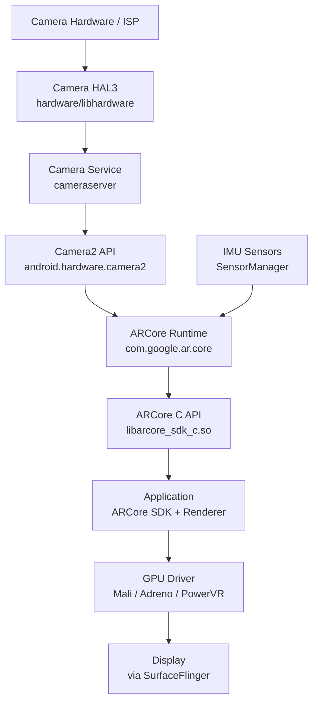
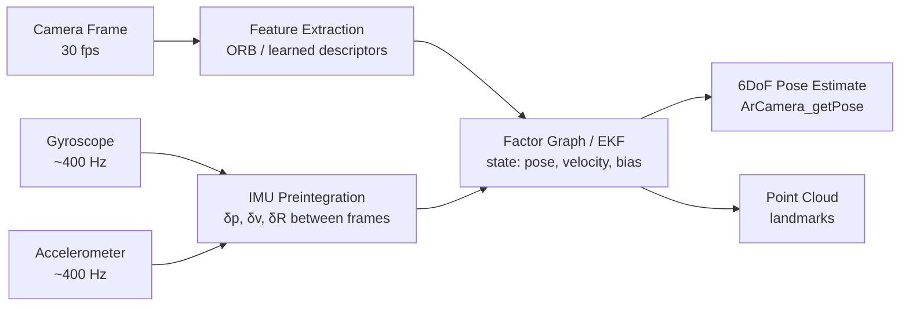
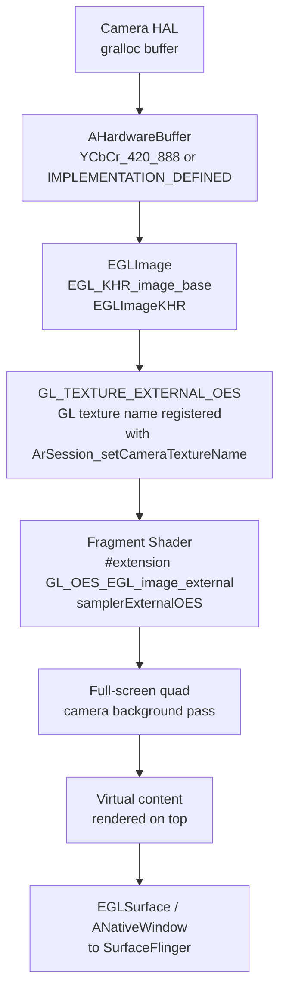
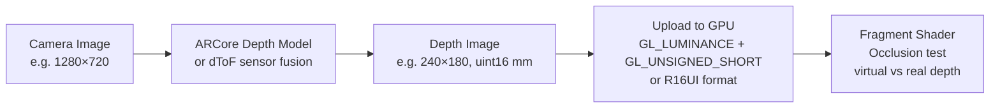
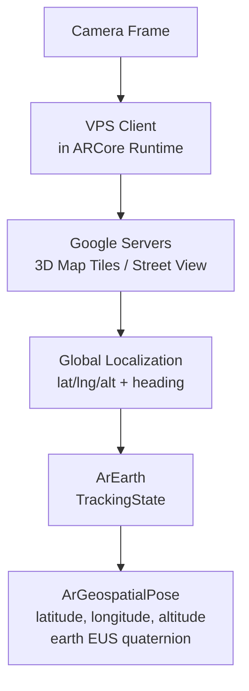
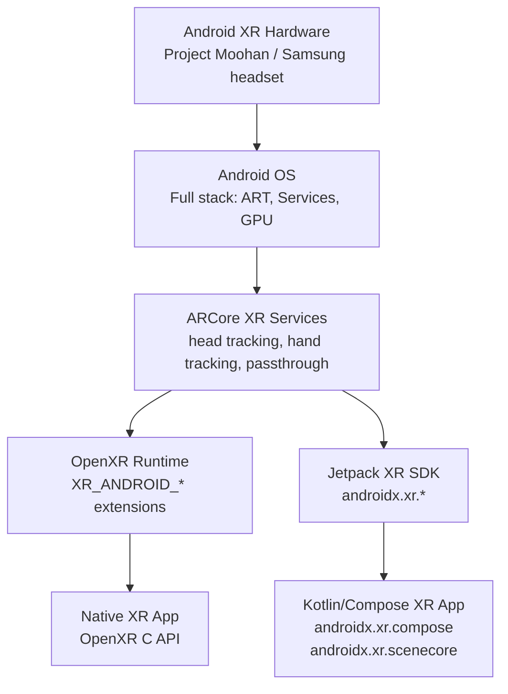
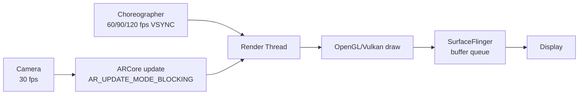
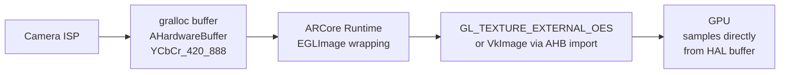

# Chapter 87 — Android AR: ARCore Architecture, Camera HAL Integration, and the Android XR Platform

> **Audiences:** Graphics application developers targeting Android AR/XR; systems developers who want to understand how ARCore integrates with the Android camera and graphics pipeline; engineers building spatial computing applications and exploring how the Android graphics stack adapts for augmented and mixed reality.

---

## Table of Contents

1. [ARCore Architecture Overview](#1-arcore-architecture-overview)
   - [Historical Context: From Cardboard to Android XR](#historical-context-from-cardboard-to-android-xr)
   - [SLAM Internals: Visual-Inertial Odometry, Keyframes, and Drift Handling](#1a-slam-internals-visual-inertial-odometry-keyframes-and-drift-handling)
2. [The Android Camera Pipeline and ARCore](#2-the-android-camera-pipeline-and-arcore)
3. [Session Lifecycle and the ArSession API](#3-session-lifecycle-and-the-arsession-api)
   - [Device Capability Matrix and ARCore Feature Availability](#3a-device-capability-matrix-and-arcore-feature-availability)
   - [Privacy Model, Permissions, and Regulatory Compliance](#3b-privacy-model-permissions-and-regulatory-compliance)
4. [AR Rendering Pipeline: Camera Background and Virtual Content](#4-ar-rendering-pipeline-camera-background-and-virtual-content)
5. [Plane Detection and Environment Understanding](#5-plane-detection-and-environment-understanding)
   - [Augmented Faces: 3D Face Mesh Tracking](#5a-augmented-faces-3d-face-mesh-tracking)
   - [Augmented Images: 2D Target Recognition and Tracking](#5b-augmented-images-2d-target-recognition-and-tracking)
   - [Hand Tracking on ARCore Phones](#5c-hand-tracking-on-arcore-phones)
6. [Depth API](#6-depth-api)
7. [Anchors, Persistent Anchors, and Cloud Anchors](#7-anchors-persistent-anchors-and-cloud-anchors)
8. [Light Estimation](#8-light-estimation)
9. [OpenXR on Android and Android XR](#9-openxr-on-android-and-android-xr)
   - [WebXR Device API: Browser-Based AR on Android](#9a-webxr-device-api-browser-based-ar-on-android)
10. [ARCore Recording, Playback, and the Dataset API](#10-arcore-recording-playback-and-the-dataset-api)
11. [Performance, Power, and Mobile GPU Considerations](#11-performance-power-and-mobile-gpu-considerations)
12. [ARCore AI and ML: On-Device Intelligence](#12-arcore-ai-and-ml-on-device-intelligence)
13. [Engine Integration: Unity, Unreal, Godot, and Bevy](#13-engine-integration-unity-unreal-godot-and-bevy)
14. [Snapdragon Spaces: Qualcomm's AR SDK](#14-snapdragon-spaces-qualcomms-ar-sdk)
    - [Meta Quest 3 and Meta Horizon OS](#meta-quest-3-and-meta-horizon-os)
    - [Meta Horizon OS Full Software Stack](#meta-horizon-os-full-software-stack)
15. [Linux AR: Monado, SteamVR, and the Open Stack](#15-linux-ar-monado-steamvr-and-the-open-stack)
16. [Integrations](#16-integrations)

---

## 1. ARCore Architecture Overview

### Historical context: from Cardboard to Android XR

Google's Android AR/VR platform has gone through four distinct eras:

**Google Cardboard (June 2014 — present).** Announced at Google I/O 2014, Cardboard turned any Android phone into a 3DoF VR viewer via a folded-cardboard headset costing a few dollars. The SDK handled stereoscopic lens distortion correction and head rotation tracking (gyroscope only — no position). Cardboard required no special hardware, no OS support, and no certification. It was deprecated as an actively developed product in 2019 when Daydream shut down, then open-sourced in November 2019 as [github.com/googlevr/cardboard](https://github.com/googlevr/cardboard) for iOS and Android. Cardboard's lasting contribution was proving that a smartphone screen and gyroscope were sufficient for immersive VR content — which shaped every mobile VR SDK that followed.

**Project Tango (2014–2017).** Announced in February 2014 as an ATAP (Advanced Technology and Projects) initiative, Tango was depth-sensing AR for Android. It required custom hardware: a structured-light depth sensor, a fisheye wide-angle camera, and a motion-tracking camera — all on the same device. The Tango SDK exposed three capabilities: motion tracking (6DoF), area learning (building a persistent SLAM map of a room), and depth perception (real-time point cloud via `TangoXyzIjData`). The only consumer Tango phone was the Lenovo Phab 2 Pro (2016). **Google cancelled Tango in November 2017**, replacing it with ARCore — which achieved software-estimated depth and 6DoF tracking on standard hardware, without Tango's custom sensors. Tango's SLAM algorithms and VIO approach directly informed ARCore's architecture.

**Google Daydream VR (October 2016–October 2019).** Daydream was Google's high-quality mobile VR platform. Unlike Cardboard, it required *Daydream-ready* certification: specific display refresh rate (60 Hz minimum with low-persistence), sensor latency constraints, and a fast IMU. The Daydream View headset and its 3DoF controller (tracked via 9-axis IMU) were sold separately. The Daydream SDK rendered stereoscopic scenes at 60 fps with asynchronous reprojection (ATW — Asynchronous TimeWarp) to compensate for frame latency, and exposed a proprietary scan-line-racing mode for supported displays. Daydream-ready phones included the Pixel (1st gen), Pixel 2, and a handful of partner devices. **Google discontinued Daydream in October 2019**, citing a "lack of consumer traction" and the emergence of standalone headsets (Oculus Quest). The Pixel 4, announced that same month, was notably *not* Daydream-ready. Daydream's engineering — low-latency sensor pipelines, ATW, display synchronisation — was subsequently absorbed into the standalone headset space.

**ARCore (August 2017 preview → February 2018 v1.0 → present).** ARCore was announced at Google I/O 2017 and launched in public preview in August 2017 as a direct replacement for Tango — same goals (6DoF world tracking, plane detection, light estimation), no special hardware. It used Visual-Inertial Odometry on the existing back camera and IMU already present on any mid-range Android phone. ARCore 1.0 shipped in February 2018 with Vulkan rendering support and a cloud anchor service. Subsequent releases added Geospatial/VPS anchors (2020), the Depth API with MotionStereo (2021), Scene Semantics per-pixel labels (2022), and the Raw Compass API. The Play Services delivery model allowed tracking improvements to reach all supported devices without OTA updates.

**Android XR (2024–present).** Android XR is Google's next spatial-computing platform, targeting dedicated headsets rather than phones. Project Moohan (Samsung, 2025) is the first commercial Android XR headset. The platform is built on Android 15+, runs standard Android apps in 2D panels, and adds the Jetpack XR SDK (`androidx.xr`) for spatial UI, hand tracking, and passthrough compositing. ARCore for Jetpack XR extends the ARCore session model to headsets. Android XR uses the same Vulkan/OpenXR stack described throughout this chapter.

| Era | Years | Tracking | Hardware | Status |
|---|---|---|---|---|
| Google Cardboard | 2014–present | 3DoF (gyro) | Any phone | Open-sourced 2019 |
| Project Tango | 2014–2017 | 6DoF + depth sensor | Custom hardware (Phab 2 Pro) | Cancelled; succeeded by ARCore |
| Google Daydream VR | 2016–2019 | 3DoF + controller | Daydream-ready phones | Discontinued |
| ARCore | 2017–present | 6DoF VIO, no extra HW | Android 7.0+, 1B+ devices | Active |
| Android XR | 2024–present | 6DoF + hand tracking | Dedicated headsets (Moohan) | Active |

[Source: ARCore history](https://developers.google.com/ar/develop/android/quickstart), [Project Tango deprecation](https://developers.google.com/tango), [Daydream discontinuation](https://support.google.com/daydream/answer/9526971), [Cardboard open-source](https://github.com/googlevr/cardboard)

**ARCore** is Google's augmented reality SDK for Android. It is not a kernel subsystem, a **HAL** module, or a **Vulkan** layer — it is an application-layer SDK that sits above the Android operating system, consuming data from the **Camera HAL** and **IMU** sensors via standard Android APIs, and producing world-understanding primitives (poses, planes, anchors, depth maps, light estimates) that app-layer renderers consume. **ARCore** ships as a Play Services component (**`com.google.ar.core`**) that is updated independently of the Android OS version, letting Google iterate on tracking algorithms without waiting for OEM firmware updates. [Source: ARCore quickstart](https://developers.google.com/ar/develop/android/quickstart)

### Three core capabilities

**ARCore** rests on three pillars:

1. **Motion tracking** — Continuous **6DoF** (six degrees of freedom) estimation of the device's position and orientation relative to its starting pose, achieved via **Visual-Inertial Odometry** (**VIO**) that fuses camera frames with accelerometer and gyroscope readings.
2. **Environmental understanding** — Detection of real-world geometry: horizontal and vertical planes, point clouds, depth maps, and (on Android 12+) per-pixel semantic labels via the **Scene Semantics** API. Planes are grown incrementally as the user moves through the space.
3. **Light estimation** — Analysis of the camera image to estimate scene illumination, ranging from a simple scalar ambient intensity (**Ambient Intensity** mode) to a full spherical **HDR** environment map suitable for image-based lighting (**IBL**) in **PBR** renderers (**Environmental HDR** mode).

### Position in the Android software stack



**ARCore** opens a camera session using the public **`android.hardware.camera2`** API (not a private **HAL** path), registers sensor listeners via **`android.hardware.SensorManager`**, fuses the data internally, and exposes results through the **ARCore C API** (**`libarcore_sdk_c.so`**) or the Java/Kotlin SDK (**`com.google.ar.core`**). [Source: ARCore C API reference](https://developers.google.com/ar/reference/c)

The chapter traces this architecture across the full stack. Section 2 examines the **Camera HAL3** request/result pipeline — **`camera3_device_ops_t`**, **`process_capture_request()`**, **gralloc**-backed **`AHardwareBuffer`** output buffers — and how **ARCore** opens a **Camera2** repeating capture session using **`TEMPLATE_RECORD`** and integrates high-rate **IMU** data from the **`SensorManager`** for **VIO** via IMU preintegration and a factor graph/EKF optimizer. Section 3 covers the **`ArSession`** lifecycle API (**`ArSession_create()`**, **`ArSession_resume()`**, **`ArSession_pause()`**, **`ArSession_update()`**), the **`ArFrame`** update loop, the **`ArPose`** 7-element quaternion-translation representation, and the **`AR_UPDATE_MODE_BLOCKING`** vs **`AR_UPDATE_MODE_LATEST_CAMERA_IMAGE`** update modes and **`AR_FOCUS_MODE_AUTO`** focus control. Section 4 details the AR rendering pipeline: the **OpenGL ES** zero-copy camera background path via **`GL_TEXTURE_EXTERNAL_OES`**, **`EGLImageKHR`** (**`EGL_KHR_image_base`**), and **`samplerExternalOES`**; virtual content rendering using **`ArCamera_getViewMatrix()`** and **`ArCamera_getProjectionMatrix()`**; depth occlusion in **GLSL**; and the **Vulkan** import path via **`VK_ANDROID_external_memory_android_hardware_buffer`**, **`vkGetAndroidHardwareBufferPropertiesANDROID()`**, and **`VkSamplerYcbcrConversion`**. Section 5 covers environment understanding: **`ArPlane`** objects (**`ArSession_getAllTrackables()`**, polygon boundaries, subsume relationships), **`ArPointCloud`** feature point access, the **Scene Semantics** API (**`ArConfig_setSemanticMode()`**, **`ArFrame_acquireSemanticImage()`**), and **Instant Placement** via **`ArFrame_hitTestInstantPlacement()`**. Section 6 covers the **Depth API**: depth sources (structured light/**dToF** sensors, **MotionStereo**, smooth depth), configuration via **`AR_DEPTH_MODE_AUTOMATIC`**, frame acquisition via **`ArFrame_acquireDepthImage16Bits()`** and **`ArFrame_acquireRawDepthImage16Bits()`**, depth image properties (16-bit unsigned integer, millimeter encoding), and upload to **OpenGL ES** using **`GL_EXT_texture_norm16`** or an **`GL_RG8`** fallback. Section 7 treats anchors: local anchors via **`ArFrame_hitTest()`** and **`ArHitResult_acquireNewAnchor()`**; the **Geospatial API** using Google's **Visual Positioning System** (**VPS**), **`ArEarth`**, **`ArGeospatialPose`**, and **`ArEarth_acquireNewAnchor()`** for **WGS84**-coordinate anchors; and **Cloud Anchors** for shared AR experiences via **`ArSession_hostCloudAnchorAsync()`** and **`ArSession_resolveCloudAnchorAsync()`**. Section 8 details light estimation: the **Ambient Intensity** mode (**`ArLightEstimate_getPixelIntensity()`**, **`ArLightEstimate_getColorCorrection()`**) and the **Environmental HDR** mode (**`ArImageCubemap`** in **`AIMAGE_FORMAT_RGBA_FP16`**, **`ArLightEstimate_getEnvironmentalHdrAmbientSphericalHarmonics()`** for L2 **spherical harmonics**, and the **IBL** split-sum approximation with a prefiltered environment map and **BRDF LUT**). Section 9 covers the **OpenXR** loader shipped with **ARCore** services and the extensions it supports (**`XR_EXT_hand_tracking`**, **`XR_ANDROID_trackables`**, **`XR_KHR_composition_layer_depth`**), the **Android XR** spatial computing platform targeting headsets such as **Project Moohan**, the **Jetpack XR** SDK (**`androidx.xr`** modules: **`androidx.xr.runtime`**, **`androidx.xr.scenecore`**, **`androidx.xr.compose`**), and passthrough compositing on **Android XR** headsets. Section 10 explains the **ARCore** recording and playback (Dataset API): storing camera frames and **IMU** data in an **MP4** container via **`ArSession_startRecording()`** / **`ArSession_stopRecording()`**, deterministic replay via **`ArSession_startPlayback()`**, and custom tracks for CI/CD automated testing. Section 11 examines performance and power: the CPU cost of the **VIO** tracking thread (feature extraction, **IMU** preintegration, factor graph), GPU offload of **MotionStereo** depth, **Scene Semantics**, and **HDR** light estimation via **NNAPI** and **NPU** (e.g., **Hexagon DSP** on **Snapdragon**), camera stream power budget, frame pacing via **`android.view.Choreographer`** and **VSYNC** decoupled from **`ArSession_update()`**, and the **`AHardwareBuffer`** zero-copy pipeline from **Camera ISP** to GPU shader.

### Supported devices and API levels

**ARCore** requires Android 7.0 (API 24) as the minimum OS version. However, Google differentiates between:

- **AR Optional** apps — declare `<uses-library android:name="com.google.ar.core" android:required="false"/>` and degrade gracefully on unsupported devices. Minimum API 24.
- **AR Required** apps — declare `<uses-library android:name="com.google.ar.core" android:required="true"/>` and require Android 9.0 (API 28). This is the minimum at which **ARCore**'s device compatibility list includes broad handset coverage.

As of 2025, over 1 billion Android devices support **ARCore**. The [ARCore supported devices list](https://developers.google.com/ar/devices) specifies which handsets have been validated; not every Android 9+ device is supported, as **ARCore** requires hardware validation by the OEM.

### ARCore vs ARKit (conceptual comparison)

Apple's **ARKit** occupies the analogous position in the iOS stack. Both SDKs are closed-source runtimes that consume camera and **IMU** data to produce **VIO**-based world tracking. Key architectural differences:

| Dimension | ARCore | ARKit |
|---|---|---|
| OS integration | Play Services (updatable) | OS framework (iOS update) |
| Camera API | **Camera2** (public) | **AVFoundation** (private, tighter integration) |
| Depth | **MotionStereo** + **dToF** sensor | **LiDAR** on Pro devices |
| Geospatial | **VPS** via Street View tiles | —  |
| OpenXR | Supported via loader | Partial via visionOS |
| Headset support | **Android XR** / **Project Moohan** | Apple Vision Pro |

---

## 1a. SLAM Internals: Visual-Inertial Odometry, Keyframes, and Drift Handling

Section 2 introduces ARCore's VIO loop at a structural level — IMU preintegration, factor graph, feature extraction. This section goes deeper: the sub-system boundaries, keyframe lifecycle, loop-closure mechanism, scale disambiguation, and how drift accumulates and is corrected over long sessions. ARCore's VIO is closed-source, but the architecture closely matches published tightly-coupled VIO systems (VINS-Mono, OKVIS, ORB-SLAM3) and is partially described in Google's [ARCore technical documentation](https://developers.google.com/ar/develop/concepts).

### Feature extraction and short-baseline tracking

Each camera frame delivered from Camera HAL at ~30 fps is processed through a two-stage feature pipeline:

1. **Corner detection**: FAST (Features from Accelerated Segment Test) keypoints are detected on the luma (Y) plane of the YCbCr frame. FAST is chosen over more expensive detectors (SIFT, SURF) because it runs in a single pixel-ring comparison pass — well-suited to the ~33 ms inter-frame budget at 30 fps on an ARM CPU core.
2. **Short-baseline tracking**: Between consecutive frames, tracked features are propagated using **Lucas-Kanade optical flow** (a sparse iterative image alignment), not descriptor matching. KLT tracking is robust to small inter-frame motion and avoids the cost of descriptor extraction for every feature on every frame. Descriptors are only computed (ORB or ARCore's internal learned variant) when a new keyframe is selected or when loop-closure matching is required.

A typical VIO front-end tracks 200–400 features per frame. Features that cannot be tracked (occlusion, blurring, leaving frame) are dropped; new FAST corners fill the map to maintain a target density.

### IMU preintegration between camera frames

The IMU delivers accelerometer and gyroscope readings at 400–1000 Hz on modern Snapdragon and Exynos SoCs. Processing every IMU sample individually in the optimizer would be computationally prohibitive. **IMU preintegration** accumulates all IMU samples between two consecutive camera timestamps into a single compact relative-motion constraint (Δp, Δv, ΔR — relative position, velocity, rotation), computed using Euler integration with online bias correction:

```
δR_ij = ∏_{k=i}^{j-1} Exp((ω_k − b_g) · Δt)
δv_ij = Σ_{k=i}^{j-1} δR_ik · (a_k − b_a) · Δt
δp_ij = Σ_{k=i}^{j-1} [δv_ik · Δt + ½ · δR_ik · (a_k − b_a) · Δt²]
```

where `ω_k` is gyroscope reading, `a_k` is accelerometer reading, `b_g` / `b_a` are the current gyroscope/accelerometer bias estimates, and `Exp(·)` is the SO(3) exponential map. The preintegrated quantity is a single node in the factor graph, connecting the poses at camera frames i and j. This design means that when the optimizer updates the bias estimate, only the preintegration residual need be re-linearised — not all individual IMU samples. [Source: Forster et al., "On-Manifold Preintegration for Real-Time Visual-Inertial Odometry," 2017](https://rpg.ifi.uzh.ch/docs/TRO16_forster.pdf)

### Keyframe selection

Not every camera frame becomes a keyframe. Keyframes are the nodes in the sliding-window optimizer; adding every frame would grow the optimization problem beyond real-time budget. ARCore's keyframe selection heuristic (consistent with published VIO systems) triggers a new keyframe when either:

- **Parallax threshold**: tracked features have moved more than ~20 pixels on average from the last keyframe, indicating sufficient baseline for triangulation.
- **Rotation threshold**: cumulative rotation from the last keyframe exceeds ~15°, at which point feature tracks begin to degrade.
- **Track loss**: fewer than a threshold number of features (typically 80–100) remain tracked from the last keyframe.

Keyframe selection has a direct impact on depth estimation quality: insufficient parallax between keyframes causes MotionStereo to produce unreliable depth estimates (see §6).

### Factor graph optimization and iSAM2-style incremental smoothing

ARCore's state estimation is formulated as a **factor graph**: poses, IMU biases, and 3D landmark positions are *variable nodes*; reprojection errors and IMU preintegration constraints are *factor nodes* representing the log-likelihood of the measurements. The MAP (Maximum A Posteriori) estimate minimizes the sum of squared residuals, solved iteratively using a Gauss-Newton or Levenberg-Marquardt optimizer.

Rather than re-solving the full batch problem every frame, ARCore (and systems like VINS-Mono, ORB-SLAM3) uses **incremental smoothing**: when a new keyframe arrives, only the new factors are added and the sparse linear system is updated incrementally — analogous to iSAM2 (incremental Smoothing and Mapping). Older keyframes are *marginalized*: they are removed from the active window, but their information is preserved as a *prior factor* on the remaining variables. This **sliding-window** approach bounds computation to O(n) in the window size rather than O(n³) for the full trajectory. [Source: Kaess et al., "iSAM2", 2012](https://journals.sagepub.com/doi/10.1177/0278364911430419)

### Map management and landmark culling

Triangulated 3D landmarks (the point cloud visible via `ArFrame_acquirePointCloud()`, see §5) are managed by a map that tracks each landmark's observation history:

- A newly triangulated landmark is *tentative* until observed from at least 3 keyframes.
- Landmarks with fewer than 3 keyframe observations are culled — they lack sufficient angular baseline for reliable triangulation.
- Landmarks whose reprojection error exceeds a threshold (RANSAC outlier) are immediately removed.
- During marginalization, landmarks observed only by the oldest keyframe in the window are also marginalized — their position is encoded into the prior.

The point cloud visible via `ArPointCloud_getData()` is the subset of landmarks currently in the active sliding window, with a confidence value in [0.0, 1.0] representing how many keyframes have observed the landmark (higher observation count → higher confidence).

### Loop closure and visual place recognition

Over long sessions (minutes, building-scale), VIO accumulates **drift**: small errors in IMU bias estimation and feature tracking integrate into a growing pose error. After 60 seconds of normal phone movement, typical VIO drift is 0.5–2% of path length — enough to cause virtual objects to visibly "slide" on real surfaces. ARCore mitigates this via **loop closure**:

1. **Global descriptor extraction**: At each keyframe, a compact global descriptor is computed (e.g., a bag-of-visual-words or a learned global feature vector) that characterizes the visual appearance of the scene.
2. **Place recognition**: The descriptor is matched against a database of prior keyframe descriptors. A successful match above a similarity threshold indicates the camera has returned to a previously visited location.
3. **Loop constraint**: A relative pose constraint between the current keyframe and the matched prior keyframe is added to the factor graph as a strong loop-closing edge.
4. **Re-linearization**: The optimizer re-solves with the new constraint, distributing the accumulated drift across the loop trajectory. From the application's perspective, `ArAnchor` poses may shift slightly as the map corrects itself — this is expected behavior.

### Relocalization after tracking loss

When the device is covered, enters a featureless environment (blank wall, dim room), or moves too fast (motion blur), ARCore enters `AR_TRACKING_STATE_PAUSED`. The VIO front-end cannot track features. Upon exposure to a recognizable environment again, ARCore attempts **relocalization**:

1. Compute a global descriptor for the current frame.
2. Match against all stored keyframe descriptors.
3. If a match is found, compute a 2D-3D pose via PnP (Perspective-n-Point) using stored 3D landmarks and their 2D projections in the current frame.
4. If the PnP solve passes RANSAC verification, resume with `AR_TRACKING_STATE_TRACKING` from the recovered pose.

The relocalised pose is consistent with the pre-loss map; virtual objects placed before tracking loss remain at their correct world positions upon recovery.

### Scale disambiguation via IMU gravity

A monocular camera system (single lens, no stereo baseline, no depth sensor) cannot recover metric scale — a scene at 1 m and the same scene at 2 m are geometrically identical from monocular image sequences alone. ARCore resolves this fundamental ambiguity via the IMU:

- The accelerometer measures the gravity vector `g ≈ 9.81 m/s²` in device coordinates.
- During the `AR_TRACKING_STATE_INITIALIZING` phase (typically 1–3 seconds), ARCore collects IMU data and uses the known magnitude of gravity to establish the metric scale of the first triangulated landmarks.
- From that point, the IMU's linear acceleration provides an absolute metric constraint at every frame, preventing scale drift even as the camera baseline changes.

This is why ARCore requires the user to move the device (not just rotate it) during initialization: parallax between at least two viewpoints is needed to triangulate the first landmarks, and those landmarks, combined with the gravity magnitude, yield the metric scale.

### Drift handling in practice

For short AR sessions (< 60 s, room-scale), VIO drift is negligible — anchors stay fixed to within millimetres. For long sessions (museum tours, navigation, persistent city-scale AR), drift becomes significant. ARCore provides two architectural solutions:

- **Cloud Anchors** (§7): hosted feature maps are globally consistent; resolving a Cloud Anchor provides a world-coordinate correction that resets local drift.
- **Geospatial VPS** (§7): VPS localisation against Google's global 3D map provides an external absolute pose reference, effectively eliminating long-term drift in VPS-covered areas. The VPS pose is fused with VIO via a Kalman filter, with VPS providing the global anchor and VIO providing high-frequency, low-latency local updates between VPS queries.

For sessions without Cloud Anchors or VPS, the application can check `ArPose` consistency over time by monitoring how much placed `ArAnchor` poses drift relative to the physical world — a visible mismatch signals cumulative drift.

### Dynamic environment handling and RANSAC outlier rejection

People, vehicles, and other moving objects generate feature tracks that violate the static-world assumption of SLAM. A person walking through the frame will have features tracked across multiple frames with reprojection errors inconsistent with any static 3D point. ARCore's front-end uses **RANSAC** (Random Sample Consensus) during the feature-matching and triangulation steps: it randomly selects minimal subsets of feature matches, computes a homography or essential matrix, and counts inliers (features consistent with the model). Moving object features become outliers and are excluded from the VIO factor graph.

For the majority of cases — AR app usage where a person is the device operator — the person is behind the camera and does not appear in the frame. In settings where people or vehicles dominate the field of view (crowded streets, retail), RANSAC outlier rejection handles them gracefully, though tracking quality degrades proportionally to the fraction of the image covered by moving objects.

[Source: ARCore developer concepts](https://developers.google.com/ar/develop/concepts), [ORB-SLAM3 paper](https://arxiv.org/abs/2007.11898), [VINS-Mono paper](https://arxiv.org/abs/1708.03852)

---

## 2. The Android Camera Pipeline and ARCore

### Camera HAL3 architecture

Android's Camera HAL3 defines a request/result pipeline. The HAL interface is declared in `hardware/libhardware/include/hardware/camera3.h` in AOSP:

```c
/* From hardware/libhardware/include/hardware/camera3.h */
typedef struct camera3_device_ops {
    int (*initialize)(const struct camera3_device *,
                      const camera3_callback_ops_t *callback_ops);
    int (*configure_streams)(const struct camera3_device *,
                             camera3_stream_configuration_t *stream_list);
    int (*process_capture_request)(const struct camera3_device *,
                                   camera3_capture_request_t *request);
    void (*dump)(const struct camera3_device *, int fd);
    int (*flush)(const struct camera3_device *);
    /* ... */
} camera3_device_ops_t;

typedef struct camera3_stream {
    int stream_type;    /* OUTPUT, INPUT, or BIDIRECTIONAL */
    uint32_t width;
    uint32_t height;
    int format;         /* HAL_PIXEL_FORMAT_* */
    uint32_t usage;     /* gralloc usage flags */
    uint32_t max_buffers;
    void *priv;         /* HAL private data */
    android_dataspace_t data_space;
    camera3_stream_rotation_t rotation;
    const char *physical_camera_id;
} camera3_stream_t;
```

[Source: AOSP Camera HAL docs](https://source.android.com/docs/core/camera)

`process_capture_request()` submits a single capture: the HAL fills the output buffers (gralloc-backed `AHardwareBuffer` objects) and returns results via the `camera3_callback_ops_t::process_capture_result()` callback. This is entirely asynchronous — requests are pipelined, and multiple frames can be in flight simultaneously.

### How ARCore opens a Camera2 session

ARCore operates above the HAL via the public Camera2 Java API. Internally, when `ArSession_resume()` is called, ARCore:

1. Calls `CameraManager.openCamera()` to obtain a `CameraDevice`.
2. Creates output surfaces: one for the preview stream (delivered to the GL texture name registered via `ArSession_setCameraTextureName()`), and optionally a CPU-accessible `ImageReader` for depth/semantics processing.
3. Calls `CameraDevice.createCaptureSession()` with the surface list.
4. Submits a repeating `CaptureRequest` built from the `TEMPLATE_RECORD` template:

```kotlin
// Conceptual — ARCore does this internally; exposed pattern for clarity
val captureRequestBuilder = cameraDevice.createCaptureRequest(
    CameraDevice.TEMPLATE_RECORD  // Stable framerate, continuous AF
)
captureRequestBuilder.addTarget(previewSurface)
captureRequestBuilder.set(CaptureRequest.CONTROL_AF_MODE,
    CaptureRequest.CONTROL_AF_MODE_CONTINUOUS_VIDEO)
cameraCaptureSession.setRepeatingRequest(
    captureRequestBuilder.build(), captureCallback, cameraHandler
)
```

`TEMPLATE_RECORD` is preferred over `TEMPLATE_PREVIEW` because it requests a stable, low-jitter frame rate (typically 30 fps) suitable for VIO, while `TEMPLATE_PREVIEW` may allow variable frame rate adjustments that would impair inertial fusion.

### IMU integration

ARCore registers two sensor listeners via `SensorManager`:

```java
sensorManager.registerListener(listener,
    sensorManager.getDefaultSensor(Sensor.TYPE_ACCELEROMETER),
    SensorManager.SENSOR_DELAY_FASTEST);

sensorManager.registerListener(listener,
    sensorManager.getDefaultSensor(Sensor.TYPE_GYROSCOPE),
    SensorManager.SENSOR_DELAY_FASTEST);
```

`SENSOR_DELAY_FASTEST` requests delivery at the sensor's native rate, typically 200–400 Hz on modern Android devices. High-rate gyroscope data is essential for VIO: the gyroscope provides fast, low-noise angular velocity between camera frames, while the accelerometer (after bias and gravity subtraction) provides linear acceleration.

### Visual-Inertial Odometry

ARCore's VIO pipeline is closed-source, but the general architecture matches published academic work on tightly-coupled VIO systems. The fusion occurs in a continuous optimization loop:



IMU preintegration accumulates gyroscope and accelerometer readings between camera frames into a single relative motion constraint, avoiding the need to replay all IMU readings at each optimization step. The resulting factor graph jointly optimizes camera poses, IMU biases, and 3D landmark positions.

Two pose queries reflect different coordinate transformations:

- `ArCamera_getPose()` — pose in the world coordinate frame (OpenGL convention: Y-up, looking along -Z).
- `ArCamera_getDisplayOrientedPose()` — same world pose but with an additional rotation that accounts for device display orientation (portrait vs landscape). Use this for overlaying UI elements aligned with the display.

[Source: ARCore C API reference](https://developers.google.com/ar/reference/c)

---

## 3. Session Lifecycle and the ArSession API

The ARCore C API (`arcore_sdk_c`) provides a flat C interface suitable for use from C++, Rust (via FFI), or any language with C interop. The Java/Kotlin SDK wraps this with object-oriented bindings, but for NDK-based renderers the C API is the authoritative interface.

### Session creation and lifecycle

```c
#include "arcore_sdk_c.h"

ArSession *ar_session = NULL;
ArStatus status = ArSession_create(env, context, &ar_session);
if (status != AR_SUCCESS) {
    // Handle: AR_ERROR_FATAL, AR_UNAVAILABLE_ARCORE_NOT_INSTALLED, etc.
}

// Configure before first resume
ArConfig *ar_config = NULL;
ArConfig_create(ar_session, &ar_config);
ArConfig_setFocusMode(ar_session, ar_config, AR_FOCUS_MODE_AUTO);
ArConfig_setUpdateMode(ar_session, ar_config, AR_UPDATE_MODE_LATEST_CAMERA_IMAGE);
ArConfig_setDepthMode(ar_session, ar_config, AR_DEPTH_MODE_AUTOMATIC);
ArConfig_setPlaneFindingMode(ar_session, ar_config, AR_PLANE_FINDING_MODE_HORIZONTAL_AND_VERTICAL);
ArConfig_setLightEstimationMode(ar_session, ar_config, AR_LIGHT_ESTIMATION_MODE_ENVIRONMENTAL_HDR);
ArSession_configure(ar_session, ar_config);
ArConfig_destroy(ar_config);

// Register camera texture (GL_TEXTURE_EXTERNAL_OES name)
ArSession_setCameraTextureName(ar_session, gl_texture_id);

// Resume (opens Camera2 session, starts tracking)
ArSession_resume(ar_session);
```

The `ArSession` lifecycle mirrors Android's `Activity` lifecycle: call `ArSession_pause()` in `onPause()` and `ArSession_resume()` in `onResume()`. Failing to pause releases the camera and stops IMU sampling, allowing other apps to use the camera.

```c
// In onPause():
ArSession_pause(ar_session);

// In onDestroy():
ArSession_destroy(ar_session);
ar_session = NULL;
```

### The update loop

Each render frame, call `ArSession_update()` to advance the tracking state:

```c
ArFrame *ar_frame = NULL;
ArFrame_create(ar_session, &ar_frame);

// In the render loop:
ArStatus update_status = ArSession_update(ar_session, ar_frame);
if (update_status != AR_SUCCESS) { /* handle */ }

// Extract camera from frame
ArCamera *ar_camera = NULL;
ArFrame_acquireCamera(ar_session, ar_frame, &ar_camera);

// Query tracking state
ArTrackingState tracking_state;
ArCamera_getTrackingState(ar_session, ar_camera, &tracking_state);
if (tracking_state == AR_TRACKING_STATE_TRACKING) {
    // Safe to use pose data
}

// Always release
ArCamera_release(ar_camera);
```

### ArPose: the 7-element representation

`ArPose` encodes a rigid body transform as a 7-element float array `[qx, qy, qz, qw, tx, ty, tz]` where `[qx, qy, qz, qw]` is a unit quaternion (Hamilton convention) and `[tx, ty, tz]` is the translation in meters in the world coordinate frame:

```c
ArPose *ar_pose = NULL;
ArPose_create(ar_session, NULL, &ar_pose);  // NULL → identity pose

// Extract view matrix (column-major, OpenGL convention)
float view_matrix[16];
ArCamera_getViewMatrix(ar_session, ar_camera, view_matrix);

// Extract projection matrix
float projection_matrix[16];
float near_clip = 0.1f;
float far_clip = 100.0f;
ArCamera_getProjectionMatrix(ar_session, ar_camera,
    near_clip, far_clip, projection_matrix);

ArPose_destroy(ar_pose);
```

### Update mode and focus mode

`AR_UPDATE_MODE_LATEST_CAMERA_IMAGE` (the default) causes `ArSession_update()` to return immediately with the most recently delivered camera frame, even if a newer frame has not arrived since the last call. `AR_UPDATE_MODE_BLOCKING` causes `ArSession_update()` to block until a new camera frame is available — useful when the render thread should be paced by camera arrival rather than a separate timer.

`AR_FOCUS_MODE_AUTO` enables continuous auto-focus, which generally improves feature tracking quality at the cost of occasional brief refocus transients. For depth-sensitive use cases (e.g., close-range object tracking), fixed focus may be preferable.

---

## 3a. Device Capability Matrix and ARCore Feature Availability

Not every ARCore-capable device supports every ARCore feature. The SDK's certification model separates device eligibility from feature availability, and applications must query capability at runtime before enabling advanced modes.

### The ARCore supported devices list

Google maintains a continuously updated [ARCore supported devices list](https://developers.google.com/ar/devices) that currently covers over 500 certified Android device models (as of mid-2026). Certification requires OEM validation of:

- IMU quality: accelerometer and gyroscope must meet minimum noise and latency specifications for VIO.
- Camera frame delivery latency: the camera-to-tracking-thread pipeline must sustain ≥ 30 fps at the required resolution.
- GPU driver compliance: the Vulkan or GLES driver must support the extensions ARCore requires for AHardwareBuffer import and external textures.

Importantly, not every Android 7.0+ device is eligible — ARCore applies hardware quality gates that exclude budget devices with poor IMU or non-compliant camera drivers.

### Certification tiers

ARCore defines two certification tiers that affect how apps declare the dependency in their manifest:

- **ARCore Optional** (`android:required="false"`): The device may or may not have ARCore installed. ARCore is downloaded via the Play Store when the user first launches an AR Optional app. The app must degrade gracefully when ARCore is unavailable. Minimum API level 24.
- **ARCore Required** (`android:required="true"`): ARCore is preinstalled and guaranteed. The Google Play Store filters to only show the app on ARCore Required devices. Minimum API level 28. Basic tracking, plane detection, and light estimation are guaranteed.

### Availability check at runtime

Before creating an `ArSession`, verify ARCore availability:

```c
ArAvailability availability;
ArCoreApk_checkAvailability(env, context, &availability);

switch (availability) {
    case AR_AVAILABILITY_SUPPORTED_INSTALLED:
        // ARCore is installed and ready — proceed with ArSession_create()
        break;
    case AR_AVAILABILITY_SUPPORTED_APK_TOO_OLD:
    case AR_AVAILABILITY_SUPPORTED_NOT_INSTALLED:
        // Prompt user to install or update ARCore via Play Store
        // ArCoreApk.requestInstall() in Java; in C, redirect to Play Store intent
        break;
    case AR_AVAILABILITY_UNSUPPORTED_DEVICE_NOT_CAPABLE:
        // Device hardware cannot run ARCore; disable AR features permanently
        break;
    case AR_AVAILABILITY_UNKNOWN_CHECKING:
    case AR_AVAILABILITY_UNKNOWN_ERROR:
    case AR_AVAILABILITY_UNKNOWN_TIMED_OUT:
        // Retry after a delay
        break;
}
```

[Source: ARCore C API — ArAvailability](https://developers.google.com/ar/reference/c/group/ar-core-apk)

### Per-feature capability checks

Individual features require additional runtime checks before configuration. Enabling an unsupported feature causes `ArSession_configure()` to return `AR_ERROR_INVALID_ARGUMENT`:

```c
// Check depth API support:
int32_t depth_supported = 0;
ArSession_isDepthModeSupported(session, AR_DEPTH_MODE_AUTOMATIC, &depth_supported);
if (depth_supported) {
    ArConfig_setDepthMode(config, AR_DEPTH_MODE_AUTOMATIC);
}

// Check semantic mode support (Android 12+, outdoor):
int32_t semantic_supported = 0;
ArSession_isSemanticModeSupported(session, AR_SEMANTIC_MODE_ENABLED, &semantic_supported);

// Check Geospatial support:
// Requires network connectivity and VPS-covered area; check at runtime:
ArEarth *earth = NULL;
ArSession_acquireEarth(session, &earth);
ArTrackingState earth_state;
ArEarth_getTrackingState(session, earth, &earth_state);
// If AR_TRACKING_STATE_PAUSED after ~60s, the area lacks VPS coverage
ArEarth_release(earth);
```

### Feature availability by hardware tier

The table below summarises which hardware capabilities unlock each ARCore feature and gives representative device examples. Entries reflect ARCore state as of mid-2026.

| Feature | ARCore version required | Minimum API level | Hardware requirement | Representative support |
|---|---|---|---|---|
| Motion tracking + plane detection | 1.0 (Feb 2018) | API 24 | Any certified device | 500M+ devices |
| Cloud Anchors | 1.2 (Jun 2018) | API 24 | Network access | All certified devices |
| Augmented Images | 1.6 (Nov 2018) | API 24 | Any certified device | All certified devices |
| Light Estimation (HDR) | 1.9 (May 2019) | API 24 | Any certified device | All certified devices |
| Augmented Faces | 1.7 (Feb 2019) | API 24 | Front-facing camera | Most phones with front camera |
| Depth API (MotionStereo) | 1.18 (Aug 2021) | API 24 | Any certified device with camera motion | ~88% of active ARCore devices |
| Depth API (hardware dToF) | 1.18 (Aug 2021) | API 24 | Physical ToF sensor | Pixel 4+, selected Samsung/LG/Xiaomi |
| Raw Depth + Confidence | 1.20 (Oct 2021) | API 24 | Depth API capable device | Subset of Depth API devices |
| Geospatial / VPS | 1.31 (Jun 2022) | API 26 | GPS + VPS coverage area | Certified devices in Street View zones |
| Scene Semantics | 1.36 (Mar 2023) | API 26 | Any certified device (outdoor only) | Limited: certified 2021+ phones |
| Streetscape Geometry | 1.36 (Mar 2023) | API 26 | Geospatial + Depth enabled | Devices with Depth + VPS coverage |
| Geospatial Creator (AR anchors) | 1.39 (Oct 2023) | API 26 | Geospatial capable | VPS-covered areas |
| Android XR hand/eye tracking | Android XR only | API 34+ | Android XR headset | Samsung Galaxy XR (Moohan) |

> **Note:** ARCore version and API level requirements in this table are derived from ARCore release notes and developer guides; verify against the [ARCore release history](https://developers.google.com/ar/whatsnew-arcore) for the most current values.

### Camera config selection for capability-dependent features

Some features require a specific camera facing direction or resolution. The `ArCameraConfigFilter` API selects a camera configuration before session creation:

```c
ArCameraConfigList *config_list = NULL;
ArCameraConfigList_create(session, &config_list);

ArCameraConfigFilter *filter = NULL;
ArCameraConfigFilter_create(session, &filter);

// For Augmented Faces, require front-facing camera:
ArCameraConfigFilter_setFacingDirection(session, filter,
    AR_CAMERA_CONFIG_FACING_DIRECTION_FRONT);

ArSession_getSupportedCameraConfigsWithFilter(session, filter, config_list);

int32_t num_configs = 0;
ArCameraConfigList_getSize(session, config_list, &num_configs);
if (num_configs > 0) {
    ArCameraConfig *camera_config = NULL;
    ArCameraConfig_create(session, &camera_config);
    ArCameraConfigList_getItem(session, config_list, 0, camera_config);
    ArSession_setCameraConfig(session, camera_config);
    ArCameraConfig_destroy(camera_config);
}

ArCameraConfigFilter_destroy(filter);
ArCameraConfigList_destroy(config_list);
```

[Source: ARCore device support](https://developers.google.com/ar/devices), [ARCore feature availability](https://developers.google.com/ar/develop/c/enable-arcore)

---

## 3b. Privacy Model, Permissions, and Regulatory Compliance

ARCore processes camera and sensor data continuously during an AR session. Understanding which data stays on-device, which is transmitted, and what disclosures are legally required is essential for shipping compliant AR applications.

### Required permissions

**`android.permission.CAMERA`** is the only Android permission ARCore mandates. This runtime permission (since Android 6.0, API 23) must be granted before `ArSession_resume()` is called. The key privacy distinction: ARCore's internal use of the camera for VIO tracking does not grant the application access to camera pixels. The app only receives camera image data if it explicitly calls `ArFrame_acquireCameraImage()`, which returns a CPU-accessible `ArImage`. This distinction matters for privacy disclosures — an AR app that does not call `ArFrame_acquireCameraImage()` does not process raw camera frames at the application layer, even though ARCore does so internally.

**`android.permission.INTERNET`** is required for:
- **Cloud Anchors**: feature map descriptors are uploaded to Google's ARCore Cloud API servers.
- **Geospatial VPS**: anonymised visual feature descriptors from camera frames are sent to Google's VPS infrastructure for localization.

**`android.permission.ACCESS_FINE_LOCATION`** is *not* required by ARCore itself. The Geospatial API uses VPS (visual localization) as its primary position source; GPS/GNSS is a secondary input fused via Kalman filter. If the application wants to display or log the `ArGeospatialPose` latitude/longitude as a user-facing location (e.g., "you are at 51.5°N"), it must hold FINE_LOCATION and disclose it accordingly. If only using Geospatial for placing AR content without exposing raw coordinates, FINE_LOCATION is not required.

### What stays on-device

The following ARCore data never leaves the device and exists only in memory for the duration of the `ArSession`:

- **Point cloud** (`ArPointCloud`): 3D feature point positions and confidence values.
- **Planes** (`ArPlane`): polygon boundary vertices, plane type, and pose.
- **Light estimates** (`ArLightEstimate`): pixel intensity, color correction, and HDR environment map.
- **Depth images** (`ArImage` from `ArFrame_acquireDepthImage16Bits()`): per-pixel depth in millimetres.
- **Semantic images** (`ArImage` from `ArFrame_acquireSemanticImage()`): per-pixel semantic labels.
- **6DoF camera pose** (`ArCamera_getPose()`): device position and orientation in the local AR world coordinate frame.
- **IMU data** consumed internally by the VIO tracker.

When `ArSession_destroy()` is called, all session state is discarded. ARCore does not cache tracking maps to local storage unless the application explicitly uses the **Dataset Recording API** (§10).

### What is transmitted: Cloud Anchors

When `ArSession_hostCloudAnchorAsync()` is called, ARCore uploads a **feature map descriptor** — a compact representation of the visual features around the anchor location — to Google's ARCore Cloud API. This descriptor does not contain raw image pixels; it is a set of compressed visual feature descriptors similar to a binary ORB descriptor bag. The feature map is associated with the anchor ID returned by the API and stored on Google's servers for the TTL (time-to-live) specified in the hosting call.

Per Google's [ARCore Privacy Requirements](https://developers.google.com/ar/develop/privacy-requirements), applications using Cloud Anchors must:
1. Inform users that environmental data (feature point descriptors) is uploaded to Google.
2. Include a link to Google's Privacy Policy in their own privacy policy.
3. Not use Cloud Anchors in contexts where users have a reasonable expectation of environmental privacy (e.g., private medical facilities) without explicit consent.

### What is transmitted: Geospatial VPS

When Geospatial mode is enabled (`AR_GEOSPATIAL_MODE_ENABLED`), ARCore periodically sends **anonymised visual queries** to Google's VPS servers — compact descriptors of the current scene, without raw image data, for server-side matching against the 3D map tile database. The geographic location (from GPS/GNSS) is sent alongside the visual query to narrow the search space. Per the [ARCore Privacy Requirements](https://developers.google.com/ar/develop/privacy-requirements), Geospatial API use requires the same disclosure as Cloud Anchors, plus acknowledgment that approximate location data is shared.

### Face tracking and biometric data

Augmented Faces (§5a) computes a 468-vertex 3D mesh of the user's face on-device. The face mesh data is **not transmitted** by ARCore — it is produced by a neural network running entirely on the device GPU and exists only in memory. However, if the application records or transmits the face mesh data (for example, to animate a remote avatar or to log face geometry for analytics), the face mesh constitutes **biometric data** under:

- **GDPR Article 9** (EU): Processing of biometric data for the purpose of uniquely identifying a natural person is prohibited without explicit consent.
- **CCPA § 1798.140(o)** (California): Biometric information is sensitive personal information requiring explicit disclosure and opt-in.
- **Illinois BIPA** (Biometric Information Privacy Act): Requires written consent before collecting biometric identifiers; provides a private right of action.

Apps that transmit face mesh data must implement explicit, informed consent flows before enabling the Augmented Faces feature, and must provide mechanisms for users to request deletion of stored biometric data.

### ARCore Terms of Service compliance

All applications using ARCore must comply with the [Google ARCore Additional Terms of Service](https://developers.google.com/ar/about/terms), which require:

- Attribution: Apps must display the "Built with ARCore" branding or equivalent acknowledgment in the app's About screen or splash screen.
- No circumvention: Apps must not attempt to bypass ARCore's certificate-pinned API calls to the Cloud Anchor or VPS services.
- Lawful use: AR experiences must comply with applicable local laws; ARCore may not be used for surveillance, biometric identification of individuals without consent, or any purpose that violates Google's [Generative AI Prohibited Use Policy](https://policies.google.com/terms/generative-ai/use-policy) where AR is combined with generative AI.

### Minimum privacy policy disclosure template

For apps using Cloud Anchors or Geospatial VPS, the following disclosure (or equivalent) is required in the application's privacy policy:

> "This application uses Google ARCore to provide augmented reality features. ARCore may collect environmental data — including visual feature descriptors of the physical space around the device — to enable Cloud Anchor and Geospatial features. This data may be transmitted to Google's servers for processing. ARCore does not transmit raw camera images. For information on how Google handles this data, see [Google's Privacy Policy](https://policies.google.com/privacy) and the [ARCore Additional Terms of Service](https://developers.google.com/ar/about/terms)."

For apps using Augmented Faces that transmit or store face mesh data, add:

> "This application collects 3D facial geometry data for [stated purpose]. This constitutes biometric data. By [enabling this feature / creating an account], you consent to the collection, use, and storage of this biometric information as described herein. You may withdraw consent at any time by [stated mechanism]. Stored biometric data is deleted [within X days / upon account deletion]."

[Source: ARCore Privacy Requirements](https://developers.google.com/ar/develop/privacy-requirements), [ARCore Terms of Service](https://developers.google.com/ar/about/terms)

---

## 4. AR Rendering Pipeline: Camera Background and Virtual Content

The canonical AR rendering loop composites two layers: the live camera image as a background, and virtual content rendered on top using the AR pose. This section traces the GPU data path for both OpenGL ES and Vulkan.

### The OpenGL ES camera background path



The camera image delivered from Camera HAL is stored in a gralloc-backed `AHardwareBuffer`. ARCore wraps this in an `EGLImageKHR` via the `EGL_KHR_image_base` extension and binds it to the `GL_TEXTURE_EXTERNAL_OES` target. This path requires zero CPU copies — the GPU samples directly from the HAL output buffer.

The background GLSL fragment shader must use the external sampler:

```glsl
#extension GL_OES_EGL_image_external : require

precision mediump float;
uniform samplerExternalOES u_CameraTexture;
varying vec2 v_TexCoord;

void main() {
    gl_FragColor = texture2D(u_CameraTexture, v_TexCoord);
}
```

`samplerExternalOES` handles the implicit YCbCr-to-RGB conversion internally — the texture coordinates address the YCbCr planes and the hardware (or driver) performs the color space conversion in the sampler. [Source: OpenGL ES on Android](https://developer.android.com/develop/ui/views/graphics/opengl/about-opengl)

ARCore provides the correct texture coordinates accounting for display orientation and camera aspect ratio via `ArFrame_transformCoordinates2d()`, which maps normalized screen coordinates to texture coordinates.

### Virtual content rendering

After the background pass, virtual objects are rendered using the view and projection matrices from ARCore:

```c
// Already retrieved above:
// float view_matrix[16];   — ArCamera_getViewMatrix()
// float projection_matrix[16]; — ArCamera_getProjectionMatrix()

// Upload to GPU, render virtual objects with standard MVP transform
glUniformMatrix4fv(u_ProjectionMatrix, 1, GL_FALSE, projection_matrix);
glUniformMatrix4fv(u_ViewMatrix, 1, GL_FALSE, view_matrix);
// Draw virtual geometry ...
```

### Depth occlusion in GLSL

When depth occlusion is enabled (see §6), the fragment shader compares the virtual object's linearized depth against the sampled depth image to discard virtual pixels that are behind real geometry:

```glsl
uniform sampler2D u_DepthTexture;  // 16-bit depth in mm, uploaded from ArImage
uniform vec2 u_DepthTextureDimensions;
uniform float u_NearClip;
uniform float u_FarClip;

// Returns true if the virtual fragment is occluded by real geometry
bool IsOccluded(vec2 screen_uv, float virtual_depth_ndc) {
    // Convert NDC depth to eye-space meters
    float virtual_depth_m = u_NearClip * u_FarClip /
        (u_FarClip - virtual_depth_ndc * (u_FarClip - u_NearClip));

    // Sample depth image (values in millimeters)
    float real_depth_mm = texture2D(u_DepthTexture, screen_uv).r * 65535.0;
    float real_depth_m  = real_depth_mm / 1000.0;

    // Occlude if real surface is closer (and valid: depth != 0)
    return (real_depth_m > 0.0) && (real_depth_m < virtual_depth_m);
}
```

### Vulkan path: importing the camera AHardwareBuffer

For Vulkan-based renderers, the camera buffer is imported via `VK_ANDROID_external_memory_android_hardware_buffer`:

```cpp
// Step 1: Get the AHardwareBuffer from the ARCore CPU image or Android camera
AHardwareBuffer *ahb = /* obtained from ArImage or NDK Camera2 */;

// Step 2: Query Vulkan properties for this specific AHardwareBuffer
VkAndroidHardwareBufferPropertiesANDROID ahb_props = {
    .sType = VK_STRUCTURE_TYPE_ANDROID_HARDWARE_BUFFER_PROPERTIES_ANDROID,
};
VkAndroidHardwareBufferFormatPropertiesANDROID ahb_format_props = {
    .sType = VK_STRUCTURE_TYPE_ANDROID_HARDWARE_BUFFER_FORMAT_PROPERTIES_ANDROID,
};
ahb_props.pNext = &ahb_format_props;
vkGetAndroidHardwareBufferPropertiesANDROID(vk_device, ahb, &ahb_props);

// Step 3: Create YCbCr conversion (required for camera format)
VkSamplerYcbcrConversionCreateInfo ycbcr_info = {
    .sType = VK_STRUCTURE_TYPE_SAMPLER_YCBCR_CONVERSION_CREATE_INFO,
    .format = ahb_format_props.format,
    .ycbcrModel = ahb_format_props.suggestedYcbcrModel,
    .ycbcrRange = ahb_format_props.suggestedYcbcrRange,
    .components = ahb_format_props.samplerYcbcrConversionComponents,
    .xChromaOffset = ahb_format_props.suggestedXChromaOffset,
    .yChromaOffset = ahb_format_props.suggestedYChromaOffset,
    .chromaFilter = VK_FILTER_LINEAR,
    .forceExplicitReconstruction = VK_FALSE,
};
VkSamplerYcbcrConversion ycbcr_conversion;
vkCreateSamplerYcbcrConversion(vk_device, &ycbcr_info, NULL, &ycbcr_conversion);

// Step 4: Import AHardwareBuffer as VkDeviceMemory
VkImportAndroidHardwareBufferInfoANDROID import_info = {
    .sType = VK_STRUCTURE_TYPE_IMPORT_ANDROID_HARDWARE_BUFFER_INFO_ANDROID,
    .buffer = ahb,
};
VkMemoryAllocateInfo alloc_info = {
    .sType = VK_STRUCTURE_TYPE_MEMORY_ALLOCATE_INFO,
    .pNext = &import_info,
    .allocationSize = ahb_props.allocationSize,
    .memoryTypeIndex = /* select from ahb_props.memoryTypeBits */,
};
VkDeviceMemory camera_memory;
vkAllocateMemory(vk_device, &alloc_info, NULL, &camera_memory);
```

[Source: Android Vulkan NDK guide](https://developer.android.com/ndk/guides/graphics/android-vulkan-profile)

`VkSamplerYcbcrConversion` is mandatory for camera images because the camera produces data in YCbCr color spaces (typically `VK_FORMAT_UNDEFINED` with AHardwareBuffer format `AHARDWAREBUFFER_FORMAT_IMPLEMENTATION_DEFINED`); the conversion samples the Y, Cb, and Cr planes and performs the matrix multiply to RGB in the hardware sampler.

---

## 5. Plane Detection and Environment Understanding

### ArPlane objects

ARCore continuously segments the environment into planar surfaces. The app queries planes each frame:

```c
ArTrackableList *plane_list = NULL;
ArTrackableList_create(ar_session, &plane_list);
ArSession_getAllTrackables(ar_session, AR_TRACKABLE_PLANE, plane_list);

int32_t plane_count = 0;
ArTrackableList_getSize(ar_session, plane_list, &plane_count);

for (int i = 0; i < plane_count; i++) {
    ArTrackable *trackable = NULL;
    ArTrackableList_acquireItem(ar_session, plane_list, i, &trackable);

    ArPlane *plane = ArAsPlane(trackable);

    ArPlaneType plane_type;
    ArPlane_getType(ar_session, plane, &plane_type);
    // AR_PLANE_HORIZONTAL_UPWARD_FACING   — floor, tables
    // AR_PLANE_HORIZONTAL_DOWNWARD_FACING — ceiling
    // AR_PLANE_VERTICAL                   — walls

    ArTrackingState state;
    ArTrackable_getTrackingState(ar_session, trackable, &state);

    ArTrackable_release(trackable);
}
ArTrackableList_destroy(plane_list);
```

### Plane polygon boundary

Each plane exposes a convex polygon boundary in plane-local coordinates:

```c
float *polygon_data = NULL;
int32_t polygon_size = 0;
ArPlane_getPolygon(ar_session, plane, &polygon_data);
ArPlane_getPolygonSize(ar_session, plane, &polygon_size);
// polygon_data: array of polygon_size/2 (x, z) pairs in plane-local space
// Y is always 0 (the plane surface)
```

### Subsume relationships

ARCore merges smaller planes into larger ones as more geometry is observed. The subsumed plane remains accessible but delegates to the subsuming plane:

```c
ArPlane *subsumed_by = NULL;
ArPlane_acquireSubsumedBy(ar_session, plane, &subsumed_by);
if (subsumed_by != NULL) {
    // This plane was merged into subsumed_by; use subsumed_by for geometry
    ArTrackable_release(ArAsTrackable(subsumed_by));
}
```

### Point clouds

The feature point cloud from the VIO front-end is accessible each frame:

```c
ArPointCloud *point_cloud = NULL;
ArFrame_acquirePointCloud(ar_session, ar_frame, &point_cloud);

const float *point_data = NULL;
int32_t num_points = 0;
ArPointCloud_getData(ar_session, point_cloud, &point_data);
ArPointCloud_getNumberOfPoints(ar_session, point_cloud, &num_points);
// point_data: float[num_points * 4], each point is (x, y, z, confidence)
// confidence in [0.0, 1.0]: 1.0 = high quality landmark

ArPointCloud_release(point_cloud);
```

### Scene Semantics (Android 12+)

ARCore's Scene Semantics API assigns a semantic label to each pixel of the camera image, enabling AR experiences to react to specific real-world objects (sky, ground, water, buildings, plants):

```c
// Configure semantic mode
ArConfig_setSemanticMode(ar_session, ar_config, AR_SEMANTIC_MODE_ENABLED);

// Acquire semantic image per frame
ArImage *semantic_image = NULL;
ArFrame_acquireSemanticImage(ar_session, ar_frame, &semantic_image);
// Each pixel is uint8: AR_SEMANTIC_LABEL_SKY, AR_SEMANTIC_LABEL_GROUND,
// AR_SEMANTIC_LABEL_BUILDING, AR_SEMANTIC_LABEL_PLANT,
// AR_SEMANTIC_LABEL_WATER, AR_SEMANTIC_LABEL_PERSON, etc.
ArImage_release(semantic_image);
```

> **Note:** The exact `ArSemanticMode` enum names may differ between ARCore SDK versions; `AR_SEMANTIC_MODE_ENABLED` matches the pattern of other mode enums but should be verified against the installed SDK header.

### Instant Placement

For cases where the user points at a surface before ARCore has fully mapped it, Instant Placement provides an approximate anchor using a user-supplied distance estimate:

```c
ArHitResultList *hit_list = NULL;
ArHitResultList_create(ar_session, &hit_list);
ArFrame_hitTestInstantPlacement(ar_session, ar_frame,
    screen_x, screen_y,
    approximate_distance_meters,  // e.g., 1.0 meters
    hit_list);
// Resulting ArInstantPlacementPoint uses
// AR_INSTANT_PLACEMENT_POINT_TRACKING_METHOD_SCREENSPACE_WITH_APPROXIMATE_DISTANCE
// until a real plane is detected, then upgrades to full plane tracking
```

---

## 5a. Augmented Faces: 3D Face Mesh Tracking

ARCore's Augmented Faces API provides real-time 3D face mesh tracking using the front-facing camera and an on-device neural network. It is the canonical path for face filter AR (virtual masks, glasses, cosmetics) on Android, targeting **graphics application developers** building face-AR experiences.

### Front-facing camera requirement

Augmented Faces requires the front-facing camera. The session must be configured with a front-camera `ArCameraConfig` (see §3a for `ArCameraConfigFilter_setFacingDirection()`) and the face mesh mode must be enabled before the session resumes:

```c
// 1. Select front-facing camera config (see §3a for filter pattern)
ArCameraConfigFilter *filter = NULL;
ArCameraConfigFilter_create(session, &filter);
ArCameraConfigFilter_setFacingDirection(session, filter,
    AR_CAMERA_CONFIG_FACING_DIRECTION_FRONT);
// ... select and set config ...
ArCameraConfigFilter_destroy(filter);

// 2. Enable face mesh mode
ArConfig *config = NULL;
ArConfig_create(session, &config);
ArConfig_setAugmentedFaceMode(session, config, AR_AUGMENTED_FACE_MODE_MESH3D);
ArSession_configure(session, config);
ArConfig_destroy(config);
```

> **Important**: `AR_AUGMENTED_FACE_MODE_MESH3D` is **mutually exclusive** with horizontal and vertical plane detection (`AR_PLANE_FINDING_MODE_HORIZONTAL_*`, `AR_PLANE_FINDING_MODE_VERTICAL`) on most devices. The GPU budget for running front-camera face tracking and a world-mapping SLAM front-end simultaneously is insufficient on current mobile hardware. For back-camera AR with face filters, use MediaPipe FaceLandmarker (discussed below) rather than ARCore's Augmented Faces API.

[Source: ARCore Augmented Faces](https://developers.google.com/ar/develop/c/augmented-faces)

### Querying the face list

Each frame, query the list of tracked `ArAugmentedFace` objects:

```c
ArTrackableList *face_list = NULL;
ArTrackableList_create(session, &face_list);
ArSession_getAllTrackables(session, AR_TRACKABLE_AUGMENTED_FACE, face_list);

int32_t face_count = 0;
ArTrackableList_getSize(session, face_list, &face_count);

for (int32_t i = 0; i < face_count; i++) {
    ArTrackable *trackable = NULL;
    ArTrackableList_acquireItem(session, face_list, i, &trackable);

    ArAugmentedFace *face = ArAsAugmentedFace(trackable);

    ArTrackingState tracking_state;
    ArTrackable_getTrackingState(session, trackable, &tracking_state);
    if (tracking_state != AR_TRACKING_STATE_TRACKING) {
        ArTrackable_release(trackable);
        continue;
    }

    // ... process face mesh ...

    ArTrackable_release(trackable);
}
ArTrackableList_destroy(face_list);
```

### The 468-vertex canonical face mesh

ARCore returns a canonical 3D face mesh with **468 vertices** in face-local coordinates. The mesh topology is fixed — the same triangle connectivity applies to every tracked face, only vertex positions vary per frame. This is distinct from MediaPipe's FaceLandmarker (which delivers 478 landmarks: the same 468 canonical vertices plus 10 additional iris landmark points for pupil tracking — see §12 for MediaPipe integration). ARCore does not expose iris landmarks.

```c
const float *mesh_vertices = NULL;
int32_t mesh_vertex_count = 0;
ArAugmentedFace_getMeshVertices(session, face,
    &mesh_vertices, &mesh_vertex_count);
// mesh_vertices: float array of mesh_vertex_count * 3 values (x, y, z in metres)
// mesh_vertex_count is always 468 for AR_AUGMENTED_FACE_MODE_MESH3D

const float *mesh_normals = NULL;
int32_t mesh_normal_count = 0;
ArAugmentedFace_getMeshNormals(session, face,
    &mesh_normals, &mesh_normal_count);
// mesh_normals: float array of mesh_normal_count * 3 values (unit normals)

const float *mesh_uvs = NULL;
int32_t mesh_uv_count = 0;
ArAugmentedFace_getMeshTextureCoordinates(session, face,
    &mesh_uvs, &mesh_uv_count);
// mesh_uvs: float array of mesh_uv_count * 2 values (u, v in [0,1])

const uint16_t *mesh_indices = NULL;
int32_t mesh_index_count = 0;
ArAugmentedFace_getMeshTriangleIndices(session, face,
    &mesh_indices, &mesh_index_count);
// mesh_indices: uint16_t array of mesh_index_count values
// (mesh_index_count / 3 triangles, each index into the 468 vertex array)
```

The UV coordinates reference a canonical UV atlas — a predefined UV layout for the 468-vertex mesh that maps consistently across sessions. This allows texture assets (virtual makeup, masks, tattoos) to be authored once against the UV atlas and applied to any tracked face.

### Uploading the face mesh to the GPU

A typical face filter render loop uploads the mesh to a VBO and draws it per frame:

```c
// Upload mesh geometry to GPU each frame (vertices change per frame)
glBindBuffer(GL_ARRAY_BUFFER, vbo_vertices);
glBufferData(GL_ARRAY_BUFFER,
    mesh_vertex_count * 3 * sizeof(float),
    mesh_vertices, GL_DYNAMIC_DRAW);

glBindBuffer(GL_ARRAY_BUFFER, vbo_normals);
glBufferData(GL_ARRAY_BUFFER,
    mesh_normal_count * 3 * sizeof(float),
    mesh_normals, GL_DYNAMIC_DRAW);

glBindBuffer(GL_ARRAY_BUFFER, vbo_uvs);
glBufferData(GL_ARRAY_BUFFER,
    mesh_uv_count * 2 * sizeof(float),
    mesh_uvs, GL_DYNAMIC_DRAW);

// Index buffer is constant across frames (topology does not change):
if (!index_buffer_uploaded) {
    glBindBuffer(GL_ELEMENT_ARRAY_BUFFER, ebo_indices);
    glBufferData(GL_ELEMENT_ARRAY_BUFFER,
        mesh_index_count * sizeof(uint16_t),
        mesh_indices, GL_STATIC_DRAW);
    index_buffer_uploaded = true;
}

// Bind face texture asset and draw
glBindTexture(GL_TEXTURE_2D, face_filter_texture);
glDrawElements(GL_TRIANGLES, mesh_index_count, GL_UNSIGNED_SHORT, 0);
```

The view matrix for face rendering is obtained from `ArCamera_getViewMatrix()` using the front camera's pose — the same function as for back-camera AR. The face mesh vertices are already in world coordinates, so the MVP transform applies directly.

### Named region poses

For precise placement of accessories (nose ring, forehead jewel, ear decorations), ARCore provides poses for three named facial regions:

```c
// Named region identifiers:
// AR_AUGMENTED_FACE_REGION_NOSE_TIP
// AR_AUGMENTED_FACE_REGION_FOREHEAD_LEFT
// AR_AUGMENTED_FACE_REGION_FOREHEAD_RIGHT

ArPose *nose_pose = NULL;
ArPose_create(session, NULL, &nose_pose);
ArAugmentedFace_getRegionPose(session, face,
    AR_AUGMENTED_FACE_REGION_NOSE_TIP, nose_pose);

float nose_matrix[16];
ArPose_getMatrix(session, nose_pose, nose_matrix);
// nose_matrix is a column-major 4×4 OpenGL model matrix for the nose-tip region
// Use as the model transform for a virtual nose piercing, etc.

ArPose_destroy(nose_pose);
```

The `FOREHEAD_LEFT` and `FOREHEAD_RIGHT` region poses provide approximate left/right gaze directions — useful for simple gaze-based interactions. For pixel-accurate iris tracking (required for eye makeup AR or precise gaze estimation), the ARCore Augmented Faces API is not sufficient; MediaPipe's [Iris landmark model](https://ai.google.dev/edge/mediapipe/solutions/vision/face_landmarker) (10 iris landmarks per eye on top of the 478-point FaceLandmarker output) is the appropriate tool.

### What ARCore Augmented Faces does not provide

ARCore's Augmented Faces API intentionally omits several capabilities present in competing face AR SDKs (ARKit on iOS, MediaPipe FaceLandmarker):

- **Blend shapes / FACS coefficients**: ARCore does not expose facial action unit weights or blend shape coefficients. Generating real-time blend shape animations (for driving a rigged avatar) on Android requires MediaPipe's FaceLandmarker output, or Unity AR Foundation's face tracking subsystem (which uses ARKit blend shapes on iOS but falls back to ARCore mesh data without blend shapes on Android).
- **Eye gaze vectors**: The `FOREHEAD_*` region poses provide approximate directional data but not calibrated eye gaze vectors. Pixel-accurate gaze tracking requires MediaPipe Iris.
- **Mouth open/close or expression classification**: Not exposed by ARCore. Use MediaPipe's [Face Landmarker blendshape API](https://ai.google.dev/edge/mediapipe/solutions/vision/face_landmarker#blendshape) (52 blend shape coefficients) for expression-driven AR.
- **Multiple simultaneous faces**: ARCore typically tracks a single face; the `ArTrackableList` may return more than one `ArAugmentedFace` object on some devices, but single-face tracking is the documented and tested scenario. MediaPipe FaceLandmarker supports up to 10 simultaneous faces.

### Performance considerations

The on-device neural network for face mesh inference runs on the device GPU (GLES compute or Vulkan compute backend). On Snapdragon 8 Gen 2 and equivalent hardware, face mesh inference takes approximately 3–6 ms per frame — adding to the GPU budget alongside the camera background rendering. `AR_AUGMENTED_FACE_MODE_MESH3D` disabling plane detection is a deliberate trade-off: the GPU resources freed by skipping the SLAM plane-finding model are reallocated to the face-tracking model.

For apps that need both world-scale AR and face tracking simultaneously (e.g., placing virtual objects in a room while also rendering a face filter), MediaPipe FaceLandmarker running on the CPU or GPU delegate alongside ARCore (back camera) world tracking is the architecturally correct solution, at the cost of integration complexity described in §12.

[Source: ARCore Augmented Faces C API](https://developers.google.com/ar/develop/c/augmented-faces), [ARCore augmented-faces reference](https://developers.google.com/ar/reference/c/group/ar-augmented-face)

---

## 5b. Augmented Images: 2D Target Recognition and Tracking

The Augmented Images API enables ARCore to recognise predefined 2D images in the camera view and report their real-world pose — enabling AR content to be anchored to physical printed targets (product packaging, posters, museum labels, playing cards). Targeting **graphics application developers** and experience designers.

### The image database

Augmented Images requires a pre-built **image database** — a binary file containing hashed image descriptors for each target image. The database can be built in two ways:

1. **Offline CLI tool** (`arcoreimg`): for production apps, build the database ahead of time and ship it as an asset. The `arcoreimg` tool computes ORB-style feature descriptors for each image, stores them in a binary `.imgdb` file, and outputs a quality score (0.0–1.0) for each image.
2. **Runtime API**: add images to the database during an active session using `ArAugmentedImageDatabase_addImage()`. This dynamic path (available on API 29+) is useful for cases where the target images are not known at compile time (e.g., scanning a user-provided QR code as an AR anchor).

```c
// --- Offline path: load pre-built database from assets ---
const uint8_t *serialized_db_bytes = /* read from assets */;
int64_t serialized_db_size = /* asset size in bytes */;

ArAugmentedImageDatabase *image_db = NULL;
ArStatus db_status = ArAugmentedImageDatabase_deserialize(session,
    serialized_db_bytes, serialized_db_size, &image_db);
if (db_status != AR_SUCCESS) {
    // AR_ERROR_DATA_INVALID_FORMAT: file is corrupted or wrong version
}

// --- Runtime path: create an empty database and add images ---
ArAugmentedImageDatabase *runtime_db = NULL;
ArAugmentedImageDatabase_create(session, &runtime_db);

// Add image with physical size (width in metres):
// Physical size is critical for scale: without it, ARCore cannot determine
// how far away the image is from the camera (monocular scale ambiguity).
int32_t image_index = 0;
ArStatus add_status = ArAugmentedImageDatabase_addImageWithPhysicalSize(session,
    runtime_db,
    "product_label",        // name (UTF-8 string, used for identification)
    image_grayscale_pixels, // uint8_t* grayscale pixel data
    image_width_px,         // int32_t
    image_height_px,        // int32_t
    image_width_px,         // row stride in bytes (for packed grayscale)
    0.10f,                  // physical width in metres (here: 10 cm label)
    &image_index);
// image_index can be used later to identify which image was detected
```

### Configuring the session with the image database

```c
ArConfig_setAugmentedImageDatabase(session, config, image_db);
ArSession_configure(session, config);
ArAugmentedImageDatabase_destroy(image_db);
```

Only one database can be active per session. If you need to track images from multiple databases, merge them into a single database before session creation.

### Detecting and tracking augmented images

```c
ArTrackableList *image_list = NULL;
ArTrackableList_create(session, &image_list);
ArSession_getAllTrackables(session, AR_TRACKABLE_AUGMENTED_IMAGE, image_list);

int32_t image_count = 0;
ArTrackableList_getSize(session, image_list, &image_count);

for (int32_t i = 0; i < image_count; i++) {
    ArTrackable *trackable = NULL;
    ArTrackableList_acquireItem(session, image_list, i, &trackable);
    ArAugmentedImage *image = ArAsAugmentedImage(trackable);

    // Tracking method tells you how confident the pose is:
    ArAugmentedImageTrackingMethod tracking_method;
    ArAugmentedImage_getTrackingMethod(session, image, &tracking_method);
    // AR_AUGMENTED_IMAGE_TRACKING_METHOD_NOT_TRACKING: image not detected this frame
    // AR_AUGMENTED_IMAGE_TRACKING_METHOD_LAST_KNOWN_POSE: image left frame; pose is stale
    // AR_AUGMENTED_IMAGE_TRACKING_METHOD_FULL_TRACKING: image visible and actively tracked

    if (tracking_method == AR_AUGMENTED_IMAGE_TRACKING_METHOD_FULL_TRACKING) {
        // Get pose of image centre in world space
        ArPose *image_pose = NULL;
        ArPose_create(session, NULL, &image_pose);
        ArAugmentedImage_getCenterPose(session, image, image_pose);

        // Get physical extents (metres):
        float extent_x, extent_z;
        ArAugmentedImage_getExtentX(session, image, &extent_x); // width in metres
        ArAugmentedImage_getExtentZ(session, image, &extent_z); // height in metres
        // Use extent_x and extent_z to scale your AR overlay to match the physical image

        // Identify which database entry was detected:
        int32_t index;
        ArAugmentedImage_getIndex(session, image, &index);

        const char *image_name = NULL;
        ArAugmentedImage_acquireName(session, image, &image_name);
        // image_name is the string passed to ArAugmentedImageDatabase_addImageWithPhysicalSize
        // Must be released: AR_STRING_RELEASE(image_name)  // macro or ArString_release

        ArPose_destroy(image_pose);
    }

    ArTrackable_release(trackable);
}
ArTrackableList_destroy(image_list);
```

### Tracking state transitions

Augmented image tracking follows a three-state machine:

```
         image enters frame
  NOT_TRACKING ──────────────────► FULL_TRACKING
       ▲                                │
       │   image lost for >N frames     │  image leaves frame
       └────────────────────────────────┤  (briefly)
                                        ▼
                              LAST_KNOWN_POSE
                                        │
                              image lost permanently
                                        ▼
                                  NOT_TRACKING
```

`LAST_KNOWN_POSE` is the "coast" state: the image left the camera view momentarily, and ARCore retains the last valid pose so that anchored AR content does not snap to the origin. If the image re-enters the frame, it transitions back to `FULL_TRACKING`. If the image is not seen for a device-specific timeout, tracking stops and the trackable is removed.

### Image quality and the arcoreimg tool

Image quality directly affects detection speed and robustness. The `arcoreimg eval-min-image-score` command outputs a score from 0.0 to 1.0 for each candidate image:

```bash
arcoreimg eval-min-image-score --input_image_path=product_label.png
# Output: min image score: 0.85 (→ acceptable for ARCore targeting)
# Scores below 0.75 may result in unreliable detection
```

ARCore's image quality guidelines:
- **Minimum 300×300 pixels** for robust detection.
- **High contrast, rich texture**: images with smooth gradients, solid color regions, or repetitive patterns (tiled wallpaper, brick walls) score poorly because ARCore cannot extract distinct feature matches.
- **Avoid glare and reflections**: glossy packaging or metallic substrates reduce effective contrast.
- **Physical size accuracy matters**: providing an incorrect `physicalWidthInMeters` to `addImageWithPhysicalSize()` causes the AR overlay to scale incorrectly even when detection succeeds.
- **Maximum images per database**: 1000 images per database; performance degrades gracefully but detection latency increases linearly with database size on CPU-based matching.

### Placing 3D content at the image centre

The most common use case — placing a 3D object at the centre of the detected image — uses `ArAugmentedImage_getCenterPose()` as the model matrix:

```c
float image_model_matrix[16];
ArPose_getMatrix(session, image_pose, image_model_matrix);

// Apply to your object's model transform:
glUniformMatrix4fv(u_ModelMatrix, 1, GL_FALSE, image_model_matrix);
// Combined MVP: projection × view × model
```

For objects that should sit "on top of" the image (floating above the printed surface), apply a translation along the +Y axis in the model's local frame before multiplying by the image pose matrix.

[Source: ARCore Augmented Images](https://developers.google.com/ar/develop/c/augmented-images), [arcoreimg tool](https://developers.google.com/ar/develop/augmented-images/arcoreimg)

---

## 5c. Hand Tracking on ARCore Phones

This section addresses a frequent source of confusion: **ARCore on phones does not have a built-in hand tracking API as of mid-2026**. Understanding which path provides hand pose data — and at what cost — is essential for developers building gesture-driven phone AR applications.

### The two hand-tracking paths

**Path 1 — Android XR headsets (OpenXR)**

On Android XR dedicated headsets (e.g., Samsung Galaxy XR / Project Moohan), hand tracking is a first-class platform feature implemented via the OpenXR `XR_EXT_hand_tracking` extension:

```c
// OpenXR hand tracking on Android XR (NOT available on phones):
XrHandTrackerCreateInfoEXT create_info = {
    .type  = XR_TYPE_HAND_TRACKER_CREATE_INFO_EXT,
    .hand  = XR_HAND_LEFT_EXT,
    .handJointSet = XR_HAND_JOINT_SET_DEFAULT_EXT,  // 26 joints
};
XrHandTrackerEXT hand_tracker;
xrCreateHandTrackerEXT(xr_session, &create_info, &hand_tracker);

// Per frame:
XrHandJointLocationsEXT joint_locations = {
    .type       = XR_TYPE_HAND_JOINT_LOCATIONS_EXT,
    .jointCount = XR_HAND_JOINT_COUNT_EXT,  // 26
    .jointLocations = joint_location_array,
};
XrHandJointsLocateInfoEXT locate_info = {
    .type      = XR_TYPE_HAND_JOINTS_LOCATE_INFO_EXT,
    .baseSpace = app_space,
    .time      = predicted_display_time,
};
xrLocateHandJointsEXT(hand_tracker, &locate_info, &joint_locations);
```

The 26 joints follow the `XR_HAND_JOINT_*` enumeration: wrist, palm, 4 joints per finger (metacarpal, proximal, intermediate, distal phalanges), and the thumb (3 joints + metacarpal). This path is covered in detail in §9 (OpenXR on Android and Android XR). It is **not available** on phone ARCore sessions — `xrCreateHandTrackerEXT` requires an Android XR runtime, not the ARCore phone loader.

**Path 2 — Phone ARCore with MediaPipe HandLandmarker**

On standard Android phones, hand pose estimation requires [MediaPipe HandLandmarker](https://ai.google.dev/edge/mediapipe/solutions/vision/hand_landmarker) — a separate on-device ML task that delivers **21 landmark keypoints per hand** in normalized image coordinates and, optionally, in metric world coordinates. MediaPipe HandLandmarker is not part of ARCore; it is distributed as a Maven artifact (`com.google.mediapipe:tasks-vision`) from the Google AI Edge (formerly MediaPipe) SDK.

```kotlin
// Kotlin — MediaPipe HandLandmarker integration with ARCore camera frames

// Initialization (once):
val options = HandLandmarkerOptions.builder()
    .setBaseOptions(BaseOptions.builder()
        .setModelAssetPath("hand_landmarker.task")
        .setDelegate(Delegate.GPU)  // GPU delegate for ~8–15 ms inference
        .build())
    .setNumHands(2)
    .setMinHandDetectionConfidence(0.5f)
    .setMinHandPresenceConfidence(0.5f)
    .setMinTrackingConfidence(0.5f)
    .setRunningMode(RunningMode.LIVE_STREAM)
    .setResultListener { result, _ -> processHandResult(result) }
    .build()
val handLandmarker = HandLandmarker.createFromOptions(context, options)

// Per ARCore frame — feed the CPU camera image to MediaPipe:
val arImage: ArImage = frame.acquireCameraImage()
val bitmap = arImage.toBitmap()  // conversion utility; see ARCore Java samples
val mpImage = BitmapImageBuilder(bitmap).build()
handLandmarker.detectAsync(mpImage,
    frame.timestamp.nanoseconds / 1_000L)  // timestamp in microseconds
arImage.close()
```

> **Note:** `ArImage.toBitmap()` is not part of the ARCore Java SDK — it is a convenience method that must be implemented by the app using `android.media.ImageReader` conventions. The `ArImage` API is analogous to `android.media.Image`; call `ArImage_getPlaneData()` in C or access `Image.getPlanes()` in Java to retrieve the YCbCr planes, then convert to ARGB via `YuvToArgbConverter` or a similar utility.

### World-space projection of MediaPipe landmarks

MediaPipe HandLandmarker returns landmark coordinates in two forms:
- **Normalised image coordinates** `(x, y)` in [0, 1] relative to the camera frame.
- **World coordinates** `(x, y, z)` in metres, with the coordinate origin at the wrist landmark.

To place an AR anchor at a detected hand landmark's position in the physical world, project from 2D image coordinates to a 3D ray using ARCore's camera matrices and intersect with a detected ARCore plane:

```c
// C — unproject a MediaPipe 2D landmark to an ARCore hit-test ray
float screen_x = landmark_x * camera_width;   // normalised → pixel
float screen_y = landmark_y * camera_height;

// Hit-test ARCore planes at the landmark's screen position:
ArHitResultList *hits = NULL;
ArHitResultList_create(session, &hits);
ArFrame_hitTest(session, frame, screen_x, screen_y, hits);

int32_t hit_count = 0;
ArHitResultList_getSize(session, hits, &hit_count);
if (hit_count > 0) {
    ArHitResult *hit = NULL;
    ArHitResultList_getItem(session, hits, 0, &hit);
    ArAnchor *hand_anchor = NULL;
    ArHitResult_acquireNewAnchor(session, hit, &hand_anchor);
    // hand_anchor is now world-locked to the surface beneath the detected hand
    ArHitResult_destroy(hit);
}
ArHitResultList_destroy(hits);
```

For world-anchored hand tracking without a plane (e.g., mid-air gestures), use MediaPipe's world-coordinate output directly and transform via `ArCamera_getViewMatrix()` + `ArCamera_getProjectionMatrix()` to convert from camera space to world space.

### Gesture recognition with MediaPipe GestureRecognizer

MediaPipe's `GestureRecognizer` task classifies hand poses into 7 predefined gesture categories from the 21-landmark output, running as a post-processing step with negligible additional latency:

| Gesture category | CATEGORY_NAME | Typical AR use |
|---|---|---|
| Closed fist | `CLOSED_FIST` | "Grab" interaction |
| Open palm | `OPEN_PALM` | "Stop" / dismiss |
| Pointing up (index finger) | `POINTING_UP` | Ray-cast / select |
| Thumb down | `THUMB_DOWN` | Negative feedback |
| Thumb up | `THUMB_UP` | Positive feedback / confirm |
| Victory (V sign) | `VICTORY` | AR photo trigger |
| ILoveYou (🤟) | `ILOVE_YOU` | Custom shortcut |

```kotlin
// GestureRecognizer Kotlin result processing:
fun processHandResult(result: HandLandmarkerResult) {
    val gestures = result.gestures()  // List<List<Category>>
    for (handGestures in gestures) {
        val topGesture = handGestures.maxByOrNull { it.score() }
        when (topGesture?.categoryName()) {
            "Closed_Fist" -> onGrabGesture()
            "Pointing_Up" -> onRaycastGesture()
            "Thumb_Up"    -> onConfirmGesture()
            else -> { /* ignore */ }
        }
    }
}
```

### Latency budget for phone AR hand interaction

MediaPipe HandLandmarker with GPU delegate adds approximately 8–15 ms inference latency on Snapdragon 8 Gen 2 (mid-2026 flagship SoC), on top of:

- ARCore `ArSession_update()`: ~2–5 ms (tracking thread already running on separate core)
- Camera frame delivery: ~33 ms inter-frame at 30 fps
- `ArFrame_acquireCameraImage()` to CPU: ~1–2 ms (memory copy from camera buffer)
- YUV-to-ARGB conversion for MediaPipe: ~2–4 ms

Total pipeline latency from real-world gesture to AR response: approximately **50–65 ms** at 30 fps. This is sufficient for discrete gesture commands (tap, grab, confirm) but too slow for continuous direct manipulation (finger-dragging an object in real-time). For low-latency direct manipulation, the application should interpolate between detected poses using IMU data from ARCore's `ArCamera_getPose()` delta between frames.

[Source: MediaPipe Hand Landmarker](https://ai.google.dev/edge/mediapipe/solutions/vision/hand_landmarker), [MediaPipe GestureRecognizer](https://ai.google.dev/edge/mediapipe/solutions/vision/gesture_recognizer), [ARCore + MediaPipe integration guide](https://developers.google.com/ar/develop/machine-learning)

---

## 6. Depth API

ARCore's Depth API provides per-pixel real-world distance, enabling virtual objects to be realistically occluded by real-world geometry.

### Depth sources

ARCore obtains depth from three sources, selected based on device hardware:

1. **Structured light or dToF sensor depth** — Devices with active depth sensors (e.g., Pixel 4 with Project Soli-derived radar/dToF, some Samsung devices with ToF sensors) can provide raw depth without motion. This gives dense, accurate depth even for static scenes.
2. **Smooth depth** — Temporally filtered depth, suitable for stable occlusion rendering. Produced by ARCore's internal fusion of raw depth frames.
3. **MotionStereo** — ARCore computes depth from motion parallax on single-camera devices by matching features across consecutive frames at different viewpoints. Requires the user to be moving. This is the fallback for devices without active depth hardware.

### Depth mode configuration and acquisition

```c
// Enable depth in ArConfig
ArConfig_setDepthMode(ar_session, ar_config, AR_DEPTH_MODE_AUTOMATIC);
// AR_DEPTH_MODE_DISABLED       — no depth
// AR_DEPTH_MODE_AUTOMATIC      — use best available source (sensor or MotionStereo)
// AR_DEPTH_MODE_RAW_DEPTH_ONLY — raw (unsmoothed) depth only

// Smooth depth (millimeters, uint16, per pixel)
ArImage *depth_image = NULL;
ArFrame_acquireDepthImage16Bits(ar_session, ar_frame, &depth_image);

// Raw (unsmoothed) depth
ArImage *raw_depth_image = NULL;
ArFrame_acquireRawDepthImage16Bits(ar_session, ar_frame, &raw_depth_image);

// Confidence image for raw depth (uint8, 0-255, higher = more confident)
ArImage *confidence_image = NULL;
ArFrame_acquireRawDepthConfidenceImage(ar_session, ar_frame, &confidence_image);
```

### Depth image properties

The depth image is returned as a 16-bit unsigned integer image where each pixel encodes millimeter distance. Zero indicates invalid/no depth. The image resolution is significantly lower than the camera resolution — typically 160×120 or 240×180 pixels, depending on the device and ARCore version. The application must scale the depth UV coordinates when sampling in the fragment shader.



### Depth-based occlusion

When uploading the depth image to OpenGL ES, pack the 16-bit uint data into two 8-bit channels (for ES 2.0/3.0 compatibility) and decode in the shader. On ES 3.1+ devices with `GL_R16UI` support you can upload directly:

```c
// Upload depth image to OpenGL texture (ES 3.1+ path)
const uint8_t *plane_data;
int32_t plane_stride;
// ArImage from ARCore returns plane 0 as uint16 millimeter values
ArImage_getPlaneData(ar_session, depth_image, 0, &plane_data, &plane_stride);
// plane_stride is in bytes per row (= depth_width * 2 for packed uint16)

glBindTexture(GL_TEXTURE_2D, depth_texture_id);
// Upload as two-channel uint8 so each texel's r and g components hold
// the low and high bytes of the 16-bit depth value.
// In the shader: float depth_mm = (r_channel + g_channel * 256.0) * 65535.0 / 65536.0
// Alternatively on ES 3.1+ with GL_EXT_texture_norm16:
//   glTexImage2D(GL_TEXTURE_2D, 0, GL_R16_EXT, w, h, 0, GL_RED, GL_UNSIGNED_SHORT, data)
//   Then in shader: depth_mm = texture(u_DepthTexture, uv).r * 65535.0
glTexImage2D(GL_TEXTURE_2D, 0, GL_RG8,
    depth_width, depth_height, 0,
    GL_RG, GL_UNSIGNED_BYTE, plane_data);
```

The occlusion fragment shader in §4 uses the `GL_EXT_texture_norm16` single-channel path (sampling `.r * 65535.0`). When using the RG8 fallback, replace that sample with `(r_val + g_val * 256.0)` where `r_val = texture2D(u_DepthTexture, uv).r` and `g_val = texture2D(u_DepthTexture, uv).g`. Choose the appropriate path at runtime by checking `GL_EXT_texture_norm16` support.

> **Note:** The precise OpenGL ES format for 16-bit depth upload depends on the target API level and device capabilities. The ARCore SDK's `HelloAR` sample (`arcore-android-sdk/samples/hello_ar_c/app/src/main/cpp/depth_renderer.cc`) is the authoritative reference.

---

## 7. Anchors, Persistent Anchors, and Cloud Anchors

### Local anchors and hit-testing

An anchor fixes a virtual object to a real-world pose, tracking it as the world understanding improves:

```c
// Hit test: cast a ray from screen tap coordinates
float tap_x = /* screen_x */;
float tap_y = /* screen_y */;
ArHitResultList *hit_list = NULL;
ArHitResultList_create(ar_session, &hit_list);
ArFrame_hitTest(ar_session, ar_frame, tap_x, tap_y, hit_list);

int32_t hit_count = 0;
ArHitResultList_getSize(ar_session, hit_list, &hit_count);
if (hit_count > 0) {
    ArHitResult *hit_result = NULL;
    ArHitResultList_getItem(ar_session, hit_list, 0, &hit_result);

    // Create an anchor at the hit location
    ArAnchor *anchor = NULL;
    ArHitResult_acquireNewAnchor(ar_session, hit_result, &anchor);
    // Or: ArSession_acquireNewAnchor(ar_session, ar_pose, &anchor)

    ArHitResult_destroy(hit_result);
}
ArHitResultList_destroy(hit_list);
```

Anchors have a tracking state that degrades if the device can no longer localize relative to the anchor's reference geometry:

```c
ArTrackingState anchor_state;
ArAnchor_getTrackingState(ar_session, anchor, &anchor_state);
// AR_TRACKING_STATE_TRACKING  — anchor is actively tracked
// AR_TRACKING_STATE_PAUSED    — temporarily lost; may recover
// AR_TRACKING_STATE_STOPPED   — anchor permanently untracked; release it
```

### Geospatial API and WGS84 anchors

The Geospatial API uses Google's Visual Positioning System (VPS), which matches camera frames against Street View imagery and 3D map tiles to localize the device on the Earth's surface to sub-meter accuracy in covered areas.



The entry point is the `ArEarth` object, obtained from the session:

```c
ArEarth *ar_earth = NULL;
ArSession_acquireEarth(ar_session, &ar_earth);

ArTrackingState earth_tracking_state;
ArEarth_getTrackingState(ar_session, ar_earth, &earth_tracking_state);

if (earth_tracking_state == AR_TRACKING_STATE_TRACKING) {
    ArGeospatialPose *camera_geospatial_pose = NULL;
    ArGeospatialPose_create(ar_session, &camera_geospatial_pose);
    ArEarth_getCameraGeospatialPose(ar_session, ar_earth, camera_geospatial_pose);

    double latitude, longitude, altitude, heading_accuracy, altitude_accuracy;
    float quaternion[4];  // EUS (East-Up-South) orientation
    ArGeospatialPose_getLatitude(ar_session, camera_geospatial_pose, &latitude);
    ArGeospatialPose_getLongitude(ar_session, camera_geospatial_pose, &longitude);
    ArGeospatialPose_getAltitude(ar_session, camera_geospatial_pose, &altitude);

    // Create a WGS84 geospatial anchor
    ArAnchor *geo_anchor = NULL;
    float eus_quaternion[4] = {0.0f, 0.0f, 0.0f, 1.0f};  // identity EUS rotation
    ArEarth_acquireNewAnchor(ar_session, ar_earth,
        latitude, longitude, altitude,
        eus_quaternion,
        &geo_anchor);

    ArGeospatialPose_destroy(camera_geospatial_pose);
}
ArEarth_release(ar_earth);
```

> **Note:** The function `ArSession_acquireWGS84GeospatialAnchor()` mentioned in some older documentation is incorrect; the actual API is `ArEarth_acquireNewAnchor()` as shown above. For terrain-relative anchors (altitude above terrain rather than WGS84 ellipsoid), use `ArEarth_resolveAnchorOnTerrainAsync()`. [Source: ARCore Geospatial developer guide](https://developers.google.com/ar/develop/geospatial)

### Cloud Anchors

Cloud Anchors upload a feature map descriptor to Google's ARCore Cloud API, allowing other devices to resolve the same anchor — enabling shared AR experiences:

```c
// Host: upload anchor to cloud
// Signature: ArSession_hostCloudAnchorAsync(session, anchor, ttl_days,
//                context, callback, out_future)
ArHostCloudAnchorFuture *host_future = NULL;
ArSession_hostCloudAnchorAsync(ar_session, local_anchor,
    /* ttl_days */ 365,
    callback_context, host_callback,
    &host_future);

// In host_callback — receives future result; call ArAnchor_acquireCloudAnchorId()
// to get the string ID. The exact callback signature may vary by SDK version;
// consult ArHostCloudAnchorCallback in the ARCore header.
// Note: needs verification — callback signature (string vs ArAnchor*) is not
// fully documented in the public web reference.

// Resolve: download anchor on another device
// Signature: ArSession_resolveCloudAnchorAsync(session, cloud_anchor_id,
//                context, callback, out_future)
ArResolveCloudAnchorFuture *resolve_future = NULL;
ArSession_resolveCloudAnchorAsync(ar_session, cloud_anchor_id,
    callback_context, resolve_callback,
    &resolve_future);
```

Cloud Anchor quality depends on `ArFeatureMapQuality`, queryable before hosting: `AR_FEATURE_MAP_QUALITY_INSUFFICIENT`, `AR_FEATURE_MAP_QUALITY_SUFFICIENT`, `AR_FEATURE_MAP_QUALITY_GOOD`. Moving the device to map more visual features improves quality. [Source: ARCore Cloud Anchors guide](https://developers.google.com/ar/develop/cloud-anchors)

---

## 8. Light Estimation

ARCore analyzes the camera image to estimate real-world illumination, allowing virtual objects to match the lighting of the scene.

### Ambient Intensity mode

The simpler mode returns a single scalar luminance estimate and a color correction vector:

```c
ArLightEstimate *light_estimate = NULL;
ArLightEstimate_create(ar_session, &light_estimate);
ArFrame_getLightEstimate(ar_session, ar_frame, light_estimate);

ArLightEstimateState estimate_state;
ArLightEstimate_getState(ar_session, light_estimate, &estimate_state);

if (estimate_state == AR_LIGHT_ESTIMATE_STATE_VALID) {
    float pixel_intensity;
    ArLightEstimate_getPixelIntensity(ar_session, light_estimate, &pixel_intensity);
    // pixel_intensity: normalized [0.0, 1.0] representing scene brightness

    float color_correction[4];  // [r, g, b, a] color correction factors
    ArLightEstimate_getColorCorrection(ar_session, light_estimate, color_correction);
    // multiply virtual object color channels by these factors
}
```

### Environmental HDR mode

The full HDR mode produces a spherical environment map that captures directional lighting from the entire scene. This enables high-quality Image-Based Lighting (IBL) for PBR virtual objects:

```c
// Configured with: AR_LIGHT_ESTIMATION_MODE_ENVIRONMENTAL_HDR

// Main directional light
float main_light_direction[3];  // unit vector
float main_light_intensity[3];  // RGB intensities (HDR, can exceed 1.0)
ArLightEstimate_getEnvironmentalHdrMainLightDirection(
    ar_session, light_estimate, main_light_direction);
ArLightEstimate_getEnvironmentalHdrMainLightIntensity(
    ar_session, light_estimate, main_light_intensity);

// Ambient spherical harmonics (L2 SH, 9 coefficients × 3 channels)
float spherical_harmonics[27];
ArLightEstimate_getEnvironmentalHdrAmbientSphericalHarmonics(
    ar_session, light_estimate, spherical_harmonics);

// Full HDR cubemap: ArImageCubemap is a typedef for ArImage*[6]
// Signature: ArLightEstimate_acquireEnvironmentalHdrCubemap(session,
//                light_estimate, out_textures_6)
ArImageCubemap cubemap_textures;  // ArImage *[6]
ArLightEstimate_acquireEnvironmentalHdrCubemap(
    ar_session, light_estimate, cubemap_textures);
// cubemap_textures[0..5]: 6 ArImage* pointers, one per cube face
// Each ArImage is in AIMAGE_FORMAT_RGBA_FP16 format
// Release each: ArImage_release(cubemap_textures[i])
```

### Using the HDR cubemap for IBL

```mermaid
graph TD
    A[ARCore HDR Cubemap\nArImageCubemap: ArImage*×6\nAIMAGE_FORMAT_RGBA_FP16] --> B[GPU Upload\nGL_TEXTURE_CUBE_MAP\nRGBA16F per face]
    B --> C[Prefiltered Environment Map\ngenerate mip levels\nper roughness]
    C --> D[PBR Fragment Shader\nIBL split-sum approximation\nspecular + diffuse]
    E[Spherical Harmonics\n9×RGB coefficients] --> D
    F[BRDF LUT\n2D lookup table\nprecomputed] --> D
    D --> G[Virtual Object\nmatches real-world lighting]
```



The split-sum approximation for IBL breaks the specular integral into a prefiltered environment map lookup and a BRDF integration lookup:

```glsl
// Specular IBL (split-sum approximation)
vec3 R = reflect(-V, N);
float mip_level = roughness * MAX_MIP_LEVEL;
vec3 prefiltered_color = textureLod(u_EnvMap, R, mip_level).rgb;
vec2 brdf_lut = texture(u_BrdfLut, vec2(max(dot(N, V), 0.0), roughness)).rg;
vec3 specular_ibl = prefiltered_color * (F0 * brdf_lut.x + brdf_lut.y);
```

The directional light from `ArLightEstimate_getEnvironmentalHdrMainLightDirection()` supplements the IBL for sharp shadows and strong directional highlights, making virtual objects visually plausible in the real scene.

---

## 9. OpenXR on Android and Android XR

### ARCore as an OpenXR runtime

ARCore ships an OpenXR loader for Android, enabling apps written to the Khronos OpenXR standard to run on ARCore-capable devices without the ARCore-specific C API. The loader is packaged within ARCore services and exposed via the Android package meta-data mechanism:

```xml
<!-- In ARCore services manifest (managed by Google) -->
<meta-data android:name="com.google.ar.core.openxr_loader"
           android:value="..."/>
```

Supported extensions on ARCore include:

| Extension | Capability |
|---|---|
| `XR_EXT_hand_tracking` | Hand joint pose tracking (on supported devices) |
| `XR_KHR_android_surface_swapchain` | Render to Android `Surface` for camera background |
| `XR_ANDROID_trackables` | Planes and anchors exposed as OpenXR trackable types |
| `XR_EXT_performance_settings` | CPU/GPU performance level hints |
| `XR_KHR_composition_layer_depth` | Depth-based compositing |

### Android XR Platform

Android XR is Google's standalone spatial computing platform, announced in 2024 and shipping in 2025 with Samsung's Project Moohan headset as the first reference hardware. Unlike handheld ARCore (which overlays content on the phone display), Android XR targets mixed reality headsets running the full Android OS with Google services. [Source: Jetpack XR releases](https://developer.android.com/jetpack/androidx/releases/xr)



### Jetpack XR API

Jetpack XR (`androidx.xr`) provides a high-level Kotlin/Java API over ARCore and OpenXR. As of 2025, the modules are in alpha stage:

| Module | Purpose |
|---|---|
| `androidx.xr.runtime` | Core session, spatial capabilities |
| `androidx.xr.scenecore` | Entity hierarchy, anchors, 3D models |
| `androidx.xr.compose` | Compose-based spatial UI panels |
| `androidx.xr.arcore` | ARCore integration for Jetpack XR |

The Jetpack XR session wraps both ARCore and OpenXR:

```kotlin
import androidx.xr.runtime.Session
import androidx.xr.scenecore.JxrPlatformAdapter
import androidx.xr.scenecore.GltfModelEntity
import androidx.xr.scenecore.PanelEntity
import androidx.xr.scenecore.SpatialCapabilities

// Create Jetpack XR session (requires Activity context)
val session = Session.create(activity)

// Check spatial capabilities on this device
val capabilities = session.getSpatialCapabilities()
if (capabilities.hasCapability(SpatialCapabilities.SPATIAL_CAPABILITY_3D_CONTENT)) {
    // Load a GLTF model into the 3D scene
    val modelFuture = GltfModelEntity.create(session, "model.glb")
    modelFuture.thenAccept { entity ->
        entity.setScale(0.5f)
        entity.setPose(Pose(Vector3(0f, 1.5f, -2f), Quaternion.Identity))
    }
}

// Create a Compose-backed spatial panel
val panelEntity = PanelEntity.create(
    session,
    /* composeContent */ { MyComposable() },
    widthPx = 800, heightPx = 600,
    "settings_panel"
)
```

> **Note:** Jetpack XR is in alpha (version 1.0.0-alpha15 as of 2025); API names and signatures are subject to change. Verify against the current `androidx.xr` API reference before shipping.

### Passthrough on Android XR

Passthrough (the see-through camera feed composited with virtual content) on Android XR headsets is managed by the platform's compositor layer system. The OpenXR equivalent uses platform-native extensions:

- `XR_FB_passthrough` (from Meta's extension, adopted for Android XR compatibility)
- Or platform-native Android XR passthrough APIs via `androidx.xr.runtime`

The passthrough layer is inserted below the application's swapchain images in the compositor stack, analogous to how ARCore's `GL_TEXTURE_EXTERNAL_OES` background works on phones, but composited by the headset's dedicated display pipeline rather than a phone's SurfaceFlinger.

---

## 9a. WebXR Device API: Browser-Based AR on Android

The [WebXR Device API](https://www.w3.org/TR/webxr/) is a W3C specification that allows web applications to initiate immersive AR and VR sessions directly in the browser, without requiring a native app installation. On Android, Chrome implements WebXR AR sessions using ARCore as the underlying runtime — making the browser a first-class ARCore host. This section targets **browser and web platform engineers** building AR experiences for the open web.

### Architecture: Chrome as an ARCore host

When a web page requests an `immersive-ar` WebXR session, Chrome on Android:
1. Creates an `ArSession` internally, analogous to a native app calling `ArSession_create()`.
2. Maps WebXR frame data (`XRFrame`, `XRViewerPose`) onto ARCore's `ArFrame` and `ArCamera_getPose()` equivalents.
3. Exposes WebXR optional features (`hit-test`, `plane-detection`, `depth-sensing`, etc.) as thin wrappers over the corresponding ARCore C API calls.
4. Renders the camera background via the same `GL_TEXTURE_EXTERNAL_OES` / `EGLImageKHR` path (§4), composited by Chrome's GPU process.

The WebXR implementation lives in Chrome's Blink rendering engine at `//third_party/blink/renderer/modules/xr/`, with the ARCore session created in the browser process at `//chrome/browser/vr/`. The two halves communicate via a `XRDevice` [Mojo IPC interface](https://source.chromium.org/chromium/chromium/src/+/main:device/vr/), keeping the ARCore session (and camera access) sandboxed from untrusted web content.

### Session request and feature declaration

```javascript
// Browser JavaScript — check WebXR AR support and request a session:
async function startAR() {
    if (!navigator.xr) {
        console.error('WebXR not available in this browser');
        return;
    }

    const supported = await navigator.xr.isSessionSupported('immersive-ar');
    if (!supported) {
        console.error('immersive-ar not supported on this device/browser');
        return;
    }

    // Request the session with required and optional features:
    const session = await navigator.xr.requestSession('immersive-ar', {
        requiredFeatures: ['hit-test'],
        optionalFeatures: [
            'dom-overlay',         // overlay HTML elements on camera feed
            'plane-detection',     // expose ArPlane as XRPlane objects
            'depth-sensing',       // expose ArDepthImage as XRDepthInformation
            'light-estimation',    // expose ArLightEstimate as XRLightEstimate
            'anchors',             // expose ArAnchor as XRAnchor
        ],
        domOverlay: { root: document.getElementById('ar-overlay') },
    });

    // Set up WebGL rendering context for AR:
    const canvas = document.createElement('canvas');
    const gl = canvas.getContext('webgl2', { xrCompatible: true });
    await session.updateRenderState({
        baseLayer: new XRWebGLLayer(session, gl),
    });

    // Start the frame loop:
    const refSpace = await session.requestReferenceSpace('local');
    session.requestAnimationFrame((time, frame) => renderFrame(time, frame, refSpace, session, gl));
}
```

The `requiredFeatures` array causes `requestSession()` to reject if any listed feature is unavailable — equivalent to failing `ArSession_configure()` when a required mode is unsupported. `optionalFeatures` are enabled if available and silently ignored otherwise.

### The WebXR frame loop

```javascript
function renderFrame(time, frame, refSpace, session, gl) {
    session.requestAnimationFrame((t, f) => renderFrame(t, f, refSpace, session, gl));

    // Get viewer pose — equivalent to ArCamera_getPose():
    const pose = frame.getViewerPose(refSpace);
    if (!pose) return;  // tracking lost

    const glLayer = session.renderState.baseLayer;
    gl.bindFramebuffer(gl.FRAMEBUFFER, glLayer.framebuffer);

    for (const view of pose.views) {
        const viewport = glLayer.getViewport(view);
        gl.viewport(viewport.x, viewport.y, viewport.width, viewport.height);

        // view.transform.matrix → column-major Float32Array view matrix (inverse)
        // view.projectionMatrix → column-major Float32Array projection matrix
        // Equivalent to ArCamera_getViewMatrix() + ArCamera_getProjectionMatrix()

        renderVirtualContent(gl, view.projectionMatrix,
            view.transform.inverse.matrix);
    }
}
```

### Hit testing

The `hit-test` feature exposes ARCore's plane hit-test (`ArFrame_hitTest()`) via the `XRHitTestSource` API:

```javascript
// Setup hit-test source (once after session start):
const hitTestSource = await session.requestHitTestSource({
    space: await session.requestReferenceSpace('viewer'),
});

// Per-frame — get hit results:
function renderFrame(time, frame, refSpace, session, gl) {
    const hitResults = frame.getHitTestResults(hitTestSource);
    if (hitResults.length > 0) {
        const hit = hitResults[0];
        const hitPose = hit.getPose(refSpace);
        if (hitPose) {
            // hitPose.transform.matrix → 4x4 world-space transform at hit point
            // Equivalent to ArHitResult pose via ArHitResult_getHitPose()
            placeReticle(hitPose.transform.matrix);
        }
    }
    // ... rest of render ...
}
```

### Feature support matrix on Android Chrome

The following table documents which WebXR AR features are backed by ARCore on Android Chrome (as of Chrome 126 / mid-2026). WebXR feature availability is separate from ARCore feature availability — Chrome may not expose every ARCore capability through the WebXR surface.

| WebXR feature string | ARCore backing | Chrome Android support |
|---|---|---|
| `hit-test` | `ArFrame_hitTest()` | Chrome 81+ (stable) |
| `dom-overlay` | HTML elements composited over camera | Chrome 83+ (stable) |
| `plane-detection` | `ArPlane` → `XRPlane` | Chrome 102+ (stable) |
| `anchors` | `ArAnchor` → `XRAnchor` | Chrome 85+ (stable) |
| `light-estimation` | `ArLightEstimate` → `XRLightEstimate` | Chrome 90+ (stable) |
| `depth-sensing` | `ArFrame_acquireDepthImage16Bits()` → `XRDepthInformation` | Chrome 90+ (behind flag; not production-stable) |
| `camera-access` | Raw camera pixel access | **Not exposed** (privacy) |
| Geospatial / VPS | `ArEarth` | **Not exposed** in WebXR |
| Cloud Anchors | `ArSession_hostCloudAnchorAsync()` | **Not exposed** in WebXR |
| Augmented Faces | `ArAugmentedFace` | **Not exposed** in WebXR |
| Augmented Images | `ArAugmentedImageDatabase` | **Not exposed** in WebXR |

The privacy-motivated exclusions are notable:
- **No raw camera access**: `ArFrame_acquireCameraImage()` has no WebXR equivalent. Web pages cannot obtain raw camera pixels via WebXR — they see only the composited AR view. This prevents web-based surveillance and preserves the "web page should not capture the camera" expectation.
- **No Geospatial/VPS**: exposing precise GPS-tied positioning to arbitrary websites raises location privacy concerns beyond what the Geolocation API already addresses. VPS is excluded from the WebXR surface.
- **No face tracking**: Face mesh data from `ArAugmentedFace` is considered biometric data; exposing it to web origins without OS-level consent UI is not permitted.

### Plane detection via WebXR

When `plane-detection` is granted, `XRPlane` objects are available via `frame.detectedPlanes`:

```javascript
// WebXR plane detection — equivalent to ArSession_getAllTrackables(AR_TRACKABLE_PLANE):
if (frame.detectedPlanes) {
    for (const plane of frame.detectedPlanes) {
        const planePose = plane.getPose(refSpace);
        if (planePose) {
            // plane.orientation: 'horizontal' | 'vertical'
            // plane.polygon: Float32Array of (x, z) vertex pairs in plane-local space
            // Equivalent to ArPlane_getPolygon() and ArPlane_getType()
            renderPlaneOutline(planePose.transform.matrix,
                plane.polygon, plane.orientation);
        }
    }
}
```

### Depth sensing via WebXR

When `depth-sensing` is granted (behind `chrome://flags/#webxr-depth-api`), `XRDepthInformation` provides per-pixel depth data backed by ARCore's depth image:

```javascript
// Depth sensing (non-production; flag required as of mid-2026):
const depthInfo = frame.getDepthInformation(pose.views[0]);
if (depthInfo) {
    // depthInfo.data: Uint16Array of raw depth values (millimetres, same encoding
    // as ArFrame_acquireDepthImage16Bits() — uint16, 0 = invalid)
    // depthInfo.width, depthInfo.height: depth image dimensions
    // depthInfo.normDepthBufferFromNormView: 4x4 matrix mapping view-space UV
    // to depth-buffer UV (accounts for depth/camera resolution mismatch)
    uploadDepthTexture(gl, depthInfo.data, depthInfo.width, depthInfo.height);
}
```

### Light estimation via WebXR

```javascript
// XRLightEstimate backed by ArLightEstimate:
const lightEstimate = frame.getLightEstimate(session.requestLightProbe());
if (lightEstimate) {
    // lightEstimate.primaryLightDirection: Float32Array[3] → ArLightEstimate_getEnvironmentalHdrMainLightDirection()
    // lightEstimate.primaryLightIntensity: Float32Array[3] RGB → getEnvironmentalHdrMainLightIntensity()
    // lightEstimate.sphericalHarmonicsCoefficients: Float32Array[27] L2 SH
    //   → ArLightEstimate_getEnvironmentalHdrAmbientSphericalHarmonics()
    updateSceneLighting(lightEstimate);
}
```

### Performance overhead vs native ARCore

The WebXR layer introduces measurable overhead compared to native ARCore:

- **JavaScript↔C++ bridge per frame**: Extracting pose matrices, hit-test results, and plane polygons via the Blink↔browser-process Mojo IPC adds approximately 2–5 ms per frame on a Snapdragon 8 Gen 2 device.
- **WebGL vs Vulkan**: WebXR sessions use WebGL (GLES 3.0 via ANGLE's Vulkan backend on Android 10+; see Ch34 for ANGLE architecture). The ANGLE translation layer adds ~0.5–2 ms of GPU command translation overhead vs native Vulkan. WebGPU sessions (`immersive-ar` with WebGPU backing) are in development but not production-stable as of mid-2026.
- **Single-process security model**: The AR session, Blink renderer, and GPU process are separate OS processes communicating via IPC — inherent overhead compared to a native NDK app where `ArSession_update()` and the render context share memory directly.

For simple AR experiences (hit-test reticles, plane-anchored objects, basic light estimation), the WebXR path on modern Android hardware delivers smooth 30/60 fps at acceptable latency. For depth-occlusion, high-frequency hand gesture, or large scene semantic processing, native ARCore remains necessary.

### WebXR AR samples and further resources

- [Immersive Web Working Group samples](https://immersive-web.github.io/webxr-samples/) — interactive demos for hit-test, plane detection, light estimation, and anchors running live in Chrome
- [WebXR spec](https://www.w3.org/TR/webxr/) — W3C Working Draft (Living Standard) including hit-test module
- [Chrome WebXR status](https://developer.chrome.com/docs/web-platform/webxr) — current feature flags and stable/origin-trial status per Chrome version
- [ARCore for the Web developer guide](https://developers.google.com/ar/develop/webxr) — Google's guide to building ARCore-backed WebXR experiences on Android Chrome

[Source: W3C WebXR Device API](https://www.w3.org/TR/webxr/), [Chrome WebXR](https://developer.chrome.com/docs/web-platform/webxr), [ARCore WebXR](https://developers.google.com/ar/develop/webxr)

---

## 10. ARCore Recording, Playback, and the Dataset API

ARCore supports recording AR sessions to a file and playing them back deterministically — essential for CI/CD testing of AR applications and for offline algorithm development.

### Recording

```c
// Configure recording
ArRecordingConfig *recording_config = NULL;
ArRecordingConfig_create(ar_session, &recording_config);
ArRecordingConfig_setMp4DatasetFilePath(ar_session, recording_config,
    "/sdcard/ar_session.mp4");
// Optionally add custom track data via ArRecordingConfig_setRecordingRotation

// Start recording (camera + IMU + tracking data go into MP4 container)
ArStatus record_status = ArSession_startRecording(ar_session, recording_config);
ArRecordingConfig_destroy(recording_config);

// ... run AR session normally ...

// Stop recording
ArSession_stopRecording(ar_session);
```

The MP4 file uses standard video tracks for camera frames and custom `mp4` tracks for IMU data, ARCore internal state, and metadata. The format is self-contained: all inputs needed to reproduce the tracking result are embedded.

### Playback

```c
ArPlaybackConfig *playback_config = NULL;
ArPlaybackConfig_create(ar_session, &playback_config);
ArPlaybackConfig_setMp4DatasetFilePath(ar_session, playback_config,
    "/sdcard/ar_session.mp4");
ArSession_startPlayback(ar_session, playback_config);
ArPlaybackConfig_destroy(playback_config);

// ArSession_update() now drives from the recorded file
// Tracking is fully deterministic — same pose output for same input
```

[Source: ARCore Recording and Playback](https://developers.google.com/ar/develop/recording-and-playback)

### Use in automated testing

The deterministic replay is particularly valuable for CI pipelines:

1. Record a reference session in a controlled real-world environment.
2. Commit the `.mp4` recording to LFS or a test artifact store.
3. In CI, run the playback session and assert that anchor poses, plane detections, and light estimate values fall within expected bounds.
4. This eliminates flakiness from real hardware availability and enables regression testing of VIO and tracking algorithm changes.

Custom tracks allow the test harness to inject application-layer events (e.g., simulated tap hit-tests) synchronized with the recorded session:

```c
// Write custom data to a recording track
const char *track_id_str = "com.example.test.events";
ArRecordingConfig_addCustomTrackData(ar_session, recording_config,
    track_id_str, (const uint8_t *)event_data, event_data_size,
    event_timestamp_ns);
```

---

## 11. Performance, Power, and Mobile GPU Considerations

### CPU cost: VIO tracking thread

ARCore's VIO pipeline runs on a dedicated background thread, typically consuming one full CPU core at 30 fps on a modern Qualcomm Snapdragon or Samsung Exynos device. This thread performs:

- Feature extraction from the camera frame (ORB or learned descriptors)
- IMU preintegration for the current inter-frame interval
- Factor graph update / EKF prediction and correction
- Plane detection and expansion (incremental RANSAC-based fitting)

Applications should avoid pinning high-priority render threads to the same CPU cluster as ARCore's tracking thread to prevent scheduling contention.

### GPU cost

ARCore offloads some computation to the GPU and to Android's Neural Networks API (NNAPI):

- **Depth from MotionStereo** — depth estimation from motion parallax uses a convolutional model (quantized for NNAPI or GPU delegate) that runs on the GPU or DSP.
- **Scene Semantics** — semantic segmentation uses an on-device ML model, again via NNAPI.
- **Light estimation** — HDR environment map generation uses GPU-accelerated panorama synthesis.

These ML workloads run on the GPU's shader cores or a dedicated NPU (Neural Processing Unit, e.g., Hexagon DSP on Snapdragon). The application's render workload competes for the same GPU resources; profiling with Snapdragon Profiler or Mali Performance Counters (see Ch6) is essential for detecting ARCore-induced GPU load spikes.

### Camera stream and power

ARCore consumes the camera preview stream — not full-resolution burst captures — typically at 30 fps and 640×480 or 1280×720 pixels, depending on the device and ARCore version. Camera streaming is a significant power draw; ARCore cannot reduce it below the minimum needed for VIO quality. On thermally constrained devices:

- `ArSession_update()` latency increases as the camera and SoC clock down under thermal pressure.
- ARCore may internally reduce the feature tracking rate.
- The VIO tracking state may intermittently switch to `AR_TRACKING_STATE_PAUSED`.

### Frame pacing and VSYNC



The render thread should drive its pacing from `android.view.Choreographer` (aligned to display VSYNC), not from `ArSession_update()`. Blocking on `ArSession_update()` with `AR_UPDATE_MODE_BLOCKING` ties the render thread to camera cadence (30 fps), which is suboptimal on 60/90/120 Hz displays. The recommended pattern:

1. A background thread calls `ArSession_update()` in `AR_UPDATE_MODE_BLOCKING` mode and signals a condition variable when a new AR frame is ready.
2. The render thread, driven by `Choreographer.doFrame()` callbacks, reads the latest AR pose (which may repeat between camera frames) and renders at the full display refresh rate.
3. This decoupling prevents frame drops from occasional camera latency spikes.

### AHardwareBuffer zero-copy pipeline

A key advantage of ARCore's architecture is that the camera image traverses the entire pipeline — from HAL to GPU sampling — without any CPU copy:



The gralloc buffer allocated by the Camera HAL is the same memory object that the GPU samples in the background shader. ARCore's `ArSession_setCameraTextureName()` registers the OpenGL texture name into which ARCore will bind successive `EGLImageKHR` wrappers as new camera frames arrive, maintaining the zero-copy invariant throughout the AR rendering loop.

This zero-copy design is critical for mobile power budgets: a 1280×720 YCbCr frame at 30 fps would cost approximately 66 MB/s of memory bandwidth on a CPU copy; the zero-copy path eliminates this entirely.

---

## 12. ARCore AI and ML: On-Device Intelligence

ARCore is not merely a tracking SDK — it ships a layered on-device ML stack that powers scene semantics, depth estimation, visual positioning, and is beginning to integrate with Google's foundation models via ML Kit and Gemini Nano. This section covers each AI subsystem, its inference architecture, and how it connects to other Android ML frameworks.

### The ARCore on-device ML stack

```
┌─────────────────────────────────────────────────────────────┐
│  Application Layer                                          │
│  (ARCore C API / Java SDK / Unity AR Foundation)           │
├─────────────────┬───────────────────┬───────────────────────┤
│  Scene          │  MotionStereo     │  VPS / Geospatial     │
│  Semantics      │  Depth            │  Neural Matching      │
│  (on-device     │  (on-device VIO   │  (Street View 3D      │
│   segmentation) │   + ML depth)     │   point cloud)        │
├─────────────────┴───────────────────┴───────────────────────┤
│  Android ML Runtime (GPU delegate / NNAPI / Hexagon DSP)   │
├─────────────────────────────────────────────────────────────┤
│  Camera HAL3 + IMU  ←  AHardwareBuffer zero-copy           │
└─────────────────────────────────────────────────────────────┘
```

### Scene Semantics: on-device pixel-level segmentation

The **Scene Semantics API** (`ArConfig_setSemanticMode`) runs a neural semantic segmentation network on every camera frame, entirely on-device. The model is an efficient mobile architecture (ENet-style) running on the device GPU via the Vulkan/GLES compute backend.

**Scope:** Outdoor scenes only. Portrait orientation required for quality guarantees; landscape labels are not guaranteed. Not all ARCore devices support it (check `ArSession_isSemanticModeSupported()`).

**11 semantic labels** (`AR_SEMANTIC_LABEL_*` enum):

| Value | Label | Typical use in AR |
|---|---|---|
| 0 | `UNLABELED` | Ignore / fallback |
| 1 | `SKY` | Don't place objects above skyline |
| 2 | `BUILDING` | Facade AR anchoring, occlusion |
| 3 | `TREE` | Avoid anchor placement in foliage |
| 4 | `ROAD` | Navigation AR overlays |
| 5 | `SIDEWALK` | Pedestrian path visualisation |
| 6 | `TERRAIN` | Ground-plane AR (grass, soil, sand) |
| 7 | `STRUCTURE` | Fences, guardrails — avoid placement |
| 8 | `OBJECT` | Dynamic obstacle detection |
| 9 | `VEHICLE` | Moving objects — AR safety apps |
| 10 | `PERSON` | People occlusion, privacy masking |
| 11 | `WATER` | Avoid placement on water surfaces |

```c
// Enable Scene Semantics
ArConfig* config;
ArConfig_create(ar_session, &config);
ArConfig_setSemanticMode(ar_session, config, AR_SEMANTIC_MODE_ENABLED);
ArSession_configure(ar_session, config);
ArConfig_destroy(config);

// Per frame: acquire semantic image (uint8 per pixel, AR_SEMANTIC_LABEL_* values)
ArImage* sem_image = nullptr;
ArFrame_acquireSemanticImage(ar_session, ar_frame, &sem_image);

// Acquire confidence image (uint8 per pixel, 0=low confidence, 255=high)
ArImage* conf_image = nullptr;
ArFrame_acquireSemanticConfidenceImage(ar_session, ar_frame, &conf_image);

// Get fraction of frame covered by a label (0.0–1.0)
float person_fraction = 0.0f;
ArFrame_getSemanticLabelFraction(ar_session, ar_frame,
    AR_SEMANTIC_LABEL_PERSON, &person_fraction);

ArImage_release(sem_image);
ArImage_release(conf_image);
```

[Source: ARCore Scene Semantics](https://developers.google.com/ar/develop/scene-semantics), [Semantic label reference](https://developers.google.com/ar/reference/c/group/ar-semantic-label)

### Depth API and MotionStereo: ML-assisted depth estimation

The **Depth API** produces a 16-bit unsigned depth image (millimetre encoding, up to 65,535 mm range) through a pipeline that combines:

1. **VIO ego-motion estimation** — the same 6DoF pose tracker that powers world tracking provides frame-to-frame camera motion.
2. **MotionStereo** — a self-supervised monocular depth network that uses the estimated camera motion as a geometric constraint to infer per-pixel depth. The model runs on-device on the GPU.
3. **Hardware sensor fusion** — if a Time-of-Flight (dToF) sensor or stereo camera is present (e.g., Pixel 4's infrared dot projector, Samsung ToF modules), the hardware depth is fused with the MotionStereo estimate for higher accuracy.
4. **Geospatial Depth** — when both Depth mode and Geospatial mode are active in a VPS-covered area, Streetscape Geometry building and terrain meshes extend the range to the full 65 m ceiling.

```c
ArConfig_setDepthMode(ar_session, config, AR_DEPTH_MODE_AUTOMATIC);

// Smooth depth (temporally filtered, suitable for occlusion rendering):
ArImage* depth_img = nullptr;
ArFrame_acquireDepthImage16Bits(ar_session, ar_frame, &depth_img);

// Raw depth (per-frame, noisier, for measurement/point cloud use):
ArImage* raw_depth = nullptr;
ArFrame_acquireRawDepthImage16Bits(ar_session, ar_frame, &raw_depth);

// Per-pixel confidence (0=low, 255=high):
ArImage* conf = nullptr;
ArFrame_acquireRawDepthConfidenceImage(ar_session, ar_frame, &conf);
```

Device coverage: 88% of active ARCore devices as of May 2026. iOS is not supported.

### VPS and Geospatial API: neural visual positioning

The **Geospatial API** uses a neural visual positioning pipeline to achieve sub-5-metre localisation accuracy in outdoor urban environments — substantially better than GPS (typically ±5–15 m in cities, degraded by multipath).

**Pipeline:**
1. A neural feature identification network (trained on Street View imagery from 100+ countries) identifies durable visual landmarks — building facades, signs, kerbs — that remain recognisable across seasons and lighting changes.
2. The device runs a real-time localisation network on incoming camera frames to extract matching features.
3. The extracted features are matched against Google's 3D point cloud (derived from trillions of Street View images) to compute a WGS84 pose.
4. The VPS pose is fused with GPS, compass, and IMU via a Kalman filter to produce `ArGeospatialPose` (latitude, longitude, altitude, heading + per-axis accuracy estimates).

```c
ArConfig_setGeospatialMode(ar_session, config, AR_GEOSPATIAL_MODE_ENABLED);

// After ArSession_update():
ArEarth* earth = nullptr;
ArSession_acquireEarth(ar_session, &earth);

ArGeospatialPose geo_pose;
ArEarth_getCameraGeospatialPose(ar_session, earth, &geo_pose);
// geo_pose.latitude, .longitude, .altitude (WGS84)
// geo_pose.heading_degrees  (compass bearing)
// geo_pose.horizontal_accuracy, .vertical_accuracy, .heading_accuracy

// Place a world-locked anchor at a GPS coordinate:
ArAnchor* anchor = nullptr;
ArEarth_acquireNewAnchor(ar_session, earth,
    51.5014, -0.1419, 10.0,   // lat, lon, alt (WGS84)
    quaternion,               // 4-float orientation
    &anchor);

ArEarth_release(earth);
```

[Source: ARCore Geospatial API](https://developers.google.com/ar/develop/geospatial)

### LiteRT (TensorFlow Lite successor) + ARCore

**LiteRT** (Google AI Edge, formerly TensorFlow Lite) is the recommended on-device inference runtime for custom ML models in AR apps. There is no binary link between ARCore and LiteRT — they share the camera frame as the integration point:

```c
// Native C integration pattern (C17 + NDK):
// 1. Acquire CPU-accessible camera image from ARCore
ArImage* cpu_image = nullptr;
ArFrame_acquireCameraImage(ar_session, ar_frame, &cpu_image);

const uint8_t* y_plane;
int32_t y_stride, width, height;
ArImage_getPlaneData(ar_session, cpu_image, 0, &y_plane, nullptr);
ArImage_getWidth(ar_session, cpu_image, &width);
ArImage_getHeight(ar_session, cpu_image, &height);

// 2. Feed pixel data into LiteRT interpreter
//    (LiteRT C API: TfLiteInterpreterInvoke)
TfLiteInterpreter* interp = TfLiteInterpreterCreate(model, options);
TfLiteTensor* input = TfLiteInterpreterGetInputTensor(interp, 0);
TfLiteTensorCopyFromBuffer(input, y_plane, width * height);
TfLiteInterpreterInvoke(interp);

// 3. Read output (e.g., object detection bounding boxes)
const TfLiteTensor* output = TfLiteInterpreterGetOutputTensor(interp, 0);
// ... parse detections, place ArAnchors at detected positions

ArImage_release(cpu_image);
```

LiteRT supports hardware delegation for ARCore apps:
- **GPU delegate** (`TfLiteGpuDelegateV2Create`) — broadest operator coverage; recommended for segmentation and detection models.
- **NNAPI delegate** — routes to NPU/DSP on supported SoCs; lower power but limited operator set (~60 ops; segmentation models partially supported).
- **Hexagon DSP delegate** — Qualcomm Snapdragon-specific; highest efficiency for quantised models on Adreno devices.

[Source: LiteRT framework](https://developers.google.com/edge/litert), [ARCore + ML pattern](https://developers.google.com/ar/develop/machine-learning)

### MediaPipe + ARCore: no unified SDK

**MediaPipe** (Google AI Edge) provides real-time on-device ML pipelines for hand tracking (21 landmarks), face mesh (478 landmarks), pose estimation (33 landmarks), and object detection. Despite both being Google products, **there is no official MediaPipe + ARCore unified SDK**. The fundamental tension: ARCore opens the camera exclusively via Camera2 for its repeating capture session; MediaPipe also wants exclusive camera access for its graph pipeline.

The practical workarounds developers use:

| Pattern | How it works | Trade-off |
|---|---|---|
| Sequential frames | ARCore → `ArFrame_acquireCameraImage()` → copy to MediaPipe graph | Extra frame copy; latency from two-stage pipeline |
| ARCore primacy | ARCore controls camera; push `ArImage` CPU data into MediaPipe `ImageFrame` | Works; no GPU sharing — double CPU–GPU upload |
| Separate sensors | MediaPipe on front camera, ARCore on back camera | Only works if both cameras can run simultaneously |
| Post-detection anchors | Run MediaPipe on video at startup; bake landmarks to anchors | Not real-time; suitable for studio/setup mode |

Google's documented guidance is the first pattern — acquire the CPU camera image from `ArFrame_acquireCameraImage()` and feed it to a MediaPipe graph. GPU texture sharing between ARCore's `GL_TEXTURE_EXTERNAL_OES` and MediaPipe's GPU graph is architecturally possible but not officially supported.

[Source: MediaPipe documentation](https://ai.google.dev/edge/mediapipe/solutions/guide), [ARCore ML guide](https://developers.google.com/ar/develop/machine-learning)

### Gemini Nano + ARCore: emerging integration

**Gemini Nano** is Google's smallest on-device foundation model, delivered via **AICore** (the Android system service). On Pixel 9/10 and partner devices (Samsung, OPPO, vivo), Gemini Nano provides multimodal text+image reasoning at inference speeds suitable for interactive use, with no network round-trip. The **ML Kit GenAI API** (`com.google.mlkit:genai-common`) is the developer-facing interface.

As of mid-2026, there is no officially documented ARCore + Gemini Nano integration. The emerging pattern, demonstrated in developer previews and I/O 2025 sessions, is:

```
ArFrame_acquireCameraImage() → JPEG encode → ML Kit GenAI Prompt API
    → "What objects are in this outdoor scene? Which are safe to place AR content on?"
    → Parse response → create ArAnchors at semantic locations
```

This is a one-shot or low-frequency query (not per-frame) due to the inference latency of even the Nano model (~200–800 ms on Pixel 9). It is suitable for AR scene onboarding (initial scene description, object identification) rather than real-time occlusion or tracking. The **Gemini 2.0 Multimodal Live API** (streaming bidirectional, available via Vertex AI) could theoretically stream ARCore camera frames for richer real-time understanding but has not been demonstrated with ARCore at the time of writing.

```kotlin
// Kotlin — ML Kit GenAI API on Pixel 9+ (experimental, API subject to change)
import com.google.mlkit.genai.common.DownloadCallback
import com.google.mlkit.genai.text.TextInference

val textInference = TextInference.getClient(context)
// Check and download Gemini Nano model if not present
textInference.checkFeatureStatus()
    .addOnSuccessListener { status ->
        if (status == FeatureStatus.AVAILABLE) {
            textInference.generateText(
                TextInferenceRequest.builder()
                    .setInputText("Describe the outdoor scene: $scene_description")
                    .build()
            ).addOnSuccessListener { result ->
                // result.text → parse for AR placement guidance
            }
        }
    }
```

[Source: ML Kit GenAI APIs](https://developers.google.com/ml-kit/genai)

### Android XR AI: Gemini Nano and hand tracking

Android XR (Project Moohan) adds AI capabilities that go beyond what's possible on a phone:

- **On-device Gemini Nano** is a first-class platform feature on Android XR, not an optional app-layer integration. The AICore service on Moohan runs Gemini Nano with awareness of the XR session context (pass-through camera feed, spatial anchors, gaze direction).
- **Hand tracking** is implemented via an on-device neural network (architecture not disclosed) that produces 21 skeletal landmarks per hand from RGB or IR sensor input. This feeds `XrHandJointLocationsEXT` in the OpenXR extension `XR_EXT_hand_tracking` and the Jetpack XR `HandTrackingState` API.
- **Semantic room understanding** on Moohan extends ARCore's outdoor-oriented Scene Semantics to indoor environments — an architectural shift enabled by the richer sensor suite (stereo cameras, depth sensor) of a dedicated headset.

### Feature and status matrix

| AI capability | Platform | Status (mid-2026) | Inference location |
|---|---|---|---|
| Scene Semantics (segmentation) | Android, iOS, Unity | Shipped/stable | On-device GPU |
| MotionStereo depth | Android, Unity | Shipped/stable | On-device GPU |
| VPS neural matching | Android, iOS, Unity | Shipped/stable | On-device + Street View cloud data |
| Geospatial Depth | Android, iOS, Unity | Shipped/stable | On-device (requires VPS) |
| LiteRT custom models | Android NDK/Java | Shipped/stable | On-device (GPU/NNAPI/DSP) |
| MediaPipe + ARCore | Community workarounds | No official SDK | On-device |
| Gemini Nano scene understanding | Android (Pixel 9+) | Experimental | On-device (AICore) |
| Android XR hand tracking ML | Android XR (Moohan) | Preview | On-device neural net |
| Android XR Gemini Nano | Android XR (Moohan) | Preview | On-device (AICore) |
| Unreal Engine AI extensions | — | Not available | — |

[Source: ARCore machine learning guide](https://developers.google.com/ar/develop/machine-learning), [Scene Semantics & Geospatial Depth codelab](https://github.com/google-ar/codelab-scene-semantics-geospatial-depth), [ARCore release notes](https://developers.google.com/ar/whatsnew-arcore)

---

## 13. Engine Integration: Unity, Unreal, Godot, and Bevy

Most ARCore applications are not written against the native C API directly. They go through one of four engine/framework layers — each of which abstracts `ArSession`, `ArFrame`, and the associated rendering pipeline in different ways.

### 13.1 Unity: AR Foundation + ARCore XR Plugin

Unity's cross-platform AR abstraction is **AR Foundation** (`com.unity.xr.arfoundation`). On Android, it delegates to the **ARCore XR Plugin** (`com.unity.xr.arcore`, current stable: 5.x for Unity 6). AR Foundation provides C# manager components that map directly to ARCore concepts:

| AR Foundation Component | ARCore Native Equivalent |
|---|---|
| `ARSession` | `ArSession_create/resume/pause/destroy` |
| `ARCameraManager` | `ArCamera_getPose`, `ArCamera_getProjectionMatrix` |
| `ARPlaneManager` | `ArPlaneList`, `ArPlane_getType/getPolygon` |
| `ARAnchorManager` | `ArAnchor_getPose`, `ArAnchor_getTrackingState` |
| `ARRaycastManager` | `ArFrame_hitTest`, `ArHitResultList` |
| `ARPointCloudManager` | `ArPointCloud_getData` |
| `ARLightEstimation` | `ArLightEstimate` (HDR environment intensity) |

**Installation**: Unity 6, Android:
```
# Package Manager → Add package by name:
com.unity.xr.arfoundation
com.unity.xr.arcore
```

**Minimal AR scene (C#)**:
```csharp
using UnityEngine.XR.ARFoundation;
using UnityEngine.XR.ARSubsystems;

public class PlaneSpawner : MonoBehaviour {
    [SerializeField] ARPlaneManager planeManager;
    [SerializeField] ARRaycastManager raycastManager;
    [SerializeField] GameObject prefab;

    private List<ARRaycastHit> hits = new();

    void Update() {
        if (Input.touchCount == 0) return;
        Touch touch = Input.GetTouch(0);
        if (touch.phase != TouchPhase.Began) return;

        if (raycastManager.Raycast(touch.position, hits, TrackableType.PlaneWithinPolygon)) {
            Pose hitPose = hits[0].pose;
            Instantiate(prefab, hitPose.position, hitPose.rotation);
        }
    }
}
```

**ARCore Extensions for AR Foundation** (`com.google.ar.core.arfoundation.extensions`) adds features not yet in upstream AR Foundation:
- **Cloud Anchors**: `ARAnchorManager.ResolveCloudAnchorAsync()`
- **Geospatial API**: `ARGeospatialAnchorManager`, `GeospatialPose` (lat/lon/altitude + heading accuracy)
- **Depth API**: `AROcclusionManager` (backed by `ArFrame_acquireDepthImage16Bits`)
- **Scene Semantics**: `ARSemanticManager` (backed by `ArFrame_acquireSemanticImage`)

**Camera texture**: AR Foundation's `ARCameraBackground` component manages the `GL_TEXTURE_EXTERNAL_OES` external texture (`ArSession_setCameraTextureName`) and renders it as a full-screen background quad each frame — the same path as the native §4 camera background.

**Vulkan mode**: Unity 6 with AR Foundation 6.x supports Vulkan on Android. The ARCore XR Plugin uses `AR_TEXTURE_UPDATE_MODE_EXPOSE_HARDWARE_BUFFER` and imports `ArFrame_getHardwareBuffer()` as a `VkImage` via `VK_ANDROID_external_memory_android_hardware_buffer` — the same path described in §4.

[Source: AR Foundation docs](https://docs.unity3d.com/Packages/com.unity.xr.arfoundation@6.0/manual/) | [ARCore XR Plugin](https://docs.unity3d.com/Packages/com.unity.xr.arcore@5.0/manual/) | [ARCore Extensions](https://developers.google.com/ar/develop/unity-arf/getting-started-extensions)

### 13.2 Unreal Engine: ARCore UE Plugin (→ OpenXR)

Unreal Engine includes a built-in **Google ARCore plugin** (`/Engine/Plugins/Runtime/AR/Google/GoogleARCore/`). The plugin wraps the ARCore Java SDK (not the C API) via JNI, calling `Session.update()` from the game thread and mapping results to UE's XR abstraction layer.

**Blueprint nodes** expose the main ARCore concepts:
- `Get ARsession status` → `ArSession_getTrackingState`
- `Line Trace Tracked Objects` → `ArFrame.hitTest`
- `Create ARPin` → `ArSession.createAnchor`
- `Get All Geometry` → `ArPlaneList`

**C++ access** via the `IARSystemSupport` interface:
```cpp
// Get the current frame's camera transform:
TSharedPtr<FARFrame, ESPMode::ThreadSafe> frame = FARSystemSupportBase::GetCurrentFrame();
FTransform cameraPose = frame->GetCameraToWorldTransform();

// Hit test at screen centre:
TArray<FARTraceResult> results;
ARBlueprintLibrary::LineTraceTrackedObjects(
    FVector2D(0.5f, 0.5f), false, false, false, results);
```

**OpenXR transition (UE 5.1+)**: Epic increasingly recommends the **OpenXR plugin** over engine-specific AR plugins for cross-platform XR work. The ARCore plugin remains functional in UE 5.5 but some Blueprint functions were deprecated in 5.0. For Android XR (headsets), the OpenXR path with ARCore's `XR_GOOGLE_display_timing` and `XR_ANDROID_*` extensions is preferred over the legacy ARCore plugin. [Source: UE ARCore docs](https://dev.epicgames.com/documentation/unreal-engine/developing-for-arcore-in-unreal-engine)

### 13.3 Godot 4: godot_arcore GDExtension

Godot 4's native plugin system is **GDExtension** (replaces GDNative from 3.x). The [godot_arcore](https://github.com/GodotVR/godot_arcore) plugin (maintained by the GodotVR community) wraps the ARCore C API via Godot's GDExtension C ABI.

**Installation**: Drop the plugin `.aar` and `.gdextension` file into `android/plugins/`, enable in export preset.

**GDScript usage**:
```gdscript
extends Node3D

var arcore_interface: XRInterface

func _ready():
    arcore_interface = XRServer.find_interface("ARCore")
    if arcore_interface and arcore_interface.initialize():
        get_viewport().use_xr = true
        DisplayServer.window_set_mode(DisplayServer.WINDOW_MODE_FULLSCREEN)

func _process(_delta):
    # Plane detection results arrive as XRPositionalTracker objects
    for tracker_name in XRServer.get_trackers(XRServer.TRACKER_ANCHOR):
        var tracker = XRServer.get_tracker(tracker_name)
        var pose: XRPose = tracker.get_pose("default")
        # pose.transform contains the plane's world transform
```

**What the plugin provides**: Plane detection, hit-testing, anchors, and camera background texture. The camera background is rendered via Godot's `BackBufferCopy` + a `SubViewport` with the `GL_TEXTURE_EXTERNAL_OES` texture exposed as a Godot `ImageTexture`. Depth API and Geospatial API are **not** exposed in the current community plugin.

**Limitation**: `godot_arcore` is community-maintained with no Google funding. Feature parity with the Unity/Unreal integrations lags — Cloud Anchors, Depth API, and Geospatial API require community PRs. As of mid-2026 the plugin targets Godot 4.2+. [Source: GodotVR/godot_arcore](https://github.com/GodotVR/godot_arcore)

### 13.4 Bevy: No Official ARCore Integration

Bevy has no official ARCore integration. The `android-activity` crate provides `GameActivity` lifecycle and `ANativeWindow` surface — enough to run a Bevy scene on Android — but `ArSession` must be created manually via JNI.

A minimal JNI bridge pattern in a Bevy plugin:

```rust
use jni::{JNIEnv, objects::JObject};

fn setup_arcore_session(env: &mut JNIEnv, activity: &JObject) {
    // Call ArSession_create via JNI into the ARCore .aar:
    // ARCore's Java API is easier to call than the C API from Rust
    // because the C API requires linking against libarcore_sdk_c.so
    // which complicates cargo-ndk builds.
    let ar_session_cls = env.find_class("com/google/ar/core/Session").unwrap();
    let session = env.new_object(ar_session_cls, "(Landroid/content/Context;)V",
        &[activity.into()]).unwrap();
    // Store session handle for per-frame ArSession.update() calls ...
}
```

Practical ARCore+Bevy development requires calling the ARCore Java API via JNI (simpler than linking the C SDK with `cargo-ndk`), forwarding camera poses as Bevy `Transform` components, and manually managing the `GL_TEXTURE_EXTERNAL_OES` camera texture within `wgpu`'s Vulkan/GLES backend. No crate on crates.io provides this at production quality as of mid-2026; the path exists but is DIY.

### 13.5 Engine ARCore Feature Coverage

| Feature | Unity (AR Foundation + Extensions) | Unreal (ARCore plugin) | Godot (godot_arcore) | Bevy |
|---|---|---|---|---|
| **Plane detection** | ✅ ARPlaneManager | ✅ Blueprint | ✅ XRPositionalTracker | Manual JNI |
| **Hit testing** | ✅ ARRaycastManager | ✅ LineTraceTrackedObjects | ✅ | Manual JNI |
| **Anchors** | ✅ ARAnchorManager | ✅ CreateARPin | ✅ | Manual JNI |
| **Cloud Anchors** | ✅ Extensions pkg | ✅ | ❌ | ❌ |
| **Geospatial API** | ✅ Extensions pkg | ❌ | ❌ | ❌ |
| **Depth API** | ✅ AROcclusionManager | ❌ | ❌ | ❌ |
| **Scene Semantics** | ✅ ARSemanticManager | ❌ | ❌ | ❌ |
| **Light estimation** | ✅ | ✅ | ❌ | ❌ |
| **Vulkan camera path** | ✅ Unity 6 + AF 6.x | ❌ (GLES path) | ❌ | Manual |
| **OpenXR / Android XR** | ✅ (OpenXR plugin) | ✅ (preferred) | Partial | ❌ |

---

## 14. Snapdragon Spaces: Qualcomm's AR SDK

### Overview

Snapdragon Spaces is Qualcomm's Adreno-optimised AR SDK targeting Snapdragon XR platforms (standalone headsets and tethered glasses). It wraps OpenXR with a Unity and Unreal Engine integration layer and provides depth, hand tracking, eye tracking, plane detection, and image recognition on validated Snapdragon XR hardware. Supported targets include the Lenovo ThinkReality A3, Motorola Edge+ AR glasses, and third-party headsets using Snapdragon XR2+ and XR2 Gen 2.

[Source: Snapdragon Spaces developer portal](https://spaces.qualcomm.com/developer/ar-sdk/)

### Feature comparison with ARCore

| Feature | ARCore (phone) | Snapdragon Spaces (headset/glasses) |
|---|---|---|
| Tracking | 6DoF VIO | 6DoF + dedicated XR tracking coprocessor |
| Depth | MotionStereo or ToF | ToF point cloud via `SpacesDepthProvider` |
| Plane detection | ARCore SLAM | OpenXR `XR_EXT_plane_detection` |
| Hand tracking | None (phone) | `XR_EXT_hand_tracking` |
| Eye tracking | None (phone) | `XR_EXT_eye_gaze_interaction` |
| API surface | `ArSession` C API + Camera2 | OpenXR 1.0 extensions via Unity/Unreal plugin |
| Target form factor | Android smartphones | XR headsets and AR glasses |

### Depth provider

Snapdragon Spaces exposes depth sensor data via the `SpacesDepthProvider` Unity component, which wraps an OpenXR depth extension. The raw output is a point cloud in device space, updated at the ToF sensor framerate (typically 5–30 Hz):

```csharp
// Snapdragon Spaces — Unity C# depth provider usage (representative pattern;
// consult the official Snapdragon Spaces Unity SDK API reference for exact
// member names, event signatures, and NativeArray element types)
using Qualcomm.Snapdragon.Spaces;

public class DepthVisualizer : MonoBehaviour
{
    private SpacesDepthProvider _depthProvider;

    void Start()
    {
        _depthProvider = GetComponent<SpacesDepthProvider>();
        _depthProvider.onDepthFrameReceived.AddListener(OnDepthFrame);
    }

    void OnDepthFrame(SpacesDepthFrame frame)
    {
        // Point cloud in device local space (metres) and per-point confidence
        VisualizePointCloud(frame.Points, frame.Confidence);
    }
}
```

> **Note:** The exact property names (`Points`, `Confidence`) and the Unity event API surface (`onDepthFrameReceived`) for `SpacesDepthProvider` should be verified against the installed Snapdragon Spaces SDK package.

### Foveated rendering on Adreno

The Adreno GPU's foveated rendering capability exposes two paths:

- **OpenGL ES**: `GL_QCOM_texture_foveated` — an extension that designates specific texture attachments as foveated, reducing texel resolution in peripheral screen regions ([Khronos OpenGL registry](https://registry.khronos.org/OpenGL/extensions/QCOM/QCOM_texture_foveated.txt)).
- **Vulkan**: `VK_EXT_fragment_density_map` — the cross-vendor standard Vulkan extension for variable shading rate. The Adreno 740 driver exposes this extension, enabling foveated rendering in OpenXR Vulkan swapchains via the `XR_FB_foveation_vulkan` extension layer.

Eye-tracked foveated rendering (ETF) combines `XR_ANDROID_eye_tracking` gaze data with `XR_FB_foveation` density maps: the compositor updates the fragment density map attachment each frame with the current gaze fixation point, directing full-resolution shading to the fovea (typically 5–8° visual angle) and reducing it toward the periphery.

Snapdragon Spaces targets a different hardware tier than phone ARCore. ARCore runs on 1 billion+ phone SKUs with conservative sensor requirements; Snapdragon Spaces assumes dedicated XR sensor suites (ToF, IR cameras for hand tracking, eye tracking cameras) available only on validated Snapdragon XR headset designs.

### Meta Quest 3 and Meta Horizon OS

Meta Quest 3 is a standalone XR headset that runs **Meta Horizon OS** — an Android AOSP fork that Meta has customised heavily over more than a decade. It is the dominant standalone VR/MR platform as of 2025–2026, and its architecture sits in direct contrast to both phone-based ARCore and Google's Android XR platform.

#### Where Quest 3 fits in the three-platform landscape

| | ARCore (phone AR) | Android XR (headset) | Meta Quest 3 |
|---|---|---|---|
| OS | Stock Android + Play Services | Stock Android + Google services | Meta Horizon OS (Android AOSP fork) |
| OpenXR runtime | ARCore's embedded loader | ARCore's OpenXR runtime | Meta's proprietary OpenXR runtime |
| API for tracking/scene | `ArSession` C API | Jetpack XR (`androidx.xr`) | Meta OpenXR SDK (`XR_FB_*` extensions) |
| Google controls OS? | Yes | Yes | **No** — Meta declined Android XR |
| Example hardware | Pixel, Samsung phones | Samsung Galaxy XR / Project Moohan | Quest 2, Quest 3, Quest 3S, Quest Pro |

> **Why Meta declined Android XR**: Google approached Meta about adopting Android XR as the operating system for Quest devices. Meta declined, preferring to maintain control of the full software stack including the compositor, social layer, and app store. The result is two parallel Android-derived headset platforms that share Snapdragon SoCs and OpenXR but diverge above the HAL layer. [Source: Android Central, Android XR vs Meta Horizon OS](https://www.androidcentral.com/gaming/virtual-reality/android-xr-vs-meta-horizon-os)

#### Hardware architecture: Snapdragon XR2 Gen 2 + Adreno 740

Quest 3 is powered by the Snapdragon XR2 Gen 2 SoC (4 nm), featuring:
- **Adreno 740 GPU** — the same GPU family as high-end 2023 Android phones, but thermally constrained to ~4–6 W in the headset form factor
- **Hexagon DSP** — handles room-scale tracking, hand tracking, and passthrough camera processing without touching the main GPU
- **Dedicated compute for SpaceWarp** — Application SpaceWarp (ASW) interpolates frames using motion vectors, enabling effective 90 fps output from a 45 fps render loop
- **Stereo colour passthrough cameras** — two forward-facing RGB cameras for mixed reality, processed at hardware level for low-latency compositing

The Adreno 740 is a TBDR GPU — all the tile-based rendering considerations from Chapter 86 apply: avoid load/store operations that flush tile memory between render passes, use `VK_SUBPASS_INPUT_ATTACHMENT` or `VK_ATTACHMENT_LOAD_OP_DONT_CARE` where possible, and leverage `VK_EXT_fragment_density_map` for fixed foveated rendering. The tile memory budget is approximately 2 MB.

#### Meta's OpenXR runtime and the XR_FB extension family

Meta ships its own OpenXR 1.0 runtime as part of Horizon OS. Unlike ARCore's loader (which implements a relatively small set of Android XR extensions), Meta's runtime exposes **61 vendor-specific `XR_FB_*` extensions** — many of which have become de facto standards adopted by Pico, Snapdragon Spaces, and Android XR for cross-platform compatibility. Key extensions:

| Extension | Function |
|---|---|
| `XR_FB_passthrough` | Colour camera passthrough as a compositor layer — app never accesses pixels |
| `XR_FB_foveation` / `XR_FB_foveation_vulkan` | Fixed foveated rendering (FFR) via `VK_EXT_fragment_density_map` |
| `XR_FB_space_warp` | Application SpaceWarp: submit motion vectors + depth, runtime generates in-between frames |
| `XR_FB_display_refresh_rate` | Query and set 72/90/120 Hz display refresh |
| `XR_FB_color_space` | Control display colour space (P3, Rec.2020, etc.) |
| `XR_FB_spatial_entity` | Persistent spatial anchors stored in Horizon OS |
| `XR_FB_scene` | Room mesh and labelled semantic objects from room-setup scan |
| `XR_FB_hand_tracking_mesh` | High-fidelity hand mesh alongside `XR_EXT_hand_tracking` joint poses |
| `XR_FB_swapchain_update_state` | Per-swapchain performance hints (sharpness, texture LOD) |

[Source: Meta OpenXR SDK documentation](https://developers.meta.com/horizon/documentation/native/android/mobile-openxr/)

#### Passthrough compositing: how XR_FB_passthrough works

Quest 3's colour passthrough is not a camera texture the application samples — it is a **compositor-managed layer**. The OpenXR compositor blends passthrough camera feeds with the application's rendered eye buffers entirely in the system compositor, without exposing raw pixel data to the app. This serves both latency and privacy goals: the camera-to-display latency is minimised by bypassing the application render loop, and the app cannot capture or modify the passthrough image.

```
Quest 3 passthrough rendering path:

 Passthrough cameras (RGB stereo)
       │
       ▼
 Hexagon DSP (camera ISP, distortion correction, depth warp)
       │
       ▼
 Meta system compositor (XrPassthroughLayerFB)
       │  ← app submits virtual content layers separately ↓
       ▼
 Compositor blends passthrough + virtual layers
       │
       ▼
 Pancake lenses → display panels (2064×2208 per eye, 90/120 Hz)
```

An application using `XR_FB_passthrough` creates an `XrPassthroughFB` handle, starts it, creates a `XrPassthroughLayerFB` (full-screen or projected onto geometry), and submits it as a composition layer in `xrEndFrame()` alongside the standard eye swapchain layer. The runtime compositor handles the blend order.

#### OpenXR swapchain → Adreno 740 rendering path

For the application-rendered (virtual content) layers:

```
xrWaitFrame() / xrBeginFrame()
    │
    ▼
xrAcquireSwapchainImage() → VkImage (Adreno 740 memory, stereo texture array)
    │
    ▼
Application renders to swapchain image
(Vulkan render pass, TBDR-optimised, foveated via VK_EXT_fragment_density_map)
    │
    ▼
xrReleaseSwapchainImage() → transfers ownership to runtime compositor
    │
    ▼
Meta compositor blends virtual layers + XR_FB_passthrough layers
    │
    ▼
Reprojection / ASW interpolation (SpaceWarp, if XR_FB_space_warp submitted)
    │
    ▼
Display panels via custom compositor (not SurfaceFlinger for XR content)
```

Meta Horizon OS retains SurfaceFlinger for 2D Android application windows displayed as floating panels in the XR environment (`XR_FB_scene` panels, 2D app layer), but XR stereo swapchain compositing bypasses SurfaceFlinger entirely — it is handled by Meta's dedicated XR compositor process, analogous to how SteamVR's compositor works on Linux (§13 below).

#### Quest 3 vs ARCore vs Android XR: graphics pipeline comparison

| Pipeline stage | ARCore (phone) | Android XR (Moohan) | Meta Quest 3 |
|---|---|---|---|
| Camera input | Camera2 / Camera HAL3 | Camera HAL3 + ARCore sensors | Proprietary camera stack via Hexagon DSP |
| Tracking | ARCore VIO (CPU+GPU, Play Services) | ARCore VIO (Play Services) | Meta's proprietary 6DoF tracking (Insight) |
| OpenXR runtime | ARCore loader (since 1.33) | ARCore loader | Meta runtime (Horizon OS) |
| Extension family | `XR_ANDROID_*`, `XR_EXT_*` | `XR_ANDROID_*`, `XR_EXT_*` | `XR_FB_*` (61 extensions) |
| Compositor | SurfaceFlinger + ASurfaceControl | Android XR compositor | Meta XR compositor (not SurfaceFlinger) |
| Passthrough | Camera2 frame → app texture | Platform compositor | `XR_FB_passthrough` (compositor-managed) |
| GPU | Any Android GPU | Snapdragon 8 Elite, Adreno 830 | Snapdragon XR2 Gen 2, Adreno 740 |

#### Pipeline quality analysis: which is actually better and why

The table above describes the *structure* of each pipeline. Which is *better* depends entirely on what the application is optimising for, and the three platforms are solving meaningfully different problems.

**Compositor architecture.** Quest 3 has the most technically mature XR compositor of the three. Its dedicated XR compositing process bypasses SurfaceFlinger entirely for stereo swapchain layers — eliminating the buffer-queue latency that SurfaceFlinger introduces in a general-purpose Android windowing context. More importantly, Quest 3 ships Application SpaceWarp (`XR_FB_space_warp`): the application intentionally renders at half the display refresh rate (45 fps on a 90 Hz display), submits motion vectors and a depth buffer alongside each frame, and the Snapdragon XR2 Gen 2's dedicated compute block synthesises the intermediate frames on the SoC's fixed-function hardware rather than the main Adreno GPU. The result is that the GPU is freed to render higher-quality frames at half the cadence, while the displayed frame rate stays at the full 90 Hz. Neither ARCore on phones nor Android XR has an equivalent mechanism as of mid-2026.

Android XR (Project Moohan) also uses a dedicated XR compositor rather than SurfaceFlinger for headset rendering, and its Snapdragon 8 Elite / Adreno 830 GPU is considerably faster than the Adreno 740 in Quest 3 — but Android XR's compositor ecosystem is younger, and the `XR_ANDROID_*` extension surface does not yet cover the depth of optimisation `XR_FB_*` has accumulated over eight years of Meta's investment.

ARCore on phones uses SurfaceFlinger and `ASurfaceControl`, which imposes a compositor-path overhead that headset runtimes deliberately avoid. This is an unavoidable architectural consequence of phones being general-purpose devices whose display pipeline is owned by SurfaceFlinger rather than a dedicated XR runtime.

**Passthrough pipeline.** Quest 3 wins decisively on passthrough latency. Camera passthrough is managed entirely by the platform compositor via `XR_FB_passthrough` — the application layer is never involved. The camera-to-photon round trip is approximately 8 ms at 90 Hz, achieved by the compositor compositing the camera feed and application layers simultaneously rather than sequentially. The application cannot read raw passthrough pixels, which also means zero application-side synchronisation complexity and zero copy.

ARCore on phones exposes passthrough differently: the camera frame arrives as a `GL_TEXTURE_EXTERNAL_OES` that the application samples in its own fragment shader (§4). This approach is *more flexible* — the application can run LiteRT inference on the texture (§11), apply colour grading, or composite depth-based occlusion in GLSL — but it adds the application's render-loop latency (16–33 ms at 60–30 fps) to the camera-to-display path. For AR filters, object detection, or any use case requiring per-pixel camera access, ARCore's app-texture model is the right design. For transparent see-through MR where latency is the primary concern, Quest 3's compositor model is superior.

Android XR's passthrough is compositor-managed like Quest 3, and Moohan's multi-camera array (stereo RGB + ToF) provides better depth-keyed passthrough blending than Quest 3's mono-depth estimation. In principle this is the best passthrough *quality*, though the field is narrow.

**Tracking quality.** Quest 3's Insight tracking system represents roughly ten years of continuous refinement on standalone 6DoF SLAM running on the Hexagon DSP against four 60 Hz IR cameras. Sub-millimetre hand-anchor stability in controlled indoor environments and robust re-localisation after occlusion are characteristics that independent evaluations consistently confirm. Android XR uses ARCore's VIO stack adapted for a multi-camera headset sensor suite — a more recent transition that inherits ARCore's phone-era design assumptions (monocular SLAM + IMU preintegration) rather than being designed ground-up for inside-out headset tracking.

ARCore on phones solves a fundamentally harder calibration problem: 6DoF pose from a single RGB camera and consumer-grade IMU, with no IR illumination, on a device that moves continuously in the user's hand rather than being fixed to their head. That it works as well as it does is the more remarkable engineering achievement. But it drifts more over long sessions and degrades in feature-poor environments (white walls, dark scenes) in ways that structured-light or IR-illuminated indoor-out tracking does not.

**GPU performance and extension ecosystem.** Android XR has the fastest GPU of the three as of 2026 (Adreno 830 on Snapdragon 8 Elite, shipping in Moohan), and because it runs stock Android it inherits the full Vulkan 1.3 ecosystem, TBDR optimisations (§7 of ch161), and every Android GPU driver improvement without platform-specific porting effort. Quest 3's Adreno 740 is a generation behind but is extremely well-tuned by Meta's driver team specifically for XR workloads, and the `XR_FB_*` extension catalogue — 61 extensions as of mid-2026 — covers capabilities that have no equivalent in `XR_ANDROID_*` yet: `XR_FB_scene` (room understanding and furniture geometry), `XR_FB_body_tracking` (54-joint skeleton), `XR_FB_face_tracking2` (70 blend shapes), `XR_FB_eye_tracking_social`, and `XR_META_spatial_entity_persistence` (cloud-synced anchors). The Android XR extension surface will grow over time as the platform matures, but it is currently narrower than Meta's.

**Summary: what each platform is actually best at.**

| What you are optimising for | Winner | Reason |
|---|---|---|
| Lowest compositor latency | Quest 3 | Compositor-managed passthrough; no SurfaceFlinger in the stereo path |
| Richest MR extension ecosystem | Quest 3 | 61 `XR_FB_*` extensions; body/face/eye tracking; scene understanding |
| Raw GPU throughput | Android XR | Adreno 830 on Snapdragon 8 Elite |
| Per-pixel camera access for ML | ARCore on phones | App-owned `GL_TEXTURE_EXTERNAL_OES`; direct LiteRT integration |
| Broadest device reach | ARCore on phones | 1 billion+ certified Android devices |
| Long-term open platform trajectory | Android XR | Standard Android + OpenXR; Google + Samsung investment |
| Standalone MR production content today | Quest 3 | Mature platform; largest standalone XR user base |
| ASW / frame synthesis | Quest 3 | `XR_FB_space_warp`; dedicated SoC compute block |

The honest summary as of mid-2026: **Quest 3 leads on graphics pipeline maturity for standalone XR** — its compositor design, passthrough architecture, ASW, and Insight tracking reflect a decade of dedicated headset development that neither ARCore (optimised for phones) nor Android XR (first hardware in 2025) yet matches in depth. Android XR will likely close the raw GPU gap as Snapdragon 8 Elite devices multiply, and has the structural advantage of being an open Android standard — making it the safer long-term platform investment. ARCore on phones is solving a different problem entirely and is not meaningfully comparable to headset pipelines; the correct comparison for ARCore is ARKit, not Quest 3.

#### Linux relevance: ALVR, WiVRn, and streaming

The primary Linux intersection with Quest 3 is the **ALVR / WiVRn** streaming path described in §13 below: the Linux host runs Monado as its OpenXR runtime and encodes the rendered framebuffer with VA-API; the Quest 3 headset runs the ALVR or WiVRn client, decodes the stream, and presents it using its own compositor and 6DoF tracking. From the application's perspective on the Linux host, it sees a standard Monado OpenXR runtime with `XR_ALVR_*` or `WiVRn` extensions — the Quest 3 is transparent hardware on the other end of a WiFi link.

### Meta Horizon OS Full Software Stack

Understanding how the Quest platform fits together requires looking at two levels simultaneously: the OS and runtime layers that underpin the hardware, and the high-level SDK tiers through which applications are actually developed. The diagram below shows the full vertical slice.

```
┌─────────────────────────────────────────────────────────────────────────┐
│              Application / SDK Tier                                     │
│  ┌──────────────┐  ┌─────────────────┐  ┌──────────────────────────┐   │
│  │ Meta XR Core │  │ Meta Spatial SDK│  │ Meta XR Platform SDK     │   │
│  │ SDK (Unity)  │  │ (Kotlin/native) │  │ (social/IAP/identity)    │   │
│  └──────┬───────┘  └────────┬────────┘  └────────────┬─────────────┘   │
│         │                   │                         │                 │
│  ┌──────▼──────────────────▼─────────────────────────▼─────────────┐   │
│  │          Meta OpenXR SDK (C++, XR_FB_* extensions)               │   │
│  └────────────────────────────┬──────────────────────────────────────┘  │
└───────────────────────────────│─────────────────────────────────────────┘
                                │ OpenXR 1.0 calls
┌───────────────────────────────▼─────────────────────────────────────────┐
│              Meta OpenXR Runtime (openxr_loader.so in Horizon OS)       │
│  • XR session lifecycle • Swapchain management • Layer compositing      │
│  • TimeWarp / ATW reprojection • Application SpaceWarp (ASW)            │
└────────────────────┬─────────────────────────┬───────────────────────────┘
                     │ XrSwapchain images       │ Tracking data
┌────────────────────▼──────────┐   ┌──────────▼───────────────────────────┐
│  Adreno 740 GPU               │   │  Insight Tracking System              │
│  Vulkan swapchain rendering   │   │  4×IR cameras + IMU (6DoF inside-out) │
│  VK_EXT_fragment_density_map  │   │  Hexagon DSP: hand / room / passthrough│
└────────────────────┬──────────┘   └──────────────────────────────────────┘
                     │
┌────────────────────▼──────────────────────────────────────────────────────┐
│  Meta Horizon OS (Android 14 AOSP fork)                                   │
│  • Meta's custom SurfaceFlinger (2D panels only)                          │
│  • Custom HAL: camera, sensor, display, power                             │
│  • Meta Horizon Store, social layer, Group Presence                       │
└───────────────────────────────────────────────────────────────────────────┘
```

#### API generation history

The API surface developers write against has gone through three generations:

| Generation | Name | Era | Status |
|---|---|---|---|
| 1 | **LibOVR** | 2013–2019 (Rift PC-tethered) | Legacy / PC only |
| 2 | **VrApi** | 2016–2022 (mobile Quest 1/2) | **EOL August 2022** |
| 3 | **OpenXR 1.0** with `XR_FB_*` | 2021–present | Current / mandatory |

All new Quest development targets OpenXR 1.0. VrApi apps continue running on Quest via compatibility shim, but no new VrApi features are added. [Source: Meta developer blog — VrApi deprecation](https://developer.oculus.com/blog/transitioning-your-oculus-mobile-apps-to-openxr/)

#### TimeWarp and Asynchronous TimeWarp (ATW)

**TimeWarp** is Meta's cornerstone latency-reduction technique, predating OpenXR. At the moment the application submits a completed frame (`xrEndFrame()`), the Meta compositor records the current headset orientation. By the time the image reaches the display panels, a brief additional rotation has occurred. TimeWarp applies a lightweight 2D reprojection warp using the known rotation delta — effectively "rotating" the rendered image by the amount the head moved between render completion and display, without re-rendering the scene.

**Asynchronous TimeWarp (ATW)** extends this: if the application misses its frame deadline entirely, the compositor's dedicated ATW thread reprojects the *previous* frame rather than displaying a stale image or dropping to black. The ATW thread runs at display refresh priority (90 or 120 Hz) and is entirely transparent to the application — it kicks in automatically whenever `xrEndFrame()` is late. The result is perceived motion-to-photon latency under 20 ms even when the application only runs at 45 fps.

**Application SpaceWarp (ASW)** — `XR_FB_space_warp` — takes this further: the application intentionally renders at half the display refresh rate (45 fps for a 90 Hz display), submits motion vectors and a depth buffer alongside each frame, and the runtime's ASW engine synthesises the in-between frames. The synthesised frames are generated by the Snapdragon XR2 Gen 2's dedicated compute block, not the main GPU, so the GPU is freed for higher per-frame quality at the same power budget.

#### Insight tracking: Meta's proprietary 6DoF inside-out system

Quest 3's inside-out tracking runs entirely on the device — no external base stations, no external cameras. The **Insight** tracking system uses four wide-angle monochrome IR cameras positioned at the four corners of the headset's front surface. Each camera runs at 60 fps. The Hexagon DSP runs a SLAM (Simultaneous Localisation and Mapping) algorithm:

1. Feature point extraction (ORB-style features) from IR frames.
2. IMU preintegration at 1 kHz (gyroscope + accelerometer).
3. Factor graph optimisation fusing visual features with IMU data.
4. Controller tracking: the active IR LEDs on the Touch Plus controllers are also detected by the same cameras (no IMU in the controllers themselves).

The 6DoF pose is delivered to the OpenXR runtime, which makes it available through `xrWaitFrame()` and `xrLocateSpace()`. Applications never call Insight APIs directly — the abstraction is entirely inside the runtime.

#### High-level SDK tier

Meta provides seven distinct SDK packages above the bare OpenXR layer:

| SDK | Language / Engine | Primary purpose |
|---|---|---|
| **Meta OpenXR SDK** (`Meta-OpenXR-SDK`) | C++ | Thin C++ wrappers over OpenXR + all `XR_FB_*` extensions |
| **Meta XR Core SDK** | Unity (UPM package) | Input, passthrough, anchors, scene, building blocks |
| **Interaction SDK** | Unity | Ray-cast, poke, grab, locomotion, gesture detection |
| **Meta Spatial SDK** | Kotlin / Android native | ECS-based spatial apps without Unity/Unreal |
| **Meta XR Platform SDK** | Unity + Android | Social, identity, IAP, achievements, Group Presence |
| **Movement SDK** | Unity | Body tracking, face tracking, eye tracking |
| **Meta XR Audio SDK** | Unity / Unreal / FMOD | HRTF spatialization, room acoustics simulation |

**Meta OpenXR SDK** ([github.com/meta-quest/Meta-OpenXR-SDK](https://github.com/meta-quest/Meta-OpenXR-SDK)) is the bare-metal option: C++ header wrappers and Android CMake scaffolding for writing directly against the OpenXR C API with `XR_FB_*` extensions. All other SDKs ultimately call through to these OpenXR extension calls at runtime.

**Meta XR Core SDK** is the mandatory foundation for Unity development. Installed as a UPM (Unity Package Manager) package, it provides:
- `OVRInput` — abstraction over Touch Plus and Pro controllers, hands, and mouse/gamepad fallback
- `OVRPassthroughLayer` — Unity-facing wrapper over `XR_FB_passthrough`
- `OVRSpatialAnchor` — persistent anchors via `XR_FB_spatial_entity`
- `OVRSceneManager` — room mesh and semantic objects via `XR_FB_scene`
- **Building Blocks** — prebuilt Unity prefabs for common XR patterns (locomotion, grab interactions, passthrough)
- **Meta XR Immersive Debugger** — in-headset runtime inspection of Unity GameObjects

[Source: Meta XR Core SDK documentation](https://developers.meta.com/horizon/documentation/unity/unity-ovr-unity-sdk-overview/)

**Meta Spatial SDK** is Meta's native-Android SDK for building Quest apps in Kotlin without Unity or Unreal. Introduced in 2024 and substantially upgraded in 2025, it provides an entity-component system (ECS) layered directly on the Android Activity lifecycle:

```kotlin
// Meta Spatial SDK: minimal spatial app skeleton
class MyXRActivity : AppSystemActivity() {
    override fun registerFeatures(): List<SpatialFeature> = listOf(
        VrFeature(this),       // enter VR/MR mode
        SceneFeature(this),    // room-scale scene access
    )

    override fun onSceneReady() {
        scene.setViewOrigin(0f, 0f, -2f, 0f)
        // create spatial entities with glTF meshes, physics, animations
        val entity = Entity.create(
            Mesh(Uri.parse("apk:///models/my_object.glb")),
            Transform(Pose(Vector3(0f, 1f, -1f))),
        )
    }
}
```

The Spatial SDK provides glTF loading, physically-based rendering (IBL + PBR), skeletal animation, a physics engine, and 2D panel embedding — all running on top of Adreno 740 Vulkan without the Unity runtime overhead. The Interaction SDK for Spatial SDK (beta as of mid-2026) adds hand/controller interaction parity with the Unity variant.

[Source: Meta Spatial SDK explainer](https://developers.meta.com/horizon/documentation/spatial-sdk/spatial-sdk-explainer/)

**Meta XR Platform SDK** sits orthogonal to the rendering stack — it handles the social layer: user identity (`User.getLoggedInUser()`), Group Presence (rich presence showing where in the game a player is), invite flows, matchmaking, in-app purchases, cloud save, achievements, and voice chat. It integrates with the Horizon Store IAP pipeline and is mandatory for any app requiring multiplayer or monetisation.

**Movement SDK** exposes body tracking, face expression tracking, and eye tracking to Unity applications via OpenXR extensions (`XR_FB_body_tracking`, `XR_FB_face_tracking2`, `XR_FB_eye_tracking_social`). Body tracking delivers a 70-joint skeletal pose; face tracking delivers 63 blend shapes per frame. Eye tracking uses Quest Pro's dedicated IR eye cameras.

**Meta XR Audio SDK** wraps the [Facebook Audio 360 (spatializer)](https://facebookresearch.github.io/audio360/) engine:
- **HRTF (Head-Related Transfer Function)** spatialization — frequency-domain convolution with a personalizable HRTF, giving spatial audio the "outside the head" perception
- **Acoustic ray casting** — early reflection modelling using the `XR_FB_scene` room mesh
- **Occlusion and reverb** — material-based absorption coefficients per wall/floor/ceiling semantic label
- Integrations: Unity native plugin, Unreal Engine plugin, FMOD, Wwise, and a raw C API for custom engines

#### Complete software stack summary

```
┌─────────────────────────────────────────────────────┐
│ Application Layer                                    │
│  Unity + Meta XR Core SDK / Interaction SDK          │
│  Kotlin + Meta Spatial SDK                           │
│  C++ + Meta OpenXR SDK (raw OpenXR + XR_FB_*)        │
│  + Platform SDK (social/IAP) + Movement SDK (body)   │
│  + Audio SDK (HRTF/room acoustics)                   │
├─────────────────────────────────────────────────────┤
│ Meta OpenXR Runtime (Horizon OS system service)      │
│  XrSession ← xrCreateSession()                       │
│  XrSwapchain ← xrCreateSwapchain()                   │
│  TimeWarp / ATW / ASW                                │
│  61 XR_FB_* extension implementations                │
├───────────────────┬─────────────────────────────────┤
│ Adreno 740 Vulkan │ Insight Tracking (Hexagon DSP)   │
│ swapchain images  │ 4×IR cameras, IMU, hand, room    │
│ FFR / FDM         │ passthrough camera ISP           │
├───────────────────┴─────────────────────────────────┤
│ Meta Horizon OS (Android 14 AOSP fork)               │
│ Camera HAL / Sensor HAL / Custom power mgmt          │
│ Meta app store, social layer, Horizon Home shell     │
├─────────────────────────────────────────────────────┤
│ Linux kernel (Android baseline + Meta patches)       │
│ V4L2, ALSA, DRM (not exposed to apps directly)       │
└─────────────────────────────────────────────────────┘
```

---

## 15. Linux AR: Monado, SteamVR, and the Open Stack

### Monado OpenXR runtime

**Monado** (`https://monado.freedesktop.org`) is the open-source cross-platform OpenXR runtime, developed under the FreeDesktop umbrella and maintained by Collabora. It runs on Linux, Windows, and Android, and implements the OpenXR 1.0 core plus a growing set of extensions.

On Linux, Monado integrates with:
- **libcamera** (Ch96) — V4L2-backed camera pipeline for SLAM tracker input on devices without ARKit-style sensors.
- **libsurvive** — SteamVR Lighthouse base-station tracking.
- **realsense** (Intel RealSense ToF cameras) — depth and RGB streams for 6DoF SLAM.
- **Northstar** and **ALVR** — open headset platforms for which Monado is the sole XR runtime.

Monado's driver architecture is modular: each XR device (headset, controller, tracker) implements a `xrt_device` interface, and each input source (IMU, camera, USB HID) implements an `xrt_prober` driver. The AR/SLAM tracker subsystem (`t_imu.h`, `t_camera_slam.h`) wraps Basalt SLAM or OpenVINS as a pluggable VIO backend, mirroring ARCore's EKF/factor-graph approach on open hardware.

[Source: Monado GitLab](https://gitlab.freedesktop.org/monado/monado)

### SteamVR on Linux and DRM leases

SteamVR for Linux (via Proton's VR path) requires direct display access to the headset's display to achieve the low-latency, tearing-free rendering that VR demands. This is achieved via **DRM leases** (`wp_drm_lease_device_v1`, covered in Ch121): the compositor leases the headset's DRM connector and CRTC directly to the SteamVR compositor process, bypassing Wayland composition for the headset display while the desktop compositor continues managing the host monitor.

### ALVR and WiVRn: wireless VR streaming

**ALVR** (Air Light VR) and **WiVRn** stream SteamVR content from a Linux PC to a standalone headset (Meta Quest, Pico) over WiFi. The Linux-side component encodes the rendered framebuffer with VA-API (H.264/HEVC/AV1 hardware encode; Ch26) and streams over UDP, while the headset-side client decodes and presents on the display. The result is SteamVR-compatible 6DoF tracking and rendering without a wired tether, using Monado as the OpenXR runtime on the Linux host.

### libcamera as a Linux Camera HAL equivalent

Linux has no Camera HAL3 equivalent in the Android sense, but **libcamera** (Ch96) fills the same architectural role: it abstracts camera hardware (V4L2 sensors, ISPs) behind a unified C++ API (`libcamera::Camera`, `libcamera::Stream`, `libcamera::Request`), handles ISP parameter tuning via IPA (Image Processing Algorithm) plugins, and delivers frames as DMA-BUF `libcamera::FrameBuffer` objects. Monado's `libcamera` driver passes these frames to its SLAM tracker exactly as ARCore's tracking thread would consume Camera2 frames.

An ARCore-equivalent AR experience on Linux would require:

1. **libcamera** for camera access and frame delivery (replacing Camera2).
2. An IMU input driver via `iio-sensor-proxy` or direct `/dev/iio:deviceN` reads (replacing Android `SensorManager`).
3. **Monado** as the OpenXR runtime hosting a VIO SLAM tracker (replacing ARCore's proprietary VIO).
4. The app's GPU renderer using standard OpenXR swapchain images (same as Android XR).

This stack exists and works on devices like the Raspberry Pi with a connected IMU and CSI camera, but is far from the polished OEM-validated experience of ARCore on Android.

### Asahi Linux and the hardware constraint

The Asahi Linux project (Ch73) demonstrates that new ARM SoC support on Linux requires extensive reverse engineering of proprietary firmware interfaces. The same constraint applies to AR: Apple Neural Engine acceleration for ARKit's depth and semantics models, Samsung Hexagon DSP code for ARCore's MotionStereo, and Qualcomm's XR tracking coprocessor firmware are all proprietary. An open-source AR stack on the same hardware is possible at a functional level (CPU-side VIO, software depth estimation) but cannot match the power efficiency or throughput of hardware-accelerated counterparts without open firmware or vendor cooperation.

The path forward for Linux AR follows two tracks: open hardware (Project North Star, ALVR-connected Quest) where Monado has full access, and vendor cooperation (libcamera IPA plugins from Sony, NXP) that exposes ISP tuning without requiring full firmware reversal.

---

## 16. Integrations

This chapter connects to the following chapters across the book:

**Ch85 — Android SurfaceFlinger** (`chapters/part-19-android-graphics/ch85-android-surfaceflinger.md`): The AR rendered output — composited camera background plus virtual content — enters SurfaceFlinger's buffer queue as a `SurfaceControl` layer. SurfaceFlinger composites the AR surface with other Android UI layers (status bar, navigation) using its hardware composer (HWC) pipeline. The `AHardwareBuffer` zero-copy chain from Camera HAL described in §4 and §11 of this chapter ends at SurfaceFlinger's HWC consumer. For headset-based Android XR (§9), SurfaceFlinger's role is replaced or supplemented by the headset compositor's layer system.

**Ch86 — Vulkan on Android** (`chapters/part-19-android-graphics/ch86-android-vulkan.md`): The Vulkan camera import path in §4 of this chapter — `VK_ANDROID_external_memory_android_hardware_buffer`, `vkGetAndroidHardwareBufferPropertiesANDROID()`, `VkSamplerYcbcrConversion` — is covered in depth in Ch86's §6 (AHardwareBuffer and Vulkan Interop). The YCbCr conversion requirements for camera textures, and the Android Vulkan Profiles (AVP 2022+) that guarantee AHB support, are treated there. Vulkan-based AR renderers should read Ch86 alongside this chapter.

**Ch27 — VR/AR on Linux and OpenXR** (`chapters/part-07-application-apis-middleware/`): §9 of this chapter discusses ARCore's OpenXR loader and Android XR's OpenXR extensions. Ch27 covers the Monado OpenXR runtime on Linux, the OpenXR session lifecycle, and the XR extension ecosystem. The architectural comparison — Monado's modular compositor vs ARCore's closed runtime, Linux V4L2 camera vs Android Camera HAL3 — illuminates how the Khronos OpenXR standard abstracts across two very different OS stacks.

**Ch26 — Hardware Video Decode and Camera** (`chapters/part-07-application-apis-middleware/`): The Camera HAL3 architecture in §2 of this chapter (Camera HAL, `process_capture_request()`, gralloc buffers) has a Linux-side equivalent in V4L2 (Video4Linux2) and libcamera. Ch26 covers the Linux camera pipeline: V4L2 subdevice graphs, media controller topology, libcamera's pipeline handler architecture, and how camera buffers flow through `DMA-BUF` to the GPU. Comparing `camera3_stream_t` (Android) with V4L2's `v4l2_buffer` reveals how both systems solve the same HAL design problem — zero-copy buffer handoff from ISP to consumer — under different OS abstractions.

**Ch6 — ARM GPU Drivers: Mali and Adreno** (`chapters/part-02-gpu-drivers/`): The GPU powering ARCore rendering on the vast majority of Android devices is either a Qualcomm Adreno or ARM Mali part. §11 of this chapter references Snapdragon Profiler and Mali Performance Counters for diagnosing ARCore GPU load. Ch6 covers the kernel-side driver architecture for these GPUs: the Adreno `msm-gpu` DRM driver, Mali's Midgard/Valhall firmware model, tile-based deferred rendering (TBDR) and its implications for AR multi-pass rendering (the camera background pass + virtual content pass + post-processing), and power management via `devfreq`. AR workloads' combination of texture sampling from external formats, conditional rendering (depth occlusion discard), and ML inference make them non-trivial from a GPU scheduling perspective.

**Ch24 — Vulkan and EGL for Application Developers** (`chapters/part-07-application-apis-middleware/`): The `EGLImage`/`GL_TEXTURE_EXTERNAL_OES` background path (§4) and the `AHardwareBuffer` Vulkan import path (§4) are specific Android-side instances of the general EGL and Vulkan interop mechanisms covered in Ch24. That chapter treats `EGL_KHR_image_base`, `EGL_ANDROID_image_native_buffer`, `EGLImageKHR` creation and lifetime, and the Vulkan external memory extensions (`VK_KHR_external_memory`, `VK_EXT_external_memory_dma_buf` on Linux). Reading Ch24 before this chapter's §4 provides the foundational understanding of why `samplerExternalOES` requires an extension declaration and why `VkSamplerYcbcrConversion` is non-optional for camera-format textures.

---

*References:*

- [ARCore C API Reference](https://developers.google.com/ar/reference/c)
- [ARCore Android Quickstart](https://developers.google.com/ar/develop/android/quickstart)
- [Android Camera HAL Documentation](https://source.android.com/docs/core/camera)
- [Android Vulkan NDK Guide](https://developer.android.com/ndk/guides/graphics/android-vulkan-profile)
- [OpenGL ES on Android](https://developer.android.com/develop/ui/views/graphics/opengl/about-opengl)
- [ARCore Recording and Playback](https://developers.google.com/ar/develop/recording-and-playback)
- [ARCore Geospatial API](https://developers.google.com/ar/develop/geospatial)
- [ARCore Cloud Anchors](https://developers.google.com/ar/develop/cloud-anchors)
- [Jetpack XR Releases](https://developer.android.com/jetpack/androidx/releases/xr)

---

*Copyright © 2026 jreuben11. Licensed under [CC BY 4.0](https://creativecommons.org/licenses/by/4.0/).*

## Roadmap

### Near-term (6–12 months)
- **Android XR SDK stabilization**: Jetpack XR (`androidx.xr`) is transitioning from alpha to beta, with API surface stabilization expected for `androidx.xr.scenecore` and `androidx.xr.compose` targeting the Project Moohan headset launch window; developers should watch the [Jetpack XR releases page](https://developer.android.com/jetpack/androidx/releases/xr) for stable API guarantees.
- **ARCore Geospatial API expansion**: Google is actively extending VPS coverage beyond current Street View–dense urban areas, with rural and indoor coverage improvements announced at Google I/O 2025; the `ArGeospatialPose` altitude accuracy on terrain-relative anchors (`ArEarth_resolveAnchorOnTerrainAsync`) is a known area of active refinement.
- **OpenXR extension ratification on Android**: The `XR_ANDROID_trackables` and `XR_ANDROID_eye_tracking` extensions are moving through Khronos working-group review, with ratification expected to land in ARCore and Android XR services updates without requiring an OS upgrade.
- **Depth API improvements via ML**: ARCore's MotionStereo depth model is being retrained on larger datasets collected from the broader Android device fleet; expect depth map resolution and accuracy improvements to arrive silently via Play Services ARCore updates without API surface changes.
- **Official Gemini Nano + ARCore integration**: The experimental ML Kit GenAI → `ArFrame_acquireCameraImage()` pipeline (§12) is expected to graduate into a documented first-party API. Google I/O 2025 previewed a `SpatialUnderstanding` class that wraps Gemini Nano scene description for ARCore apps; a stable API under `com.google.ar.core.ml` is expected in an ARCore 1.5x release targeting Android 16 devices with AICore preinstalled.
- **Scene Semantics indoor expansion**: The current Scene Semantics model is outdoor-only. An indoor variant (room-scale: floor, ceiling, wall, furniture, appliance) is in internal testing; an ARCore 1.5x release or Android XR companion API is the expected delivery vehicle.
- **MediaPipe + ARCore camera sharing**: Google's AI Edge and ARCore teams are prototyping a shared camera graph that feeds a single `AHardwareBuffer` stream to both the ARCore VIO tracker and a MediaPipe task graph simultaneously, eliminating the double-open conflict described in §12. An official sample demonstrating hand tracking + ARCore world anchors without camera contention is expected within the near-term window.

### Medium-term (1–3 years)
- **Android XR multi-headset ecosystem**: Beyond Samsung Project Moohan, additional OEM headsets based on Snapdragon XR2 Gen 2 and successor chips are expected to certify for Android XR; ARCore's device-validation model is being extended to cover headset form factors in addition to the current phone-centric supported-devices list.
- **Tighter NPU integration for AR workloads**: As Qualcomm Hexagon NPU and MediaTek APU generations expose more fine-grained inference APIs (via NNAPI 2.x and Android's ML inference acceleration framework), ARCore's Scene Semantics and MotionStereo models are expected to migrate fully off GPU shader cores onto dedicated accelerators, freeing GPU bandwidth for the application render workload.
- **Monado and libcamera convergence for Linux AR**: The Monado SLAM tracker subsystem's Basalt/OpenVINS integration is maturing; as libcamera's Android compatibility layer (`libcamera-android`) stabilizes, it becomes feasible to run a Monado-based AR session on the same libcamera stack that powers Android's Camera HAL, enabling shared SLAM algorithm development across Linux and AOSP.
- **Persistent Cloud Anchors scalability**: Google is expanding the ARCore Cloud Anchor infrastructure to support larger-scale persistent maps (building-scale and campus-scale) via a Tile-based VPS localization layer built on the same 3D map tiles as the Geospatial API, reducing reliance on per-anchor feature descriptors for persistent shared experiences.
- **Real-time VLM scene understanding**: The Gemini 2.0 Multimodal Live API's streaming bidirectional model (text + image input, sub-200 ms latency on Pixel 10 class hardware) is expected to enable AR apps to maintain a continuous natural-language description of the scene — "there is a free chair to your left, a person walking toward you" — updated at 2–5 Hz, running entirely on-device via the AICore service. This closes the gap between ARCore's geometric world model and language-grounded object understanding.
- **Zero-shot AR object detection via foundation models**: Today's ARCore hit-test workflow requires predefined plane types (`AR_PLANE_HORIZONTAL_UPWARD_FACING`, etc.). A VLM-augmented workflow would allow open-vocabulary placement — "place the virtual lamp on the wooden table" — by identifying the semantic target in the camera image, cross-referencing against the ARCore depth and plane meshes, and computing an anchor pose without any application-layer template. LiteRT-LM at INT4 quantisation makes this feasible on flagship 2027 hardware.

### Long-term
- **Standardized AR semantic APIs via OpenXR**: The Khronos OpenXR working group is evaluating AR-specific scene-understanding extensions (`XR_EXT_scene_understanding` derivatives) that would subsume ARCore's proprietary `ArPlane`, `ArDepthImage`, and `ArSemanticImage` APIs under a vendor-neutral interface, enabling Monado and non-Google runtimes to expose the same capabilities on Linux and future Android forks.
- **Open hardware AR sensor integration**: As open RISC-V SoCs with dedicated vision/ISP coprocessors emerge (e.g., Allwinner T-series, Milk-V Venus), and as MIPI CSI-2 camera hardware becomes commodity on single-board computers, the Monado + libcamera + open VIO stack is expected to reach feature parity with ARCore on constrained hardware for robotics and embedded AR use cases — with the open firmware model that proprietary Hexagon DSP and Apple Neural Engine currently preclude.
- **Headset-native passthrough standardization**: Long-term convergence between Meta's `XR_FB_passthrough`, Microsoft's `XR_MSFT_composition_layer_reprojection`, and Android XR's passthrough compositor APIs into a single `XR_KHR_passthrough` Khronos core extension would allow a single AR renderer codebase to target ARCore on phones, Android XR headsets, and Linux Monado runtimes without platform-specific passthrough layer code.
- **Neural radiance fields and 3D Gaussian splatting in AR**: NeRF and 3DGS scene reconstruction are today offline processes (capture → reconstruct → render). As LiteRT-LM and dedicated NPU acceleration reduce the reconstruction time for a room-scale scene to under one minute on device (feasible by 2028–2030 with INT4 model distillation), ARCore could offer an `ArNeRFScene` trackable type — a photorealistic volumetric scene representation built from the camera stream during a mapping pass, replacing the current polygon-mesh `ArPlane` with a continuous implicit scene representation for higher-fidelity occlusion and relighting.
