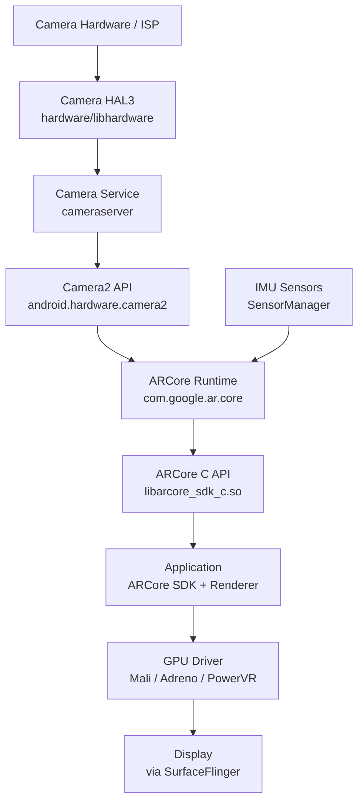
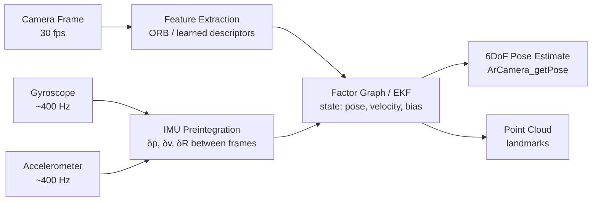
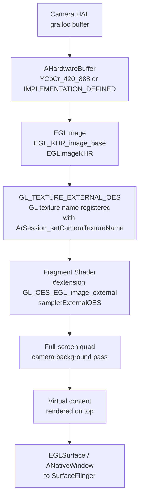
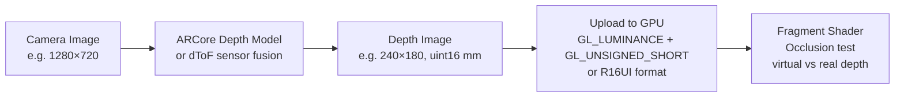
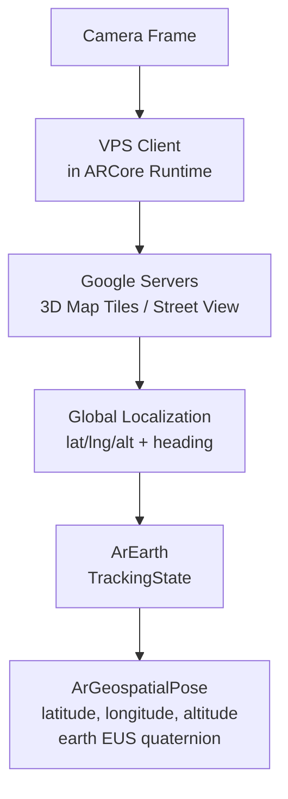
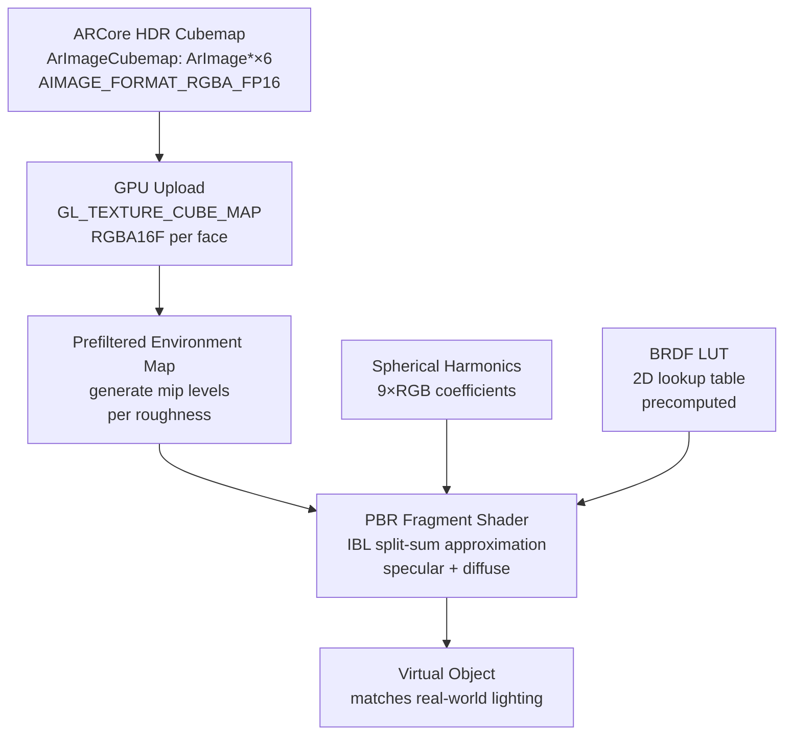
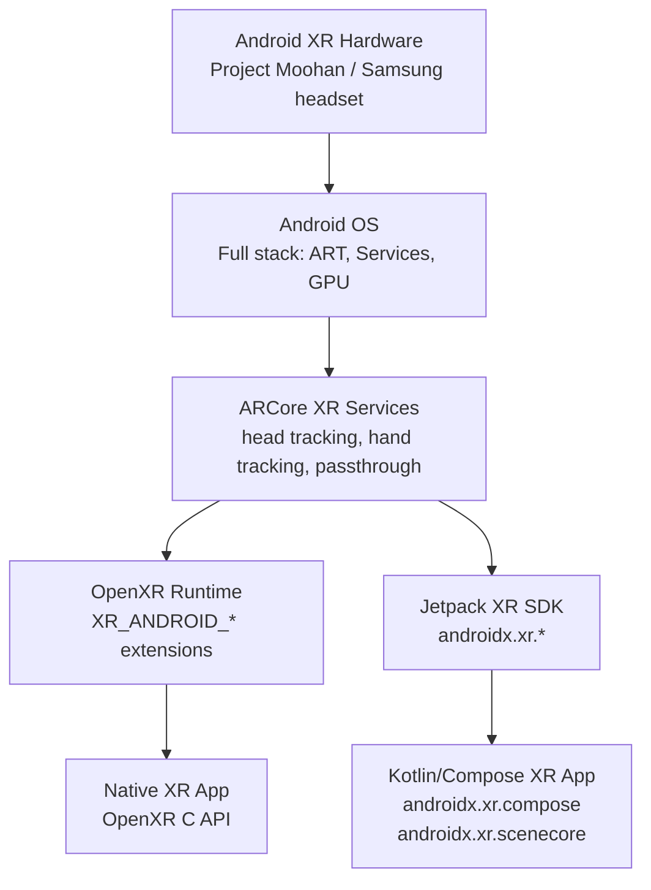
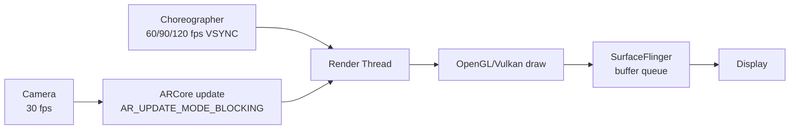
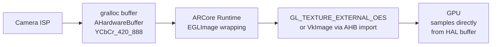

# Chapter 87 — Android AR: ARCore Architecture, Camera HAL Integration, and the Android XR Platform

> **Audiences:** Graphics application developers targeting Android AR/XR; systems developers who want to understand how ARCore integrates with the Android camera and graphics pipeline; engineers building spatial computing applications and exploring how the Android graphics stack adapts for augmented and mixed reality.

---

## Table of Contents

1. [ARCore Architecture Overview](#1-arcore-architecture-overview)
2. [The Android Camera Pipeline and ARCore](#2-the-android-camera-pipeline-and-arcore)
3. [Session Lifecycle and the ArSession API](#3-session-lifecycle-and-the-arsession-api)
4. [AR Rendering Pipeline: Camera Background and Virtual Content](#4-ar-rendering-pipeline-camera-background-and-virtual-content)
5. [Plane Detection and Environment Understanding](#5-plane-detection-and-environment-understanding)
6. [Depth API](#6-depth-api)
7. [Anchors, Persistent Anchors, and Cloud Anchors](#7-anchors-persistent-anchors-and-cloud-anchors)
8. [Light Estimation](#8-light-estimation)
9. [OpenXR on Android and Android XR](#9-openxr-on-android-and-android-xr)
10. [ARCore Recording, Playback, and the Dataset API](#10-arcore-recording-playback-and-the-dataset-api)
11. [Performance, Power, and Mobile GPU Considerations](#11-performance-power-and-mobile-gpu-considerations)
12. [Integrations](#12-integrations)

---

## 1. ARCore Architecture Overview

ARCore is Google's augmented reality SDK for Android. It is not a kernel subsystem, a HAL module, or a Vulkan layer — it is an application-layer SDK that sits above the Android operating system, consuming data from the Camera HAL and IMU sensors via standard Android APIs, and producing world-understanding primitives (poses, planes, anchors, depth maps, light estimates) that app-layer renderers consume. ARCore ships as a Play Services component (`com.google.ar.core`) that is updated independently of the Android OS version, letting Google iterate on tracking algorithms without waiting for OEM firmware updates. [Source: ARCore quickstart](https://developers.google.com/ar/develop/android/quickstart)

### Three core capabilities

ARCore rests on three pillars:

1. **Motion tracking** — Continuous 6DoF (six degrees of freedom) estimation of the device's position and orientation relative to its starting pose, achieved via Visual-Inertial Odometry (VIO) that fuses camera frames with accelerometer and gyroscope readings.
2. **Environmental understanding** — Detection of real-world geometry: horizontal and vertical planes, point clouds, depth maps, and (on Android 12+) per-pixel semantic labels. Planes are grown incrementally as the user moves through the space.
3. **Light estimation** — Analysis of the camera image to estimate scene illumination, ranging from a simple scalar ambient intensity to a full spherical HDR environment map suitable for image-based lighting (IBL) in PBR renderers.

### Position in the Android software stack



ARCore opens a camera session using the public `android.hardware.camera2` API (not a private HAL path), registers sensor listeners via `android.hardware.SensorManager`, fuses the data internally, and exposes results through the ARCore C API (`libarcore_sdk_c.so`) or the Java/Kotlin SDK (`com.google.ar.core`). [Source: ARCore C API reference](https://developers.google.com/ar/reference/c)

### Supported devices and API levels

ARCore requires Android 7.0 (API 24) as the minimum OS version. However, Google differentiates between:

- **AR Optional** apps — declare `<uses-library android:name="com.google.ar.core" android:required="false"/>` and degrade gracefully on unsupported devices. Minimum API 24.
- **AR Required** apps — declare `<uses-library android:name="com.google.ar.core" android:required="true"/>` and require Android 9.0 (API 28). This is the minimum at which ARCore's device compatibility list includes broad handset coverage.

As of 2025, over 1 billion Android devices support ARCore. The [ARCore supported devices list](https://developers.google.com/ar/devices) specifies which handsets have been validated; not every Android 9+ device is supported, as ARCore requires hardware validation by the OEM.

### ARCore vs ARKit (conceptual comparison)

Apple's ARKit occupies the analogous position in the iOS stack. Both SDKs are closed-source runtimes that consume camera and IMU data to produce VIO-based world tracking. Key architectural differences:

| Dimension | ARCore | ARKit |
|---|---|---|
| OS integration | Play Services (updatable) | OS framework (iOS update) |
| Camera API | Camera2 (public) | AVFoundation (private, tighter integration) |
| Depth | MotionStereo + dToF sensor | LiDAR on Pro devices |
| Geospatial | VPS via Street View tiles | —  |
| OpenXR | Supported via loader | Partial via visionOS |
| Headset support | Android XR / Project Moohan | Apple Vision Pro |

---

## 2. The Android Camera Pipeline and ARCore

### Camera HAL3 architecture

Android's Camera HAL3 defines a request/result pipeline. The HAL interface is declared in `hardware/libhardware/include/hardware/camera3.h` in AOSP:

```c
/* From hardware/libhardware/include/hardware/camera3.h */
typedef struct camera3_device_ops {
    int (*initialize)(const struct camera3_device *,
                      const camera3_callback_ops_t *callback_ops);
    int (*configure_streams)(const struct camera3_device *,
                             camera3_stream_configuration_t *stream_list);
    int (*process_capture_request)(const struct camera3_device *,
                                   camera3_capture_request_t *request);
    void (*dump)(const struct camera3_device *, int fd);
    int (*flush)(const struct camera3_device *);
    /* ... */
} camera3_device_ops_t;

typedef struct camera3_stream {
    int stream_type;    /* OUTPUT, INPUT, or BIDIRECTIONAL */
    uint32_t width;
    uint32_t height;
    int format;         /* HAL_PIXEL_FORMAT_* */
    uint32_t usage;     /* gralloc usage flags */
    uint32_t max_buffers;
    void *priv;         /* HAL private data */
    android_dataspace_t data_space;
    camera3_stream_rotation_t rotation;
    const char *physical_camera_id;
} camera3_stream_t;
```

[Source: AOSP Camera HAL docs](https://source.android.com/docs/core/camera)

`process_capture_request()` submits a single capture: the HAL fills the output buffers (gralloc-backed `AHardwareBuffer` objects) and returns results via the `camera3_callback_ops_t::process_capture_result()` callback. This is entirely asynchronous — requests are pipelined, and multiple frames can be in flight simultaneously.

### How ARCore opens a Camera2 session

ARCore operates above the HAL via the public Camera2 Java API. Internally, when `ArSession_resume()` is called, ARCore:

1. Calls `CameraManager.openCamera()` to obtain a `CameraDevice`.
2. Creates output surfaces: one for the preview stream (delivered to the GL texture name registered via `ArSession_setCameraTextureName()`), and optionally a CPU-accessible `ImageReader` for depth/semantics processing.
3. Calls `CameraDevice.createCaptureSession()` with the surface list.
4. Submits a repeating `CaptureRequest` built from the `TEMPLATE_RECORD` template:

```kotlin
// Conceptual — ARCore does this internally; exposed pattern for clarity
val captureRequestBuilder = cameraDevice.createCaptureRequest(
    CameraDevice.TEMPLATE_RECORD  // Stable framerate, continuous AF
)
captureRequestBuilder.addTarget(previewSurface)
captureRequestBuilder.set(CaptureRequest.CONTROL_AF_MODE,
    CaptureRequest.CONTROL_AF_MODE_CONTINUOUS_VIDEO)
cameraCaptureSession.setRepeatingRequest(
    captureRequestBuilder.build(), captureCallback, cameraHandler
)
```

`TEMPLATE_RECORD` is preferred over `TEMPLATE_PREVIEW` because it requests a stable, low-jitter frame rate (typically 30 fps) suitable for VIO, while `TEMPLATE_PREVIEW` may allow variable frame rate adjustments that would impair inertial fusion.

### IMU integration

ARCore registers two sensor listeners via `SensorManager`:

```java
sensorManager.registerListener(listener,
    sensorManager.getDefaultSensor(Sensor.TYPE_ACCELEROMETER),
    SensorManager.SENSOR_DELAY_FASTEST);

sensorManager.registerListener(listener,
    sensorManager.getDefaultSensor(Sensor.TYPE_GYROSCOPE),
    SensorManager.SENSOR_DELAY_FASTEST);
```

`SENSOR_DELAY_FASTEST` requests delivery at the sensor's native rate, typically 200–400 Hz on modern Android devices. High-rate gyroscope data is essential for VIO: the gyroscope provides fast, low-noise angular velocity between camera frames, while the accelerometer (after bias and gravity subtraction) provides linear acceleration.

### Visual-Inertial Odometry

ARCore's VIO pipeline is closed-source, but the general architecture matches published academic work on tightly-coupled VIO systems. The fusion occurs in a continuous optimization loop:



IMU preintegration accumulates gyroscope and accelerometer readings between camera frames into a single relative motion constraint, avoiding the need to replay all IMU readings at each optimization step. The resulting factor graph jointly optimizes camera poses, IMU biases, and 3D landmark positions.

Two pose queries reflect different coordinate transformations:

- `ArCamera_getPose()` — pose in the world coordinate frame (OpenGL convention: Y-up, looking along -Z).
- `ArCamera_getDisplayOrientedPose()` — same world pose but with an additional rotation that accounts for device display orientation (portrait vs landscape). Use this for overlaying UI elements aligned with the display.

[Source: ARCore C API reference](https://developers.google.com/ar/reference/c)

---

## 3. Session Lifecycle and the ArSession API

The ARCore C API (`arcore_sdk_c`) provides a flat C interface suitable for use from C++, Rust (via FFI), or any language with C interop. The Java/Kotlin SDK wraps this with object-oriented bindings, but for NDK-based renderers the C API is the authoritative interface.

### Session creation and lifecycle

```c
#include "arcore_sdk_c.h"

ArSession *ar_session = NULL;
ArStatus status = ArSession_create(env, context, &ar_session);
if (status != AR_SUCCESS) {
    // Handle: AR_ERROR_FATAL, AR_UNAVAILABLE_ARCORE_NOT_INSTALLED, etc.
}

// Configure before first resume
ArConfig *ar_config = NULL;
ArConfig_create(ar_session, &ar_config);
ArConfig_setFocusMode(ar_session, ar_config, AR_FOCUS_MODE_AUTO);
ArConfig_setUpdateMode(ar_session, ar_config, AR_UPDATE_MODE_LATEST_CAMERA_IMAGE);
ArConfig_setDepthMode(ar_session, ar_config, AR_DEPTH_MODE_AUTOMATIC);
ArConfig_setPlaneFindingMode(ar_session, ar_config, AR_PLANE_FINDING_MODE_HORIZONTAL_AND_VERTICAL);
ArConfig_setLightEstimationMode(ar_session, ar_config, AR_LIGHT_ESTIMATION_MODE_ENVIRONMENTAL_HDR);
ArSession_configure(ar_session, ar_config);
ArConfig_destroy(ar_config);

// Register camera texture (GL_TEXTURE_EXTERNAL_OES name)
ArSession_setCameraTextureName(ar_session, gl_texture_id);

// Resume (opens Camera2 session, starts tracking)
ArSession_resume(ar_session);
```

The `ArSession` lifecycle mirrors Android's `Activity` lifecycle: call `ArSession_pause()` in `onPause()` and `ArSession_resume()` in `onResume()`. Failing to pause releases the camera and stops IMU sampling, allowing other apps to use the camera.

```c
// In onPause():
ArSession_pause(ar_session);

// In onDestroy():
ArSession_destroy(ar_session);
ar_session = NULL;
```

### The update loop

Each render frame, call `ArSession_update()` to advance the tracking state:

```c
ArFrame *ar_frame = NULL;
ArFrame_create(ar_session, &ar_frame);

// In the render loop:
ArStatus update_status = ArSession_update(ar_session, ar_frame);
if (update_status != AR_SUCCESS) { /* handle */ }

// Extract camera from frame
ArCamera *ar_camera = NULL;
ArFrame_acquireCamera(ar_session, ar_frame, &ar_camera);

// Query tracking state
ArTrackingState tracking_state;
ArCamera_getTrackingState(ar_session, ar_camera, &tracking_state);
if (tracking_state == AR_TRACKING_STATE_TRACKING) {
    // Safe to use pose data
}

// Always release
ArCamera_release(ar_camera);
```

### ArPose: the 7-element representation

`ArPose` encodes a rigid body transform as a 7-element float array `[qx, qy, qz, qw, tx, ty, tz]` where `[qx, qy, qz, qw]` is a unit quaternion (Hamilton convention) and `[tx, ty, tz]` is the translation in meters in the world coordinate frame:

```c
ArPose *ar_pose = NULL;
ArPose_create(ar_session, NULL, &ar_pose);  // NULL → identity pose

// Extract view matrix (column-major, OpenGL convention)
float view_matrix[16];
ArCamera_getViewMatrix(ar_session, ar_camera, view_matrix);

// Extract projection matrix
float projection_matrix[16];
float near_clip = 0.1f;
float far_clip = 100.0f;
ArCamera_getProjectionMatrix(ar_session, ar_camera,
    near_clip, far_clip, projection_matrix);

ArPose_destroy(ar_pose);
```

### Update mode and focus mode

`AR_UPDATE_MODE_LATEST_CAMERA_IMAGE` (the default) causes `ArSession_update()` to return immediately with the most recently delivered camera frame, even if a newer frame has not arrived since the last call. `AR_UPDATE_MODE_BLOCKING` causes `ArSession_update()` to block until a new camera frame is available — useful when the render thread should be paced by camera arrival rather than a separate timer.

`AR_FOCUS_MODE_AUTO` enables continuous auto-focus, which generally improves feature tracking quality at the cost of occasional brief refocus transients. For depth-sensitive use cases (e.g., close-range object tracking), fixed focus may be preferable.

---

## 4. AR Rendering Pipeline: Camera Background and Virtual Content

The canonical AR rendering loop composites two layers: the live camera image as a background, and virtual content rendered on top using the AR pose. This section traces the GPU data path for both OpenGL ES and Vulkan.

### The OpenGL ES camera background path



The camera image delivered from Camera HAL is stored in a gralloc-backed `AHardwareBuffer`. ARCore wraps this in an `EGLImageKHR` via the `EGL_KHR_image_base` extension and binds it to the `GL_TEXTURE_EXTERNAL_OES` target. This path requires zero CPU copies — the GPU samples directly from the HAL output buffer.

The background GLSL fragment shader must use the external sampler:

```glsl
#extension GL_OES_EGL_image_external : require

precision mediump float;
uniform samplerExternalOES u_CameraTexture;
varying vec2 v_TexCoord;

void main() {
    gl_FragColor = texture2D(u_CameraTexture, v_TexCoord);
}
```

`samplerExternalOES` handles the implicit YCbCr-to-RGB conversion internally — the texture coordinates address the YCbCr planes and the hardware (or driver) performs the color space conversion in the sampler. [Source: OpenGL ES on Android](https://developer.android.com/develop/ui/views/graphics/opengl/about-opengl)

ARCore provides the correct texture coordinates accounting for display orientation and camera aspect ratio via `ArFrame_transformCoordinates2d()`, which maps normalized screen coordinates to texture coordinates.

### Virtual content rendering

After the background pass, virtual objects are rendered using the view and projection matrices from ARCore:

```c
// Already retrieved above:
// float view_matrix[16];   — ArCamera_getViewMatrix()
// float projection_matrix[16]; — ArCamera_getProjectionMatrix()

// Upload to GPU, render virtual objects with standard MVP transform
glUniformMatrix4fv(u_ProjectionMatrix, 1, GL_FALSE, projection_matrix);
glUniformMatrix4fv(u_ViewMatrix, 1, GL_FALSE, view_matrix);
// Draw virtual geometry ...
```

### Depth occlusion in GLSL

When depth occlusion is enabled (see §6), the fragment shader compares the virtual object's linearized depth against the sampled depth image to discard virtual pixels that are behind real geometry:

```glsl
uniform sampler2D u_DepthTexture;  // 16-bit depth in mm, uploaded from ArImage
uniform vec2 u_DepthTextureDimensions;
uniform float u_NearClip;
uniform float u_FarClip;

// Returns true if the virtual fragment is occluded by real geometry
bool IsOccluded(vec2 screen_uv, float virtual_depth_ndc) {
    // Convert NDC depth to eye-space meters
    float virtual_depth_m = u_NearClip * u_FarClip /
        (u_FarClip - virtual_depth_ndc * (u_FarClip - u_NearClip));

    // Sample depth image (values in millimeters)
    float real_depth_mm = texture2D(u_DepthTexture, screen_uv).r * 65535.0;
    float real_depth_m  = real_depth_mm / 1000.0;

    // Occlude if real surface is closer (and valid: depth != 0)
    return (real_depth_m > 0.0) && (real_depth_m < virtual_depth_m);
}
```

### Vulkan path: importing the camera AHardwareBuffer

For Vulkan-based renderers, the camera buffer is imported via `VK_ANDROID_external_memory_android_hardware_buffer`:

```cpp
// Step 1: Get the AHardwareBuffer from the ARCore CPU image or Android camera
AHardwareBuffer *ahb = /* obtained from ArImage or NDK Camera2 */;

// Step 2: Query Vulkan properties for this specific AHardwareBuffer
VkAndroidHardwareBufferPropertiesANDROID ahb_props = {
    .sType = VK_STRUCTURE_TYPE_ANDROID_HARDWARE_BUFFER_PROPERTIES_ANDROID,
};
VkAndroidHardwareBufferFormatPropertiesANDROID ahb_format_props = {
    .sType = VK_STRUCTURE_TYPE_ANDROID_HARDWARE_BUFFER_FORMAT_PROPERTIES_ANDROID,
};
ahb_props.pNext = &ahb_format_props;
vkGetAndroidHardwareBufferPropertiesANDROID(vk_device, ahb, &ahb_props);

// Step 3: Create YCbCr conversion (required for camera format)
VkSamplerYcbcrConversionCreateInfo ycbcr_info = {
    .sType = VK_STRUCTURE_TYPE_SAMPLER_YCBCR_CONVERSION_CREATE_INFO,
    .format = ahb_format_props.format,
    .ycbcrModel = ahb_format_props.suggestedYcbcrModel,
    .ycbcrRange = ahb_format_props.suggestedYcbcrRange,
    .components = ahb_format_props.samplerYcbcrConversionComponents,
    .xChromaOffset = ahb_format_props.suggestedXChromaOffset,
    .yChromaOffset = ahb_format_props.suggestedYChromaOffset,
    .chromaFilter = VK_FILTER_LINEAR,
    .forceExplicitReconstruction = VK_FALSE,
};
VkSamplerYcbcrConversion ycbcr_conversion;
vkCreateSamplerYcbcrConversion(vk_device, &ycbcr_info, NULL, &ycbcr_conversion);

// Step 4: Import AHardwareBuffer as VkDeviceMemory
VkImportAndroidHardwareBufferInfoANDROID import_info = {
    .sType = VK_STRUCTURE_TYPE_IMPORT_ANDROID_HARDWARE_BUFFER_INFO_ANDROID,
    .buffer = ahb,
};
VkMemoryAllocateInfo alloc_info = {
    .sType = VK_STRUCTURE_TYPE_MEMORY_ALLOCATE_INFO,
    .pNext = &import_info,
    .allocationSize = ahb_props.allocationSize,
    .memoryTypeIndex = /* select from ahb_props.memoryTypeBits */,
};
VkDeviceMemory camera_memory;
vkAllocateMemory(vk_device, &alloc_info, NULL, &camera_memory);
```

[Source: Android Vulkan NDK guide](https://developer.android.com/ndk/guides/graphics/android-vulkan-profile)

`VkSamplerYcbcrConversion` is mandatory for camera images because the camera produces data in YCbCr color spaces (typically `VK_FORMAT_UNDEFINED` with AHardwareBuffer format `AHARDWAREBUFFER_FORMAT_IMPLEMENTATION_DEFINED`); the conversion samples the Y, Cb, and Cr planes and performs the matrix multiply to RGB in the hardware sampler.

---

## 5. Plane Detection and Environment Understanding

### ArPlane objects

ARCore continuously segments the environment into planar surfaces. The app queries planes each frame:

```c
ArTrackableList *plane_list = NULL;
ArTrackableList_create(ar_session, &plane_list);
ArSession_getAllTrackables(ar_session, AR_TRACKABLE_PLANE, plane_list);

int32_t plane_count = 0;
ArTrackableList_getSize(ar_session, plane_list, &plane_count);

for (int i = 0; i < plane_count; i++) {
    ArTrackable *trackable = NULL;
    ArTrackableList_acquireItem(ar_session, plane_list, i, &trackable);

    ArPlane *plane = ArAsPlane(trackable);

    ArPlaneType plane_type;
    ArPlane_getType(ar_session, plane, &plane_type);
    // AR_PLANE_HORIZONTAL_UPWARD_FACING   — floor, tables
    // AR_PLANE_HORIZONTAL_DOWNWARD_FACING — ceiling
    // AR_PLANE_VERTICAL                   — walls

    ArTrackingState state;
    ArTrackable_getTrackingState(ar_session, trackable, &state);

    ArTrackable_release(trackable);
}
ArTrackableList_destroy(plane_list);
```

### Plane polygon boundary

Each plane exposes a convex polygon boundary in plane-local coordinates:

```c
float *polygon_data = NULL;
int32_t polygon_size = 0;
ArPlane_getPolygon(ar_session, plane, &polygon_data);
ArPlane_getPolygonSize(ar_session, plane, &polygon_size);
// polygon_data: array of polygon_size/2 (x, z) pairs in plane-local space
// Y is always 0 (the plane surface)
```

### Subsume relationships

ARCore merges smaller planes into larger ones as more geometry is observed. The subsumed plane remains accessible but delegates to the subsuming plane:

```c
ArPlane *subsumed_by = NULL;
ArPlane_acquireSubsumedBy(ar_session, plane, &subsumed_by);
if (subsumed_by != NULL) {
    // This plane was merged into subsumed_by; use subsumed_by for geometry
    ArTrackable_release(ArAsTrackable(subsumed_by));
}
```

### Point clouds

The feature point cloud from the VIO front-end is accessible each frame:

```c
ArPointCloud *point_cloud = NULL;
ArFrame_acquirePointCloud(ar_session, ar_frame, &point_cloud);

const float *point_data = NULL;
int32_t num_points = 0;
ArPointCloud_getData(ar_session, point_cloud, &point_data);
ArPointCloud_getNumberOfPoints(ar_session, point_cloud, &num_points);
// point_data: float[num_points * 4], each point is (x, y, z, confidence)
// confidence in [0.0, 1.0]: 1.0 = high quality landmark

ArPointCloud_release(point_cloud);
```

### Scene Semantics (Android 12+)

ARCore's Scene Semantics API assigns a semantic label to each pixel of the camera image, enabling AR experiences to react to specific real-world objects (sky, ground, water, buildings, plants):

```c
// Configure semantic mode
ArConfig_setSemanticMode(ar_session, ar_config, AR_SEMANTIC_MODE_ENABLED);

// Acquire semantic image per frame
ArImage *semantic_image = NULL;
ArFrame_acquireSemanticImage(ar_session, ar_frame, &semantic_image);
// Each pixel is uint8: AR_SEMANTIC_LABEL_SKY, AR_SEMANTIC_LABEL_GROUND,
// AR_SEMANTIC_LABEL_BUILDING, AR_SEMANTIC_LABEL_PLANT,
// AR_SEMANTIC_LABEL_WATER, AR_SEMANTIC_LABEL_PERSON, etc.
ArImage_release(semantic_image);
```

> **Note:** The exact `ArSemanticMode` enum names may differ between ARCore SDK versions; `AR_SEMANTIC_MODE_ENABLED` matches the pattern of other mode enums but should be verified against the installed SDK header.

### Instant Placement

For cases where the user points at a surface before ARCore has fully mapped it, Instant Placement provides an approximate anchor using a user-supplied distance estimate:

```c
ArHitResultList *hit_list = NULL;
ArHitResultList_create(ar_session, &hit_list);
ArFrame_hitTestInstantPlacement(ar_session, ar_frame,
    screen_x, screen_y,
    approximate_distance_meters,  // e.g., 1.0 meters
    hit_list);
// Resulting ArInstantPlacementPoint uses
// AR_INSTANT_PLACEMENT_POINT_TRACKING_METHOD_SCREENSPACE_WITH_APPROXIMATE_DISTANCE
// until a real plane is detected, then upgrades to full plane tracking
```

---

## 6. Depth API

ARCore's Depth API provides per-pixel real-world distance, enabling virtual objects to be realistically occluded by real-world geometry.

### Depth sources

ARCore obtains depth from three sources, selected based on device hardware:

1. **Structured light or dToF sensor depth** — Devices with active depth sensors (e.g., Pixel 4 with Project Soli-derived radar/dToF, some Samsung devices with ToF sensors) can provide raw depth without motion. This gives dense, accurate depth even for static scenes.
2. **Smooth depth** — Temporally filtered depth, suitable for stable occlusion rendering. Produced by ARCore's internal fusion of raw depth frames.
3. **MotionStereo** — ARCore computes depth from motion parallax on single-camera devices by matching features across consecutive frames at different viewpoints. Requires the user to be moving. This is the fallback for devices without active depth hardware.

### Depth mode configuration and acquisition

```c
// Enable depth in ArConfig
ArConfig_setDepthMode(ar_session, ar_config, AR_DEPTH_MODE_AUTOMATIC);
// AR_DEPTH_MODE_DISABLED       — no depth
// AR_DEPTH_MODE_AUTOMATIC      — use best available source (sensor or MotionStereo)
// AR_DEPTH_MODE_RAW_DEPTH_ONLY — raw (unsmoothed) depth only

// Smooth depth (millimeters, uint16, per pixel)
ArImage *depth_image = NULL;
ArFrame_acquireDepthImage16Bits(ar_session, ar_frame, &depth_image);

// Raw (unsmoothed) depth
ArImage *raw_depth_image = NULL;
ArFrame_acquireRawDepthImage16Bits(ar_session, ar_frame, &raw_depth_image);

// Confidence image for raw depth (uint8, 0-255, higher = more confident)
ArImage *confidence_image = NULL;
ArFrame_acquireRawDepthConfidenceImage(ar_session, ar_frame, &confidence_image);
```

### Depth image properties

The depth image is returned as a 16-bit unsigned integer image where each pixel encodes millimeter distance. Zero indicates invalid/no depth. The image resolution is significantly lower than the camera resolution — typically 160×120 or 240×180 pixels, depending on the device and ARCore version. The application must scale the depth UV coordinates when sampling in the fragment shader.



### Depth-based occlusion

When uploading the depth image to OpenGL ES, pack the 16-bit uint data into two 8-bit channels (for ES 2.0/3.0 compatibility) and decode in the shader. On ES 3.1+ devices with `GL_R16UI` support you can upload directly:

```c
// Upload depth image to OpenGL texture (ES 3.1+ path)
const uint8_t *plane_data;
int32_t plane_stride;
// ArImage from ARCore returns plane 0 as uint16 millimeter values
ArImage_getPlaneData(ar_session, depth_image, 0, &plane_data, &plane_stride);
// plane_stride is in bytes per row (= depth_width * 2 for packed uint16)

glBindTexture(GL_TEXTURE_2D, depth_texture_id);
// Upload as two-channel uint8 so each texel's r and g components hold
// the low and high bytes of the 16-bit depth value.
// In the shader: float depth_mm = (r_channel + g_channel * 256.0) * 65535.0 / 65536.0
// Alternatively on ES 3.1+ with GL_EXT_texture_norm16:
//   glTexImage2D(GL_TEXTURE_2D, 0, GL_R16_EXT, w, h, 0, GL_RED, GL_UNSIGNED_SHORT, data)
//   Then in shader: depth_mm = texture(u_DepthTexture, uv).r * 65535.0
glTexImage2D(GL_TEXTURE_2D, 0, GL_RG8,
    depth_width, depth_height, 0,
    GL_RG, GL_UNSIGNED_BYTE, plane_data);
```

The occlusion fragment shader in §4 uses the `GL_EXT_texture_norm16` single-channel path (sampling `.r * 65535.0`). When using the RG8 fallback, replace that sample with `(r_val + g_val * 256.0)` where `r_val = texture2D(u_DepthTexture, uv).r` and `g_val = texture2D(u_DepthTexture, uv).g`. Choose the appropriate path at runtime by checking `GL_EXT_texture_norm16` support.

> **Note:** The precise OpenGL ES format for 16-bit depth upload depends on the target API level and device capabilities. The ARCore SDK's `HelloAR` sample (`arcore-android-sdk/samples/hello_ar_c/app/src/main/cpp/depth_renderer.cc`) is the authoritative reference.

---

## 7. Anchors, Persistent Anchors, and Cloud Anchors

### Local anchors and hit-testing

An anchor fixes a virtual object to a real-world pose, tracking it as the world understanding improves:

```c
// Hit test: cast a ray from screen tap coordinates
float tap_x = /* screen_x */;
float tap_y = /* screen_y */;
ArHitResultList *hit_list = NULL;
ArHitResultList_create(ar_session, &hit_list);
ArFrame_hitTest(ar_session, ar_frame, tap_x, tap_y, hit_list);

int32_t hit_count = 0;
ArHitResultList_getSize(ar_session, hit_list, &hit_count);
if (hit_count > 0) {
    ArHitResult *hit_result = NULL;
    ArHitResultList_getItem(ar_session, hit_list, 0, &hit_result);

    // Create an anchor at the hit location
    ArAnchor *anchor = NULL;
    ArHitResult_acquireNewAnchor(ar_session, hit_result, &anchor);
    // Or: ArSession_acquireNewAnchor(ar_session, ar_pose, &anchor)

    ArHitResult_destroy(hit_result);
}
ArHitResultList_destroy(hit_list);
```

Anchors have a tracking state that degrades if the device can no longer localize relative to the anchor's reference geometry:

```c
ArTrackingState anchor_state;
ArAnchor_getTrackingState(ar_session, anchor, &anchor_state);
// AR_TRACKING_STATE_TRACKING  — anchor is actively tracked
// AR_TRACKING_STATE_PAUSED    — temporarily lost; may recover
// AR_TRACKING_STATE_STOPPED   — anchor permanently untracked; release it
```

### Geospatial API and WGS84 anchors

The Geospatial API uses Google's Visual Positioning System (VPS), which matches camera frames against Street View imagery and 3D map tiles to localize the device on the Earth's surface to sub-meter accuracy in covered areas.



The entry point is the `ArEarth` object, obtained from the session:

```c
ArEarth *ar_earth = NULL;
ArSession_acquireEarth(ar_session, &ar_earth);

ArTrackingState earth_tracking_state;
ArEarth_getTrackingState(ar_session, ar_earth, &earth_tracking_state);

if (earth_tracking_state == AR_TRACKING_STATE_TRACKING) {
    ArGeospatialPose *camera_geospatial_pose = NULL;
    ArGeospatialPose_create(ar_session, &camera_geospatial_pose);
    ArEarth_getCameraGeospatialPose(ar_session, ar_earth, camera_geospatial_pose);

    double latitude, longitude, altitude, heading_accuracy, altitude_accuracy;
    float quaternion[4];  // EUS (East-Up-South) orientation
    ArGeospatialPose_getLatitude(ar_session, camera_geospatial_pose, &latitude);
    ArGeospatialPose_getLongitude(ar_session, camera_geospatial_pose, &longitude);
    ArGeospatialPose_getAltitude(ar_session, camera_geospatial_pose, &altitude);

    // Create a WGS84 geospatial anchor
    ArAnchor *geo_anchor = NULL;
    float eus_quaternion[4] = {0.0f, 0.0f, 0.0f, 1.0f};  // identity EUS rotation
    ArEarth_acquireNewAnchor(ar_session, ar_earth,
        latitude, longitude, altitude,
        eus_quaternion,
        &geo_anchor);

    ArGeospatialPose_destroy(camera_geospatial_pose);
}
ArEarth_release(ar_earth);
```

> **Note:** The function `ArSession_acquireWGS84GeospatialAnchor()` mentioned in some older documentation is incorrect; the actual API is `ArEarth_acquireNewAnchor()` as shown above. For terrain-relative anchors (altitude above terrain rather than WGS84 ellipsoid), use `ArEarth_resolveAnchorOnTerrainAsync()`. [Source: ARCore Geospatial developer guide](https://developers.google.com/ar/develop/geospatial)

### Cloud Anchors

Cloud Anchors upload a feature map descriptor to Google's ARCore Cloud API, allowing other devices to resolve the same anchor — enabling shared AR experiences:

```c
// Host: upload anchor to cloud
// Signature: ArSession_hostCloudAnchorAsync(session, anchor, ttl_days,
//                context, callback, out_future)
ArHostCloudAnchorFuture *host_future = NULL;
ArSession_hostCloudAnchorAsync(ar_session, local_anchor,
    /* ttl_days */ 365,
    callback_context, host_callback,
    &host_future);

// In host_callback — receives future result; call ArAnchor_acquireCloudAnchorId()
// to get the string ID. The exact callback signature may vary by SDK version;
// consult ArHostCloudAnchorCallback in the ARCore header.
// Note: needs verification — callback signature (string vs ArAnchor*) is not
// fully documented in the public web reference.

// Resolve: download anchor on another device
// Signature: ArSession_resolveCloudAnchorAsync(session, cloud_anchor_id,
//                context, callback, out_future)
ArResolveCloudAnchorFuture *resolve_future = NULL;
ArSession_resolveCloudAnchorAsync(ar_session, cloud_anchor_id,
    callback_context, resolve_callback,
    &resolve_future);
```

Cloud Anchor quality depends on `ArFeatureMapQuality`, queryable before hosting: `AR_FEATURE_MAP_QUALITY_INSUFFICIENT`, `AR_FEATURE_MAP_QUALITY_SUFFICIENT`, `AR_FEATURE_MAP_QUALITY_GOOD`. Moving the device to map more visual features improves quality. [Source: ARCore Cloud Anchors guide](https://developers.google.com/ar/develop/cloud-anchors)

---

## 8. Light Estimation

ARCore analyzes the camera image to estimate real-world illumination, allowing virtual objects to match the lighting of the scene.

### Ambient Intensity mode

The simpler mode returns a single scalar luminance estimate and a color correction vector:

```c
ArLightEstimate *light_estimate = NULL;
ArLightEstimate_create(ar_session, &light_estimate);
ArFrame_getLightEstimate(ar_session, ar_frame, light_estimate);

ArLightEstimateState estimate_state;
ArLightEstimate_getState(ar_session, light_estimate, &estimate_state);

if (estimate_state == AR_LIGHT_ESTIMATE_STATE_VALID) {
    float pixel_intensity;
    ArLightEstimate_getPixelIntensity(ar_session, light_estimate, &pixel_intensity);
    // pixel_intensity: normalized [0.0, 1.0] representing scene brightness

    float color_correction[4];  // [r, g, b, a] color correction factors
    ArLightEstimate_getColorCorrection(ar_session, light_estimate, color_correction);
    // multiply virtual object color channels by these factors
}
```

### Environmental HDR mode

The full HDR mode produces a spherical environment map that captures directional lighting from the entire scene. This enables high-quality Image-Based Lighting (IBL) for PBR virtual objects:

```c
// Configured with: AR_LIGHT_ESTIMATION_MODE_ENVIRONMENTAL_HDR

// Main directional light
float main_light_direction[3];  // unit vector
float main_light_intensity[3];  // RGB intensities (HDR, can exceed 1.0)
ArLightEstimate_getEnvironmentalHdrMainLightDirection(
    ar_session, light_estimate, main_light_direction);
ArLightEstimate_getEnvironmentalHdrMainLightIntensity(
    ar_session, light_estimate, main_light_intensity);

// Ambient spherical harmonics (L2 SH, 9 coefficients × 3 channels)
float spherical_harmonics[27];
ArLightEstimate_getEnvironmentalHdrAmbientSphericalHarmonics(
    ar_session, light_estimate, spherical_harmonics);

// Full HDR cubemap: ArImageCubemap is a typedef for ArImage*[6]
// Signature: ArLightEstimate_acquireEnvironmentalHdrCubemap(session,
//                light_estimate, out_textures_6)
ArImageCubemap cubemap_textures;  // ArImage *[6]
ArLightEstimate_acquireEnvironmentalHdrCubemap(
    ar_session, light_estimate, cubemap_textures);
// cubemap_textures[0..5]: 6 ArImage* pointers, one per cube face
// Each ArImage is in AIMAGE_FORMAT_RGBA_FP16 format
// Release each: ArImage_release(cubemap_textures[i])
```

### Using the HDR cubemap for IBL



The split-sum approximation for IBL breaks the specular integral into a prefiltered environment map lookup and a BRDF integration lookup:

```glsl
// Specular IBL (split-sum approximation)
vec3 R = reflect(-V, N);
float mip_level = roughness * MAX_MIP_LEVEL;
vec3 prefiltered_color = textureLod(u_EnvMap, R, mip_level).rgb;
vec2 brdf_lut = texture(u_BrdfLut, vec2(max(dot(N, V), 0.0), roughness)).rg;
vec3 specular_ibl = prefiltered_color * (F0 * brdf_lut.x + brdf_lut.y);
```

The directional light from `ArLightEstimate_getEnvironmentalHdrMainLightDirection()` supplements the IBL for sharp shadows and strong directional highlights, making virtual objects visually plausible in the real scene.

---

## 9. OpenXR on Android and Android XR

### ARCore as an OpenXR runtime

ARCore ships an OpenXR loader for Android, enabling apps written to the Khronos OpenXR standard to run on ARCore-capable devices without the ARCore-specific C API. The loader is packaged within ARCore services and exposed via the Android package meta-data mechanism:

```xml
<!-- In ARCore services manifest (managed by Google) -->
<meta-data android:name="com.google.ar.core.openxr_loader"
           android:value="..."/>
```

Supported extensions on ARCore include:

| Extension | Capability |
|---|---|
| `XR_EXT_hand_tracking` | Hand joint pose tracking (on supported devices) |
| `XR_KHR_android_surface_swapchain` | Render to Android `Surface` for camera background |
| `XR_ANDROID_trackables` | Planes and anchors exposed as OpenXR trackable types |
| `XR_EXT_performance_settings` | CPU/GPU performance level hints |
| `XR_KHR_composition_layer_depth` | Depth-based compositing |

### Android XR Platform

Android XR is Google's standalone spatial computing platform, announced in 2024 and shipping in 2025 with Samsung's Project Moohan headset as the first reference hardware. Unlike handheld ARCore (which overlays content on the phone display), Android XR targets mixed reality headsets running the full Android OS with Google services. [Source: Jetpack XR releases](https://developer.android.com/jetpack/androidx/releases/xr)



### Jetpack XR API

Jetpack XR (`androidx.xr`) provides a high-level Kotlin/Java API over ARCore and OpenXR. As of 2025, the modules are in alpha stage:

| Module | Purpose |
|---|---|
| `androidx.xr.runtime` | Core session, spatial capabilities |
| `androidx.xr.scenecore` | Entity hierarchy, anchors, 3D models |
| `androidx.xr.compose` | Compose-based spatial UI panels |
| `androidx.xr.arcore` | ARCore integration for Jetpack XR |

The Jetpack XR session wraps both ARCore and OpenXR:

```kotlin
import androidx.xr.runtime.Session
import androidx.xr.scenecore.JxrPlatformAdapter
import androidx.xr.scenecore.GltfModelEntity
import androidx.xr.scenecore.PanelEntity
import androidx.xr.scenecore.SpatialCapabilities

// Create Jetpack XR session (requires Activity context)
val session = Session.create(activity)

// Check spatial capabilities on this device
val capabilities = session.getSpatialCapabilities()
if (capabilities.hasCapability(SpatialCapabilities.SPATIAL_CAPABILITY_3D_CONTENT)) {
    // Load a GLTF model into the 3D scene
    val modelFuture = GltfModelEntity.create(session, "model.glb")
    modelFuture.thenAccept { entity ->
        entity.setScale(0.5f)
        entity.setPose(Pose(Vector3(0f, 1.5f, -2f), Quaternion.Identity))
    }
}

// Create a Compose-backed spatial panel
val panelEntity = PanelEntity.create(
    session,
    /* composeContent */ { MyComposable() },
    widthPx = 800, heightPx = 600,
    "settings_panel"
)
```

> **Note:** Jetpack XR is in alpha (version 1.0.0-alpha15 as of 2025); API names and signatures are subject to change. Verify against the current `androidx.xr` API reference before shipping.

### Passthrough on Android XR

Passthrough (the see-through camera feed composited with virtual content) on Android XR headsets is managed by the platform's compositor layer system. The OpenXR equivalent uses platform-native extensions:

- `XR_FB_passthrough` (from Meta's extension, adopted for Android XR compatibility)
- Or platform-native Android XR passthrough APIs via `androidx.xr.runtime`

The passthrough layer is inserted below the application's swapchain images in the compositor stack, analogous to how ARCore's `GL_TEXTURE_EXTERNAL_OES` background works on phones, but composited by the headset's dedicated display pipeline rather than a phone's SurfaceFlinger.

---

## 10. ARCore Recording, Playback, and the Dataset API

ARCore supports recording AR sessions to a file and playing them back deterministically — essential for CI/CD testing of AR applications and for offline algorithm development.

### Recording

```c
// Configure recording
ArRecordingConfig *recording_config = NULL;
ArRecordingConfig_create(ar_session, &recording_config);
ArRecordingConfig_setMp4DatasetFilePath(ar_session, recording_config,
    "/sdcard/ar_session.mp4");
// Optionally add custom track data via ArRecordingConfig_setRecordingRotation

// Start recording (camera + IMU + tracking data go into MP4 container)
ArStatus record_status = ArSession_startRecording(ar_session, recording_config);
ArRecordingConfig_destroy(recording_config);

// ... run AR session normally ...

// Stop recording
ArSession_stopRecording(ar_session);
```

The MP4 file uses standard video tracks for camera frames and custom `mp4` tracks for IMU data, ARCore internal state, and metadata. The format is self-contained: all inputs needed to reproduce the tracking result are embedded.

### Playback

```c
ArPlaybackConfig *playback_config = NULL;
ArPlaybackConfig_create(ar_session, &playback_config);
ArPlaybackConfig_setMp4DatasetFilePath(ar_session, playback_config,
    "/sdcard/ar_session.mp4");
ArSession_startPlayback(ar_session, playback_config);
ArPlaybackConfig_destroy(playback_config);

// ArSession_update() now drives from the recorded file
// Tracking is fully deterministic — same pose output for same input
```

[Source: ARCore Recording and Playback](https://developers.google.com/ar/develop/recording-and-playback)

### Use in automated testing

The deterministic replay is particularly valuable for CI pipelines:

1. Record a reference session in a controlled real-world environment.
2. Commit the `.mp4` recording to LFS or a test artifact store.
3. In CI, run the playback session and assert that anchor poses, plane detections, and light estimate values fall within expected bounds.
4. This eliminates flakiness from real hardware availability and enables regression testing of VIO and tracking algorithm changes.

Custom tracks allow the test harness to inject application-layer events (e.g., simulated tap hit-tests) synchronized with the recorded session:

```c
// Write custom data to a recording track
const char *track_id_str = "com.example.test.events";
ArRecordingConfig_addCustomTrackData(ar_session, recording_config,
    track_id_str, (const uint8_t *)event_data, event_data_size,
    event_timestamp_ns);
```

---

## 11. Performance, Power, and Mobile GPU Considerations

### CPU cost: VIO tracking thread

ARCore's VIO pipeline runs on a dedicated background thread, typically consuming one full CPU core at 30 fps on a modern Qualcomm Snapdragon or Samsung Exynos device. This thread performs:

- Feature extraction from the camera frame (ORB or learned descriptors)
- IMU preintegration for the current inter-frame interval
- Factor graph update / EKF prediction and correction
- Plane detection and expansion (incremental RANSAC-based fitting)

Applications should avoid pinning high-priority render threads to the same CPU cluster as ARCore's tracking thread to prevent scheduling contention.

### GPU cost

ARCore offloads some computation to the GPU and to Android's Neural Networks API (NNAPI):

- **Depth from MotionStereo** — depth estimation from motion parallax uses a convolutional model (quantized for NNAPI or GPU delegate) that runs on the GPU or DSP.
- **Scene Semantics** — semantic segmentation uses an on-device ML model, again via NNAPI.
- **Light estimation** — HDR environment map generation uses GPU-accelerated panorama synthesis.

These ML workloads run on the GPU's shader cores or a dedicated NPU (Neural Processing Unit, e.g., Hexagon DSP on Snapdragon). The application's render workload competes for the same GPU resources; profiling with Snapdragon Profiler or Mali Performance Counters (see Ch6) is essential for detecting ARCore-induced GPU load spikes.

### Camera stream and power

ARCore consumes the camera preview stream — not full-resolution burst captures — typically at 30 fps and 640×480 or 1280×720 pixels, depending on the device and ARCore version. Camera streaming is a significant power draw; ARCore cannot reduce it below the minimum needed for VIO quality. On thermally constrained devices:

- `ArSession_update()` latency increases as the camera and SoC clock down under thermal pressure.
- ARCore may internally reduce the feature tracking rate.
- The VIO tracking state may intermittently switch to `AR_TRACKING_STATE_PAUSED`.

### Frame pacing and VSYNC



The render thread should drive its pacing from `android.view.Choreographer` (aligned to display VSYNC), not from `ArSession_update()`. Blocking on `ArSession_update()` with `AR_UPDATE_MODE_BLOCKING` ties the render thread to camera cadence (30 fps), which is suboptimal on 60/90/120 Hz displays. The recommended pattern:

1. A background thread calls `ArSession_update()` in `AR_UPDATE_MODE_BLOCKING` mode and signals a condition variable when a new AR frame is ready.
2. The render thread, driven by `Choreographer.doFrame()` callbacks, reads the latest AR pose (which may repeat between camera frames) and renders at the full display refresh rate.
3. This decoupling prevents frame drops from occasional camera latency spikes.

### AHardwareBuffer zero-copy pipeline

A key advantage of ARCore's architecture is that the camera image traverses the entire pipeline — from HAL to GPU sampling — without any CPU copy:



The gralloc buffer allocated by the Camera HAL is the same memory object that the GPU samples in the background shader. ARCore's `ArSession_setCameraTextureName()` registers the OpenGL texture name into which ARCore will bind successive `EGLImageKHR` wrappers as new camera frames arrive, maintaining the zero-copy invariant throughout the AR rendering loop.

This zero-copy design is critical for mobile power budgets: a 1280×720 YCbCr frame at 30 fps would cost approximately 66 MB/s of memory bandwidth on a CPU copy; the zero-copy path eliminates this entirely.

---

## 12. Integrations

This chapter connects to the following chapters across the book:

**Ch85 — Android SurfaceFlinger** (`chapters/part-19-android-graphics/ch85-android-surfaceflinger.md`): The AR rendered output — composited camera background plus virtual content — enters SurfaceFlinger's buffer queue as a `SurfaceControl` layer. SurfaceFlinger composites the AR surface with other Android UI layers (status bar, navigation) using its hardware composer (HWC) pipeline. The `AHardwareBuffer` zero-copy chain from Camera HAL described in §4 and §11 of this chapter ends at SurfaceFlinger's HWC consumer. For headset-based Android XR (§9), SurfaceFlinger's role is replaced or supplemented by the headset compositor's layer system.

**Ch86 — Vulkan on Android** (`chapters/part-19-android-graphics/ch86-android-vulkan.md`): The Vulkan camera import path in §4 of this chapter — `VK_ANDROID_external_memory_android_hardware_buffer`, `vkGetAndroidHardwareBufferPropertiesANDROID()`, `VkSamplerYcbcrConversion` — is covered in depth in Ch86's §6 (AHardwareBuffer and Vulkan Interop). The YCbCr conversion requirements for camera textures, and the Android Vulkan Profiles (AVP 2022+) that guarantee AHB support, are treated there. Vulkan-based AR renderers should read Ch86 alongside this chapter.

**Ch27 — VR/AR on Linux and OpenXR** (`chapters/part-07-application-apis-middleware/`): §9 of this chapter discusses ARCore's OpenXR loader and Android XR's OpenXR extensions. Ch27 covers the Monado OpenXR runtime on Linux, the OpenXR session lifecycle, and the XR extension ecosystem. The architectural comparison — Monado's modular compositor vs ARCore's closed runtime, Linux V4L2 camera vs Android Camera HAL3 — illuminates how the Khronos OpenXR standard abstracts across two very different OS stacks.

**Ch26 — Hardware Video Decode and Camera** (`chapters/part-07-application-apis-middleware/`): The Camera HAL3 architecture in §2 of this chapter (Camera HAL, `process_capture_request()`, gralloc buffers) has a Linux-side equivalent in V4L2 (Video4Linux2) and libcamera. Ch26 covers the Linux camera pipeline: V4L2 subdevice graphs, media controller topology, libcamera's pipeline handler architecture, and how camera buffers flow through `DMA-BUF` to the GPU. Comparing `camera3_stream_t` (Android) with V4L2's `v4l2_buffer` reveals how both systems solve the same HAL design problem — zero-copy buffer handoff from ISP to consumer — under different OS abstractions.

**Ch6 — ARM GPU Drivers: Mali and Adreno** (`chapters/part-02-gpu-drivers/`): The GPU powering ARCore rendering on the vast majority of Android devices is either a Qualcomm Adreno or ARM Mali part. §11 of this chapter references Snapdragon Profiler and Mali Performance Counters for diagnosing ARCore GPU load. Ch6 covers the kernel-side driver architecture for these GPUs: the Adreno `msm-gpu` DRM driver, Mali's Midgard/Valhall firmware model, tile-based deferred rendering (TBDR) and its implications for AR multi-pass rendering (the camera background pass + virtual content pass + post-processing), and power management via `devfreq`. AR workloads' combination of texture sampling from external formats, conditional rendering (depth occlusion discard), and ML inference make them non-trivial from a GPU scheduling perspective.

**Ch24 — Vulkan and EGL for Application Developers** (`chapters/part-07-application-apis-middleware/`): The `EGLImage`/`GL_TEXTURE_EXTERNAL_OES` background path (§4) and the `AHardwareBuffer` Vulkan import path (§4) are specific Android-side instances of the general EGL and Vulkan interop mechanisms covered in Ch24. That chapter treats `EGL_KHR_image_base`, `EGL_ANDROID_image_native_buffer`, `EGLImageKHR` creation and lifetime, and the Vulkan external memory extensions (`VK_KHR_external_memory`, `VK_EXT_external_memory_dma_buf` on Linux). Reading Ch24 before this chapter's §4 provides the foundational understanding of why `samplerExternalOES` requires an extension declaration and why `VkSamplerYcbcrConversion` is non-optional for camera-format textures.

---

*References:*

- [ARCore C API Reference](https://developers.google.com/ar/reference/c)
- [ARCore Android Quickstart](https://developers.google.com/ar/develop/android/quickstart)
- [Android Camera HAL Documentation](https://source.android.com/docs/core/camera)
- [Android Vulkan NDK Guide](https://developer.android.com/ndk/guides/graphics/android-vulkan-profile)
- [OpenGL ES on Android](https://developer.android.com/develop/ui/views/graphics/opengl/about-opengl)
- [ARCore Recording and Playback](https://developers.google.com/ar/develop/recording-and-playback)
- [ARCore Geospatial API](https://developers.google.com/ar/develop/geospatial)
- [ARCore Cloud Anchors](https://developers.google.com/ar/develop/cloud-anchors)
- [Jetpack XR Releases](https://developer.android.com/jetpack/androidx/releases/xr)

---

*Copyright © 2026 jreuben11. Licensed under [CC BY 4.0](https://creativecommons.org/licenses/by/4.0/).*
