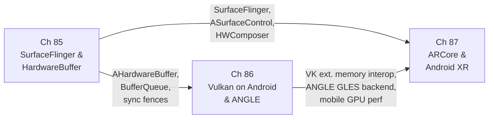

# Part XIX — Android Graphics

Android is a Linux-based operating system, and its graphics stack is built directly on the same kernel primitives — **DRM/KMS**, **DMA-BUF**, **sync_file**, and **dma_fence** — that underpin the Wayland desktop compositor ecosystem explored in earlier parts of this book. What distinguishes Android is the proprietary middleware erected above those primitives: a **Hardware Abstraction Layer** (**HAL**) consisting of **Gralloc** for buffer allocation and **HWComposer** for display control, a framework compositor (**SurfaceFlinger**) that replaces the Wayland protocol, and an application-layer AR SDK (**ARCore**) that consumes the resulting graphics pipeline for spatial computing. This part examines that stack from the shared buffer model at the bottom to augmented reality at the top, showing where Android converges with and diverges from the Linux desktop graphics world.

## Chapters in This Part

**Chapter 85 — Android Compositor: SurfaceFlinger, HardwareBuffer, and the Buffer Pipeline** establishes the foundational layer of Android graphics. It covers **Gralloc** (**IAllocator** / **IMapper**) and **AHardwareBuffer** as the shared-buffer substrate, the **BufferQueue** producer-consumer pipeline connecting application surfaces to **SurfaceFlinger**, the **HWComposer** (**HWC2** / **HWC3**) validate-then-present flow that drives **DRM** atomic commits, **HWUI**'s **SkiaVulkanPipeline** and **SkiaOpenGLPipeline** for Java View rendering, **ASurfaceControl** for multi-surface atomic updates from native code, and Android's **sync_file** fence model. Readers learn how every frame produced by any Android application — whether drawn with **Canvas**, **OpenGL ES**, or **Vulkan** — passes through **BufferQueue** and **SurfaceFlinger** before reaching the display. This chapter is the Android counterpart to the Wayland compositor chapters in Part VI, showing how the same kernel-level primitives support a fundamentally different userspace architecture.

**Chapter 86 — Vulkan on Android: Drivers, ANGLE, and Mobile GPU Performance** descends into the GPU execution layer that Chapter 85 relies on for compositing and application rendering. It covers the **Android Vulkan Loader** (`libvulkan.so`), GPU vendor ICDs for **Qualcomm Adreno**, **ARM Mali**, and **Imagination PowerVR**, the open-source **Turnip** and **freedreno** Mesa drivers for Adreno hardware, **ANGLE** as the system OpenGL ES implementation on Pixel devices, **AHardwareBuffer**–**Vulkan** interop via **VK_ANDROID_external_memory_android_hardware_buffer**, Android-specific extensions including **VK_KHR_android_surface** and **VK_GOOGLE_display_timing**, shader compilation via **SPIR-V** and **shaderc**, and mobile-specific performance considerations including **Tile-Based Deferred Rendering** (**TBDR**) and unified-memory heap topology. The chapter closes with how **Chrome** on Android routes **WebGPU** (via **Dawn**'s Vulkan backend) and **WebGL** (via **ANGLE**) through **AHardwareBuffer** to **SurfaceFlinger** via **ASurfaceControl**. Unlike earlier Vulkan chapters that focus on desktop GPU architectures and desktop Linux loader mechanics, this chapter is authoritative on the mobile-specific deviations: APEX ICD delivery, the Android Vulkan Profiles, and why explicit **VkRenderPass** objects remain essential on TBDR hardware even after **VK_KHR_dynamic_rendering**.

**Chapter 87 — Android AR: ARCore Architecture, Camera HAL Integration, and the Android XR Platform** brings the Android graphics stack into spatial computing. It traces how **ARCore** (a Play Services component, not a HAL module) layers above **Camera HAL3** and **android.hardware.camera2** to fuse camera frames with **IMU** data via **Visual-Inertial Odometry** (**VIO**), producing world-understanding primitives — **ArPose**, **ArPlane**, depth maps, light estimates — that renderers consume. The chapter covers the zero-copy camera background rendering path via **GL_TEXTURE_EXTERNAL_OES** and **EGLImageKHR**, Vulkan import of camera frames via **VkSamplerYcbcrConversion**, the **Depth API** (structured light, **MotionStereo**), the **Geospatial API** using Google's **Visual Positioning System** (**VPS**), **Cloud Anchors**, the **Environmental HDR** light estimation mode with spherical harmonics, and the **OpenXR** loader shipped inside ARCore services. It closes with the **Android XR** spatial computing platform, the **Jetpack XR SDK** (**androidx.xr**), and headsets such as **Project Moohan**. This chapter is the Android counterpart to the OpenXR chapters in Part VIII, but it begins from camera sensor hardware rather than from a Vulkan swapchain.

## How the Chapters Interrelate

The three chapters form a strict bottom-up dependency chain, and they also share a set of data structures and interfaces that weave through all three.

**AHardwareBuffer** is the central shared artifact. It is allocated by **Gralloc** (Chapter 85), imported into **Vulkan** via **VK_ANDROID_external_memory_android_hardware_buffer** (Chapter 86), and consumed as a zero-copy camera output buffer by **ARCore**'s **Camera HAL3** integration (Chapter 87). A reader who does not understand what an **AHardwareBuffer** is — how it wraps a **DMA-BUF** file descriptor inside a `native_handle_t`, how it is shared cross-process over **Binder**, and how it carries format and usage flags that constrain GPU access — will not be able to follow the Vulkan interop discussion in Chapter 86 or the camera frame rendering path in Chapter 87. Chapter 85 must therefore be read first.

**Sync fences** form a second shared thread. The **android::Fence** / **sync_file** model introduced in Chapter 85 as the mechanism synchronising **BufferQueue** slots between producer and **SurfaceFlinger** is the same fence model that Chapter 86's Vulkan extensions rely on for swapchain present ordering (**VkSemaphore** imported from `sync_file`), and the same model that Chapter 87 relies on to pipeline camera frame acquisition against GPU rendering without a CPU stall.

Chapter 86 depends on Chapter 85 because the Android Vulkan swapchain (**VK_KHR_swapchain**) is ultimately a **BufferQueue** consumer: `vkQueuePresentKHR()` calls into **ANativeWindow** which dequeues a **Gralloc** buffer, and the resulting **AHardwareBuffer** is composited by **SurfaceFlinger** using exactly the **HWComposer** pipeline described in Chapter 85.

Chapter 87 depends on both predecessors. Its **OpenGL ES** camera background path calls through ANGLE (Chapter 86) to produce a texture that is rendered alongside virtual geometry; its **Vulkan** camera import path uses the interop mechanism fully specified in Chapter 86, Section 6; and the final composited AR frame reaches the display via **SurfaceFlinger** and **ASurfaceControl** (Chapter 85, Section 7). **ARCore**'s own scheduling is coupled to Android's **VSYNC** / **Choreographer** infrastructure, which is itself driven by **SurfaceFlinger**'s **DispSync** model from Chapter 85.

The thematic arc of the part is therefore: shared memory model → GPU execution model → world-understanding application layer. Each chapter inherits the buffer contracts and synchronisation primitives established by the chapter below it.

## Prerequisites and What Comes Next

Readers should be comfortable with the Linux **DRM/KMS** and **DMA-BUF** subsystems from Part I, with the Wayland compositor model from Part VI (especially the buffer-passing and fence-signalling protocols that Chapter 85 maps onto Android equivalents), and with the core Vulkan swapchain and memory-allocation concepts from Part II. Chapter 87 additionally assumes familiarity with the **OpenXR** session model introduced in Part VIII. These three chapters together form the Android-specific lens through which many of the generic graphics stack concepts in Parts I–VIII can be re-examined in a production mobile context; Part XX continues the mobile thread by examining the Apple Silicon and iOS graphics stack, where many parallel design choices were made under different architectural constraints.

---
