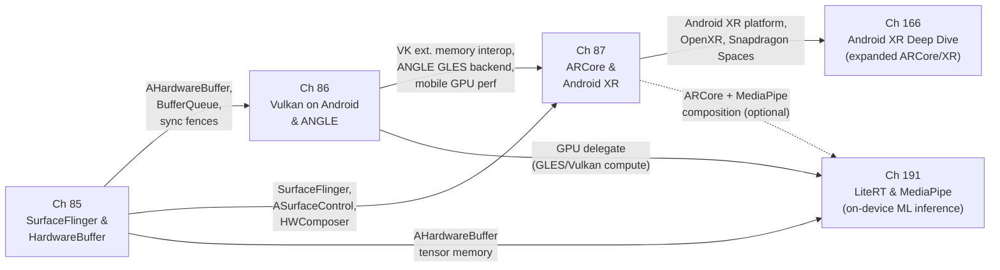

# Part XIX — Android Graphics

Android is a Linux-based operating system, and its graphics stack is built directly on the same kernel primitives — **DRM/KMS**, **DMA-BUF**, **sync_file**, and **dma_fence** — that underpin the Wayland desktop compositor ecosystem explored in earlier parts of this book. What distinguishes Android is the proprietary middleware erected above those primitives: a **Hardware Abstraction Layer** (**HAL**) consisting of **Gralloc** for buffer allocation and **HWComposer** for display control, a framework compositor (**SurfaceFlinger**) that replaces the Wayland protocol, and an application-layer AR SDK (**ARCore**) that consumes the resulting graphics pipeline for spatial computing. This part examines that stack from the shared buffer model at the bottom to augmented reality at the top, showing where Android converges with and diverges from the Linux desktop graphics world.

## Chapters in This Part

**Chapter 85 — Android Compositor: SurfaceFlinger, HardwareBuffer, and the Buffer Pipeline** establishes the foundational layer of Android graphics. It covers **Gralloc** (**IAllocator** / **IMapper**) and **AHardwareBuffer** as the shared-buffer substrate, the **BufferQueue** producer-consumer pipeline connecting application surfaces to **SurfaceFlinger**, the **HWComposer** (**HWC2** / **HWC3**) validate-then-present flow that drives **DRM** atomic commits, **HWUI**'s **SkiaVulkanPipeline** and **SkiaOpenGLPipeline** for Java View rendering, **ASurfaceControl** for multi-surface atomic updates from native code, and Android's **sync_file** fence model. Readers learn how every frame produced by any Android application — whether drawn with **Canvas**, **OpenGL ES**, or **Vulkan** — passes through **BufferQueue** and **SurfaceFlinger** before reaching the display. This chapter is the Android counterpart to the Wayland compositor chapters in Part VI, showing how the same kernel-level primitives support a fundamentally different userspace architecture.

**Chapter 86 — Vulkan on Android: Drivers, ANGLE, and Mobile GPU Performance** descends into the GPU execution layer that Chapter 85 relies on for compositing and application rendering. It covers the **Android Vulkan Loader** (`libvulkan.so`), GPU vendor ICDs for **Qualcomm Adreno**, **ARM Mali**, and **Imagination PowerVR**, the open-source **Turnip** and **freedreno** Mesa drivers for Adreno hardware, **ANGLE** as the system OpenGL ES implementation on Pixel devices, **AHardwareBuffer**–**Vulkan** interop via **VK_ANDROID_external_memory_android_hardware_buffer**, Android-specific extensions including **VK_KHR_android_surface** and **VK_GOOGLE_display_timing**, shader compilation via **SPIR-V** and **shaderc**, and mobile-specific performance considerations including **Tile-Based Deferred Rendering** (**TBDR**) and unified-memory heap topology. The chapter closes with how **Chrome** on Android routes **WebGPU** (via **Dawn**'s Vulkan backend) and **WebGL** (via **ANGLE**) through **AHardwareBuffer** to **SurfaceFlinger** via **ASurfaceControl**. Unlike earlier Vulkan chapters that focus on desktop GPU architectures and desktop Linux loader mechanics, this chapter is authoritative on the mobile-specific deviations: APEX ICD delivery, the Android Vulkan Profiles, and why explicit **VkRenderPass** objects remain essential on TBDR hardware even after **VK_KHR_dynamic_rendering**.

**Chapter 87 — Android AR: ARCore Architecture, Camera HAL Integration, and the Android XR Platform** brings the Android graphics stack into spatial computing. It traces how **ARCore** (a Play Services component, not a HAL module) layers above **Camera HAL3** and **android.hardware.camera2** to fuse camera frames with **IMU** data via **Visual-Inertial Odometry** (**VIO**), producing world-understanding primitives — **ArPose**, **ArPlane**, depth maps, light estimates — that renderers consume. The chapter covers the zero-copy camera background rendering path via **GL_TEXTURE_EXTERNAL_OES** and **EGLImageKHR**, Vulkan import of camera frames via **VkSamplerYcbcrConversion**, the **Depth API** (structured light, **MotionStereo**), the **Geospatial API** using Google's **Visual Positioning System** (**VPS**), **Cloud Anchors**, the **Environmental HDR** light estimation mode with spherical harmonics, and the **OpenXR** loader shipped inside ARCore services. It closes with the **Android XR** spatial computing platform, the **Jetpack XR SDK** (**androidx.xr**), and headsets such as **Project Moohan**. This chapter is the Android counterpart to the OpenXR chapters in Part VIII, but it begins from camera sensor hardware rather than from a Vulkan swapchain.

**Chapter 166 — Android AR: ARCore Architecture, Camera HAL Integration, and Android XR** is an expanded and updated companion to Chapter 87, written for the **Android XR** era. While Chapter 87 provides the foundational treatment of **ARCore**'s architecture and the Camera HAL3 integration model, Chapter 166 extends coverage to the **Android XR platform** (Samsung Galaxy XR / Project Moohan), the **Jetpack XR SDK** (`androidx.xr`), **OpenXR on Android** (`XR_KHR_android_create_instance`, `XrSwapchainImageAndroidKHR`), Qualcomm **Snapdragon Spaces** XDK, and the open-source **Monado** OpenXR runtime as a forward reference for Linux AR development. The chapter also provides deeper treatment of the **Vulkan** camera import path (`VK_ANDROID_external_memory_android_hardware_buffer`, `VkSamplerYcbcrConversion`), `VK_EXT_plane_detection` for spatial plane query, and the **Environmental HDR** spherical harmonic light estimation API. Readers working on headset or glasses integration under Android XR should read this chapter after Chapter 87.

**Chapter 191 — LiteRT and MediaPipe: On-Device ML Inference on the Android Graphics Stack** covers Google's two cross-platform on-device ML frameworks and their integration with the Android GPU pipeline. **LiteRT** (formerly TensorFlow Lite, renamed 2024) is the on-device inference runtime for `.tflite` model files; it dispatches to hardware accelerators via the **NNAPI** delegate (Android 8.1+, routes to DSP/NPU), the **GPU delegate** (OpenGL ES 3.1 or Vulkan compute — shared `AHardwareBuffer` tensors with the graphics pipeline), and the **Edge TPU** delegate. The chapter covers `Interpreter` lifecycle, tensor allocation via `AllocateTensors()`, `AHardwareBuffer` tensor interop with OpenGL ES compute, and how LiteRT integrates with the GPU pipeline in Chapters 85–86 via shared `AHardwareBuffer` tensor memory. **MediaPipe** is Google's cross-platform ML pipeline framework; its `CalculatorGraph` runs on-device vision tasks as directed compute graphs with GPU-accelerated preprocessing via OpenGL ES. The chapter covers the MediaPipe Tasks API (pose estimation, hand tracking, face landmarking, object detection), `GlCalculatorHelper` for GPU-accelerated pre/post-processing, `SurfaceTexture` integration with Camera2 for zero-copy camera → ML → display pipelines, and ARCore + MediaPipe composition for spatially-aware on-device inference. Readers from a GPU or graphics background will understand how on-device ML inference shares `AHardwareBuffer` infrastructure with the compositing and rendering pipeline already described in this part.

## Key Concepts

### How Android Applications Reach the GPU: JNI, NDK, and Dart FFI

Android applications are written in Kotlin or Java and run on the ART (Android Runtime) JVM. Reaching the GPU from managed code requires crossing the language boundary into native C/C++ via one of two mechanisms.

**JNI (Java Native Interface)** is the standard bridge for Kotlin/Java apps. A class declares `native` methods and calls `System.loadLibrary("mylib")` to load a shared library built with the NDK. The NDK provides C headers that expose the Android graphics stack directly:
- `android/native_window.h` — `ANativeWindow*` from a `Surface` object via `ANativeWindow_fromSurface(env, surface)`
- `android/hardware_buffer.h` — `AHardwareBuffer_allocate()`, `AHardwareBuffer_lock()`, cross-process sharing
- `android/hardware_buffer_jni.h` — `AHardwareBuffer_fromHardwareBuffer(env, hardwareBuffer)` to convert a Java `HardwareBuffer` to a native `AHardwareBuffer*`
- `vulkan/vulkan.h`, `GLES3/gl3.h` — Vulkan and OpenGL ES headers for direct GPU commands

A typical Kotlin/NDK Vulkan app: Java `SurfaceView` → `Surface` object → JNI → `ANativeWindow_fromSurface()` → `vkCreateAndroidSurfaceKHR()` → Vulkan swapchain → renders directly to the `AHardwareBuffer` that SurfaceFlinger will display.

**Flutter** uses a different approach: Flutter's engine (`libflutter.so`) is a C++ binary that Dart code calls via **Dart FFI** (`dart:ffi`), not JNI. The Flutter engine renders via **Impeller** (Vulkan on Android, Metal on iOS, replacing the legacy Skia/OpenGL ES path since Flutter 3.10) or legacy **Skia** on older devices. Platform channels (`MethodChannel`) do use JNI under the hood to call Android Java APIs, but GPU rendering itself bypasses JNI entirely: `libflutter.so` holds the `ANativeWindow` and Vulkan context directly. For GPU-intensive Flutter apps, the `flutter_gl` and `flutter_texture` plugins expose `ANativeWindow` and `SurfaceTexture` to Dart via FFI-accessible C callbacks.

The common endpoint for both paths is `ANativeWindow` → `AHardwareBuffer` → `BufferQueue` → `SurfaceFlinger` → `HWComposer` → DRM, as described in Chapter 85.

### OpenXR, ARCore, and "OpenAR"

**OpenXR** is the Khronos Group's cross-platform XR (extended reality) API standard. It defines a runtime-agnostic interface for VR/AR sessions (`XrSession`), swapchains (`XrSwapchain`), action sets, and space tracking, with platform-specific extensions for Android (`XR_KHR_android_create_instance`) and surface types (`XrSwapchainImageAndroidKHR`). OpenXR targets headsets (Quest, Pico, Project Moohan) where there is a dedicated XR runtime; it does not define computer vision, plane detection, or camera access.

**ARCore** is Google's Android-specific augmented reality SDK, distributed as a Play Services component (`com.google.ar.core`). ARCore is not an OpenXR runtime in its primary C API; it is a standalone Android SDK with its own session (`ArSession`), pose (`ArPose`), plane and depth APIs. However, **ARCore ships an embedded OpenXR loader** since ARCore 1.33, implementing `XR_KHR_android_create_instance` and a subset of OpenXR extensions. This means apps using the OpenXR API on Android devices with ARCore installed get ARCore's tracking and sensor fusion as the OpenXR backend — without using the ARCore-specific C API directly. ARCore is *one implementation* of OpenXR on Android, not a competing standard.

**"OpenAR"** is not a real standard or SDK. It does not appear in any Khronos, Google, or industry specification. If you encounter this term, the author likely meant either OpenXR (the Khronos standard) or ARCore (Google's Android SDK). The distinction matters: OpenXR is the cross-platform API to target for headset apps (Ch 166 covers this); ARCore is the API to target for markerless AR on Android phones (Ch 87 covers this); on Android XR headsets, both converge via ARCore's OpenXR implementation.

## How the Chapters Interrelate

The five chapters in this part form a bottom-up dependency chain, sharing a set of data structures and interfaces that weave through all of them.

**AHardwareBuffer** is the central shared artifact. It is allocated by **Gralloc** (Chapter 85), imported into **Vulkan** via `VK_ANDROID_external_memory_android_hardware_buffer` (Chapter 86), consumed as a zero-copy camera output buffer by **ARCore**'s **Camera HAL3** integration (Chapter 87), and used as the tensor memory interface for LiteRT GPU delegate inference (Chapter 191). A reader who does not understand what an `AHardwareBuffer` is — how it wraps a DMA-BUF file descriptor inside a `native_handle_t`, how it is shared cross-process over Binder, and how it carries format and usage flags that constrain GPU access — will not be able to follow the Vulkan interop discussion in Chapter 86, the camera frame rendering path in Chapter 87, or the GPU delegate tensor sharing in Chapter 191. Chapter 85 must therefore be read first.

**Sync fences** form a second shared thread. The `android::Fence` / `sync_file` model introduced in Chapter 85 as the mechanism synchronising **BufferQueue** slots between producer and **SurfaceFlinger** is the same fence model that Chapter 86's Vulkan extensions rely on for swapchain present ordering, and the same model that Chapter 87 relies on to pipeline camera frame acquisition against GPU rendering.

Chapter 86 depends on Chapter 85 because the Android Vulkan swapchain is ultimately a **BufferQueue** consumer: `vkQueuePresentKHR()` calls into `ANativeWindow` which dequeues a Gralloc buffer, composited by SurfaceFlinger using exactly the HWComposer pipeline from Chapter 85.

Chapter 87 depends on both predecessors. Its OpenGL ES camera background path calls through ANGLE (Ch 86); its Vulkan camera import uses the interop mechanism from Ch 86; the final composited AR frame reaches the display via SurfaceFlinger and ASurfaceControl (Ch 85).

Chapter 166 extends Chapter 87 into the Android XR headset platform, adding OpenXR session management, Jetpack XR SDK, and Snapdragon Spaces coverage.

Chapter 191 depends on Chapters 85 and 86 for the AHardwareBuffer GPU buffer model and OpenGL ES / Vulkan compute context; it optionally depends on Chapter 87 for the ARCore + MediaPipe composition pattern.

The thematic arc is: shared memory model → GPU execution model → world-understanding (AR) → spatial computing (XR) → on-device ML inference.

## Prerequisites and What Comes Next

Readers should be comfortable with the Linux **DRM/KMS** and **DMA-BUF** subsystems from Part I, with the Wayland compositor model from Part VI (especially the buffer-passing and fence-signalling protocols that Chapter 85 maps onto Android equivalents), and with the core Vulkan swapchain and memory-allocation concepts from Part II. Chapters 87 and 166 additionally assume familiarity with the **OpenXR** session model introduced in Part VIII. Chapter 191 benefits from the AI inference context of Part XX (particularly Chapter 88 on NPU and NNAPI). These five chapters together form the Android-specific lens through which many of the generic graphics stack concepts in Parts I–VIII can be re-examined in a production mobile context; Part XX continues by examining AI inference infrastructure that shares GPU and buffer primitives with the pipeline described here.

---

## Part Roadmap Summary

*Synthesised from the Roadmap sections of this part's chapters.*

### Near-term (6–12 months)

- **HAL modernisation across all layers**: HWC3 (AIDL) adoption is completing vendor migrations away from the older HIDL HWC2 interface, while Gralloc5 / IMapper5 stable C API rollout broadens the AIDL-first allocator ecosystem across Adreno, Mali, and PowerVR. Android 17 is the convergence release where ANGLE becomes the default GLES implementation on Pixel (opt-out) and the Android Vulkan Profiles gain an AVP 2026 tier mandating Vulkan 1.4 core features (`VK_KHR_maintenance6`, `VK_EXT_shader_object`).
- **TBDR-aware Vulkan extension adoption**: `VK_EXT_shader_tile_image` and `VK_KHR_dynamic_rendering_local_read` are landing in both Turnip and Qualcomm's proprietary ICD, allowing deferred renderers to drop explicit `VkRenderPass` objects without sacrificing tile-buffer efficiency. Adreno 830 (Snapdragon 8 Elite) bring-up in Mesa Turnip is the primary focus, targeting A8xx ISA mesh shaders and hardware ray-traversal.
- **Android XR SDK and OpenXR extension stabilisation**: Jetpack XR (`androidx.xr`) is moving from alpha to beta for the Project Moohan launch window, and `XR_ANDROID_trackables` / `XR_ANDROID_eye_tracking` extensions are completing Khronos ratification to arrive via Play Services updates without OS upgrades. ARCore Geospatial API is expanding VPS coverage beyond Street View–dense urban areas.
- **On-device ML runtime production readiness**: LiteRT-LM shipped in May 2026 as the production LLM orchestration layer (52 tokens/second on Android GPU via OpenCL); the Vulkan compute backend for the LiteRT GPU delegate is expected to exit experimental status by late 2026. Low-latency stylus and gaming front-buffer rendering paths via `ASurfaceTransaction` are being refined to push input-to-display latency below one vsync period.

### Medium-term (1–3 years)

- **Vulkan-only framework GPU paths**: SurfaceFlinger's GPU fallback path is planned to migrate from OpenGL ES to Vulkan exclusively, enabling GPU-driven layer blending via compute shaders and aligning with the broader deprecation of OpenGL ES in Android's framework layer. The APEX-delivered ICD delivery model is expected to extend to Mali and PowerVR vendors, enabling over-the-air driver updates without full system image reflashing.
- **Android/ChromeOS driver unification and open-source expansion**: Google's stated goal of a unified HAL and APEX ICD pipeline across Android and ChromeOS would allow a single Vulkan driver binary to serve tablets, Chromebooks, and Android form factors. Mesa Turnip is being evaluated as a CTS-compliant reference driver for Adreno devices, and mobile Vulkan ray tracing (`VK_KHR_ray_tracing_pipeline`) is expected to enter Android Vulkan Profiles as Adreno 830 and Mali Immortalis-G920 ship hardware BVH traversal.
- **NPU offload and hardware-accelerated inference pipelines**: ARCore's MotionStereo and Scene Semantics models are expected to migrate from GPU shader cores to dedicated NPUs (Hexagon via NNAPI 2.x, MediaTek APU) as vendor LiteRT delegates mature. On-device vision-language models in the PaliGemma 3B class are feasible at INT4 on 2026 flagship hardware, making the camera→`AHardwareBuffer`→ML inference→display pipeline a first-class application pattern. HWComposer will need new composition type enumerants for hardware-accelerated tone mapping and super-resolution.
- **Linux/Android stack convergence for AR and embedded ML**: Monado's SLAM subsystem (Basalt/OpenVINS) is maturing as `libcamera-android` stabilises, enabling shared SLAM algorithm development across Linux and AOSP. LiteRT is expanding to x86-64 and ARM64 Linux (Raspberry Pi 5, NVIDIA Jetson) via Mesa GPU delegates (panfrost, v3d, freedreno), and `AHardwareBuffer`–Wayland translation layers are being explored to allow Wayland applications to run on Android via `wl_buffer`→`ASurfaceTransaction` mapping.

### Long-term

- **Unified Linux/Android display HAL**: The convergence of Android's Generic Kernel Image (GKI) with mainline DRM and the maturing `drm_hwcomposer` open-source HAL points toward a single DRM-backed compositor stack that can serve both Wayland and Android SurfaceFlinger clients from a common display-HAL layer, resolving the current architectural bifurcation documented throughout this part.
- **Standardised AR semantic APIs via OpenXR**: The Khronos OpenXR working group is evaluating AR scene-understanding extensions (`XR_EXT_scene_understanding` derivatives) that would subsume ARCore's proprietary `ArPlane`, `ArDepthImage`, and `ArSemanticImage` APIs under a vendor-neutral interface, enabling Monado and non-Google runtimes to expose equivalent capabilities on Linux and future Android forks.
- **Open-hardware AR and vendor NPU delegate ecosystem**: As RISC-V SoCs with open ISP coprocessors mature and all major Android SoC vendors (Qualcomm, MediaTek, Samsung Exynos, Google Tensor) ship production LiteRT delegates, the delegate `.so` ABI is expected to become the uniform hardware-accelerator contract — analogous to the Vulkan ICD model — closing the gap between proprietary and open ML acceleration paths on both Android and Linux.
