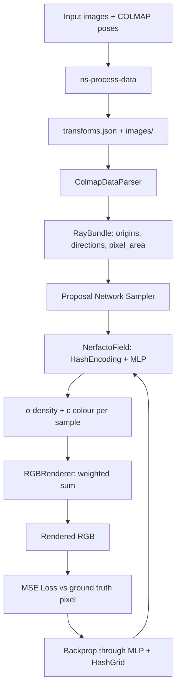
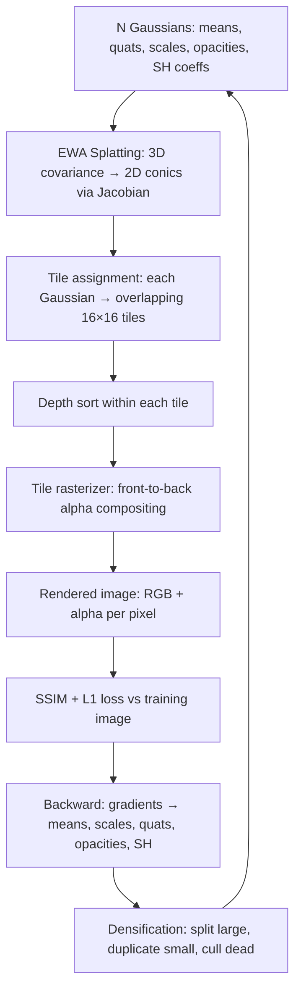

# Chapter 115: NeRFStudio, Neural Radiance Fields, and 3D Gaussian Splatting on Linux

> **Part**: Part XX — AI Inference & Neural Rendering
> **Audience**: Graphics application developers, AI/ML engineers, neural rendering pipeline developers
> **Status**: First draft — 2026-06-19

---

## Table of Contents

1. [Overview: Neural Rendering in the Linux GPU Stack](#1-overview-neural-rendering-in-the-linux-gpu-stack)
2. [Volume Rendering Theory: Ray Marching, Density Fields, and Positional Encoding](#2-volume-rendering-theory)
3. [NeRFStudio Architecture: ns-train, Pipelines, and the tyro Config System](#3-nerfstudio-architecture)
4. [Instant-NGP and tiny-cuda-nn: Hash Encoding and MLP Acceleration](#4-instant-ngp-and-tiny-cuda-nn)
5. [Nerfacto: The Flagship Model](#5-nerfacto-the-flagship-model)
6. [3D Gaussian Splatting: splatfacto and gsplat](#6-3d-gaussian-splatting-splatfacto-and-gsplat)
7. [The gsplat CUDA Rasterizer: Forward and Backward Passes](#7-the-gsplat-cuda-rasterizer)
8. [COLMAP Integration and the ns-process-data Pipeline](#8-colmap-integration-and-ns-process-data)
9. [The Viser Viewer: WebSocket Streaming and Three.js Rendering](#9-the-viser-viewer)
10. [ROCm/HIP Portability: AMD GPU Status](#10-rocm-hip-portability)
11. [Vulkan-Based Real-Time Splat Renderers](#11-vulkan-based-real-time-splat-renderers)
12. [Production Deployment: Docker, Multi-GPU, and Distributed Training](#12-production-deployment)
13. [Integrations](#13-integrations)

---

## 1. Overview: Neural Rendering in the Linux GPU Stack

Neural rendering bridges deep learning and real-time graphics. Where conventional rendering pipelines assemble geometry, shaders, and textures into pixels through rasterization or ray tracing, neural rendering learns an implicit or explicit scene representation from photographs and synthesises novel viewpoints directly from that learned representation. The result can look more photorealistic than any hand-authored asset for scenes that are impractical to model manually — building interiors, archaeological sites, medical scans, photogrammetric captures of machinery.

Neural Radiance Fields (NeRF), introduced by Mildenhall et al. in 2020 [Source](https://arxiv.org/abs/2003.08934), encode a scene as a continuous volumetric function mapping a 3D position and viewing direction to colour and density. A small multi-layer perceptron (MLP) parameterises this function and is trained end-to-end from posed photographs. 3D Gaussian Splatting (3DGS), introduced by Kerbl et al. at SIGGRAPH 2023 [Source](https://repo-sam.inria.fr/fungraph/3d-gaussian-splatting/], replaces the implicit MLP with explicit semi-transparent Gaussian primitives rasterised in front-to-back order — achieving real-time rendering rates unreachable with ray-marched MLPs.

**NeRFStudio** [Source](https://github.com/nerfstudio-project/nerfstudio) is a modular Python framework that implements both families, providing a unified training harness, data pipeline, model registry, and interactive viewer. Its position in the Linux graphics stack is shown below:

```
┌─────────────────────────────────────────────────────────────┐
│  User-space: NeRFStudio (Python / PyTorch)                  │
│  ┌─────────────┐  ┌─────────────────┐  ┌─────────────────┐ │
│  │ ns-train    │  │ Viser viewer    │  │ ns-render       │ │
│  │ tyro CLI    │  │ (WebSocket/     │  │ ns-export       │ │
│  │ Trainer     │  │  Three.js)      │  │ ns-process-data │ │
│  └─────────────┘  └─────────────────┘  └─────────────────┘ │
│  ┌────────────────────────┐ ┌────────────────────────────┐  │
│  │ NeRF models (nerfacto, │ │ 3DGS models (splatfacto)   │  │
│  │  instant-ngp, tensorf) │ │  via gsplat rasterizer     │  │
│  └────────────────────────┘ └────────────────────────────┘  │
├──────────────────────────────────────────────────────────────┤
│  CUDA Libraries                                              │
│  ┌──────────────┐  ┌────────────┐  ┌──────────────────────┐ │
│  │ tiny-cuda-nn │  │  nerfacc   │  │  gsplat custom       │ │
│  │ (FullyFused  │  │ (OccGrid)  │  │  tile-based kernels  │ │
│  │  / Cutlass)  │  └────────────┘  └──────────────────────┘ │
│  └──────────────┘                                            │
├──────────────────────────────────────────────────────────────┤
│  NVIDIA GPU: CUDA driver / cuDNN / CUTLASS                   │
│  AMD GPU: ROCm / HIP (community support, reduced performance)│
├──────────────────────────────────────────────────────────────┤
│  Linux kernel: DRM/KMS, NVIDIA proprietary / amdgpu driver  │
└─────────────────────────────────────────────────────────────┘
```

**Audiences addressed in this chapter:**
- *Graphics application developers* integrating neural radiance fields or Gaussian splats into rendering pipelines, game engines, or design tools.
- *AI/ML engineers* training and deploying NeRF/3DGS models on Linux clusters.
- *Systems developers* who need to understand how the CUDA tile rasterizer and hash-encoding kernels interact with driver and hardware resources.

---

## 2. Volume Rendering Theory

### 2.1 The NeRF Representation

A NeRF parameterises a scene by a function:

```
F_Θ : (x, d) → (c, σ)
```

where `x ∈ ℝ³` is a 3D world position, `d ∈ S²` is a unit viewing direction encoded as a 3-component unit vector, `c ∈ [0,1]³` is emitted RGB colour, and `σ ∈ ℝ≥0` is volume density (opacity per unit length). The network weights `Θ` are trained so that the rendered colour of a camera ray matches the observed pixel value in the training photographs.

### 2.2 Positional Encoding

Raw coordinates are poor inputs to MLPs because of spectral bias — networks preferentially learn low-frequency functions. The original NeRF paper lifted positions into a high-frequency embedding:

```
γ(p) = (sin(2⁰πp), cos(2⁰πp), sin(2¹πp), cos(2¹πp), …, sin(2^(L-1)πp), cos(2^(L-1)πp))
```

with `L = 10` for position and `L = 4` for direction [Source](https://arxiv.org/abs/2003.08934). This is sometimes called Fourier feature encoding. Instant-NGP replaces Fourier features with learned hash table lookups; see Section 4.

### 2.3 Volume Rendering Integral

Given a ray `r(t) = o + t·d` from camera origin `o`, the expected colour is:

```
C(r) = ∫[t_n, t_f] T(t) · σ(r(t)) · c(r(t), d) dt
```

where the transmittance `T(t)` is the probability of the ray reaching `t` without hitting anything:

```
T(t) = exp(−∫[t_n, t] σ(r(s)) ds)
```

The integral is approximated by stratified sampling of `N` points along the ray and the compositing formula:

```
C_hat(r) = Σᵢ Tᵢ (1 − exp(−σᵢ δᵢ)) cᵢ
```

where `δᵢ = tᵢ₊₁ − tᵢ` is the step size and `Tᵢ = exp(−Σⱼ₍ⱼ<ᵢ₎ σⱼ δⱼ)`. This is computed in the `RGBRenderer`:

```python
# nerfstudio/model_components/renderers.py
comp_rgb = torch.sum(weights * rgb, dim=-2)
```

where `weights = Tᵢ × αᵢ`, `αᵢ = 1 − exp(−σᵢ δᵢ)`.

### 2.4 Mermaid: NeRF Training Pipeline



---

## 3. NeRFStudio Architecture

NeRFStudio's source tree is organised around five main subsystems: the CLI entry points, the config/registry system, the data pipeline, the model hierarchy, and the viewer. The following sections map each subsystem to its directory.

### 3.1 CLI Entry Points

All user-facing commands are defined as `[project.scripts]` in `pyproject.toml` [Source](https://github.com/nerfstudio-project/nerfstudio/blob/main/pyproject.toml):

| Script | Module | Purpose |
|---|---|---|
| `ns-train` | `nerfstudio.scripts.train:entrypoint` | Train a model from scratch or resume |
| `ns-viewer` | `nerfstudio.scripts.viewer_gui:entrypoint` | Launch viewer for a saved checkpoint |
| `ns-render` | `nerfstudio.scripts.render:entrypoint` | Render camera paths / spirals to video |
| `ns-eval` | `nerfstudio.scripts.eval:entrypoint` | Compute PSNR/SSIM/LPIPS on test split |
| `ns-export` | `nerfstudio.scripts.exporter:entrypoint` | Export point clouds, meshes, `.ply` splats |
| `ns-process-data` | `nerfstudio.scripts.process_data:entrypoint` | Run COLMAP and prepare `transforms.json` |
| `ns-download-data` | `nerfstudio.scripts.downloads.download_data:entrypoint` | Download benchmark datasets |

### 3.2 The tyro Config System

NeRFStudio's command-line interface is driven entirely by [tyro](https://github.com/brentyi/tyro), a library that generates `argparse`-style argument parsers from Python dataclasses with type annotations. There are no YAML or TOML config files at runtime; every hyperparameter is a dataclass field with a default, overridable on the command line [Source](https://github.com/nerfstudio-project/nerfstudio/blob/main/nerfstudio/scripts/train.py):

```python
# nerfstudio/scripts/train.py
import tyro

def entrypoint():
    tyro.extras.set_accent_color("bright_yellow")
    main(tyro.cli(AnnotatedBaseConfigUnion, description=...))
```

`AnnotatedBaseConfigUnion` is the union of all `TrainerConfig` objects registered in the method registry. tyro converts this into a subcommand-based CLI:

```bash
ns-train nerfacto --pipeline.model.num-levels 16 \
    nerfstudio-data --data /path/to/scene

ns-train splatfacto --pipeline.model.sh-degree 0 \
    colmap-data --data /path/to/scene

# Multi-GPU: 4 GPUs, NCCL backend
ns-train nerfacto \
    --machine.num-devices 4 \
    --machine.device-type cuda \
    nerfstudio-data --data /path/to/scene
```

The config hierarchy is: `TrainerConfig → VanillaPipelineConfig → (DataManagerConfig, ModelConfig)`.

`MachineConfig` controls hardware topology [Source](https://github.com/nerfstudio-project/nerfstudio/blob/main/nerfstudio/configs/base_config.py):

```python
@dataclass
class MachineConfig:
    seed: int = 42
    num_devices: int = 1           # GPUs per machine
    num_machines: int = 1          # nodes for multi-machine DDP
    machine_rank: int = 0          # this node's rank
    dist_url: str = "auto"         # auto = find a free port
    device_type: Literal["cpu", "cuda", "mps"] = "cuda"
```

### 3.3 Directory Structure

```
nerfstudio/
├── cameras/         # Cameras dataclass, CameraType enum, RayBundle
├── configs/         # method_configs.py, base_config.py
├── data/
│   ├── dataparsers/ # colmap, nerfstudio, blender, ...
│   ├── datamanagers/# base, full_images (splatfacto)
│   └── datasets/
├── engine/          # trainer.py: Trainer class
├── field_components/ # encodings.py (HashEncoding, SHEncoding), mlp.py
├── fields/          # nerfacto_field.py, splatfacto_field.py
├── model_components/ # ray_samplers.py, renderers.py
├── models/          # nerfacto.py, splatfacto.py, instant_ngp.py, ...
├── pipelines/       # base_pipeline.py (VanillaPipeline), dynamic_batch.py
├── plugins/         # registry.py
├── scripts/         # train.py, render.py, exporter.py, process_data.py
└── viewer/          # viewer.py, render_state_machine.py
```

### 3.4 Method Registry and Plugin System

Built-in methods are registered in `nerfstudio/configs/method_configs.py` as a dict mapping CLI names to `TrainerConfig` instances [Source](https://github.com/nerfstudio-project/nerfstudio/blob/main/nerfstudio/configs/method_configs.py):

| CLI name | Model |
|---|---|
| `nerfacto`, `nerfacto-big`, `nerfacto-huge` | `NerfactoModel` (graduated scale) |
| `depth-nerfacto` | Depth-supervised variant |
| `instant-ngp`, `instant-ngp-bounded` | `InstantNGPModel` |
| `mipnerf` | `VanillaModel` (MipNeRF) |
| `vanilla-nerf` | `VanillaModel` (reference implementation) |
| `tensorf` | `TensoRFModel` |
| `neus`, `neus-facto` | NeuS surface reconstruction |
| `splatfacto`, `splatfacto-big`, `splatfacto-mcmc` | `SplatfactoModel` |

External packages extend the registry via Python entry points [Source](https://github.com/nerfstudio-project/nerfstudio/blob/main/nerfstudio/plugins/registry.py):

```toml
# An external package's pyproject.toml
[project.entry-points."nerfstudio.method_configs"]
my-method = "my_package.configs:MyMethodSpecification"
```

`discover_methods()` in `nerfstudio/plugins/registry.py` iterates `importlib.metadata.entry_points(group="nerfstudio.method_configs")` and also checks the `NERFSTUDIO_METHOD_CONFIGS` environment variable (CSV format: `"name=module:config_name"`). All external methods must implement the `MethodSpecification` protocol.

### 3.5 Training Loop (Trainer)

The `Trainer` class in `nerfstudio/engine/trainer.py` drives the main loop [Source](https://github.com/nerfstudio-project/nerfstudio/blob/main/nerfstudio/engine/trainer.py):

```python
# Simplified from trainer.py
class Trainer:
    def train(self):
        for step in range(self._start_step, self.config.max_num_iterations):
            with torch.autocast(device_type=..., enabled=self.mixed_precision):
                _, loss_dict, metrics_dict = self.pipeline.get_train_loss_dict(step)
                loss = functools.reduce(torch.add, loss_dict.values())
            self.grad_scaler.scale(loss).backward()
            # selective optimizer step
            self.optimizers.optimizer_scaler_step(self.grad_scaler)
            self.grad_scaler.update()
            self.optimizers.scheduler_step_all(step)
            if step % self.config.steps_per_save == 0:
                self.save_checkpoint(step)
            if step % self.config.steps_per_eval_all_images == 0:
                self.eval_iteration(step)
```

`VanillaPipeline.get_train_loss_dict(step)` calls `self.datamanager.next_train(step)` to produce a `RayBundle` (for NeRF models) or a full camera image (for splatfacto), then `self._model(ray_bundle)` to get outputs, then the model's loss and metrics dicts.

---

## 4. Instant-NGP and tiny-cuda-nn

### 4.1 The Multi-Resolution Hash Grid

Instant-NGP [Source](https://arxiv.org/abs/2201.05989) by Müller et al. (NVIDIA, 2022) demonstrated that replacing Fourier positional encodings with a learned multi-resolution hash table reduces NeRF training from hours to minutes. The core idea is to store feature vectors in `L` hash tables at geometrically spaced resolutions from `base_res` to `max_res`, then trilinearly interpolate to get a continuous feature for any 3D coordinate.

The hash function maps a discrete grid cell `(x, y, z)` at level `l` to a table index:

```
h(x) = (x[0] × π₁ XOR x[1] × π₂ XOR x[2] × π₃) mod T_l
```

where `π₁ = 1`, `π₂ = 2654435761`, `π₃ = 805459861` (chosen for good hash mixing), and `T_l = 2^log2_hashmap_size` [Source](https://arxiv.org/abs/2201.05989 §3]. Crucially, hash collisions are resolved implicitly by the optimizer — nearby colliding entries learn to compromise on values that minimise the total loss.

The pure-PyTorch implementation in nerfstudio (`nerfstudio/field_components/encodings.py`) shows the constants directly:

```python
# nerfstudio/field_components/encodings.py — HashEncoding (torch fallback)
# Primes for spatial hashing
PRIMES = [1, 2654435761, 805459861]

def hash_fn(coords: Tensor, log2_hashmap_size: int) -> Tensor:
    # coords: [..., 3] integer grid coordinates
    result = coords[..., 0]
    result = result ^ (coords[..., 1] * PRIMES[1])
    result = result ^ (coords[..., 2] * PRIMES[2])
    return result % (2 ** log2_hashmap_size)
```

Trilinear interpolation across 8 cube corners produces the final per-level feature; the `L × F` level features are concatenated to produce the final hash encoding vector.

### 4.2 tiny-cuda-nn Integration

[tiny-cuda-nn](https://github.com/NVlabs/tiny-cuda-nn) (tcnn) is an NVIDIA library providing hand-optimised CUDA kernels for both the hash encoding and subsequent fully-connected layers. Two MLP backends are available [Source](https://github.com/NVlabs/tiny-cuda-nn):

- **FullyFusedMLP** — custom CUDA shared-memory kernels that fuse weight loading, matrix multiply, and activation into a single kernel. Supports hidden widths of 16, 32, 64, or 128. Requires large shared memory (Ampere/Ada class: RTX 3090, RTX 4090, A100 recommended).
- **CutlassMLP** — uses NVIDIA's CUTLASS library for GEMM templates. Supports arbitrary widths and is compatible with older Turing/Volta GPUs, but slower than FullyFusedMLP.

Note: neither backend uses cuBLAS. This is a deliberate design choice — tcnn's own fused kernels outperform cuBLAS for the narrow networks used in NeRF.

`MLPWithHashEncoding` in `nerfstudio/field_components/mlp.py` instantiates `tcnn.NetworkWithInputEncoding`:

```python
# nerfstudio/field_components/mlp.py
import tinycudann as tcnn

self.model = tcnn.NetworkWithInputEncoding(
    n_input_dims=self.in_dim,
    n_output_dims=self.out_dim,
    encoding_config={
        "otype": "HashGrid",
        "n_levels": num_levels,             # e.g. 16
        "n_features_per_level": features_per_level,  # e.g. 2
        "log2_hashmap_size": log2_hashmap_size,      # e.g. 19
        "base_resolution": base_res,        # e.g. 16
        "per_level_scale": per_level_scale,
    },
    network_config=get_tcnn_network_config(
        activation, output_activation, hidden_dim, num_layers
    ),
)
```

`get_tcnn_network_config()` selects between `"FullyFusedMLP"` for widths in `{16, 32, 64, 128}` and `"CutlassMLP"` otherwise.

### 4.3 Availability Check and Torch Fallback

`tinycudann` is **not** a required dependency — `pyproject.toml` lists it under optional extras. A lazy error wrapper allows the rest of nerfstudio to import without failing [Source](https://github.com/nerfstudio-project/nerfstudio/blob/main/nerfstudio/utils/external.py):

```python
# nerfstudio/utils/external.py
TCNN_EXISTS = False
try:
    import tinycudann as tcnn
    TCNN_EXISTS = True
except (ModuleNotFoundError, ImportError, EnvironmentError) as e:
    tcnn_import_exception = e
    tcnn = _LazyError("tinycudann")  # raises on attribute access
```

All models that use hash encoding accept `implementation: Literal["tcnn", "torch"] = "tcnn"`. Setting `implementation="torch"` uses the pure-PyTorch `HashEncoding` class, roughly 5–20× slower due to Python overhead and lack of kernel fusion, but functional on any CUDA or even CPU device.

### 4.4 Building tiny-cuda-nn from Source

On Linux with CUDA 11.8:

```bash
# Clone with submodules (includes CUTLASS)
git clone --recursive https://github.com/NVlabs/tiny-cuda-nn.git
cd tiny-cuda-nn

# Set CUDA architecture flags (e.g. sm_86 for Ampere / RTX 3090)
export TCNN_CUDA_ARCHITECTURES="86"

pip install build
cd bindings/torch && pip install .
```

The CUDA architecture must match the installed GPU. For RTX 40-series (Ada): `TCNN_CUDA_ARCHITECTURES="89"`. For A100: `"80"`. Mismatches produce PTX-only binaries that work but are slower.

### 4.5 Instant-NGP in NeRFStudio

NeRFStudio's `InstantNGPModelConfig` [Source](https://github.com/nerfstudio-project/nerfstudio/blob/main/nerfstudio/models/instant_ngp.py):

```python
@dataclass
class InstantNGPModelConfig(ModelConfig):
    grid_resolution: int = 128    # occupancy grid resolution per level
    grid_levels: int = 4
    max_res: int = 2048
    log2_hashmap_size: int = 19
    alpha_thre: float = 0.01      # skip Gaussians below this alpha
    cone_angle: float = 0.004     # ray cone angle for mip-like sampling
```

Unlike nerfacto's proposal networks, instant-ngp uses an occupancy grid via `nerfacc.OccGridEstimator` to mark empty voxels and skip them during ray marching. The grid is updated every `update_occ_every` steps. This enables very fast training — typically under 5 minutes for small scenes — at the cost of lower accuracy than nerfacto for complex unbounded environments.

---

## 5. Nerfacto: The Flagship Model

### 5.1 Design Philosophy

Nerfacto (NeRF in practice) synthesises the best ideas from several concurrent research papers into a single practical model [Source](https://docs.nerf.studio/nerfology/methods/nerfacto.html):

- **Multi-resolution hash encoding** from Instant-NGP for fast training
- **Proposal networks** from MipNeRF 360 [Source](https://arxiv.org/abs/2111.12077) for efficient importance sampling in unbounded scenes
- **Scene contraction** (mapping unbounded space to a unit sphere) from MipNeRF 360
- **Appearance embeddings** per training image, allowing variation in lighting/exposure
- **Camera pose refinement** via backpropagation through the projection

### 5.2 NerfactoModelConfig

Key fields in `NerfactoModelConfig` [Source](https://github.com/nerfstudio-project/nerfstudio/blob/main/nerfstudio/models/nerfacto.py):

```python
@dataclass
class NerfactoModelConfig(ModelConfig):
    # Hash grid
    num_levels: int = 16
    base_res: int = 16
    max_res: int = 2048
    log2_hashmap_size: int = 19
    features_per_level: int = 2
    # MLP widths
    hidden_dim: int = 64
    hidden_dim_color: int = 64
    appearance_embed_dim: int = 32
    # Proposal sampling
    num_proposal_samples_per_ray: Tuple[int, ...] = (256, 96)
    num_nerf_samples_per_ray: int = 48
    num_proposal_iterations: int = 2
    # Backend
    implementation: Literal["tcnn", "torch"] = "tcnn"
```

Approximate GPU memory: `nerfacto` ~6 GB, `nerfacto-big` ~12 GB, `nerfacto-huge` ~24 GB.

### 5.3 Forward Pass: get_outputs()

```python
# Simplified from nerfstudio/models/nerfacto.py
def get_outputs(self, ray_bundle: RayBundle):
    # 1. Camera pose optimisation: refine ray origins/directions
    ray_bundle = self.camera_optimizer.apply_to_raybundle(ray_bundle)

    # 2. Proposal sampling: two passes of HashMLPDensityField
    ray_samples, weights_list, ray_samples_list = \
        self.proposal_sampler(ray_bundle, density_fns=self.density_fns)

    # 3. NerfactoField: hash encoding → MLP base → density + geo features
    field_outputs = self.field(ray_samples, compute_normals=self.config.predict_normals)
    # field_outputs: {FieldHeadNames.DENSITY, FieldHeadNames.RGB, ...}

    # 4. Weights from density and step sizes
    weights = ray_samples.get_weights(field_outputs[FieldHeadNames.DENSITY])

    # 5. Renderers
    rgb = self.renderer_rgb(rgb=field_outputs[FieldHeadNames.RGB], weights=weights)
    depth = self.renderer_depth(weights=weights, ray_samples=ray_samples)

    return {"rgb": rgb, "depth": depth, ...}
```

### 5.4 NerfactoField: Density and Colour MLP

`NerfactoField` uses separate MLP heads for density and view-dependent colour:

1. **Position encoding**: `MLPWithHashEncoding` maps `(x,y,z) → h ∈ ℝ^(num_levels × features_per_level)`.
2. **MLP base**: `Linear(hash_dim) → ReLU → hidden_dim → (density, geo_features)`.
3. **Direction encoding**: `SHEncoding(levels=4)` encodes unit direction `d` to `16` spherical harmonic features.
4. **Appearance embedding**: per-image `nn.Embedding(num_train_data, appearance_embed_dim)` concatenated.
5. **MLP head**: `Linear(geo_features + sh_features + appearance) → ReLU → hidden_dim_color → RGB`.

The SH encoding covers frequencies up to degree 3 (16 basis functions) and is computed in `nerfstudio/field_components/encodings.py`.

### 5.5 Losses

```python
# nerfstudio/models/nerfacto.py — get_loss_dict()
loss_dict = {
    "rgb_loss":          F.mse_loss(pred_rgb, gt_rgb),
    "interlevel_loss":   interlevel_loss(weights_list, ray_samples_list),
    "distortion_loss":   distortion_loss(weights_list, ray_samples_list),
    "orientation_loss":  orientation_loss(weights, normals, directions),
    "pred_normal_loss":  F.mse_loss(pred_normals, normals.detach()),
}
```

The interlevel and distortion losses penalise the proposal networks to be consistent with the final NeRF samples and to concentrate weight near surfaces [Source](https://arxiv.org/abs/2111.12077).

---

## 6. 3D Gaussian Splatting: splatfacto and gsplat

### 6.1 The 3DGS Representation

3D Gaussian Splatting [Source](https://repo-sam.inria.fr/fungraph/3d-gaussian-splatting/) represents a scene as a collection of N semi-transparent Gaussian primitives. Each Gaussian has:

- **Position** `μ ∈ ℝ³`
- **Covariance** parameterised as `Σ = R S Sᵀ Rᵀ` where `R` is a unit quaternion and `S` a diagonal scale matrix
- **Opacity** `α ∈ [0,1]`
- **Colour** encoded as spherical harmonic coefficients of degree up to 3

Unlike NeRF, 3DGS renders by projecting each Gaussian onto the image plane (EWA splatting) and compositing front-to-back — a fully differentiable rasterisation process rather than ray marching. The result: training in ~5–10 minutes and interactive rendering at 50–200 FPS versus NeRF's ~30 minutes training and 2–5 FPS viewer.

### 6.2 gsplat: The NeRFStudio Rasterizer

**Correction from the research literature:** splatfacto does **not** use `diff-gaussian-rasterization`, the original Inria CUDA implementation from Kerbl et al. (2023). Instead, nerfstudio ships and uses `gsplat` [Source](https://github.com/nerfstudio-project/gsplat), a fully independent reimplementation by the nerfstudio team. gsplat achieves up to 4× lower GPU memory usage and approximately 15% faster training compared to the original reference implementation, with a cleaner API and ongoing maintenance.

```python
# nerfstudio/models/splatfacto.py
from gsplat.rendering import rasterization
from gsplat.strategy import DefaultStrategy, MCMCStrategy
```

`gsplat` is listed as a required dependency in nerfstudio's `pyproject.toml` at version `1.4.0`.

### 6.3 SplatfactoModelConfig

```python
@dataclass
class SplatfactoModelConfig(ModelConfig):
    warmup_length: int = 500          # steps before densification starts
    refine_every: int = 100           # densification frequency
    num_downscales: int = 2           # resolution schedule steps
    resolution_schedule: int = 3000   # step to reach full resolution
    # Culling thresholds
    cull_alpha_thresh: float = 0.1    # remove Gaussians below this opacity
    cull_scale_thresh: float = 0.5    # remove oversized Gaussians
    cull_screen_size: float = 0.15    # remove Gaussians covering >15% of screen
    # Densification
    densify_grad_thresh: float = 0.0008
    densify_size_thresh: float = 0.01
    n_split_samples: int = 2          # new Gaussians per split
    # Spherical harmonics
    sh_degree: int = 3                # max SH degree for colour
    sh_degree_interval: int = 1000    # steps between degree increments
    # Loss
    ssim_lambda: float = 0.2
    # Rendering
    rasterize_mode: Literal["classic", "antialiased"] = "classic"
```

### 6.4 Gaussian Parameter Storage

Parameters are stored in an `nn.ParameterDict` for optimiser compatibility [Source](https://github.com/nerfstudio-project/nerfstudio/blob/main/nerfstudio/models/splatfacto.py):

```python
self.gauss_params = nn.ParameterDict({
    "means":          # [N, 3]  — world-space positions
    "scales":         # [N, 3]  — log-space; exponentiated at render time
    "quats":          # [N, 4]  — unit quaternions (wxyz)
    "features_dc":    # [N, 1, 3]  — SH degree-0 (DC) colour
    "features_rest":  # [N, (sh_degree+1)²−1, 3]  — higher SH
    "opacities":      # [N]     — logit-space; sigmoid at render time
})
```

Log-scale and logit-opacity representations prevent numerical instability during gradient descent when values approach zero or one.

### 6.5 DataManager: Full Images vs Ray Batches

This is a key difference from NeRF models. splatfacto requires full image supervision for the SSIM loss and uses `FullImagesDataManager` rather than `VanillaDataManager`:

```python
# method_configs.py — splatfacto
pipeline=VanillaPipelineConfig(
    datamanager=FullImagesDataManagerConfig(
        dataparser=ColmapDataParserConfig(load_3D_points=True),
    ),
    model=SplatfactoModelConfig(),
)
```

`load_3D_points=True` instructs the COLMAP data parser to load `points3D.bin` and use those sparse 3D points to initialise the Gaussian means. Without this initialisation, convergence is poor. The initial number of Gaussians equals the number of COLMAP 3D points (typically 50K–300K for a small scene), growing to several million during densification.

### 6.6 Mermaid: 3DGS Rendering Pipeline



---

## 7. The gsplat CUDA Rasterizer

### 7.1 The rasterization() API

The top-level function `rasterization()` in `gsplat/rendering.py` [Source](https://github.com/nerfstudio-project/gsplat/blob/main/gsplat/rendering.py):

```python
def rasterization(
    means: Tensor,            # [N, 3] — Gaussian centres
    quats: Tensor,            # [N, 4] — unit quaternions
    scales: Tensor,           # [N, 3] — per-axis scale
    opacities: Tensor,        # [N]    — per-Gaussian opacity
    colors: Optional[Tensor], # [N, D] — pre-computed colours, or SH coefficients
    viewmats: Tensor,         # [C, 4, 4] — camera view matrices
    Ks: Tensor,               # [C, 3, 3] — camera intrinsics
    width: int,
    height: int,
    near_plane: float = 0.01,
    far_plane: float = 1e10,
    eps2d: float = 0.3,        # 2D covariance regulariser
    sh_degree: Optional[int] = None,  # if set, evaluate SH on-the-fly
    packed: bool = True,       # sparse representation for visible Gaussians
    tile_size: int = 16,       # tile width/height in pixels
    backgrounds: Optional[Tensor] = None,
    render_mode: RenderMode = "RGB",
    sparse_grad: bool = False, # COO-format gradients for sparse update
    absgrad: bool = False,     # absolute value of 2D mean gradients
    rasterize_mode: RasterizeMode = "classic",  # or "antialiased"
    ...
) -> Tuple[Tensor, Tensor, Dict]
```

Returns `(render_colors [C, H, W, D], render_alphas [C, H, W, 1], meta dict)`.

### 7.2 Stage 1: EWA 3D→2D Projection

`fully_fused_projection()` implements the EWA (Elliptical Weighted Average) splatting derivation from Zwicker et al. (2002) [Source](https://dl.acm.org/doi/10.1145/566570.566575). Each 3D Gaussian covariance `Σ = R S Sᵀ Rᵀ` is projected to a 2D covariance `Σ' = J W Σ Wᵀ Jᵀ`, where `W` is the view matrix rotation and `J` is the Jacobian of the perspective projection at the Gaussian's 2D projected centre. The 2D covariance is inverted to produce the "conic" `(a, b, c)` used in the per-pixel contribution formula:

```
α_pixel(x) = opacity × exp(−½ × (x − μ')ᵀ Σ'⁻¹ (x − μ'))
```

The CUDA kernel for this stage outputs: 2D means (pixel coordinates), conics, per-Gaussian pixel radii (bounding circle), depths, and a `touched_tiles` count.

### 7.3 Stage 2: Tile Intersection

```python
# gsplat — isect_tiles()
tile_width  = math.ceil(width  / float(tile_size))   # e.g. ceil(1920/16) = 120
tile_height = math.ceil(height / float(tile_size))   # e.g. ceil(1080/16) = 68

tiles_per_gauss, isect_ids, flatten_ids = isect_tiles(
    means2d, radii, depths, tile_width, tile_height, packed=True
)
```

`isect_tiles()` computes which tiles each Gaussian's bounding circle overlaps. In `packed` mode (default), only Gaussians visible to at least one camera are retained in a compressed `[nnz, ...]` representation, avoiding redundant memory allocation for the full `[N, C]` product.

### 7.4 Stage 3: Depth Sort

Gaussians are sorted within each tile by z-depth (distance along view axis) to enforce correct front-to-back compositing. The sort is performed on `(tile_id << 32 | depth_as_uint32)` keys via `torch.argsort` or a custom `radix_sort` CUDA kernel, depending on the gsplat version.

When `global_z_order=False`, sort is by Euclidean distance from camera origin rather than z-depth, which can produce better results for wide-angle views.

### 7.5 Stage 4: Tile Rasterization

`rasterize_to_pixels()` launches a CUDA kernel with one thread block per tile. Threads within a block load the tile's sorted Gaussian list into shared memory, then each thread independently accumulates colour for its pixel:

```cuda
// Pseudocode for the core rasterization kernel
// Each thread handles one pixel (px, py) in the tile
float3 C = {0.0f, 0.0f, 0.0f};
float T = 1.0f;  // transmittance

for (int g_idx = tile_start; g_idx < tile_end; g_idx++) {
    int g = sorted_gauss_ids[g_idx];
    float2 xy = means2d[g];
    float3 conic = conics[g];

    // 2D Gaussian contribution at this pixel
    float2 d = {px - xy.x, py - xy.y};
    float power = -0.5f * (conic.x * d.x*d.x +
                           2.0f * conic.y * d.x*d.y +
                           conic.z * d.y*d.y);
    if (power > 0.0f) continue;

    float alpha = min(0.99f, opacities[g] * expf(power));
    if (alpha < 1.0f / 255.0f) continue;

    // Front-to-back alpha compositing
    C += T * alpha * colors[g];
    T *= (1.0f - alpha);
    if (T < 1e-4f) break;  // early termination
}
out_color[py * width + px] = C + T * background;
```

Tiles share a Gaussian list in shared memory, reducing global memory traffic. The early termination at `T < 1e-4` prevents processing Gaussians behind fully opaque foreground.

### 7.6 Stage 5: Backward Pass and Densification Gradients

PyTorch autograd handles the backward pass through the differentiable splatting steps. The `absgrad=True` option causes gsplat to accumulate the absolute values of gradients with respect to 2D projected means:

```python
# splatfacto.py — during training
outputs = self.rasterize_splats(
    ...,
    absgrad=(self.config.strategy == "default"),
)
# meta["means2d"].absgrad contains ∑|∂L/∂μ'| per Gaussian
```

These absolute gradient magnitudes are used by `DefaultStrategy` to decide which Gaussians to split (high gradient, large scale) or duplicate (high gradient, small scale), implementing the adaptive density control from the original 3DGS paper [Source](https://repo-sam.inria.fr/fungraph/3d-gaussian-splatting/).

The `sparse_grad=True` option returns gradients for `means`, `quats`, `scales` in COO sparse tensor format (standard `torch.sparse`, not the cuSPARSE library) — useful when only a small fraction of Gaussians are visible per step, avoiding dense gradient tensors.

### 7.7 Densification Strategies

Two strategies are available [Source](https://github.com/nerfstudio-project/gsplat/blob/main/gsplat/strategy.py):

**DefaultStrategy** (original 3DGS adaptive control, `splatfacto`):
- Clone small Gaussians with high gradient magnitude (under-reconstruction)
- Split large Gaussians with high gradient magnitude (over-reconstruction)
- Cull Gaussians with `opacity < cull_alpha_thresh`
- Cull Gaussians exceeding screen-space size threshold

**MCMCStrategy** (`splatfacto-mcmc`):
- Models Gaussian addition/removal as MCMC moves
- More stable training, avoids the periodic reset cycles in DefaultStrategy
- Recommended for difficult scenes with large variation in scale

### 7.8 PLY Export

`ns-export gaussian-splat` runs `ExportGaussianSplat` which serialises the `nn.ParameterDict` to a standard `.ply` file [Source](https://github.com/nerfstudio-project/nerfstudio/blob/main/nerfstudio/scripts/exporter.py):

```
Header properties:
  x, y, z                — means
  nx, ny, nz             — zeros (no surface normals in 3DGS)
  f_dc_0, f_dc_1, f_dc_2  — SH DC coefficients (degree-0 colour)
  f_rest_0 … f_rest_N    — higher-degree SH coefficients
  opacity                — pre-sigmoid logit
  scale_0, scale_1, scale_2   — log-scale values
  rot_0, rot_1, rot_2, rot_3  — quaternion wxyz
```

This format is the de-facto standard, readable by PlayCanvas SuperSplat, Polycam, Three.js Gaussian splat loaders, and NVIDIA's Vulkan renderer.

---

## 8. COLMAP Integration and the ns-process-data Pipeline

### 8.1 Overview

Both NeRF and 3DGS require calibrated camera poses for each training image. NeRFStudio integrates [COLMAP](https://colmap.github.io/) [Source](https://github.com/colmap/colmap) as the default Structure-from-Motion (SfM) solver, with `ns-process-data` automating the full pipeline.

### 8.2 Input Modes

```bash
# From a directory of images
ns-process-data images --data IMG_DIR --output-dir processed/

# From a video (extracts frames first with ffmpeg)
ns-process-data video --data video.mp4 --output-dir processed/ \
    --num-frames-target 300

# From Polycam capture (device-computed poses, no COLMAP needed)
ns-process-data polycam --data capture.zip --output-dir processed/

# Other sources: record3d, metashape, realitycapture, odm, aria
ns-process-data record3d --data record3d_export/ --output-dir processed/
```

### 8.3 COLMAP Pipeline Steps

For image/video modes, `ns-process-data` executes:

```bash
# 1. Feature extraction (SIFT)
colmap feature_extractor \
    --database_path database.db \
    --image_path images/ \
    --ImageReader.camera_model OPENCV

# 2. Feature matching
colmap exhaustive_matcher --database_path database.db
# or: sequential_matcher for ordered video frames

# 3. Sparse reconstruction (Structure-from-Motion)
colmap mapper \
    --database_path database.db \
    --image_path images/ \
    --output_path sparse/

# Output: sparse/0/cameras.bin, images.bin, points3D.bin
```

The resulting sparse reconstruction is then converted to nerfstudio's `transforms.json` format. COLMAP uses a scalar-first quaternion convention and OpenCV camera coordinates (z forward, y down); the parser converts to nerfstudio's OpenGL convention (z backward, y up) with 4×4 camera-to-world matrices.

### 8.4 transforms.json Format

```json
{
    "fl_x": 1000.0, "fl_y": 1000.0,
    "cx": 960.0,    "cy": 540.0,
    "w": 1920,      "h": 1080,
    "k1": 0.0, "k2": 0.0, "k3": 0.0,
    "p1": 0.0, "p2": 0.0,
    "camera_model": "OPENCV",
    "frames": [
        {
            "file_path": "images/frame_00001.jpg",
            "transform_matrix": [
                [R00, R01, R02, tx],
                [R10, R11, R12, ty],
                [R20, R21, R22, tz],
                [0,   0,   0,  1 ]
            ]
        }
    ]
}
```

This format is compatible with NeRF Synthetic (Blender) datasets and the original NeRF paper's data format. The 4×4 matrix is camera-to-world (c2w), not world-to-camera.

### 8.5 ColmapDataParserConfig

`ColmapDataParserConfig` controls how the stored reconstruction is parsed [Source](https://github.com/nerfstudio-project/nerfstudio/blob/main/nerfstudio/data/dataparsers/colmap_dataparser.py):

```python
@dataclass
class ColmapDataParserConfig(DataParserConfig):
    downscale_factor: int = 1            # auto-limits max dim to 1600 px
    orientation_method: Literal[
        "pca", "up", "vertical", "none"
    ] = "up"                             # scene orientation normalisation
    eval_mode: Literal[
        "fraction", "filename", "interval", "all"
    ] = "fraction"                       # how to select test images
    eval_fraction: float = 0.1          # 10% for test by default
    load_3D_points: bool = True          # load points3D for 3DGS init
    tiling_factor: int = 1               # tile images into n² sub-images
```

### 8.6 Cameras Dataclass

The central camera abstraction is `nerfstudio/cameras/cameras.py` [Source](https://github.com/nerfstudio-project/nerfstudio/blob/main/nerfstudio/cameras/cameras.py):

```python
class CameraType(Enum):
    PERSPECTIVE      = 1
    FISHEYE          = 2
    EQUIRECTANGULAR  = 3
    OMNIDIRECTIONALSTEREO_L = 4
    OMNIDIRECTIONALSTEREO_R = 5
    VR180_L          = 6
    VR180_R          = 7
    ORTHOPHOTO       = 8
    FISHEYE624       = 9   # polynomial fisheye for GoPro etc.

@dataclass
class Cameras:
    camera_to_worlds: Float[Tensor, "*num_cameras 3 4"]
    fx: Float[Tensor, "*num_cameras"]
    fy: Float[Tensor, "*num_cameras"]
    cx: Float[Tensor, "*num_cameras"]
    cy: Float[Tensor, "*num_cameras"]
    width:  Optional[Int[Tensor, "*num_cameras"]]
    height: Optional[Int[Tensor, "*num_cameras"]]
    distortion_params: Optional[Float[Tensor, "*num_cameras 6"]]
    camera_type: Int[Tensor, "*num_cameras"]
    times: Optional[Float[Tensor, "*num_cameras 1"]]  # for dynamic NeRF
```

`generate_rays()` converts pixel coordinates to world-space `RayBundle` tensors, applying distortion undistortion and projecting through the c2w matrix.

---

## 9. The Viser Viewer

### 9.1 Architecture

The interactive viewer is built on [viser](https://github.com/nerfstudio-project/viser) [Source](https://github.com/nerfstudio-project/viser), nerfstudio's own 3D visualisation server library. The viewer communicates over **WebSockets** (not WebRTC — that was the deprecated `viewer_legacy/` which used `aiortc`). The browser client is a React application using `react-three-fiber` (a Three.js wrapper) and Mantine UI components, served directly from the viser package.

The server is initialised in `nerfstudio/viewer/viewer.py` [Source](https://github.com/nerfstudio-project/nerfstudio/blob/main/nerfstudio/viewer/viewer.py):

```python
self.viser_server = viser.ViserServer(
    host=config.websocket_host,
    port=websocket_port
)
```

During training, the viewer runs in a background thread. The main training thread posts render requests via thread-safe queues.

### 9.2 Render State Machine

`RenderStateMachine` in `nerfstudio/viewer/render_state_machine.py` manages three quality states [Source](https://github.com/nerfstudio-project/nerfstudio/blob/main/nerfstudio/viewer/render_state_machine.py):

| State | Trigger | Resolution | JPEG Quality |
|---|---|---|---|
| `"low_move"` | Camera is moving | Reduced (fast) | 40 |
| `"low_static"` | Camera just stopped | Reduced | 75 |
| `"high"` | Camera settled (delay) | Full | configurable |

The flow:

```
Browser camera move
    → client.camera.on_update callback
    → CameraState updated
    → RenderAction("move", camera_state) posted
    → render_state_machine: transition to "low_move"
    → pipeline.model.get_outputs_for_camera(camera)
    → rendered Tensor (uint8, H×W×3)
    → JPEG encode at quality=40
    → client.scene.set_background_image(image_array, format="jpeg", quality=40)
    → WebSocket binary message to browser
    → react-three-fiber: display as background plane
```

### 9.3 Frame Transmission

Rendered frames are JPEG-encoded server-side and transmitted as binary WebSocket messages [Source](https://github.com/nerfstudio-project/nerfstudio/blob/main/nerfstudio/viewer/render_state_machine.py):

```python
# viewer/render_state_machine.py (simplified)
img = outputs["rgb"]                  # torch.Tensor, float32 [H, W, 3]
img_uint8 = (img * 255).clamp(0, 255).byte().cpu().numpy()

client.scene.set_background_image(
    img_uint8,
    format="jpeg",
    quality=current_state.jpeg_quality,  # 40, 75, or configured
    depth=depth_array if depth_enabled else None,
)
```

For splatfacto, the CUDA gsplat rasterizer runs server-side. The browser does **not** receive raw Gaussian data for client-side rendering during training. The viewer shows the same JPEG frame stream regardless of model type.

### 9.4 GUI Controls

The viser viewer exposes training and scene controls as 3D GUI panels rendered in the browser:

```python
# viewer/viewer.py
self.viser_server.gui.add_slider("Train util.", ..., update_fn=...)
self.viser_server.gui.add_button("Export", callback=self._trigger_export)
# Camera path recording, output resolution, render mode selectors
```

These controls communicate back to Python via the same WebSocket connection.

### 9.5 ns-viewer for Saved Checkpoints

```bash
# Load a saved checkpoint for interactive viewing without training
ns-viewer --load-config outputs/nerfacto/2024-01-01_120000/config.yml

# Specify websocket port
ns-viewer --load-config outputs/splatfacto/.../config.yml \
    --viewer.websocket-port 7007
```

Connect from a browser at `http://localhost:7007`. For remote servers, forward port 7007 via SSH:

```bash
ssh -L 7007:localhost:7007 user@training-server
```

---

## 10. ROCm/HIP Portability: AMD GPU Status

### 10.1 Current Status

ROCm support in nerfstudio is **unofficial, community-maintained, and significantly slower than CUDA**. The fundamental blocker is `tiny-cuda-nn`, which has no official ROCm/HIP port. A community fork (`tiny-rocm-nn`) exists but is not maintained by NVIDIA or the nerfstudio project, and its compatibility with current nerfstudio versions is not guaranteed.

The official nerfstudio documentation and GitHub Discussions confirm this position [Source](https://github.com/nerfstudio-project/nerfstudio/discussions/2388). Without tcnn, nerfacto falls back to pure-torch hash encoding and MLPs — functional but approximately 5–20× slower.

`gsplat` has better ROCm prospects, being a separate package that wraps PyTorch CUDA extensions rather than NVIDIA-specific libraries, but verify against the gsplat repository for current status.

### 10.2 Environment Setup for AMD

```bash
# Install ROCm-compatible PyTorch
pip install torch torchvision --extra-index-url \
    https://download.pytorch.org/whl/rocm5.6

# Required environment variables (adjust to your GPU)
export HSA_OVERRIDE_GFX_VERSION=10.3.0   # e.g. for RX 6800 XT (gfx1030)
export HCC_AMDGPU_TARGET=gfx1030
export ROCR_VISIBLE_DEVICES=0

# Build COLMAP without CUDA
cmake .. -DCUDA_ENABLED=OFF \
         -DCMAKE_BUILD_TYPE=Release
make -j$(nproc)

# Install nerfstudio with torch fallback
pip install nerfstudio
# Do NOT install tinycudann

# Train with torch backend
ns-train nerfacto \
    --pipeline.model.implementation torch \
    --machine.device-type cuda \
    nerfstudio-data --data /path/to/scene
```

### 10.3 Performance Expectations on AMD

| Component | CUDA (RTX 3090) | ROCm AMD (community) |
|---|---|---|
| tcnn hash encoding | ~30 min (nerfacto) | N/A (no tcnn) |
| torch hash encoding | ~4-6h | Comparable + ROCm overhead |
| gsplat rasterizer | ~5-10 min | Possible, unverified |
| Viewer framerate | Interactive | May be interactive |

AMD GPU support remains a community effort. Users needing production AMD training should track the nerfstudio GitHub Discussions and the `tiny-rocm-nn` repository for current status.

---

## 11. Vulkan-Based Real-Time Splat Renderers

### 11.1 NVIDIA vk_gaussian_splatting

For production real-time rendering of Gaussian splat captures, NVIDIA provides `vk_gaussian_splatting` [Source](https://github.com/nvpro-samples/vk_gaussian_splatting), a Vulkan-based renderer demonstrating multiple rendering strategies for `.ply` splat files.

The renderer implements four algorithms:

| Mode | Description | Vulkan Feature |
|---|---|---|
| VK3DGSR | Rasterization of screen-space splats | Mesh shaders |
| VK3DGRT | Ray tracing per Gaussian (exact intersection) | Ray tracing (TLAS/BLAS), intersection shaders |
| VK3DGUT | Unscented Transform for distorted cameras / secondary rays | Ray tracing + compute |
| VK3DGHR | Hybrid rasterization + ray tracing | Both |

The VK3DGRT mode represents each Gaussian as an AABB-bounded primitive and builds a Vulkan top-level acceleration structure (TLAS) over them, enabling intersection shaders to compute exact Gaussian ray intersections — useful for path tracing effects that require secondary rays through splat geometry.

Features [Source](https://github.com/nvpro-samples/vk_gaussian_splatting):
- Stochastic transparency (order-independent)
- PBR/GGX materials on Gaussians
- Image-based lighting (IBL)
- Path tracing with multiple importance sampling (MIS)
- DLSS integration with motion vectors
- Headless CLI benchmarking mode
- `.ply` loading via `miniply` (MIT-licensed)

```bash
# Build on Linux
git clone --recursive https://github.com/nvpro-samples/vk_gaussian_splatting.git
cd vk_gaussian_splatting
cmake -B build -DCMAKE_BUILD_TYPE=Release
cmake --build build -j$(nproc)

# Run with an nerfstudio-exported .ply
./build/vk_gaussian_splatting --scene /path/to/exported_splat.ply --mode VK3DGSR
```

### 11.2 PlayCanvas SuperSplat

[SuperSplat](https://github.com/playcanvas/supersplat) [Source](https://playcanvas.com/products/supersplat) is a web-based editor and viewer for 3DGS `.ply` files that runs in the browser. PlayCanvas Engine 2.19.0 added a compute-based WebGPU renderer for 3DGS, falling back to WebGL2 compute emulation on older hardware.

```bash
# Clone and run locally (Node.js required)
git clone https://github.com/playcanvas/supersplat.git
cd supersplat && npm install && npm run dev
# Open http://localhost:3000, drag and drop an nerfstudio .ply export
```

SuperSplat performs **client-side GPU rendering** — the `.ply` Gaussian data is transferred to the browser and rasterised using WebGPU compute shaders (sorting + splatting), unlike the nerfstudio viewer which streams JPEG frames from server-side rendering.

For very large scenes (>10M Gaussians), SuperSplat supports a streamed LOD format developed by the PlayCanvas team.

### 11.3 Three.js and Browser Integration

Community-maintained Three.js loaders for `.ply` and `.splat` files enable embedding Gaussian splats in any WebGL/WebGPU web application. The `playcanvas/splat-transform` CLI handles format conversions between `.ply`, `.splat`, and compressed variants:

```bash
npm install -g @playcanvas/splat-transform
splat-transform input.ply output.splat
```

The nerfstudio viewer's browser client itself uses `react-three-fiber` (Three.js) for rendering the 3D UI overlay — camera frustums, scene bounding boxes, GUI panels — though the neural render itself arrives as server-side JPEG frames.

---

## 12. Production Deployment

### 12.1 Docker

The official nerfstudio Docker image is based on `nvidia/cuda:11.8.0-devel-ubuntu22.04` [Source](https://github.com/nerfstudio-project/nerfstudio/blob/main/Dockerfile):

```dockerfile
FROM nvidia/cuda:11.8.0-devel-ubuntu22.04

RUN apt-get update && apt-get install -y \
    python3-pip git cmake ninja-build \
    libboost-filesystem-dev libboost-program-options-dev \
    libflann-dev libfreeimage-dev libgoogle-glog-dev \
    libceres-dev

# PyTorch with CUDA 11.8
RUN pip3 install torch==2.1.2+cu118 torchvision==0.16.2+cu118 \
    --extra-index-url https://download.pytorch.org/whl/cu118

# tiny-cuda-nn (optional but recommended for speed)
RUN TCNN_CUDA_ARCHITECTURES="86" pip3 install \
    git+https://github.com/NVlabs/tiny-cuda-nn.git#subdirectory=bindings/torch

RUN pip3 install nerfstudio
```

```bash
# Run with GPU access
docker run --gpus all -it \
    -v /data:/data \
    -p 7007:7007 \
    nerfstudio/nerfstudio:latest \
    ns-train nerfacto nerfstudio-data --data /data/scene
```

COLMAP is typically run outside Docker (or in a separate container without GPU) and the resulting `transforms.json` is mounted in.

### 12.2 Multi-GPU Training

Multi-GPU training uses PyTorch `DistributedDataParallel` (DDP) over NCCL [Source](https://github.com/nerfstudio-project/nerfstudio/blob/main/nerfstudio/scripts/train.py). The `launch()` function in `train.py` uses `mp.spawn` for single-node multi-GPU:

```python
# nerfstudio/scripts/train.py
if config.machine.num_devices > 1:
    mp.spawn(
        _distributed_worker,
        nprocs=config.machine.num_devices,
        args=(main_func, config.machine.num_machines,
              config.machine.num_devices, config.machine.dist_url, ...)
    )
```

Each spawned worker calls:

```python
dist.init_process_group(
    backend="nccl",
    init_method=config.machine.dist_url,
    world_size=world_size,
    rank=global_rank,
)
```

`dist_url="auto"` calls `_find_free_port()` to avoid port conflicts. The model is wrapped in DDP:

```python
self._model = DistributedDataParallel(
    self._model,
    device_ids=[local_rank],
    find_unused_parameters=True  # required for conditional branches
)
```

Single-node 4-GPU training:

```bash
ns-train nerfacto \
    --machine.num-devices 4 \
    nerfstudio-data --data /path/to/scene
```

### 12.3 Multi-Node / SLURM

For multi-node training, nerfstudio uses standard PyTorch DDP `dist_url` with a TCP endpoint. There is **no native SLURM integration** in nerfstudio — SLURM is used as an external scheduler wrapping `ns-train` in an `sbatch` script:

```bash
#!/bin/bash
#SBATCH --job-name=nerfstudio
#SBATCH --nodes=2
#SBATCH --ntasks-per-node=1
#SBATCH --gres=gpu:4
#SBATCH --time=04:00:00

HEAD_NODE=$(scontrol show hostnames $SLURM_JOB_NODELIST | head -n1)
HEAD_PORT=29500

srun --ntasks=2 bash -c "
    ns-train nerfacto \
        --machine.num-machines 2 \
        --machine.num-devices 4 \
        --machine.machine-rank \$SLURM_NODEID \
        --machine.dist-url tcp://${HEAD_NODE}:${HEAD_PORT} \
        nerfstudio-data --data /shared/scene
"
```

Each SLURM node runs one `ns-train` process, which internally spawns 4 sub-processes (one per GPU) via `mp.spawn`.

### 12.4 Checkpointing and Resumption

```bash
# Resume interrupted training
ns-train nerfacto \
    --load-dir outputs/nerfacto/2024-01-01_120000/nerfstudio_models \
    nerfstudio-data --data /path/to/scene
```

Checkpoints include pipeline weights, optimizer states, LR scheduler states, and the gradient scaler state. `save_only_latest_checkpoint: true` (default False) reduces disk usage for long runs.

### 12.5 Rendering and Export Workflow

```bash
# Render a camera path created in the viewer
ns-render camera-path \
    --load-config outputs/nerfacto/.../config.yml \
    --camera-path-filename camera_path.json \
    --output-path renders/output.mp4

# Render test set for evaluation
ns-render dataset \
    --load-config outputs/splatfacto/.../config.yml \
    --split test --output-path renders/

# Evaluate PSNR/SSIM/LPIPS
ns-eval --load-config outputs/nerfacto/.../config.yml \
    --output-path eval_results.json

# Export 3DGS to .ply
ns-export gaussian-splat \
    --load-config outputs/splatfacto/.../config.yml \
    --output-dir exports/

# Export NeRF as point cloud
ns-export pointcloud \
    --load-config outputs/nerfacto/.../config.yml \
    --output-dir exports/ --num-points 1000000

# Export NeRF as mesh (marching cubes)
ns-export marching-cubes \
    --load-config outputs/nerfacto/.../config.yml \
    --output-dir exports/ --resolution 512
```

### 12.6 Dependency Summary

From `pyproject.toml` (main branch, pinned to nerfstudio ≥1.1) [Source](https://github.com/nerfstudio-project/nerfstudio/blob/main/pyproject.toml):

| Package | Version | Role |
|---|---|---|
| `gsplat` | 1.4.0 | 3DGS CUDA rasterizer |
| `viser` | 1.0.0 | WebSocket viewer server |
| `tyro` | ≥0.9.8 | CLI config from dataclasses |
| `torch` | ≥1.13.1 | Deep learning backend |
| `nerfacc` | 0.5.2 | OccGridEstimator for instant-ngp |
| `trimesh` | ≥3.20.2 | Mesh I/O for export |
| `open3d` | ≥0.16.0 | Point cloud processing |
| `tensorboard` | ≥2.13.0 | Training metrics visualization |
| `tinycudann` | not in core deps | Optional; pure-torch fallback if absent |

---

## 13. Integrations

This chapter connects to the following parts of the Linux graphics stack:

**Chapter 88 — NPU and AI Accelerators:** Discusses inference offload to NPU hardware. NeRFStudio training is GPU-bound and not currently NPU-accelerated, but inference-time NeRF decoding (given trained weights) could in principle be offloaded to NPU via ONNX or TorchScript export of the hash MLP.

**Chapter 87 — LLM Inference on Linux:** The PyTorch GPU memory management patterns (CUDA caching allocator, AMP, gradient checkpointing) discussed in Chapter 87 apply equally to nerfstudio training. Both workloads benefit from `PYTORCH_CUDA_ALLOC_CONF=expandable_segments:True`.

**Chapter 108 — ROCm/HIP:** Section 10 of this chapter describes AMD GPU limitations for nerfstudio. Chapter 108 covers the ROCm stack in depth, including HIP-porting CUDA kernels — relevant to anyone attempting to port `tiny-cuda-nn` or `gsplat` to HIP.

**Chapter 94 — ComfyUI / ComfyScript:** GenAI image models and NeRF inpainting overlap at generfacto (the `[gen]` optional extras: `diffusers`, `transformers`, `accelerate`). ComfyUI and nerfstudio can share a PyTorch CUDA environment but may conflict on pinned dependency versions.

**Chapter 73 — Asahi (Apple Silicon):** The `MachineConfig.device_type = "mps"` setting enables nerfstudio on Apple Silicon Macs via PyTorch MPS. MPS lacks the custom CUDA kernels of tcnn and gsplat, so performance is limited to the pure-torch fallback path.

**Chapter 46 — Vulkan Compute:** Section 11 of this chapter covers `vk_gaussian_splatting`, which demonstrates the Vulkan compute and ray-tracing pipeline for real-time splat rendering. Chapter 46 covers the Vulkan compute model in depth.

**Chapter 76 — Modern Vulkan Extensions:** VK3DGRT uses `VK_KHR_ray_tracing_pipeline` and `VK_KHR_acceleration_structure`. Chapter 76 covers these extensions with reference to their interaction with DRM/KMS and Mesa.

**Chapter 77 — Shader Toolchain:** GLSL/SPIR-V shaders for Gaussian splat rasterization in Vulkan (mesh shaders, intersection shaders) are compiled via glslang and tracked in the Chapter 77 shader pipeline.

---

*References used in this chapter:*

- [NeRF: Representing Scenes as Neural Radiance Fields for View Synthesis](https://arxiv.org/abs/2003.08934) — Mildenhall et al., 2020
- [Instant Neural Graphics Primitives with a Multiresolution Hash Encoding](https://arxiv.org/abs/2201.05989) — Müller et al., SIGGRAPH 2022
- [Mip-NeRF 360: Unbounded Anti-Aliased Neural Radiance Fields](https://arxiv.org/abs/2111.12077) — Barron et al., CVPR 2022
- [3D Gaussian Splatting for Real-Time Radiance Field Rendering](https://repo-sam.inria.fr/fungraph/3d-gaussian-splatting/) — Kerbl et al., SIGGRAPH 2023
- [EWA Volume Splatting](https://dl.acm.org/doi/10.1145/566570.566575) — Zwicker et al., 2002
- [NeRFStudio: A Modular Framework for Neural Radiance Field Development](https://github.com/nerfstudio-project/nerfstudio)
- [gsplat: An Open-Source Library for Gaussian Splatting](https://github.com/nerfstudio-project/gsplat)
- [tiny-cuda-nn: Lightning Fast C++/CUDA Neural Networks](https://github.com/NVlabs/tiny-cuda-nn)
- [viser: Web-based 3D Visualization](https://github.com/nerfstudio-project/viser)
- [NVIDIA Vulkan Gaussian Splatting Samples](https://github.com/nvpro-samples/vk_gaussian_splatting)
- [PlayCanvas SuperSplat](https://github.com/playcanvas/supersplat)
- [COLMAP: Structure-from-Motion Revisited](https://colmap.github.io/)
- [ROCm/AMD discussion](https://github.com/nerfstudio-project/nerfstudio/discussions/2388)

## Roadmap

### Near-term (6–12 months)
- **gsplat 2.x and compressed splat formats:** The gsplat team is actively working on 4-bit quantisation of SH coefficients and codebook-based Gaussian compression, targeting an official compressed `.ply` variant that cuts file sizes by 10–20× while retaining visual quality within 0.5 dB PSNR.
- **MCMCStrategy stabilisation and default promotion:** `splatfacto-mcmc` is expected to become the recommended strategy over `DefaultStrategy` once benchmarks confirm consistent quality gains across diverse scene types; related densification heuristics are being tuned upstream in gsplat `strategy.py`.
- **Official ROCm support for gsplat:** The nerfstudio team has opened tracking issues for first-class HIP/ROCm builds of gsplat CUDA extensions, targeting ROCm 6.x and PyTorch 2.4+; this would unblock AMD GPU users from the current pure-torch fallback.
- **Viser 2.0 WebGPU client-side rendering:** Viser is prototyping a WebGPU render path that transfers raw Gaussian `.ply` data to the browser and rasterises client-side via compute shaders, eliminating the JPEG streaming latency for splatfacto models.

### Medium-term (1–3 years)
- **4D Gaussian Splatting for dynamic scenes:** Building on 4D-GS (Spacetime Gaussian Feature Splatting) research, NeRFStudio is expected to add a `splatfacto-4d` method that deforms Gaussians over time using compact flow fields, enabling neural video reconstruction at interactive frame rates.
- **Language-embedded and open-vocabulary Gaussians:** Models such as LERF (Language Embedded Radiance Fields) and LangSplat are being integrated into the nerfstudio method registry; these co-embed CLIP/DINO features per Gaussian, enabling semantic scene editing and open-vocabulary object segmentation from language queries.
- **Hardware-accelerated Gaussian rasterisation in Vulkan/Metal:** GPU vendors are evaluating native driver support for Gaussian splat primitives — analogous to how ray-tracing acceleration structures entered fixed-function hardware — which would allow Vulkan renderers to bypass the current sort-and-splat CUDA/compute path at reduced power.
- **Federated and in-the-wild NeRF capture pipelines:** Tighter integration with ARKit/ARCore pose streams (via record3d and similar) and cloud SfM services is planned, moving ns-process-data toward real-time incremental reconstruction rather than the current offline COLMAP batch workflow.

### Long-term
- **Neural scene representations in game engines:** Unreal Engine 5 and Godot already have community 3DGS plugins; longer-horizon consolidation is expected to produce first-class runtime Gaussian splat scene nodes with LOD streaming, physics collision proxies derived from splat geometry, and lighting integration with existing PBR pipelines.
- **Unified NeRF/3DGS inference on NPU silicon:** As NPU blocks on SoCs (Qualcomm Hexagon, Apple ANE, Intel NPU) gain broader ONNX/ExecuTorch coverage, NeRF MLP inference and Gaussian sorting kernels are candidates for NPU offload in mobile and edge capture devices, enabling on-device real-time novel view synthesis.
- **Standardised interchange format beyond PLY:** The Khronos Group and Open Metaverse Interoperability groups have discussed a glTF extension for Gaussian splats; a ratified standard would supersede the current ad-hoc `.ply` convention and integrate neural scene assets into the broader 3D toolchain ecosystem.
