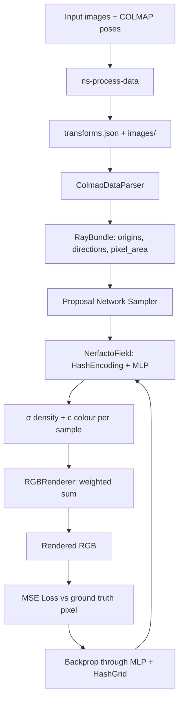
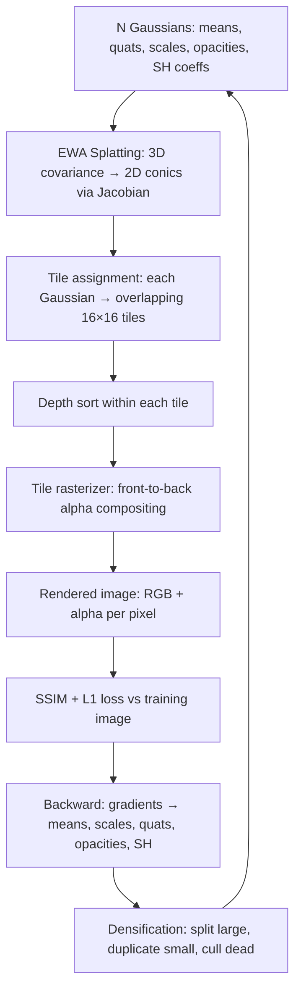

# Chapter 115: NeRFStudio, Neural Radiance Fields, and 3D Gaussian Splatting on Linux

> **Part**: Part XX — AI Inference & Neural Rendering
> **Audience**: Graphics application developers, AI/ML engineers, neural rendering pipeline developers
> **Status**: First draft — 2026-06-19

---

## Table of Contents

1. [Overview: Neural Rendering in the Linux GPU Stack](#1-overview-neural-rendering-in-the-linux-gpu-stack)
   - [1.1 What is Neural Radiance Fields (NeRF)?](#11-what-is-neural-radiance-fields-nerf)
   - [1.2 What is 3D Gaussian Splatting (3DGS)?](#12-what-is-3d-gaussian-splatting-3dgs)
   - [1.3 What is NeRFStudio?](#13-what-is-nerfstudio)
2. [Volume Rendering Theory: Ray Marching, Density Fields, and Positional Encoding](#2-volume-rendering-theory)
3. [NeRFStudio Architecture: ns-train, Pipelines, and the tyro Config System](#3-nerfstudio-architecture)
4. [Instant-NGP and tiny-cuda-nn: Hash Encoding and MLP Acceleration](#4-instant-ngp-and-tiny-cuda-nn)
5. [Nerfacto: The Flagship Model](#5-nerfacto-the-flagship-model)
6. [3D Gaussian Splatting: splatfacto and gsplat](#6-3d-gaussian-splatting-splatfacto-and-gsplat)
7. [The gsplat CUDA Rasterizer: Forward and Backward Passes](#7-the-gsplat-cuda-rasterizer)
8. [COLMAP Integration and the ns-process-data Pipeline](#8-colmap-integration-and-ns-process-data)
9. [The Viser Viewer: WebSocket Streaming and Three.js Rendering](#9-the-viser-viewer)
10. [ROCm/HIP Portability: AMD GPU Status](#10-rocm-hip-portability)
11. [Vulkan-Based Real-Time Splat Renderers](#11-vulkan-based-real-time-splat-renderers)
12. [Production Deployment: Docker, Multi-GPU, and Distributed Training](#12-production-deployment)
13. [Dynamic and Temporal Gaussian Splatting (4DGS)](#13-dynamic-and-temporal-gaussian-splatting-4dgs)
14. [Python Differentiable Rendering: nvdiffrast, PyTorch3D, and Kaolin](#14-python-differentiable-rendering-nvdiffrast-pytorch3d-and-kaolin)
15. [GVDB Sparse Voxels: GPU Volume Compute and Rendering](#15-gvdb-sparse-voxels-gpu-volume-compute-and-rendering)
16. [threestudio: Text-to-3D via Score Distillation](#16-threestudio-text-to-3d-via-score-distillation)
17. [DUSt3R: Uncalibrated Multi-View Reconstruction](#17-dust3r-uncalibrated-multi-view-reconstruction)
18. [MASt3R: Matching and 3D Reconstruction](#18-mast3r-matching-and-3d-reconstruction)
19. [Mip-NeRF 360: Unbounded Anti-Aliased Radiance Fields](#19-mip-nerf-360-unbounded-anti-aliased-radiance-fields)
20. [2D Gaussian Splatting: Surface-Aligned Radiance Fields](#20-2d-gaussian-splatting-surface-aligned-radiance-fields)
21. [Gaussian Mesh Extraction: SuGaR and Gaussian Opacity Fields](#21-gaussian-mesh-extraction-sugar-and-gaussian-opacity-fields)
22. [InstantSplat: COLMAP-Free Sparse-View 3DGS](#22-instantsplat-colmap-free-sparse-view-3dgs)
23. [Monocular Depth Priors for NeRF and 3DGS](#23-monocular-depth-priors-for-nerf-and-3dgs)
24. [3DGUT: Distorted Cameras and Secondary Rays in Gaussian Splatting](#24-3dgut-distorted-cameras-and-secondary-rays-in-gaussian-splatting)
25. [Scaffold-GS: Anchor-Based Structured Gaussians for View-Adaptive Rendering](#25-scaffold-gs-anchor-based-structured-gaussians-for-view-adaptive-rendering)
26. [Zip-NeRF: Anti-Aliased Grid-Based Neural Radiance Fields](#26-zip-nerf-anti-aliased-grid-based-neural-radiance-fields)
27. [Language and Feature Fields: LERF, LangSplat, Feature 3DGS, and Gaussian Grouping](#27-language-and-feature-fields-lerf-langsplat-feature-3dgs-and-gaussian-grouping)
28. [Integrations](#28-integrations)

---

## 1. Overview: Neural Rendering in the Linux GPU Stack

Neural rendering bridges deep learning and real-time graphics. Where conventional rendering pipelines assemble geometry, shaders, and textures into pixels through rasterization or ray tracing, neural rendering learns an implicit or explicit scene representation from photographs and synthesises novel viewpoints directly from that learned representation. The result can look more photorealistic than any hand-authored asset for scenes that are impractical to model manually — building interiors, archaeological sites, medical scans, photogrammetric captures of machinery.

Neural Radiance Fields (NeRF), introduced by Mildenhall et al. in 2020 [Source](https://arxiv.org/abs/2003.08934), encode a scene as a continuous volumetric function mapping a 3D position and viewing direction to colour and density. A small multi-layer perceptron (MLP) parameterises this function and is trained end-to-end from posed photographs. 3D Gaussian Splatting (3DGS), introduced by Kerbl et al. at SIGGRAPH 2023 [Source](https://repo-sam.inria.fr/fungraph/3d-gaussian-splatting/], replaces the implicit MLP with explicit semi-transparent Gaussian primitives rasterised in front-to-back order — achieving real-time rendering rates unreachable with ray-marched MLPs.

**NeRFStudio** [Source](https://github.com/nerfstudio-project/nerfstudio) is a modular Python framework that implements both families, providing a unified training harness, data pipeline, model registry, and interactive viewer. Its position in the Linux graphics stack is shown below:

```
┌─────────────────────────────────────────────────────────────┐
│  User-space: NeRFStudio (Python / PyTorch)                  │
│  ┌─────────────┐  ┌─────────────────┐  ┌─────────────────┐ │
│  │ ns-train    │  │ Viser viewer    │  │ ns-render       │ │
│  │ tyro CLI    │  │ (WebSocket/     │  │ ns-export       │ │
│  │ Trainer     │  │  Three.js)      │  │ ns-process-data │ │
│  └─────────────┘  └─────────────────┘  └─────────────────┘ │
│  ┌────────────────────────┐ ┌────────────────────────────┐  │
│  │ NeRF models (nerfacto, │ │ 3DGS models (splatfacto)   │  │
│  │  instant-ngp, tensorf) │ │  via gsplat rasterizer     │  │
│  └────────────────────────┘ └────────────────────────────┘  │
├──────────────────────────────────────────────────────────────┤
│  CUDA Libraries                                              │
│  ┌──────────────┐  ┌────────────┐  ┌──────────────────────┐ │
│  │ tiny-cuda-nn │  │  nerfacc   │  │  gsplat custom       │ │
│  │ (FullyFused  │  │ (OccGrid)  │  │  tile-based kernels  │ │
│  │  / Cutlass)  │  └────────────┘  └──────────────────────┘ │
│  └──────────────┘                                            │
├──────────────────────────────────────────────────────────────┤
│  NVIDIA GPU: CUDA driver / cuDNN / CUTLASS                   │
│  AMD GPU: ROCm / HIP (community support, reduced performance)│
├──────────────────────────────────────────────────────────────┤
│  Linux kernel: DRM/KMS, NVIDIA proprietary / amdgpu driver  │
└─────────────────────────────────────────────────────────────┘
```

**Audiences addressed in this chapter:**
- *Graphics application developers* integrating neural radiance fields or Gaussian splats into rendering pipelines, game engines, or design tools.
- *AI/ML engineers* training and deploying NeRF/3DGS models on Linux clusters.
- *Systems developers* who need to understand how the CUDA tile rasterizer and hash-encoding kernels interact with driver and hardware resources.

### 1.1 What is Neural Radiance Fields (NeRF)?

Neural Radiance Fields (NeRF) is a scene representation technique that encodes a three-dimensional scene as a continuous volumetric function learned from a collection of posed photographs. Rather than storing geometry as meshes or voxel grids, a NeRF parameterises the scene with a multi-layer perceptron (MLP) that accepts a 3D world position and a 2D viewing direction as inputs and predicts the emitted RGB colour and volume density at that location. Novel views are synthesised by casting rays through the scene, querying the network at sampled positions along each ray, and accumulating colour and opacity through the classical volume rendering integral. Training minimises the photometric reconstruction loss between rendered and observed pixel values using standard gradient descent over the MLP weights. The core appeal of NeRF is that it produces photorealistic view synthesis from unstructured photograph collections without requiring explicit 3D modelling, making it applicable to real-world scenes — building interiors, outdoor environments, industrial equipment — that are impractical to reconstruct manually. On Linux, NeRF training runs on CUDA-capable NVIDIA GPUs through PyTorch, with all compute exposed through the standard CUDA driver stack beneath the user-space framework. The volume rendering mathematics underpinning NeRF, and its extension to hash-grid encodings and proposal networks, are detailed in Sections 2 through 5 of this chapter.

### 1.2 What is 3D Gaussian Splatting (3DGS)?

3D Gaussian Splatting is an explicit scene representation and real-time rendering technique that models a scene as a collection of semi-transparent, anisotropic Gaussian primitives in 3D space. Each Gaussian carries a position (mean), a full 3D covariance matrix encoding orientation and scale, an opacity value, and a set of spherical harmonic coefficients representing view-dependent colour. Rendering proceeds by projecting the 3D Gaussians onto the image plane as 2D Gaussians, sorting them by depth, and compositing them front-to-back using alpha blending — a process called splatting. Because splatting is a rasterization operation rather than a ray-marching integral, it runs one to two orders of magnitude faster than NeRF inference, reaching real-time frame rates on modern GPUs. Training begins from a sparse point cloud produced by Structure-from-Motion and optimises Gaussian parameters through differentiable rasterization, using gradient signals to adaptively densify or prune the Gaussian set. The 3DGS representation is explicit and compact: a trained scene is stored as a `.ply` file of Gaussian attributes and can be loaded by any compliant renderer. The CUDA tile rasterizer that implements the forward and backward passes is described in Sections 6 and 7, and Vulkan-based real-time renderers for the splatted output are covered in Section 11.

### 1.3 What is NeRFStudio?

NeRFStudio is an open-source Python framework that provides a unified training, evaluation, and visualisation harness for both NeRF and 3DGS methods on Linux. It is built on PyTorch and exposes a modular architecture in which data parsers, model definitions, training loops, and renderer components are independently configurable through a typed dataclass system backed by the `tyro` CLI library. NeRFStudio ships with a curated set of production-grade models — including Nerfacto (its flagship NeRF), Splatfacto (3DGS via the gsplat rasterizer), Instant-NGP, and TensorRF — and provides a plugin registry so external models can be installed as Python packages and discovered automatically. The framework wraps the COLMAP structure-from-motion pipeline for camera pose estimation, handles dataset conversion from standard formats such as RealityCapture, ARKit, and polycam, and includes an interactive web-based viewer (Viser) that streams training progress to a browser over WebSocket. In the Linux graphics stack, NeRFStudio sits entirely in user space: it issues CUDA kernels through PyTorch's CUDA backend, which dispatches through the NVIDIA proprietary driver or the ROCm HIP stack on AMD hardware, ultimately reaching the DRM kernel subsystem. Installation, multi-GPU configuration, and deployment patterns are covered in Sections 3 and 12.

---

## 2. Volume Rendering Theory

### 2.1 The NeRF Representation

A NeRF parameterises a scene by a function:

```
F_Θ : (x, d) → (c, σ)
```

where `x ∈ ℝ³` is a 3D world position, `d ∈ S²` is a unit viewing direction encoded as a 3-component unit vector, `c ∈ [0,1]³` is emitted RGB colour, and `σ ∈ ℝ≥0` is volume density (opacity per unit length). The network weights `Θ` are trained so that the rendered colour of a camera ray matches the observed pixel value in the training photographs.

### 2.2 Positional Encoding

Raw coordinates are poor inputs to MLPs because of spectral bias — networks preferentially learn low-frequency functions. The original NeRF paper lifted positions into a high-frequency embedding:

```
γ(p) = (sin(2⁰πp), cos(2⁰πp), sin(2¹πp), cos(2¹πp), …, sin(2^(L-1)πp), cos(2^(L-1)πp))
```

with `L = 10` for position and `L = 4` for direction [Source](https://arxiv.org/abs/2003.08934). This is sometimes called Fourier feature encoding. Instant-NGP replaces Fourier features with learned hash table lookups; see Section 4.

### 2.3 Volume Rendering Integral

Given a ray `r(t) = o + t·d` from camera origin `o`, the expected colour is:

```
C(r) = ∫[t_n, t_f] T(t) · σ(r(t)) · c(r(t), d) dt
```

where the transmittance `T(t)` is the probability of the ray reaching `t` without hitting anything:

```
T(t) = exp(−∫[t_n, t] σ(r(s)) ds)
```

The integral is approximated by stratified sampling of `N` points along the ray and the compositing formula:

```
C_hat(r) = Σᵢ Tᵢ (1 − exp(−σᵢ δᵢ)) cᵢ
```

where `δᵢ = tᵢ₊₁ − tᵢ` is the step size and `Tᵢ = exp(−Σⱼ₍ⱼ<ᵢ₎ σⱼ δⱼ)`. This is computed in the `RGBRenderer`:

```python
# nerfstudio/model_components/renderers.py
comp_rgb = torch.sum(weights * rgb, dim=-2)
```

where `weights = Tᵢ × αᵢ`, `αᵢ = 1 − exp(−σᵢ δᵢ)`.

### 2.4 Mermaid: NeRF Training Pipeline



---

## 3. NeRFStudio Architecture

NeRFStudio's source tree is organised around five main subsystems: the CLI entry points, the config/registry system, the data pipeline, the model hierarchy, and the viewer. The following sections map each subsystem to its directory.

### 3.1 CLI Entry Points

All user-facing commands are defined as `[project.scripts]` in `pyproject.toml` [Source](https://github.com/nerfstudio-project/nerfstudio/blob/main/pyproject.toml):

| Script | Module | Purpose |
|---|---|---|
| `ns-train` | `nerfstudio.scripts.train:entrypoint` | Train a model from scratch or resume |
| `ns-viewer` | `nerfstudio.scripts.viewer_gui:entrypoint` | Launch viewer for a saved checkpoint |
| `ns-render` | `nerfstudio.scripts.render:entrypoint` | Render camera paths / spirals to video |
| `ns-eval` | `nerfstudio.scripts.eval:entrypoint` | Compute PSNR/SSIM/LPIPS on test split |
| `ns-export` | `nerfstudio.scripts.exporter:entrypoint` | Export point clouds, meshes, `.ply` splats |
| `ns-process-data` | `nerfstudio.scripts.process_data:entrypoint` | Run COLMAP and prepare `transforms.json` |
| `ns-download-data` | `nerfstudio.scripts.downloads.download_data:entrypoint` | Download benchmark datasets |

### 3.2 The tyro Config System

NeRFStudio's command-line interface is driven entirely by [tyro](https://github.com/brentyi/tyro), a library that generates `argparse`-style argument parsers from Python dataclasses with type annotations. There are no YAML or TOML config files at runtime; every hyperparameter is a dataclass field with a default, overridable on the command line [Source](https://github.com/nerfstudio-project/nerfstudio/blob/main/nerfstudio/scripts/train.py):

```python
# nerfstudio/scripts/train.py
import tyro

def entrypoint():
    tyro.extras.set_accent_color("bright_yellow")
    main(tyro.cli(AnnotatedBaseConfigUnion, description=...))
```

`AnnotatedBaseConfigUnion` is the union of all `TrainerConfig` objects registered in the method registry. tyro converts this into a subcommand-based CLI:

```bash
ns-train nerfacto --pipeline.model.num-levels 16 \
    nerfstudio-data --data /path/to/scene

ns-train splatfacto --pipeline.model.sh-degree 0 \
    colmap-data --data /path/to/scene

# Multi-GPU: 4 GPUs, NCCL backend
ns-train nerfacto \
    --machine.num-devices 4 \
    --machine.device-type cuda \
    nerfstudio-data --data /path/to/scene
```

The config hierarchy is: `TrainerConfig → VanillaPipelineConfig → (DataManagerConfig, ModelConfig)`.

`MachineConfig` controls hardware topology [Source](https://github.com/nerfstudio-project/nerfstudio/blob/main/nerfstudio/configs/base_config.py):

```python
@dataclass
class MachineConfig:
    seed: int = 42
    num_devices: int = 1           # GPUs per machine
    num_machines: int = 1          # nodes for multi-machine DDP
    machine_rank: int = 0          # this node's rank
    dist_url: str = "auto"         # auto = find a free port
    device_type: Literal["cpu", "cuda", "mps"] = "cuda"
```

### 3.3 Directory Structure

```
nerfstudio/
├── cameras/         # Cameras dataclass, CameraType enum, RayBundle
├── configs/         # method_configs.py, base_config.py
├── data/
│   ├── dataparsers/ # colmap, nerfstudio, blender, ...
│   ├── datamanagers/# base, full_images (splatfacto)
│   └── datasets/
├── engine/          # trainer.py: Trainer class
├── field_components/ # encodings.py (HashEncoding, SHEncoding), mlp.py
├── fields/          # nerfacto_field.py, splatfacto_field.py
├── model_components/ # ray_samplers.py, renderers.py
├── models/          # nerfacto.py, splatfacto.py, instant_ngp.py, ...
├── pipelines/       # base_pipeline.py (VanillaPipeline), dynamic_batch.py
├── plugins/         # registry.py
├── scripts/         # train.py, render.py, exporter.py, process_data.py
└── viewer/          # viewer.py, render_state_machine.py
```

### 3.4 Method Registry and Plugin System

Built-in methods are registered in `nerfstudio/configs/method_configs.py` as a dict mapping CLI names to `TrainerConfig` instances [Source](https://github.com/nerfstudio-project/nerfstudio/blob/main/nerfstudio/configs/method_configs.py):

| CLI name | Model |
|---|---|
| `nerfacto`, `nerfacto-big`, `nerfacto-huge` | `NerfactoModel` (graduated scale) |
| `depth-nerfacto` | Depth-supervised variant |
| `instant-ngp`, `instant-ngp-bounded` | `InstantNGPModel` |
| `mipnerf` | `VanillaModel` (MipNeRF) |
| `vanilla-nerf` | `VanillaModel` (reference implementation) |
| `tensorf` | `TensoRFModel` |
| `neus`, `neus-facto` | NeuS surface reconstruction |
| `splatfacto`, `splatfacto-big`, `splatfacto-mcmc` | `SplatfactoModel` |

External packages extend the registry via Python entry points [Source](https://github.com/nerfstudio-project/nerfstudio/blob/main/nerfstudio/plugins/registry.py):

```toml
# An external package's pyproject.toml
[project.entry-points."nerfstudio.method_configs"]
my-method = "my_package.configs:MyMethodSpecification"
```

`discover_methods()` in `nerfstudio/plugins/registry.py` iterates `importlib.metadata.entry_points(group="nerfstudio.method_configs")` and also checks the `NERFSTUDIO_METHOD_CONFIGS` environment variable (CSV format: `"name=module:config_name"`). All external methods must implement the `MethodSpecification` protocol.

### 3.5 Training Loop (Trainer)

The `Trainer` class in `nerfstudio/engine/trainer.py` drives the main loop [Source](https://github.com/nerfstudio-project/nerfstudio/blob/main/nerfstudio/engine/trainer.py):

```python
# Simplified from trainer.py
class Trainer:
    def train(self):
        for step in range(self._start_step, self.config.max_num_iterations):
            with torch.autocast(device_type=..., enabled=self.mixed_precision):
                _, loss_dict, metrics_dict = self.pipeline.get_train_loss_dict(step)
                loss = functools.reduce(torch.add, loss_dict.values())
            self.grad_scaler.scale(loss).backward()
            # selective optimizer step
            self.optimizers.optimizer_scaler_step(self.grad_scaler)
            self.grad_scaler.update()
            self.optimizers.scheduler_step_all(step)
            if step % self.config.steps_per_save == 0:
                self.save_checkpoint(step)
            if step % self.config.steps_per_eval_all_images == 0:
                self.eval_iteration(step)
```

`VanillaPipeline.get_train_loss_dict(step)` calls `self.datamanager.next_train(step)` to produce a `RayBundle` (for NeRF models) or a full camera image (for splatfacto), then `self._model(ray_bundle)` to get outputs, then the model's loss and metrics dicts.

---

## 4. Instant-NGP and tiny-cuda-nn

### 4.1 The Multi-Resolution Hash Grid

Instant-NGP [Source](https://arxiv.org/abs/2201.05989) by Müller et al. (NVIDIA, 2022) demonstrated that replacing Fourier positional encodings with a learned multi-resolution hash table reduces NeRF training from hours to minutes. The core idea is to store feature vectors in `L` hash tables at geometrically spaced resolutions from `base_res` to `max_res`, then trilinearly interpolate to get a continuous feature for any 3D coordinate.

The hash function maps a discrete grid cell `(x, y, z)` at level `l` to a table index:

```
h(x) = (x[0] × π₁ XOR x[1] × π₂ XOR x[2] × π₃) mod T_l
```

where `π₁ = 1`, `π₂ = 2654435761`, `π₃ = 805459861` (chosen for good hash mixing), and `T_l = 2^log2_hashmap_size` [Source](https://arxiv.org/abs/2201.05989 §3]. Crucially, hash collisions are resolved implicitly by the optimizer — nearby colliding entries learn to compromise on values that minimise the total loss.

The pure-PyTorch implementation in nerfstudio (`nerfstudio/field_components/encodings.py`) shows the constants directly:

```python
# nerfstudio/field_components/encodings.py — HashEncoding (torch fallback)
# Primes for spatial hashing
PRIMES = [1, 2654435761, 805459861]

def hash_fn(coords: Tensor, log2_hashmap_size: int) -> Tensor:
    # coords: [..., 3] integer grid coordinates
    result = coords[..., 0]
    result = result ^ (coords[..., 1] * PRIMES[1])
    result = result ^ (coords[..., 2] * PRIMES[2])
    return result % (2 ** log2_hashmap_size)
```

Trilinear interpolation across 8 cube corners produces the final per-level feature; the `L × F` level features are concatenated to produce the final hash encoding vector.

### 4.2 tiny-cuda-nn Integration

[tiny-cuda-nn](https://github.com/NVlabs/tiny-cuda-nn) (tcnn) is an NVIDIA library providing hand-optimised CUDA kernels for both the hash encoding and subsequent fully-connected layers. Two MLP backends are available [Source](https://github.com/NVlabs/tiny-cuda-nn):

- **FullyFusedMLP** — custom CUDA shared-memory kernels that fuse weight loading, matrix multiply, and activation into a single kernel. Supports hidden widths of 16, 32, 64, or 128. Requires large shared memory (Ampere/Ada class: RTX 3090, RTX 4090, A100 recommended).
- **CutlassMLP** — uses NVIDIA's CUTLASS library for GEMM templates. Supports arbitrary widths and is compatible with older Turing/Volta GPUs, but slower than FullyFusedMLP.

Note: neither backend uses cuBLAS. This is a deliberate design choice — tcnn's own fused kernels outperform cuBLAS for the narrow networks used in NeRF.

`MLPWithHashEncoding` in `nerfstudio/field_components/mlp.py` instantiates `tcnn.NetworkWithInputEncoding`:

```python
# nerfstudio/field_components/mlp.py
import tinycudann as tcnn

self.model = tcnn.NetworkWithInputEncoding(
    n_input_dims=self.in_dim,
    n_output_dims=self.out_dim,
    encoding_config={
        "otype": "HashGrid",
        "n_levels": num_levels,             # e.g. 16
        "n_features_per_level": features_per_level,  # e.g. 2
        "log2_hashmap_size": log2_hashmap_size,      # e.g. 19
        "base_resolution": base_res,        # e.g. 16
        "per_level_scale": per_level_scale,
    },
    network_config=get_tcnn_network_config(
        activation, output_activation, hidden_dim, num_layers
    ),
)
```

`get_tcnn_network_config()` selects between `"FullyFusedMLP"` for widths in `{16, 32, 64, 128}` and `"CutlassMLP"` otherwise.

### 4.3 Availability Check and Torch Fallback

`tinycudann` is **not** a required dependency — `pyproject.toml` lists it under optional extras. A lazy error wrapper allows the rest of nerfstudio to import without failing [Source](https://github.com/nerfstudio-project/nerfstudio/blob/main/nerfstudio/utils/external.py):

```python
# nerfstudio/utils/external.py
TCNN_EXISTS = False
try:
    import tinycudann as tcnn
    TCNN_EXISTS = True
except (ModuleNotFoundError, ImportError, EnvironmentError) as e:
    tcnn_import_exception = e
    tcnn = _LazyError("tinycudann")  # raises on attribute access
```

All models that use hash encoding accept `implementation: Literal["tcnn", "torch"] = "tcnn"`. Setting `implementation="torch"` uses the pure-PyTorch `HashEncoding` class, roughly 5–20× slower due to Python overhead and lack of kernel fusion, but functional on any CUDA or even CPU device.

### 4.4 Building tiny-cuda-nn from Source

On Linux with CUDA 11.8:

```bash
# Clone with submodules (includes CUTLASS)
git clone --recursive https://github.com/NVlabs/tiny-cuda-nn.git
cd tiny-cuda-nn

# Set CUDA architecture flags (e.g. sm_86 for Ampere / RTX 3090)
export TCNN_CUDA_ARCHITECTURES="86"

pip install build
cd bindings/torch && pip install .
```

The CUDA architecture must match the installed GPU. For RTX 40-series (Ada): `TCNN_CUDA_ARCHITECTURES="89"`. For A100: `"80"`. Mismatches produce PTX-only binaries that work but are slower.

### 4.5 Instant-NGP in NeRFStudio

NeRFStudio's `InstantNGPModelConfig` [Source](https://github.com/nerfstudio-project/nerfstudio/blob/main/nerfstudio/models/instant_ngp.py):

```python
@dataclass
class InstantNGPModelConfig(ModelConfig):
    grid_resolution: int = 128    # occupancy grid resolution per level
    grid_levels: int = 4
    max_res: int = 2048
    log2_hashmap_size: int = 19
    alpha_thre: float = 0.01      # skip Gaussians below this alpha
    cone_angle: float = 0.004     # ray cone angle for mip-like sampling
```

Unlike nerfacto's proposal networks, instant-ngp uses an occupancy grid via `nerfacc.OccGridEstimator` to mark empty voxels and skip them during ray marching. The grid is updated every `update_occ_every` steps. This enables very fast training — typically under 5 minutes for small scenes — at the cost of lower accuracy than nerfacto for complex unbounded environments.

---

## 5. Nerfacto: The Flagship Model

### 5.1 Design Philosophy

Nerfacto (NeRF in practice) synthesises the best ideas from several concurrent research papers into a single practical model [Source](https://docs.nerf.studio/nerfology/methods/nerfacto.html):

- **Multi-resolution hash encoding** from Instant-NGP for fast training
- **Proposal networks** from MipNeRF 360 [Source](https://arxiv.org/abs/2111.12077) for efficient importance sampling in unbounded scenes
- **Scene contraction** (mapping unbounded space to a unit sphere) from MipNeRF 360
- **Appearance embeddings** per training image, allowing variation in lighting/exposure
- **Camera pose refinement** via backpropagation through the projection

### 5.2 NerfactoModelConfig

Key fields in `NerfactoModelConfig` [Source](https://github.com/nerfstudio-project/nerfstudio/blob/main/nerfstudio/models/nerfacto.py):

```python
@dataclass
class NerfactoModelConfig(ModelConfig):
    # Hash grid
    num_levels: int = 16
    base_res: int = 16
    max_res: int = 2048
    log2_hashmap_size: int = 19
    features_per_level: int = 2
    # MLP widths
    hidden_dim: int = 64
    hidden_dim_color: int = 64
    appearance_embed_dim: int = 32
    # Proposal sampling
    num_proposal_samples_per_ray: Tuple[int, ...] = (256, 96)
    num_nerf_samples_per_ray: int = 48
    num_proposal_iterations: int = 2
    # Backend
    implementation: Literal["tcnn", "torch"] = "tcnn"
```

Approximate GPU memory: `nerfacto` ~6 GB, `nerfacto-big` ~12 GB, `nerfacto-huge` ~24 GB.

### 5.3 Forward Pass: get_outputs()

```python
# Simplified from nerfstudio/models/nerfacto.py
def get_outputs(self, ray_bundle: RayBundle):
    # 1. Camera pose optimisation: refine ray origins/directions
    ray_bundle = self.camera_optimizer.apply_to_raybundle(ray_bundle)

    # 2. Proposal sampling: two passes of HashMLPDensityField
    ray_samples, weights_list, ray_samples_list = \
        self.proposal_sampler(ray_bundle, density_fns=self.density_fns)

    # 3. NerfactoField: hash encoding → MLP base → density + geo features
    field_outputs = self.field(ray_samples, compute_normals=self.config.predict_normals)
    # field_outputs: {FieldHeadNames.DENSITY, FieldHeadNames.RGB, ...}

    # 4. Weights from density and step sizes
    weights = ray_samples.get_weights(field_outputs[FieldHeadNames.DENSITY])

    # 5. Renderers
    rgb = self.renderer_rgb(rgb=field_outputs[FieldHeadNames.RGB], weights=weights)
    depth = self.renderer_depth(weights=weights, ray_samples=ray_samples)

    return {"rgb": rgb, "depth": depth, ...}
```

### 5.4 NerfactoField: Density and Colour MLP

`NerfactoField` uses separate MLP heads for density and view-dependent colour:

1. **Position encoding**: `MLPWithHashEncoding` maps `(x,y,z) → h ∈ ℝ^(num_levels × features_per_level)`.
2. **MLP base**: `Linear(hash_dim) → ReLU → hidden_dim → (density, geo_features)`.
3. **Direction encoding**: `SHEncoding(levels=4)` encodes unit direction `d` to `16` spherical harmonic features.
4. **Appearance embedding**: per-image `nn.Embedding(num_train_data, appearance_embed_dim)` concatenated.
5. **MLP head**: `Linear(geo_features + sh_features + appearance) → ReLU → hidden_dim_color → RGB`.

The SH encoding covers frequencies up to degree 3 (16 basis functions) and is computed in `nerfstudio/field_components/encodings.py`.

### 5.5 Losses

```python
# nerfstudio/models/nerfacto.py — get_loss_dict()
loss_dict = {
    "rgb_loss":          F.mse_loss(pred_rgb, gt_rgb),
    "interlevel_loss":   interlevel_loss(weights_list, ray_samples_list),
    "distortion_loss":   distortion_loss(weights_list, ray_samples_list),
    "orientation_loss":  orientation_loss(weights, normals, directions),
    "pred_normal_loss":  F.mse_loss(pred_normals, normals.detach()),
}
```

The interlevel and distortion losses penalise the proposal networks to be consistent with the final NeRF samples and to concentrate weight near surfaces [Source](https://arxiv.org/abs/2111.12077).

---

## 6. 3D Gaussian Splatting: splatfacto and gsplat

### 6.1 The 3DGS Representation

3D Gaussian Splatting [Source](https://repo-sam.inria.fr/fungraph/3d-gaussian-splatting/) represents a scene as a collection of N semi-transparent Gaussian primitives. Each Gaussian has:

- **Position** `μ ∈ ℝ³`
- **Covariance** parameterised as `Σ = R S Sᵀ Rᵀ` where `R` is a unit quaternion and `S` a diagonal scale matrix
- **Opacity** `α ∈ [0,1]`
- **Colour** encoded as spherical harmonic coefficients of degree up to 3

Unlike NeRF, 3DGS renders by projecting each Gaussian onto the image plane (EWA splatting) and compositing front-to-back — a fully differentiable rasterisation process rather than ray marching. The result: training in ~5–10 minutes and interactive rendering at 50–200 FPS versus NeRF's ~30 minutes training and 2–5 FPS viewer.

### 6.2 gsplat: The NeRFStudio Rasterizer

**Correction from the research literature:** splatfacto does **not** use `diff-gaussian-rasterization`, the original Inria CUDA implementation from Kerbl et al. (2023). Instead, nerfstudio ships and uses `gsplat` [Source](https://github.com/nerfstudio-project/gsplat), a fully independent reimplementation by the nerfstudio team. gsplat achieves up to 4× lower GPU memory usage and approximately 15% faster training compared to the original reference implementation, with a cleaner API and ongoing maintenance.

```python
# nerfstudio/models/splatfacto.py
from gsplat.rendering import rasterization
from gsplat.strategy import DefaultStrategy, MCMCStrategy
```

`gsplat` is listed as a required dependency in nerfstudio's `pyproject.toml` at version `1.4.0`.

### 6.3 SplatfactoModelConfig

```python
@dataclass
class SplatfactoModelConfig(ModelConfig):
    warmup_length: int = 500          # steps before densification starts
    refine_every: int = 100           # densification frequency
    num_downscales: int = 2           # resolution schedule steps
    resolution_schedule: int = 3000   # step to reach full resolution
    # Culling thresholds
    cull_alpha_thresh: float = 0.1    # remove Gaussians below this opacity
    cull_scale_thresh: float = 0.5    # remove oversized Gaussians
    cull_screen_size: float = 0.15    # remove Gaussians covering >15% of screen
    # Densification
    densify_grad_thresh: float = 0.0008
    densify_size_thresh: float = 0.01
    n_split_samples: int = 2          # new Gaussians per split
    # Spherical harmonics
    sh_degree: int = 3                # max SH degree for colour
    sh_degree_interval: int = 1000    # steps between degree increments
    # Loss
    ssim_lambda: float = 0.2
    # Rendering
    rasterize_mode: Literal["classic", "antialiased"] = "classic"
```

### 6.4 Gaussian Parameter Storage

Parameters are stored in an `nn.ParameterDict` for optimiser compatibility [Source](https://github.com/nerfstudio-project/nerfstudio/blob/main/nerfstudio/models/splatfacto.py):

```python
self.gauss_params = nn.ParameterDict({
    "means":          # [N, 3]  — world-space positions
    "scales":         # [N, 3]  — log-space; exponentiated at render time
    "quats":          # [N, 4]  — unit quaternions (wxyz)
    "features_dc":    # [N, 1, 3]  — SH degree-0 (DC) colour
    "features_rest":  # [N, (sh_degree+1)²−1, 3]  — higher SH
    "opacities":      # [N]     — logit-space; sigmoid at render time
})
```

Log-scale and logit-opacity representations prevent numerical instability during gradient descent when values approach zero or one.

### 6.5 DataManager: Full Images vs Ray Batches

This is a key difference from NeRF models. splatfacto requires full image supervision for the SSIM loss and uses `FullImagesDataManager` rather than `VanillaDataManager`:

```python
# method_configs.py — splatfacto
pipeline=VanillaPipelineConfig(
    datamanager=FullImagesDataManagerConfig(
        dataparser=ColmapDataParserConfig(load_3D_points=True),
    ),
    model=SplatfactoModelConfig(),
)
```

`load_3D_points=True` instructs the COLMAP data parser to load `points3D.bin` and use those sparse 3D points to initialise the Gaussian means. Without this initialisation, convergence is poor. The initial number of Gaussians equals the number of COLMAP 3D points (typically 50K–300K for a small scene), growing to several million during densification.

### 6.6 Mermaid: 3DGS Rendering Pipeline



---

## 7. The gsplat CUDA Rasterizer

### 7.1 The rasterization() API

The top-level function `rasterization()` in `gsplat/rendering.py` [Source](https://github.com/nerfstudio-project/gsplat/blob/main/gsplat/rendering.py):

```python
def rasterization(
    means: Tensor,            # [N, 3] — Gaussian centres
    quats: Tensor,            # [N, 4] — unit quaternions
    scales: Tensor,           # [N, 3] — per-axis scale
    opacities: Tensor,        # [N]    — per-Gaussian opacity
    colors: Optional[Tensor], # [N, D] — pre-computed colours, or SH coefficients
    viewmats: Tensor,         # [C, 4, 4] — camera view matrices
    Ks: Tensor,               # [C, 3, 3] — camera intrinsics
    width: int,
    height: int,
    near_plane: float = 0.01,
    far_plane: float = 1e10,
    eps2d: float = 0.3,        # 2D covariance regulariser
    sh_degree: Optional[int] = None,  # if set, evaluate SH on-the-fly
    packed: bool = True,       # sparse representation for visible Gaussians
    tile_size: int = 16,       # tile width/height in pixels
    backgrounds: Optional[Tensor] = None,
    render_mode: RenderMode = "RGB",
    sparse_grad: bool = False, # COO-format gradients for sparse update
    absgrad: bool = False,     # absolute value of 2D mean gradients
    rasterize_mode: RasterizeMode = "classic",  # or "antialiased"
    ...
) -> Tuple[Tensor, Tensor, Dict]
```

Returns `(render_colors [C, H, W, D], render_alphas [C, H, W, 1], meta dict)`.

### 7.2 Stage 1: EWA 3D→2D Projection

`fully_fused_projection()` implements the EWA (Elliptical Weighted Average) splatting derivation from Zwicker et al. (2002) [Source](https://dl.acm.org/doi/10.1145/566570.566575). Each 3D Gaussian covariance `Σ = R S Sᵀ Rᵀ` is projected to a 2D covariance `Σ' = J W Σ Wᵀ Jᵀ`, where `W` is the view matrix rotation and `J` is the Jacobian of the perspective projection at the Gaussian's 2D projected centre. The 2D covariance is inverted to produce the "conic" `(a, b, c)` used in the per-pixel contribution formula:

```
α_pixel(x) = opacity × exp(−½ × (x − μ')ᵀ Σ'⁻¹ (x − μ'))
```

The CUDA kernel for this stage outputs: 2D means (pixel coordinates), conics, per-Gaussian pixel radii (bounding circle), depths, and a `touched_tiles` count.

### 7.3 Stage 2: Tile Intersection

```python
# gsplat — isect_tiles()
tile_width  = math.ceil(width  / float(tile_size))   # e.g. ceil(1920/16) = 120
tile_height = math.ceil(height / float(tile_size))   # e.g. ceil(1080/16) = 68

tiles_per_gauss, isect_ids, flatten_ids = isect_tiles(
    means2d, radii, depths, tile_width, tile_height, packed=True
)
```

`isect_tiles()` computes which tiles each Gaussian's bounding circle overlaps. In `packed` mode (default), only Gaussians visible to at least one camera are retained in a compressed `[nnz, ...]` representation, avoiding redundant memory allocation for the full `[N, C]` product.

### 7.4 Stage 3: Depth Sort

Gaussians are sorted within each tile by z-depth (distance along view axis) to enforce correct front-to-back compositing. The sort is performed on `(tile_id << 32 | depth_as_uint32)` keys via `torch.argsort` or a custom `radix_sort` CUDA kernel, depending on the gsplat version.

When `global_z_order=False`, sort is by Euclidean distance from camera origin rather than z-depth, which can produce better results for wide-angle views.

### 7.5 Stage 4: Tile Rasterization

`rasterize_to_pixels()` launches a CUDA kernel with one thread block per tile. Threads within a block load the tile's sorted Gaussian list into shared memory, then each thread independently accumulates colour for its pixel:

```cuda
// Pseudocode for the core rasterization kernel
// Each thread handles one pixel (px, py) in the tile
float3 C = {0.0f, 0.0f, 0.0f};
float T = 1.0f;  // transmittance

for (int g_idx = tile_start; g_idx < tile_end; g_idx++) {
    int g = sorted_gauss_ids[g_idx];
    float2 xy = means2d[g];
    float3 conic = conics[g];

    // 2D Gaussian contribution at this pixel
    float2 d = {px - xy.x, py - xy.y};
    float power = -0.5f * (conic.x * d.x*d.x +
                           2.0f * conic.y * d.x*d.y +
                           conic.z * d.y*d.y);
    if (power > 0.0f) continue;

    float alpha = min(0.99f, opacities[g] * expf(power));
    if (alpha < 1.0f / 255.0f) continue;

    // Front-to-back alpha compositing
    C += T * alpha * colors[g];
    T *= (1.0f - alpha);
    if (T < 1e-4f) break;  // early termination
}
out_color[py * width + px] = C + T * background;
```

**Slang equivalent** — `[Differentiable]` on the per-Gaussian blend step with `no_diff` geometry parameters lets `bwd_diff()` auto-generate `dL/d(opacity)` and `dL/d(color)` per Gaussian, replacing gsplat's hand-coded `backward.cu`, while `[shader("compute")]` + `[[vk::binding]]` compile to SPIR-V for Vulkan portability across NVIDIA, AMD, and Intel GPUs.

```slang
// File: gsplat_tile_rasterizer.slang
// Tile-based front-to-back 3D Gaussian alpha compositing — SPIR-V/Vulkan target
// Slang improvements:
//   - [Differentiable] on blendGaussian() with no_diff geometry params: bwd_diff()
//     auto-generates dL/d(opacity) and dL/d(color) per Gaussian, replacing the
//     ~500-LOC hand-coded backward kernel in gsplat/backward.cu
//   - [shader("compute")] + [[vk::binding]] compile to SPIR-V; runs on AMD/Intel/NVIDIA
//     without CUDA, enabling the Vulkan real-time path from §11 to share training kernels
//   - SlangPy wraps tileRasterizeCS for direct PyTorch tensor binding so Gaussian
//     parameters appear as torch.Tensor inputs in the training loop with zero glue code

struct Gaussian2D
{
    float2 mean;
    float3 conic;   // (a, b, c) elements of the inverted 2D covariance
    float  opacity;
    float3 color;   // pre-evaluated spherical-harmonic colour for this view
};

[[vk::binding(0, 0)]] StructuredBuffer<Gaussian2D>  gGaussians;
[[vk::binding(1, 0)]] StructuredBuffer<uint>         gSortedIds;  // depth-sorted indices
[[vk::binding(2, 0)]] StructuredBuffer<uint2>        gTileRanges; // per-tile (start, end)
[[vk::binding(3, 0)]] RWStructuredBuffer<float4>     gOutColor;

struct PushConstants { uint width; uint height; float3 background; };
[[vk::push_constant]] PushConstants gPC;

// Differentiable per-Gaussian alpha-blend contribution.
//
// Geometry inputs (d, conic) are marked no_diff: they come from the EWA projection
// pass (§7.2) and carry no gradient in the training inner loop.  opacity and color
// are the learnable parameters — bwd_diff(blendGaussian) returns dL/d(opacity) and
// dL/d(color) as DifferentialPair<float> and DifferentialPair<float3>, ready to
// scatter back to the Gaussian parameter buffers via a SlangPy training harness.
//
// T (running transmittance) is no_diff because its gradient accounting requires the
// reverse-order traversal that gsplat manages explicitly in its backward pass; the
// forward-pass T update is preserved unchanged in the surrounding loop below.
[Differentiable]
float3 blendGaussian(no_diff float2  d,      // pixel-to-Gaussian centre offset
                     no_diff float3  conic,  // (a, b, c) inverse 2D covariance
                     float           opacity,
                     float3          color,
                     no_diff float   T)      // running transmittance at this Gaussian
{
    float power = -0.5f * (conic.x * d.x * d.x
                         + 2.0f   * conic.y * d.x * d.y
                         + conic.z * d.y * d.y);
    float alpha = min(0.99f, opacity * exp(power));
    return T * alpha * color;   // differentiable w.r.t. opacity and color
}

[shader("compute")]
[numthreads(16, 16, 1)]
void tileRasterizeCS(uint3 tid : SV_DispatchThreadID)
{
    uint px = tid.x, py = tid.y;
    if (px >= gPC.width || py >= gPC.height) return;

    uint tileW  = (gPC.width  + 15u) / 16u;
    uint tileId = (py / 16u) * tileW + (px / 16u);
    uint2 range = gTileRanges[tileId];

    float3 C   = float3(0.0f);
    float  T   = 1.0f;
    float2 pos = float2((float)px, (float)py) + 0.5f; // pixel centre

    for (uint i = range.x; i < range.y; ++i)
    {
        Gaussian2D g     = gGaussians[gSortedIds[i]];
        float2     d     = pos - g.mean;
        float      power = -0.5f * (g.conic.x * d.x * d.x
                                  + 2.0f * g.conic.y * d.x * d.y
                                  + g.conic.z * d.y * d.y);
        if (power > 0.0f) continue;

        float alpha = min(0.99f, g.opacity * exp(power));
        if (alpha < (1.0f / 255.0f)) continue;

        // blendGaussian is the differentiable scope; guard logic stays outside
        C += blendGaussian(d, g.conic, g.opacity, g.color, T);
        T *= (1.0f - alpha);
        if (T < 1e-4f) break;   // early termination: ray fully occluded
    }

    gOutColor[py * gPC.width + px] = float4(C + T * gPC.background, 1.0f);
}
```

Tiles share a Gaussian list in shared memory, reducing global memory traffic. The early termination at `T < 1e-4` prevents processing Gaussians behind fully opaque foreground.

### 7.6 Stage 5: Backward Pass and Densification Gradients

PyTorch autograd handles the backward pass through the differentiable splatting steps. The `absgrad=True` option causes gsplat to accumulate the absolute values of gradients with respect to 2D projected means:

```python
# splatfacto.py — during training
outputs = self.rasterize_splats(
    ...,
    absgrad=(self.config.strategy == "default"),
)
# meta["means2d"].absgrad contains ∑|∂L/∂μ'| per Gaussian
```

These absolute gradient magnitudes are used by `DefaultStrategy` to decide which Gaussians to split (high gradient, large scale) or duplicate (high gradient, small scale), implementing the adaptive density control from the original 3DGS paper [Source](https://repo-sam.inria.fr/fungraph/3d-gaussian-splatting/).

The `sparse_grad=True` option returns gradients for `means`, `quats`, `scales` in COO sparse tensor format (standard `torch.sparse`, not the cuSPARSE library) — useful when only a small fraction of Gaussians are visible per step, avoiding dense gradient tensors.

### 7.7 Densification Strategies

Two strategies are available [Source](https://github.com/nerfstudio-project/gsplat/blob/main/gsplat/strategy.py):

**DefaultStrategy** (original 3DGS adaptive control, `splatfacto`):
- Clone small Gaussians with high gradient magnitude (under-reconstruction)
- Split large Gaussians with high gradient magnitude (over-reconstruction)
- Cull Gaussians with `opacity < cull_alpha_thresh`
- Cull Gaussians exceeding screen-space size threshold

**MCMCStrategy** (`splatfacto-mcmc`):
- Models Gaussian addition/removal as MCMC moves
- More stable training, avoids the periodic reset cycles in DefaultStrategy
- Recommended for difficult scenes with large variation in scale

### 7.8 PLY Export

`ns-export gaussian-splat` runs `ExportGaussianSplat` which serialises the `nn.ParameterDict` to a standard `.ply` file [Source](https://github.com/nerfstudio-project/nerfstudio/blob/main/nerfstudio/scripts/exporter.py):

```
Header properties:
  x, y, z                — means
  nx, ny, nz             — zeros (no surface normals in 3DGS)
  f_dc_0, f_dc_1, f_dc_2  — SH DC coefficients (degree-0 colour)
  f_rest_0 … f_rest_N    — higher-degree SH coefficients
  opacity                — pre-sigmoid logit
  scale_0, scale_1, scale_2   — log-scale values
  rot_0, rot_1, rot_2, rot_3  — quaternion wxyz
```

This format is the de-facto standard, readable by PlayCanvas SuperSplat, Polycam, Three.js Gaussian splat loaders, and NVIDIA's Vulkan renderer.

---

## 8. COLMAP Integration and the ns-process-data Pipeline

### 8.1 Overview

Both NeRF and 3DGS require calibrated camera poses for each training image. NeRFStudio integrates [COLMAP](https://colmap.github.io/) [Source](https://github.com/colmap/colmap) as the default Structure-from-Motion (SfM) solver, with `ns-process-data` automating the full pipeline.

### 8.2 Input Modes

```bash
# From a directory of images
ns-process-data images --data IMG_DIR --output-dir processed/

# From a video (extracts frames first with ffmpeg)
ns-process-data video --data video.mp4 --output-dir processed/ \
    --num-frames-target 300

# From Polycam capture (device-computed poses, no COLMAP needed)
ns-process-data polycam --data capture.zip --output-dir processed/

# Other sources: record3d, metashape, realitycapture, odm, aria
ns-process-data record3d --data record3d_export/ --output-dir processed/
```

### 8.3 COLMAP Pipeline Steps

For image/video modes, `ns-process-data` executes:

```bash
# 1. Feature extraction (SIFT)
colmap feature_extractor \
    --database_path database.db \
    --image_path images/ \
    --ImageReader.camera_model OPENCV

# 2. Feature matching
colmap exhaustive_matcher --database_path database.db
# or: sequential_matcher for ordered video frames

# 3. Sparse reconstruction (Structure-from-Motion)
colmap mapper \
    --database_path database.db \
    --image_path images/ \
    --output_path sparse/

# Output: sparse/0/cameras.bin, images.bin, points3D.bin
```

The resulting sparse reconstruction is then converted to nerfstudio's `transforms.json` format. COLMAP uses a scalar-first quaternion convention and OpenCV camera coordinates (z forward, y down); the parser converts to nerfstudio's OpenGL convention (z backward, y up) with 4×4 camera-to-world matrices.

### 8.4 transforms.json Format

```json
{
    "fl_x": 1000.0, "fl_y": 1000.0,
    "cx": 960.0,    "cy": 540.0,
    "w": 1920,      "h": 1080,
    "k1": 0.0, "k2": 0.0, "k3": 0.0,
    "p1": 0.0, "p2": 0.0,
    "camera_model": "OPENCV",
    "frames": [
        {
            "file_path": "images/frame_00001.jpg",
            "transform_matrix": [
                [R00, R01, R02, tx],
                [R10, R11, R12, ty],
                [R20, R21, R22, tz],
                [0,   0,   0,  1 ]
            ]
        }
    ]
}
```

This format is compatible with NeRF Synthetic (Blender) datasets and the original NeRF paper's data format. The 4×4 matrix is camera-to-world (c2w), not world-to-camera.

### 8.5 ColmapDataParserConfig

`ColmapDataParserConfig` controls how the stored reconstruction is parsed [Source](https://github.com/nerfstudio-project/nerfstudio/blob/main/nerfstudio/data/dataparsers/colmap_dataparser.py):

```python
@dataclass
class ColmapDataParserConfig(DataParserConfig):
    downscale_factor: int = 1            # auto-limits max dim to 1600 px
    orientation_method: Literal[
        "pca", "up", "vertical", "none"
    ] = "up"                             # scene orientation normalisation
    eval_mode: Literal[
        "fraction", "filename", "interval", "all"
    ] = "fraction"                       # how to select test images
    eval_fraction: float = 0.1          # 10% for test by default
    load_3D_points: bool = True          # load points3D for 3DGS init
    tiling_factor: int = 1               # tile images into n² sub-images
```

### 8.6 Cameras Dataclass

The central camera abstraction is `nerfstudio/cameras/cameras.py` [Source](https://github.com/nerfstudio-project/nerfstudio/blob/main/nerfstudio/cameras/cameras.py):

```python
class CameraType(Enum):
    PERSPECTIVE      = 1
    FISHEYE          = 2
    EQUIRECTANGULAR  = 3
    OMNIDIRECTIONALSTEREO_L = 4
    OMNIDIRECTIONALSTEREO_R = 5
    VR180_L          = 6
    VR180_R          = 7
    ORTHOPHOTO       = 8
    FISHEYE624       = 9   # polynomial fisheye for GoPro etc.

@dataclass
class Cameras:
    camera_to_worlds: Float[Tensor, "*num_cameras 3 4"]
    fx: Float[Tensor, "*num_cameras"]
    fy: Float[Tensor, "*num_cameras"]
    cx: Float[Tensor, "*num_cameras"]
    cy: Float[Tensor, "*num_cameras"]
    width:  Optional[Int[Tensor, "*num_cameras"]]
    height: Optional[Int[Tensor, "*num_cameras"]]
    distortion_params: Optional[Float[Tensor, "*num_cameras 6"]]
    camera_type: Int[Tensor, "*num_cameras"]
    times: Optional[Float[Tensor, "*num_cameras 1"]]  # for dynamic NeRF
```

`generate_rays()` converts pixel coordinates to world-space `RayBundle` tensors, applying distortion undistortion and projecting through the c2w matrix.

---

## 9. The Viser Viewer

### 9.1 Architecture

The interactive viewer is built on [viser](https://github.com/nerfstudio-project/viser) [Source](https://github.com/nerfstudio-project/viser), nerfstudio's own 3D visualisation server library. The viewer communicates over **WebSockets** (not WebRTC — that was the deprecated `viewer_legacy/` which used `aiortc`). The browser client is a React application using `react-three-fiber` (a Three.js wrapper) and Mantine UI components, served directly from the viser package.

The server is initialised in `nerfstudio/viewer/viewer.py` [Source](https://github.com/nerfstudio-project/nerfstudio/blob/main/nerfstudio/viewer/viewer.py):

```python
self.viser_server = viser.ViserServer(
    host=config.websocket_host,
    port=websocket_port
)
```

During training, the viewer runs in a background thread. The main training thread posts render requests via thread-safe queues.

### 9.2 Render State Machine

`RenderStateMachine` in `nerfstudio/viewer/render_state_machine.py` manages three quality states [Source](https://github.com/nerfstudio-project/nerfstudio/blob/main/nerfstudio/viewer/render_state_machine.py):

| State | Trigger | Resolution | JPEG Quality |
|---|---|---|---|
| `"low_move"` | Camera is moving | Reduced (fast) | 40 |
| `"low_static"` | Camera just stopped | Reduced | 75 |
| `"high"` | Camera settled (delay) | Full | configurable |

The flow:

```
Browser camera move
    → client.camera.on_update callback
    → CameraState updated
    → RenderAction("move", camera_state) posted
    → render_state_machine: transition to "low_move"
    → pipeline.model.get_outputs_for_camera(camera)
    → rendered Tensor (uint8, H×W×3)
    → JPEG encode at quality=40
    → client.scene.set_background_image(image_array, format="jpeg", quality=40)
    → WebSocket binary message to browser
    → react-three-fiber: display as background plane
```

### 9.3 Frame Transmission

Rendered frames are JPEG-encoded server-side and transmitted as binary WebSocket messages [Source](https://github.com/nerfstudio-project/nerfstudio/blob/main/nerfstudio/viewer/render_state_machine.py):

```python
# viewer/render_state_machine.py (simplified)
img = outputs["rgb"]                  # torch.Tensor, float32 [H, W, 3]
img_uint8 = (img * 255).clamp(0, 255).byte().cpu().numpy()

client.scene.set_background_image(
    img_uint8,
    format="jpeg",
    quality=current_state.jpeg_quality,  # 40, 75, or configured
    depth=depth_array if depth_enabled else None,
)
```

For splatfacto, the CUDA gsplat rasterizer runs server-side. The browser does **not** receive raw Gaussian data for client-side rendering during training. The viewer shows the same JPEG frame stream regardless of model type.

### 9.4 GUI Controls

The viser viewer exposes training and scene controls as 3D GUI panels rendered in the browser:

```python
# viewer/viewer.py
self.viser_server.gui.add_slider("Train util.", ..., update_fn=...)
self.viser_server.gui.add_button("Export", callback=self._trigger_export)
# Camera path recording, output resolution, render mode selectors
```

These controls communicate back to Python via the same WebSocket connection.

### 9.5 ns-viewer for Saved Checkpoints

```bash
# Load a saved checkpoint for interactive viewing without training
ns-viewer --load-config outputs/nerfacto/2024-01-01_120000/config.yml

# Specify websocket port
ns-viewer --load-config outputs/splatfacto/.../config.yml \
    --viewer.websocket-port 7007
```

Connect from a browser at `http://localhost:7007`. For remote servers, forward port 7007 via SSH:

```bash
ssh -L 7007:localhost:7007 user@training-server
```

---

## 10. ROCm/HIP Portability: AMD GPU Status

### 10.1 Current Status

ROCm support in nerfstudio is **unofficial, community-maintained, and significantly slower than CUDA**. The fundamental blocker is `tiny-cuda-nn`, which has no official ROCm/HIP port. A community fork (`tiny-rocm-nn`) exists but is not maintained by NVIDIA or the nerfstudio project, and its compatibility with current nerfstudio versions is not guaranteed.

The official nerfstudio documentation and GitHub Discussions confirm this position [Source](https://github.com/nerfstudio-project/nerfstudio/discussions/2388). Without tcnn, nerfacto falls back to pure-torch hash encoding and MLPs — functional but approximately 5–20× slower.

`gsplat` has better ROCm prospects, being a separate package that wraps PyTorch CUDA extensions rather than NVIDIA-specific libraries, but verify against the gsplat repository for current status.

### 10.2 Environment Setup for AMD

```bash
# Install ROCm-compatible PyTorch
pip install torch torchvision --extra-index-url \
    https://download.pytorch.org/whl/rocm5.6

# Required environment variables (adjust to your GPU)
export HSA_OVERRIDE_GFX_VERSION=10.3.0   # e.g. for RX 6800 XT (gfx1030)
export HCC_AMDGPU_TARGET=gfx1030
export ROCR_VISIBLE_DEVICES=0

# Build COLMAP without CUDA
cmake .. -DCUDA_ENABLED=OFF \
         -DCMAKE_BUILD_TYPE=Release
make -j$(nproc)

# Install nerfstudio with torch fallback
pip install nerfstudio
# Do NOT install tinycudann

# Train with torch backend
ns-train nerfacto \
    --pipeline.model.implementation torch \
    --machine.device-type cuda \
    nerfstudio-data --data /path/to/scene
```

### 10.3 Performance Expectations on AMD

| Component | CUDA (RTX 3090) | ROCm AMD (community) |
|---|---|---|
| tcnn hash encoding | ~30 min (nerfacto) | N/A (no tcnn) |
| torch hash encoding | ~4-6h | Comparable + ROCm overhead |
| gsplat rasterizer | ~5-10 min | Possible, unverified |
| Viewer framerate | Interactive | May be interactive |

AMD GPU support remains a community effort. Users needing production AMD training should track the nerfstudio GitHub Discussions and the `tiny-rocm-nn` repository for current status.

---

## 11. Vulkan-Based Real-Time Splat Renderers

### 11.1 NVIDIA vk_gaussian_splatting

For production real-time rendering of Gaussian splat captures, NVIDIA provides `vk_gaussian_splatting` [Source](https://github.com/nvpro-samples/vk_gaussian_splatting), a Vulkan-based renderer demonstrating multiple rendering strategies for `.ply` splat files.

The renderer implements four algorithms:

| Mode | Description | Vulkan Feature |
|---|---|---|
| VK3DGSR | Rasterization of screen-space splats | Mesh shaders |
| VK3DGRT | Ray tracing per Gaussian (exact intersection) | Ray tracing (TLAS/BLAS), intersection shaders |
| VK3DGUT | Unscented Transform for distorted cameras / secondary rays | Ray tracing + compute |
| VK3DGHR | Hybrid rasterization + ray tracing | Both |

The VK3DGRT mode represents each Gaussian as an AABB-bounded primitive and builds a Vulkan top-level acceleration structure (TLAS) over them, enabling intersection shaders to compute exact Gaussian ray intersections — useful for path tracing effects that require secondary rays through splat geometry.

Features [Source](https://github.com/nvpro-samples/vk_gaussian_splatting):
- Stochastic transparency (order-independent)
- PBR/GGX materials on Gaussians
- Image-based lighting (IBL)
- Path tracing with multiple importance sampling (MIS)
- DLSS integration with motion vectors
- Headless CLI benchmarking mode
- `.ply` loading via `miniply` (MIT-licensed)

```bash
# Build on Linux
git clone --recursive https://github.com/nvpro-samples/vk_gaussian_splatting.git
cd vk_gaussian_splatting
cmake -B build -DCMAKE_BUILD_TYPE=Release
cmake --build build -j$(nproc)

# Run with an nerfstudio-exported .ply
./build/vk_gaussian_splatting --scene /path/to/exported_splat.ply --mode VK3DGSR
```

### 11.2 PlayCanvas SuperSplat

[SuperSplat](https://github.com/playcanvas/supersplat) [Source](https://playcanvas.com/products/supersplat) is a web-based editor and viewer for 3DGS `.ply` files that runs in the browser. PlayCanvas Engine 2.19.0 added a compute-based WebGPU renderer for 3DGS, falling back to WebGL2 compute emulation on older hardware.

```bash
# Clone and run locally (Node.js required)
git clone https://github.com/playcanvas/supersplat.git
cd supersplat && npm install && npm run dev
# Open http://localhost:3000, drag and drop an nerfstudio .ply export
```

SuperSplat performs **client-side GPU rendering** — the `.ply` Gaussian data is transferred to the browser and rasterised using WebGPU compute shaders (sorting + splatting), unlike the nerfstudio viewer which streams JPEG frames from server-side rendering.

For very large scenes (>10M Gaussians), SuperSplat supports a streamed LOD format developed by the PlayCanvas team.

### 11.3 Three.js and Browser Integration

Community-maintained Three.js loaders for `.ply` and `.splat` files enable embedding Gaussian splats in any WebGL/WebGPU web application. The `playcanvas/splat-transform` CLI handles format conversions between `.ply`, `.splat`, and compressed variants:

```bash
npm install -g @playcanvas/splat-transform
splat-transform input.ply output.splat
```

The nerfstudio viewer's browser client itself uses `react-three-fiber` (Three.js) for rendering the 3D UI overlay — camera frustums, scene bounding boxes, GUI panels — though the neural render itself arrives as server-side JPEG frames.

---

## 12. Production Deployment

### 12.1 Docker

The official nerfstudio Docker image is based on `nvidia/cuda:11.8.0-devel-ubuntu22.04` [Source](https://github.com/nerfstudio-project/nerfstudio/blob/main/Dockerfile):

```dockerfile
FROM nvidia/cuda:11.8.0-devel-ubuntu22.04

RUN apt-get update && apt-get install -y \
    python3-pip git cmake ninja-build \
    libboost-filesystem-dev libboost-program-options-dev \
    libflann-dev libfreeimage-dev libgoogle-glog-dev \
    libceres-dev

# PyTorch with CUDA 11.8
RUN pip3 install torch==2.1.2+cu118 torchvision==0.16.2+cu118 \
    --extra-index-url https://download.pytorch.org/whl/cu118

# tiny-cuda-nn (optional but recommended for speed)
RUN TCNN_CUDA_ARCHITECTURES="86" pip3 install \
    git+https://github.com/NVlabs/tiny-cuda-nn.git#subdirectory=bindings/torch

RUN pip3 install nerfstudio
```

```bash
# Run with GPU access
docker run --gpus all -it \
    -v /data:/data \
    -p 7007:7007 \
    nerfstudio/nerfstudio:latest \
    ns-train nerfacto nerfstudio-data --data /data/scene
```

COLMAP is typically run outside Docker (or in a separate container without GPU) and the resulting `transforms.json` is mounted in.

### 12.2 Multi-GPU Training

Multi-GPU training uses PyTorch `DistributedDataParallel` (DDP) over NCCL [Source](https://github.com/nerfstudio-project/nerfstudio/blob/main/nerfstudio/scripts/train.py). The `launch()` function in `train.py` uses `mp.spawn` for single-node multi-GPU:

```python
# nerfstudio/scripts/train.py
if config.machine.num_devices > 1:
    mp.spawn(
        _distributed_worker,
        nprocs=config.machine.num_devices,
        args=(main_func, config.machine.num_machines,
              config.machine.num_devices, config.machine.dist_url, ...)
    )
```

Each spawned worker calls:

```python
dist.init_process_group(
    backend="nccl",
    init_method=config.machine.dist_url,
    world_size=world_size,
    rank=global_rank,
)
```

`dist_url="auto"` calls `_find_free_port()` to avoid port conflicts. The model is wrapped in DDP:

```python
self._model = DistributedDataParallel(
    self._model,
    device_ids=[local_rank],
    find_unused_parameters=True  # required for conditional branches
)
```

Single-node 4-GPU training:

```bash
ns-train nerfacto \
    --machine.num-devices 4 \
    nerfstudio-data --data /path/to/scene
```

### 12.3 Multi-Node / SLURM

For multi-node training, nerfstudio uses standard PyTorch DDP `dist_url` with a TCP endpoint. There is **no native SLURM integration** in nerfstudio — SLURM is used as an external scheduler wrapping `ns-train` in an `sbatch` script:

```bash
#!/bin/bash
#SBATCH --job-name=nerfstudio
#SBATCH --nodes=2
#SBATCH --ntasks-per-node=1
#SBATCH --gres=gpu:4
#SBATCH --time=04:00:00

HEAD_NODE=$(scontrol show hostnames $SLURM_JOB_NODELIST | head -n1)
HEAD_PORT=29500

srun --ntasks=2 bash -c "
    ns-train nerfacto \
        --machine.num-machines 2 \
        --machine.num-devices 4 \
        --machine.machine-rank \$SLURM_NODEID \
        --machine.dist-url tcp://${HEAD_NODE}:${HEAD_PORT} \
        nerfstudio-data --data /shared/scene
"
```

Each SLURM node runs one `ns-train` process, which internally spawns 4 sub-processes (one per GPU) via `mp.spawn`.

### 12.4 Checkpointing and Resumption

```bash
# Resume interrupted training
ns-train nerfacto \
    --load-dir outputs/nerfacto/2024-01-01_120000/nerfstudio_models \
    nerfstudio-data --data /path/to/scene
```

Checkpoints include pipeline weights, optimizer states, LR scheduler states, and the gradient scaler state. `save_only_latest_checkpoint: true` (default False) reduces disk usage for long runs.

### 12.5 Rendering and Export Workflow

```bash
# Render a camera path created in the viewer
ns-render camera-path \
    --load-config outputs/nerfacto/.../config.yml \
    --camera-path-filename camera_path.json \
    --output-path renders/output.mp4

# Render test set for evaluation
ns-render dataset \
    --load-config outputs/splatfacto/.../config.yml \
    --split test --output-path renders/

# Evaluate PSNR/SSIM/LPIPS
ns-eval --load-config outputs/nerfacto/.../config.yml \
    --output-path eval_results.json

# Export 3DGS to .ply
ns-export gaussian-splat \
    --load-config outputs/splatfacto/.../config.yml \
    --output-dir exports/

# Export NeRF as point cloud
ns-export pointcloud \
    --load-config outputs/nerfacto/.../config.yml \
    --output-dir exports/ --num-points 1000000

# Export NeRF as mesh (marching cubes)
ns-export marching-cubes \
    --load-config outputs/nerfacto/.../config.yml \
    --output-dir exports/ --resolution 512
```

### 12.6 Dependency Summary

From `pyproject.toml` (main branch, pinned to nerfstudio ≥1.1) [Source](https://github.com/nerfstudio-project/nerfstudio/blob/main/pyproject.toml):

| Package | Version | Role |
|---|---|---|
| `gsplat` | 1.4.0 | 3DGS CUDA rasterizer |
| `viser` | 1.0.0 | WebSocket viewer server |
| `tyro` | ≥0.9.8 | CLI config from dataclasses |
| `torch` | ≥1.13.1 | Deep learning backend |
| `nerfacc` | 0.5.2 | OccGridEstimator for instant-ngp |
| `trimesh` | ≥3.20.2 | Mesh I/O for export |
| `open3d` | ≥0.16.0 | Point cloud processing |
| `tensorboard` | ≥2.13.0 | Training metrics visualization |
| `tinycudann` | not in core deps | Optional; pure-torch fallback if absent |

---

## 13. Dynamic and Temporal Gaussian Splatting (4DGS)

Static 3DGS — covered in §6–7 — represents a single, frozen moment in time. Four extensions handle moving scenes: **Deformable 3DGS**, **4DGS**, **GaussianFlow**, and **Dynamic 3DGS** (tracking). All share the same NeRFStudio data pipeline (COLMAP poses from video frames) but add a time dimension to the Gaussian parameters.

### 13.1 Deformable 3DGS

Deformable 3DGS (Wu et al. 2023, [arxiv.org/abs/2309.13101](https://arxiv.org/abs/2309.13101)) augments the canonical 3DGS point cloud with a **deformation field MLP** that maps `(Gaussian ID embedding + time t) → (Δposition, Δrotation, Δscale)`:

```
canonical Gaussians  →  deformation MLP(t)  →  deformed Gaussians  →  tile rasterizer
     (static)             Δx, Δq, Δs                 (at time t)
```

At inference time, the MLP is evaluated for the target timestamp and the offsets are added to each Gaussian's canonical parameters before the tile sort and alpha blend.

```python
# Deformable 3DGS: deformation MLP structure (PyTorch)
import torch
import torch.nn as nn

class DeformationField(nn.Module):
    def __init__(self, n_gaussians: int, hidden: int = 256):
        super().__init__()
        self.embed = nn.Embedding(n_gaussians, 32)   # per-Gaussian latent
        self.net = nn.Sequential(
            nn.Linear(32 + 1, hidden), nn.ReLU(),    # latent + time scalar
            nn.Linear(hidden, hidden), nn.ReLU(),
            nn.Linear(hidden, 3 + 4 + 3),            # Δpos + Δquat + Δscale
        )

    def forward(self, ids: torch.Tensor, t: float) -> tuple:
        z = self.embed(ids)                          # (N, 32)
        t_vec = torch.full((z.shape[0], 1), t,
                           device=z.device)
        delta = self.net(torch.cat([z, t_vec], dim=-1))
        dpos, dquat, dscale = delta.split([3, 4, 3], dim=-1)
        return dpos, dquat, dscale
```

[Source: Wu et al., "4D Gaussian Splatting for Real-Time Dynamic Scene Rendering", CVPR 2024 (deformable variant)](https://arxiv.org/abs/2309.13101)

### 13.2 4D Gaussian Splatting

4DGS proper (Wu et al., CVPR 2024, [arxiv.org/abs/2310.08528](https://arxiv.org/abs/2310.08528)) treats each primitive as a **4D Gaussian** with a full space-time covariance matrix Σ_4D ∈ ℝ^{4×4}. Rendering is a **temporal slice** through the 4D volume: the Gaussian's spatial covariance and opacity at time t are derived by marginalising out the temporal dimension.

```
Σ_4D → marginalise time → Σ_3D(t), α(t)   # opacity fades away from Gaussian centre in time
```

**Training setup (reference implementation):**

```bash
# Clone the 4DGS reference implementation
git clone https://github.com/hustvl/4DGaussians && cd 4DGaussians

# Install dependencies (CUDA 11.8+, PyTorch 2.x)
pip install -r requirements.txt
pip install submodules/diff-gaussian-rasterization
pip install submodules/simple-knn

# Process video: extract frames + run COLMAP for per-frame camera poses
python scripts/video2poses.py --video scene.mp4 --outdir data/scene

# Train 4DGS (100k iterations, ~4h on RTX 4090)
python train.py \
    --source_path data/scene \
    --model_path output/scene \
    --gs_type 4dgs \
    --iterations 100000 \
    --num_pts 200000   # initial Gaussian count

# Render a novel trajectory at 30 fps
python render.py \
    --model_path output/scene \
    --skip_train --skip_test \
    --render_path spiral \
    --start_time 0.0 --end_time 1.0
```

[Source: 4D Gaussian Splatting reference, github.com/hustvl/4DGaussians](https://github.com/hustvl/4DGaussians)

### 13.3 GaussianFlow

GaussianFlow (NeurIPS 2024, [arxiv.org/abs/2403.12365](https://arxiv.org/abs/2403.12365)) represents motion as a **scene flow field** estimated per Gaussian. Rather than a global deformation MLP, each Gaussian stores a compact motion spline (Catmull-Rom control points over time) that is evaluated per-frame. This enables extrapolation beyond the training window and supports **video generation** — synthesising plausible future frames — because the motion splines can be sampled at timestamps not seen during training.

### 13.4 Dynamic 3DGS (Tracking)

Dynamic 3DGS (Luiten et al., CVPR 2024, [arxiv.org/abs/2308.09713](https://arxiv.org/abs/2308.09713)) takes a different approach: instead of deforming a canonical set of Gaussians, it **tracks individual Gaussians** across consecutive frames as independent rigid objects. This suits scenes with multiple independently moving rigid objects (cars, people) better than a global deformation field.

### 13.5 MonoGS: Gaussian Splatting SLAM

MonoGS (Matsuki et al., ICRA 2024, [arxiv.org/abs/2312.06741](https://arxiv.org/abs/2312.06741)) uses 3DGS as the underlying scene representation inside a **Simultaneous Localisation and Mapping (SLAM)** system. Instead of using a pre-captured video with known camera poses, MonoGS estimates camera pose and builds the Gaussian map **online** from a live camera stream.

**Front-end (tracking):** Given the current 3DGS map, camera pose for the new frame is estimated by minimising photometric loss between the rendered map and the observed image — a gradient-based optimisation using the differentiable tile rasterizer.

**Back-end (mapping):** New Gaussians are initialised for unobserved regions (using depth from predicted Gaussians), and the map is densified/pruned as in standard 3DGS training.

```python
# MonoGS inference loop (simplified)
from monoGS import GaussianSLAM, Frame

slam = GaussianSLAM(config="configs/mono.yaml")

for frame_idx, (rgb, depth) in enumerate(camera_stream):
    frame = Frame(rgb, depth, idx=frame_idx)

    if frame_idx == 0:
        slam.initialize(frame)          # seed first Gaussians from depth
    else:
        pose = slam.track(frame)        # minimise photometric loss → camera pose
        slam.map_update(frame, pose)    # add new Gaussians, prune stale ones

    rendered = slam.render(pose)        # render current map for visualisation
```

[Source: MonoGS, github.com/muskie82/MonoGS](https://github.com/muskie82/MonoGS)

### 13.6 Comparison

| Method | Scene type | Time cost vs 3DGS | Novel view | Video extrapolation | SLAM capable |
|--------|------------|------------------|------------|---------------------|-------------|
| Static 3DGS | Frozen | Baseline | Yes | No | No |
| Deformable 3DGS | Non-rigid | +deformation MLP (10%) | Yes | Limited | No |
| 4DGS | Any dynamic | +4D covariance (~20%) | Yes | No | No |
| GaussianFlow | Structured motion | +spline eval (<10%) | Yes | Yes | No |
| Dynamic 3DGS | Multi-rigid-body | +tracking overhead | Yes | No | No |
| MonoGS | Live stream | Online (no offline) | Map-only | No | Yes |

---

## 14. Python Differentiable Rendering: nvdiffrast, PyTorch3D, and Kaolin

Chapter 117 covers Slang's shader-level automatic differentiation for writing differentiable path tracers in HLSL/SPIR-V. This section covers the complementary **Python-facing ecosystem** — libraries that make differentiable rendering accessible from PyTorch training loops without custom shader authoring.

### 14.1 nvdiffrast

**nvdiffrast** (Laine et al. 2020, [arxiv.org/abs/2011.03277](https://arxiv.org/abs/2011.03277)) is NVIDIA's differentiable rasterizer implemented as a CUDA custom op registered into PyTorch's autograd graph. It provides gradients through rasterization, texture sampling, and antialiasing.

**Four core operations:**

```python
import torch
import nvdiffrast.torch as dr

# Create OpenGL or CUDA rendering context
glctx = dr.RasterizeGLContext()   # or dr.RasterizeCudaContext()

# 1. Rasterize: project mesh, return rasterization output (triangle IDs, barycentrics)
# pos: (N, 4) clip-space positions; tri: (T, 3) triangle indices
rast_out, rast_out_db = dr.rasterize(glctx, pos, tri, resolution=(H, W))

# 2. Interpolate: produce per-pixel attribute values from per-vertex attributes
# attr: (N, C) vertex attributes (normals, UVs, colours, …)
interp_out, interp_db = dr.interpolate(attr, rast_out, tri,
                                        rast_db=rast_out_db,
                                        diff_attrs='all')

# 3. Texture: differentiable bilinear/trilinear texture sampling
# tex: (1, H_tex, W_tex, C) or mip levels; uv: (1, H, W, 2) texture coordinates
tex_out = dr.texture(tex, interp_out[..., :2], filter_mode='linear-mipmap-linear')

# 4. Antialias: differentiable edge supersampling (silhouette gradients)
color_aa = dr.antialias(tex_out, rast_out, pos, tri)

# Gradients flow back through all four ops
loss = ((color_aa - target_image) ** 2).mean()
loss.backward()   # dL/d(pos), dL/d(attr), dL/d(tex) all computed
```

**Edge gradients** are the hard part of differentiable rasterization: standard rasterization has zero gradient at silhouette edges (covered/uncovered pixels). nvdiffrast's `antialias()` detects silhouette edges in the rasterization output and applies a sub-pixel coverage estimate to propagate gradient across the boundary.

[Source: nvdiffrast GitHub, github.com/NVlabs/nvdiffrast](https://github.com/NVlabs/nvdiffrast)

### 14.2 PyTorch3D

**PyTorch3D** (Meta, BSD 2-Clause, [github.com/facebookresearch/pytorch3d](https://github.com/facebookresearch/pytorch3d)) provides a full 3D deep learning library including differentiable renderers, mesh operations, and implicit function utilities.

**Differentiable mesh rendering:**

```python
from pytorch3d.structures import Meshes
from pytorch3d.renderer import (
    FoVPerspectiveCameras, RasterizationSettings, MeshRasterizer,
    MeshRenderer, SoftPhongShader, PointLights,
)

# Create a batched mesh (supports non-uniform triangle counts)
meshes = Meshes(verts=[verts_tensor], faces=[faces_tensor])  # (B, V, 3), (B, F, 3)

# Camera + rasterizer
cameras = FoVPerspectiveCameras(fov=60.0, device=device)
raster_settings = RasterizationSettings(
    image_size=256,
    blur_radius=0.0,
    faces_per_pixel=1,
)
renderer = MeshRenderer(
    rasterizer=MeshRasterizer(cameras=cameras,
                               raster_settings=raster_settings),
    shader=SoftPhongShader(device=device, cameras=cameras,
                            lights=PointLights(device=device)),
)
images = renderer(meshes)   # (B, H, W, 4) RGBA, differentiable w.r.t. verts

# Optimise mesh vertices to match a target image
optimizer = torch.optim.Adam([verts_tensor], lr=1e-3)
for step in range(200):
    optimizer.zero_grad()
    images = renderer(Meshes(verts=[verts_tensor], faces=[faces_tensor]))
    loss   = ((images[..., :3] - target_rgb) ** 2).mean()
    loss.backward()
    optimizer.step()
```

**SoftRasterizer** uses a fuzzy rasterization formulation (Sigmoid coverage) that gives non-zero gradient everywhere, at the cost of some blurring. For most inverse rendering tasks, the hard rasterizer + `antialias` is preferred.

[Source: PyTorch3D, github.com/facebookresearch/pytorch3d](https://github.com/facebookresearch/pytorch3d)

### 14.3 Kaolin

**Kaolin** (NVIDIA, Apache 2.0, [github.com/NVIDIAGameWorks/kaolin](https://github.com/NVIDIAGameWorks/kaolin)) is a 3D deep learning library focused on 3D shape representation, differentiable rendering, and USD I/O.

**DIBRenderer (Differentiable Interpolation-Based Renderer):**

```python
import kaolin as kal
import torch

# Load a mesh
vertices, faces = kal.io.obj.import_mesh("model.obj")
vertices = vertices.unsqueeze(0).cuda()  # (1, V, 3)
faces    = faces.cuda()                 # (F, 3)

# DIBRenderer: sphere-gradient differentiable rasterizer
renderer = kal.render.mesh.DIBRasterizer(height=256, width=256,
                                          rast_backend='cuda')
# Project vertices to image space
proj_verts = kal.render.camera.perspective_camera(vertices, camera_mat)
# Rasterize
rast, mask = renderer(proj_verts, faces)

# kaolin.ops.mesh — mesh processing ops with gradients
smoothed = kal.ops.mesh.laplacian_smoothing(vertices, faces, n_iters=3)
edge_loss = kal.metrics.pointcloud.sided_distance(vertices[0], target_pts)[0].mean()
```

**Sparse Point Cloud (SPC):** Kaolin's SPC provides an efficient voxel representation for neural implicit functions, enabling differentiable occupancy prediction via CUDA AABB traversal.

```python
# Kaolin SPC from point cloud
octree = kal.ops.spc.points_to_octree(points, level=8)
spc    = kal.ops.spc.Spc(octree, lengths=lengths)

# Query occupancy at arbitrary 3D points (differentiable)
occupancy = kal.ops.spc.query_spc(spc, query_points)
```

[Source: Kaolin, github.com/NVIDIAGameWorks/kaolin](https://github.com/NVIDIAGameWorks/kaolin)

### 14.4 Comparison

| Library | Rasterizer type | Silhouette grad | Mesh grad | Point cloud | USD I/O | License | GPU |
|---------|----------------|----------------|-----------|-------------|---------|---------|-----|
| nvdiffrast | Hard + antialias | Yes (edge detection) | Yes | No | No | MIT | NVIDIA/any CUDA |
| PyTorch3D | Hard + soft | Hard: antialias; Soft: Sigmoid | Yes | Yes | No | BSD 2-Clause | CUDA |
| Kaolin | DIBRenderer | Sphere-gradient approx | Yes | Yes (SPC) | Yes (USD) | Apache 2.0 | CUDA |
| Slang autodiff (Ch117) | Path tracing | Full (random walk) | Yes | No | No | Apache 2.0 | SPIR-V/CUDA/PTX |

**AMD/ROCm note.** nvdiffrast requires CUDA. PyTorch3D and Kaolin both have experimental ROCm/HIP paths via `hipify-clang` but are not officially supported on ROCm as of mid-2026. The Slang autodiff path (Ch117) is the most portable differentiable renderer on Linux across NVIDIA/AMD/Intel.

For the full data structure and preprocessing APIs of PyTorch3D and Kaolin — heterogeneous
mesh batching, `Meshes`/`Pointclouds`/`Volumes`, SPC octree operations, USD I/O, and
Open3D point cloud registration and reconstruction — see **Chapter 212**.

---

## 15. GVDB Sparse Voxels: GPU Volume Compute and Rendering

**GVDB** (GPU Voxel Database, [github.com/NVIDIA/gvdb-voxels](https://github.com/NVIDIA/gvdb-voxels), 717 stars) is NVIDIA's library for GPU-resident sparse volumetric data structures and rendering, targeting fire, smoke, water, and cloud simulation. Unlike 3D Gaussian Splatting (which represents scenes as explicit Gaussian primitives) or NeRF (which uses an implicit MLP), GVDB uses a sparse VDB tree — a hierarchical voxel grid where only occupied regions are stored — enabling both GPU compute (physics simulation) and high-quality rendering in a single data structure.

### Architecture

GVDB is built on NanoVDB (OpenVDB's GPU-portable format) and extends it with:
- **CUDA-native sparse tree** — the VDB hierarchy is stored entirely in GPU VRAM
- **Tri-linear interpolation** on the GPU for smooth rendering
- **Marching cubes** for surface extraction
- **Volume rendering** via ray marching with emission/absorption models
- **Particle-to-voxel** splat for simulation data ingestion

```text
Simulation particles (positions, velocities)
    │
    ▼  gvdb.Resample()
GVDB sparse tree (GPU VRAM)
    │                   │
    ▼                   ▼
gvdb.Render()     gvdb.SurfaceVDB()
(volume raycast)  (marching cubes → mesh)
```

### GVDB C++ API

```cpp
#include "gvdb.h"

VolumeGVDB gvdb;
gvdb.SetCudaDevice(GVDB_DEV_FIRST);   /* select GPU */
gvdb.Initialize();

/* 1. Configure the sparse VDB tree topology (4 levels: root→2→2→leaf) */
gvdb.Configure(3,                      /* number of levels */
               {4, 4, 4},              /* log2 branching factor per level */
               {0, 0, 0});             /* origin */

/* 2. Add voxel channels: density (float) + temperature (float) */
gvdb.AddChannel(0, T_FLOAT, 2);       /* channel 0: density */
gvdb.AddChannel(1, T_FLOAT, 2);       /* channel 1: temperature */

/* 3. Load simulation data from particle positions */
DataPtr particles;
gvdb.AllocData(particles, num_particles, sizeof(Vector3DF), false);
gvdb.CommitData(particles, num_particles, positions_host, 0, sizeof(Vector3DF));

/* Splat particles into density channel with Gaussian kernel */
gvdb.Resample(0 /* dest channel */, particles, RESAMPLE_ADDITIVE,
              Vector3DF(0, 0, 0), Vector3DF(0.5f, 0.5f, 0.5f));

/* 4. Configure camera for volume rendering */
Camera3D camera;
camera.setOrbit(Vector3DF(45, 30, 0), Vector3DF(0, 0, 0), 200.0f, 1.0f);
gvdb.getScene()->SetCamera(&camera);

/* 5. Configure transfer function: density → color/opacity */
gvdb.getScene()->SetVolumeRange(0.1f, 1.0f, -1.0f);
gvdb.getScene()->SetExtinct(-1.0f, 1.5f, 0.0f);  /* absorption, scattering */

/* 6. Render — outputs to a CUDA surface */
gvdb.Render(SHADE_VOLUME, 0 /* density channel */, -1);

/* 7. Retrieve pixel buffer for display */
gvdb.ReadRenderBuf(0, (uchar *)rgba_buffer);
```

### Simulation Integration

GVDB integrates with PhysX particle simulation for fire/smoke:

```cpp
/* After PhysX particle step: write positions to GVDB */
PxVec3 *particle_positions = /* from PhysX particle buffer */;
gvdb.SetPoints(particle_positions, num_particles);
gvdb.Resample(0, /* density channel update */);

/* Per-frame render */
gvdb.Render(SHADE_VOLUME, 0, -1);
```

### GVDB vs. NeRF vs. 3DGS vs. NanoVDB

| Property | NeRF | 3DGS | GVDB | NanoVDB |
|----------|------|------|------|---------|
| Representation | Implicit MLP | Explicit Gaussians | Sparse VDB tree | Sparse VDB (CPU+GPU) |
| GPU resident | Partially | Yes | Yes | Optional |
| Real-time render | No (slow) | Yes | Yes (volume) | No |
| Simulation coupling | No | Limited | Yes (particles) | No |
| Physics deformation | No | Limited | Yes | No |
| Best for | Novel view synthesis | Scene capture | Dynamic volumes | Data exchange |

### Build

```bash
git clone https://github.com/NVIDIA/gvdb-voxels
cd gvdb-voxels
cmake -Bbuild -S. -DCMAKE_BUILD_TYPE=Release \
      -DCUDA_TOOLKIT_ROOT_DIR=/usr/local/cuda
cmake --build build -j$(nproc)
# Run the smoke simulation demo:
./build/bin/g3DPrint
```

[Source: GVDB GitHub](https://github.com/NVIDIA/gvdb-voxels)
[Source: NanoVDB documentation](https://developer.nvidia.com/blog/accelerating-openvdb-on-gpus-with-nanovdb/)

---

## 16. threestudio: Text-to-3D via Score Distillation

threestudio ([github.com/threestudio-project/threestudio](https://github.com/threestudio-project/threestudio),
Apache 2.0) is a unified PyTorch Lightning framework for 3D content generation that
assembles interchangeable `geometry`, `renderer`, `guidance`, and `background` modules
via OmegaConf YAML configs. It implements the main text-to-3D and image-to-3D families
published between 2023 and 2024, all sharing the same training harness and CLI.

### 16.1 Score Distillation: SDS and VSD

Most text-to-3D methods use **Score Distillation Sampling (SDS)** to distil a 2D
diffusion model's prior into an optimisable 3D representation. At each training step,
the current 3D scene is rendered to a 2D image, that image is noised to a random
timestep, and a pre-trained diffusion model (Stable Diffusion, DeepFloyd IF) predicts the
score gradient, which is backpropagated into the 3D parameters:

```
∇_θ L_SDS = E_{t,ε} [w(t)(ε̂_φ(z_t; y, t) − ε) ∂x/∂θ]
```

where `z_t` is the noised rendering, `ε̂_φ` is the diffusion model noise prediction, and
`y` is the text embedding. The SDS gradient is computed inside each guidance module
(`threestudio/guidance/stable_diffusion_guidance.py`), which returns a `loss_sds` key.

**ProlificDreamer** replaces SDS with **Variational Score Distillation (VSD)**: it
fine-tunes a LoRA adapter on the diffusion model in parallel with the 3D optimisation,
using the LoRA model to estimate a per-step variational distribution that better
approximates the diffusion score. This removes the over-saturation artefact characteristic
of SDS at high guidance scale.
[Source: arXiv:2305.16213](https://arxiv.org/abs/2305.16213)

### 16.2 Implemented Methods and Geometry Backends

| Method | Geometry | Renderer | Guidance |
|---|---|---|---|
| DreamFusion | `implicit-volume` (HashGrid+MLP) | `nerf-volume-renderer` | Stable Diffusion SDS |
| Magic3D coarse | `implicit-volume` | `nerf-volume-renderer` | SDS |
| Magic3D refine | `tetrahedra-sdf-grid` (DMTet) | `nvdiff-rasterizer` | SDS |
| Fantasia3D | `implicit-sdf` | `nvdiff-rasterizer` | SDS |
| TextMesh | `implicit-sdf` (NeuS) | `neus-volume-renderer` | SDS |
| ProlificDreamer | `implicit-volume` | `nerf-volume-renderer` | VSD (LoRA fine-tune) |
| GaussianDreamer | 3D Gaussian Splatting | `gaussian-splatting` | SDS |
| Zero-1-to-3, Magic123 | `implicit-volume` | `nerf-volume-renderer` | Image-conditioned SDS |

GaussianDreamer lives in a separate extension
([github.com/DSaurus/threestudio-3dgs](https://github.com/DSaurus/threestudio-3dgs)) cloned
into `custom/`, which installs `diff-gaussian-rasterization` and `simple-knn`. It
initialises a coarse Gaussian cloud from Shap-E then refines with SDS in ~15 minutes on
an A100.
[Source: github.com/threestudio-project/threestudio/tree/main/configs](https://github.com/threestudio-project/threestudio/tree/main/configs)

### 16.3 Training CLI

All training is driven by `launch.py` with a config YAML and optional OmegaConf dot-notation overrides:

```bash
# DreamFusion — SDS with Stable Diffusion, NeRF backbone
python launch.py --config configs/dreamfusion-sd.yaml --train --gpu 0 \
  system.prompt_processor.prompt="a baby bunny sitting on a mushroom"

# Magic3D — two-stage: coarse NeRF then refine to DMTet mesh
python launch.py --config configs/magic3d-coarse-sd.yaml --train --gpu 0 \
  system.prompt_processor.prompt="a delicious hamburger"
python launch.py --config configs/magic3d-refine-sd.yaml --train --gpu 0 \
  resume=outputs/magic3d-coarse-sd/.../ckpts/last.ckpt \
  system.prompt_processor.prompt="a delicious hamburger"

# ProlificDreamer — VSD, resolution-progressive (64² → 512² over 25k steps)
python launch.py --config configs/prolificdreamer.yaml --train --gpu 0 \
  system.prompt_processor.prompt="a DSLR photo of a hamburger"

# GaussianDreamer — 3DGS with Grow&Perturb initialisation from Shap-E
python launch.py --config configs/gaussiandreamer-sd.yaml --train --gpu 0 \
  system.prompt_processor.prompt="a fox"

# Multi-GPU
python launch.py --config configs/dreamfusion-if.yaml --train --gpu 0,1,2,3 \
  system.prompt_processor.prompt="a pineapple" data.batch_size=2

# Export mesh after training
python launch.py --config path/to/trial/configs/parsed.yaml --export \
  --gpu 0 resume=path/to/trial/ckpts/last.ckpt
```

Key config parameters (all overridable):

```yaml
system_type: dreamfusion-system
geometry_type: implicit-volume
renderer_type: nerf-volume-renderer
guidance_type: stable-diffusion-guidance
trainer:
  max_steps: 10000
system:
  prompt_processor:
    prompt: "..."
  guidance:
    guidance_scale: 100.0
  loss:
    lambda_sds: 1.0
    lambda_orient: [0, 10, 1000, 5000]  # step-annealed
    lambda_sparsity: 1.0
```

### 16.4 Installation

```bash
python3 -m virtualenv venv && . venv/bin/activate
pip install torch==2.0.0+cu118 torchvision --extra-index-url \
    https://download.pytorch.org/whl/cu118
pip install ninja   # speeds CUDA extension compilation
pip install -r requirements.txt
```

Key compiled CUDA dependencies (installed via `requirements.txt`):

- `tiny-cuda-nn` — hash grid encoding (see §4)
- `nerfacc` v0.5.2 — efficient NeRF ray marching (see §5)
- `nvdiffrast` — differentiable rasterization for DMTet (see §14)
- `diff-gaussian-rasterization` — 3DGS rasterizer (threestudio-3dgs extension)
- `diffusers<0.20`, `transformers==4.28.1` — Stable Diffusion guidance

GPU: ≥6 GB VRAM (A100 recommended for ProlificDreamer); CUDA 11.3 or 11.8.
[Source: github.com/threestudio-project/threestudio/blob/main/README.md](https://github.com/threestudio-project/threestudio/blob/main/README.md)

---

## 17. DUSt3R: Uncalibrated Multi-View Reconstruction

**DUSt3R** ("Dense and Unconstrained Stereo 3D Reconstruction", Wang et al., CVPR 2024,
[arXiv:2312.14132](https://arxiv.org/abs/2312.14132),
[github.com/naver/dust3r](https://github.com/naver/dust3r)) replaces the classical
structure-from-motion pipeline — feature matching → pose estimation → SfM → MVS —
with a single feed-forward regression network that outputs dense 3D point maps from image
pairs with **no requirement for camera calibration or EXIF data**.

### 17.1 Pointmaps: the Core Data Structure

A **pointmap** X ∈ ℝ^{W×H×3} is a dense 2D field of 3D coordinates — one 3D point per
pixel. For a stereo pair (image 1, image 2), the network outputs *both* pointmaps X^{1,1}
and X^{2,1} **in image 1's coordinate frame**. This unification eliminates separate
extrinsic estimation; relative pose is recovered by Procrustes alignment of the two
pointmaps.

The confidence-weighted training loss penalises normalised pointmap error:

```
L_conf = Σ_{v,i} C_i^{v,1} · ||X_norm − X̄_norm|| − α · log C_i^{v,1}
```

where C is a learned per-pixel confidence (prevents trivially low confidence), and
normalisation is by the pointmap norm z for scale invariance.
[Source: arXiv:2312.14132 §3.2](https://arxiv.org/abs/2312.14132)

### 17.2 Architecture

The network (`AsymmetricCroCo3DStereo`, built on the CroCo self-supervised backbone) is:

1. **Dual siamese ViT encoders** (shared weights) process both images independently via
   patch embeddings + transformer encoder blocks.
2. **Two asymmetric decoder branches** with cross-attention exchange per-view information.
3. **Per-branch regression heads** output X^{v,1} (pointmap) and C^{v,1} (confidence),
   both expressed in view 1's frame.

[Source: arXiv:2312.14132 §3.1](https://arxiv.org/abs/2312.14132)

### 17.3 Inference API

```python
from dust3r.inference import inference
from dust3r.model import AsymmetricCroCo3DStereo
from dust3r.utils.image import load_images
from dust3r.image_pairs import make_pairs
from dust3r.cloud_opt import global_aligner, GlobalAlignerMode

# Load pretrained model from Hugging Face Hub
model = AsymmetricCroCo3DStereo.from_pretrained(
    "naver/DUSt3R_ViTLarge_BaseDecoder_512_dpt"   # best quality
).to("cuda")

# Load and resize images (JPEG, PNG, etc.)
images = load_images(["img1.jpg", "img2.jpg", "img3.jpg"], size=512)

# Make all pairs; symmetrize=True doubles each pair for consistency
pairs = make_pairs(images, scene_graph="complete", symmetrize=True)

# Pairwise inference — no gradients needed
output = inference(pairs, model, device="cuda", batch_size=1)
```

**Global alignment** fuses pairwise pointmaps into a globally consistent scene via a
differentiable optimiser (`PointCloudOptimizer`) that jointly optimises camera poses,
depth maps, and focal lengths via Adam (300 iterations, cosine LR schedule, lr=0.01):

```python
scene = global_aligner(output, device="cuda",
                        mode=GlobalAlignerMode.PointCloudOptimizer)
scene.compute_global_alignment(init="mst", niter=300,
                                schedule="cosine", lr=0.01)

pts3d  = scene.get_pts3d()     # list of (H, W, 3) tensors in world frame
focals = scene.get_focals()    # list of estimated focal lengths (scalar per cam)
poses  = scene.get_im_poses()  # list of (4, 4) camera-to-world matrices
masks  = scene.get_masks()     # confidence-thresholded validity masks
scene.show()                   # Open3D / viser 3D visualisation
```

**Pretrained models** (CC BY-NC-SA 4.0):

| Model | Resolution | Head |
|---|---|---|
| `DUSt3R_ViTLarge_BaseDecoder_224_linear` | 224×224 | Linear |
| `DUSt3R_ViTLarge_BaseDecoder_512_linear` | 512×(160–384) | Linear |
| `DUSt3R_ViTLarge_BaseDecoder_512_dpt` | 512×(160–384) | DPT (best) |

**Installation:**

```bash
conda create -n dust3r python=3.11 cmake=3.14.0
conda activate dust3r
conda install pytorch torchvision pytorch-cuda=12.1 -c pytorch -c nvidia
pip install -r requirements.txt
# Optional: compile CUDA RoPE kernels for ~10% inference speedup
cd croco/models/curope && python setup.py build_ext --inplace
```

[Source: github.com/naver/dust3r](https://github.com/naver/dust3r)

---

## 18. MASt3R: Matching and 3D Reconstruction

**MASt3R** ("Matching And Stereo 3D Reconstruction", Leroy et al., ECCV 2024,
[arXiv:2406.09756](https://arxiv.org/abs/2406.09756),
[github.com/naver/mast3r](https://github.com/naver/mast3r)) extends DUSt3R by adding a
dense local feature descriptor head to the network, enabling *joint* 3D reconstruction
and precise image matching in a single forward pass.

### 18.1 Descriptor Head and Fast Reciprocal Matching

MASt3R adds a descriptor regression head alongside the DUSt3R pointmap and confidence
heads. For each decoder branch it outputs D ∈ ℝ^{W×H×24} (d=24 L2-normalised
descriptors per pixel), trained with an InfoNCE contrastive loss at temperature τ=0.07.

Dense matching between two (H×W) descriptor maps naively requires O((HW)²) comparisons.
**Fast Reciprocal Matching (FRM)** (from `mast3r/fast_nn.py`) starts from a sparse
subsample of k points, alternates forward/backward nearest-neighbour queries, and removes
converged reciprocal pairs at each step. Convergence occurs in approximately 6 iterations.

MASt3R's `AsymmetricMASt3R` extends `AsymmetricCroCo3DStereo` with additional
`downstream_head1`/`downstream_head2` descriptor branches via `mast3r_head_factory`,
while the pretrained checkpoint `MASt3R_ViTLarge_BaseDecoder_512_catmlpdpt_metric` is
calibrated to metric scale.

### 18.2 Inference API

```python
from mast3r.model import AsymmetricMASt3R
from mast3r.fast_nn import fast_reciprocal_NNs
from dust3r.inference import inference
from dust3r.utils.image import load_images

device = "cuda"
model = AsymmetricMASt3R.from_pretrained(
    "naver/MASt3R_ViTLarge_BaseDecoder_512_catmlpdpt_metric"
).to(device)

images = load_images(["img_a.jpg", "img_b.jpg"], size=512)
output = inference([tuple(images)], model, device, batch_size=1)

# Dense descriptor maps from both decoder branches
desc1 = output["pred1"]["desc"]   # (1, H, W, 24)
desc2 = output["pred2"]["desc"]   # (1, H, W, 24)

# Fast reciprocal nearest-neighbour matching
matches_im0, matches_im1 = fast_reciprocal_NNs(
    desc1, desc2,
    subsample_or_initxy1=8,   # subsample stride for initialisation
    device=device,
    dist="dot",               # dot-product similarity (L2-normalised descriptors)
)
# matches_im0, matches_im1: (N, 2) pixel coordinates of matched points
```

Multi-image reconstruction reuses DUSt3R's `global_aligner` stack identically — only the
model class differs. For large image collections, the optional `Retriever` module in
`mast3r/retrieval/processor.py` builds an ASMK inverted-file index to select which pairs
to run inference on (requires `pip install asmk`).

Output tensors per prediction dict:
- `pred1['pts3d']` — pointmap in view 1 frame, `(B, H, W, 3)`
- `pred1['conf']` — confidence map, `(B, H, W)`
- `pred1['desc']` — descriptor map, `(B, H, W, 24)`

After `global_aligner`: same `get_pts3d()`, `get_focals()`, `get_im_poses()` interface as
DUSt3R.

### 18.3 Benchmark Improvements over DUSt3R

| Benchmark | DUSt3R | MASt3R |
|---|---|---|
| DTU MVS Overall (mm, lower=better) | 1.741 | 0.374 |
| DTU Accuracy (mm) | 2.67 | 0.403 |
| Map-free localisation VCRE AUC | baseline | +30% absolute |
| Aachen Day-Night (Day, 0.25/0.5/5°) | — | 79.6 / 93.5 / 98.7 |

MASt3R reduces DTU reconstruction error by ~5× versus DUSt3R.

**Installation:**

```bash
conda create -n mast3r python=3.11 cmake=3.14.0
conda activate mast3r
conda install pytorch torchvision pytorch-cuda=12.1 -c pytorch -c nvidia
pip install -r requirements.txt
pip install -r dust3r/requirements.txt   # MASt3R ships DUSt3R as a git submodule
# Optional ASMK retrieval:
cd asmk && python setup.py build_ext --inplace
# Optional CUDA RoPE:
cd dust3r/croco/models/curope && python setup.py build_ext --inplace
```

**License:** code Apache 2.0; pretrained weights CC BY-NC-SA 4.0 (non-commercial).

**Lineage:** DUSt3R → MASt3R → MASt3R-SfM (arXiv:2409.19152) → SLAM3R / MASt3R-SLAM —
Naver Labs Europe is building a stack of 3D geometric foundation models on the CroCo
pretraining backbone.
[Source: github.com/naver/mast3r](https://github.com/naver/mast3r)

---

## 19. Mip-NeRF 360: Unbounded Anti-Aliased Radiance Fields

**Mip-NeRF 360** (Barron et al., CVPR 2022, [arXiv:2111.12077](https://arxiv.org/abs/2111.12077)) addresses the two failures of vanilla NeRF in unbounded outdoor scenes: aliasing (the single-point PE is scale-blind) and the inability to represent background at arbitrary distance. It is the direct architectural predecessor of Nerfacto — nerfstudio does not ship a standalone `mip_nerf_360` method; rather, Nerfacto absorbs all three of its key contributions and replaces the large density MLP with a hash grid.
[Source: nerfstudio paper arXiv:2302.04264](https://arxiv.org/abs/2302.04264)

### 19.1 Integrated Positional Encoding

Vanilla NeRF encodes infinitesimal points, making it blind to the footprint of a pixel ray. Mip-NeRF (the 2021 predecessor, [arXiv:2103.13415](https://arxiv.org/abs/2103.13415)) replaces this with **Integrated Positional Encoding (IPE)**: each conical frustum along the ray is approximated as a multivariate Gaussian (μ, Σ), and the expected encoding E[γ(x)] over that Gaussian is computed in closed form. For each sinusoidal frequency band 2^ℓ the expectation becomes:

```
E[γ(x)] = sin(2^ℓ μ) · exp(−½ · 4^ℓ · diag(Σ))
          cos(2^ℓ μ) · exp(−½ · 4^ℓ · diag(Σ))
```

High-frequency components (large 2^ℓ) are **attenuated** in proportion to the frustum width — this is the anti-aliasing. Distant, small frustums retain high-frequency detail; large, nearby frustums lose it. Mip-NeRF 360 inherits IPE unchanged.

### 19.2 Scene Contraction

To handle unbounded scenes, Mip-NeRF 360 maps all coordinates into a bounded region using a smooth contraction that preserves geometry near the origin while compressing the far field:

```
contract(x) = x                              if ‖x‖ ≤ 1
            = (2 − 1/‖x‖) · (x / ‖x‖)       if ‖x‖ > 1
```

The paper applies the L2 norm, contracting to a ball of radius 2. Nerfstudio's `SceneContraction` in `nerfstudio/field_components/spatial_distortions.py` uses `order=float("inf")` (L∞ norm) instead, producing a **cube of side 4** that aligns to the hash grid axes:

```python
def contract(x):
    mag = torch.linalg.norm(x, ord=self.order, dim=-1)[..., None]
    return torch.where(mag < 1, x, (2 - (1 / mag)) * (x / mag))
```

[Source: spatial_distortions.py](https://docs.nerf.studio/_modules/nerfstudio/field_components/spatial_distortions.html)

### 19.3 Proposal Network and Two Loss Functions

**Proposal network.** Replaces vanilla NeRF's coarse-MLP/fine-MLP hierarchy with a lightweight density-only **proposal MLP** evaluated in multiple rounds to concentrate samples, followed by a single full radiance MLP evaluation. The paper samples 64 + 64 proposal samples then 32 radiance samples; Nerfacto uses `(256, 96)` proposal samples then 48 radiance samples, with small hash-grid proposal nets (`hidden_dim=16`, `num_levels=5`).

**`interlevel_loss`** (proposal supervision): ties each proposal histogram to the final NeRF weight histogram. It penalises the extent to which a proposal weight *exceeds* an upper envelope derived from the NeRF weights — ensuring proposal densities are consistent with the true density so sampled points land where radiance actually exists. Nerfacto default: `interlevel_loss_mult = 1.0`.

**`distortion_loss`** (ray compactness): implements the paper's `L_dist(s, w) = ∬ w(u)w(v)|u−v| du dv`, computed discretely as a pairwise term (`Σ w_i · w_j · |mid_i − mid_j|`) plus a self term (`⅓ · Σ w_i² · Δs_i`). Encourages weight along each ray to collapse to a single compact interval, killing floaters and background collapse. Nerfacto default: `distortion_loss_mult = 0.002`.
[Source: nerfstudio losses](https://docs.nerf.studio/_modules/nerfstudio/model_components/losses.html)

### 19.4 Results and Nerfacto Lineage

On the Mip-NeRF 360 benchmark (9 unbounded scenes):

| Method | PSNR ↑ | SSIM ↑ | LPIPS ↓ |
|---|---|---|---|
| Zip-NeRF | 28.55 | 0.829 | 0.218 |
| **Mip-NeRF 360** | **27.68** | **0.792** | **0.272** |
| 3DGS | 27.43 | 0.814 | 0.257 |
| Nerfacto | 26.39 | 0.731 | 0.343 |
| Instant-NGP | 25.51 | 0.684 | 0.398 |

Nerfacto inherits scene contraction, the proposal-network sampler, `interlevel_loss`, and `distortion_loss` from Mip-NeRF 360 verbatim. It replaces the large density MLP with Instant-NGP's hash grid (§4), adds appearance embeddings from NeRF-W, and pose refinement from NeRF−−.
[Source: nerfbaselines leaderboard](https://nerfbaselines.github.io/mipnerf360)

---

## 20. 2D Gaussian Splatting: Surface-Aligned Radiance Fields

**2DGS** (Huang et al., SIGGRAPH 2024, [arXiv:2403.17888](https://arxiv.org/abs/2403.17888),
[github.com/hbb1/2d-gaussian-splatting](https://github.com/hbb1/2d-gaussian-splatting))
replaces 3D volumetric Gaussians with **2D oriented planar disks (surfels)** embedded in
local tangent planes. The motivation: 3D Gaussians have view-dependent silhouettes, so
their implied depth and normal are multi-view inconsistent and unreliable for geometry
reconstruction. A planar surfel has a well-defined normal that is view-consistent.

### 20.1 Surfel Parameterization

Each surfel is defined by: center `p_k`, two orthogonal tangent vectors `t_u`, `t_v` (and
normal `t_w = t_u × t_v`), scales `(s_u, s_v)`, opacity α, and spherical-harmonic colour
coefficients. A point on the surfel:

```
P(u, v) = p_k + s_u · t_u · u + s_v · t_v · v
```

Homogeneous transform: `H = [[RS, p_k], [0, 1]]` where `R = [t_u, t_v, t_w]` and
`S = diag(s_u, s_v, 0)`. The zero third diagonal collapses the Gaussian to a plane.

### 20.2 Ray-Splat Intersection

Instead of EWA projection (which approximates the 3D Gaussian in screen space), 2DGS
**explicitly intersects the pixel ray with the surfel's plane**. The pixel ray is
expressed as the intersection of two orthogonal planes `h_x = (−1,0,0,x)` and
`h_y = (0,−1,0,y)`, transformed to the splat's local frame via `(WH)^T`. This gives 2D
splat coordinates `(u, v)` at the intersection. The 2D Gaussian value `G(u,v) =
exp(−(u²+v²)/2)` is then read at the intersection.

An object-space low-pass filter prevents aliasing for thin or edge-on surfels:
`Ĝ(x) = max{ G(u(x)), G((x−c)/σ) }`, using a screen-space fallback Gaussian when the
surfel is near-degenerate. Standard front-to-back alpha blending composites the result.

### 20.3 Geometry Losses

Two regularisation losses enforce surface consistency:

**Depth distortion loss:** `L_d = Σ_{i,j} ω_i ω_j |z_i − z_j|` — pulls the ray-splat
intersection depths along each ray toward a single surface, eliminating floaters. Adapted
from Mip-NeRF 360's distortion loss but computed over actual intersection depths rather
than sample weights.

**Normal consistency loss:** `L_n = Σ_i ω_i (1 − n_i^T N)` — aligns each surfel's
geometric normal with the macro-surface normal N estimated from the depth-map gradient
`N = (∇_x p_s × ∇_y p_s) / ‖·‖`.

Total loss: `L = L_colour + α · L_d + β · L_n`, with α = 1000 (bounded) / 100
(unbounded) and β = 0.05.

### 20.4 Training and Mesh Extraction

```bash
# Training (standalone fork of 3DGS, not a nerfstudio method):
python train.py -s <COLMAP/NeRF-synthetic path>
python train.py -s <DTU path> -m output/dtu/scan105 -r 2 --depth_ratio 1

# Mesh extraction via TSDF fusion of rendered depth maps:
python render.py -m <model> -s <data>                           # bounded, adjustable --voxel_size --depth_trunc
python render.py -s <data> -m <model> --unbounded --mesh_res 1024  # sphere contraction + adaptive TSDF
```

`--depth_ratio 1` uses median depth (better for scenes with depth discontinuities).
`--lambda_normal` and `--lambda_dist` are the β, α loss weights.

**Geometry results (DTU dataset):** mean Chamfer distance 0.80 mm, vs 3DGS at 1.96 mm;
render quality is comparable to 3DGS at similar training time after CUDA kernel fusion.
[Source: github.com/hbb1/2d-gaussian-splatting](https://github.com/hbb1/2d-gaussian-splatting)

---

## 21. Gaussian Mesh Extraction: SuGaR and Gaussian Opacity Fields

3DGS produces high-quality novel-view renders but no mesh — Gaussians are volumetric
primitives, not surfaces. Two CVPR/ECCV 2024 methods extract production-quality triangle
meshes from trained 3DGS checkpoints.

### 21.1 SuGaR: Surface-Aligned Gaussian Splatting

**SuGaR** (Guédon & Lepetit, CVPR 2024, [arXiv:2311.12775](https://arxiv.org/abs/2311.12775),
[github.com/Anttwo/SuGaR](https://github.com/Anttwo/SuGaR)) runs a three-stage pipeline.

**Stage 1 — 3DGS warm-up (~7k iterations):** standard 3DGS training to initialise Gaussian parameters.

**Stage 2 — Surface-alignment regularisation (~15k iterations):** three concurrent regularisers force Gaussians to behave as surface elements. First, an SDF-consistency loss penalises the gap between the SDF implied by each Gaussian's density (approximated along view rays) and an ideal flat-Gaussian SDF. Second, a normal-consistency regulariser aligns the gradient of the density field with the flat Gaussian's normal `n_g*`. Third, opacity is pushed toward 1 and the minor scale toward 0, collapsing the Gaussian to a flat disk.

Regularisation variant (`-r` flag): `density` (object-centric), `sdf` (stronger, better backgrounds), `dn_consistency` (density + depth-normal, recommended).

**Stage 3 — Poisson reconstruction and Gaussian binding:** the regularised Gaussians are sampled at their density level-set (threshold λ = 0.3) to produce an oriented point cloud; Poisson reconstruction builds a triangle mesh. Then `n` thin Gaussians per triangle are bound at fixed barycentric coordinates and jointly optimised with mesh vertex positions — high-poly mode binds 1 Gaussian per triangle (~1M vertices); low-poly binds 6 per triangle (~200k vertices). Optional UV-unwrap and texture export via nvdiffrast.

```bash
# Full pipeline (COLMAP input):
python train_full_pipeline.py -s <COLMAP> -r dn_consistency --high_poly True --export_obj True

# Reuse an existing 3DGS checkpoint:
python train_full_pipeline.py -s <COLMAP> -r dn_consistency --gs_output_dir <ckpt_dir>
# --refinement_time short|medium|long  (2k / 7k / 15k iterations)
```

**Output:** refined Gaussians as PLY (standard 3DGS viewer compatible); mesh as OBJ with UV texture. Poisson mesh is detailed but not guaranteed watertight. MipNeRF360 benchmark: PSNR 27.27 / SSIM 0.820 / LPIPS 0.253.
[Source: github.com/Anttwo/SuGaR](https://github.com/Anttwo/SuGaR)

### 21.2 Gaussian Opacity Fields (GOF)

**GOF** ([arXiv:2404.10772](https://arxiv.org/abs/2404.10772),
[github.com/autonomousvision/gaussian-opacity-fields](https://github.com/autonomousvision/gaussian-opacity-fields))
avoids Poisson reconstruction entirely. It derives a **position-only opacity field** from
the 3DGS volume rendering formulation by taking the minimum accumulated opacity over all
training rays through each point, producing a view-independent scalar field:

```
O(o, r, t) = Σ_k α_k O_k ∏_{j<k}(1 − α_j O_j)   # accumulated opacity per ray
O(x) = min_{(o,r)} O(o,r,t)                        # view-independent field: min over all training rays
```

The surface is the **0.5 level-set** of this field.

**Mesh extraction — Marching Tetrahedra:** a tetrahedral grid is induced adaptively from
the Gaussians themselves (each Gaussian contributes a bbox ~3× its scale extent; these are
Delaunay-triangulated, with edges between non-overlapping Gaussians pruned). Because the
opacity field is non-linear, standard linear interpolation for marching cubes is
inaccurate; GOF performs an **8-iteration binary search per edge** (~256-sample effective
accuracy) to locate the level-set crossing. The tet code is adapted from NVIDIA Kaolin
(ch212 §3).

```bash
python train.py -s <data> -m <out> -r 2 --use_decoupled_appearance
python extract_mesh.py -m <out> --iteration 30000
python mesh_viewer.py <mesh.ply>
```

**Benchmark (Tanks & Temples F1 ↑):** GOF 0.46 · 2DGS 0.32 · SuGaR 0.19 · 3DGS 0.09.  
**DTU Chamfer ↓ (mm):** GOF 0.74 · 2DGS 0.80 · SuGaR not reported · 3DGS 1.96.  
GOF leads on geometry; its speed advantage over neural methods (Neuralangelo 0.61 Chamfer but ~24h) is ~60×.
[Source: github.com/autonomousvision/gaussian-opacity-fields](https://github.com/autonomousvision/gaussian-opacity-fields)

---

## 22. InstantSplat: COLMAP-Free Sparse-View 3DGS

**InstantSplat** ([arXiv:2403.20309](https://arxiv.org/abs/2403.20309),
[github.com/NVlabs/InstantSplat](https://github.com/NVlabs/InstantSplat)) replaces the
COLMAP structure-from-motion step with a geometric foundation model (DUSt3R or MASt3R,
§17–18) that predicts dense pixel-aligned 3D pointmaps from a small set of input images
in one forward pass, then initialises 3DGS training directly from the resulting point
cloud. The repository ships with MASt3R weights (`MASt3R_ViTLarge_BaseDecoder_512_catmlpdpt_metric.pth`).

### 22.1 Pointmap-to-Gaussian Initialisation

DUSt3R/MASt3R global alignment produces a dense point cloud in a shared world frame plus
initial camera poses and intrinsics for each view. Because every pixel contributes a 3D
point the raw cloud is heavily over-parameterised; InstantSplat reduces it via
**confidence-aware Farthest Point Sampling on an adaptive voxel grid** (64³ voxels) to
select spatially diverse, high-confidence seed points. Each retained point becomes the
centre of one Gaussian; scale is initialised from the nearest-neighbour distance (the
standard 3DGS heuristic); covariance and opacity use the same 3DGS defaults.

### 22.2 Gaussian Bundle Adjustment

After initialisation, InstantSplat jointly optimises Gaussian attributes and camera
extrinsics via photometric loss — a **Gaussian Bundle Adjustment** step — without the
Adaptive Density Control (ADC) strategy used in full 3DGS. This keeps the optimisation
tractable for sparse-view settings where ADC would over-split.

### 22.3 CLI and Backends

InstantSplat is **standalone**, not a nerfstudio method. It supports 3DGS, 2DGS, and
Mip-Splatting as interchangeable rendering backends:

```bash
# assets/examples/<scene>/images/ — place 3–12 input images here
bash scripts/run_infer.sh    # train + render interpolated novel-view video; no GT required
bash scripts/run_eval.sh     # train + evaluate render quality against GT poses
```

Dependencies: forked `dust3r/`, `mast3r/`, `diff-gaussian-rasterization`, `simple-knn`,
`fused-ssim`. CUDA required.

### 22.4 Performance and Benchmarks

Target: 3–12 input views (vs hundreds for COLMAP-based pipelines). Training on Tanks &
Temples scenes, 12 views:

| Method | SSIM ↑ | LPIPS ↓ | ATE ↓ | Time |
|---|---|---|---|---|
| InstantSplat-S | 0.8172 | 0.2199 | 0.0143 | ~32 s |
| InstantSplat-XL | 0.8795 | 0.1093 | 0.0143 | ~62 s |
| COLMAP + 3DGS | 0.7163 | 0.2505 | **0.0026** | minutes–hours |
| NoPe-NeRF | 0.6096 | 0.5067 | 0.1029 | ~33 min |
| CF-3DGS | 0.5077 | 0.4189 | 0.1031 | — |

InstantSplat beats COLMAP+3DGS on render quality (SSIM/LPIPS) for sparse views but
**does not match COLMAP on pose accuracy** (ATE 0.0143 vs 0.0026) — the geometric
foundation model produces plausible poses, not survey-grade ones. The win is the order-of-
magnitude speed-up and the ability to operate on as few as 3 images where COLMAP would
fail entirely.
[Source: arXiv:2403.20309](https://arxiv.org/abs/2403.20309)

---

## 23. Monocular Depth Priors for NeRF and 3DGS

COLMAP fails or is unreliable on textureless scenes, large camera baselines, and
in-the-wild video. Monocular depth estimation models provide a per-frame depth
prior that supplements sparse SfM or replaces it as a training signal, improving geometry
in under-constrained regions.

### 23.1 DepthAnything V2

**DepthAnything V2** ([arXiv:2406.09414](https://arxiv.org/abs/2406.09414),
[github.com/DepthAnything/Depth-Anything-V2](https://github.com/DepthAnything/Depth-Anything-V2))
uses a DINOv2 encoder with a DPT (Dense Prediction Transformer) decoder. Four variants:
ViT-S (~25M), ViT-B (~86M), ViT-L (~304M), ViT-G (~1.3B parameters).

The default output is **affine-invariant inverse depth** — relative, no metric scale.
Separate fine-tuned **metric checkpoints** are available: indoor scenes (Hypersim
training) and outdoor scenes (Virtual KITTI 2 training).

Training objective: a scale-shift-invariant loss `L_ssi` (affine-invariant, from MiDaS)
combined with a gradient-matching loss `L_gm` for boundary sharpness (1:2 ratio). The
data recipe trains a ViT-G teacher on 595K synthetic labelled images, then uses it to
generate pseudo-labels for 62M real unlabelled images, training ViT-S/B/L students on the
pseudo-labelled real set with the top-10% highest-loss regions masked.

```python
from transformers import pipeline
pipe = pipeline(task="depth-estimation",
                model="depth-anything/Depth-Anything-V2-Large-hf")
depth = pipe(image)["depth"]   # PIL Image → affine-invariant relative depth
```

[Source: github.com/DepthAnything/Depth-Anything-V2](https://github.com/DepthAnything/Depth-Anything-V2)

### 23.2 Depth Pro (Apple)

**Depth Pro** ([github.com/apple/ml-depth-pro](https://github.com/apple/ml-depth-pro))
predicts **metric depth without any calibration data or EXIF** at 2.25-megapixel
resolution in ~0.3 s/frame. A dedicated focal-length prediction head estimates absolute
scale from the image content alone.

```python
import depth_pro

model, transform = depth_pro.create_model_and_transforms()
model.eval()

image, _, f_px = depth_pro.load_rgb("frame.jpg")
image_t = transform(image)
prediction = model.infer(image_t, f_px=f_px)   # f_px optional — predicted if absent

depth_m          = prediction["depth"]           # metric depth, metres, (H, W)
focallength_px   = prediction["focallength_px"]  # predicted focal length in pixels
```

[Source: github.com/apple/ml-depth-pro](https://github.com/apple/ml-depth-pro)

### 23.3 Integration with depth-nerfacto

Nerfstudio's **`depth-nerfacto`** model (`DepthNerfactoModelConfig`) adds depth
supervision on top of Nerfacto. Plain `nerfacto` has no depth loss.

**Supplying depth maps.** `DepthDataset`
(`nerfstudio/data/datasets/depth_dataset.py`) loads depth in two ways:

1. **Auto-generate (ZoeDepth):** if `depth_filenames` are absent from `transforms.json`,
   the dataset loads `torch.hub.load('isl-org/ZoeDepth', 'ZoeD_NK')`, runs it over all
   frames, and caches the results as `.npy` files.
2. **Manual path (for DepthAnything / Depth Pro):** run the estimator offline, save
   per-frame depth maps, add `"depth_file_path"` per frame in `transforms.json` with a
   `"depth_unit_scale_factor"` to convert to world units. When `depth_filenames` are
   present, they take priority over ZoeDepth.

`ns-process-data` does **not** generate depth; depth generation is a training-time
concern.

**Key config knobs:**

```python
# DepthNerfactoModelConfig
depth_loss_mult:       float = 1e-3
is_euclidean_depth:    bool  = False      # False = z-depth (monocular maps); True = euclidean
depth_sigma:           float = 0.01
should_decay_sigma:    bool  = False
starting_depth_sigma:  float = 0.2
sigma_decay_rate:      float = 0.99985
depth_loss_type: DepthLossType = DepthLossType.DS_NERF
```

CLI: `ns-train depth-nerfacto --pipeline.model.depth-loss-mult 1e-3 --pipeline.model.depth-loss-type DS_NERF`

**Depth loss types** (`DepthLossType` enum, `nerfstudio/model_components/losses.py`):

| Loss type | What it does | When to use |
|---|---|---|
| `DS_NERF` | Gaussian log-likelihood on ray termination weights: `−log(w+ε) · exp(−(t−d)²/2σ²) · Δt` | Metric depth (Depth Pro, ZoeDepth) |
| `URF` | Expected-depth L2 + line-of-sight near/empty terms | Metric depth, outdoor scenes |
| `SPARSENERF_RANKING` | Penalises only **relative depth ordering** of adjacent pixels (margin 1e-4); uses `PairPixelSampler` | Relative/affine-invariant depth (DepthAnything default output) |

**Practical mapping:** Depth Pro (metric) → `DS_NERF` or `URF`. DepthAnything V2 with
default relative output → `SPARSENERF_RANKING`. DepthAnything V2 metric checkpoint →
`DS_NERF`.
[Source: depth_nerfacto.py](https://github.com/nerfstudio-project/nerfstudio/blob/main/nerfstudio/models/depth_nerfacto.py)

---

## 24. 3DGUT: Distorted Cameras and Secondary Rays in Gaussian Splatting

**3DGUT** ("3DGUT: Enabling Distorted Cameras and Secondary Rays in Gaussian Splatting",
CVPR 2025 Oral, arXiv:2412.12507) solves a fundamental limitation of standard 3DGS: the
EWA splatting model projects each 3D Gaussian into 2D using a first-order Jacobian
linearisation of the camera projection. This approximation is accurate only near the
optical axis of a pinhole camera. For fisheye lenses (> ~90° FoV), rolling-shutter
cameras (each scan line has a different extrinsic pose), or any secondary ray (reflection,
refraction), the linearisation error becomes large enough to produce visible artefacts.

**GitHub:** [github.com/nv-tlabs/3dgrut](https://github.com/nv-tlabs/3dgrut)
(Apache-2.0; implements both 3DGUT rasterisation and 3DGRT ray-tracing under one repo)

### 24.1 The Unscented Transform

3DGUT replaces the Jacobian projection with the **Unscented Transform (UT)**: the
Gaussian distribution is represented by a set of deterministic **sigma points** that are
projected *exactly* through any differentiable camera model, and the projected mean and
covariance are recovered from the transformed points.

Seven sigma points are constructed from each 3D Gaussian (mean μ, covariance Σ):

```
x₀     = μ
xᵢ     = μ + √[(3 + λ)Σ]ᵢ    i = 1, 2, 3
xᵢ₊₃   = μ − √[(3 + λ)Σ]ᵢ    i = 1, 2, 3
λ      = α²(3 + κ) − 3
```

Each sigma point is projected through the full camera model (fisheye polynomial,
equidistant, or standard pinhole) with no approximation. The projected 2D mean and
covariance are recovered from the weighted sum of projected sigma points:

```
v_μ = Σᵢ wᵢᵐ · π(xᵢ)
Σ'  = Σᵢ wᵢᶜ · (π(xᵢ) − v_μ)(π(xᵢ) − v_μ)ᵀ
```

**Rolling-shutter support** follows directly: sigma points falling on different sensor
scan lines receive different interpolated extrinsic poses, capturing the per-row readout
geometry without any per-row Jacobian.
[Source: arXiv:2412.12507 §3](https://arxiv.org/abs/2412.12507)

### 24.2 3DGRT: Ray-Tracing Variant

The same `3dgrut` repository also implements **3DGRT** (3D Gaussian Ray Tracing, SIGGRAPH
Asia 2024): each 3D Gaussian is treated as a volumetric primitive, and secondary rays
(for reflections, path tracing effects) are traced through the Gaussian field via OptiX
RT cores. The hybrid **3DGRUT** mode rasterises primary rays (fast) and traces secondary
rays (correct) in a single frame.
[Source: github.com/nv-tlabs/3dgrut README](https://github.com/nv-tlabs/3dgrut)

### 24.3 3DGRUT CLI

```bash
git clone --recursive https://github.com/nv-tlabs/3dgrut.git
cd 3dgrut && pip install -e .

# Train 3DGUT on a COLMAP dataset (fisheye camera model auto-detected):
python train.py dataset=colmap dataset.data_dir=/data/scannet_scene   \
    model=threedgut                                                     \
    hydra.run.dir=outputs/scannet_scene

# Train 3DGRT (ray tracing):
python train.py dataset=colmap dataset.data_dir=/data/scene            \
    model=threedgrt

# Render and evaluate:
python render.py checkpoint=outputs/scannet_scene/ckpt/last.pt
```

3DGUT is also integrated into **gsplat** (nerfstudio-project/gsplat) as a production
module for fisheye/automotive datasets.

### 24.4 Benchmark Results

| Dataset | Method | PSNR | SSIM | Notes |
|---------|--------|------|------|-------|
| MipNeRF360 | 3DGUT | 27.26 | 0.810 | Pinhole; similar to 3DGS |
| ScanNet++ (fisheye) | 3DGUT | **29.11** | **0.910** | vs FisheyeGS 28.15 / 0.901 |
| ScanNet++ (fisheye) | 3DGUT | **0.38M** Gaussians | — | vs FisheyeGS 1.07M |
| Waymo (rolling shutter) | 3DGUT | **30.16** | **0.900** | — |
| Waymo (rolling shutter) | 3DGRT | 29.99 | 0.897 | RT path |

[Source: arXiv:2412.12507 Tables 1, 3, 5; note: verify against CVPR 2025 camera-ready PDF]

### 24.5 OptiX Cooperative Vectors for Neural Rendering

**OptiX Cooperative Vectors** (OptiX 9.0, announced April 2025) are a separate NVIDIA
technology — independent of 3DGUT — that allows tiny MLP inference to run *inside* OptiX
ray-tracing shaders using tensor core matrix multiplications. This enables approaches like
neural texture decompression or neural radiance caching directly in a closest-hit shader,
without leaving the ray-tracing kernel.
[Source: NVIDIA developer blog, April 17 2025](https://developer.nvidia.com/blog/neural-rendering-in-nvidia-optix-using-cooperative-vectors/)

The core type is `OptixCoopVec<T, N>` — an opaque SIMD vector mapped across warp threads
in a way the compiler can route to tensor cores. A single MLP layer in a shader looks
like:

```cpp
// In an OptiX closest-hit program:
using FeatVec = OptixCoopVec<half, 32>;
using OutVec  = OptixCoopVec<half, 16>;

FeatVec h = optixCoopVecLoad<FeatVec>(featurePtr + threadIdx * 32);

// Affine layer: out = h × W + b  (weights in FP8 E4M3, pre-converted layout)
OutVec h1 = optixCoopVecMatMul<OutVec, FeatVec,
                OPTIX_COOP_VEC_ELEM_TYPE_FLOAT8_E4M3,
                OPTIX_COOP_VEC_MATRIX_LAYOUT_INFERENCE_OPTIMAL,
                /*transpose=*/false,
                /*M=*/16, /*K=*/32>(h, weightsBuf, w1Offset, weightsBuf, b1Offset);
h1 = optixCoopVecMax(h1, OutVec(0.0f));   // ReLU
// ... chain subsequent layers
```

Key API functions:

| Function | Purpose |
|----------|---------|
| `optixCoopVecLoad<T>(ptr)` | Load features into a cooperative vector |
| `optixCoopVecMatMul<T_OUT,T_IN,...>(vec, wPtr, wOff, bPtr, bOff)` | `out = vec×W + b` |
| `optixCoopVecMax` / `optixCoopVecMin` | Element-wise activation helpers |
| `optixCoopVecOuterProductAccumulate` | Weight gradient accumulation (training) |
| `optixCoopVecMatrixConvert` | Pre-convert weights to hardware-optimal layout |

Supported weight element types: `OPTIX_COOP_VEC_ELEM_TYPE_FLOAT8_E4M3` (highest
throughput), `FLOAT16`, `FLOAT32`. The same cooperative vector concept ships
simultaneously in `VK_NV_cooperative_vector` (Vulkan), DirectX Agility SDK, and Slang.

Cooperative Vectors and 3DGUT are **separate NVIDIA technologies** with no dependency
on each other. A future combination (neural appearance MLP evaluated inside a 3DGRT
closest-hit shader via Cooperative Vectors) is architecturally natural but had not been
published as of the writing of this chapter.

---

## 25. Scaffold-GS: Anchor-Based Structured Gaussians for View-Adaptive Rendering

**Scaffold-GS** ("Scaffold-GS: Structured 3D Gaussians for View-Adaptive Rendering",
CVPR 2024 Highlight, arXiv:2312.00109) introduces a two-level hierarchy over vanilla
3DGS. The core problem with unstructured 3DGS is that individual Gaussians optimise
independently and overfit specific training views, producing millions of near-duplicate
primitives with poor generalisation. Scaffold-GS places a sparse set of **anchors** on
scene geometry, each of which generates `n_offsets=10` **neural Gaussians** whose
attributes are predicted on-the-fly by small MLPs rather than stored directly.
[Source: arXiv:2312.00109](https://arxiv.org/abs/2312.00109)
[Source: github.com/city-super/Scaffold-GS](https://github.com/city-super/Scaffold-GS)

**License:** Same non-commercial research license as the original 3DGS (Inria/MPII).

### 25.1 Anchor Data Structure

All optimisable state lives in the anchors (`scene/gaussian_model.py`):

| Field | Shape | Description |
|-------|-------|-------------|
| `_anchor` | `[N, 3]` | Anchor 3D position |
| `_offset` | `[N, 10, 3]` | Learnable offsets from anchor to each neural Gaussian centre |
| `_anchor_feat` | `[N, 32]` | Per-anchor feature vector (`feat_dim = 32`) |
| `_scaling` | `[N, 6]` | First 3: scale offset vectors; last 3: Gaussian covariance scale |
| `_rotation` | `[N, 4]` | Anchor orientation quaternion |

The `_offset` and `_anchor_feat` tensors are directly optimised by Adam alongside the
geometry fields. Neural Gaussian attributes (opacity, colour, covariance) are *never*
stored — they exist only as MLP outputs during rendering.

### 25.2 Neural Attribute Prediction

Three small MLPs (one hidden layer, 32 neurons each) decode view-dependent attributes
from anchor features and camera geometry:

```python
ob_view = anchor - camera_center               # (N, 3) direction to camera
ob_dist = ob_view.norm(dim=1, keepdim=True)    # (N, 1) distance
ob_view = ob_view / ob_dist                    # normalised

# Opacity MLP  →  n_offsets opacity values
# Input: [anchor_feat(32), ob_view(3)] →  32  →  n_offsets
opacity = tanh(opacity_mlp(cat(anchor_feat, ob_view)))    # (N, 10)

# Covariance MLP  →  7 × n_offsets (3 log-scale + 4 quaternion per Gaussian)
# Input: [anchor_feat(32), ob_view(3)] →  32  →  7×n_offsets
cov_raw = cov_mlp(cat(anchor_feat, ob_view))              # (N, 70) → split & normalise

# Color MLP  →  3 × n_offsets RGB
# Input: [anchor_feat(32), ob_view(3), appearance_embed(32)] →  32  →  3×n_offsets
color = sigmoid(color_mlp(cat(anchor_feat, ob_view, appearance)))  # (N, 30)
```

Opacity masking: neural Gaussians with `opacity > 0.0` are passed to the tile-based
rasteriser; the rest are discarded. This dynamic selection is the key to Scaffold-GS's
storage efficiency.

### 25.3 Anchor Growing and Pruning

Anchors start from the SfM/COLMAP point cloud quantised onto a voxel grid
(`voxel_size = 0.001`, auto-computed from median SfM point spacing if set to 0).

**Growing** (every 100 iterations, from step 1500 to 15000): view-space position
gradients are accumulated per neural Gaussian. When a gradient magnitude exceeds
`densify_grad_threshold = 0.0002`, new anchors are planted by quantising those
high-gradient Gaussians into a 3-level hierarchical finer voxel grid (factor of 4 per
level). Duplicate anchors at identical grid coordinates are deduplicated.

**Pruning**: anchors whose mean predicted opacity across all 10 neural Gaussians falls
below `min_opacity = 0.005` are removed each pruning step.

### 25.4 CLI and NeRFStudio

```bash
git clone --recursive https://github.com/city-super/Scaffold-GS.git
conda env create --file environment.yml && conda activate scaffold_gs

# Train on Mip-NeRF 360:
bash train_mip360.sh

# Single scene:
python train.py -s /data/scene -m outputs/scene --voxel_size 0 --update_init_factor 16

# Evaluate:
python render.py -m outputs/scene
python metrics.py -m outputs/scene

# Via nerfstudio (PR #3623):
ns-train scaffold-gs --max-num-iterations 30000
```

### 25.5 Benchmark Results

| Method | MipNeRF360 PSNR | T&T PSNR | Deep Blending PSNR | Storage (DB) |
|--------|-----------------|----------|---------------------|--------------|
| 3DGS | ~27.46 | 23.14 | ~29.4 | 676 MB |
| Scaffold-GS | **27.71** | **23.96** | **~30.2** | **66 MB** |

The headline gain is **10× storage reduction** (Deep Blending: 66 MB vs 676 MB), achieved
by storing only anchors rather than all Gaussian attributes. Raw PSNR improvement is
modest (< 0.6 dB); LPIPS on Mip-NeRF 360 is *slightly worse* (0.262 vs 0.222) — a known
trade-off. Rendering speed: ~102 FPS vs ~97 FPS for 3DGS (slightly faster due to opacity
masking reducing active primitive count).
[Source: NerfBaselines — Scaffold-GS](https://nerfbaselines.github.io/m-scaffold-gs)

---

## 26. Zip-NeRF: Anti-Aliased Grid-Based Neural Radiance Fields

**Zip-NeRF** ("Zip-NeRF: Anti-Aliased Grid-Based Neural Radiance Fields", ICCV 2023
Oral / Best Paper Finalist, arXiv:2304.06706) solves the incompatibility between
Mip-NeRF 360's anti-aliasing and instant-NGP's hash-grid speed. The two methods are
complementary but naive combination produces aliasing:
[Source: arXiv:2304.06706](https://arxiv.org/abs/2304.06706)
[Source: jonbarron.info/zipnerf](https://jonbarron.info/zipnerf/)

- **Mip-NeRF 360** integrates positional encodings over conical frustums (IPE), giving
  anti-aliasing, but uses a slow MLP backbone (~22 hours to train).
- **instant-NGP** queries the hash grid at a *single point* per sample, giving speed but
  no frustum-area awareness — naively plugging it into the Mip-NeRF 360 framework
  reintroduces aliasing.

### 26.1 Hexagonal Multisampling

Zip-NeRF represents each conical frustum by **6 hexagonal samples** chosen to match the
frustum's first and second moments exactly with minimum sample count. The design
requirement (mean and covariance match; minimum n) has a unique solution at n = 6 with
two angular offsets:

```
Sample angles:   θⱼ = [0, 2π/3, 4π/3, π, 5π/3, π/3]   j = 0, …, 5

Sample depth along ray (tμ = (t₀+t₁)/2, tδ = (t₁−t₀)/2):
tⱼ derived from moment-matching conditions (paper §3.2; verify tⱼ formula against PDF)

Sample 3D positions (ṙ = cone radius per unit depth):
xⱼ = [ṙtⱼcos(θⱼ)/√2,  ṙtⱼsin(θⱼ)/√2,  tⱼ]
```

[Source: arXiv:2304.06706 §3, note: tⱼ closed-form extracted from ar5iv HTML; verify against PDF]

### 26.2 Scale-Dependent Hash Feature Attenuation

Each sample xⱼ is associated with an isotropic Gaussian of standard deviation
`σⱼ = ṙtⱼ / √2`. At hash grid level ℓ with resolution nℓ, a downweighting factor
suppresses high-frequency features when the sample footprint spans multiple grid cells:

```
ωⱼ,ℓ = erf(1 / √(8 σⱼ² nℓ²))
```

The feature vector at level ℓ is the weighted mean across the 6 multisamples:

```
fℓ = meanⱼ( ωⱼ,ℓ · trilerp(nℓ · xⱼ ; Vℓ) )
```

When σⱼ is large relative to `1/nℓ` (coarse/distant samples), `ωⱼ,ℓ → 0`, suppressing
aliased high-frequency content — the spatial anti-aliasing mechanism.

### 26.3 Smoother Proposal Loss (z-Aliasing Fix)

Mip-NeRF 360's interlevel loss compares NeRF histogram mass against proposal bins with
discontinuous bin-boundary penalties, causing z-aliasing (scene content flickering along
camera translations). Zip-NeRF replaces this with a **blurred NeRF histogram** compared
against the proposal distribution:

```
ℒprop = Σᵢ (1/ŵᵢ) max(0, w̃ᵢ − ŵᵢ)²
```

where ŵᵢ is the proposal weight and w̃ᵢ is the convolve-smoothed NeRF weight. This is
continuous and smooth with respect to camera translations, eliminating z-aliasing.

### 26.4 Architecture Summary

- Hash grid: 10 levels, resolutions 16 → 8192; 4 channels/level (vs iNGP's 2)
- Sampling: 2 × 64 proposal samples + 32 final NeRF samples per ray
- View-dependent MLP: 3 layers, 256 hidden units

### 26.5 Benchmark Results

**Mip-NeRF 360 dataset** (PSNR, from paper Table 2):

| Method | PSNR | SSIM | LPIPS | Train time |
|--------|------|------|-------|-----------|
| Zip-NeRF | **28.54** | **0.828** | **0.189** | 0.90 hr |
| Mip-NeRF 360 | 27.57 | 0.793 | 0.234 | 21.69 hr |
| instant-NGP | 25.68 | 0.705 | 0.302 | ~mins |

On Tanks & Temples (NerfBaselines re-run): PSNR 24.63, SSIM 0.840. On NeRF-Synthetic:
PSNR 33.67, SSIM 0.973.

Note: 3DGS (~28.0 PSNR on Mip-NeRF 360) was published after Zip-NeRF; Mip-Splatting
benchmarks show Zip-NeRF outperforming standard 3DGS on most per-scene metrics.

### 26.6 Code and NeRFStudio

```bash
# Official JAX implementation (Apache-2.0):
git clone https://github.com/jonbarron/camp_zipnerf.git

# Community PyTorch port (Apache-2.0; reproduces paper PSNR within ~0.5 dB):
pip install git+https://github.com/SuLvXiangXin/zipnerf-pytorch#subdirectory=extensions/cuda
pip install git+https://github.com/SuLvXiangXin/zipnerf-pytorch

# NeRFStudio (uses PyTorch port):
ns-train zipnerf --data {DATA_DIR/SCENE}
# Requires torch_scatter matching your CUDA version.
```

[Source: NerfBaselines Zip-NeRF](https://nerfbaselines.github.io/m-zipnerf)
[Source: nerfstudio docs — zipnerf](https://docs.nerf.studio/nerfology/methods/zipnerf.html)

---

## 27. Language and Feature Fields: LERF, LangSplat, Feature 3DGS, and Gaussian Grouping

The four methods in this section extend NeRF and 3DGS with per-point semantic features
distilled from 2D foundation models (CLIP, SAM, DINO), enabling open-vocabulary querying,
instance segmentation, and scene editing directly in the 3D representation.

### 27.1 LERF: Language Embedded Radiance Fields

**LERF** ("LERF: Language Embedded Radiance Fields", ICCV 2023, arXiv:2303.09553) adds a
dense, multi-scale CLIP language field to a NeRF. During training, CLIP embeddings are
**volume-rendered** along each ray and supervised against multi-scale CLIP features
extracted from the training images.
[Source: github.com/kerrj/lerf (MIT)](https://github.com/kerrj/lerf)

**Multi-scale CLIP supervision:** Seven logarithmically-spaced image crop scales
(s_min = 0.05 to s_max = 0.5) are sampled per training view, each producing a CLIP patch
embedding from **OpenCLIP ViT-B/16 (LAION-2B)**. The scale at each ray sample grows with
depth: `s(t) = s_img · f_xy / t`, capturing the physical patch size seen at distance t.

**Volume-rendered language embedding:**

```
φ_lang = normalize( Σ w(t) · F_lang(r(t), s(t)) dt )
```

where `w(t) = T(t)·σ(t)` are the standard NeRF transmittance-weighted density weights,
and F_lang is a parallel MLP branch alongside colour. The output is L2-normalised to the
unit CLIP embedding sphere.

**Training loss:**

```
L_total = L_lang + L_DINO
L_lang = −0.01 · (φ_lang · φ_lang_gt)      # cosine similarity vs ground-truth CLIP
L_DINO = MSE(φ_dino_rendered, φ_dino_gt)   # DINO regularises object boundaries (no normalisation)
```

**Query-time relevancy:** A text query is scored against canonical distractor phrases
{"object", "things", "stuff", "texture"} via pairwise softmax (temperature 10):

```python
R_i = exp(φ_lang · φ_query) / (exp(φ_lang · φ_canon_i) + exp(φ_lang · φ_query))
relevancy = min_i(R_i)   # high only if query beats ALL canonical distractors
```

**NeRFStudio integration:**

```bash
pip install git+https://github.com/kerrj/lerf
ns-install-cli

ns-train lerf       --data <folder>   # ViT-B/16, ~15 GB VRAM
ns-train lerf-big   --data <folder>   # ViT-L/14, ~22 GB VRAM
ns-train lerf-lite  --data <folder>   # reduced network, ~8 GB VRAM (RTX 2080)

# In viewer: set "Output Render" to relevancy_0, type text query
```

### 27.2 LangSplat: 3D Language Gaussian Splatting

**LangSplat** (CVPR 2024, arXiv:2312.16084) replaces LERF's NeRF backbone with 3DGS and
adds two key optimisations for speed and memory:
[Source: github.com/minghanqin/LangSplat](https://github.com/minghanqin/LangSplat)

1. **Scene-specific autoencoder compression:** A small encoder/decoder pair maps 512-dim
   CLIP embeddings → 3-dim latents (35× memory reduction). Each Gaussian stores only the
   3-dim compressed representation; the decoder recovers CLIP embeddings at query time.
   Trained with L1 + cosine loss on SAM-masked features per scene.

2. **SAM-based three-scale hierarchy:** Rather than LERF's 7-scale image pyramid, LangSplat
   uses SAM with a 32×32 grid of point prompts to extract three semantic scales (subpart /
   part / whole). Each Gaussian stores three language embeddings `{f^s, f^p, f^w}`.

Language features are rendered using the same alpha-blending as RGB — no special rendering
code. The **199× speedup** over LERF (at 1440×1080) comes primarily from replacing
ray-marching with tile-based 3DGS rasterisation.

| Task | LangSplat | LERF |
|------|-----------|------|
| LERF-Mask localisation (%) | **84.3** | 73.6 |
| LERF-Mask seg IoU (%) | **51.4** | 37.4 |
| 3D-OVS mIoU (%) | **93.4** | 54.8 |
| Speed at 1440×1080 | **199× faster** | baseline |

### 27.3 Feature 3DGS

**Feature 3DGS** (CVPR 2024 Highlight, arXiv:2312.03203) gives each 3D Gaussian an
N-dimensional semantic feature vector `f ∈ ℝ^N` distilled from a frozen 2D foundation
model. Features are rendered via the same alpha-blending as colour:
[Source: github.com/ShijieZhou-UCLA/feature-3dgs (MIT)](https://github.com/ShijieZhou-UCLA/feature-3dgs)

```
F_s = Σᵢ  fᵢ · αᵢ · Tᵢ        # feature map (parallel to RGB)
C   = Σᵢ  cᵢ · αᵢ · Tᵢ        # standard RGB
```

The tile-based rasteriser from 3DGS is extended to handle both RGB and arbitrary-
dimension feature channels simultaneously. A lightweight 1×1 convolutional decoder
renders compact features (dim=128) then upsamples to the full foundation-model dimension
(512 for LSeg, 256 for SAM), giving **2.7× faster distillation** than NeRF-based feature
fields.

**Training loss:**

```
L = L_rgb + 1.0 · L_f
L_f = ‖ F_t(I) − F_s(Î) ‖₁       # L1 distillation vs teacher features
```

Primary supported foundation models: **LSeg** (language-guided segmentation) and **SAM**
(Segment Anything).

```bash
# Train with LSeg:
python train.py -s data/DATASET -m output/OUTPUT -f lseg --speedup --iterations 7000
# Render:
python render.py -s data/DATASET -m output/OUTPUT -f lseg --iteration 3000 --novel_view
# SAM prompt:
python segment_prompt.py --checkpoint sam_vit_h_4b8939.pth --model-type vit_h \
    --data output/OUTPUT --point 500 800
```

Benchmark on Replica dataset: mIoU 0.787 vs NeRF-DFF 0.636, at 6.84 FPS vs 5.38 FPS.

### 27.4 Gaussian Grouping: Instance Segmentation via Identity Encoding

**Gaussian Grouping** (ECCV 2024, arXiv:2312.00732) augments each 3D Gaussian with a
compact **16-dimensional learnable identity encoding** `eᵢ ∈ ℝ^16`, jointly optimised
with geometry and colour. This enables instance-level grouping, object removal,
inpainting, and scene recomposition without any 3D annotations.
[Source: github.com/lkeab/gaussian-grouping (Apache-2.0)](https://github.com/lkeab/gaussian-grouping)

**Identity rendering via alpha-blending:**

```
E_id = Σᵢ  eᵢ · αᵢ · Tᵢ
```

A small linear classifier on top of the rendered `E_id` map produces per-pixel instance
logits, supervised against 2D SAM masks:

```
L_id = CrossEntropy(LinearClassifier(E_id), SAM_mask_labels)
```

**3D spatial consistency regularisation** encourages nearby Gaussians to share the same
identity via KL divergence between each Gaussian's softmax-identity distribution and those
of its k-nearest 3D neighbours:

```
L_3d = (1/mk) Σⱼ Σᵢ F(eⱼ) · log(F(eⱼ) / F(e'ᵢ))
```

**Benchmark on LERF-Mask dataset (mIoU):**

| Scene | Gaussian Grouping | LERF |
|-------|-------------------|------|
| Figurines | **69.7%** | 33.5% |
| Ramen | **77.0%** | 28.3% |

Panoptic segmentation on Replica: 71.15% mIoU at ~140 FPS vs Panoptic Lifting 66.22% at
~10 FPS. Object inpainting runs in ~1 hour vs ~5 hours for SPIn-NeRF.

---

## 28. Integrations

This chapter connects to the following parts of the Linux graphics stack:

**Chapter 88 — NPU and AI Accelerators:** Discusses inference offload to NPU hardware. NeRFStudio training is GPU-bound and not currently NPU-accelerated, but inference-time NeRF decoding (given trained weights) could in principle be offloaded to NPU via ONNX or TorchScript export of the hash MLP.

**Chapter 87 — LLM Inference on Linux:** The PyTorch GPU memory management patterns (CUDA caching allocator, AMP, gradient checkpointing) discussed in Chapter 87 apply equally to nerfstudio training. Both workloads benefit from `PYTORCH_CUDA_ALLOC_CONF=expandable_segments:True`.

**Chapter 108 — ROCm/HIP:** Section 10 of this chapter describes AMD GPU limitations for nerfstudio. Chapter 108 covers the ROCm stack in depth, including HIP-porting CUDA kernels — relevant to anyone attempting to port `tiny-cuda-nn` or `gsplat` to HIP.

**Chapter 94 — ComfyUI / ComfyScript:** GenAI image models and NeRF inpainting overlap at generfacto (the `[gen]` optional extras: `diffusers`, `transformers`, `accelerate`). ComfyUI and nerfstudio can share a PyTorch CUDA environment but may conflict on pinned dependency versions.

**Chapter 73 — Asahi (Apple Silicon):** The `MachineConfig.device_type = "mps"` setting enables nerfstudio on Apple Silicon Macs via PyTorch MPS. MPS lacks the custom CUDA kernels of tcnn and gsplat, so performance is limited to the pure-torch fallback path.

**Chapter 212 — Python 3D ML Libraries:** The data structure and preprocessing layer beneath the training pipelines in this chapter — PyTorch3D `Meshes`/`Pointclouds`, Kaolin SPC octrees and USD I/O, Open3D TSDF integration, trimesh mesh loading, and sparse 3D convolution (spconv/torchsparse for LiDAR perception) — is covered in Chapter 212. threestudio's DMTet/NeuS geometry backends feed the FlexiCubes and marching-tetrahedra conversions described there; DUSt3R/MASt3R dense point map outputs feed directly into Open3D Poisson reconstruction (ch212 §1.6) and PyTorch3D `Pointclouds` (ch212 §2.1).

**Chapter 46 — Vulkan Compute:** Section 11 of this chapter covers `vk_gaussian_splatting`, which demonstrates the Vulkan compute and ray-tracing pipeline for real-time splat rendering. Chapter 46 covers the Vulkan compute model in depth.

**Chapter 76 — Modern Vulkan Extensions:** VK3DGRT uses `VK_KHR_ray_tracing_pipeline` and `VK_KHR_acceleration_structure`. Chapter 76 covers these extensions with reference to their interaction with DRM/KMS and Mesa.

**Chapter 77 — Shader Toolchain:** GLSL/SPIR-V shaders for Gaussian splat rasterization in Vulkan (mesh shaders, intersection shaders) are compiled via glslang and tracked in the Chapter 77 shader pipeline.

---

*References used in this chapter:*

- [NeRF: Representing Scenes as Neural Radiance Fields for View Synthesis](https://arxiv.org/abs/2003.08934) — Mildenhall et al., 2020
- [Instant Neural Graphics Primitives with a Multiresolution Hash Encoding](https://arxiv.org/abs/2201.05989) — Müller et al., SIGGRAPH 2022
- [Mip-NeRF 360: Unbounded Anti-Aliased Neural Radiance Fields](https://arxiv.org/abs/2111.12077) — Barron et al., CVPR 2022
- [3D Gaussian Splatting for Real-Time Radiance Field Rendering](https://repo-sam.inria.fr/fungraph/3d-gaussian-splatting/) — Kerbl et al., SIGGRAPH 2023
- [EWA Volume Splatting](https://dl.acm.org/doi/10.1145/566570.566575) — Zwicker et al., 2002
- [NeRFStudio: A Modular Framework for Neural Radiance Field Development](https://github.com/nerfstudio-project/nerfstudio)
- [gsplat: An Open-Source Library for Gaussian Splatting](https://github.com/nerfstudio-project/gsplat)
- [tiny-cuda-nn: Lightning Fast C++/CUDA Neural Networks](https://github.com/NVlabs/tiny-cuda-nn)
- [viser: Web-based 3D Visualization](https://github.com/nerfstudio-project/viser)
- [3DGUT: Enabling Distorted Cameras and Secondary Rays in Gaussian Splatting](https://arxiv.org/abs/2412.12507) — CVPR 2025
- [3DGRUT GitHub](https://github.com/nv-tlabs/3dgrut)
- [Neural Rendering in NVIDIA OptiX Using Cooperative Vectors](https://developer.nvidia.com/blog/neural-rendering-in-nvidia-optix-using-cooperative-vectors/) — NVIDIA blog, April 2025
- [Scaffold-GS: Structured 3D Gaussians for View-Adaptive Rendering](https://arxiv.org/abs/2312.00109) — CVPR 2024
- [Zip-NeRF: Anti-Aliased Grid-Based Neural Radiance Fields](https://arxiv.org/abs/2304.06706) — ICCV 2023
- [LERF: Language Embedded Radiance Fields](https://arxiv.org/abs/2303.09553) — ICCV 2023
- [LangSplat: 3D Language Gaussian Splatting](https://arxiv.org/abs/2312.16084) — CVPR 2024
- [Feature 3DGS: Supercharging 3D Gaussian Splatting to Enable Distilled Feature Fields](https://arxiv.org/abs/2312.03203) — CVPR 2024
- [Gaussian Grouping: Segment and Edit Anything in 3D Scenes](https://arxiv.org/abs/2312.00732) — ECCV 2024
- [NVIDIA Vulkan Gaussian Splatting Samples](https://github.com/nvpro-samples/vk_gaussian_splatting)
- [PlayCanvas SuperSplat](https://github.com/playcanvas/supersplat)
- [COLMAP: Structure-from-Motion Revisited](https://colmap.github.io/)
- [ROCm/AMD discussion](https://github.com/nerfstudio-project/nerfstudio/discussions/2388)

## Roadmap

### Near-term (6–12 months)
- **gsplat 2.x and compressed splat formats:** The gsplat team is actively working on 4-bit quantisation of SH coefficients and codebook-based Gaussian compression, targeting an official compressed `.ply` variant that cuts file sizes by 10–20× while retaining visual quality within 0.5 dB PSNR.
- **MCMCStrategy stabilisation and default promotion:** `splatfacto-mcmc` is expected to become the recommended strategy over `DefaultStrategy` once benchmarks confirm consistent quality gains across diverse scene types; related densification heuristics are being tuned upstream in gsplat `strategy.py`.
- **Official ROCm support for gsplat:** The nerfstudio team has opened tracking issues for first-class HIP/ROCm builds of gsplat CUDA extensions, targeting ROCm 6.x and PyTorch 2.4+; this would unblock AMD GPU users from the current pure-torch fallback.
- **Viser 2.0 WebGPU client-side rendering:** Viser is prototyping a WebGPU render path that transfers raw Gaussian `.ply` data to the browser and rasterises client-side via compute shaders, eliminating the JPEG streaming latency for splatfacto models.

### Medium-term (1–3 years)
- **4D Gaussian Splatting for dynamic scenes:** Building on 4D-GS (Spacetime Gaussian Feature Splatting) research, NeRFStudio is expected to add a `splatfacto-4d` method that deforms Gaussians over time using compact flow fields, enabling neural video reconstruction at interactive frame rates.
- **Language-embedded and open-vocabulary Gaussians:** Models such as LERF (Language Embedded Radiance Fields) and LangSplat are being integrated into the nerfstudio method registry; these co-embed CLIP/DINO features per Gaussian, enabling semantic scene editing and open-vocabulary object segmentation from language queries.
- **Hardware-accelerated Gaussian rasterisation in Vulkan/Metal:** GPU vendors are evaluating native driver support for Gaussian splat primitives — analogous to how ray-tracing acceleration structures entered fixed-function hardware — which would allow Vulkan renderers to bypass the current sort-and-splat CUDA/compute path at reduced power.
- **Federated and in-the-wild NeRF capture pipelines:** Tighter integration with ARKit/ARCore pose streams (via record3d and similar) and cloud SfM services is planned, moving ns-process-data toward real-time incremental reconstruction rather than the current offline COLMAP batch workflow.

### Long-term
- **Neural scene representations in game engines:** Unreal Engine 5 and Godot already have community 3DGS plugins; longer-horizon consolidation is expected to produce first-class runtime Gaussian splat scene nodes with LOD streaming, physics collision proxies derived from splat geometry, and lighting integration with existing PBR pipelines.
- **Unified NeRF/3DGS inference on NPU silicon:** As NPU blocks on SoCs (Qualcomm Hexagon, Apple ANE, Intel NPU) gain broader ONNX/ExecuTorch coverage, NeRF MLP inference and Gaussian sorting kernels are candidates for NPU offload in mobile and edge capture devices, enabling on-device real-time novel view synthesis.
- **Standardised interchange format beyond PLY:** The Khronos Group and Open Metaverse Interoperability groups have discussed a glTF extension for Gaussian splats; a ratified standard would supersede the current ad-hoc `.ply` convention and integrate neural scene assets into the broader 3D toolchain ecosystem.

---

*Copyright © 2026 jreuben11. Licensed under [CC BY 4.0](https://creativecommons.org/licenses/by/4.0/).*
