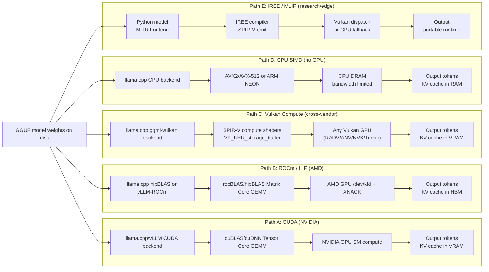

# Chapter 124: Local LLM Inference on Linux GPUs

**Target audiences**: Systems developers and GPU driver engineers who need to understand how inference runtimes talk to the kernel and hardware; ML engineers deploying large language models locally on Linux without cloud dependencies.

---

## Table of Contents

1. [Introduction](#1-introduction)
   - [1.1 What is LLM Inference?](#11-what-is-llm-inference)
   - [1.2 What is GGUF and GGML?](#12-what-is-gguf-and-ggml)
   - [1.3 What is Quantization for LLM Inference?](#13-what-is-quantization-for-llm-inference)
2. [GGML Architecture and the Vulkan Backend](#2-ggml-architecture-and-the-vulkan-backend)
3. [llama.cpp Vulkan Path in Depth](#3-llamacpp-vulkan-path-in-depth)
4. [Memory-Mapped Weights and DMA-BUF](#4-memory-mapped-weights-and-dma-buf)
5. [Ollama: GPU Dispatch and Model Management](#5-ollama-gpu-dispatch-and-model-management)
6. [ONNX Runtime with GPU Execution Providers](#6-onnx-runtime-with-gpu-execution-providers)
7. [ONNX Runtime OpenVINO EP](#7-onnx-runtime-openvino-ep)
8. [ROCm MIOpen and HIP for LLM Inference](#8-rocm-miopen-and-hip-for-llm-inference)
9. [KV Cache Management Strategies](#9-kv-cache-management-strategies)
10. [Performance Tuning and Benchmarking](#10-performance-tuning-and-benchmarking)
11. [Integrations](#11-integrations)

---

## 1. Introduction

By mid-2026, local LLM inference on Linux has evolved from a hobbyist curiosity into a production-grade concern. A **Llama-3-70B** model quantised to **Q4\_K\_M** fits in 40 GB of VRAM on a single AMD **RX 7900 XTX** or a pair of **NVIDIA RTX 4090**s. **Mixtral-8×7B** runs at interactive speed on a single high-end consumer card. Smaller 7B and 8B models run at 80–150 tokens/second on almost any recent discrete GPU. The diversity of Linux GPU hardware has never been greater: NVIDIA's **CUDA** stack, AMD **ROCm** on **RDNA3**/4 and **CDNA**, Intel **Arc** (**Xe-HPG**) with **Level Zero** and **OpenVINO**, Qualcomm **Adreno** via **Vulkan** compute, and Apple Silicon accessed through **Asahi Mesa** or Metal.

Three advantages motivate running inference locally rather than via a cloud API:

- **Privacy**: prompt tokens never leave the machine. Medical, legal, and enterprise use cases often require this.
- **Latency**: round-trip to a remote inference endpoint adds 50–200 ms of network overhead before the first token; local VRAM latency is sub-millisecond.
- **Cost at scale**: marginal cost of a generated token on owned hardware approaches the electricity cost per watt, typically orders of magnitude cheaper than API pricing at high token volumes.

This chapter examines the full software path from a **GGUF** file on disk to generated tokens on screen.

- **Section 2 — GGML Architecture and Vulkan Backend**: the **GGML** tensor engine including its **ggml_cgraph** DAG executor, the **ggml_tensor** and **ggml_backend_i** abstraction layer, quantisation types ranging from **GGML_TYPE_F16** and **GGML_TYPE_BF16** through K-quant block formats (**Q4_K_M**, **Q6_K**) and I-quant formats (**IQ4_XS**), and the **Vulkan** backend in **ggml-vulkan.cpp** — including the **vk_device_struct** device abstraction, the **SPIR-V** compute shader pipeline compiled via **glslc**, **vk_matmul_pipeline_struct** variants, push-constant dispatch, and **VK_KHR_cooperative_matrix** support.
- **Section 3 — llama.cpp Vulkan Path**: startup initialisation via **vkEnumeratePhysicalDevices** and **vkCreateDevice** (with the **GGML_VK_VISIBLE_DEVICES** override), KV cache allocation with **grouped-query attention** (**GQA**) accounting, the **build_llama** compute graph including fused **RoPE** via **ggml_rope_custom** and **Flash Attention** via **ggml_flash_attn_ext** with **coopMatMulAdd** on cooperative-matrix hardware, multi-GPU layer splitting with **--n-gpu-layers**, **--split-mode row**, and **--tensor-split**, and representative **llama-bench** throughput numbers across **CUDA**, **ROCm**, and **Vulkan** backends.
- **Section 4 — Memory-Mapped Weights and DMA-BUF**: the **GGUF** binary container format (header, KV metadata, tensor info, and 32-byte-aligned tensor data sections), memory-mapped loading via **mmap(2)** with **MAP_SHARED** and **madvise** prefetch hints, host-to-GPU weight transfer through **vkCmdCopyBuffer** and **VK_ACCESS_TRANSFER_WRITE_BIT** pipeline barriers, handling models larger than VRAM via split mode and **MADV_WILLNEED** prefetch, and zero-copy loading on systems with **Resizable BAR** (**AMD SAM**) using the **VK_MEMORY_PROPERTY_DEVICE_LOCAL_BIT | VK_MEMORY_PROPERTY_HOST_VISIBLE_BIT** memory type.
- **Section 5 — Ollama**: its Go **ollama serve** HTTP server and **ollama_llama_server** runner subprocess, GPU detection via **NVML** (**libnvidia-ml.so**), **KFD** sysfs parsing for AMD, and **Level Zero** / **OpenCL** queries for Intel, environment overrides (**CUDA_VISIBLE_DEVICES**, **ROCR_VISIBLE_DEVICES**, **OLLAMA_GPU_OVERHEAD**), the content-addressed model library under **~/.ollama/models/**, the **REST API** endpoints (**/api/generate**, **/api/chat**, **/api/embeddings**), and parallel request handling via **OLLAMA_NUM_PARALLEL** and llama.cpp's batched-decode path.
- **Section 6 — ONNX Runtime with GPU Execution Providers**: **ONNX Runtime** (**ORT**) and its **Execution Provider** (**EP**) plugin architecture, the **CUDA EP** using **cuDNN** and **cuBLAS** configured via **OrtCUDAProviderOptionsV2** (including **CUDA Graph** capture to eliminate per-iteration kernel launch overhead, **TF32** on Ampere+, and **TransformerOptimizer** graph fusions such as **SkipLayerNorm** and **FusedMatMul**), and ORT's quantisation tooling for **INT8** via **quantize_dynamic** and **FP16** conversion.
- **Section 7 — ONNX Runtime OpenVINO EP**: the **OpenVINO** Intermediate Representation (**IR**) format, **OrtOpenVINOProviderOptions** and its V2 key-value configuration, the **Level Zero** backend routing **Intel Arc** compute through the **Intel Graphics Compiler** (**IGC**), and heterogeneous execution via **HETERO:NPU,GPU,CPU** across Intel **NPU**, **iGPU**, and CPU.
- **Section 8 — ROCm MIOpen and HIP**: the **HIP** programming model and runtime (**hipMalloc**, **hipMemcpy**, **hipLaunchKernelGGL**), GEMM via **rocBLAS** (**rocblas_gemm_ex**) and **hipBLASLt** with **TunableOp** auto-selection, unified memory via **hipMallocManaged** and **HMM** on AMD APUs such as **Strix Halo** (**Ryzen AI Max+ 395**), the **PyTorch** CUDA-compatibility shim that allows ROCm-unmodified inference, **vLLM** device isolation via **ROCR_VISIBLE_DEVICES** and **AITER** (**AI Tensor Engine for ROCm**) attention kernels (**VLLM_ROCM_USE_AITER**), and **MIOpen** auto-tuning via **MIOPEN_USER_DB_PATH** and **MIOPEN_FIND_MODE**.
- **Section 9 — KV Cache Management**: the quadratic VRAM scaling problem, **PagedAttention** in **vLLM** with fixed-size physical blocks and the **BlockManager** free-block pool achieving under 4% fragmentation, Automatic Prefix Caching (**APC**) using Merkle-chain block hashes (**xxhash**, **sha256**) with LRU eviction, llama.cpp's ring-buffer KV cache and **Sliding Window Attention** (**SWA**) for **Llama-3.1** models plus coarse CPU swap via **ggml_backend_cpu_buffer_type**, and vLLM's preemption strategies (swap via **cudaMemcpyAsync** / **hipMemcpy** and recompute) managed by the hybrid KV cache manager.
- **Section 10 — Performance Tuning**: measuring prompt-processing (**pp**) and token-generation (**tg**) throughput with **llama-bench**, quantisation impact on model size, generation speed, and perplexity across **F16**, **Q8_0**, **Q4_K_M**, **Q3_K_M**, and **Q2_K** formats, GPU utilisation monitoring with **nvtop**, **nvidia-smi dmon**, **radeontop**, **rocm-smi**, and **intel_gpu_top**, power and thermal considerations including **TJmax** throttling and **nvidia-smi -pl** / **rocm-smi --setpoweroverdrive** power capping, and roofline arithmetic-intensity analysis that explains why token generation at batch=1 is deeply memory-bandwidth-bound.

### 1.1 What is LLM Inference?

Large language model (LLM) inference is the process of executing a pre-trained transformer-based neural network to generate text token-by-token from a given prompt. Unlike training — which adjusts the model's billions of weight parameters over large datasets using backpropagation and gradient descent — inference uses the trained weights in a forward-only pass, computing attention over a key-value (KV) cache that grows with sequence length. The core computational primitive is dense matrix multiplication: for every generated token, the runtime multiplies the current hidden-state vector (dimension D, typically 4096–8192 for 7B–70B models) by each layer's query, key, value, and MLP projection weight matrices. On a GPU, those matrix–vector products map to GEMM (General Matrix Multiply) operations scheduled on the GPU's compute units via a kernel driver. On Linux, the kernel exposes GPU compute through the DRM subsystem: NVIDIA uses its proprietary kernel module paired with the CUDA user-space stack; AMD uses the `amdgpu` DRM driver with the ROCm stack and the Kernel Fusion Driver device node at `/dev/kfd`; Intel Arc GPUs use the `i915` or `xe` DRM driver with Level Zero. The inference runtime — llama.cpp, vLLM, Ollama, or ONNX Runtime — sits between the model weights on disk and those kernel interfaces, translating the transformer graph into backend-specific GEMM calls and memory management commands. Memory bandwidth, not arithmetic throughput, is the dominant performance constraint at batch size 1: every generated token requires reading the full weight tensor from GPU memory, making VRAM bandwidth the ceiling on tokens-per-second.

### 1.2 What is GGUF and GGML?

GGML (Georgi Gerganov Machine Learning) is a C tensor library whose primary design goal is efficient quantised inference with optional GPU offload. It defines a tensor type (`ggml_tensor`), a directed acyclic graph executor (`ggml_cgraph`), and a pluggable backend abstraction (`ggml_backend_i`) that lets the same compute graph dispatch to CPU SIMD, CUDA, ROCm, Vulkan, or SYCL backends without changing the calling code. Each backend registers capability queries (`supports_op`), buffer allocation routines, and a `graph_compute` entry point; the scheduler assigns tensor operations to the highest-priority backend that reports support for that operation type. GGUF (GGML Unified Format) is the binary container format that stores quantised model weights on disk. A GGUF file opens with a magic number and version header, followed by a key-value metadata section describing model architecture and tokeniser configuration, a tensor index listing each tensor's name and byte offset into the data region, and then the raw tensor data aligned to 32-byte boundaries. The data section is designed for `mmap(2)` with `MAP_SHARED`: the OS page cache becomes the backing store, and the kernel loads weight pages on demand as GPU transfer commands reference them, avoiding an explicit read-into-RAM stage. This also enables operating on models larger than physical VRAM by splitting layers across GPU and CPU memory. GGUF replaced the earlier GGML binary format in 2023 and is now the standard interchange format for quantised open-weight models distributed through model repositories and llama.cpp-compatible tools.

### 1.3 What is Quantization for LLM Inference?

Quantization in the context of LLM inference means representing weight tensors using fewer bits than the 32-bit (FP32) or 16-bit (FP16/BF16) floating-point formats used during training. The motivation is memory bandwidth: a Llama-3-70B model stored in FP16 requires approximately 140 GB to be read from GPU memory for each generated token, far exceeding the VRAM of any consumer GPU. Reducing weights to 4 bits per parameter shrinks that figure to roughly 35 GB, fitting on a single high-end GPU and reducing per-token bandwidth demand proportionally. Quantization introduces error by mapping a range of floating-point values onto a small number of discrete integer codes, but for transformer weight matrices this error is well-tolerated because individual weights rarely dominate a computation. GGML implements three families of quantisation. The legacy integer block formats (`Q4_0`, `Q4_1`, `Q8_0`) quantise fixed 32-element blocks with a per-block floating-point scale stored alongside the integer codes. The K-quant block formats (`Q2_K`, `Q3_K_S/M/L`, `Q4_K_S/M`, `Q5_K_S/M`, `Q6_K`) use 256-element super-blocks with learned scale and minimum values, achieving better perplexity at equivalent bit-width because the larger context captures the weight distribution more accurately. The I-quant formats (`IQ4_XS`, `IQ2_XXS`) use an importance matrix derived from calibration data to allocate bits non-uniformly, concentrating precision where weights most affect output quality. GPU backends decode quantised blocks back to FP16 or BF16 in-shader — in SPIR-V compute kernels for the Vulkan path, or in CUDA/HIP kernels for the NVIDIA and AMD paths — immediately before feeding values into the GEMM pipeline.

---

## 2. GGML Architecture and the Vulkan Backend

Linux offers multiple GPU compute backends for LLM inference, each with different hardware requirements, quantisation support, and framework ecosystems. Understanding these trade-offs up front helps engineers choose the right backend before diving into implementation details. The table below summarises the major options as of mid-2026, followed by an in-depth look at GGML's own architecture and its Vulkan backend.

| **Backend** | **Hardware** | **API / driver** | **Quantisation support** | **Batching / continuous batching** | **Memory efficiency** | **Framework examples** | **When to use** |
|---|---|---|---|---|---|---|---|
| CUDA 12 | NVIDIA RTX/Tesla/H100 | proprietary nvidia driver or nvidia-open | GGUF Q4/Q8, GPTQ, AWQ, FP8 (Hopper) | Full (vLLM, TGI) | Excellent (unified virtual addressing, NVLink P2P) | llama.cpp (CUDA), vLLM, TGI, Ollama | NVIDIA GPU; maximum performance; broadest framework support |
| ROCm / HIP 6 | AMD RDNA 2+, CDNA (MI-series) | AMDGPU + KFD | GGUF Q4/Q8, GPTQ (via AutoGPTQ-ROCm) | Full (vLLM-ROCm, TGI-ROCm) | Good (xGMI on MI-series) | llama.cpp (hipBLAS), vLLM-ROCm, Ollama | AMD GPU; comparable to CUDA on supported hardware |
| Vulkan Compute (GGML) | Any Vulkan 1.3 GPU (NVIDIA, AMD, Intel, ARM) | Mesa Vulkan or nvidia-open or Intel ANV | GGUF Q4_0, Q4_1, Q5_K, Q8_0 (growing) | Limited (single inference; no KV cache batching) | Good (explicit allocation) | llama.cpp (--n-gpu-layers), koboldcpp | Cross-vendor; Intel Arc; AMD on ROCm-unsupported hardware |
| OpenCL | AMD (ROCm OpenCL), Intel (NEO), NVIDIA (legacy) | ICD loader + vendor runtime | GGUF via clblast (limited) | Very limited | Moderate | llama.cpp (clblast; deprecated in favour of Vulkan) | Legacy; older AMD GPUs before ROCm support |
| CPU (SIMD / AVX-512) | Any x86-64 with AVX2/AVX-512; ARM NEON/SVE | No GPU driver needed | GGUF Q4/Q8 (excellent; GGML designed for CPU Q) | Supported | Limited by RAM bandwidth | llama.cpp (CPU), Ollama CPU | No GPU available; quantised 7B–13B models on capable CPUs; power-constrained |

### LLM Inference Pipeline Paths

The backend choice determines the entire data-flow path from model weights to output tokens. Each path has different memory bandwidth characteristics and GPU driver requirements — choices made at backend selection time ripple through every layer from kernel driver to token throughput.



The critical bottleneck in all paths is memory bandwidth, not compute. A 70B model at Q4_0 quantisation requires approximately 35 GB of weight reads per output token, making memory bandwidth the dominant performance constraint at batch=1. This explains why Paths A and B are dramatically faster than Path D: HBM3 on an AMD MI300X delivers over 5 TB/s of bandwidth, GDDR7 on an NVIDIA RTX 5090 provides over 3 TB/s, while CPU DDR5 is limited to 50–100 GB/s — a 30–100× deficit that translates directly into token throughput. Path C (Vulkan compute) achieves approximately 60–80% of the throughput of Paths A and B on equivalent hardware, due to Vulkan dispatch overhead and the absence of hand-tuned vendor kernels like cuBLAS's Tensor Core GEMM implementations. However, Path C's cross-vendor compatibility makes it the only GPU-accelerated option on hardware excluded from CUDA or ROCm support, including Intel Arc GPUs, older AMD GPUs predating ROCm compatibility, and any device with a conformant Vulkan 1.2 driver. Path E (IREE/MLIR) is primarily a research and edge-deployment path; its portable SPIR-V emission trades peak throughput for compiler portability and reproducible deployment artifacts.

### 2.1 The GGML Tensor Engine

GGML is a C library that provides a tensor type system and a DAG-based compute graph executor. Every inference operation — matrix–vector multiply, RoPE, softmax, layer normalisation — is expressed as a node in a `ggml_cgraph`. Nodes hold `ggml_tensor` structs that record shape (up to four dimensions), data type, a pointer to backing storage, and a `backend_buffer` reference that describes where the data lives. [Source](https://github.com/ggml-org/llama.cpp)

Data types include:
- Floating-point formats: `GGML_TYPE_F32`, `GGML_TYPE_F16`, `GGML_TYPE_BF16`
- Integer quantisation types: `GGML_TYPE_Q4_0`, `GGML_TYPE_Q4_1`, `GGML_TYPE_Q8_0`
- K-quant block formats: `GGML_TYPE_Q2_K`, `GGML_TYPE_Q3_K_S/M/L`, `GGML_TYPE_Q4_K_S/M`, `GGML_TYPE_Q5_K_S/M`, `GGML_TYPE_Q6_K`
- I-quant formats (importance-matrix-guided): `GGML_TYPE_IQ2_XXS`, `GGML_TYPE_IQ4_XS`, etc.

K-quant types are block-quantised: a `Q4_K_M` tensor stores weights in 256-element super-blocks, each containing two `Q4_0` sub-blocks of 32 elements sharing a per-block scale and minimum value. This yields approximately 4.5 bits/weight while preserving more of the weight distribution than plain `Q4_0`.

The backend abstraction (`ggml_backend_i`) decouples tensor storage from the executor. Each backend registers:
- `get_name` — returns `"Vulkan"`, `"CUDA"`, `"ROCm"`, `"CPU"`, etc.
- `free` — releases device resources
- `buffer_type` — returns a `ggml_backend_buffer_type_t` that knows how to allocate and zero tensors on this device
- `graph_plan_compute` / `graph_compute` — executes a previously built plan
- `supports_op` — returns whether this backend can natively handle a given op

Backends are discovered and registered at startup via `ggml_backend_load_all`, which walks a list of compiled-in backends in priority order (CUDA > ROCm > Vulkan > SYCL > CPU). The first backend that reports a usable device wins tensor assignment for GPU layers. [Source](https://deepwiki.com/ggml-org/llama.cpp)

### 2.2 The Vulkan Backend Architecture

The Vulkan backend (`ggml-vulkan.cpp` in the GGML source tree) enables inference on any Vulkan 1.2-capable GPU: NVIDIA, AMD, Intel Arc, Qualcomm Adreno, ARM Mali, and IMG GPUs on Linux. [Source](https://deepwiki.com/ggml-org/llama.cpp/5.3-vulkan-backend-(cross-platform))

#### Core Device Abstraction

The central structure is `vk_device_struct` (typedef `vk_device`):

```cpp
// Simplified from ggml-vulkan.cpp
struct vk_device_struct {
    vk::PhysicalDevice physical_device;
    vk::Device         device;
    vk::Queue          compute_queue;
    vk::Queue          transfer_queue;

    uint32_t  subgroup_size;     // wavefront/warp size
    uint32_t  vendor_id;         // PCI vendor: 0x10DE NVIDIA, 0x1002 AMD, 0x8086 Intel
    bool      fp16_support;
    bool      bf16_support;
    bool      coopmat_support;   // VK_KHR_cooperative_matrix
    bool      coopmat2_support;  // newer coopmat variant

    std::unordered_map<std::string, vk_pipeline> pipeline_cache;
    vk::PipelineCache vk_pipeline_cache;
    // ... pinned host memory pool, descriptor pool, command pools
};
```

The backend wraps a `vk_device` into a `ggml_vk_context`:

```cpp
struct ggml_vk_context {
    vk_device device;
    // per-context state: in-flight command buffers, semaphores
    std::vector<vk_context_struct> contexts;
    vk::Fence fence;
};
```

#### Pipeline and Shader System

Each compute shader is compiled from GLSL source (`.comp` files under `ggml/src/ggml-vulkan-shaders/`) to SPIR-V at build time by the `vulkan-shaders-gen` tool using `glslc` from the Vulkan SDK. The compiled SPIR-V blobs are embedded as C arrays in the generated header `ggml-vulkan-shaders.hpp` and loaded at library initialisation via `vkCreateShaderModule`. No runtime shader compilation is required; the backend simply calls `vkCreateComputePipeline` once per pipeline variant on first use.

Pipeline variants are registered in a `vk_matmul_pipeline_struct`:

```cpp
struct vk_matmul_pipeline_struct {
    vk_pipeline l;   // "large": for M >= 32 (batch decode or prompt)
    vk_pipeline m;   // "medium": M 8–31
    vk_pipeline s;   // "small": M 1–7 (single-token generation)
    vk_pipeline a;   // aligned variant requiring 4-byte-aligned strides
};
```

More than 200 pipeline variants exist across quantisation types, precision combinations (FP16 accumulators vs FP32), and hardware capability tiers (with/without cooperative matrix extensions). The selection logic in `ggml_vk_get_pipeline` uses the tensor's data type, the batch dimension, and device capability flags to choose the fastest variant at runtime.

#### Push Constants and Matrix–Vector Multiply

Shape parameters are passed as Vulkan push constants rather than descriptor-set bindings to minimise CPU overhead per dispatch. For the core GEMM shader:

```glsl
// From mul_mm.comp (simplified)
layout(push_constant) uniform PushConstants {
    uint M;       // rows of A / rows of output
    uint N;       // rows of B (columns of output)
    uint K;       // shared dimension (model hidden size)
    uint stride_a;
    uint stride_b;
    uint stride_d;
    float scale;
} pcs;
```

Each workgroup loads a tile of A and a tile of B into shared memory (`shared float As[BM][BK]; shared float Bs[BK][BN];`), performs the tile multiply using a standard blocked GEMM loop, and accumulates into registers. On devices with `VK_KHR_cooperative_matrix`, the shader uses `coopMatMulAdd` to exploit tensor core hardware.

#### Memory Buffer Types

Three buffer allocation strategies serve different GPU configurations:

| Buffer type | `vk::MemoryPropertyFlags` | Use case |
|---|---|---|
| Device-local | `eDeviceLocal` | Discrete GPU VRAM (weights, KV cache, activations) |
| Host-visible device-local | `eDeviceLocal \| eHostVisible \| eHostCoherent` | Resizable BAR / SAM-enabled systems (zero-copy staging) |
| Host pinned | `eHostVisible \| eHostCoherent \| eHostCached` | Staging buffers for discrete GPU weight upload |

On discrete GPUs without Resizable BAR, weights travel through a pinned staging buffer: `vkCmdCopyBuffer` submits the transfer on the `transfer_queue`, with a `vkQueueWaitIdle` (or timeline semaphore) before the compute queue reads the tensor. On systems with ReBAR enabled, the device-local buffer is simultaneously host-visible, and `memcpy` directly fills GPU VRAM without staging [Source](https://github.com/ggml-org/llama.cpp/issues/21590).

---

## 3. llama.cpp Vulkan Path in Depth

### 3.1 Initialisation

```cpp
// High-level call sequence at startup
llama_backend_init();          // registers all ggml backends via ggml_backend_load_all()
llama_model *model = llama_load_model_from_file("model.gguf", params);
llama_context *ctx  = llama_new_context_with_model(model, ctx_params);
```

`llama_backend_init` triggers `ggml_backend_vk_init(device_index)` for each discovered Vulkan physical device. The Vulkan backend enumerates physical devices via `vkEnumeratePhysicalDevices`, filters out devices without the required compute queue family and without Vulkan 1.2 support, then calls `vkCreateDevice` to create a logical device. Vendor-specific heuristics adjust the device selection:

- AMD GPUs are preferred over Intel integrated graphics when both are present.
- A device with `VK_KHR_cooperative_matrix` (tensor cores) is preferred over one without.
- The user can force a device index via `GGML_VK_VISIBLE_DEVICES`.

### 3.2 KV Cache and Buffer Allocation

The KV cache is allocated on the GPU backend chosen for layer 0 by default, via `ggml_backend_vk_buffer_type`. For a Llama-3-8B model at context length 8192, the K and V tensors across 32 layers at F16 precision occupy:

```
32 layers × 2 (K+V) × 8192 tokens × 8 heads × 128 head_dim × 2 bytes = ~4 GB
```

With grouped-query attention (GQA) as used in Llama-3-8B (8 KV heads vs 32 Q heads), this shrinks to:

```
32 × 2 × 8192 × 8 × 128 × 2 = ~512 MB
```

The KV cache is backed by a `vk::Buffer` allocated with `eDeviceLocal` flags. The `llama_kv_cache` struct tracks `cache_k_l%d` and `cache_v_l%d` tensors per layer, stored as contiguous slabs in VRAM. A `cell_data` array on the CPU tracks which context slots are occupied, and `find_slot()` assigns positions to incoming tokens.

### 3.3 Compute Graph: `build_llama`

For each decode step, `llama_build_graph` calls the architecture-specific graph builder. For LLaMA-family models this is `build_llama`:

```
Input token IDs → ggml_get_rows(embedding table) → residual stream
  for each transformer layer:
    ggml_norm → Q/K/V projection (ggml_mul_mat) → Q: ggml_rope, K: ggml_rope
    K/V → write into KV cache slab (ggml_cpy)
    Attention: ggml_flash_attn_ext (if Flash Attention) or manual QK^T → softmax → V
    FFN: gate·up projections → SiLU activation (ggml_silu) → down projection
    Residual add
  Final norm → logits projection
```

The entire graph is a pure DAG of `ggml_tensor` nodes. No loops or conditionals appear at the GGML level; branching is handled by building different graphs for prefill (full prompt processing) versus decode (single-token generation).

**RoPE** is applied as a fused kernel: `ggml_rope_custom` takes the Q or K tensor and computes `q_rotated[i] = q[i]*cos(θ) - q[i+1]*sin(θ)` for each head dimension pair, where `θ = pos / base^(2i/d)`. The Vulkan shader does this in-place over a workgroup of threads mapped to the batch×head×dim axes.

**Flash Attention** in GGML's Vulkan backend is implemented in `flash_attn.comp` and its cooperative-matrix variants. The shader computes the attention output in tiles, accumulating in FP32 with online softmax normalisation (the Dao–Milovanovic algorithm). This avoids materialising the full `N×N` attention matrix in global memory, saving VRAM especially at long contexts. On cooperative-matrix hardware, `flash_attn_cm1.comp` and `flash_attn_cm2.comp` use `coopMatMulAdd` for the QK^T and (softmax weights × V) multiplies. [Source](https://deepwiki.com/ggml-org/llama.cpp/5.3-vulkan-backend-(cross-platform))

### 3.4 Multi-GPU Layer Split

The `--n-gpu-layers N` flag (short: `-ngl N`) tells llama.cpp to assign the bottom N transformer layers to the GPU backend (Vulkan or CUDA), leaving the remainder on CPU. When N equals the total layer count, the full model including the embedding table and final norm runs on GPU.

For models that exceed a single GPU's VRAM, `--split-mode row` distributes rows of the weight matrices across up to four GPUs via the RPC backend or direct multi-device scheduling. Each GPU receives a contiguous slab of weight rows; partial results are summed across devices with an `ggml_all_reduce`-style reduction. The `--tensor-split` argument accepts a comma-separated ratio list (e.g., `--tensor-split 0.6,0.4`) to bias the split toward a larger-VRAM device. [Source](https://github.com/ggml-org/llama.cpp/discussions/7678)

### 3.5 Representative Benchmarks

The following figures are from community benchmarks using `llama-bench` on Llama-3-8B with Q4\_0 quantisation (pp512 = prompt processing at batch 512, tg128 = token generation at batch 1). Q4\_K\_M generation speed is comparable; prompt processing is typically 5–15% slower due to dequantisation overhead. [Source](https://knightli.com/en/2026/04/23/llama-cpp-gpu-benchmark-cuda-rocm-vulkan-scoreboard/)

| Hardware | Backend | pp512 (t/s) | tg128 (t/s) |
|---|---|---|---|
| NVIDIA RTX 4090 24 GB | CUDA | ~11,993 | ~186 |
| AMD RX 7900 XTX 24 GB | ROCm | ~3,552 | ~167 |
| Intel Arc A770 16 GB | Vulkan | ~1,074 | ~53 |

Note: prompt processing speed scales roughly with compute (tensor core TFLOPS); generation speed scales with memory bandwidth. The RTX 4090's 1 TB/s bandwidth advantage drives its generation edge over the RX 7900 XTX (960 GB/s). These numbers represent single-stream inference; multi-user batching changes the picture significantly. Note: verify against your specific build tag and driver version.

---

## 4. Memory-Mapped Weights and DMA-BUF

### 4.1 GGUF File Format

The GGUF (GGML Universal File Format) binary container packs model weights, tokeniser vocabulary, and hyperparameters into a single self-describing file. Its structure: [Source](https://deepwiki.com/ggml-org/llama.cpp/7.1-gguf-file-format)

```
┌─────────────────────────────────────────────┐
│ Header (fixed, 16 bytes minimum)            │
│   magic:          0x46554747  ("GGUF")      │
│   version:        uint32   (currently 3)    │
│   n_tensors:      uint64                    │
│   n_kv:           uint64                    │
├─────────────────────────────────────────────┤
│ KV Metadata Section (variable length)       │
│   key-value pairs: tokenizer.model,         │
│   llama.context_length, llama.block_count,  │
│   llama.attention.head_count, etc.          │
├─────────────────────────────────────────────┤
│ Tensor Info Section                         │
│   per tensor: name, n_dims, dims[], type,   │
│               offset (from data start)      │
├─────────────────────────────────────────────┤
│ Padding to GGUF_DEFAULT_ALIGNMENT = 32 bytes│
├─────────────────────────────────────────────┤
│ Tensor Data Section                         │
│   raw weight bytes, each tensor at its      │
│   declared offset, aligned to 32 bytes      │
└─────────────────────────────────────────────┘
```

The 32-byte alignment guarantee means that the tensor data section can be `mmap`-ped directly into process address space and individual tensor pointers handed to Vulkan or CUDA without any byte-copying for host-side CPU inference.

### 4.2 Memory-Mapped Loading

llama.cpp opens the GGUF file and calls `mmap(2)` with `MAP_SHARED | MAP_POPULATE` when `--mmap` is enabled (the default). This maps the entire file into the process address space. The kernel's page cache backs the mapping: the physical pages remain on disk until accessed, and the OS transparently faults them in on first read.

```c
// Simplified from llama.cpp src/llama-mmap.hpp
void * mmap_file(int fd, size_t file_size) {
    void *addr = mmap(nullptr, file_size,
                      PROT_READ, MAP_SHARED, fd, 0);
    if (addr == MAP_FAILED) {
        throw std::runtime_error("mmap failed");
    }
    madvise(addr, file_size, MADV_SEQUENTIAL);  // hint for prefetcher
    return addr;
}
```

During the **first inference pass**, each weight tensor not yet in VRAM triggers a page fault as the CPU accesses the mmap region. The kernel reads pages from disk (or SSD) into the page cache. This produces the characteristic "slow first run, fast subsequent runs" behaviour: models smaller than available RAM are fully cached in the page cache after the first load and subsequent llama.cpp invocations (even in a new process) skip disk I/O entirely.

### 4.3 Host-to-GPU Transfer

For GPU-offloaded layers, the weight tensors must move from host memory (page cache) to GPU VRAM. The transfer path in the Vulkan backend:

1. `ggml_backend_vk_buffer_from_ptr(ctx, ptr, size)` — wraps a host pointer in a `VkBuffer` backed by `VK_MEMORY_PROPERTY_HOST_VISIBLE_BIT` staging memory. On discrete GPUs, this is a separate allocation in host-visible DRAM (typically BAR space or system RAM pinned by the driver).
2. `vkCmdCopyBuffer(cmd, staging_buf, device_buf, 1, &region)` — enqueues a DMA transfer from the staging buffer to device-local VRAM.
3. A pipeline barrier with `VK_ACCESS_TRANSFER_WRITE_BIT → VK_ACCESS_SHADER_READ_BIT` ensures compute shaders see the updated data.

The transfer is not lazy: `llama_new_context_with_model` uploads all GPU-assigned layers up front, before any inference request. The mmap pages are then released (or kept in the page cache) but no longer needed for compute; the authoritative copy lives in VRAM.

```cpp
// Pseudocode: uploading one layer's weight tensor to Vulkan VRAM
vk::Buffer staging = create_host_visible_buffer(device, tensor->nbytes());
void *mapped = device.mapMemory(staging_mem, 0, VK_WHOLE_SIZE);
memcpy(mapped, tensor->data, tensor->nbytes());   // page fault happens here
device.unmapMemory(staging_mem);

vk::CommandBuffer cmd = begin_one_shot_cmd(device, transfer_pool);
vk::BufferCopy region{0, 0, tensor->nbytes()};
cmd.copyBuffer(staging, vram_buf, region);
end_and_submit_cmd(cmd, transfer_queue);
device.waitIdle();  // synchronous for initialisation
```

### 4.4 Models Larger than VRAM: Split Mode and Lazy Layers

When the model does not fit in VRAM, `--split-mode row` or `-sm none` (CPU offload) assigns some layers to the CPU backend. CPU layers use the mmap pointer directly — no VRAM transfer — so their page-fault cost is deferred until those layers execute during inference. This produces per-token latency spikes proportional to the number of CPU layers accessing cold pages; `madvise(MADV_WILLNEED)` on the tensor data range during model load mitigates this by prefetching ahead of time.

### 4.5 Resizable BAR and Zero-Copy

On modern systems with Resizable BAR (AMD SAM, Intel RST) enabled in UEFI, the CPU can address the full GPU VRAM aperture over PCIe. The Vulkan memory type `VK_MEMORY_PROPERTY_DEVICE_LOCAL_BIT | VK_MEMORY_PROPERTY_HOST_VISIBLE_BIT` becomes available. When detected, the GGML Vulkan backend allocates weight buffers in this type and maps them persistently. `memcpy` from the mmap region directly fills VRAM, eliminating the staging buffer and halving the memory bandwidth consumed during model loading. [Source](https://github.com/ggml-org/llama.cpp/issues/21590)

Resizable BAR availability can be confirmed via `drm_device` sysfs:

```bash
cat /sys/bus/pci/devices/0000:09:00.0/resource | awk 'NR==2{size=$2-$1; printf "BAR1: %d MB\n", size/1024/1024}'
# With ReBAR: BAR1: 24576 MB (full VRAM)
# Without:    BAR1: 256 MB  (legacy 256 MB aperture)
```

---

## 5. Ollama: GPU Dispatch and Model Management

### 5.1 Architecture Overview

Ollama is a Go service that wraps llama.cpp (and, since v0.30, builds on llama.cpp directly without a separate GGML layer). The service exposes a REST API and manages model download, storage, lifecycle, and GPU dispatch. Its architecture comprises: [Source](https://github.com/ollama/ollama)

- **`ollama serve`**: The main Go HTTP server. Listens on `127.0.0.1:11434` by default.
- **Runner subprocess**: For each loaded model, a separate process (`ollama_llama_server`) runs the llama.cpp inference loop. Communication between server and runner uses JSON-RPC over stdin/stdout or a local TCP port.
- **GPU detection layer** (`gpu/gpu.go`, `gpu/amd_linux.go`, `gpu/nvidia_linux.go`): Probes hardware at startup.

### 5.2 GPU Detection

Ollama's GPU detection follows a layered probe strategy:

**NVIDIA**: Dynamically loads `libnvidia-ml.so` (NVML) at runtime to avoid a hard dependency. Calls `nvmlInit()`, `nvmlDeviceGetCount()`, and `nvmlDeviceGetMemoryInfo()` to enumerate GPUs and read free/total VRAM. Falls back to `cudaMemGetInfo()` if NVML is unavailable. For Jetson/Tegra unified memory devices, reads `/proc/meminfo` to determine available system RAM. Device UUIDs from `nvmlDeviceGetUUID()` allow stable identification across reboots.

**AMD**: Parses `/sys/class/kfd/kfd/topology/nodes/*/properties` to enumerate KFD (Kernel Fusion Driver) GPU nodes. Maps each KFD node to a DRM render node via `/sys/class/drm/card*/device/` symlinks for memory reporting. Validates ROCm library compatibility by checking for TensileLibrary files in the ROCm installation. [Source](https://deepwiki.com/13rac1/ollama/5.3-gpu-discovery-and-hardware-acceleration)

**Intel**: Queries OpenCL or Level Zero for Intel GPU devices; falls back to sysfs `i915` entries when OpenCL is absent.

**Vulkan fallback**: When neither CUDA nor ROCm is detected, Ollama can enumerate Vulkan devices and route inference to the Vulkan backend.

Environment overrides:
```bash
CUDA_VISIBLE_DEVICES=0,1         # limit to first two NVIDIA GPUs
ROCR_VISIBLE_DEVICES=0           # limit to first AMD GPU
OLLAMA_GPU_OVERHEAD=1073741824   # reserve 1 GB safety margin
OLLAMA_NUM_GPU=1                 # force single GPU even if multiple detected
```

Supported backend identifiers as of Ollama 0.30+ include `cuda_v12`, `cuda_v13`, `rocm_v7_1`, `rocm_v7_2`, `vulkan`, `cuda_jetpack5`, and `cuda_jetpack6`.

### 5.3 Model Library and Layer Caching

Downloaded models live in `~/.ollama/models/blobs/` as GGUF files (or OCI-layer-style content-addressed blobs). Manifests in `~/.ollama/models/manifests/registry.ollama.ai/library/` record the layer digests, media types, and sizes. Ollama's layer-addressed storage means that two models sharing a base checkpoint (e.g., `llama3:8b` and `llama3:8b-instruct`) share the base weight blobs on disk and in page cache.

### 5.4 REST API

The primary endpoints:

```
POST /api/generate
  Body: {"model": "llama3:8b", "prompt": "Hello", "stream": true}
  Response: newline-delimited JSON, one token per line

POST /api/chat
  Body: {"model": "llama3:8b", "messages": [{"role": "user", "content": "Hello"}]}

POST /api/embeddings
  Body: {"model": "nomic-embed-text", "prompt": "text to embed"}

GET  /api/ps         # list running models
POST /api/pull       # download a model
DELETE /api/delete   # remove a model
```

Ollama maintains a model LRU cache: models stay loaded in VRAM for `OLLAMA_KEEP_ALIVE` seconds (default 5 minutes) after the last request. Parallel requests to the same model reuse the loaded runner; requests to a second model either evict the first (if VRAM is exhausted) or launch a second runner on remaining VRAM.

### 5.5 Parallel Request Handling

Within a single runner, Ollama serialises requests by default. When `OLLAMA_NUM_PARALLEL` is set, the runner uses llama.cpp's batched-decode path: multiple prompts are processed together in a single `llama_decode` call with a padded batch, sharing KV cache VRAM. Context slots are allocated round-robin and swapped to CPU when exhausted. This is the same mechanism as llama.cpp's `--parallel N` flag.

---

## 6. ONNX Runtime with GPU Execution Providers

### 6.1 Execution Provider Hierarchy

ONNX Runtime (ORT) is a cross-platform inference engine for ONNX models. It dispatches graph nodes to hardware via an **Execution Provider** (EP) plugin architecture. When a session is created with multiple EPs, ORT partitions the graph: each node goes to the highest-priority EP that declares `GetCapability` for that op. Remaining nodes fall back to the CPU EP. [Source](https://onnxruntime.ai/docs/execution-providers/)

Typical priority ordering for a Linux system with an NVIDIA GPU:

```
TensorRT EP → CUDA EP → ROCm EP → OpenVINO EP → CPU EP
```

For AMD hardware:

```
ROCm EP → CPU EP
```

For Intel:

```
OpenVINO EP → CPU EP
```

### 6.2 CUDA Execution Provider

The CUDA EP uses cuDNN for convolution and softmax, and cuBLAS for GEMM. Configuration via `OrtCUDAProviderOptionsV2`:

```cpp
#include <onnxruntime_cxx_api.h>

Ort::SessionOptions session_opts;

// Modern V2 API (preferred)
auto cuda_opts = OrtCUDAProviderOptionsV2();
cuda_opts.update({
    {"device_id",              "0"},
    {"gpu_mem_limit",          "8589934592"},  // 8 GB
    {"arena_extend_strategy",  "kNextPowerOfTwo"},
    {"enable_cuda_graph",      "1"},
    {"use_tf32",               "1"},
    {"cudnn_conv_algo_search", "HEURISTIC"},
});
session_opts.AppendExecutionProvider("CUDA", cuda_opts.GetOptions());

Ort::Session session(env, "model.onnx", session_opts);
```

Key configuration fields in `OrtCUDAProviderOptions` / `OrtCUDAProviderOptionsV2` [Source](https://onnxruntime.ai/docs/api/c/struct_ort_c_u_d_a_provider_options.html):

| Field | Purpose |
|---|---|
| `device_id` | GPU ordinal (0-indexed) |
| `gpu_mem_limit` | Hard cap on memory arena size in bytes |
| `arena_extend_strategy` | `kNextPowerOfTwo` (0) exponential growth; `kSameAsRequested` (1) exact |
| `cudnn_conv_algo_search` | `EXHAUSTIVE` (0), `HEURISTIC` (1), `DEFAULT` (2) |
| `enable_cuda_graph` | Capture the static graph as a CUDA Graph; eliminates per-iteration kernel launch overhead |
| `use_tf32` | Enable TensorFloat-32 on Ampere+ for GEMM (default on) |
| `user_compute_stream` | Custom `cudaStream_t` for pipelining with application streams |

**CUDA Graphs**: When `enable_cuda_graph=1`, the first `session.Run()` call captures all CUDA kernel launches into a CUDA Graph object. Subsequent calls replay the graph with a single `cudaGraphLaunch`, eliminating CPU-side kernel dispatch overhead. This is particularly effective for fixed-shape transformer inference. Constraint: all nodes must partition to CUDA EP, and input/output tensor addresses must be stable (use `IoBinding`).

**Graph optimisations**: ORT applies transformations before EP assignment: constant folding, identity elimination, layer fusion (e.g., fusing `Add + LayerNorm` → `SkipLayerNorm` kernel, `Gelu + MatMul` → `FusedMatMul`). The CUDA EP adds further fusions: attention heads are fused into a single `MultiHeadAttention` kernel when recognised by the `TransformerOptimizer` pass.

### 6.3 Model Quantisation

ORT's quantisation tooling converts FP32 ONNX models to INT8 or FP16:

```python
from onnxruntime.quantization import quantize_dynamic, QuantType

quantize_dynamic(
    "model.onnx",
    "model_int8.onnx",
    weight_type=QuantType.QInt8,
    per_channel=True,
    reduce_range=True,  # use 7-bit range to avoid VNNI saturation bugs
)
```

For GPU, FP16 conversion is more common:

```bash
python -m onnxruntime.tools.convert_onnx_models_to_fp16 model.onnx model_fp16.onnx
```

---

## 7. ONNX Runtime OpenVINO EP

### 7.1 Intel OpenVINO Architecture

Intel OpenVINO is an inference toolkit optimised for Intel hardware: CPUs (via oneDNN/AVX-512), integrated GPU (Gen12 / Xe), discrete Arc GPUs, and NPUs (Meteor Lake, Lunar Lake). The OpenVINO Model Optimizer converts ONNX/TensorFlow/PaddlePaddle graphs into the OpenVINO Intermediate Representation (IR) format: an XML topology file paired with a `.bin` weights file. Since OpenVINO 2022.1, direct ONNX ingestion is supported without explicit IR conversion. [Source](https://onnxruntime.ai/docs/execution-providers/OpenVINO-ExecutionProvider.html)

### 7.2 OrtOpenVINOProviderOptions

```cpp
// Legacy C API (deprecated but still widely used)
OrtOpenVINOProviderOptions ov_opts;
ov_opts.device_type = "GPU";          // or "CPU", "NPU", "AUTO", "HETERO:GPU,CPU"
ov_opts.num_of_threads = 8;
ov_opts.cache_dir = "/tmp/ov_cache";  // compiled model cache

session_opts.AppendExecutionProvider_OpenVINO(ov_opts);
```

The modern V2 API uses `load_config` with a JSON string:

```cpp
session_opts.AppendExecutionProvider("OpenVINO", {
    {"device_type",        "GPU"},
    {"cache_dir",          "/tmp/ov_cache"},
    {"PERFORMANCE_HINT",   "THROUGHPUT"},
    {"INFERENCE_PRECISION_HINT", "f16"},
    {"NUM_STREAMS",        "2"},
});
```

**Device type values**:
- `"CPU"` — Intel CPU via oneDNN kernels
- `"GPU"` — Intel integrated or discrete GPU (detected automatically)
- `"GPU.0"`, `"GPU.1"` — Explicit GPU selection by index
- `"NPU"` — Intel NPU (Meteor Lake/Lunar Lake integrated)
- `"AUTO"` — OpenVINO's Auto plugin selects the fastest available device at runtime
- `"HETERO:GPU,CPU"` — Heterogeneous execution: ops unsupported on GPU fall back to CPU

### 7.3 Level Zero Backend for Intel Arc

On Linux, OpenVINO's GPU plugin routes compute to Intel Arc (and earlier iGPU) through the Level Zero API. Level Zero (part of oneAPI) is Intel's low-level compute API analogous to Vulkan compute. The OpenVINO GPU plugin compiles OpenCL kernels (and increasingly SYCL) to Intel GPU ISA via the Intel Graphics Compiler (IGC) and dispatches them through Level Zero command queues. [Source](https://docs.openvino.ai/2025/get-started/install-openvino/configurations/configurations-intel-gpu.html)

For Intel Arc A770 on Linux, required kernel support:
- Linux kernel 6.2+ for the `xe` driver (recommended for Arc Alchemist) or `i915` with xe-specific patches
- Level Zero runtime: `intel-level-zero-gpu` package
- OpenCL runtime: `intel-opencl-icd`

The ORT session with `device_type="GPU"` will call `ov::Core::compile_model("model.onnx", "GPU")`, which invokes the Level Zero backend. The first compilation triggers IGC shader compilation and caches the result to `cache_dir`, making subsequent loads sub-second.

### 7.4 Heterogeneous Execution

For LLM inference where some attention operations are not yet supported on Intel NPU, `HETERO:NPU,GPU,CPU` distributes ops across all three devices. OpenVINO queries each plugin's `GetMetric(SUPPORTED_PROPERTIES)` to build an op compatibility map and partitions the graph accordingly. The overhead of cross-device tensor copies is amortised when long operations (e.g., large matrix multiplies) run on the faster device.

On Intel Arc A770 (512 EU, ~8 TFLOPS FP16), llama.cpp with Vulkan reaches approximately 1,074 tokens/s prompt processing and 53 tokens/s generation on Llama-3-8B Q4\_0 (see §3.5 benchmarks). ORT+OpenVINO on the same GPU with an FP16 ONNX model shows competitive generation speed for smaller models, with advantage in batch throughput scenarios due to OpenVINO's graph-level optimisations. Note: direct ORT-vs-llama.cpp numbers are architecture-dependent; verify against your model and driver version.

---

## 8. ROCm MIOpen and HIP for LLM Inference

### 8.1 The ROCm Stack

AMD's ROCm (Radeon Open Compute) platform provides the GPU compute stack for Linux on RDNA and CDNA hardware. The relevant components for LLM inference:

- **HIP**: CUDA-like programming model and runtime. `hipMalloc`, `hipMemcpy`, `hipLaunchKernelGGL` mirror CUDA equivalents. Most CUDA kernel code ports with `hipify` tooling.
- **rocBLAS / hipBLASLt**: BLAS and GEMM libraries. `rocblas_gemm_ex` dispatches to optimised RDNA3/CDNA3 matrix kernels.
- **MIOpen**: Deep learning primitive library (convolutions, attention, normalisation). On ROCm 7.1+, MIOpen ships TunableOp support for auto-selecting the fastest GEMM algorithm from rocBLAS and hipBLASLt across thousands of variants. [Source](https://github.com/ROCm/MIOpen)
- **RCCL**: ROCm equivalent of NCCL for multi-GPU collective operations.
- **AITER (AI Tensor Engine for ROCm)**: A repository of high-performance inference kernels from Triton, Composable Kernel, HIP, and hand-written assembly. [Source](https://rocm.blogs.amd.com/software-tools-optimization/vllm-0.9.x-rocm/README.html)

### 8.2 HIP GEMM Path

A typical GEMM call in ROCm-aware inference code:

```cpp
#include <rocblas/rocblas.h>

rocblas_handle handle;
rocblas_create_handle(&handle);

// Matrix A: M×K, B: K×N, C: M×N (all row-major)
float alpha = 1.0f, beta = 0.0f;
rocblas_gemm_ex(
    handle,
    rocblas_operation_none,    // A not transposed
    rocblas_operation_trans,   // B transposed (weights are stored K×N)
    M, N, K,
    &alpha,
    A_ptr, rocblas_datatype_f16_r, lda,
    B_ptr, rocblas_datatype_f16_r, ldb,
    &beta,
    C_ptr, rocblas_datatype_f32_r, ldc,   // accumulate in FP32
    C_ptr, rocblas_datatype_f32_r, ldc,
    rocblas_datatype_f32_r,                // compute type
    rocblas_gemm_algo_standard,
    0,   // solution index (0 = auto)
    0    // flags
);
```

hipBLASLt (available on RDNA3+) extends this with TunableOp: at first run, it benchmarks hundreds of algorithmic variants (tile sizes, pipeline depths, wave quantisation strategies) and caches the winner in a solution database. Subsequent runs use the cached solution, eliminating the tuning overhead.

### 8.3 Memory Allocation Strategies

```cpp
// Discrete GPU VRAM — standard path
void *d_weights;
hipMalloc(&d_weights, weight_size);
hipMemcpy(d_weights, h_weights, weight_size, hipMemcpyHostToDevice);

// Unified memory — for AMD APUs (Ryzen AI Max, Strix Halo) where CPU and GPU share DRAM
void *um_ptr;
hipMallocManaged(&um_ptr, weight_size);
// No explicit copy needed; HMM (Heterogeneous Memory Management) migrates pages
// on demand. On Strix Halo (Ryzen AI Max 395), the 128 GB shared pool allows
// running 70B models entirely in unified memory.
```

AMD's Strix Halo (Ryzen AI Max+ 395) represents a significant architectural development: a 40-CU RDNA3.5 iGPU sharing a 128 GB LPDDR5x pool with the CPU via HMM. The unified address space means `hipMallocManaged` pages do not migrate over PCIe; they reside in the shared DRAM pool, making 70B models viable on a 65 W APU at ~8–12 tokens/second generation speed. [Source](https://localaimaster.com/blog/amd-rocm-local-llm-setup)

### 8.4 PyTorch Compatibility Shim

ROCm ships a compatibility shim so that PyTorch code written for CUDA runs unmodified: `torch.cuda.is_available()` returns `True`, `tensor.cuda()` allocates HIP memory, and CUDA kernel extensions are hipified transparently. This enables frameworks like vLLM to run on AMD GPUs with minimal code changes:

```bash
# Install PyTorch for ROCm
pip install torch --index-url https://download.pytorch.org/whl/rocm6.2

# Verify
python -c "import torch; print(torch.cuda.get_device_name(0))"
# AMD Radeon RX 7900 XTX
```

### 8.5 Device Isolation and vLLM on ROCm

```bash
# Restrict vLLM to GPUs 0 and 1
ROCR_VISIBLE_DEVICES=0,1 vllm serve meta-llama/Llama-3-70B-Instruct \
    --tensor-parallel-size 2 \
    --max-model-len 8192

# Enable AITER kernels for maximum throughput on MI300X / RDNA3
VLLM_ROCM_USE_AITER=1 \
VLLM_ROCM_USE_AITER_MOE=1 \
VLLM_ROCM_USE_AITER_MHA=1 \
    vllm serve ...
```

The vLLM ROCm attention backend routes to one of three implementations depending on context length and model type: a Triton unified attention kernel (default), a prefill–decode split kernel optimised for MI300X, or AITER MHA (supports up to 8K context length as of vLLM 0.9.x). [Source](https://rocm.blogs.amd.com/software-tools-optimization/vllm-0.9.x-rocm/README.html)

### 8.6 MIOpen Auto-Tuning

MIOpen's `FindConvolution` (for convolutions) and TunableOp (for GEMM) cache optimal algorithm selections in `~/.config/miopen/` or a path set by `MIOPEN_USER_DB_PATH`. For LLM inference, the attention GEMM shapes are typically fixed (determined by model architecture and batch size), so pre-tuning at deployment time pays off:

```bash
# Pre-tune GEMM shapes for a specific model configuration
MIOPEN_FIND_MODE=NORMAL \
MIOPEN_DEBUG_CONV_IMPLICIT_GEMM_HIP_FWD=1 \
    python tune_gemm.py  # runs representative forward passes to populate cache
```

---

## 9. KV Cache Management Strategies

### 9.1 The KV Cache Problem

Transformer autoregressive generation stores the K and V projections for all previously seen tokens in a KV cache. Without management, KV cache size grows linearly with sequence length and number of concurrent requests. A Llama-3-70B model running 100 concurrent requests at 4096 context length requires:

```
80 layers × 2 × 100 seqs × 4096 tokens × 8 KV heads × 128 head_dim × 2 bytes (FP16)
= 80 × 2 × 100 × 4096 × 8 × 128 × 2 ≈ 84 GB
```

This exceeds the VRAM of all consumer GPUs and most server GPUs. Intelligent KV cache management is therefore not optional for production serving.

### 9.2 PagedAttention (vLLM)

vLLM's PagedAttention, introduced in the original Kwon et al. (2023) paper, treats the KV cache as a paged virtual memory system analogous to OS page tables. [Source](https://docs.vllm.ai/en/stable/design/prefix_caching/)

**Block structure**: KV cache is divided into fixed-size physical blocks (e.g., 16 tokens per block). Each block stores KV vectors for one block of tokens across all heads and layers:

```
Physical block size = block_size × n_kv_heads × head_dim × 2 bytes × 2 (K+V) × n_layers
```

Sequences maintain a **logical block table** mapping logical block index → physical block ID, analogous to a page table. Physical blocks are non-contiguous in VRAM; the attention kernel uses an extra indirection through the block table to gather K and V vectors.

**Block manager**: The `BlockManager` in vLLM allocates physical blocks from a free-block pool. On allocation, it assigns blocks to the requesting sequence. On completion or eviction, blocks are freed. Because blocks are fixed-size and reused, memory fragmentation is bounded to less than one block per sequence — vLLM achieves under 4% memory waste versus up to 60% for naive KV cache pre-allocation.

```python
# vLLM block structure (conceptual)
class KVCacheBlock:
    block_id: int            # physical index in VRAM slab
    block_hash: Optional[int]  # assigned when full, for prefix cache lookup
    ref_count: int           # number of sequences sharing this block
    # doubly-linked list for LRU free queue
    prev: Optional[KVCacheBlock]
    next: Optional[KVCacheBlock]
```

### 9.3 Automatic Prefix Caching

vLLM's Automatic Prefix Caching (APC) extends PagedAttention with hash-based block deduplication. When a sequence fills a block, vLLM computes a hash:

```
block_hash = H(parent_block_hash || token_ids_in_block [|| lora_id] [|| cache_salt])
```

The hash incorporates the parent block's hash (creating a Merkle-chain-like structure), making each block's hash unique to the entire prefix up to that point. Hashes are stored in a global hash map: `block_hash → physical_block_id`. [Source](https://docs.vllm.ai/en/stable/design/prefix_caching/)

When a new request arrives with a shared system prompt, vLLM hashes the prefix blocks and looks them up in the map. Matching blocks have their reference counts incremented; the sequence reuses their KV vectors without recomputation. This yields dramatic speedups for multi-turn chat (shared conversation history) and RAG pipelines (shared context chunks).

Hash algorithms available: `sha256` (default, cryptographically secure), `xxhash` (faster), `sha256_cbor` / `xxhash_cbor` (reproducible serialisation). A per-request `cache_salt` enables privacy isolation in multi-tenant deployments.

**Eviction**: When the free-block pool is empty, vLLM evicts the LRU block with `ref_count == 0`. Blocks with higher logical indices (nearer the end of a sequence) are evicted before earlier ones, as earlier blocks are more likely to be reused as shared prefixes. Evicted blocks lose their hash registration; a future request cannot reuse them and must recompute.

### 9.4 llama.cpp Sliding Window and Context Swapping

llama.cpp's KV cache uses a different approach suited to single-user scenarios:

**Ring buffer (default)**: The KV cache is a fixed-size ring buffer of `n_ctx` slots. When the context fills, the oldest tokens are overwritten. This truncates context but avoids any eviction complexity. For conversational applications, this is adequate because recent context dominates attention anyway.

**Sliding window attention (SWA)**: Llama-3.1 models use SWA in some layers: each token only attends to the previous `n_swa` tokens. The KV cache for SWA layers only needs to hold `n_swa` entries, reducing VRAM. llama.cpp detects the `n_swa` hyperparameter from the GGUF metadata and allocates appropriately.

**CPU swap**: When the KV cache fills during a conversation, llama.cpp can offload the oldest KV blocks to CPU RAM via `ggml_backend_cpu_buffer_type`. The swap is explicit: the application calls `llama_kv_cache_seq_rm` to evict a token range, and on the next decode call the relevant tensors are recomputed. This is coarse-grained compared to vLLM's block-level management.

### 9.5 Memory Pressure Handling

vLLM's scheduler handles VRAM pressure by **preemption**: when a new high-priority request cannot be allocated blocks, vLLM can either:
1. **Swap** the KV cache of a low-priority sequence to CPU RAM (if `cpu_swap_space` is configured)
2. **Recompute** the sequence from scratch (discarding KV cache, re-running prefill on resume)

The swapping path uses `hipMemcpy(host, device, ...)` or `cudaMemcpyAsync` on a dedicated transfer stream, avoiding blocking the compute stream. The hybrid KV cache manager introduced in vLLM 0.7+ provides a unified interface for CPU+GPU block pools, enabling per-request policies on swap behaviour. [Source](https://docs.vllm.ai/en/latest/design/hybrid_kv_cache_manager/)

---

## 10. Performance Tuning and Benchmarking

### 10.1 llama-bench

llama.cpp ships `llama-bench`, a benchmarking tool that measures prompt processing (pp) and token generation (tg) throughput:

```bash
# Benchmark Llama-3-8B Q4_K_M on Vulkan, 5 runs each
./llama-bench \
    -m models/llama-3-8b-q4_k_m.gguf \
    -b vulkan \
    -p 512 \      # prompt tokens (pp512)
    -n 128 \      # generation tokens (tg128)
    -r 5          # repetitions for averaging

# Output format:
# model | size | params | backend | ngl | test | t/s
# llama-3-8b-q4_k_m | 4.92 GiB | 8.03B | Vulkan | 99 | pp512 | 1073.85 ± 29.68
# llama-3-8b-q4_k_m | 4.92 GiB | 8.03B | Vulkan | 99 | tg128 | 52.56 ± 0.11
```

Key metrics:
- **pp (prompt processing)**: tokens/second for the initial prefill. Compute-bound. Scales with tensor core throughput.
- **tg (token generation)**: tokens/second for autoregressive decode. Memory-bandwidth-bound at batch=1. Scales with HBM/GDDR bandwidth.

### 10.2 Quantisation Impact

Quantisation affects three variables: model size, generation speed, and output quality.

| Quantisation | Bits/weight | Size (7B model) | tg speed (RTX 4090) | Perplexity delta (Llama-3-8B) |
|---|---|---|---|---|
| F16 | 16 | ~14.5 GB | ~100 t/s | 0 (baseline) |
| Q8_0 | 8.5 | ~7.7 GB | ~120 t/s | +0.001 |
| Q4_K_M | ~4.5 | ~4.9 GB | ~180 t/s | +0.054 |
| Q3_K_M | ~3.4 | ~3.7 GB | ~195 t/s | +0.25 |
| Q2_K | ~2.6 | ~2.7 GB | ~200 t/s | +0.87 |

Note: exact numbers vary by GPU, driver version, and batch size. Treat these as order-of-magnitude guidance. [Source](https://arxiv.org/html/2601.14277v1)

Generation speed is primarily memory-bandwidth-bound at batch=1: the GPU reads the full weight matrix (roughly 4.9 GB for Q4\_K\_M 7B) per token. Q4\_K\_M achieves 4× bandwidth savings vs F16, so it generates proportionally faster. Q8\_0 sits in an awkward middle ground: it saves 2× memory but its kernel implementation is less efficient on some GPU architectures — on Intel Arc, Q8\_0 achieves only 21–24% of theoretical bandwidth vs 53–64% for Q4\_K\_M, making Q8\_0 generation 4–5× slower than Q4\_K\_M despite only 1.7× more data. [Source](https://github.com/ggml-org/llama.cpp/issues/21517)

At batch sizes above 8, the workload becomes compute-bound (matrix–matrix multiply rather than matrix–vector). In this regime, F16 and Q8\_0 benefit from tensor core utilisation, and their throughput scales near-linearly with batch until TFLOPS saturation.

### 10.3 GPU Utilisation Monitoring

**NVIDIA**:
```bash
nvtop          # interactive, shows GPU%, VRAM, SM clock, power
nvidia-smi dmon -s pucvmet -d 1   # raw monitoring at 1-second intervals
```

**AMD**:
```bash
radeontop      # classic tool; shows GFX%, VRAM bus%, clocks
nvtop          # also supports AMD via libamdplugin.so (ROCm required)
rocm-smi --showuse --showmemuse --showpower  # scriptable
```

**Intel Arc**:
```bash
intel_gpu_top  # from intel-gpu-tools; shows Render/CS engine utilisation
nvtop          # supports Intel via i915/xe drivers (requires kernel ≥ 5.19)
```

During single-user Q4\_K\_M generation, GPU compute utilisation typically reads 15–35%: the GPU is stalled waiting for memory reads, not compute. This low utilisation figure is misleading — the GPU is actually running near 100% memory bandwidth. During prompt processing, compute utilisation reaches 80–95% on a well-tuned CUDA/ROCm path.

### 10.4 Power and Thermal Considerations

LLM inference is a sustained GPU workload. A RTX 4090 draws 350–380 W under inference load; a RX 7900 XTX draws 260–300 W. Power per generated token:

```
tokens/second = 150 (generation, RTX 4090)
power = 370 W
watt-seconds per token = 370 / 150 ≈ 2.5 J/token
```

Thermal throttling becomes relevant in sustained multi-hour inference runs. NVIDIA GPUs throttle when the junction temperature exceeds the TJmax (typically 83°C for throttle point on RTX 4090) or when power delivery is constrained. AMD RDNA3 throttles at ~110°C junction by default. Throttling reduces the GPU clock and thus reduces tokens/second progressively.

Monitoring thermal state:

```bash
# NVIDIA: watch temperature and throttle reason
nvidia-smi -q -d TEMPERATURE,PERFORMANCE | grep -E "GPU 0|Temp|Throttle"

# AMD: temperature and power cap
rocm-smi --showtemp --showpower --showclocks

# Reduce power limit to prevent throttling at cost of some performance
nvidia-smi -pl 300        # set 300W limit on RTX 4090 (from 450W)
rocm-smi --setpoweroverdrive 0 200000   # set 200W limit in milliwatts
```

Setting a power limit 10–15% below TDP often eliminates throttling while reducing generation speed by only 3–8%, since memory bandwidth scales weakly with GPU frequency. [Source](https://arxiv.org/html/2603.23640)

### 10.5 Compute vs Memory-Bandwidth Analysis

To distinguish memory-bandwidth-bound from compute-bound behaviour, compute the **arithmetic intensity** (AI) of the dominant op (token generation GEMM):

```
AI = 2 × M × N × K / (M×K + N×K + M×N) bytes of data
```

For a 4096→4096 linear layer at batch=1 (M=1, N=4096, K=4096):
```
FLOPs = 2 × 1 × 4096 × 4096 ≈ 33.5 MFLOP
Bytes = (1×4096 + 4096×4096 + 1×4096) × 2 bytes ≈ 33.6 MB
AI ≈ 1 FLOP/byte
```

RTX 4090 roofline: memory bandwidth = 1008 GB/s, compute = 82.6 TFLOP/s (FP16).
Crossover (ridge point) = 82600 / 1008 ≈ 82 FLOP/byte.

Since AI=1 << 82, token generation at batch=1 is deeply memory-bandwidth-bound. The GPU spends ~99% of its time waiting for VRAM reads, not computing. This is why quantisation that reduces model size accelerates generation proportionally: fewer bytes read → fewer memory stall cycles.

---

## 11. Integrations

This chapter draws on and extends topics covered across the book:

- **Chapter 3 (GPU Memory Management)**: The `drm_gem` object lifecycle, VRAM allocators, and BAR aperture management underpin the physical memory that Vulkan `VkDeviceMemory` and HIP `hipMalloc` allocate from. The Resizable BAR mechanism described in §4.5 is controlled at the DRM/KMS layer.

- **Chapter 6 (ARM GPU Drivers — Panfrost)**: The Vulkan backend in llama.cpp targets any Vulkan 1.2-capable device, including ARM Mali (via Turnip or vendor Vulkan) on Android or embedded Linux. Panfrost's compute path exposes the same `ggml_backend_vk` interface; local inference on mobile ARM SoCs (e.g., Snapdragon X Elite with Adreno 740) follows the same Vulkan compute path described in §2.

- **Chapter 14 (NIR — Mesa's Shader IR)**: Mesa's Vulkan drivers (RADV, ANV, Turnip) compile incoming SPIR-V through NIR before emitting ISA. The SPIR-V shaders baked into llama.cpp (§2.2) flow through Mesa's NIR passes on AMD and Intel hardware, where NIR's algebraic simplifications and late optimisations directly affect kernel efficiency.

- **Chapter 18 (RADV — AMD Vulkan Driver)**: RADV is the Vulkan driver that executes the GGML compute shaders on AMD RDNA hardware. The RADV pipeline compilation path, descriptor set layout, and push constant implementation described in Chapter 18 are the substrate for the `vk_pipeline_struct` operations in §2.2.

- **Chapter 24 (Vulkan Compute)**: The compute shader dispatch model — `vkCmdDispatch`, workgroup sizing, shared memory, subgroup operations — is the foundation for all GGML Vulkan kernels. The synchronisation primitives (pipeline barriers, semaphores) described in Chapter 24 are used in the weight-upload path of §4.3.

- **Chapter 25 (ROCm)**: The ROCm software stack (HIP, rocBLAS, MIOpen, RCCL) described in Chapter 25 is the foundation for §8. The ROCm kernel driver and KFD (Kernel Fusion Driver) expose the hardware that `hipMalloc` and `rocblas_gemm_ex` operate on.

- **Chapter 48 (ROCm Training vs Inference)**: Chapter 48 covers PyTorch's ROCm training path (gradient computation, mixed-precision, distributed training). This chapter complements it by focusing on inference-time concerns: quantisation, KV cache, throughput optimisation, and lightweight runtimes that skip the training graph entirely.

- **Chapter 55 (GPU Containers — Docker + Ollama)**: Ollama's GPU detection (§5.2) is the userspace complement to the container-level GPU passthrough described in Chapter 55. The `--device /dev/dri/renderD128` flag in a Docker run command exposes the same DRM device that Ollama's sysfs probe finds.

- **Chapter 61 (Vulkan Extensions)**: The `VK_KHR_cooperative_matrix` extension exploited by GGML's flash attention shaders (§2.2, §3.3) is profiled in Chapter 61, along with extension negotiation, capability queries, and the SPIR-V cooperative matrix instruction set.

- **Chapter 71 (Intel Arc / Level Zero)**: The Level Zero backend that OpenVINO uses for Arc inference (§7.3) is described in depth in Chapter 71, covering command list construction, memory residency, kernel submission, and the relationship between Level Zero and the `xe`/`i915` DRM drivers.

- **Chapter 88 (NPU Integration — Offloading Prefill to NPU)**: The next chapter examines how Intel's NPU (in Meteor Lake/Lunar Lake) and Qualcomm's Hexagon DSP accelerate the prefill phase of LLM inference while the GPU handles generation. The `HETERO:NPU,GPU` OpenVINO execution mode described in §7.4 is the bridge between these chapters.

---

*Sources referenced in this chapter:*
- [llama.cpp GitHub repository](https://github.com/ggml-org/llama.cpp)
- [GGML Vulkan Backend — DeepWiki](https://deepwiki.com/ggml-org/llama.cpp/5.3-vulkan-backend-(cross-platform))
- [GGUF File Format — DeepWiki](https://deepwiki.com/ggml-org/llama.cpp/7.1-gguf-file-format)
- [Ollama GitHub repository](https://github.com/ollama/ollama)
- [Ollama GPU Discovery — DeepWiki](https://deepwiki.com/13rac1/ollama/5.3-gpu-discovery-and-hardware-acceleration)
- [vLLM Automatic Prefix Caching](https://docs.vllm.ai/en/stable/design/prefix_caching/)
- [vLLM Hybrid KV Cache Manager](https://docs.vllm.ai/en/latest/design/hybrid_kv_cache_manager/)
- [ONNX Runtime CUDA Execution Provider](https://onnxruntime.ai/docs/execution-providers/CUDA-ExecutionProvider.html)
- [ONNX Runtime OpenVINO Execution Provider](https://onnxruntime.ai/docs/execution-providers/OpenVINO-ExecutionProvider.html)
- [OrtCUDAProviderOptions API Reference](https://onnxruntime.ai/docs/api/c/struct_ort_c_u_d_a_provider_options.html)
- [OpenVINO Intel GPU Configuration](https://docs.openvino.ai/2025/get-started/install-openvino/configurations/configurations-intel-gpu.html)
- [AMD ROCm MIOpen](https://github.com/ROCm/MIOpen)
- [vLLM 0.9.x ROCm AITER Integration](https://rocm.blogs.amd.com/software-tools-optimization/vllm-0.9.x-rocm/README.html)
- [AMD Instinct MI300X Workload Optimization](https://rocm.docs.amd.com/en/latest/how-to/rocm-for-ai/inference-optimization/workload.html)
- [llama.cpp GPU Benchmark Scoreboard](https://knightli.com/en/2026/04/23/llama-cpp-gpu-benchmark-cuda-rocm-vulkan-scoreboard/)
- [llama.cpp Q8_0 vs Q4_K_M Bandwidth Efficiency Issue](https://github.com/ggml-org/llama.cpp/issues/21517)
- [Vulkan ReBAR bypass staging buffer issue](https://github.com/ggml-org/llama.cpp/issues/21590)
- [Unified Evaluation of llama.cpp Quantisation](https://arxiv.org/html/2601.14277v1)
- [LLM Inference at the Edge: Power Efficiency](https://arxiv.org/html/2603.23640)
- [nvtop GPU monitor](https://github.com/Syllo/nvtop)

## Roadmap

### Near-term (6–12 months)
- **VK_KHR_cooperative_matrix broader adoption**: AMD RDNA4 and Intel Xe2 (Battlemage) drivers are landing full `VK_KHR_cooperative_matrix` support in RADV and ANV, enabling GGML's cooperative-matrix flash-attention shaders to reach parity with CUDA Tensor Core throughput on those GPUs.
- **llama.cpp RPC backend stabilisation**: The RPC backend that distributes layers across machines over TCP is progressing toward stable API status, enabling multi-node consumer-GPU inference clusters without a full MPI stack.
- **ROCm 7.x hipBLASLt TunableOp expansion**: AMD is extending TunableOp auto-selection to cover grouped GEMM and mixture-of-experts (MoE) gate-and-expert dispatch, directly accelerating Mixtral-class models on RDNA3/CDNA3 hardware.
- **Ollama structured output and JSON schema enforcement**: Ollama's roadmap includes first-class grammar-constrained decoding (integrating llama.cpp's GBNF grammar engine into the REST API), reducing application-side post-processing for tool-call workflows.

### Medium-term (1–3 years)
- **FP8 inference on consumer GPUs**: As NVIDIA Ada Lovelace FP8 tensor-core support matures in CUDA and GGML adds `GGML_TYPE_FP8_E4M3`/`E5M2` quantisation types, 70B models will fit in 35 GB VRAM at near-F16 quality, eliminating the need for aggressive K-quant compression on high-VRAM cards.
- **DMA-BUF zero-copy weight streaming**: Proposals on the linux-media and DRM mailing lists aim to expose GGUF tensor data directly to GPU via DMA-BUF heaps, bypassing the staging-buffer upload path entirely on unified-memory APUs and systems with PCIe P2P support (AMD SAM + NVLink equivalent).
- **Speculative decoding and draft-model integration in Ollama/vLLM**: Both projects are integrating speculative decoding (a small draft model generates candidate tokens verified by the main model), which can multiply effective throughput by 2–4× on memory-bandwidth-bound generation workloads while keeping the API surface unchanged.
- **Kernel-side GPU scheduling for inference QoS**: Linux DRM scheduler patches targeting time-sliced GPU contexts and priority classes will allow inference daemons (Ollama, vLLM) to co-exist with interactive Wayland compositors on the same GPU without frame-time disruption.

### Long-term
- **Unified inference runtime over Linux ioctl API**: Longer-term kernel proposals (discussed in the DRM compute working group) envision a vendor-neutral `DRM_IOCTL_COMPUTE_SUBMIT` for structured tensor dispatch, allowing runtimes like GGML and ONNX Runtime to bypass the Vulkan/HIP/CUDA API layers and submit compute workloads directly to the DRM scheduler, reducing per-token dispatch overhead and enabling GPU resource accounting at the kernel level.
- **Near-memory and CXL-attached weight storage**: CXL 3.0 memory expansion modules with 1–8 TB capacity and 200–400 GB/s bandwidth are expected to become viable weight-streaming targets for very large models (>200B parameters), with Linux CXL subsystem drivers coordinating allocation between host RAM, CXL memory, and GPU VRAM as a unified inference memory hierarchy.
- **NPU + GPU heterogeneous inference as first-class Linux stack**: As Intel Lunar Lake, AMD XDNA2, and Qualcomm Hexagon NPUs gain upstream Linux kernel drivers (`amdxdna`, `qcom_npu`), frameworks like OpenVINO and ONNX Runtime are expected to converge on a common heterogeneous-dispatch API, making prefill-on-NPU / generation-on-GPU pipelines (the `HETERO:NPU,GPU` pattern of §7.4) routine rather than experimental.

---

*Copyright © 2026 jreuben11. Licensed under [CC BY 4.0](https://creativecommons.org/licenses/by/4.0/).*
