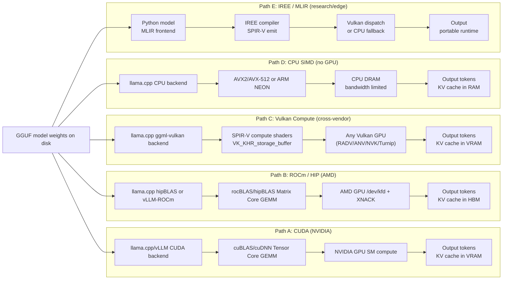

# Chapter 124: Local LLM Inference on Linux GPUs

**Target audiences**: Systems developers and GPU driver engineers who need to understand how inference runtimes talk to the kernel and hardware; ML engineers deploying large language models locally on Linux without cloud dependencies.

---

## Table of Contents

1. [Introduction](#1-introduction)
   - [1.1 What is LLM Inference?](#11-what-is-llm-inference)
   - [1.2 What is GGUF and GGML?](#12-what-is-gguf-and-ggml)
   - [1.3 What is Quantization for LLM Inference?](#13-what-is-quantization-for-llm-inference)
2. [GGML Architecture and the Vulkan Backend](#2-ggml-architecture-and-the-vulkan-backend)
3. [llama.cpp Vulkan Path in Depth](#3-llamacpp-vulkan-path-in-depth)
4. [Memory-Mapped Weights and DMA-BUF](#4-memory-mapped-weights-and-dma-buf)
5. [Ollama: GPU Dispatch and Model Management](#5-ollama-gpu-dispatch-and-model-management)
6. [ONNX Runtime with GPU Execution Providers](#6-onnx-runtime-with-gpu-execution-providers)
7. [ONNX Runtime OpenVINO EP](#7-onnx-runtime-openvino-ep)
8. [ROCm MIOpen and HIP for LLM Inference](#8-rocm-miopen-and-hip-for-llm-inference)
9. [KV Cache Management Strategies](#9-kv-cache-management-strategies)
10. [Performance Tuning and Benchmarking](#10-performance-tuning-and-benchmarking)
11. [VRAM Capacity Planning: Will This Model Fit?](#11-vram-capacity-planning-will-this-model-fit)
12. [MacBook vs. Gaming Laptop for Local Inference](#12-macbook-vs-gaming-laptop-for-local-inference)
13. [Production Serving Engines: vLLM and SGLang](#13-production-serving-engines-vllm-and-sglang)
    - [13.1 vLLM: PagedAttention as a Serving Engine](#131-vllm-pagedattention-as-a-serving-engine)
    - [13.2 SGLang: RadixAttention and Structured Generation](#132-sglang-radixattention-and-structured-generation)
    - [13.3 A Third Option, Now in Maintenance Mode: Hugging Face TGI](#133-a-third-option-now-in-maintenance-mode-hugging-face-tgi)
    - [13.4 Observability: Prometheus Metrics and Grafana Dashboards](#134-observability-prometheus-metrics-and-grafana-dashboards)
14. [Disaggregated Prefill-Decode Serving](#14-disaggregated-prefill-decode-serving)
15. [Speculative Decoding](#15-speculative-decoding)
16. [Quantization for Serving Engines: GPTQ, AWQ, bitsandbytes, and FP8](#16-quantization-for-serving-engines-gptq-awq-bitsandbytes-and-fp8)
17. [NVIDIA NGC Catalog and NIM Microservices](#17-nvidia-ngc-catalog-and-nim-microservices)
18. [Docker Model Runner](#18-docker-model-runner)
19. [Kubernetes-Native Agent Orchestration: kagent](#19-kubernetes-native-agent-orchestration-kagent)
20. [Running Hugging Face Models Locally via the CLI](#20-running-hugging-face-models-locally-via-the-cli)
21. [Fine-Tuning Acceleration with Unsloth](#21-fine-tuning-acceleration-with-unsloth)
22. [Compiled-Engine Serving: TensorRT-LLM and LMDeploy](#22-compiled-engine-serving-tensorrt-llm-and-lmdeploy)
23. [Model-Swapping Proxies: llama-swap and LiteLLM](#23-model-swapping-proxies-llama-swap-and-litellm)
24. [Structured Output, Grammars, and Function Calling](#24-structured-output-grammars-and-function-calling)
25. [Multi-LoRA Serving](#25-multi-lora-serving)
26. [ExLlamaV2 and ExLlamaV3](#26-exllamav2-and-exllamav3)
27. [llm-d: Kubernetes-Native Distributed Inference](#27-llm-d-kubernetes-native-distributed-inference)
28. [Managed Inference Platforms: AWS Bedrock and Bedrock AgentCore](#28-managed-inference-platforms-aws-bedrock-and-bedrock-agentcore)
    - [28.1 Model Catalog, API Surface, and Underlying Compute](#281-model-catalog-api-surface-and-underlying-compute)
    - [28.2 Guardrails and Knowledge Bases](#282-guardrails-and-knowledge-bases)
    - [28.3 Bedrock AgentCore: The Agentic Runtime Layer](#283-bedrock-agentcore-the-agentic-runtime-layer)
    - [28.4 The Broader Managed-Inference Landscape](#284-the-broader-managed-inference-landscape)
29. [Vercel's AI Platform](#29-vercels-ai-platform)
    - [29.1 The AI SDK: A Provider-Agnostic Client Layer](#291-the-ai-sdk-a-provider-agnostic-client-layer)
    - [29.2 AI Gateway](#292-ai-gateway)
    - [29.3 Fluid Compute: Isolation Without a MicroVM Per Request](#293-fluid-compute-isolation-without-a-microvm-per-request)
    - [29.4 v0](#294-v0)
30. [Cloudflare's AI Platform: Workers AI](#30-cloudflares-ai-platform-workers-ai)
    - [30.1 Workers AI and Infire, a Homegrown Inference Engine](#301-workers-ai-and-infire-a-homegrown-inference-engine)
    - [30.2 AI Gateway, Vectorize, and Durable Objects as Agent State](#302-ai-gateway-vectorize-and-durable-objects-as-agent-state)
31. [Integrations](#31-integrations)

---

## 1. Introduction

By mid-2026, local LLM inference on Linux has evolved from a hobbyist curiosity into a production-grade concern. A **Llama-3-70B** model quantised to **Q4\_K\_M** fits in 40 GB of VRAM on a single AMD **RX 7900 XTX** or a pair of **NVIDIA RTX 4090**s. **Mixtral-8×7B** runs at interactive speed on a single high-end consumer card. Smaller 7B and 8B models run at 80–150 tokens/second on almost any recent discrete GPU. The diversity of Linux GPU hardware has never been greater: NVIDIA's **CUDA** stack, AMD **ROCm** on **RDNA3**/4 and **CDNA**, Intel **Arc** (**Xe-HPG**) with **Level Zero** and **OpenVINO**, Qualcomm **Adreno** via **Vulkan** compute, and Apple Silicon accessed through **Asahi Mesa** or Metal.

Three advantages motivate running inference locally rather than via a cloud API:

- **Privacy**: prompt tokens never leave the machine. Medical, legal, and enterprise use cases often require this.
- **Latency**: round-trip to a remote inference endpoint adds 50–200 ms of network overhead before the first token; local VRAM latency is sub-millisecond.
- **Cost at scale**: marginal cost of a generated token on owned hardware approaches the electricity cost per watt, typically orders of magnitude cheaper than API pricing at high token volumes.

This chapter examines the full software path from a **GGUF** file on disk to generated tokens on screen.

- **Section 2 — GGML Architecture and Vulkan Backend**
  - the **GGML** tensor engine including its **ggml_cgraph** DAG executor
  - the **ggml_tensor** and **ggml_backend_i** abstraction layer
  - quantisation types ranging from **GGML_TYPE_F16** and **GGML_TYPE_BF16** through K-quant block formats (**Q4_K_M**, **Q6_K**) and I-quant formats (**IQ4_XS**)
  - the **Vulkan** backend in **ggml-vulkan.cpp** — including the **vk_device_struct** device abstraction, the **SPIR-V** compute shader pipeline compiled via **glslc**, **vk_matmul_pipeline_struct** variants, push-constant dispatch, and **VK_KHR_cooperative_matrix** support
- **Section 3 — llama.cpp Vulkan Path**
  - startup initialisation via **vkEnumeratePhysicalDevices** and **vkCreateDevice** (with the **GGML_VK_VISIBLE_DEVICES** override)
  - KV cache allocation with **grouped-query attention** (**GQA**) accounting
  - the **build_llama** compute graph including fused **RoPE** via **ggml_rope_custom** and **Flash Attention** via **ggml_flash_attn_ext** with **coopMatMulAdd** on cooperative-matrix hardware
  - multi-GPU layer splitting with **--n-gpu-layers**, **--split-mode row**, and **--tensor-split**
  - representative **llama-bench** throughput numbers across **CUDA**, **ROCm**, and **Vulkan** backends
  - distributed multi-machine inference via the **RPC backend** (**rpc-server**, **--rpc**), and its unauthenticated, trusted-network-only security model
- **Section 4 — Memory-Mapped Weights and DMA-BUF**
  - the **GGUF** binary container format (header, KV metadata, tensor info, and 32-byte-aligned tensor data sections)
  - memory-mapped loading via **mmap(2)** with **MAP_SHARED** and **madvise** prefetch hints
  - host-to-GPU weight transfer through **vkCmdCopyBuffer** and **VK_ACCESS_TRANSFER_WRITE_BIT** pipeline barriers
  - handling models larger than VRAM via split mode and **MADV_WILLNEED** prefetch
  - zero-copy loading on systems with **Resizable BAR** (**AMD SAM**) using the **VK_MEMORY_PROPERTY_DEVICE_LOCAL_BIT | VK_MEMORY_PROPERTY_HOST_VISIBLE_BIT** memory type
  - why GGUF and **safetensors** carry no `pickle`-style remote-code-execution risk, unlike PyTorch's legacy `.bin` checkpoint format
  - CPU-offloaded **MoE expert** inference for huge sparse models via **--cpu-moe**, **--n-cpu-moe**, and **--override-tensor**, plus the **ktransformers** project
  - **llamafile**'s single-executable, Cosmopolitan-Libc-based distribution of engine and weights together
- **Section 5 — Ollama**
  - its Go **ollama serve** HTTP server and **ollama_llama_server** runner subprocess
  - GPU detection via **NVML** (**libnvidia-ml.so**), **KFD** sysfs parsing for AMD, and **Level Zero** / **OpenCL** queries for Intel
  - environment overrides (**CUDA_VISIBLE_DEVICES**, **ROCR_VISIBLE_DEVICES**, **OLLAMA_GPU_OVERHEAD**)
  - the content-addressed model library under **~/.ollama/models/**
  - the **REST API** endpoints (**/api/generate**, **/api/chat**, **/api/embeddings**)
  - parallel request handling via **OLLAMA_NUM_PARALLEL** and llama.cpp's batched-decode path
  - **LM Studio** as a GUI-first alternative model manager, also built on llama.cpp on Linux
  - a comparison table of local model runners — **GPT4All**, **Jan**, **koboldcpp**, **text-generation-webui**, and **llamafile** alongside Ollama, LM Studio, and Docker Model Runner — by interface, backend, model format, GPU coverage, API compatibility, and license
- **Section 6 — ONNX Runtime with GPU Execution Providers**
  - **ONNX Runtime** (**ORT**) and its **Execution Provider** (**EP**) plugin architecture
  - the **CUDA EP** using **cuDNN** and **cuBLAS** configured via **OrtCUDAProviderOptionsV2** (including **CUDA Graph** capture to eliminate per-iteration kernel launch overhead, **TF32** on Ampere+, and **TransformerOptimizer** graph fusions such as **SkipLayerNorm** and **FusedMatMul**)
  - ORT's quantisation tooling for **INT8** via **quantize_dynamic** and **FP16** conversion
- **Section 7 — ONNX Runtime OpenVINO EP**
  - the **OpenVINO** Intermediate Representation (**IR**) format
  - **OrtOpenVINOProviderOptions** and its V2 key-value configuration
  - the **Level Zero** backend routing **Intel Arc** compute through the **Intel Graphics Compiler** (**IGC**)
  - heterogeneous execution via **HETERO:NPU,GPU,CPU** across Intel **NPU**, **iGPU**, and CPU
  - a comparison of embeddable inference runtimes and compilers — **ONNX Runtime**, raw **NVIDIA TensorRT**, standalone **OpenVINO**, and PyTorch's **torch.compile**/AOTInductor — by model formats ingested, hardware backends, deployment style, and audience
- **Section 8 — ROCm MIOpen and HIP**
  - the **HIP** programming model and runtime (**hipMalloc**, **hipMemcpy**, **hipLaunchKernelGGL**)
  - GEMM via **rocBLAS** (**rocblas_gemm_ex**) and **hipBLASLt** with **TunableOp** auto-selection
  - unified memory via **hipMallocManaged** and **HMM** on AMD APUs such as **Strix Halo** (**Ryzen AI Max+ 395**)
  - the **PyTorch** CUDA-compatibility shim that allows ROCm-unmodified inference
  - **vLLM** device isolation via **ROCR_VISIBLE_DEVICES** and **AITER** (**AI Tensor Engine for ROCm**) attention kernels (**VLLM_ROCM_USE_AITER**)
  - **MIOpen** auto-tuning via **MIOPEN_USER_DB_PATH** and **MIOPEN_FIND_MODE**
- **Section 9 — KV Cache Management**
  - the quadratic VRAM scaling problem
  - **PagedAttention** in **vLLM** with fixed-size physical blocks and the **BlockManager** free-block pool achieving under 4% fragmentation
  - Automatic Prefix Caching (**APC**) using Merkle-chain block hashes (**xxhash**, **sha256**) with LRU eviction
  - llama.cpp's ring-buffer KV cache and **Sliding Window Attention** (**SWA**) for **Llama-3.1** models plus coarse CPU swap via **ggml_backend_cpu_buffer_type**
  - vLLM's preemption strategies (swap via **cudaMemcpyAsync** / **hipMemcpy** and recompute) managed by the hybrid KV cache manager
- **Section 10 — Performance Tuning**
  - measuring prompt-processing (**pp**) and token-generation (**tg**) throughput with **llama-bench**
  - quantisation impact on model size, generation speed, and perplexity across **F16**, **Q8_0**, **Q4_K_M**, **Q3_K_M**, and **Q2_K** formats
  - GPU utilisation monitoring with **nvtop**, **nvidia-smi dmon**, **radeontop**, **rocm-smi**, and **intel_gpu_top**
  - power and thermal considerations including **TJmax** throttling and **nvidia-smi -pl** / **rocm-smi --setpoweroverdrive** power capping
  - roofline arithmetic-intensity analysis that explains why token generation at batch=1 is deeply memory-bandwidth-bound
- **Section 11 — VRAM Capacity Planning**
  - the VRAM sizing equation (`VRAM_weights + VRAM_kv_cache + VRAM_overhead`) worked through numerically for a Llama-3-8B Q4_K_M deployment
  - **gguf-parser-go** for reading memory/throughput estimates directly out of GGUF header metadata, including the UMA-vs-NONUMA device split
  - Hugging Face's **accelerate estimate-memory** tool for `safetensors`/PyTorch-format models bound for ONNX Runtime or ROCm/PyTorch
  - runtime ground truth via **ollama ps**, **ollama show**, **nvidia-smi --query-gpu**, and **rocm-smi --showmeminfo**
  - context-length extension via **RoPE scaling** (**Position Interpolation**, **NTK-aware scaling**, **YaRN**) and its multiplicative effect on KV cache VRAM, configured via llama.cpp's **--rope-scaling**/**--yarn-\*** flags and vLLM's **--hf-overrides** `rope_parameters`
- **Section 12 — MacBook vs. Gaming Laptop for Local Inference**
  - Apple Silicon's unified-memory architecture versus a discrete gaming-laptop GPU's dedicated VRAM pool, and the capacity consequences for large models
  - the macOS software stack — **Metal**, Apple's **MLX** framework, and llama.cpp's `ggml_backend_metal` — contrasted with this chapter's Vulkan/CUDA/ROCm focus
  - discrete-GPU gaming laptops running the same CUDA/Vulkan/ROCm stacks as desktop cards, within a fixed VRAM ceiling
  - the status of **Asahi Linux**'s "Honeykrisp" Vulkan driver as an untested path for running llama.cpp's Vulkan backend on Apple Silicon under Linux
- **Section 13 — Production Serving Engines: vLLM and SGLang**
  - **vLLM**'s `LLMEngine`, continuous-batching scheduler, and V1 multi-process architecture, plus CUDA/ROCm installation and `vllm serve` launch flags
  - vLLM's tensor- and pipeline-parallel multi-GPU/multi-node scaling
  - **SGLang**'s **RadixAttention** prefix-caching radix tree and its structured-generation DSL (`gen`, `fork`, `choices`)
  - SGLang installation, launch flags, and AMD Instinct (ROCm) support
  - Hugging Face **TGI**'s Rust router / Python model-server architecture, and its current maintenance-mode status pointing users toward vLLM and SGLang
  - production observability via **Prometheus** `/metrics` (vLLM's `vllm:*` series, SGLang's `--enable-metrics`) and official **Grafana** dashboards, plus a scope note on multimodal (vision-language) serving
- **Section 14 — Disaggregated Prefill-Decode Serving**
  - why co-locating compute-bound prefill and bandwidth-bound decode on one GPU causes head-of-line blocking, per the DistServe paper
  - vLLM's experimental `--kv-transfer-config` connector abstraction (**NixlConnector**, **MooncakeConnector**, **LMCacheConnectorV1**, **MoRIIOConnector**)
  - **NVIDIA Dynamo**'s orchestration layer over vLLM/SGLang/TensorRT-LLM and its **NIXL** transfer library
  - **Mooncake**'s KV-cache-centric disaggregated architecture and Transfer Engine, as used in production by Moonshot AI's Kimi
- **Section 15 — Speculative Decoding**
  - lossless draft-model/target-model rejection sampling as a throughput technique orthogonal to quantisation
  - **Medusa**'s multi-head tree decoding, **EAGLE**'s feature-space drafting, and **Lookahead decoding**'s Jacobi-iteration approach
  - configuration surfaces in vLLM (`--speculative-config`), SGLang (`--speculative-algorithm`), and llama.cpp (`-md`/`--model-draft`)
- **Section 16 — Quantization for Serving Engines**
  - **GPTQ**'s layer-wise, Hessian-guided one-shot quantisation and its **GPTQModel** successor
  - **AWQ**'s activation-aware protection of salient weight channels
  - **bitsandbytes**' `LLM.int8()` outlier-isolation scheme and **NF4** (QLoRA)
  - hardware-native **FP8** (E4M3/E5M2) on Ada Lovelace/Hopper/Blackwell Tensor Cores, and the `--quantization` flag surface shared across these formats
- **Section 17 — NVIDIA NGC Catalog and NIM Microservices**
  - the **NGC** container registry and `nvcr.io` Docker authentication via `$oauthtoken`
  - **NIM**'s pre-built, per-GPU-optimised OpenAI-compatible containers wrapping TensorRT-LLM or vLLM underneath
  - a concrete local NIM deployment via `docker run --runtime=nvidia`
  - the free developer-program tier versus the licensed NVIDIA AI Enterprise production path
  - GPU rental (RunPod, Lambda, Vast.ai, CoreWeave) as a hardware-only alternative to NGC/NIM's software stack
  - the local-to-managed deployment spectrum, from self-hosted runners through self-built engines, curated containers, and GPU rental, to the fully managed platforms of §28–§30
- **Section 18 — Docker Model Runner**
  - Docker Model Runner's architecture: a vendored `llama-server` binary running natively on the host rather than inside a container
  - native Linux support via `docker-model-plugin` and the `docker model` CLI verb group
  - model distribution as OCI Artifacts on Docker Hub, plus direct Hugging Face GGUF pulls
  - the OpenAI-compatible endpoint exposed at `model-runner.docker.internal`
- **Section 19 — Kubernetes-Native Agent Orchestration: kagent**
  - why **kagent** is an agent-orchestration layer, not an inference engine — it never hosts model weights itself
  - its `Agent`, `ModelConfig`, and `ToolServer` custom resources, and how `ModelConfig` points at an already-running Ollama/vLLM/SGLang endpoint
  - Helm-based cluster installation
  - full CRD YAML examples for `ModelConfig`, `Agent`, `RemoteMCPServer`, and the local-deployment `MCPServer` counterpart
- **Section 20 — Running Hugging Face Models Locally via the CLI**
  - the **hf** CLI (renamed from `huggingface-cli`) and its `hf <resource> <action>` command grammar
  - `hf download` with `--include`/`--exclude` glob filtering for pulling a single GGUF quantisation out of a multi-file repo
  - the `~/.cache/huggingface/hub` blob/snapshot/refs cache layout and its deduplication behaviour
  - the **Xet**-based transfer-acceleration backend that replaced `hf_transfer`
  - a comparison of model weight distribution mechanisms — HF Hub, the **Ollama registry**, **OCI artifacts** (Docker Model Runner), **ModelScope**, **Kaggle Models**, and plain `git`+LFS — by content-addressing/dedup scheme, auth model, native format, and ecosystem
- **Section 21 — Fine-Tuning Acceleration with Unsloth**
  - **Unsloth**'s hand-written Triton kernels and manually-derived backward pass for faster, lower-VRAM LoRA/QLoRA fine-tuning
  - its NVIDIA CUDA-primary support alongside newer AMD ROCm and Intel/CPU paths
  - a QLoRA fine-tuning example and export straight to GGUF (§1) or a merged checkpoint for vLLM/SGLang (§13)
  - **Modal** as a common serverless, per-second-billed deployment target for the fine-tuning run itself
- **Section 22 — Compiled-Engine Serving: TensorRT-LLM and LMDeploy**
  - **TensorRT-LLM**'s ahead-of-time `trtllm-build` engine compilation and `trtllm-serve` OpenAI-compatible server — the engine NIM (§17) wraps internally
  - **LMDeploy**'s compiled **TurboMind** engine versus its PyTorch eager-mode engine, and its AMD ROCm support (unlike TensorRT-LLM)
- **Section 23 — Model-Swapping Proxies: llama-swap and LiteLLM**
  - **llama-swap**'s YAML-configured process supervision that loads/unloads backend processes per request, with idle-timeout unloading and concurrent-model "groups"
  - **LiteLLM**'s unified OpenAI-compatible proxy fronting both local (Ollama, vLLM) and cloud backends, with cost tracking and failover
  - **OpenRouter** as a hosted, multi-provider routing SaaS — the un-self-hosted counterpart to LiteLLM and Vercel's AI Gateway (§29.2)
  - a comparison of llama-swap, LiteLLM, and OpenRouter by deployment model, problem solved, backend compatibility, and process-lifecycle ownership
- **Section 24 — Structured Output, Grammars, and Function Calling**
  - constrained decoding via compiled-grammar token masking, composing transparently with quantisation, speculative decoding, and batching
  - **Outlines**, **XGrammar**, and llama.cpp's native **GBNF** grammar format
  - backend-selection flags in vLLM (`--structured-outputs-config.backend`) and SGLang (`--grammar-backend`)
  - function/tool-calling parser selection (`--tool-call-parser`) matched to a model family's native tool-call format
  - **DSPy**'s Signature/Module/Optimizer programming model and its `JSONAdapter`, layered above (not competing with) the grammar-compilation backends
- **Section 25 — Multi-LoRA Serving**
  - the **Punica** batched SGMV kernel and **S-LoRA**'s Unified Paging, which both serving engines build on
  - vLLM's `--enable-lora`/`--lora-modules` and hot-swap `load_lora_adapter`/`unload_lora_adapter` API
  - SGLang's `--lora-paths`, `--max-loras-per-batch`, and `csgmv` kernel backend
- **Section 26 — ExLlamaV2 and ExLlamaV3**
  - **EXL2**'s variable-bit-depth, per-group GPTQ-style quantisation (now archived in favour of V3)
  - **EXL3**'s QTIP-derived trellis-coded quantisation format
  - the CUDA-only scope of both engines and **TabbyAPI** as their OpenAI-compatible serving frontend
- **Section 27 — llm-d: Kubernetes-Native Distributed Inference**
  - **llm-d**, a CNCF Sandbox project, as a Kubernetes-native orchestration layer sitting directly above vLLM/SGLang pods
  - routing built on the Kubernetes SIG Gateway API Inference Extension, its `InferencePool` CRD, and the EPP/BBR/latency-predictor migration to llm-d at GAIE v1.6.0
  - cluster-scale prefill/decode disaggregation and prefix-cache-aware request routing, contrasted with §14's single-process connectors
  - **Ray Serve** and **KubeRay** as a general-purpose, Ray-based alternative path to distributed vLLM serving on Kubernetes, with **Anyscale** as its managed offering
  - a technical-capability comparison of llm-d, Ray Serve/KubeRay, **NVIDIA Dynamo**, **KServe**, **AIBrix**, **llmaz**, **KubeAI**, and **Kaito** by governance, Kubernetes integration mechanism, disaggregation approach, and autoscaling
  - full CRD YAML examples and field-level explanations for `InferencePool`/`HTTPRoute` (GAIE), `LLMInferenceService` (KServe), `PodAutoscaler` (AIBrix), `OpenModel`/`Playground` (llmaz), `Model` (KubeAI), `Workspace` (Kaito), and `RayService` (KubeRay)
- **Section 28 — Managed Inference Platforms: AWS Bedrock and Bedrock AgentCore**
  - Bedrock's fully managed FM API, its Trainium2/Inferentia2 Neuron-SDK compute substrate, and On-Demand/Provisioned-Throughput/Batch billing
  - Guardrails' content/PII filters and contextual grounding checks, and Knowledge Bases' managed RAG pipeline
  - **Bedrock AgentCore**'s modular agentic runtime (Gateway, Memory, Identity, Code Interpreter) and its dedicated-microVM-per-session isolation model
  - the broader managed-inference landscape: Azure AI Foundry and Vertex AI as Bedrock's hyperscaler peers, HF Inference Endpoints/Providers, Together/Fireworks/Groq/Baseten/Replicate, and CoreWeave
- **Section 29 — Vercel's AI Platform**
  - the **AI SDK**'s provider-agnostic client layer, including its `createOpenAICompatible` path for wiring in self-hosted vLLM/Ollama endpoints from §5/§13
  - **AI Gateway** as a standalone multi-protocol routing/failover/BYOK proxy
  - **Fluid Compute**'s in-function-concurrency isolation model, contrasted with per-request microVMs
- **Section 30 — Cloudflare's AI Platform: Workers AI**
  - Workers AI's edge-deployed GPU fleet and Neurons billing
  - **Infire**, Cloudflare's own Rust inference engine built to replace vLLM in production, as a direct counterpoint to §13
  - AI Gateway, Vectorize/AI Search managed RAG, and Durable Objects as a persistent-actor alternative to AgentCore's session model

### 1.1 What is LLM Inference?

Large language model (LLM) inference is the process of executing a pre-trained transformer-based neural network to generate text token-by-token from a given prompt. Unlike training — which adjusts the model's billions of weight parameters over large datasets using backpropagation and gradient descent — inference uses the trained weights in a forward-only pass, computing attention over a key-value (KV) cache that grows with sequence length. The core computational primitive is dense matrix multiplication: for every generated token, the runtime multiplies the current hidden-state vector (dimension D, typically 4096–8192 for 7B–70B models) by each layer's query, key, value, and MLP projection weight matrices. On a GPU, those matrix–vector products map to GEMM (General Matrix Multiply) operations scheduled on the GPU's compute units via a kernel driver. On Linux, the kernel exposes GPU compute through the DRM subsystem: NVIDIA uses its proprietary kernel module paired with the CUDA user-space stack; AMD uses the `amdgpu` DRM driver with the ROCm stack and the Kernel Fusion Driver device node at `/dev/kfd`; Intel Arc GPUs use the `i915` or `xe` DRM driver with Level Zero. The inference runtime — llama.cpp, vLLM, Ollama, or ONNX Runtime — sits between the model weights on disk and those kernel interfaces, translating the transformer graph into backend-specific GEMM calls and memory management commands. Memory bandwidth, not arithmetic throughput, is the dominant performance constraint at batch size 1: every generated token requires reading the full weight tensor from GPU memory, making VRAM bandwidth the ceiling on tokens-per-second.

### 1.2 What is GGUF and GGML?

GGML (Georgi Gerganov Machine Learning) is a C tensor library whose primary design goal is efficient quantised inference with optional GPU offload. It defines a tensor type (`ggml_tensor`), a directed acyclic graph executor (`ggml_cgraph`), and a pluggable backend abstraction (`ggml_backend_i`) that lets the same compute graph dispatch to CPU SIMD, CUDA, ROCm, Vulkan, or SYCL backends without changing the calling code. Each backend registers capability queries (`supports_op`), buffer allocation routines, and a `graph_compute` entry point; the scheduler assigns tensor operations to the highest-priority backend that reports support for that operation type. GGUF (GGML Unified Format) is the binary container format that stores quantised model weights on disk. A GGUF file opens with a magic number and version header, followed by a key-value metadata section describing model architecture and tokeniser configuration, a tensor index listing each tensor's name and byte offset into the data region, and then the raw tensor data aligned to 32-byte boundaries. The data section is designed for `mmap(2)` with `MAP_SHARED`: the OS page cache becomes the backing store, and the kernel loads weight pages on demand as GPU transfer commands reference them, avoiding an explicit read-into-RAM stage. This also enables operating on models larger than physical VRAM by splitting layers across GPU and CPU memory. GGUF replaced the earlier GGML binary format in 2023 and is now the standard interchange format for quantised open-weight models distributed through model repositories and llama.cpp-compatible tools.

### 1.3 What is Quantization for LLM Inference?

Quantization in the context of LLM inference means representing weight tensors using fewer bits than the 32-bit (FP32) or 16-bit (FP16/BF16) floating-point formats used during training. The motivation is memory bandwidth: a Llama-3-70B model stored in FP16 requires approximately 140 GB to be read from GPU memory for each generated token, far exceeding the VRAM of any consumer GPU. Reducing weights to 4 bits per parameter shrinks that figure to roughly 35 GB, fitting on a single high-end GPU and reducing per-token bandwidth demand proportionally. Quantization introduces error by mapping a range of floating-point values onto a small number of discrete integer codes, but for transformer weight matrices this error is well-tolerated because individual weights rarely dominate a computation. GGML implements three families of quantisation. The legacy integer block formats (`Q4_0`, `Q4_1`, `Q8_0`) quantise fixed 32-element blocks with a per-block floating-point scale stored alongside the integer codes. The K-quant block formats (`Q2_K`, `Q3_K_S/M/L`, `Q4_K_S/M`, `Q5_K_S/M`, `Q6_K`) use 256-element super-blocks with learned scale and minimum values, achieving better perplexity at equivalent bit-width because the larger context captures the weight distribution more accurately. The I-quant formats (`IQ4_XS`, `IQ2_XXS`) use an importance matrix derived from calibration data to allocate bits non-uniformly, concentrating precision where weights most affect output quality. GPU backends decode quantised blocks back to FP16 or BF16 in-shader — in SPIR-V compute kernels for the Vulkan path, or in CUDA/HIP kernels for the NVIDIA and AMD paths — immediately before feeding values into the GEMM pipeline.

---

## 2. GGML Architecture and the Vulkan Backend

Linux offers multiple GPU compute backends for LLM inference, each with different hardware requirements, quantisation support, and framework ecosystems. Understanding these trade-offs up front helps engineers choose the right backend before diving into implementation details. The table below summarises the major options as of mid-2026, followed by an in-depth look at GGML's own architecture and its Vulkan backend.

| **Backend** | **Hardware** | **API / driver** | **Quantisation support** | **Batching / continuous batching** | **Memory efficiency** | **Framework examples** | **When to use** |
|---|---|---|---|---|---|---|---|
| CUDA 12 | NVIDIA RTX/Tesla/H100 | proprietary nvidia driver or nvidia-open | GGUF Q4/Q8, GPTQ, AWQ, FP8 (Hopper) | Full (vLLM, TGI) | Excellent (unified virtual addressing, NVLink P2P) | llama.cpp (CUDA), vLLM, TGI, Ollama | NVIDIA GPU; maximum performance; broadest framework support |
| ROCm / HIP 6 | AMD RDNA 2+, CDNA (MI-series) | AMDGPU + KFD | GGUF Q4/Q8, GPTQ (via AutoGPTQ-ROCm) | Full (vLLM-ROCm, TGI-ROCm) | Good (xGMI on MI-series) | llama.cpp (hipBLAS), vLLM-ROCm, Ollama | AMD GPU; comparable to CUDA on supported hardware |
| Vulkan Compute (GGML) | Any Vulkan 1.3 GPU (NVIDIA, AMD, Intel, ARM) | Mesa Vulkan or nvidia-open or Intel ANV | GGUF Q4_0, Q4_1, Q5_K, Q8_0 (growing) | Limited (single inference; no KV cache batching) | Good (explicit allocation) | llama.cpp (--n-gpu-layers), koboldcpp | Cross-vendor; Intel Arc; AMD on ROCm-unsupported hardware |
| OpenCL | AMD (ROCm OpenCL), Intel (NEO), NVIDIA (legacy) | ICD loader + vendor runtime | GGUF via clblast (limited) | Very limited | Moderate | llama.cpp (clblast; deprecated in favour of Vulkan) | Legacy; older AMD GPUs before ROCm support |
| CPU (SIMD / AVX-512) | Any x86-64 with AVX2/AVX-512; ARM NEON/SVE | No GPU driver needed | GGUF Q4/Q8 (excellent; GGML designed for CPU Q) | Supported | Limited by RAM bandwidth | llama.cpp (CPU), Ollama CPU | No GPU available; quantised 7B–13B models on capable CPUs; power-constrained |

### LLM Inference Pipeline Paths

The backend choice determines the entire data-flow path from model weights to output tokens. Each path has different memory bandwidth characteristics and GPU driver requirements — choices made at backend selection time ripple through every layer from kernel driver to token throughput.


```mermaid
flowchart LR
    weights["GGUF model weights on disk"]

    subgraph pathA ["Path A: CUDA (NVIDIA)"]
        A1["llama.cpp/vLLM CUDA backend"]
        A2["cuBLAS/cuDNN Tensor Core GEMM"]
        A3["NVIDIA GPU SM compute"]
        A4["Output tokens\nKV cache in VRAM"]
        A1 --> A2 --> A3 --> A4
    end

    subgraph pathB ["Path B: ROCm / HIP (AMD)"]
        B1["llama.cpp hipBLAS or vLLM-ROCm"]
        B2["rocBLAS/hipBLAS Matrix Core GEMM"]
        B3["AMD GPU /dev/kfd + XNACK"]
        B4["Output tokens\nKV cache in HBM"]
        B1 --> B2 --> B3 --> B4
    end

    subgraph pathC ["Path C: Vulkan Compute (cross-vendor)"]
        C1["llama.cpp ggml-vulkan backend"]
        C2["SPIR-V compute shaders\nVK_KHR_storage_buffer"]
        C3["Any Vulkan GPU\n(RADV/ANV/NVK/Turnip)"]
        C4["Output tokens\nKV cache in VRAM"]
        C1 --> C2 --> C3 --> C4
    end

    subgraph pathD ["Path D: CPU SIMD (no GPU)"]
        D1["llama.cpp CPU backend"]
        D2["AVX2/AVX-512 or ARM NEON"]
        D3["CPU DRAM\nbandwidth limited"]
        D4["Output tokens\nKV cache in RAM"]
        D1 --> D2 --> D3 --> D4
    end

    subgraph pathE ["Path E: IREE / MLIR (research/edge)"]
        E1["Python model\nMLIR frontend"]
        E2["IREE compiler\nSPIR-V emit"]
        E3["Vulkan dispatch\nor CPU fallback"]
        E4["Output\nportable runtime"]
        E1 --> E2 --> E3 --> E4
    end

    weights --> A1
    weights --> B1
    weights --> C1
    weights --> D1
    weights --> E1
```

The critical bottleneck in all paths is memory bandwidth, not compute. A 70B model at Q4_0 quantisation requires approximately 35 GB of weight reads per output token, making memory bandwidth the dominant performance constraint at batch=1. This explains why Paths A and B are dramatically faster than Path D: HBM3 on an AMD MI300X delivers over 5 TB/s of bandwidth, GDDR7 on an NVIDIA RTX 5090 provides over 3 TB/s, while CPU DDR5 is limited to 50–100 GB/s — a 30–100× deficit that translates directly into token throughput. Path C (Vulkan compute) achieves approximately 60–80% of the throughput of Paths A and B on equivalent hardware, due to Vulkan dispatch overhead and the absence of hand-tuned vendor kernels like cuBLAS's Tensor Core GEMM implementations. However, Path C's cross-vendor compatibility makes it the only GPU-accelerated option on hardware excluded from CUDA or ROCm support, including Intel Arc GPUs, older AMD GPUs predating ROCm compatibility, and any device with a conformant Vulkan 1.2 driver. Path E (IREE/MLIR) is primarily a research and edge-deployment path; its portable SPIR-V emission trades peak throughput for compiler portability and reproducible deployment artifacts.

### 2.1 The GGML Tensor Engine

GGML is a C library that provides a tensor type system and a DAG-based compute graph executor. Every inference operation — matrix–vector multiply, RoPE, softmax, layer normalisation — is expressed as a node in a `ggml_cgraph`. Nodes hold `ggml_tensor` structs that record shape (up to four dimensions), data type, a pointer to backing storage, and a `backend_buffer` reference that describes where the data lives. [Source](https://github.com/ggml-org/llama.cpp)

Data types include:
- Floating-point formats: `GGML_TYPE_F32`, `GGML_TYPE_F16`, `GGML_TYPE_BF16`
- Integer quantisation types: `GGML_TYPE_Q4_0`, `GGML_TYPE_Q4_1`, `GGML_TYPE_Q8_0`
- K-quant block formats: `GGML_TYPE_Q2_K`, `GGML_TYPE_Q3_K_S/M/L`, `GGML_TYPE_Q4_K_S/M`, `GGML_TYPE_Q5_K_S/M`, `GGML_TYPE_Q6_K`
- I-quant formats (importance-matrix-guided): `GGML_TYPE_IQ2_XXS`, `GGML_TYPE_IQ4_XS`, etc.

K-quant types are block-quantised: a `Q4_K_M` tensor stores weights in 256-element super-blocks, each containing two `Q4_0` sub-blocks of 32 elements sharing a per-block scale and minimum value. This yields approximately 4.5 bits/weight while preserving more of the weight distribution than plain `Q4_0`.

The backend abstraction (`ggml_backend_i`) decouples tensor storage from the executor. Each backend registers:
- `get_name` — returns `"Vulkan"`, `"CUDA"`, `"ROCm"`, `"CPU"`, etc.
- `free` — releases device resources
- `buffer_type` — returns a `ggml_backend_buffer_type_t` that knows how to allocate and zero tensors on this device
- `graph_plan_compute` / `graph_compute` — executes a previously built plan
- `supports_op` — returns whether this backend can natively handle a given op

Backends are discovered and registered at startup via `ggml_backend_load_all`, which walks a list of compiled-in backends in priority order (CUDA > ROCm > Vulkan > SYCL > CPU). The first backend that reports a usable device wins tensor assignment for GPU layers. [Source](https://deepwiki.com/ggml-org/llama.cpp)

### 2.2 The Vulkan Backend Architecture

The Vulkan backend (`ggml-vulkan.cpp` in the GGML source tree) enables inference on any Vulkan 1.2-capable GPU: NVIDIA, AMD, Intel Arc, Qualcomm Adreno, ARM Mali, and IMG GPUs on Linux. [Source](https://deepwiki.com/ggml-org/llama.cpp/5.3-vulkan-backend-(cross-platform))

#### Core Device Abstraction

The central structure is `vk_device_struct` (typedef `vk_device`):

```cpp
// Simplified from ggml-vulkan.cpp
struct vk_device_struct {
    vk::PhysicalDevice physical_device;
    vk::Device         device;
    vk::Queue          compute_queue;
    vk::Queue          transfer_queue;

    uint32_t  subgroup_size;     // wavefront/warp size
    uint32_t  vendor_id;         // PCI vendor: 0x10DE NVIDIA, 0x1002 AMD, 0x8086 Intel
    bool      fp16_support;
    bool      bf16_support;
    bool      coopmat_support;   // VK_KHR_cooperative_matrix
    bool      coopmat2_support;  // newer coopmat variant

    std::unordered_map<std::string, vk_pipeline> pipeline_cache;
    vk::PipelineCache vk_pipeline_cache;
    // ... pinned host memory pool, descriptor pool, command pools
};
```

The backend wraps a `vk_device` into a `ggml_vk_context`:

```cpp
struct ggml_vk_context {
    vk_device device;
    // per-context state: in-flight command buffers, semaphores
    std::vector<vk_context_struct> contexts;
    vk::Fence fence;
};
```

#### Pipeline and Shader System

Each compute shader is compiled from GLSL source (`.comp` files under `ggml/src/ggml-vulkan-shaders/`) to SPIR-V at build time by the `vulkan-shaders-gen` tool using `glslc` from the Vulkan SDK. The compiled SPIR-V blobs are embedded as C arrays in the generated header `ggml-vulkan-shaders.hpp` and loaded at library initialisation via `vkCreateShaderModule`. No runtime shader compilation is required; the backend simply calls `vkCreateComputePipeline` once per pipeline variant on first use.

Pipeline variants are registered in a `vk_matmul_pipeline_struct`:

```cpp
struct vk_matmul_pipeline_struct {
    vk_pipeline l;   // "large": for M >= 32 (batch decode or prompt)
    vk_pipeline m;   // "medium": M 8–31
    vk_pipeline s;   // "small": M 1–7 (single-token generation)
    vk_pipeline a;   // aligned variant requiring 4-byte-aligned strides
};
```

More than 200 pipeline variants exist across quantisation types, precision combinations (FP16 accumulators vs FP32), and hardware capability tiers (with/without cooperative matrix extensions). The selection logic in `ggml_vk_get_pipeline` uses the tensor's data type, the batch dimension, and device capability flags to choose the fastest variant at runtime.

#### Push Constants and Matrix–Vector Multiply

Shape parameters are passed as Vulkan push constants rather than descriptor-set bindings to minimise CPU overhead per dispatch. For the core GEMM shader:

```glsl
// From mul_mm.comp (simplified)
layout(push_constant) uniform PushConstants {
    uint M;       // rows of A / rows of output
    uint N;       // rows of B (columns of output)
    uint K;       // shared dimension (model hidden size)
    uint stride_a;
    uint stride_b;
    uint stride_d;
    float scale;
} pcs;
```

Each workgroup loads a tile of A and a tile of B into shared memory (`shared float As[BM][BK]; shared float Bs[BK][BN];`), performs the tile multiply using a standard blocked GEMM loop, and accumulates into registers. On devices with `VK_KHR_cooperative_matrix`, the shader uses `coopMatMulAdd` to exploit tensor core hardware.

#### Memory Buffer Types

Three buffer allocation strategies serve different GPU configurations:

| Buffer type | `vk::MemoryPropertyFlags` | Use case |
|---|---|---|
| Device-local | `eDeviceLocal` | Discrete GPU VRAM (weights, KV cache, activations) |
| Host-visible device-local | `eDeviceLocal \| eHostVisible \| eHostCoherent` | Resizable BAR / SAM-enabled systems (zero-copy staging) |
| Host pinned | `eHostVisible \| eHostCoherent \| eHostCached` | Staging buffers for discrete GPU weight upload |

On discrete GPUs without Resizable BAR, weights travel through a pinned staging buffer: `vkCmdCopyBuffer` submits the transfer on the `transfer_queue`, with a `vkQueueWaitIdle` (or timeline semaphore) before the compute queue reads the tensor. On systems with ReBAR enabled, the device-local buffer is simultaneously host-visible, and `memcpy` directly fills GPU VRAM without staging [Source](https://github.com/ggml-org/llama.cpp/issues/21590).

---

## 3. llama.cpp Vulkan Path in Depth

### 3.1 Initialisation

```cpp
// High-level call sequence at startup
llama_backend_init();          // registers all ggml backends via ggml_backend_load_all()
llama_model *model = llama_load_model_from_file("model.gguf", params);
llama_context *ctx  = llama_new_context_with_model(model, ctx_params);
```

`llama_backend_init` triggers `ggml_backend_vk_init(device_index)` for each discovered Vulkan physical device. The Vulkan backend enumerates physical devices via `vkEnumeratePhysicalDevices`, filters out devices without the required compute queue family and without Vulkan 1.2 support, then calls `vkCreateDevice` to create a logical device. Vendor-specific heuristics adjust the device selection:

- AMD GPUs are preferred over Intel integrated graphics when both are present.
- A device with `VK_KHR_cooperative_matrix` (tensor cores) is preferred over one without.
- The user can force a device index via `GGML_VK_VISIBLE_DEVICES`.

### 3.2 KV Cache and Buffer Allocation

The KV cache is allocated on the GPU backend chosen for layer 0 by default, via `ggml_backend_vk_buffer_type`. For a Llama-3-8B model at context length 8192, the K and V tensors across 32 layers at F16 precision occupy:

```
32 layers × 2 (K+V) × 8192 tokens × 8 heads × 128 head_dim × 2 bytes = ~4 GB
```

With grouped-query attention (GQA) as used in Llama-3-8B (8 KV heads vs 32 Q heads), this shrinks to:

```
32 × 2 × 8192 × 8 × 128 × 2 = ~512 MB
```

The KV cache is backed by a `vk::Buffer` allocated with `eDeviceLocal` flags. The `llama_kv_cache` struct tracks `cache_k_l%d` and `cache_v_l%d` tensors per layer, stored as contiguous slabs in VRAM. A `cell_data` array on the CPU tracks which context slots are occupied, and `find_slot()` assigns positions to incoming tokens.

### 3.3 Compute Graph: `build_llama`

For each decode step, `llama_build_graph` calls the architecture-specific graph builder. For LLaMA-family models this is `build_llama`:

```
Input token IDs → ggml_get_rows(embedding table) → residual stream
  for each transformer layer:
    ggml_norm → Q/K/V projection (ggml_mul_mat) → Q: ggml_rope, K: ggml_rope
    K/V → write into KV cache slab (ggml_cpy)
    Attention: ggml_flash_attn_ext (if Flash Attention) or manual QK^T → softmax → V
    FFN: gate·up projections → SiLU activation (ggml_silu) → down projection
    Residual add
  Final norm → logits projection
```

The entire graph is a pure DAG of `ggml_tensor` nodes. No loops or conditionals appear at the GGML level; branching is handled by building different graphs for prefill (full prompt processing) versus decode (single-token generation).

**RoPE** is applied as a fused kernel: `ggml_rope_custom` takes the Q or K tensor and computes `q_rotated[i] = q[i]*cos(θ) - q[i+1]*sin(θ)` for each head dimension pair, where `θ = pos / base^(2i/d)`. The Vulkan shader does this in-place over a workgroup of threads mapped to the batch×head×dim axes.

**Flash Attention** in GGML's Vulkan backend is implemented in `flash_attn.comp` and its cooperative-matrix variants. The shader computes the attention output in tiles, accumulating in FP32 with online softmax normalisation (the Dao–Milovanovic algorithm). This avoids materialising the full `N×N` attention matrix in global memory, saving VRAM especially at long contexts. On cooperative-matrix hardware, `flash_attn_cm1.comp` and `flash_attn_cm2.comp` use `coopMatMulAdd` for the QK^T and (softmax weights × V) multiplies. [Source](https://deepwiki.com/ggml-org/llama.cpp/5.3-vulkan-backend-(cross-platform))

### 3.4 Multi-GPU Layer Split

The `--n-gpu-layers N` flag (short: `-ngl N`) tells llama.cpp to assign the bottom N transformer layers to the GPU backend (Vulkan or CUDA), leaving the remainder on CPU. When N equals the total layer count, the full model including the embedding table and final norm runs on GPU.

For models that exceed a single GPU's VRAM, `--split-mode row` distributes rows of the weight matrices across up to four GPUs via the RPC backend or direct multi-device scheduling. Each GPU receives a contiguous slab of weight rows; partial results are summed across devices with an `ggml_all_reduce`-style reduction. The `--tensor-split` argument accepts a comma-separated ratio list (e.g., `--tensor-split 0.6,0.4`) to bias the split toward a larger-VRAM device. [Source](https://github.com/ggml-org/llama.cpp/discussions/7678)

### 3.5 Representative Benchmarks

The following figures are from community benchmarks using `llama-bench` on Llama-3-8B with Q4\_0 quantisation (pp512 = prompt processing at batch 512, tg128 = token generation at batch 1). Q4\_K\_M generation speed is comparable; prompt processing is typically 5–15% slower due to dequantisation overhead. [Source](https://knightli.com/en/2026/04/23/llama-cpp-gpu-benchmark-cuda-rocm-vulkan-scoreboard/)

| Hardware | Backend | pp512 (t/s) | tg128 (t/s) |
|---|---|---|---|
| NVIDIA RTX 4090 24 GB | CUDA | ~11,993 | ~186 |
| AMD RX 7900 XTX 24 GB | ROCm | ~3,552 | ~167 |
| Intel Arc A770 16 GB | Vulkan | ~1,074 | ~53 |

Note: prompt processing speed scales roughly with compute (tensor core TFLOPS); generation speed scales with memory bandwidth. The RTX 4090's 1 TB/s bandwidth advantage drives its generation edge over the RX 7900 XTX (960 GB/s). These numbers represent single-stream inference; multi-user batching changes the picture significantly. Note: verify against your specific build tag and driver version.

### 3.6 Distributed Inference Across Machines: The RPC Backend

`--tensor-split` and `--split-mode row` in §3.4 distribute layers across multiple GPUs *within one machine*. llama.cpp's RPC backend, at `tools/rpc/` in the source tree, extends the same idea across machines: one or more hosts run an `rpc-server` process that exposes a local `ggml` device (a GPU, or the CPU backend) over the network, and a coordinating `llama-cli`/`llama-server` process treats each remote endpoint as just another backend device for layer splitting, alongside any GPUs installed locally. [Source](https://github.com/ggml-org/llama.cpp/tree/master/tools/rpc)

Building requires the `GGML_RPC` CMake option in addition to whatever compute backend the remote machine uses:

```bash
cmake .. -DGGML_CUDA=ON -DGGML_RPC=ON
cmake --build . --config Release
```

On each remote machine, `rpc-server` binds a port and exposes one device (`CUDA_VISIBLE_DEVICES` or an explicit `--device` selects which one, on multi-GPU remote hosts):

```bash
CUDA_VISIBLE_DEVICES=0 bin/rpc-server -p 50052
```

The coordinating process then passes a comma-separated list of `host:port` pairs via `--rpc`, exactly as it would pass a `--tensor-split` ratio for local GPUs:

```bash
llama-server -hf ggml-org/gemma-3-1b-it-GGUF -ngl 99 \
    --rpc 192.168.88.10:50052,192.168.88.11:50052
```

[Source](https://raw.githubusercontent.com/ggml-org/llama.cpp/master/tools/rpc/README.md)

Two caveats matter more here than for the local multi-GPU case in §3.4. First, network bandwidth — not PCIe or NVLink — becomes the transfer bottleneck for activations moving between split layers, so RPC scaling helps most for models too large to fit on any single machine's GPUs, not as a general throughput multiplier. Second, and more important operationally: the upstream README is explicit that the protocol carries no authentication or encryption, stating verbatim, *"This example and the RPC backend are currently in a proof-of-concept development stage. As such, the functionality is fragile and insecure. Never run the RPC server on an open network or in a sensitive environment!"* [Source](https://raw.githubusercontent.com/ggml-org/llama.cpp/master/tools/rpc/README.md) As of this writing the backend remains labelled a proof of concept rather than a production-ready feature — treat it as suitable for a trusted LAN of machines under one operator's control, not a multi-tenant or internet-facing deployment.

---

## 4. Memory-Mapped Weights and DMA-BUF

### 4.1 GGUF File Format

The GGUF (GGML Universal File Format) binary container packs model weights, tokeniser vocabulary, and hyperparameters into a single self-describing file. Its structure: [Source](https://deepwiki.com/ggml-org/llama.cpp/7.1-gguf-file-format)

```
┌─────────────────────────────────────────────┐
│ Header (fixed, 16 bytes minimum)            │
│   magic:          0x46554747  ("GGUF")      │
│   version:        uint32   (currently 3)    │
│   n_tensors:      uint64                    │
│   n_kv:           uint64                    │
├─────────────────────────────────────────────┤
│ KV Metadata Section (variable length)       │
│   key-value pairs: tokenizer.model,         │
│   llama.context_length, llama.block_count,  │
│   llama.attention.head_count, etc.          │
├─────────────────────────────────────────────┤
│ Tensor Info Section                         │
│   per tensor: name, n_dims, dims[], type,   │
│               offset (from data start)      │
├─────────────────────────────────────────────┤
│ Padding to GGUF_DEFAULT_ALIGNMENT = 32 bytes│
├─────────────────────────────────────────────┤
│ Tensor Data Section                         │
│   raw weight bytes, each tensor at its      │
│   declared offset, aligned to 32 bytes      │
└─────────────────────────────────────────────┘
```

The 32-byte alignment guarantee means that the tensor data section can be `mmap`-ped directly into process address space and individual tensor pointers handed to Vulkan or CUDA without any byte-copying for host-side CPU inference.

A structural side-effect of this flat header-plus-bytes layout is worth noting: neither GGUF nor Hugging Face's `safetensors` format requires any deserialization step to load. PyTorch's legacy `.bin` checkpoint format is a Python `pickle` stream, and `pickle.load` can execute arbitrary code embedded in the file — a genuine remote-code-execution vector when loading a checkpoint from an untrusted source. `safetensors` was created explicitly to remove that risk: its own README states the rationale as "the need to remove the need to use `pickle`... which is used by default" for PyTorch checkpoints, replacing it with a JSON header (tensor names, dtypes, shapes, byte offsets) followed by a flat, non-overlapping tensor-data buffer. [Source](https://github.com/huggingface/safetensors) Hugging Face Hub runs an automated pickle scanner against `.bin` repositories and marks flagged ones "Unsafe" in its UI, though this does not block downloading or loading them, and independent research has found bypasses in the scanner itself — the practical takeaway is that GGUF and safetensors both carry a real safety property `.bin`/pickle checkpoints do not, but the Hub's warning label is a signal to check, not a guarantee. [Source](https://huggingface.co/docs/hub/en/security-pickle)

### 4.2 Memory-Mapped Loading

llama.cpp opens the GGUF file and calls `mmap(2)` with `MAP_SHARED | MAP_POPULATE` when `--mmap` is enabled (the default). This maps the entire file into the process address space. The kernel's page cache backs the mapping: the physical pages remain on disk until accessed, and the OS transparently faults them in on first read.

```c
// Simplified from llama.cpp src/llama-mmap.hpp
void * mmap_file(int fd, size_t file_size) {
    void *addr = mmap(nullptr, file_size,
                      PROT_READ, MAP_SHARED, fd, 0);
    if (addr == MAP_FAILED) {
        throw std::runtime_error("mmap failed");
    }
    madvise(addr, file_size, MADV_SEQUENTIAL);  // hint for prefetcher
    return addr;
}
```

During the **first inference pass**, each weight tensor not yet in VRAM triggers a page fault as the CPU accesses the mmap region. The kernel reads pages from disk (or SSD) into the page cache. This produces the characteristic "slow first run, fast subsequent runs" behaviour: models smaller than available RAM are fully cached in the page cache after the first load and subsequent llama.cpp invocations (even in a new process) skip disk I/O entirely.

### 4.3 Host-to-GPU Transfer

For GPU-offloaded layers, the weight tensors must move from host memory (page cache) to GPU VRAM. The transfer path in the Vulkan backend:

1. `ggml_backend_vk_buffer_from_ptr(ctx, ptr, size)` — wraps a host pointer in a `VkBuffer` backed by `VK_MEMORY_PROPERTY_HOST_VISIBLE_BIT` staging memory. On discrete GPUs, this is a separate allocation in host-visible DRAM (typically BAR space or system RAM pinned by the driver).
2. `vkCmdCopyBuffer(cmd, staging_buf, device_buf, 1, &region)` — enqueues a DMA transfer from the staging buffer to device-local VRAM.
3. A pipeline barrier with `VK_ACCESS_TRANSFER_WRITE_BIT → VK_ACCESS_SHADER_READ_BIT` ensures compute shaders see the updated data.

The transfer is not lazy: `llama_new_context_with_model` uploads all GPU-assigned layers up front, before any inference request. The mmap pages are then released (or kept in the page cache) but no longer needed for compute; the authoritative copy lives in VRAM.

```cpp
// Pseudocode: uploading one layer's weight tensor to Vulkan VRAM
vk::Buffer staging = create_host_visible_buffer(device, tensor->nbytes());
void *mapped = device.mapMemory(staging_mem, 0, VK_WHOLE_SIZE);
memcpy(mapped, tensor->data, tensor->nbytes());   // page fault happens here
device.unmapMemory(staging_mem);

vk::CommandBuffer cmd = begin_one_shot_cmd(device, transfer_pool);
vk::BufferCopy region{0, 0, tensor->nbytes()};
cmd.copyBuffer(staging, vram_buf, region);
end_and_submit_cmd(cmd, transfer_queue);
device.waitIdle();  // synchronous for initialisation
```

### 4.4 Models Larger than VRAM: Split Mode and Lazy Layers

When the model does not fit in VRAM, `--split-mode row` or `-sm none` (CPU offload) assigns some layers to the CPU backend. CPU layers use the mmap pointer directly — no VRAM transfer — so their page-fault cost is deferred until those layers execute during inference. This produces per-token latency spikes proportional to the number of CPU layers accessing cold pages; `madvise(MADV_WILLNEED)` on the tensor data range during model load mitigates this by prefetching ahead of time.

### 4.5 Resizable BAR and Zero-Copy

On modern systems with Resizable BAR (AMD SAM, Intel RST) enabled in UEFI, the CPU can address the full GPU VRAM aperture over PCIe. The Vulkan memory type `VK_MEMORY_PROPERTY_DEVICE_LOCAL_BIT | VK_MEMORY_PROPERTY_HOST_VISIBLE_BIT` becomes available. When detected, the GGML Vulkan backend allocates weight buffers in this type and maps them persistently. `memcpy` from the mmap region directly fills VRAM, eliminating the staging buffer and halving the memory bandwidth consumed during model loading. [Source](https://github.com/ggml-org/llama.cpp/issues/21590)

Resizable BAR availability can be confirmed via `drm_device` sysfs:

```bash
cat /sys/bus/pci/devices/0000:09:00.0/resource | awk 'NR==2{size=$2-$1; printf "BAR1: %d MB\n", size/1024/1024}'
# With ReBAR: BAR1: 24576 MB (full VRAM)
# Without:    BAR1: 256 MB  (legacy 256 MB aperture)
```

### 4.6 CPU-Offloaded MoE Expert Inference

§4.4's split mode divides a dense model's *layers* between GPU and CPU. Sparse Mixture-of-Experts models — DeepSeek-V3/R1, Qwen3-235B-A22B, Kimi-K2 — invite a different split, one along the *expert* axis rather than the layer axis, because only a small fraction of each MoE layer's expert weights are read per token (a Q4_K_M DeepSeek-R1, for example, activates roughly 37B of its 671B total parameters per forward pass). Recent llama.cpp builds expose this directly: `-cmoe`/`--cpu-moe` keeps all MoE expert tensors on CPU while everything else (attention, shared/dense layers) runs on GPU; `-ncmoe N`/`--n-cpu-moe N` keeps only the first N MoE layers' experts on CPU, letting an operator tune the GPU/CPU split layer-by-layer against available VRAM; and the more general `-ot`/`--override-tensor <regex>=<buffer>` flag places arbitrary tensors by name pattern, of which expert-tensor CPU pinning (a pattern such as `"\.ffn_.*_exps\.=CPU"` matching the per-layer expert FFN tensors) is one common use. [Source](https://github.com/ggml-org/llama.cpp) Because attention and the always-active dense layers stay on GPU, prefill throughput and the KV cache (§9) remain fast; only the sparse per-token expert lookups pay the CPU-RAM bandwidth cost, so the same roofline argument from §2's pipeline-path comparison applies at the sub-layer level — CPU DDR5 at roughly 50–100 GB/s versus a discrete GPU's multi-TB/s VRAM. This is what makes it practical to run a 671B-parameter model on a single 24 GB consumer GPU at all, at a real but bounded throughput cost, rather than not running it.

The dedicated **ktransformers** project (Apache 2.0, github.com/kvcache-ai/ktransformers) generalizes the same idea with NUMA-aware expert placement and hand-optimized CPU kernels (Intel AMX/AVX-512/AVX2) for quantized expert compute, rather than relying on llama.cpp's more general tensor-placement mechanism. Its own reported figures — e.g. DeepSeek-R1-0528 at FP8 reaching over 220 tok/s aggregate throughput — are measured on a multi-GPU server (8×L20) paired with a server-class Xeon, not a single consumer card, so they characterize the ceiling of the technique rather than a single-GPU baseline. [Source](https://github.com/kvcache-ai/ktransformers) vLLM's `--cpu-offload-gb` flag offers a superficially similar capability but is not MoE-aware — it offloads a fixed byte budget of weights generically and swaps them to GPU on demand — so expert-level offload of the kind described here is, at present, primarily a llama.cpp/ktransformers technique rather than something the production serving engines in §13 support natively.

### 4.7 llamafile: Single-Executable Model Distribution

**llamafile** (github.com/Mozilla-Ocho/llamafile) packages a llama.cpp-derived inference engine and a GGUF model's weights into one self-contained binary, using **Cosmopolitan Libc** to build an "Actually Portable Executable" that runs unmodified on Linux, macOS, Windows, and several BSDs without an install step. [Source](https://github.com/Mozilla-Ocho/llamafile) Running one is as simple as:

```bash
chmod +x llava-v1.5-7b-q4.llamafile
./llava-v1.5-7b-q4.llamafile
```

(Windows requires renaming to a `.exe` extension, and the APE format's 4 GB file-size ceiling on Windows rules out running the largest quantised models there specifically.) llamafile's own code is Apache 2.0 licensed; its llama.cpp and whisper.cpp modifications remain MIT-licensed to stay upstream-compatible. The project continues to see regular releases as of this writing, though it periodically lags plain llama.cpp on the very newest upstream model architectures and kernels, since each release re-syncs against a specific llama.cpp commit rather than tracking it continuously. The practical trade-off versus running llama.cpp directly (§3–§4) is distribution convenience — a single file to download and `chmod +x`, no separate weights file, no build step — at the cost of a larger download (engine binary plus weights bundled together) and being one release behind whatever llama.cpp itself just shipped.

---

## 5. Ollama: GPU Dispatch and Model Management

### 5.1 Architecture Overview

Ollama is a Go service that wraps llama.cpp (and, since v0.30, builds on llama.cpp directly without a separate GGML layer). The service exposes a REST API and manages model download, storage, lifecycle, and GPU dispatch. Its architecture comprises: [Source](https://github.com/ollama/ollama)

- **`ollama serve`**: The main Go HTTP server. Listens on `127.0.0.1:11434` by default.
- **Runner subprocess**: For each loaded model, a separate process (`ollama_llama_server`) runs the llama.cpp inference loop. Communication between server and runner uses JSON-RPC over stdin/stdout or a local TCP port.
- **GPU detection layer** (`gpu/gpu.go`, `gpu/amd_linux.go`, `gpu/nvidia_linux.go`): Probes hardware at startup.

### 5.2 GPU Detection

Ollama's GPU detection follows a layered probe strategy:

**NVIDIA**: Dynamically loads `libnvidia-ml.so` (NVML) at runtime to avoid a hard dependency. Calls `nvmlInit()`, `nvmlDeviceGetCount()`, and `nvmlDeviceGetMemoryInfo()` to enumerate GPUs and read free/total VRAM. Falls back to `cudaMemGetInfo()` if NVML is unavailable. For Jetson/Tegra unified memory devices, reads `/proc/meminfo` to determine available system RAM. Device UUIDs from `nvmlDeviceGetUUID()` allow stable identification across reboots.

**AMD**: Parses `/sys/class/kfd/kfd/topology/nodes/*/properties` to enumerate KFD (Kernel Fusion Driver) GPU nodes. Maps each KFD node to a DRM render node via `/sys/class/drm/card*/device/` symlinks for memory reporting. Validates ROCm library compatibility by checking for TensileLibrary files in the ROCm installation. [Source](https://deepwiki.com/13rac1/ollama/5.3-gpu-discovery-and-hardware-acceleration)

**Intel**: Queries OpenCL or Level Zero for Intel GPU devices; falls back to sysfs `i915` entries when OpenCL is absent.

**Vulkan fallback**: When neither CUDA nor ROCm is detected, Ollama can enumerate Vulkan devices and route inference to the Vulkan backend.

Environment overrides:
```bash
CUDA_VISIBLE_DEVICES=0,1         # limit to first two NVIDIA GPUs
ROCR_VISIBLE_DEVICES=0           # limit to first AMD GPU
OLLAMA_GPU_OVERHEAD=1073741824   # reserve 1 GB safety margin
OLLAMA_NUM_GPU=1                 # force single GPU even if multiple detected
```

Supported backend identifiers as of Ollama 0.30+ include `cuda_v12`, `cuda_v13`, `rocm_v7_1`, `rocm_v7_2`, `vulkan`, `cuda_jetpack5`, and `cuda_jetpack6`.

### 5.3 Model Library and Layer Caching

Downloaded models live in `~/.ollama/models/blobs/` as GGUF files (or OCI-layer-style content-addressed blobs). Manifests in `~/.ollama/models/manifests/registry.ollama.ai/library/` record the layer digests, media types, and sizes. Ollama's layer-addressed storage means that two models sharing a base checkpoint (e.g., `llama3:8b` and `llama3:8b-instruct`) share the base weight blobs on disk and in page cache.

### 5.4 REST API

The primary endpoints:

```
POST /api/generate
  Body: {"model": "llama3:8b", "prompt": "Hello", "stream": true}
  Response: newline-delimited JSON, one token per line

POST /api/chat
  Body: {"model": "llama3:8b", "messages": [{"role": "user", "content": "Hello"}]}

POST /api/embeddings
  Body: {"model": "nomic-embed-text", "prompt": "text to embed"}

GET  /api/ps         # list running models
POST /api/pull       # download a model
DELETE /api/delete   # remove a model
```

Ollama maintains a model LRU cache: models stay loaded in VRAM for `OLLAMA_KEEP_ALIVE` seconds (default 5 minutes) after the last request. Parallel requests to the same model reuse the loaded runner; requests to a second model either evict the first (if VRAM is exhausted) or launch a second runner on remaining VRAM.

### 5.5 Parallel Request Handling

Within a single runner, Ollama serialises requests by default. When `OLLAMA_NUM_PARALLEL` is set, the runner uses llama.cpp's batched-decode path: multiple prompts are processed together in a single `llama_decode` call with a padded batch, sharing KV cache VRAM. Context slots are allocated round-robin and swapped to CPU when exhausted. This is the same mechanism as llama.cpp's `--parallel N` flag.

### 5.6 GUI Alternative: LM Studio

Ollama is not the only model manager competing for the "local model, minimal setup" niche. **LM Studio** targets the same audience with a desktop GUI rather than a CLI-first daemon: model discovery, download, and chat happen in a native app window, while a background server exposes an OpenAI- and Anthropic-compatible API on `localhost:1234` for programmatic use. Like Ollama, its default inference backend on Linux is llama.cpp — LM Studio additionally ships an MLX backend, but MLX is Apple-Silicon-only, so on Linux (as on Windows) llama.cpp is the sole engine, and the GGUF/quantization material in §1 applies unchanged. On Linux specifically, LM Studio ships built-in CUDA, ROCm/HIP, and Vulkan variants of its llama.cpp runtime, auto-selecting the fastest available (CUDA or ROCm) and falling back to Vulkan when neither is detected — the same tiered-fallback pattern as Ollama's own GPU detection in §5.2. [Source](https://lmstudio.ai/docs/app) LM Studio's own documentation lists x64 Linux PCs as a supported platform alongside Apple Silicon Macs and Windows; Note: needs verification whether Linux feature parity with the macOS build (packaging format, update cadence) still lags as of the current release, since public discussion of this has historically varied by version. Where Ollama's model library and REST API (§5.3–§5.4) suit scripted or server-side deployments, LM Studio's GUI-first design suits interactive, single-user desktop use — the two are complementary defaults for different workflows more than direct substitutes.

### 5.7 Comparison: Local Model Runners

Ollama (§5) and LM Studio (§5.6) are the two most commonly deployed entries in a broader category of "point it at a GGUF file, get a chat UI and/or local API" tools, nearly all of which share the same llama.cpp inference core described in §1–§3 and differ mainly in packaging, GPU-backend coverage, and API surface. The table below adds the remaining widely-used members of that category, four of which — GPT4All, Jan, koboldcpp, and text-generation-webui — otherwise get no separate coverage in this chapter and are worth a short introduction first. It deliberately excludes several other tools this chapter covers that solve an adjacent but distinct problem: ONNX Runtime (§6–§7) is an embeddable inference *library* with no model catalog or CLI of its own, not a runner; NIM (§17) is an NVIDIA-enterprise container tier already compared against other production serving engines in §26's "Serving Engines at a Glance" table and against Dynamo/Mooncake/llm-d in §27; llm-d (§27) is explicitly the opposite of local — Kubernetes-native, multi-node, disaggregated serving; and the HF CLI (§20) only downloads and caches weights, with no inference engine of its own — it is the fetch layer several of the tools below (and ExLlamaV2/V3, per §26) sit on top of, not a peer of them.

**GPT4All**, launched by Nomic AI in March 2023, was one of the first desktop apps to wrap a local GGUF model in a chat UI, and it still carries feature history from that early lead: **LocalDocs**, a built-in retrieval-augmented-generation mode that lets the desktop app answer questions against a folder of local files rather than the model's parametric knowledge alone, has shipped since mid-2023, and its GPU path — "Nomic Vulkan," added that September — was Nomic's own Vulkan compute backend for GGUF inference rather than a reuse of llama.cpp's now-standard one. [Source](https://static.nomic.ai/gpt4all/2023_GPT4All-J_Technical_Report_2.pdf) [Source](https://github.com/nomic-ai/gpt4all)

**Jan** splits its architecture the way Ollama does: an Electron desktop frontend talks to a separate backend process, **Cortex.cpp**, an independent open-source C++ inference daemon that wraps llama.cpp (and, per its own docs, TensorRT-LLM and ONNX) behind an OpenAI-compatible local API server rather than embedding an engine directly in the GUI process. [Source](https://labs.snyk.io/resources/in-localhost-we-trust-exploring-vulnerabilities-in-cortex-cpp-jans-ai-engine/) Jan positions the desktop app as a "cowork-style" local alternative to hosted chat products, and layers MCP-connector support on top so external tools can be called from within the same local chat session. [Source](https://www.jan.ai/docs)

**koboldcpp** targets a narrower audience than the other tools in this table: long-form story-writing and roleplay rather than general-purpose chat. Its bundled Kobold Lite UI, inherited from the original **KoboldAI** project rather than built fresh on top of llama.cpp, adds adventure/story/instruct modes plus persistent "memory," "world info," and "author's note" fields, and can import Tavern-format character cards — narrative-management features no other tool in this table has. [Source](https://github.com/LostRuins/koboldcpp) It ships as a single self-contained executable ("One File, Zero Install") bundling a patched llama.cpp, which is also why GPU-backend coverage for AMD cards lives in a separately maintained community fork (`koboldcpp-rocm`) rather than upstream.

**text-generation-webui** is the most engine-agnostic tool in this table: built on Gradio rather than a native GUI toolkit, its "loader" abstraction switches a running server between llama.cpp, ExLlamaV2/V3, Transformers, and TensorRT-LLM backends for different models without a restart, and a community extension system adds TTS, voice input, translation, and diffusion-model image generation as optional tabs. [Source](https://github.com/oobabooga/text-generation-webui) Uniquely among the tools here, it also ships a built-in training tab for fine-tuning LoRAs directly against chat or raw-text datasets — pulling a slice of this chapter's fine-tuning material (§21) into the same GUI as inference, rather than requiring a separate toolchain.

| **Tool** | **Interface** | **Backend engine** | **Model format(s)** | **GPU backends (Linux)** | **API compatibility** | **License** |
|---|---|---|---|---|---|---|
| llama.cpp (raw, §1–§3) | CLI (`llama-cli`) + bundled server (`llama-server`) | Itself (GGML) | GGUF | CUDA, ROCm/HIP, Vulkan, SYCL, CPU | OpenAI-compatible (`llama-server` `/v1/...`) | MIT |
| Ollama (§5) | CLI + REST daemon | llama.cpp (vendored; built on it directly since v0.30) | GGUF (OCI-layer blobs) | CUDA, ROCm, Vulkan (fallback) | Native REST (`/api/generate`, `/api/chat`) + OpenAI-compatible subset (`/v1`) | MIT |
| LM Studio (§5.6) | Desktop GUI + background server | llama.cpp (+ MLX, Apple Silicon only) | GGUF (+ MLX format on Mac) | CUDA, ROCm/HIP, Vulkan | OpenAI- and Anthropic-compatible (`localhost:1234`) | Proprietary (free); engine components MIT |
| GPT4All | Desktop GUI + CLI + Python bindings | llama.cpp (Nomic fork, "Nomic Vulkan" GPU backend) | GGUF | CUDA, Vulkan | OpenAI-compatible subset (`localhost:4891/v1`) | MIT (app); model licenses vary |
| Jan | Desktop GUI | llama.cpp via Cortex.cpp (multi-engine: also ONNX, TensorRT-LLM) | GGUF | CUDA, Vulkan (AMD/Intel Arc, less tested) | OpenAI-compatible (`localhost:1337/v1`) | Apache 2.0 |
| koboldcpp | CLI + bundled web UI (Kobold Lite) | llama.cpp fork (vendored/patched) | GGUF (+ legacy GGML `.bin`) | CUDA, Vulkan; ROCm via the community `koboldcpp-rocm` fork | OpenAI-compatible (`/v1`) + native KoboldAI, Ollama-, and A1111/Forge-compatible APIs | AGPL-3.0 |
| text-generation-webui (TextGen) | Desktop/web GUI | Multi-engine: llama.cpp, ExLlamaV2/V3, Transformers, TensorRT-LLM | GGUF, EXL2/EXL3 (safetensors), HF Transformers | CUDA, ROCm, Vulkan | OpenAI- and Anthropic-compatible (`--api` flag) | AGPL-3.0 |
| llamafile (§4.7) | Single self-contained executable (CLI + optional server) | llama.cpp + Cosmopolitan Libc | GGUF (embeddable in the executable itself) | CUDA (relaunched on Linux in early 2026); ROCm/Vulkan coverage needs verification | OpenAI-compatible server mode (inherited from `llama-server`) | Apache 2.0 |
| Docker Model Runner (§18) | `docker model` CLI verb group | `llama-server` (default; vLLM, SGLang also available) | OCI Artifacts wrapping GGUF, or HF GGUF pulled by reference | CPU, CUDA, ROCm, Vulkan | OpenAI-compatible (`/engines/v1`) | Apache 2.0 |

[Source](https://github.com/nomic-ai/gpt4all) [Source](https://docs.gpt4all.io/gpt4all_api_server/home.html) [Source](https://www.jan.ai/docs/desktop/api-server) [Source](https://www.jan.ai/docs/desktop/local-engine/llama-cpp) [Source](https://github.com/LostRuins/koboldcpp) [Source](https://github.com/YellowRoseCx/koboldcpp-rocm) [Source](https://github.com/oobabooga/text-generation-webui) [Source](https://www.helpnetsecurity.com/2026/03/20/llamafile-0-10-0-released/)

Two patterns stand out. First, nearly every tool converges on the OpenAI `/v1/chat/completions` shape as its lowest common denominator for programmatic access, regardless of how different their GUIs or native APIs are — a reader building a client integration can usually target that surface and swap tools underneath it with minimal code changes. Second, licensing splits along a rough interface/API-surface-area line: the CLI-first, narrowly-scoped tools (llama.cpp, Ollama, Jan, Docker Model Runner) sit under permissive MIT/Apache 2.0 terms, while the two full-featured web-GUI-plus-many-integrations tools (koboldcpp, text-generation-webui) chose AGPL-3.0 — a distinction worth checking before embedding either into a closed-source product, independent of their technical capabilities.

---

## 6. ONNX Runtime with GPU Execution Providers

### 6.1 Execution Provider Hierarchy

ONNX Runtime (ORT) is a cross-platform inference engine for ONNX models. It dispatches graph nodes to hardware via an **Execution Provider** (EP) plugin architecture. When a session is created with multiple EPs, ORT partitions the graph: each node goes to the highest-priority EP that declares `GetCapability` for that op. Remaining nodes fall back to the CPU EP. [Source](https://onnxruntime.ai/docs/execution-providers/)

Typical priority ordering for a Linux system with an NVIDIA GPU:

```
TensorRT EP → CUDA EP → ROCm EP → OpenVINO EP → CPU EP
```

For AMD hardware:

```
ROCm EP → CPU EP
```

For Intel:

```
OpenVINO EP → CPU EP
```

### 6.2 CUDA Execution Provider

The CUDA EP uses cuDNN for convolution and softmax, and cuBLAS for GEMM. Configuration via `OrtCUDAProviderOptionsV2`:

```cpp
#include <onnxruntime_cxx_api.h>

Ort::SessionOptions session_opts;

// Modern V2 API (preferred)
auto cuda_opts = OrtCUDAProviderOptionsV2();
cuda_opts.update({
    {"device_id",              "0"},
    {"gpu_mem_limit",          "8589934592"},  // 8 GB
    {"arena_extend_strategy",  "kNextPowerOfTwo"},
    {"enable_cuda_graph",      "1"},
    {"use_tf32",               "1"},
    {"cudnn_conv_algo_search", "HEURISTIC"},
});
session_opts.AppendExecutionProvider("CUDA", cuda_opts.GetOptions());

Ort::Session session(env, "model.onnx", session_opts);
```

Key configuration fields in `OrtCUDAProviderOptions` / `OrtCUDAProviderOptionsV2` [Source](https://onnxruntime.ai/docs/api/c/struct_ort_c_u_d_a_provider_options.html):

| Field | Purpose |
|---|---|
| `device_id` | GPU ordinal (0-indexed) |
| `gpu_mem_limit` | Hard cap on memory arena size in bytes |
| `arena_extend_strategy` | `kNextPowerOfTwo` (0) exponential growth; `kSameAsRequested` (1) exact |
| `cudnn_conv_algo_search` | `EXHAUSTIVE` (0), `HEURISTIC` (1), `DEFAULT` (2) |
| `enable_cuda_graph` | Capture the static graph as a CUDA Graph; eliminates per-iteration kernel launch overhead |
| `use_tf32` | Enable TensorFloat-32 on Ampere+ for GEMM (default on) |
| `user_compute_stream` | Custom `cudaStream_t` for pipelining with application streams |

**CUDA Graphs**: When `enable_cuda_graph=1`, the first `session.Run()` call captures all CUDA kernel launches into a CUDA Graph object. Subsequent calls replay the graph with a single `cudaGraphLaunch`, eliminating CPU-side kernel dispatch overhead. This is particularly effective for fixed-shape transformer inference. Constraint: all nodes must partition to CUDA EP, and input/output tensor addresses must be stable (use `IoBinding`).

**Graph optimisations**: ORT applies transformations before EP assignment: constant folding, identity elimination, layer fusion (e.g., fusing `Add + LayerNorm` → `SkipLayerNorm` kernel, `Gelu + MatMul` → `FusedMatMul`). The CUDA EP adds further fusions: attention heads are fused into a single `MultiHeadAttention` kernel when recognised by the `TransformerOptimizer` pass.

### 6.3 Model Quantisation

ORT's quantisation tooling converts FP32 ONNX models to INT8 or FP16:

```python
from onnxruntime.quantization import quantize_dynamic, QuantType

quantize_dynamic(
    "model.onnx",
    "model_int8.onnx",
    weight_type=QuantType.QInt8,
    per_channel=True,
    reduce_range=True,  # use 7-bit range to avoid VNNI saturation bugs
)
```

For GPU, FP16 conversion is more common:

```bash
python -m onnxruntime.tools.convert_onnx_models_to_fp16 model.onnx model_fp16.onnx
```

---

## 7. ONNX Runtime OpenVINO EP

### 7.1 Intel OpenVINO Architecture

Intel OpenVINO is an inference toolkit optimised for Intel hardware: CPUs (via oneDNN/AVX-512), integrated GPU (Gen12 / Xe), discrete Arc GPUs, and NPUs (Meteor Lake, Lunar Lake). The OpenVINO Model Optimizer converts ONNX/TensorFlow/PaddlePaddle graphs into the OpenVINO Intermediate Representation (IR) format: an XML topology file paired with a `.bin` weights file. Since OpenVINO 2022.1, direct ONNX ingestion is supported without explicit IR conversion. [Source](https://onnxruntime.ai/docs/execution-providers/OpenVINO-ExecutionProvider.html)

### 7.2 OrtOpenVINOProviderOptions

```cpp
// Legacy C API (deprecated but still widely used)
OrtOpenVINOProviderOptions ov_opts;
ov_opts.device_type = "GPU";          // or "CPU", "NPU", "AUTO", "HETERO:GPU,CPU"
ov_opts.num_of_threads = 8;
ov_opts.cache_dir = "/tmp/ov_cache";  // compiled model cache

session_opts.AppendExecutionProvider_OpenVINO(ov_opts);
```

The modern V2 API uses `load_config` with a JSON string:

```cpp
session_opts.AppendExecutionProvider("OpenVINO", {
    {"device_type",        "GPU"},
    {"cache_dir",          "/tmp/ov_cache"},
    {"PERFORMANCE_HINT",   "THROUGHPUT"},
    {"INFERENCE_PRECISION_HINT", "f16"},
    {"NUM_STREAMS",        "2"},
});
```

**Device type values**:
- `"CPU"` — Intel CPU via oneDNN kernels
- `"GPU"` — Intel integrated or discrete GPU (detected automatically)
- `"GPU.0"`, `"GPU.1"` — Explicit GPU selection by index
- `"NPU"` — Intel NPU (Meteor Lake/Lunar Lake integrated)
- `"AUTO"` — OpenVINO's Auto plugin selects the fastest available device at runtime
- `"HETERO:GPU,CPU"` — Heterogeneous execution: ops unsupported on GPU fall back to CPU

### 7.3 Level Zero Backend for Intel Arc

On Linux, OpenVINO's GPU plugin routes compute to Intel Arc (and earlier iGPU) through the Level Zero API. Level Zero (part of oneAPI) is Intel's low-level compute API analogous to Vulkan compute. The OpenVINO GPU plugin compiles OpenCL kernels (and increasingly SYCL) to Intel GPU ISA via the Intel Graphics Compiler (IGC) and dispatches them through Level Zero command queues. [Source](https://docs.openvino.ai/2025/get-started/install-openvino/configurations/configurations-intel-gpu.html)

For Intel Arc A770 on Linux, required kernel support:
- Linux kernel 6.2+ for the `xe` driver (recommended for Arc Alchemist) or `i915` with xe-specific patches
- Level Zero runtime: `intel-level-zero-gpu` package
- OpenCL runtime: `intel-opencl-icd`

The ORT session with `device_type="GPU"` will call `ov::Core::compile_model("model.onnx", "GPU")`, which invokes the Level Zero backend. The first compilation triggers IGC shader compilation and caches the result to `cache_dir`, making subsequent loads sub-second.

### 7.4 Heterogeneous Execution

For LLM inference where some attention operations are not yet supported on Intel NPU, `HETERO:NPU,GPU,CPU` distributes ops across all three devices. OpenVINO queries each plugin's `GetMetric(SUPPORTED_PROPERTIES)` to build an op compatibility map and partitions the graph accordingly. The overhead of cross-device tensor copies is amortised when long operations (e.g., large matrix multiplies) run on the faster device.

On Intel Arc A770 (512 EU, ~8 TFLOPS FP16), llama.cpp with Vulkan reaches approximately 1,074 tokens/s prompt processing and 53 tokens/s generation on Llama-3-8B Q4\_0 (see §3.5 benchmarks). ORT+OpenVINO on the same GPU with an FP16 ONNX model shows competitive generation speed for smaller models, with advantage in batch throughput scenarios due to OpenVINO's graph-level optimisations. Note: direct ORT-vs-llama.cpp numbers are architecture-dependent; verify against your model and driver version.

### 7.5 Comparison: Embeddable Inference Runtimes and Compilers

ONNX Runtime (§6–§7) is one of several ways to embed inference directly into an application process rather than calling out to a standalone server — a different problem from §5.7's single-format local runners (which ship their own CLI/GUI and model-management layer) and from §13/§22/§26's cluster-scale serving engines (which exist specifically to be a server). NVIDIA TensorRT, Intel OpenVINO used as a standalone toolkit rather than through ORT's OpenVINO EP (§7.1–§7.4), and PyTorch's `torch.compile`/AOTInductor compiler stack occupy the same "library, not a service" category, each trading ONNX Runtime's cross-vendor portability for deeper optimisation on one specific hardware vendor or framework:

| **Runtime/compiler** | **License** | **Primary use case** | **Model formats ingested** | **Hardware backends** | **Deployment style** | **Typical audience** |
|---|---|---|---|---|---|---|
| ONNX Runtime (§6–§7) | MIT | Cross-vendor inference via pluggable Execution Providers | ONNX natively; PyTorch/TensorFlow via export to ONNX | CUDA, TensorRT, ROCm, OpenVINO (Intel), DirectML, CoreML, CPU | Embedded library, no bundled server | App developers targeting multiple GPU vendors from one API |
| NVIDIA TensorRT (raw engine, distinct from TensorRT-LLM, §22) | Proprietary core SDK; Apache 2.0 for the parsers/plugins/samples in the `NVIDIA/TensorRT` repo | Maximum-throughput, ahead-of-time-compiled inference on NVIDIA hardware | ONNX via TensorRT's native parser; PyTorch via Torch-TensorRT; Hugging Face models via Optimum-NVIDIA | NVIDIA CUDA GPUs only, including Jetson edge devices | Embedded library — builds a serialized "engine" file, not a server itself | NVIDIA-exclusive deployments optimising for lowest latency/highest throughput |
| OpenVINO (standalone Runtime API, vs. its role as an ORT EP in §7.1–§7.4) | Apache 2.0 | Intel-hardware inference, edge- and client-focused | Direct ingestion of PyTorch, TensorFlow, ONNX, Keras, PaddlePaddle, and JAX/Flax, plus Hugging Face models via Optimum Intel — in addition to its own IR format | Intel CPU (x86/ARM), integrated/discrete GPU, NPU | Embeddable Runtime API (Python/C++/C/Node.js), or via ORT's OpenVINO EP | Intel-platform application and edge developers |
| PyTorch `torch.compile` / AOTInductor | BSD-3 (PyTorch core) | In-framework JIT or ahead-of-time compilation of PyTorch models, no separate model-format conversion step | Native PyTorch `nn.Module` graphs, captured via TorchDynamo (`torch.compile`) or `torch.export` (AOTInductor) | CUDA, ROCm, CPU — TorchInductor emits Triton kernels on GPU, C++/OpenMP on CPU | In-process JIT (`torch.compile`), or an ahead-of-time-compiled `.pt2` artifact for non-Python deployment (AOTInductor) | PyTorch-native teams who want compiled-graph speed without leaving the framework |

[Source](https://github.com/NVIDIA/TensorRT) [Source](https://github.com/NVIDIA/TensorRT/blob/main/LICENSE) [Source](https://github.com/openvinotoolkit/openvino) [Source](https://docs.pytorch.org/docs/main/user_guide/torch_compiler/torch.compiler_aot_inductor.html)

Two of these four converge toward ONNX Runtime's cross-vendor goal from different directions — OpenVINO now ingests PyTorch/TensorFlow/ONNX directly rather than requiring IR conversion, narrowing the practical difference between "use OpenVINO standalone" and "use ORT with the OpenVINO EP" to whether the surrounding application already speaks ORT's API — while TensorRT and `torch.compile` stay deliberately single-vendor/single-framework in exchange for optimisation depth ORT's EP abstraction layer cannot reach.

---

## 8. ROCm MIOpen and HIP for LLM Inference

### 8.1 The ROCm Stack

AMD's ROCm (Radeon Open Compute) platform provides the GPU compute stack for Linux on RDNA and CDNA hardware. The relevant components for LLM inference:

- **HIP**: CUDA-like programming model and runtime. `hipMalloc`, `hipMemcpy`, `hipLaunchKernelGGL` mirror CUDA equivalents. Most CUDA kernel code ports with `hipify` tooling.
- **rocBLAS / hipBLASLt**: BLAS and GEMM libraries. `rocblas_gemm_ex` dispatches to optimised RDNA3/CDNA3 matrix kernels.
- **MIOpen**: Deep learning primitive library (convolutions, attention, normalisation). On ROCm 7.1+, MIOpen ships TunableOp support for auto-selecting the fastest GEMM algorithm from rocBLAS and hipBLASLt across thousands of variants. [Source](https://github.com/ROCm/MIOpen)
- **RCCL**: ROCm equivalent of NCCL for multi-GPU collective operations.
- **AITER (AI Tensor Engine for ROCm)**: A repository of high-performance inference kernels from Triton, Composable Kernel, HIP, and hand-written assembly. [Source](https://rocm.blogs.amd.com/software-tools-optimization/vllm-0.9.x-rocm/README.html)

### 8.2 HIP GEMM Path

A typical GEMM call in ROCm-aware inference code:

```cpp
#include <rocblas/rocblas.h>

rocblas_handle handle;
rocblas_create_handle(&handle);

// Matrix A: M×K, B: K×N, C: M×N (all row-major)
float alpha = 1.0f, beta = 0.0f;
rocblas_gemm_ex(
    handle,
    rocblas_operation_none,    // A not transposed
    rocblas_operation_trans,   // B transposed (weights are stored K×N)
    M, N, K,
    &alpha,
    A_ptr, rocblas_datatype_f16_r, lda,
    B_ptr, rocblas_datatype_f16_r, ldb,
    &beta,
    C_ptr, rocblas_datatype_f32_r, ldc,   // accumulate in FP32
    C_ptr, rocblas_datatype_f32_r, ldc,
    rocblas_datatype_f32_r,                // compute type
    rocblas_gemm_algo_standard,
    0,   // solution index (0 = auto)
    0    // flags
);
```

hipBLASLt (available on RDNA3+) extends this with TunableOp: at first run, it benchmarks hundreds of algorithmic variants (tile sizes, pipeline depths, wave quantisation strategies) and caches the winner in a solution database. Subsequent runs use the cached solution, eliminating the tuning overhead.

### 8.3 Memory Allocation Strategies

```cpp
// Discrete GPU VRAM — standard path
void *d_weights;
hipMalloc(&d_weights, weight_size);
hipMemcpy(d_weights, h_weights, weight_size, hipMemcpyHostToDevice);

// Unified memory — for AMD APUs (Ryzen AI Max, Strix Halo) where CPU and GPU share DRAM
void *um_ptr;
hipMallocManaged(&um_ptr, weight_size);
// No explicit copy needed; HMM (Heterogeneous Memory Management) migrates pages
// on demand. On Strix Halo (Ryzen AI Max 395), the 128 GB shared pool allows
// running 70B models entirely in unified memory.
```

AMD's Strix Halo (Ryzen AI Max+ 395) represents a significant architectural development: a 40-CU RDNA3.5 iGPU sharing a 128 GB LPDDR5x pool with the CPU via HMM. The unified address space means `hipMallocManaged` pages do not migrate over PCIe; they reside in the shared DRAM pool, making 70B models viable on a 65 W APU at ~8–12 tokens/second generation speed. [Source](https://localaimaster.com/blog/amd-rocm-local-llm-setup)

### 8.4 PyTorch Compatibility Shim

ROCm ships a compatibility shim so that PyTorch code written for CUDA runs unmodified: `torch.cuda.is_available()` returns `True`, `tensor.cuda()` allocates HIP memory, and CUDA kernel extensions are hipified transparently. This enables frameworks like vLLM to run on AMD GPUs with minimal code changes:

```bash
# Install PyTorch for ROCm
pip install torch --index-url https://download.pytorch.org/whl/rocm6.2

# Verify
python -c "import torch; print(torch.cuda.get_device_name(0))"
# AMD Radeon RX 7900 XTX
```

### 8.5 Device Isolation and vLLM on ROCm

```bash
# Restrict vLLM to GPUs 0 and 1
ROCR_VISIBLE_DEVICES=0,1 vllm serve meta-llama/Llama-3-70B-Instruct \
    --tensor-parallel-size 2 \
    --max-model-len 8192

# Enable AITER kernels for maximum throughput on MI300X / RDNA3
VLLM_ROCM_USE_AITER=1 \
VLLM_ROCM_USE_AITER_MOE=1 \
VLLM_ROCM_USE_AITER_MHA=1 \
    vllm serve ...
```

The vLLM ROCm attention backend routes to one of three implementations depending on context length and model type: a Triton unified attention kernel (default), a prefill–decode split kernel optimised for MI300X, or AITER MHA (supports up to 8K context length as of vLLM 0.9.x). [Source](https://rocm.blogs.amd.com/software-tools-optimization/vllm-0.9.x-rocm/README.html)

### 8.6 MIOpen Auto-Tuning

MIOpen's `FindConvolution` (for convolutions) and TunableOp (for GEMM) cache optimal algorithm selections in `~/.config/miopen/` or a path set by `MIOPEN_USER_DB_PATH`. For LLM inference, the attention GEMM shapes are typically fixed (determined by model architecture and batch size), so pre-tuning at deployment time pays off:

```bash
# Pre-tune GEMM shapes for a specific model configuration
MIOPEN_FIND_MODE=NORMAL \
MIOPEN_DEBUG_CONV_IMPLICIT_GEMM_HIP_FWD=1 \
    python tune_gemm.py  # runs representative forward passes to populate cache
```

---

## 9. KV Cache Management Strategies

### 9.1 The KV Cache Problem

Transformer autoregressive generation stores the K and V projections for all previously seen tokens in a KV cache. Without management, KV cache size grows linearly with sequence length and number of concurrent requests. A Llama-3-70B model running 100 concurrent requests at 4096 context length requires:

```
80 layers × 2 × 100 seqs × 4096 tokens × 8 KV heads × 128 head_dim × 2 bytes (FP16)
= 80 × 2 × 100 × 4096 × 8 × 128 × 2 ≈ 84 GB
```

This exceeds the VRAM of all consumer GPUs and most server GPUs. Intelligent KV cache management is therefore not optional for production serving.

### 9.2 PagedAttention (vLLM)

vLLM's PagedAttention, introduced in the original Kwon et al. (2023) paper, treats the KV cache as a paged virtual memory system analogous to OS page tables. [Source](https://docs.vllm.ai/en/stable/design/prefix_caching/)

**Block structure**: KV cache is divided into fixed-size physical blocks (e.g., 16 tokens per block). Each block stores KV vectors for one block of tokens across all heads and layers:

```
Physical block size = block_size × n_kv_heads × head_dim × 2 bytes × 2 (K+V) × n_layers
```

Sequences maintain a **logical block table** mapping logical block index → physical block ID, analogous to a page table. Physical blocks are non-contiguous in VRAM; the attention kernel uses an extra indirection through the block table to gather K and V vectors.

**Block manager**: The `BlockManager` in vLLM allocates physical blocks from a free-block pool. On allocation, it assigns blocks to the requesting sequence. On completion or eviction, blocks are freed. Because blocks are fixed-size and reused, memory fragmentation is bounded to less than one block per sequence — vLLM achieves under 4% memory waste versus up to 60% for naive KV cache pre-allocation.

```python
# vLLM block structure (conceptual)
class KVCacheBlock:
    block_id: int            # physical index in VRAM slab
    block_hash: Optional[int]  # assigned when full, for prefix cache lookup
    ref_count: int           # number of sequences sharing this block
    # doubly-linked list for LRU free queue
    prev: Optional[KVCacheBlock]
    next: Optional[KVCacheBlock]
```

### 9.3 Automatic Prefix Caching

vLLM's Automatic Prefix Caching (APC) extends PagedAttention with hash-based block deduplication. When a sequence fills a block, vLLM computes a hash:

```
block_hash = H(parent_block_hash || token_ids_in_block [|| lora_id] [|| cache_salt])
```

The hash incorporates the parent block's hash (creating a Merkle-chain-like structure), making each block's hash unique to the entire prefix up to that point. Hashes are stored in a global hash map: `block_hash → physical_block_id`. [Source](https://docs.vllm.ai/en/stable/design/prefix_caching/)

When a new request arrives with a shared system prompt, vLLM hashes the prefix blocks and looks them up in the map. Matching blocks have their reference counts incremented; the sequence reuses their KV vectors without recomputation. This yields dramatic speedups for multi-turn chat (shared conversation history) and RAG pipelines (shared context chunks).

Hash algorithms available: `sha256` (default, cryptographically secure), `xxhash` (faster), `sha256_cbor` / `xxhash_cbor` (reproducible serialisation). A per-request `cache_salt` enables privacy isolation in multi-tenant deployments.

**Eviction**: When the free-block pool is empty, vLLM evicts the LRU block with `ref_count == 0`. Blocks with higher logical indices (nearer the end of a sequence) are evicted before earlier ones, as earlier blocks are more likely to be reused as shared prefixes. Evicted blocks lose their hash registration; a future request cannot reuse them and must recompute.

### 9.4 llama.cpp Sliding Window and Context Swapping

llama.cpp's KV cache uses a different approach suited to single-user scenarios:

**Ring buffer (default)**: The KV cache is a fixed-size ring buffer of `n_ctx` slots. When the context fills, the oldest tokens are overwritten. This truncates context but avoids any eviction complexity. For conversational applications, this is adequate because recent context dominates attention anyway.

**Sliding window attention (SWA)**: Llama-3.1 models use SWA in some layers: each token only attends to the previous `n_swa` tokens. The KV cache for SWA layers only needs to hold `n_swa` entries, reducing VRAM. llama.cpp detects the `n_swa` hyperparameter from the GGUF metadata and allocates appropriately.

**CPU swap**: When the KV cache fills during a conversation, llama.cpp can offload the oldest KV blocks to CPU RAM via `ggml_backend_cpu_buffer_type`. The swap is explicit: the application calls `llama_kv_cache_seq_rm` to evict a token range, and on the next decode call the relevant tensors are recomputed. This is coarse-grained compared to vLLM's block-level management.

### 9.5 Memory Pressure Handling

vLLM's scheduler handles VRAM pressure by **preemption**: when a new high-priority request cannot be allocated blocks, vLLM can either:
1. **Swap** the KV cache of a low-priority sequence to CPU RAM (if `cpu_swap_space` is configured)
2. **Recompute** the sequence from scratch (discarding KV cache, re-running prefill on resume)

The swapping path uses `hipMemcpy(host, device, ...)` or `cudaMemcpyAsync` on a dedicated transfer stream, avoiding blocking the compute stream. The hybrid KV cache manager introduced in vLLM 0.7+ provides a unified interface for CPU+GPU block pools, enabling per-request policies on swap behaviour. [Source](https://docs.vllm.ai/en/latest/design/hybrid_kv_cache_manager/)

---

## 10. Performance Tuning and Benchmarking

### 10.1 llama-bench

llama.cpp ships `llama-bench`, a benchmarking tool that measures prompt processing (pp) and token generation (tg) throughput:

```bash
# Benchmark Llama-3-8B Q4_K_M on Vulkan, 5 runs each
./llama-bench \
    -m models/llama-3-8b-q4_k_m.gguf \
    -b vulkan \
    -p 512 \      # prompt tokens (pp512)
    -n 128 \      # generation tokens (tg128)
    -r 5          # repetitions for averaging

# Output format:
# model | size | params | backend | ngl | test | t/s
# llama-3-8b-q4_k_m | 4.92 GiB | 8.03B | Vulkan | 99 | pp512 | 1073.85 ± 29.68
# llama-3-8b-q4_k_m | 4.92 GiB | 8.03B | Vulkan | 99 | tg128 | 52.56 ± 0.11
```

Key metrics:
- **pp (prompt processing)**: tokens/second for the initial prefill. Compute-bound. Scales with tensor core throughput.
- **tg (token generation)**: tokens/second for autoregressive decode. Memory-bandwidth-bound at batch=1. Scales with HBM/GDDR bandwidth.

### 10.2 Quantisation Impact

Quantisation affects three variables: model size, generation speed, and output quality.

| Quantisation | Bits/weight | Size (7B model) | tg speed (RTX 4090) | Perplexity delta (Llama-3-8B) |
|---|---|---|---|---|
| F16 | 16 | ~14.5 GB | ~100 t/s | 0 (baseline) |
| Q8_0 | 8.5 | ~7.7 GB | ~120 t/s | +0.001 |
| Q4_K_M | ~4.5 | ~4.9 GB | ~180 t/s | +0.054 |
| Q3_K_M | ~3.4 | ~3.7 GB | ~195 t/s | +0.25 |
| Q2_K | ~2.6 | ~2.7 GB | ~200 t/s | +0.87 |

Note: exact numbers vary by GPU, driver version, and batch size. Treat these as order-of-magnitude guidance. [Source](https://arxiv.org/html/2601.14277v1)

Generation speed is primarily memory-bandwidth-bound at batch=1: the GPU reads the full weight matrix (roughly 4.9 GB for Q4\_K\_M 7B) per token. Q4\_K\_M achieves 4× bandwidth savings vs F16, so it generates proportionally faster. Q8\_0 sits in an awkward middle ground: it saves 2× memory but its kernel implementation is less efficient on some GPU architectures — on Intel Arc, Q8\_0 achieves only 21–24% of theoretical bandwidth vs 53–64% for Q4\_K\_M, making Q8\_0 generation 4–5× slower than Q4\_K\_M despite only 1.7× more data. [Source](https://github.com/ggml-org/llama.cpp/issues/21517)

At batch sizes above 8, the workload becomes compute-bound (matrix–matrix multiply rather than matrix–vector). In this regime, F16 and Q8\_0 benefit from tensor core utilisation, and their throughput scales near-linearly with batch until TFLOPS saturation.

### 10.3 GPU Utilisation Monitoring

**NVIDIA**:
```bash
nvtop          # interactive, shows GPU%, VRAM, SM clock, power
nvidia-smi dmon -s pucvmet -d 1   # raw monitoring at 1-second intervals
```

**AMD**:
```bash
radeontop      # classic tool; shows GFX%, VRAM bus%, clocks
nvtop          # also supports AMD via libamdplugin.so (ROCm required)
rocm-smi --showuse --showmemuse --showpower  # scriptable
```

**Intel Arc**:
```bash
intel_gpu_top  # from intel-gpu-tools; shows Render/CS engine utilisation
nvtop          # supports Intel via i915/xe drivers (requires kernel ≥ 5.19)
```

During single-user Q4\_K\_M generation, GPU compute utilisation typically reads 15–35%: the GPU is stalled waiting for memory reads, not compute. This low utilisation figure is misleading — the GPU is actually running near 100% memory bandwidth. During prompt processing, compute utilisation reaches 80–95% on a well-tuned CUDA/ROCm path.

### 10.4 Power and Thermal Considerations

LLM inference is a sustained GPU workload. A RTX 4090 draws 350–380 W under inference load; a RX 7900 XTX draws 260–300 W. Power per generated token:

```
tokens/second = 150 (generation, RTX 4090)
power = 370 W
watt-seconds per token = 370 / 150 ≈ 2.5 J/token
```

Thermal throttling becomes relevant in sustained multi-hour inference runs. NVIDIA GPUs throttle when the junction temperature exceeds the TJmax (typically 83°C for throttle point on RTX 4090) or when power delivery is constrained. AMD RDNA3 throttles at ~110°C junction by default. Throttling reduces the GPU clock and thus reduces tokens/second progressively.

Monitoring thermal state:

```bash
# NVIDIA: watch temperature and throttle reason
nvidia-smi -q -d TEMPERATURE,PERFORMANCE | grep -E "GPU 0|Temp|Throttle"

# AMD: temperature and power cap
rocm-smi --showtemp --showpower --showclocks

# Reduce power limit to prevent throttling at cost of some performance
nvidia-smi -pl 300        # set 300W limit on RTX 4090 (from 450W)
rocm-smi --setpoweroverdrive 0 200000   # set 200W limit in milliwatts
```

Setting a power limit 10–15% below TDP often eliminates throttling while reducing generation speed by only 3–8%, since memory bandwidth scales weakly with GPU frequency. [Source](https://arxiv.org/html/2603.23640)

### 10.5 Compute vs Memory-Bandwidth Analysis

To distinguish memory-bandwidth-bound from compute-bound behaviour, compute the **arithmetic intensity** (AI) of the dominant op (token generation GEMM):

```
AI = 2 × M × N × K / (M×K + N×K + M×N) bytes of data
```

For a 4096→4096 linear layer at batch=1 (M=1, N=4096, K=4096):
```
FLOPs = 2 × 1 × 4096 × 4096 ≈ 33.5 MFLOP
Bytes = (1×4096 + 4096×4096 + 1×4096) × 2 bytes ≈ 33.6 MB
AI ≈ 1 FLOP/byte
```

RTX 4090 roofline: memory bandwidth = 1008 GB/s, compute = 82.6 TFLOP/s (FP16).
Crossover (ridge point) = 82600 / 1008 ≈ 82 FLOP/byte.

Since AI=1 << 82, token generation at batch=1 is deeply memory-bandwidth-bound. The GPU spends ~99% of its time waiting for VRAM reads, not computing. This is why quantisation that reduces model size accelerates generation proportionally: fewer bytes read → fewer memory stall cycles.

---

## 11. VRAM Capacity Planning: Will This Model Fit?

Before downloading a multi-gigabyte GGUF file or spinning up an Ollama pull, it is worth answering a cheaper question first: does this model, at this quantisation, at this context length, fit in the VRAM actually installed in the machine? This section covers the sizing math and the tools that automate it.

### 11.1 The Sizing Equation

Total VRAM demand for a single-request llama.cpp/Ollama deployment has three additive terms:

```
VRAM_total ≈ VRAM_weights + VRAM_kv_cache + VRAM_overhead

VRAM_weights   = n_params × bits_per_weight / 8
VRAM_kv_cache  = n_layers × 2 × n_ctx × n_kv_heads × head_dim × bytes_per_elem   (see §9.1)
VRAM_overhead  ≈ 200–800 MB (Vulkan/CUDA context, compute-graph scratch buffers, cuBLAS/rocBLAS workspace)
```

For Llama-3-8B at Q4_K_M (≈4.83 bits/weight effective, per the GGUF K-quant block layout) with an 8K context:

```
VRAM_weights  = 8.03e9 × 4.83 / 8            ≈ 4.85 GB
VRAM_kv_cache = 32 × 2 × 8192 × 8 × 128 × 2   ≈ 0.54 GB   (FP16 KV, GQA with 8 KV heads)
VRAM_overhead ≈ 0.5 GB
-----------------------------------------------
VRAM_total    ≈ 5.9 GB
```

This is the same arithmetic `llama-bench` and Ollama's scheduler perform internally; the tools below just save the hand calculation and read the true per-layer tensor shapes out of the GGUF header instead of assuming uniform layer sizes.

### 11.2 gguf-parser: Estimating Directly from GGUF Metadata

[`gguf-parser-go`](https://github.com/gpustack/gguf-parser-go) (MIT licensed, from the GPUStack project) reads a GGUF file's header — locally or via a ranged HTTP request against a remote URL, without downloading the full weights — and computes a memory/throughput estimate from the actual architecture metadata (layer count, head dimensions, quantisation type per tensor) rather than an approximation:

```bash
gguf-parser --path ~/.cache/lm-studio/models/.../DeepSeek-R1-Distill-Qwen-7B-Q4_K_M.gguf \
  --ctx-size 8192 --flash-attention
```

For a 7.62B-parameter model this reports roughly 7.3 GiB of VRAM under a unified-memory (UMA) device and up to 18.9 GiB under a discrete (NONUMA) device with full GPU offload — the UMA/NONUMA split matters because on Apple Silicon and integrated APUs, `mmap`-loaded weight pages can be shared between the CPU and GPU views of the same physical memory, while a discrete GPU needs its own resident copy. [Source](https://github.com/gpustack/gguf-parser-go)

Relevant flags for capacity planning: `--ctx-size` (context length, feeds the KV cache term), `--tensor-split` (per-GPU VRAM estimate when splitting layers across multiple cards, matching §3.4), `--flash-attention` (flash attention reduces the KV cache's intermediate buffer footprint), and `--mmap-load` (toggles whether weights are assumed memory-mapped, affecting the RAM-vs-VRAM split reported for §4.2's loading path).

### 11.3 Hugging Face Estimators for Transformers-Format Models

For models still in Hugging Face `safetensors`/PyTorch format — before any GGUF conversion — the `accelerate` library's memory estimator answers the same question for the ONNX Runtime and PyTorch/ROCm paths in §6–§8:

```bash
accelerate estimate-memory meta-llama/Llama-3-8B --dtypes float16 int8 int4
```

This loads the model's config onto Accelerate's `meta` device (no weights are actually downloaded) and reports largest-layer and total memory footprint per dtype, accurate to within a few percent of the real value. [Source](https://huggingface.co/docs/accelerate/en/usage_guides/model_size_estimator) The same logic backs the official [`hf-accelerate/model-memory-usage`](https://huggingface.co/spaces/hf-accelerate/model-memory-usage) Space, and a community fork, [`Vokturz/can-it-run-llm`](https://huggingface.co/spaces/Vokturz/can-it-run-llm), extends it to filter by a specific GPU's VRAM and LoRA fine-tuning overhead.

Caveat: Accelerate's estimator measures the cost of loading dense `float32`/`float16`/`int8`/`int4` weights, not llama.cpp's non-uniform K-quant block formats (Q4_K_M, Q5_K_S, etc.), and it does not model the KV cache at all — for the GGUF/llama.cpp/Ollama stack this chapter otherwise covers, gguf-parser (§11.2) is the more accurate tool; Accelerate is the right tool when the deployment target is ONNX Runtime or a ROCm/PyTorch `transformers` pipeline loading safetensors directly.

### 11.4 Runtime Introspection: `ollama ps`, `ollama show`, and GPU Memory Queries

Once a model is actually loaded, the most reliable numbers come from the runtime and the driver, not a pre-flight estimate:

```bash
ollama ps
# NAME              ID              SIZE      PROCESSOR    CONTEXT    UNTIL
# llama3:8b         365c0bd3c000    6.2 GB    100% GPU     8192       4 minutes from now

ollama show llama3:8b   # architecture, parameter count, quantisation, context length
```

`ollama ps`'s `PROCESSOR` column reports the actual split Ollama's scheduler chose: `100% GPU` means the whole model fit in VRAM, `100% CPU` means it did not fit at all, and a mixed percentage (e.g. `48%/52% CPU/GPU`) means Ollama partially offloaded layers. Ollama's scheduler evaluates the required VRAM against what the GPU library reports available and only places a model entirely on one GPU if it fits — otherwise it either splits across GPUs or falls back toward CPU. [Source](https://github.com/ollama/ollama/blob/main/docs/gpu.mdx) On Linux, VRAM is queried through each vendor's device library (NVML for NVIDIA, ROCm's SMI library for AMD); the Vulkan backend's VRAM reporting additionally requires elevated capabilities via `setcap`, and without them Ollama falls back to approximate model-size-based scheduling. [Source](https://github.com/ollama/ollama/blob/main/docs/faq.mdx)

For a direct driver-level reading, independent of any inference runtime:

```bash
nvidia-smi --query-gpu=memory.total,memory.used,memory.free --format=csv
rocm-smi --showmeminfo vram
```

These report the same free/used VRAM figures surfaced by the `nvtop`/`radeontop` monitors in §10.3, and are the ground truth against which any of the estimators above should be checked.

### 11.5 Context-Length Extension and Its VRAM Cost

§11.1's KV cache term scales linearly with `n_ctx`, and that arithmetic holds regardless of how the context length was arrived at — but a model cannot simply be *asked* to run at a longer context than it was trained for. RoPE (§3.3) encodes position as a rotation angle θ = pos/base^(2i/d); a model trained at, say, an 8K context never saw the rotation angles that positions beyond 8K produce, and quality degrades sharply past that trained boundary. Three techniques address this, all reusing a model's existing weights rather than requiring a full retrain:

- **Position Interpolation** (Chen et al., 2023) linearly compresses out-of-range position indices back into the trained range, extending LLaMA-family context to 32K with under 1,000 fine-tuning steps. [Source](https://arxiv.org/abs/2306.15595)
- **NTK-aware scaling**, which originated as a community technique (not a formal paper) rather than uniformly compressing every position like PI, scales RoPE's frequency bands unevenly — preserving high-frequency (short-range) resolution while stretching low-frequency (long-range) components — motivated by an analogy to Neural Tangent Kernel theory. [Source](https://www.reddit.com/r/LocalLLaMA/comments/14lz7j5/ntkaware_scaled_rope_allows_llama_models_to_have/)
- **YaRN** (Yet another RoPE extensioN method, Peng et al., 2023) combines NTK-by-parts frequency-band interpolation with an attention-temperature adjustment, reporting 128K-context fine-tunes of 7B/13B LLaMA models needing roughly 10× fewer training tokens than prior extension methods; a "Dynamic YaRN" inference-time variant claims over 2× context extension with no fine-tuning at all. [Source](https://arxiv.org/abs/2309.00071)

llama.cpp exposes all three as launch-time flags rather than requiring a special build: `--rope-scaling {none,linear,yarn}` selects the method, `--rope-freq-base`/`--rope-freq-scale` control the NTK-style frequency parameters, and `--yarn-orig-ctx`, `--yarn-ext-factor`, `--yarn-attn-factor`, `--yarn-beta-slow`/`--yarn-beta-fast` tune YaRN specifically. [Source](https://manpages.debian.org/unstable/llama.cpp-tools/llama-cli.1.en.html) vLLM's current mechanism is a `--hf-overrides` JSON blob carrying a `rope_parameters` dict:

```bash
vllm serve Qwen/Qwen3-0.6B \
    --hf-overrides '{"rope_parameters": {"rope_type": "yarn", "factor": 4.0, "original_max_position_embeddings": 32768}}' \
    --max-model-len 131072
```

**Note: verify against your installed vLLM version** — this configuration surface has moved before (older releases and some model cards still reference a `rope_scaling` key rather than `rope_parameters`), so confirm the current field name against the running release's `--help` output or its `docs.vllm.ai` "Context Extension" page before deploying. [Source](https://docs.vllm.ai/en/stable/features/context_extension/)

None of these techniques change §11.1's sizing arithmetic: a model served at 4× its trained context consumes 4× the KV cache VRAM whether or not RoPE scaling is enabled. What RoPE scaling buys is making that longer context *usable* — the memory cost of getting there is paid regardless.

## 12. MacBook vs. Gaming Laptop for Local Inference

The GGML Vulkan/CUDA/ROCm/OpenVINO stack covered in this chapter targets Linux GPUs, but the two most common portable hardware choices for running LLMs locally — an Apple Silicon MacBook and an RTX-class gaming laptop — sit on opposite sides of a fundamental memory-architecture divide worth understanding before choosing either.

### 12.1 Unified Memory vs. Discrete VRAM

Apple Silicon uses a single pool of LPDDR5X, physically on-package, addressable by the CPU, GPU, and Neural Engine without a copy — Apple's unified memory architecture. A discrete gaming-laptop GPU instead has its own dedicated GDDR7/GDDR6 VRAM pool, separate from system RAM and reachable from the CPU only across PCIe.

This has a direct capacity consequence for LLM inference: Apple's M4 Max ships with up to 128 GB of unified memory at up to 546 GB/s of bandwidth, and the M3 Ultra scales to 512 GB at up to 819 GB/s — both figures from Apple's own announcements. [Source](https://www.apple.com/newsroom/2024/10/new-macbook-pro-features-m4-family-of-chips-and-apple-intelligence/) [Source](https://www.apple.com/newsroom/2025/03/apple-reveals-m3-ultra-taking-apple-silicon-to-a-new-extreme/) A Mac Studio with an M3 Ultra and 512 GB of unified memory has been demonstrated running the 671B-parameter DeepSeek-R1 model entirely resident in memory, something no single discrete consumer GPU can do at any quantisation. [Source](https://www.techradar.com/pro/apple-mac-studio-m3-ultra-workstation-can-run-deepseek-r1-671b-ai-model-entirely-in-memory-using-less-than-200w-reviewer-finds)

The top-tier RTX 5090 Laptop GPU, by contrast, is fixed at 24 GB of GDDR7 over a 256-bit bus, for 896 GB/s of bandwidth. [Source](https://www.notebookcheck.net/Nvidia-GeForce-RTX-5090-Laptop-Benchmarks-and-Specs.934947.0.html) That is comparable per-byte bandwidth to the M4 Max, but with roughly a fifth of the addressable capacity of even a mid-configuration Mac Studio, and no upgrade path once the laptop is purchased — VRAM is soldered, unlike a Mac's unified memory, which is also soldered but offered in much larger configurations at the point of purchase. Applying §11.1's sizing equation, 24 GB caps full-GPU-offload models at roughly the Q4-quantised 30B-parameter class before spilling into the CPU-offload (§4.4) or multi-GPU-split (§3.4) paths — neither of which a single laptop dGPU can use.

### 12.2 The Apple Silicon Software Stack: Metal, MLX, and llama.cpp

On macOS, llama.cpp's GPU backend is `ggml_backend_metal`, not Vulkan or CUDA — it translates GGML's compute graph into Metal compute shaders, a different code path from the `ggml_backend_vk` architecture covered in §2.2 of this chapter. Apple's own `MLX` framework is a separate project, built from scratch around the unified-memory architecture rather than adapted from a CUDA-shaped compute model; MLX and llama.cpp's Metal backend share no code. Independent benchmarks report MLX 20–87% faster token generation than llama.cpp/Metal for models under roughly 14B parameters, with the gap closing above ~27B parameters as generation becomes purely memory-bandwidth-bound (the same roofline argument as §10.5) rather than kernel-efficiency-bound. [Source](https://arxiv.org/html/2601.19139v1) Apple positioned MLX as its preferred LLM inference framework across multiple WWDC 2025 sessions, while llama.cpp/Metal remains the better choice for cross-platform portability and for models that only barely fit in available memory, where its more mature memory-mapping and partial-offload paths (§4.2–§4.4) have an edge.

None of this Metal/MLX stack is available on Linux; it is included here only because it is the software a MacBook actually runs by default, in contrast to this chapter's Vulkan/CUDA/ROCm/OpenVINO focus.

### 12.3 Discrete-GPU Gaming Laptops

A gaming laptop's RTX 50-series mobile GPU runs the same CUDA, Vulkan, and (via ROCm-adjacent tooling on the AMD side) driver stacks documented throughout this chapter — Ollama's GPU dispatch (§5), llama.cpp's Vulkan or CUDA backend (§2–§3), and ONNX Runtime's CUDA execution provider (§6.2) all work unmodified on a laptop dGPU exactly as they do on a desktop card, modulo the laptop's lower power/thermal envelope (§10.4) and its hard VRAM ceiling. The RTX 5090 Laptop's 896 GB/s is close to, but below, the RTX 4090 desktop's 1008 GB/s used as the §10.5 roofline reference — laptop cards trade a modest amount of bandwidth and a fixed 24 GB (or 16 GB, on the RTX 5080 Laptop) VRAM budget for portability. [Source](https://www.tomshardware.com/pc-components/gpus/nvidia-introduces-rtx-5090-rtx-5080-and-rtx-5070-laptop-gpus-rtx-50-blackwell-goes-mobile-with-up-to-24gb-of-gddr7-memory) Within that VRAM budget, however, a gaming laptop's dedicated GDDR7 delivers more consistent, driver-managed throughput than an Apple Silicon machine allocating a large unified-memory model, because it never contends with concurrent CPU-side memory traffic from the rest of the OS.

### 12.4 Running Linux on Apple Silicon: Asahi Linux Status

Because this chapter is scoped to Linux GPUs, a MacBook running macOS is out of scope by definition — but Asahi Linux, the reverse-engineered open-source driver stack for Apple Silicon, brings Apple GPUs into the same Linux DRM/Vulkan world this book otherwise covers. As of the project's 2025–2026 progress reports, Asahi's "Honeykrisp" Vulkan driver has reached full **Vulkan 1.3 conformance** on Apple GPUs (achieved in 2024, without relying on the Vulkan Portability waivers some non-native implementations require), alongside OpenGL 4.6 and OpenCL 3.0 support; more recent 2025–2026 progress reports (Linux 6.19 through 7.2) have focused on upstream kernel work and power-management infrastructure rather than further GPU driver feature milestones. [Source](https://asahilinux.org/blog/)

Because llama.cpp's Vulkan backend (§2.2) targets any Vulkan 1.2+ device, an Apple Silicon machine running Asahi Linux is, in principle, a valid target for the exact same `ggml_backend_vk` code path used for AMD and Intel GPUs elsewhere in this chapter — Vulkan compute shaders, not Metal or MLX, would be doing the work. **Note: needs verification** — this research did not turn up published benchmarks or user reports of llama.cpp or Ollama actually running LLM inference through Asahi's Vulkan driver; treat Apple-Silicon-under-Linux LLM inference as an untested extrapolation from Honeykrisp's general Vulkan 1.3 conformance rather than a proven deployment path, and expect the CPU-side memory bandwidth and unified-memory sharing behaviour under Linux's memory manager to differ from macOS's tuned Metal driver stack.

---

## 13. Production Serving Engines: vLLM and SGLang

Everything from §1–§12 covers single-user or small-scale local inference: one process, one or a few GPUs, one request at a time or a small handful. Production serving — many concurrent users, an OpenAI-compatible HTTP API, and throughput measured in aggregate tokens/second rather than single-stream latency — is a different engineering problem, and it is dominated by two open-source engines: **vLLM** and **SGLang**. Both build on the KV cache and PagedAttention concepts already introduced in §9, but add continuous batching schedulers, distributed execution, and quantized-serving support on top.

### 13.1 vLLM: PagedAttention as a Serving Engine

vLLM originated at UC Berkeley's Sky Computing Lab and is now a community-maintained project (2,000+ contributors) under the Apache 2.0 license. [Source](https://github.com/vllm-project/vllm) Where §9.2 described PagedAttention as a KV cache memory-management technique, vLLM the *engine* wraps that technique in a full serving stack: an `LLMEngine` that tokenizes requests, a **scheduler** that performs iteration-level continuous batching (admitting new requests into a running batch as soon as GPU slots free up, rather than only at batch boundaries), and GPU worker processes that execute the model. In the current V1 architecture, the API server, the engine-core process (scheduler + KV cache manager), and the GPU workers run as separate processes communicating over IPC. [Source](https://docs.vllm.ai/en/latest/design/arch_overview/)

**Installation on Linux.** For NVIDIA GPUs, vLLM ships pre-built CUDA wheels:

```bash
uv pip install vllm --torch-backend=auto
```

which resolves to a CUDA 12.9 build by default (extra wheel indices exist for CUDA 12.8/13.0; Blackwell B200/GB200 requires CUDA ≥12.8). For AMD GPUs, a dedicated ROCm wheel index is used instead:

```bash
uv pip install vllm --extra-index-url https://wheels.vllm.ai/rocm/ --upgrade
```

which requires ROCm ≥6.3 (MI350-series needs ROCm ≥7.0) and currently mandates Python 3.12; a `vllm/vllm-openai-rocm` Docker image is offered as an alternative to a bare-metal install. Intel XPU has its own nightly wheel index. [Source](https://docs.vllm.ai/en/stable/getting_started/installation/gpu/)

**Launching an OpenAI-compatible server.** The current, documented entry point is the `vllm serve` subcommand — the older `python -m vllm.entrypoints.openai.api_server` invocation is not referenced in current docs:

```bash
vllm serve NousResearch/Meta-Llama-3-8B-Instruct \
    --gpu-memory-utilization 0.9 \
    --max-model-len 8192 \
    --dtype auto \
    --quantization awq
```

`--gpu-memory-utilization` (default 0.9) is the fraction of GPU memory vLLM's executor reserves for weights, activations, and the KV cache pool — the same VRAM-budgeting concern §11.1's sizing equation addresses, but here vLLM manages the allocation internally rather than the operator computing it by hand. `--max-model-len` caps the maximum sequence length (context + generation) the KV cache pool is sized for; `--dtype auto` selects FP16 or BF16 based on the checkpoint; `--quantization` loads a pre-quantized checkpoint format (§16 covers the formats vLLM accepts here in depth). [Source](https://docs.vllm.ai/en/latest/serving/online_serving/) [Source](https://docs.vllm.ai/en/v0.10.2/configuration/engine_args.html)

**Multi-GPU parallelism.** vLLM implements tensor parallelism following Megatron-LM's approach (splitting attention and MLP weight matrices across GPUs) and combines it with pipeline parallelism for multi-node scale-out. A common convention is tensor-parallel size equal to the GPU count within a node, pipeline-parallel size equal to the node count:

```bash
vllm serve gpt2 --tensor-parallel-size 4 --pipeline-parallel-size 2
```

`--distributed-executor-backend` selects `mp` (multiprocessing, the single-node default) or `ray` (the multi-node default); multi-node runs additionally take `--nnodes`, `--node-rank`, `--master-addr`. For large mixture-of-experts models, vLLM also supports combining data-parallel attention with expert/tensor-parallel MoE layers. [Source](https://docs.vllm.ai/en/v0.9.1/serving/distributed_serving.html) [Source](https://docs.vllm.ai/en/latest/serving/parallelism_scaling/)

As of this writing, the current release is v0.28.0 (2026-08-26). [Source](https://github.com/vllm-project/vllm/releases/tag/v0.28.0)

### 13.2 SGLang: RadixAttention and Structured Generation

SGLang ("Structured Generation Language") is a serving engine and Python-embedded DSL from LMSYS Org (the UC Berkeley-affiliated group behind Chatbot Arena), introduced in a January 2024 blog post and formalized in a NeurIPS 2024 paper. [Source](https://arxiv.org/abs/2312.07104) [Source](https://www.lmsys.org/blog/2024-01-17-sglang/) It is Apache 2.0 licensed and, as of this writing, at PyPI version 0.5.18. [Source](https://pypi.org/project/sglang/)

Where vLLM's PagedAttention indexes the KV cache by fixed-size blocks per sequence, SGLang's core mechanism, **RadixAttention**, indexes the KV cache for *all* sequences the server has ever processed as a single radix tree keyed on token sequences. This lets the scheduler automatically detect and reuse KV cache for any two requests sharing a token prefix — not just requests explicitly grouped by the application — evicting via an LRU policy over tree leaves when memory pressure requires it. SGLang's own documentation describes RadixAttention as compatible with, rather than a replacement for, block-based paged memory management. [Source](https://www.lmsys.org/blog/2024-01-17-sglang/) A v0.4 release (December 2024) added a cache-aware load balancer (reported up to 1.9× throughput and 3.8× higher cache-hit rate in SGLang's own benchmarks) and a "zero-overhead" batch scheduler. [Source](https://www.lmsys.org/blog/2024-12-04-sglang-v0-4/)

The frontend DSL layers structured-generation primitives — `gen` (invoke generation into a variable), `fork` (parallel prompt branches), `choices` (constrained decoding over a fixed option set) — on top of the serving engine, targeting workloads like multi-step agent pipelines or JSON-schema-constrained output where naive prompting wastes tokens re-sending shared context. [Source](https://arxiv.org/pdf/2312.07104)

Install and launch on Linux:

```bash
pip install uv && uv pip install --prerelease=allow sglang
python -m sglang.launch_server \
    --model-path meta-llama/Meta-Llama-3-8B-Instruct \
    --tp-size 1 \
    --mem-fraction-static 0.7 \
    --quantization fp8
```

`--mem-fraction-static` plays the same role as vLLM's `--gpu-memory-utilization`; `--tp-size` is SGLang's tensor-parallel-degree flag; `--quantization` accepts over 20 values including `awq`, `fp8`, `gptq`, `marlin`, `bitsandbytes`, and `gguf`. [Source](https://docs.sglang.io/docs/advanced_features/server_arguments) NVIDIA GPUs are the primary target; AMD Instinct (MI300X, MI325X, MI355X) is supported via ROCm, distributed as a prebuilt Docker image (`rocm/sgl-dev:...-rocm7.14`). [Source](https://github.com/sgl-project/sglang/blob/main/docs/platforms/amd_gpu.md)

SGLang's own blog posts report throughput advantages over vLLM ranging from roughly 3× (structured generation workloads, Jan 2024) to 3–7× (DeepSeek MLA-optimized models, Sep 2024) — these figures are self-reported by the SGLang project against specific vLLM versions and hardware configurations, not independently audited, and should be read as directional rather than a fixed multiplier. [Source](https://www.lmsys.org/blog/2024-07-25-sglang-llama3/) [Source](https://www.lmsys.org/blog/2024-09-04-sglang-v0-3/)

### 13.3 A Third Option, Now in Maintenance Mode: Hugging Face TGI

Hugging Face's own serving engine, **TGI** (Text Generation Inference, Apache 2.0), predates both vLLM and SGLang's rise to prominence and shares the same three-tier shape: a Rust **router** handling HTTP, request queueing, and continuous batching; a Python **model-server** performing the actual forward passes; and a **launcher** that starts and wires the two together over gRPC. [Source](https://github.com/huggingface/text-generation-inference/blob/main/docs/source/architecture.md) The documented Linux deployment path is a Docker container:

```bash
docker run --gpus all --shm-size 1g -p 8080:80 -v $PWD/data:/data \
    ghcr.io/huggingface/text-generation-inference:3.3.5 \
    --model-id HuggingFaceH4/zephyr-7b-beta
```

with a `--quantize` flag selecting among bitsandbytes, GPTQ, EETQ, AWQ, Marlin, or FP8, and a ROCm-specific image tag (`:3.3.5-rocm`, launched with `--device /dev/kfd --device /dev/dri` in place of `--gpus all`) supporting AMD Instinct MI210/MI250. [Source](https://raw.githubusercontent.com/huggingface/text-generation-inference/main/README.md)

As of this writing, however, TGI's own README states plainly that the project **is in maintenance mode**: *"Going forward, we will accept pull requests for minor bug fixes, documentation improvements and lightweight maintenance tasks,"* and it directs users toward vLLM, SGLang, or local engines such as llama.cpp instead. [Source](https://github.com/huggingface/text-generation-inference) This chapter covers TGI for completeness and because existing deployments still run it, not as a recommendation over §13.1/§13.2 for new production work.

### 13.4 Observability: Prometheus Metrics and Grafana Dashboards

Both vLLM and SGLang expose serving-engine health as Prometheus metrics, the standard way an operator would monitor either engine in production alongside the GPU-level tools already covered in §10.3.

vLLM serves metrics automatically — no launch flag is required — at `GET /metrics` on the same port as the OpenAI-compatible API. Useful series include the gauges `vllm:num_requests_running` and `vllm:kv_cache_usage_perc` (the PagedAttention block-pool occupancy from §9.2), counters `vllm:prompt_tokens_total`/`vllm:generation_tokens_total`, and latency histograms `vllm:time_to_first_token_seconds`, `vllm:inter_token_latency_seconds`, and `vllm:e2e_request_latency_seconds`. [Source](https://docs.vllm.ai/en/latest/design/v1/metrics.html) vLLM ships example Grafana dashboard JSON in-repo (`examples/observability/dashboards/`) covering latency/throughput and request-volume panels, importable directly into a Grafana instance already pointed at a Prometheus server scraping vLLM's `/metrics` endpoint. [Source](https://docs.vllm.ai/en/latest/examples/observability/dashboards/) Optional OpenTelemetry request tracing is available behind `--otlp-traces-endpoint`, adding per-request forward-pass spans at the cost of tracing overhead — opt-in rather than default. [Source](https://docs.vllm.ai/en/latest/design/v1/metrics.html)

SGLang's metrics are opt-in: `--enable-metrics` on `sglang.launch_server` exposes the same kind of `/metrics` endpoint on the server's port. [Source](https://docs.sglang.ai/references/production_metrics.html) As with any dashboard tied to a fast-moving project's metric names, verify example Grafana panels against the currently installed SGLang release before relying on them — SGLang's issue tracker has recorded at least one case of an example dashboard going stale after a metrics-naming change. [Source](https://github.com/sgl-project/sglang/issues/12618)

**A brief scope note on multimodal serving.** This chapter's examples are text-only throughout, but the same serving engines handle vision-language models (Llama 3.2 Vision, Qwen2.5-VL, LLaVA) through the identical OpenAI-compatible `/v1/chat/completions` endpoint, sending images as `{"type": "image_url", "image_url": {"url": ...}}` content parts alongside text. vLLM requires `--trust-remote-code` for most VLM architectures plus a `--limit-mm-per-prompt` cap on images/video per request (e.g. `--limit-mm-per-prompt image=4`); SGLang documents the same Qwen-VL and Llama 3.2 Vision family support through its own `launch_server` path. [Source](https://docs.vllm.ai/en/stable/features/multimodal_inputs/) [Source](https://docs.sglang.io/docs/supported-models/multimodal_language_models) Ollama likewise ships vision-capable models (LLaVA, Qwen-VL, Gemma 3, Llama 3.2 Vision) runnable through its existing `/api/chat` endpoint from §5. [Source](https://ollama.com/search?q=vision) None of the quantisation, KV cache, or batching material elsewhere in this chapter changes for multimodal models — the vision encoder's output is projected into the same token embedding space the text-only pipeline already consumes — so this chapter does not treat VLM serving as a separate topic beyond this note.

---

## 14. Disaggregated Prefill-Decode Serving

§9.1 characterized prefill as compute-bound (large batched matrix multiplies over the full prompt) and decode as memory-bandwidth-bound (one token at a time, reading the entire KV cache and weight set per step). When both phases run on the same GPU, they interfere: a batch of large prefill jobs delays the small, latency-sensitive decode steps queued behind them — a form of head-of-line blocking that couples two workloads with fundamentally different latency objectives (prefill optimizes Time-To-First-Token; decode optimizes Time-Per-Output-Token). The DistServe paper (OSDI 2024) frames this explicitly and reports that separating the two phases onto independently-scaled GPU pools — with the KV cache computed during prefill transferred over the network to the decode pool — lets a cluster serve up to 7.4× more requests within the same latency SLO. [Source](https://arxiv.org/abs/2401.09670)

This pattern, disaggregated (or "P/D-disaggregated") serving, has since been implemented by several projects:

- **vLLM** exposes an explicitly-labeled **experimental** `--kv-transfer-config` flag (JSON payload, e.g. `{"kv_connector":"NixlConnector","kv_role":"kv_both"}`) built on a pluggable `Connector` abstraction. Documented connector backends include `NixlConnector` (described as "the primary connector for production disaggregated prefilling," using NVIDIA's NIXL transfer library), `MooncakeConnector`, `LMCacheConnectorV1`, and a ROCm-only `MoRIIOConnector`. vLLM's own docs caution that disaggregated prefilling targets *latency* goodput, not raw throughput, and that the feature "does not improve throughput" on its own. [Source](https://docs.vllm.ai/en/latest/features/disagg_prefill/)

- **NVIDIA Dynamo** (https://github.com/ai-dynamo/dynamo, Apache 2.0) is an orchestration layer sitting above existing engines — SGLang, TensorRT-LLM, and vLLM — rather than a replacement for any of them, adding disaggregated-serving orchestration, KV-aware request routing, and autoscaling. Its KV-transfer layer is **NIXL** (NVIDIA Inference Xfer Library, github.com/ai-dynamo/nixl, Apache 2.0), a modular transport abstracting GPU/CPU memory and storage with UCX and GPUDirect Storage backend plugins. Dynamo's own README reports up to 7× higher per-GPU throughput (DeepSeek-R1 on GB200 NVL72) and 2× faster time-to-first-token via KV-aware routing — self-reported figures, not independently benchmarked. [Source](https://github.com/ai-dynamo/dynamo)

- **Mooncake** (https://github.com/kvcache-ai/Mooncake, Apache 2.0, FAST 2025 Best Paper) is the KV-cache-centric disaggregated architecture backing Moonshot AI's production Kimi service. It separates prefill and decode clusters and pools DRAM/SSD/RDMA resources across the cluster into a shared KV cache store ("Mooncake Store"), moved by a **Transfer Engine** that aggregates multiple NICs and supports RDMA, TCP, and NVMe-oF. The project reports serving 75% more requests under the same SLOs in production, and paper-level results of 59–498% effective capacity increase over non-disaggregated baselines on real traces. [Source](https://arxiv.org/abs/2407.00079) [Source](https://github.com/kvcache-ai/Mooncake)

All three vLLM, Dynamo, and Mooncake connectors are Apache 2.0 licensed. As of this writing, vLLM's own implementation remains explicitly marked experimental in its documentation — disaggregated serving is a technique worth understanding for its architectural implications (it decouples GPU pool sizing for prefill from decode, and pushes the KV cache transfer problem onto the network/RDMA fabric rather than local VRAM), but it is not yet the default deployment path for a single-node local-inference setup of the kind §1–§12 describe.

| **Project** | **Backing org** | **Transfer library** | **Engines fronted** | **Status** | **Self-reported gain** |
|---|---|---|---|---|---|
| vLLM `--kv-transfer-config` | vLLM project | NIXL (`NixlConnector`), Mooncake, LMCache, MoRIIO (ROCm) | vLLM only | Experimental | Latency-goodput only — "does not improve throughput" per vLLM's own docs |
| NVIDIA Dynamo | NVIDIA | NIXL (UCX / GPUDirect Storage) | SGLang, TensorRT-LLM, vLLM (orchestrates above them) | Active | Up to 7× per-GPU throughput, 2× faster TTFT (DeepSeek-R1 on GB200 NVL72) |
| Mooncake | Moonshot AI / kvcache-ai | Transfer Engine (RDMA/TCP/NVMe-oF) | Backs Kimi in production; pluggable via a vLLM connector | Production (FAST 2025 Best Paper) | 75% more requests under the same SLO; 59–498% capacity vs. non-disaggregated baselines |
| llm-d (§27) | CNCF Sandbox (Red Hat, Google Cloud, IBM, CoreWeave, NVIDIA, +) | Gateway API Inference Extension + its own P/D scheduling | vLLM, SGLang | Active, CNCF Sandbox | Up to 70% higher tok/s (P/D disaggregation); 3× throughput / 2× faster TTFT (prefix-cache routing) |

All figures above are self-reported by the respective project, not independently audited — see the prose above for the same caveat applied per project.

---

## 15. Speculative Decoding

Speculative decoding attacks the memory-bandwidth bottleneck described in §10.5 from a different angle than quantization: instead of shrinking the weights read per token, it amortizes each expensive full-model forward pass over *several* output tokens. A small, fast **draft model** proposes several candidate tokens autoregressively; the large **target model** then verifies all of them in a single batched forward pass, and a rejection-sampling step accepts the longest matching prefix (resampling at the first divergence). Because rejection sampling is constructed to reproduce the target model's exact output distribution, this is a lossless speedup, not an approximation — the two foundational papers (Leviathan et al., Google, and Chen et al., DeepMind, both 2023) independently derived the same guarantee and reported 2–3× wall-clock speedups with byte-identical outputs to running the target model alone. [Source](https://arxiv.org/abs/2211.17192) [Source](https://arxiv.org/abs/2302.01318)

Three lines of follow-up work changed how the "draft" step is produced:

- **Medusa** attaches multiple extra decoding heads directly to the target model, each predicting a token several positions ahead in a single forward pass; candidates are combined into a tree and verified with tree-based attention in one pass, avoiding a separate draft model entirely. Reported speedups: 2.2× (heads only, base model frozen) to 3.6× (heads + fine-tuned base model). [Source](https://arxiv.org/abs/2401.10774) [Source](https://github.com/FasterDecoding/Medusa)
- **EAGLE** (and its successors EAGLE-2 and EAGLE-3) drafts in the target model's own *feature space* — the second-to-top-layer hidden states — rather than token space, on the premise that a separate small model's token-level predictions discard information the target model's own representations retain. EAGLE-2 adds confidence-based dynamic draft trees; EAGLE-3 fuses features from multiple layers using a training-time-test objective. EAGLE-1 reports 2.7–3.5× latency reduction on LLaMA2-Chat-70B. [Source](https://arxiv.org/abs/2401.15077) [Source](https://arxiv.org/pdf/2406.16858) [Source](https://arxiv.org/pdf/2503.01840) [Source](https://github.com/SafeAILab/EAGLE)
- **Lookahead decoding** drops the draft model concept entirely: it recasts autoregressive decoding as a system of nonlinear equations solved via a parallel Jacobi-iteration variant, extracting candidate n-grams from the trajectory of Jacobi iterations and verifying them in parallel — no auxiliary model or training required. [Source](https://arxiv.org/pdf/2402.02057) [Source](https://github.com/hao-ai-lab/LookaheadDecoding)

All three serving engines and llama.cpp expose speculative decoding as a configuration option rather than an architectural rewrite:

- **vLLM**: `--speculative-config`, a JSON payload selecting a `method` (`ngram`, `eagle`, `eagle3`, `medusa`, `draft_model`, among others) and `num_speculative_tokens`, e.g. `vllm serve <target> --speculative-config '{"method":"eagle3","model":"<draft>","num_speculative_tokens":4}'`. [Source](https://docs.vllm.ai/en/latest/features/speculative_decoding/)
- **SGLang**: `--speculative-algorithm {EAGLE,EAGLE3,STANDALONE,NGRAM}` plus `--speculative-draft-model-path`, `--speculative-num-steps`, `--speculative-eagle-topk`. [Source](https://docs.sglang.io/advanced_features/speculative_decoding.html)
- **llama.cpp**: `-md`/`--model-draft <FNAME>` supplies a draft-model GGUF file alongside the target model; n-gram-based draft-free modes are also available. Flag surfaces here have changed across releases more than the other two projects — pin the exact commit/tag before citing a specific flag name in production documentation. [Source](https://github.com/ggml-org/llama.cpp/blob/master/docs/speculative.md)

Reported speedups across all of the above (2–3.6×) are acceptance-rate-dependent: workloads with low output entropy (code completion, greedy/low-temperature decoding, repetitive structured output) see the draft model's guesses accepted far more often than open-ended creative generation, so the practical multiplier on any given deployment should be benchmarked against its actual traffic rather than assumed from a paper's number.

| **Method** | **Draft mechanism** | **Extra training required** | **Reported speedup** | **Engine support** |
|---|---|---|---|---|
| Vanilla speculative decoding | Separate small draft model, verified by the target model in one batched pass | No — any smaller same-family model works | 2–3× | vLLM (`draft_model`), SGLang (`STANDALONE`), llama.cpp (`-md`) |
| Medusa | Extra decoding heads bolted onto the target model, tree-verified in one pass | Yes — heads trained (optionally with a base fine-tune) | 2.2× (frozen base) – 3.6× (fine-tuned) | vLLM, SGLang (`medusa`/`MEDUSA`) |
| EAGLE / EAGLE-2 / EAGLE-3 | Drafts from the target model's own feature space (hidden states), not token space | Yes — a lightweight EAGLE head trained per target model | 2.7–3.5× (EAGLE-1) | vLLM (`eagle`/`eagle3`), SGLang (`EAGLE`/`EAGLE3`) |
| Lookahead decoding | No draft model — Jacobi-iteration n-gram extraction from the decoding trajectory | No | Reported in the original paper | Reference implementation only; not a first-class flag in vLLM/SGLang as of this writing |
| N-gram | Statistical n-gram lookup against prompt/output history, no model at all | No | Workload-dependent (best on repetitive/structured output) | vLLM (`ngram`), SGLang (`NGRAM`) |

---

## 16. Quantization for Serving Engines: GPTQ, AWQ, bitsandbytes, and FP8

§1.3 covered GGUF's block-quantized K-quant formats (Q4_K_M and friends) as used by llama.cpp and Ollama. vLLM and SGLang instead center on a different family of post-training quantization methods, developed independently in the Hugging Face `transformers` ecosystem and adopted directly into the serving engines' `--quantization` flag.

**GPTQ** quantizes a model layer-by-layer, one-shot (no retraining), updating each not-yet-quantized weight to compensate for the error introduced by quantizing the weights processed just before it, using approximate second-order (Hessian) curvature information descended from the Optimal Brain Quantization line of work. The original paper quantized a 175B-parameter model to 3–4 bits/weight in about four GPU-hours with negligible accuracy loss. [Source](https://arxiv.org/abs/2210.17323) The `AutoGPTQ` library that popularized this in `transformers` has been superseded by **GPTQModel**, which adds hardware-accelerated inference kernels for `transformers`, vLLM, and SGLang across CUDA, ROCm, and other backends. [Source](https://github.com/ModelCloud/GPTQModel)

**AWQ** (Activation-aware Weight Quantization) starts from the observation that not all weight channels matter equally to output quality — a small fraction (roughly 1%) of "salient" channels, identified by observing *activation* magnitudes rather than weight magnitudes, dominate accuracy loss under quantization. AWQ searches for per-channel scaling factors that protect those salient channels before quantizing the rest, without backpropagation or calibration-set reconstruction (which reduces overfitting to whatever calibration data happens to be used). The paper won the MLSys 2024 Best Paper award. [Source](https://arxiv.org/abs/2306.00978) The reference `AutoAWQ` implementation is now archived; the project's own README directs users to vLLM, which adopted AWQ's kernels directly, and to LLM Compressor for continued maintenance. [Source](https://github.com/casper-hansen/AutoAWQ)

**bitsandbytes** implements two distinct schemes: **LLM.int8()**, a mixed-precision scheme that isolates the small number of "outlier" feature dimensions that emerge once a model exceeds roughly 6.7B parameters into a separate 16-bit matrix multiply while keeping the remaining >99.9% of values in 8-bit, and **NF4** (4-bit NormalFloat), an information-theoretically-optimal 4-bit encoding for normally-distributed weights (as opposed to a uniform-spacing INT4 grid), introduced as part of QLoRA and paired there with double quantization of the quantization constants themselves. [Source](https://arxiv.org/abs/2208.07339) [Source](https://arxiv.org/abs/2305.14314)

**FP8** — specifically the E4M3 (1 sign, 4 exponent, 3 mantissa bits; range ±448, favors precision) and E5M2 (1 sign, 5 exponent, 2 mantissa bits; wider dynamic range) formats — is a hardware-native quantization scheme rather than a software compression trick: it requires NVIDIA Ada Lovelace, Hopper, or Blackwell Tensor Cores (compute capability ≥8.9). On Blackwell, block-scaled MXFP8 is the default recipe; on Hopper, blockwise E4M3 (1×128 activation tiles, 128×128 weight tiles) is recommended. Unlike GPTQ/AWQ, an FP8 checkpoint can often skip calibration entirely — vLLM's `FP8_DYNAMIC` scheme statically quantizes weights per-channel with round-to-nearest and computes activation scales dynamically per-token at runtime, with zero calibration data required. [Source](https://docs.vllm.ai/en/latest/features/quantization/llm_compressor/fp8/)

vLLM's `--quantization` flag accepts, among others: `awq`, `gptq`, `fp8`, `bitsandbytes`, `gguf`, `llm-compressor` (which itself covers FP8 W8A8, INT4 W4A16, and INT8 W4A8/W8A8 recipes), `modelopt` (NVIDIA Model Optimizer), and `quark` (AMD). Hardware compatibility varies per scheme — Turing-generation GPUs (compute capability 7.5) support AWQ/GPTQ but not the faster Marlin kernel variants or FP8, while llm-compressor's FP8 W8A8 path requires Ada Lovelace or newer. [Source](https://docs.vllm.ai/en/latest/features/quantization/) In practice, kernel implementation (e.g., whether the Marlin GEMM kernel backs a given format) often affects throughput as much as the quantization algorithm choice itself; FP8 is generally described as the closest to BF16-equivalent quality with the least accuracy risk of the options here, while 4-bit GPTQ/AWQ push memory savings further at somewhat greater risk, a tradeoff comparable in shape to the K-quant bit-depth tradeoffs already covered for GGUF in §10.2.

---

## 17. NVIDIA NGC Catalog and NIM Microservices

**NGC** (catalog.ngc.nvidia.com) is NVIDIA's registry of GPU-optimized, security-scanned containers, pretrained models, and Helm charts — the same registry that supplies, for example, the `nvcr.io/nvidia/pytorch` training containers referenced elsewhere in this book. [Source](https://docs.nvidia.com/ngc/gpu-cloud/ngc-catalog-user-guide/index.html) Authenticating against it uses an NGC API key generated from the NGC account portal, presented to Docker as a password with the literal username `$oauthtoken`:

```bash
echo "$NGC_API_KEY" | docker login nvcr.io --username '$oauthtoken' --password-stdin
docker pull nvcr.io/nvidia/pytorch:20.03-py3
```

**NIM** (NVIDIA Inference Microservices, build.nvidia.com) is a narrower, LLM-specific layer on top of NGC: pre-built containers that wrap a specific model with an OpenAI-compatible API, chosen and optimized per model/GPU combination using TensorRT-LLM, vLLM, or SGLang as the underlying engine. [Source](https://developer.nvidia.com/nim) NVIDIA's own documentation describes the LLM NIM architecture as "an enterprise orchestration layer for vLLM": on first launch, it inspects the local GPU against a support matrix and, for supported GPU/model pairs, downloads a pre-compiled TensorRT engine and serves via TensorRT-LLM; on unsupported hardware it falls back to running the model through vLLM directly. [Source](https://docs.nvidia.com/nim/large-language-models/latest/about-nim-llm/overview.html) This makes NIM, in effect, a curated and pre-optimized deployment path over the same vLLM engine already covered in §13.1 — the value proposition is skipping the engine-flag tuning and quantization-format selection §13 and §16 walk through by hand, at the cost of using NVIDIA's chosen defaults and a container pull rather than a pip install.

A concrete local deployment (Llama 3-8B-Instruct, from NVIDIA's own getting-started guide):

```bash
export NGC_API_KEY=<value>
export LOCAL_NIM_CACHE=~/.cache/nim
mkdir -p "$LOCAL_NIM_CACHE"

docker run -it --rm --name=llama3-8b-instruct \
  --runtime=nvidia --gpus all --shm-size=16GB \
  -e NGC_API_KEY=$NGC_API_KEY \
  -v "$LOCAL_NIM_CACHE:/opt/nim/.cache" \
  -u $(id -u) -p 8000:8000 \
  nvcr.io/nim/meta/llama3-8b-instruct:1.2.1
```

which exposes `http://0.0.0.0:8000/v1/chat/completions` once the container logs "Uvicorn running." [Source](https://docs.nvidia.com/nim/large-language-models/1.3.0/getting-started.html)

Downloadable NIM containers are free to pull and run under an NVIDIA Developer Program account for development, testing, and research, capped at up to two nodes or 16 GPUs; production deployment requires an NVIDIA AI Enterprise license (a 90-day free trial is offered). [Source](https://developer.nvidia.com/blog/access-to-nvidia-nim-now-available-free-to-developer-program-members/) The catalog spans 100+ models at build.nvidia.com, including the Llama 3.x family, NVIDIA's own Nemotron line, Mistral/Mixtral, and entries from DeepSeek, Qwen, and Gemma; verify the exact image tag for a given model on its build.nvidia.com "Deploy" page before pulling, since tags update over time and the example above (`1.2.1`) will not remain current. [Source](https://developer.nvidia.com/nim)

### 17.4 GPU Rental as an Alternative to NGC-Container Self-Hosting

Where NIM and NGC package a specific software stack, several vendors instead sell the underlying hardware itself as an alternative to buying a workstation GPU or committing to a hyperscaler's own compute (Bedrock's Trainium/Inferentia in §28.1, Workers AI's GPU fleet in §30.1). **RunPod** offers both a "Community Cloud" of third-party-hosted, cheaper GPU capacity and a "Secure Cloud" of RunPod-operated capacity at a premium, alongside per-second-billed Serverless GPU endpoints aimed specifically at inference workloads. [Source](https://www.runpod.io/pricing) **Lambda** runs on-demand and reserved GPU instances with per-minute billing and no egress fees, on top of its own pre-configured CUDA/PyTorch "Lambda Stack" image; reserved-instance discounts are reported in the 19–42% range for one-year commitments. [Source](https://lambda.ai/service/gpu-cloud) **Vast.ai** sits at the lowest-friction end of the spectrum: a peer-to-peer marketplace where individual hosts set GPU prices directly with no platform markup added by Vast.ai, spanning On-Demand, Interruptible (bid-based, cheaper, preemptible), and Reserved tiers across dozens of GPU types. [Source](https://vast.ai/pricing) **CoreWeave** sits at the opposite, enterprise end of the spectrum: a Kubernetes-native GPU cloud (its own managed control plane, Fleet and Node LifeCycle Controllers) built specifically around NVIDIA's newest hardware generations (GB300/GB200 NVL72, HGX B300/B200) at cluster scale, with committed-usage discounts reported up to 60% — positioned for sustained, large-scale training and inference clusters rather than the opportunistic capacity a marketplace like Vast.ai is built to offer. [Source](https://www.coreweave.com/pricing) All four sell GPU-hours, not managed inference: running vLLM, Ollama, or any other engine from earlier in this chapter on the rented hardware remains the operator's own responsibility, unlike the fully managed platforms in §28–§30.

### 17.5 The Local-to-Managed Deployment Spectrum

§5.7's local runners, §13/§16/§22/§26's self-built serving engines, NIM's curated containers, §17.4's GPU rental, and §28–§30's fully managed platforms are not independent choices so much as points along a single spectrum trading operational control for reduced operational burden:

| **Tier** | **Example** | **Control over stack** | **Ops burden** | **Cost model** | **Vendor lock-in** |
|---|---|---|---|---|---|
| Self-hosted local runner | llama.cpp, Ollama, LM Studio (§5.7) | Full — every layer from GPU driver to weights is the operator's | Highest — driver install, model management, no built-in scaling | Owned-hardware capex + electricity | None — GGUF/safetensors and OpenAI-compatible APIs are portable |
| Self-built serving engine | vLLM, SGLang, TensorRT-LLM (§13, §22, §26) | Full over the software stack; hardware still owned or rented separately | High — engine tuning, batching config, own scaling/observability | Owned-hardware capex, or rented GPU-hours below | Low — mostly open formats, though TensorRT engines are hardware-pinned |
| Curated container | NIM (§17), Docker Model Runner (§18) | Software stack pre-chosen by the vendor; hardware still self-managed | Medium — pull-and-run, but tied to the vendor's supported model/GPU matrix | NIM: free dev tier, licensed for production; DMR: free (Apache 2.0) | Medium — NIM couples to NVIDIA AI Enterprise licensing and its supported-hardware matrix |
| GPU rental | RunPod, Lambda, Vast.ai, CoreWeave (§17.4) | Full over software; hardware is rented, not owned | Medium — no hardware procurement, but the inference stack is still self-operated | Per-second/per-minute GPU-hour billing, no capex | Low — same portable software stack as the rows above, on someone else's GPU |
| Fully managed platform | AWS Bedrock, Vercel AI, Cloudflare Workers AI (§28–§30) | None below the API call — provider owns hardware, drivers, and engine | Lowest — no infrastructure to operate at all | Per-token/per-request API pricing | Highest — provider-specific APIs, model catalog, and often provider-specific guardrails/tooling |

Movement down this table trades away exactly what movement up it buys back: a reader choosing between rows is really choosing how much of §1–§27's material they want to own and operate themselves versus pay a provider to abstract away.

---

## 18. Docker Model Runner

Docker's own answer to "run an LLM locally" ships inside Docker Desktop and, since general availability, Docker Engine on Linux: **Docker Model Runner** (DMR), introduced in beta in Docker Desktop 4.40 (April 2025) and reaching general availability on September 18, 2025. [Source](https://www.docker.com/blog/introducing-docker-model-runner/) [Source](https://www.docker.com/blog/announcing-docker-model-runner-ga/)

Architecturally, DMR is a thin wrapper: its own open-source repository confirms it vendors the Linux `llama-server` binary from the official `ghcr.io/ggml-org/llama.cpp` container image as its default backend (with vLLM and SGLang also listed as available backends), and runs the inference process *natively on the host* rather than inside a container — this is a deliberate design choice to avoid the GPU-passthrough overhead of running a full container/VM stack on macOS. [Source](https://github.com/docker/model-runner) This is the key difference from "Ollama running inside a Docker container" (the pattern documented in Chapter 55): DMR is Docker's own daemon-integrated runtime with `docker model` as a first-class CLI verb group, not an arbitrary containerized application.

**Linux support** is native via Docker CE (Community Edition), with CPU, NVIDIA CUDA, AMD ROCm, and Vulkan backends documented:

```bash
sudo apt-get install docker-model-plugin   # Debian/Ubuntu
docker model install-runner                # Docker CE only: starts the runner service
```

[Source](https://docs.docker.com/ai/model-runner/) [Source](https://docs.docker.com/ai/model-runner/get-started/)

Models are distributed as standard **OCI Artifacts** on Docker Hub under the `ai/` namespace (e.g., `ai/llama3.2:3B-Q4_K_M`), or pulled directly from Hugging Face by GGUF reference (`hf.co/...`), auto-packaged into an OCI artifact on the fly:

```bash
docker model pull ai/llama3.2:3B-Q4_K_M
docker model run ai/llama3.2:3B-Q4_K_M
docker model list
docker model rm ai/llama3.2:3B-Q4_K_M
```

[Source](https://docs.docker.com/reference/cli/docker/model/) [Source](https://hub.docker.com/r/ai/llama3.2)

A running model is reachable through an OpenAI-compatible endpoint — `http://model-runner.docker.internal/engines/v1` from inside another container, or `http://localhost:12434/engines/v1` from the host once TCP access is enabled — serving the same `/chat/completions`, `/completions`, `/models`, and `/embeddings` routes used throughout this chapter's other engines. [Source](https://docs.docker.com/ai/model-runner/api-reference/) The `docker/model-runner` core is Apache 2.0 licensed and free to use, bundled at no additional cost with Docker Desktop and Docker CE. [Source](https://github.com/docker/model-runner)

---

## 19. Kubernetes-Native Agent Orchestration: kagent

kagent (kagent.dev, github.com/kagent-dev/kagent) is worth a brief mention here for what it is *not*: it is not an inference engine, and it does not belong alongside vLLM, SGLang, or Ollama as a way to run model weights on a GPU. It is a Kubernetes-native framework, originally built at Solo.io and now a CNCF Sandbox project, for declaring AI *agents* — not models — as Kubernetes custom resources (`Agent`, `ModelConfig`, `ToolServer` CRDs under `kagent.dev/v1alpha2`), reconciled by a controller and executed through a runtime built on Google's Agent Development Kit, with tool connectivity via MCP. [Source](https://github.com/kagent-dev/kagent) [Source](https://kagent.dev/docs/kagent/concepts/architecture)

The relevant distinction for this chapter: a kagent `Agent` resource does not host or serve a model itself. Its `ModelConfig` resource points at an *already-running* inference endpoint — kagent's documented provider list includes the major cloud APIs alongside Ollama (via an `ollama.host` field addressing an in-cluster or external Ollama server) and a generic "bring your own OpenAI-compatible model" option, which covers pointing kagent at a self-hosted vLLM or SGLang deployment from §13 even without first-class provider support (a dedicated vLLM `ModelConfig` type was, as of this research, still an open feature request). [Source](https://kagent.dev/docs/kagent/supported-providers) In other words: kagent is the orchestration layer that *calls* the serving engines this chapter covers, deployed via Helm (`helm install kagent-crds oci://ghcr.io/kagent-dev/kagent/helm/kagent-crds`, followed by the main `kagent` chart) onto a cluster that already has an inference backend running somewhere. It is Apache 2.0 licensed and under active development. [Source](https://kagent.dev/docs/kagent/introduction/installation) A reader building a Kubernetes-hosted agent system on top of a self-hosted LLM deployed per this chapter's §13–§18 would reach for kagent at the orchestration layer, one level above everything else discussed here.

### kagent CRD Configuration Examples

kagent's CRDs (`kagent.dev/v1alpha2` for the resources below) separate *what an agent is* from *what model backs it* from *what tools it can call*, three concerns that map onto three separate custom resources rather than one monolithic spec. A `ModelConfig` points at the already-running endpoint discussed above:

```yaml
apiVersion: kagent.dev/v1alpha2
kind: ModelConfig
metadata:
  name: default-model-config
  namespace: kagent
spec:
  provider: OpenAI               # or Anthropic, AzureOpenAI, Ollama, Gemini, ...
  model: gpt-4o
  apiKeySecret: kagent-openai
  apiKeySecretKey: OPENAI_API_KEY
  openAI: {}                     # provider-specific block; empty struct selects defaults
```

[Source](https://kagent.dev/docs/kagent/resources/api-ref/)

`provider` selects which of the mutually-exclusive provider blocks (`openAI`, `anthropic`, `azureOpenAI`, `ollama`, `gemini`, …) applies; for a self-hosted vLLM/SGLang endpoint from §13, the `OpenAI` provider with a custom `baseUrl` field is the documented workaround pending first-class provider support. An `Agent` then references the `ModelConfig` by name and declares its system prompt and tools:

```yaml
apiVersion: kagent.dev/v1alpha2
kind: Agent
metadata:
  name: k8s-agent
  namespace: kagent
spec:
  type: Declarative
  declarative:
    modelConfig: default-model-config
    systemMessage: |
      You are a Kubernetes operations assistant. Use the available
      tools to inspect cluster state before proposing changes.
    tools:
      - type: McpServer
        mcpServer:
          apiGroup: kagent.dev
          kind: RemoteMCPServer
          name: kagent-tool-server
          toolNames:
            - k8s_get_resources
            - k8s_describe_resource
  description: "Diagnoses and explains Kubernetes cluster state."
```

[Source](https://kagent.dev/docs/kagent/resources/api-ref/)

The `tools[].mcpServer` block resolves against a separate `RemoteMCPServer` resource, kagent's pointer to an *externally-running* MCP server (as opposed to one kagent deploys itself, covered next):

```yaml
apiVersion: kagent.dev/v1alpha2
kind: RemoteMCPServer
metadata:
  name: kagent-tool-server
  namespace: kagent
spec:
  url: https://kagent-tools.internal.svc.cluster.local:8084/mcp
  protocol: STREAMABLE_HTTP        # or SSE
  timeoutSeconds: 30
  terminateOnClose: true
  tls:
    caCertSecretRef: kagent-tools-ca
    caCertSecretKey: ca.crt
```

[Source](https://kagent.dev/docs/kagent/getting-started/first-mcp-tool/) [Source](https://docs.solo.io/kagent/latest/tools/remote/)

An `http://` URL and a `spec.tls` block are mutually exclusive — TLS configuration only applies to an `https://` endpoint. When the MCP server should instead be deployed *by* kagent rather than merely referenced, the older `kagent.dev/v1alpha1` `MCPServer` CRD covers that local case, wrapping a container image and command directly:

```yaml
apiVersion: kagent.dev/v1alpha1
kind: MCPServer
metadata:
  name: local-tool-server
  namespace: kagent
spec:
  deployment:
    image: ghcr.io/kagent-dev/tools/k8s-mcp-server:latest
    port: 3000
    cmd: /app/server
    args: ["--stdio"]
  transportType: stdio
```

[Source](https://kagent.dev/docs/kagent/getting-started/first-mcp-tool/)

`RemoteMCPServer` (points at something already running, analogous to `ModelConfig` pointing at an already-running inference endpoint) and `MCPServer` (kagent deploys and manages the container itself) are the two ends of the same build-vs-integrate choice §13–§18 make for inference engines, applied one layer up at the tool-use boundary.

---

## 20. Running Hugging Face Models Locally via the CLI

Every model reference in this chapter — a GGUF file for llama.cpp/Ollama, a `transformers`-format checkpoint for vLLM/SGLang/ONNX Runtime, an AWQ- or GPTQ-quantized repo — most commonly starts life as a Hugging Face Hub repository, and the `huggingface_hub` package's CLI is the standard way to pull one down onto a Linux GPU box outside of a specific inference tool's built-in fetcher.

**The CLI was renamed.** As of `huggingface_hub` v0.34.0 (July 2025), the CLI is `hf`, not the older `huggingface-cli` — the command grammar changed to `hf <resource> <action>` (`hf auth login`, `hf download`, `hf cache`, `hf repo`, `hf jobs`), with `download`/`upload` kept at the top level as the most-used commands. `huggingface-cli` continued to work with deprecation warnings for a transition period and was removed outright in `huggingface_hub` v1.0. [Source](https://www.huggingface.co/blog/hf-cli) [Source](https://huggingface.co/docs/huggingface_hub/en/concepts/migration)

```bash
pip install -U huggingface_hub
hf auth login                                          # or: hf auth login --token $HF_TOKEN
hf download meta-llama/Llama-2-7b-chat-hf --local-dir models/llama-2-7b-chat/
```

`--include`/`--exclude` accept glob patterns, the mechanism for pulling a single GGUF quantization out of a repository that hosts several:

```bash
hf download Qwen/Qwen2-0.5B-Instruct-GGUF --include "*q5_k_m.gguf" --local-dir .
```

[Source](https://raw.githubusercontent.com/huggingface/huggingface_hub/main/docs/source/en/guides/download.md)

**Cache layout.** Without `--local-dir`, downloads land in the shared cache at `~/.cache/huggingface/hub` (relocatable via the `HF_HOME` environment variable, or more specifically `HF_HUB_CACHE`). Inside, each repo gets a `models--<namespace>--<name>` directory containing `blobs/` (file content, named by hash), `snapshots/` (one directory per revision, populated with symlinks into `blobs/`), and `refs/` (branch/tag → commit mapping) — the symlink indirection is what lets two revisions that happen to share an unchanged file (e.g., a tokenizer config across point releases) reference the same blob on disk rather than duplicating it, the same deduplication goal §4.2's `mmap`-based weight loading serves for a single file. [Source](https://raw.githubusercontent.com/huggingface/huggingface_hub/main/docs/source/en/guides/manage-cache.md)

**Transfer acceleration.** The historical `hf_transfer` Rust accelerator (enabled via `HF_HUB_ENABLE_HF_TRANSFER=1`) is now deprecated: current `huggingface_hub` routes all Hub transfers through the newer **Xet** storage backend instead, and the equivalent tuning knob is `HF_XET_HIGH_PERFORMANCE=1`. [Source](https://raw.githubusercontent.com/huggingface/huggingface_hub/main/docs/source/en/package_reference/environment_variables.md)

Programmatically, the same operations are `hf_hub_download(repo_id, filename, ...)` for a single file and `snapshot_download(repo_id, allow_patterns=..., ignore_patterns=..., ...)` for a filtered full-repo pull — the Python equivalents of `hf download`'s single-file form and its `--include`/`--exclude` flags, useful when a download needs to be triggered from inside a provisioning script rather than a shell one-liner. [Source](https://raw.githubusercontent.com/huggingface/huggingface_hub/main/docs/source/en/guides/download.md)

### Model Weight Distribution Mechanisms at a Glance

`hf download` is one of several distinct mechanisms this chapter's tools use to move weight files from a remote store onto a Linux GPU box, each with its own take on deduplication, authentication, and native packaging. The table below adds two mechanisms not otherwise discussed in this chapter — **ModelScope**, Alibaba/DAMO's Apache-2.0-licensed hub for the China-centric open-model ecosystem, which mirrors many HF Hub-hosted models and exposes its own `ms-hub`/`modelscope` download CLI as a near-drop-in alternative to `hf download`; and **Kaggle Models**, Google's model hub reachable via the `kagglehub` Python client, distinctive for gating some model families (notably Google's own Gemma) behind an on-site license-consent step rather than a bare access token:

| **Mechanism** | **License/ecosystem** | **Content-addressing / dedup** | **Auth model** | **Native format** | **Primary ecosystem** |
|---|---|---|---|---|---|
| Hugging Face Hub (`hf download`, this section) | `huggingface_hub` client, Apache 2.0 | Blob-level content addressing; snapshots symlink into a shared `blobs/` store, deduplicating unchanged files across revisions | Public repos unauthenticated; `hf auth login`/token for private or gated repos | safetensors, GGUF, or arbitrary repo files | Largest general-purpose open-model ecosystem |
| Ollama registry (`ollama pull`, §5.3) | Ollama, MIT | OCI-layer-style content-addressed blobs under `~/.ollama/models/blobs/`; models sharing a base checkpoint share blobs on disk | Public library unauthenticated; custom/private registries via Ollama's own auth | GGUF | Ollama's curated model library plus user-authored Modelfiles |
| OCI artifacts (Docker Model Runner, §18) | Docker, Apache 2.0 (DMR itself) | Standard OCI registry layer content-addressing — inherited from whichever OCI-compliant registry hosts the artifact (Docker Hub, GHCR, etc.) | Registry-standard auth (`docker login`); public images pullable unauthenticated | GGUF packaged as an OCI artifact | General container-registry infrastructure, reused rather than purpose-built |
| ModelScope (`ms-hub download` / `modelscope download`) | Alibaba/DAMO, Apache 2.0 client | Per-file SHA256 integrity checks against a hierarchical `~/.cache/modelscope/hub/` cache — not full blob-level dedup across revisions like HF Hub's | Public downloads unauthenticated; `ms-hub login --token $MODELSCOPE_API_TOKEN` for write/private operations | safetensors, GGUF, or arbitrary repo files | China-centric open-model ecosystem, mirroring many HF-hosted models |
| Kaggle Models (`kagglehub.model_download`) | Kaggle (Google), Apache 2.0 client [Source](https://github.com/Kaggle/kagglehub) | Per-model/version download (`<owner>/<model>/<framework>/<variation>[/<version>]` handle) cached at `~/.cache/kagglehub/`; no cross-repo blob-level dedup | `kaggle.json`/`KAGGLE_API_TOKEN` for the API itself; gated families like Gemma additionally require accepting a per-model license-consent form on kaggle.com first, or the download 403s even with valid credentials [Source](https://ai.google.dev/gemma/docs/setup) | Varies by model's declared framework tag — TensorFlow2, PyTorch, JAX/Flax, Transformers, GGUF, ONNX, and others | Google-published model families (Gemma, BERT) plus Kaggle's own competition/notebook ecosystem |
| Plain `git` + Git LFS | Git, various repo hosts | None beyond Git's own commit/blob hashing; LFS stores pointer files, no cross-repo blob sharing | Per-remote (SSH key or HTTP token against GitHub, a self-hosted server, or the Hub's own git-remote interface) | Arbitrary — whatever the repo contains | Fallback path for any repository exposing a git remote, including Hugging Face repos themselves |

[Source](https://github.com/modelscope/modelscope_hub)

---

## 21. Fine-Tuning Acceleration with Unsloth

Every runtime covered so far in this chapter — llama.cpp, Ollama, ONNX Runtime, vLLM, SGLang — assumes a finished set of weights and optimizes *serving* them. Unsloth (github.com/unslothai/unsloth) sits one step earlier in the pipeline: it accelerates the *fine-tuning* step that produces a custom model in the first place, and it is included here because its output feeds directly back into the formats and runtimes already covered — a QLoRA fine-tune produced by Unsloth is typically exported straight to GGUF for llama.cpp/Ollama (§1–§5) or merged and served through vLLM (§13.1), making Unsloth the practical on-ramp from "fine-tune a model on a local GPU" to "serve it locally" using the tools this chapter already documents.

**What it does.** Unsloth reimplements the LoRA/QLoRA fine-tuning path — attention and MLP kernels, backward-pass gradient computation, and 4-bit `bitsandbytes` quantization handling (the same NF4 scheme covered in §16) — using hand-written Triton kernels and a manually-derived backpropagation graph in place of PyTorch autograd's generic (and more memory-hungry) computation graph, without approximating the math: training is claimed to be lossless relative to standard LoRA. The project reports this yields training roughly 2× faster with about 70% less VRAM, with per-model variation (e.g., its Gemma and gpt-oss support pages cite different multipliers such as 1.5× faster / 50% less memory for some models). These figures are self-reported by the Unsloth project on its own documentation and blog, not independently benchmarked, and should be treated the same way the SGLang-vs-vLLM throughput claims in §13.2 are: directionally credible, not a fixed guarantee for an arbitrary model/hardware pair. [Source](https://github.com/unslothai/unsloth) [Source](https://unsloth.ai/docs)

**Hardware support.** Unsloth's primary target has always been NVIDIA CUDA GPUs (from Turing to Blackwell, including RTX 50-series). Official AMD ROCm support (ROCm ≥6.0) was added as a dedicated, documented install path, alongside preliminary Intel GPU and CPU/Vulkan-backend support — a meaningfully more recent and less battle-tested addition than the NVIDIA path, worth flagging as such rather than presenting all three as equally mature. [Source](https://unsloth.ai/docs/basics/amd) [Source](https://www.amd.com/en/developer/resources/technical-articles/2026/train-and-run-models-on-amd-gpus-with-unsloth.html)

**Installation and license.** The core library is Apache 2.0 licensed and installs via pip; a separately-licensed (AGPL-3.0) desktop application and web-based "Unsloth Studio" UI wrap the same core for users who prefer a GUI over a notebook/script workflow — a licensing split worth noting since the two components are not interchangeable from a redistribution standpoint. [Source](https://pypi.org/project/unsloth/)

```bash
pip install unsloth   # NVIDIA CUDA
# AMD ROCm (≥6.0) — separate PyTorch wheel index, then unsloth on top:
uv pip install "torch>=2.4,<2.11.0" "torchvision<0.26.0" "torchaudio<2.11.0" \
    --index-url https://download.pytorch.org/whl/rocm7.1 --upgrade --force-reinstall
```

[Source](https://unsloth.ai/docs/get-started/install/amd)

**QLoRA fine-tune, then export for the runtimes already in this chapter.** A minimal fine-tuning loop loads a base model 4-bit-quantized and attaches LoRA adapters via `FastLanguageModel`:

```python
from unsloth import FastLanguageModel

model, tokenizer = FastLanguageModel.from_pretrained(
    model_name = "meta-llama/Meta-Llama-3-8B",
    max_seq_length = 2048,
    load_in_4bit = True,
)
model = FastLanguageModel.get_peft_model(
    model, r = 16,
    target_modules = ["q_proj", "k_proj", "v_proj", "o_proj",
                       "gate_proj", "up_proj", "down_proj"],
    lora_alpha = 16, lora_dropout = 0, bias = "none",
    use_gradient_checkpointing = "unsloth",
)
# ... train with a standard Hugging Face Trainer/TRL SFTTrainer loop ...
```

[Source](https://unsloth.ai/docs/basics/continued-pretraining)

Once trained, Unsloth exports directly to the two deployment paths already documented in this chapter. For llama.cpp/Ollama, `save_pretrained_gguf` builds llama.cpp internally and converts in one call, using the same K-quant naming scheme from §1.3:

```python
model.save_pretrained_gguf("out_dir", tokenizer, quantization_method = "q4_k_m")
```

For vLLM (§13.1) or SGLang (§13.2), the LoRA adapter is merged back into the base weights and saved as a standard 16-bit checkpoint that either engine's `--model` flag can load directly:

```python
model.save_pretrained_merged("out_dir_merged", tokenizer, save_method = "merged_16bit")
```

[Source](https://unsloth.ai/docs/basics/inference-and-deployment/saving-to-gguf) [Source](https://docs.unsloth.ai/basics/running-and-saving-models/saving-to-vllm)

As of this writing, the PyPI package is at version 2026.8.22. [Source](https://pypi.org/project/unsloth/)

A common deployment target for the fine-tuning workflow above is **Modal**, a serverless Python platform frequently used (including in Unsloth's own tutorials) to provision GPUs from a `@app.function` decorator and bill per second of actual compute with no idle charges — Modal's pricing page lists per-second rates spanning roughly $0.000164/sec for a T4 up to $0.001972/sec for a B300. [Source](https://modal.com/pricing) The pairing is popular specifically because a short QLoRA run is cheap and bursty, exactly the profile serverless per-second billing suits, versus paying for an idle GPU-hour on a rented instance from §17.4. Modal is not itself an inference engine or a competitor to Unsloth's kernels — it is one of several places (alongside a rented GPU or a personal workstation) the fine-tuning code actually runs.

---

## 22. Compiled-Engine Serving: TensorRT-LLM and LMDeploy

vLLM and SGLang (§13) build their execution graph at Python runtime and rely on the framework's scheduler for continuous batching. A second family of serving engines instead compiles a model into a fixed, hardware-specific execution plan ahead of time — trading a slower, more involved build step for a leaner, faster-starting runtime.

**TensorRT-LLM** (github.com/NVIDIA/TensorRT-LLM, Apache 2.0) is NVIDIA's own entry in this category, and the engine that NIM (§17) uses internally for the supported GPU/model pairs where it doesn't fall back to vLLM. Where NIM wraps a pre-built engine behind a container so the operator never sees the build step, using TensorRT-LLM directly means running that build step: `trtllm-build` compiles a model checkpoint into a TensorRT engine file for the exact target GPU, applying kernel fusion, layer fusion, and (since TensorRT-LLM's Model Optimizer integration) quantization — FP8, FP4 (Blackwell), INT4-AWQ, and INT8 SmoothQuant are all documented calibration/quantization paths applied before or during the build. [Source](https://nvidia.github.io/TensorRT-LLM/quick-start-guide.html) Serving the resulting engine uses `trtllm-serve`, an OpenAI-compatible server entry point (available since TensorRT-LLM 0.9.0), with `--tp_size`/`--pp_size` multi-GPU flags that must match the parallelism degree the engine was built with — unlike vLLM's `--tensor-parallel-size`, which is a pure runtime choice, TensorRT-LLM's parallelism is baked into the compiled engine and cannot be changed without rebuilding. [Source](https://docs.nvidia.com/tensorrt-llm/index.html) TensorRT-LLM is NVIDIA-GPU-only (no ROCm/Vulkan path) and, as of this writing, at PyPI version 1.2.1 (April 2026). [Source](https://pypi.org/project/tensorrt-llm/) The practical tradeoff versus §13.1's vLLM: TensorRT-LLM engines generally start faster and run with less scheduling overhead once built, at the cost of a build step that is per-GPU-model-specific (an engine built for one GPU SKU is not portable to another) and a more involved iteration loop when the model or quantization scheme changes.

**LMDeploy** (github.com/InternLM/lmdeploy, Apache 2.0), from the Shanghai AI Laboratory / InternLM group, occupies similar ground with a different lineage: it ships two inference engines, **TurboMind** (a compiled, CUDA-kernel-optimized C++ engine, analogous in spirit to TensorRT-LLM's ahead-of-time approach) and a pure-Python PyTorch eager-mode engine for broader model/hardware compatibility at lower performance. LMDeploy's own documentation reports up to 2.4× faster inference for AWQ 4-bit-quantized models on the TurboMind engine versus FP16, a self-reported figure that should be read with the same caveat applied to this chapter's other vendor benchmarks. [Source](https://github.com/InternLM/lmdeploy) Its own quantization module implements AWQ specifically (§16), while its TurboMind runtime can additionally load GPTQ-quantized checkpoints produced elsewhere:

```bash
pip install lmdeploy
lmdeploy serve api_server ./internlm2_5-7b-chat-4bit \
    --backend turbomind --model-format awq
```

which exposes an OpenAI-compatible endpoint and a Swagger UI on port 23333 by default. [Source](https://lmdeploy.readthedocs.io/en/stable/quantization/w4a16.html) LMDeploy documents an AMD ROCm installation path alongside its primary CUDA target, making it one of the few compiled-engine serving stacks (unlike TensorRT-LLM) with any AMD support. [Source](https://lmdeploy.readthedocs.io/en/latest/get_started/installation.html)

---

## 23. Model-Swapping Proxies: llama-swap and LiteLLM

Every serving engine in this chapter — llama.cpp's `llama-server`, Ollama's daemon aside, vLLM, SGLang, TensorRT-LLM, LMDeploy — is, at its core, a process that serves *one* loaded model (Ollama is the deliberate exception, already covered in §5, which manages multiple models within a single daemon). A workstation running several different local models for different tasks therefore needs something above the engine layer to route requests to the right model and, in the common case where VRAM can't hold every model simultaneously, to load and unload them on demand.

**llama-swap** (github.com/mostlygeek/llama-swap, MIT license) is a small Go proxy, distributed as a single binary or Docker image, purpose-built for this: it sits in front of any OpenAI/Anthropic-compatible backend — not only `llama-server`, despite the name, but vLLM, Ollama, or any other command-line-launchable server — and inspects the `model` field of each incoming request to decide which backend process should be running. If the currently-running process doesn't match, llama-swap stops it and launches the correct one before forwarding the request. Configuration is a single YAML file mapping model names to arbitrary shell launch commands, with additional features for automatic idle-timeout unloading (TTL), running multiple models concurrently when VRAM allows ("groups"), and request-modifying filters. [Source](https://github.com/mostlygeek/llama-swap) [Source](https://github.com/mostlygeek/llama-swap/blob/main/config.example.yaml) This is a narrower, single-host answer to the same problem §14's disaggregated-serving connectors and §19's kagent solve at cluster scale: all three route a request to the right place, but llama-swap does it with a YAML file and process supervision rather than a distributed KV-cache transfer fabric or Kubernetes CRDs.

**LiteLLM** (github.com/BerriAI/litellm, MIT core license with a separate enterprise-licensed `enterprise/` subdirectory) solves an adjacent but distinct problem: rather than swapping which model process is loaded, its proxy server (`litellm --config config.yaml`) presents one OpenAI-compatible endpoint in front of upstream providers that are already running — local backends like Ollama or vLLM via their own `api_base` URLs, alongside cloud APIs (OpenAI, Anthropic, Bedrock, Vertex, and around a hundred others) — adding cost tracking, load balancing across multiple upstream instances, and automatic failover if one backend is unreachable. [Source](https://github.com/BerriAI/litellm) [Source](https://docs.litellm.ai/docs/proxy_server) In a local-inference setup combining, say, a small always-on Ollama model with an occasionally-launched large vLLM deployment, LiteLLM is the layer an application talks to, while llama-swap (or Ollama's own daemon) is what actually manages which weights are resident in VRAM underneath it — the two compose rather than compete.

**OpenRouter** solves a similar-looking problem to LiteLLM from the opposite direction: rather than a proxy an operator self-hosts in front of chosen upstreams, it is itself a hosted routing service — one API key against several hundred models from dozens of providers, with automatic provider-level failover and price-based load balancing (by default, requests are weighted toward cheaper, stable providers, with any provider that has had a recent outage filtered out of consideration entirely). [Source](https://openrouter.ai/docs/guides/routing/provider-selection) It bills by passing through each upstream provider's own per-token rate plus a small fee on top, rather than charging its own flat token price — closer in spirit to a metered proxy than to a model host. Positioned against the rest of this section: OpenRouter and Vercel's AI Gateway (§29.2) occupy nearly the same niche — hosted, multi-provider routing with automatic failover — while LiteLLM is the self-hosted, operator-controlled equivalent of the same idea.

### Model-Swapping and Routing Proxies at a Glance

The three tools above look similar from a client's perspective — each presents a single endpoint in front of multiple models — but only one of them actually starts and stops backend processes; the other two route among backends that are already running somewhere:

| **Tool** | **Deployment model** | **Problem solved** | **Upstream/backend compatibility** | **Key mechanism** | **License** |
|---|---|---|---|---|---|
| llama-swap | Self-hosted, single binary or Docker image, single host | Which model *process* is loaded into VRAM, swapped per incoming request | Any OpenAI/Anthropic-compatible CLI-launchable server — `llama-server`, vLLM, Ollama, or arbitrary shell launch commands | YAML-configured process supervision: stops/starts the matching backend process per request, with idle-timeout (TTL) unloading and optional concurrent "groups" | MIT |
| LiteLLM (proxy) | Self-hosted proxy server (`litellm --config`) | One OpenAI-compatible endpoint in front of multiple already-running upstreams, local and cloud | ~100 providers via each one's own SDK/API — Ollama, vLLM, OpenAI, Anthropic, Bedrock, Vertex, and more | Config-driven routing, load balancing, cost tracking, and automatic failover across upstreams it never starts or stops itself | MIT core; `enterprise/` subdirectory separately licensed |
| OpenRouter | Hosted third-party SaaS — no self-hosting | Same routing/failover problem as LiteLLM, delivered as a managed service instead of self-hosted software | Several hundred models from dozens of providers, via an OpenRouter account and API key | Price- and reliability-weighted automatic provider selection; bills by passing through each upstream's per-token rate plus a fee | Proprietary hosted service |

[Source](https://github.com/mostlygeek/llama-swap) [Source](https://github.com/BerriAI/litellm) [Source](https://openrouter.ai/docs/guides/routing/provider-selection)

The sharpest line in the table isn't self-hosted-vs-hosted, it's who owns process lifecycle: llama-swap is the only one of the three that ever launches or kills a backend, making it complementary to (rather than competing with) LiteLLM and OpenRouter — a workstation can run llama-swap underneath to manage what's resident in VRAM while LiteLLM or OpenRouter sits in front of it as the client-facing endpoint, exactly as the prose above describes for a mixed Ollama/vLLM setup.

---

## 24. Structured Output, Grammars, and Function Calling

A recurring requirement in production LLM serving — return valid JSON matching a schema, pick from a fixed set of labels, emit a well-formed tool call — can be handled by re-prompting and retrying until the model's free-text output happens to parse, or it can be guaranteed at the decoding level. **Constrained** (or **guided**) **decoding** takes the second approach: a grammar (a JSON Schema, a regular expression, or a context-free EBNF grammar) is compiled into a state machine that tracks, at every generation step, which tokens in the vocabulary are valid continuations; the sampler then masks out (sets to −∞ logit) every invalid token before sampling, so the model is architecturally incapable of producing a token that would violate the schema. Because the constraint is enforced by masking valid vocabulary rather than by modifying weights or prompting, this composes with everything else in this chapter — quantization (§16), speculative decoding (§15), and continuous batching (§13) all operate underneath it unmodified.

Three implementations of the state-machine/grammar-compilation step are relevant here:

- **Outlines** (github.com/dottxt-ai/outlines, Apache 2.0) was among the first widely-adopted implementations, converting a regex or JSON Schema into a finite-state machine (precomputing, for every FSM state, which vocabulary tokens are valid transitions) so that per-token masking at generation time is a cheap lookup rather than a schema re-parse. It integrates as a logits processor across `transformers`, llama.cpp, and vLLM. The underlying technique is described in "Efficient Guided Generation for Large Language Models." [Source](https://arxiv.org/abs/2307.09702) [Source](https://github.com/dottxt-ai/outlines)
- **XGrammar** (github.com/mlc-ai/xgrammar, Apache 2.0), from the MLC-LLM team, is a newer grammar-execution engine that further splits vocabulary tokens into context-independent ones (precheckable once, ahead of time) and context-dependent ones (checked only when actually reached), and has since become the default guided-decoding backend in both vLLM and SGLang. [Source](https://arxiv.org/abs/2411.15100) [Source](https://github.com/mlc-ai/xgrammar)
- llama.cpp implements its own **GBNF** (GGML BNF) grammar format natively, letting `llama-server`/`llama-cli` constrain output to an arbitrary context-free grammar — including JSON Schema, which llama.cpp converts to GBNF internally — without depending on Outlines or XGrammar at all. [Source](https://github.com/ggml-org/llama.cpp/blob/master/docs/speculative.md)

**vLLM** exposes backend selection via `--structured-outputs-config.backend` (accepted values include `xgrammar`, `guidance`, `outlines`, and `lm-format-enforcer`; `auto`, the default, picks a backend per-request), and per-request constraints via OpenAI-compatible fields — `response_format` with a JSON Schema, or vLLM's own `extra_body` parameters `guided_json`, `guided_regex`, `guided_choice`, and `guided_grammar`. [Source](https://docs.vllm.ai/en/latest/features/structured_outputs/) **SGLang** takes the same three-backend approach via `--grammar-backend {xgrammar,outlines,llguidance}` (XGrammar is the default), with per-request `json_schema`, `regex`, or `ebnf` fields inside `sampling_params`. [Source](https://docs.sglang.io/advanced_features/structured_outputs.html)

**Function/tool calling** — the OpenAI-compatible `tools`/`tool_choice` API surface that lets a model emit a structured call into an application-defined function rather than free text — is a related but distinct feature layered on top of the same masking mechanism: the tool-call JSON itself is grammar-constrained to match the requested function's parameter schema. vLLM requires two flags to enable it: `--enable-auto-tool-choice` (opt-in, since letting a model autonomously decide to call a tool is a behavior change) and `--tool-call-parser <name>`, selecting a parser matched to the model family's native tool-call output format (e.g., `hermes`, `mistral`, `llama3_json`, `internlm`) — mismatching the parser to the model's actual output format is a common source of tool-calling failures in practice, since each model family was fine-tuned to emit tool calls in its own specific token sequence. [Source](https://docs.vllm.ai/en/latest/features/tool_calling/)

| **Library** | **Technique** | **Default backend in** | **Grammar types** |
|---|---|---|---|
| Outlines | Regex/JSON-Schema compiled to an FSM ahead of time; per-token masking is a cheap state lookup | Available in vLLM/SGLang; not the default in either | Regex, JSON Schema |
| XGrammar | Splits vocabulary into context-independent tokens (prechecked once) and context-dependent tokens (checked only when reached) | Default in vLLM (`auto`) and SGLang | JSON Schema, regex, EBNF |
| GBNF (llama.cpp) | Native context-free grammar format; JSON Schema is converted to GBNF internally | Only option in llama.cpp (`llama-server`/`llama-cli`) | Arbitrary CFG, JSON Schema |

vLLM and SGLang also accept `guidance`/`llguidance` and (vLLM only) `lm-format-enforcer` as alternative `--structured-outputs-config.backend`/`--grammar-backend` selections; this chapter does not cover their internals beyond naming them.

**DSPy** (github.com/stanfordnlp/dspy, MIT, Stanford NLP) sits a layer above everything else in this section rather than beside it: its own framing is "Program, don't prompt, your LLMs" — a `Signature` is a Pydantic-typed input/output contract, `Module`s (`Predict`, `ChainOfThought`, `ReAct`, and others) compose signatures into a program, and an `Optimizer` (MIPROv2, GEPA, SIMBA, BootstrapFewShot) automatically searches over instructions and few-shot examples against a scoring metric, rather than a human hand-tuning a prompt string. [Source](https://dspy.ai/) Its structured-output guarantee comes from an **Adapter**, not from a grammar it compiles itself: `dspy.JSONAdapter` asks the underlying model for JSON — riding on whatever native structured-output mode the target already exposes, including vLLM's or SGLang's own `response_format`/`guided_json` from earlier in this section when DSPy is pointed at a local deployment from this chapter — then parses the response with `json_repair`, falls back to `ast.literal_eval`, and validates the result against the Signature's Pydantic `TypeAdapter`, retrying on failure rather than masking invalid tokens during generation. [Source](https://dspy.ai/diving-deeper/adapters/) The two layers compose rather than compete: DSPy never needs to know that XGrammar or GBNF exist underneath it, but a local backend that already guarantees schema-valid JSON at the token level makes DSPy's own parse-and-retry loop succeed on the first attempt far more often than an unconstrained model would.

---

## 25. Multi-LoRA Serving

§13's vLLM and SGLang deployments both assume one model checkpoint per server. In practice, teams that fine-tune per-customer, per-task, or per-language LoRA adapters off a shared base model rarely want to run a separate GPU deployment per adapter — merging each adapter into its own full checkpoint (§21's `save_pretrained_merged` workflow, run once per adapter) multiplies both disk footprint and the number of processes to keep warm. The alternative both serving engines from §13 support directly is **multi-LoRA serving**: one base-model deployment, with a batch of adapters kept resident and swapped in per-request at the kernel level rather than per-process.

The kernel technique both engines build on traces to two 2023 papers written concurrently: **Punica** (Chen et al., arXiv:2310.18547) contributes the batched CUDA kernel — a "Segmented Gather Matrix-Vector multiplication" (SGMV) op that lets requests targeting *different* LoRA adapters be processed together in one batched GPU call instead of falling back to per-adapter sub-batches — and **S-LoRA** (Sheng et al., arXiv:2311.03285, MLSys 2024) contributes "Unified Paging," a shared memory pool that pages both adapter weights and KV cache blocks (of varying LoRA rank and sequence length) out of the same pool used elsewhere in this chapter for the KV cache itself (§9). S-LoRA's paper reports up to 4× higher throughput than earlier per-adapter-batch approaches when serving thousands of concurrent adapters — a research-lineage number describing the technique in general, not a measured figure for either engine's specific implementation below. [Source](https://arxiv.org/abs/2310.18547) [Source](https://arxiv.org/abs/2311.03285)

**vLLM.** Multi-LoRA is enabled with `--enable-lora`, alongside `--max-loras` (how many adapters may be resident in a single batch concurrently), `--max-lora-rank`, `--max-cpu-loras` (adapters cached in host memory beyond the GPU-resident set), and `--lora-target-modules`. A request selects an adapter by naming it in the OpenAI-API `model` field:

```bash
vllm serve meta-llama/Llama-3.2-3B-Instruct \
    --enable-lora \
    --lora-modules sql-lora=jeeejeee/llama32-3b-text2sql-spider

curl http://localhost:8000/v1/completions \
    -H "Content-Type: application/json" \
    -d '{"model": "sql-lora", "prompt": "San Francisco is a", "max_tokens": 7, "temperature": 0}'
```

Adapters can also be hot-loaded and unloaded without restarting the server: setting `VLLM_ALLOW_RUNTIME_LORA_UPDATING=True` exposes `POST /v1/load_lora_adapter` and `POST /v1/unload_lora_adapter` endpoints, with a pluggable `LoRAResolver` interface (built-in filesystem and Hugging Face Hub resolvers) for locating an adapter by name at load time. [Source](https://docs.vllm.ai/en/latest/features/lora.html)

**SGLang.** The equivalent flags are `--enable-lora` (implicitly set if `--lora-paths` is given), `--lora-paths` (accepting a bare path, a `name=path` pair, or a JSON object with `lora_name`/`lora_path`/`pinned` fields), `--max-loras-per-batch`, `--max-loaded-loras` (a CPU-resident cap, at least as large as `--max-loras-per-batch`), `--lora-backend` (`triton` or a chunked-SGMV `csgmv` kernel), and `--enable-lora-overlap-loading` (overlaps host-to-device adapter transfer with ongoing compute so a newly-loaded adapter doesn't stall the batch). SGLang's own documentation states its LoRA batching "incorporates methods from S-LoRA and Punica" directly:

```bash
python3 -m sglang.launch_server \
  --model-path meta-llama/Meta-Llama-3.1-8B-Instruct \
  --enable-lora \
  --lora-paths lora0=algoprog/fact-generation-llama-3.1-8b-instruct-lora \
               lora1=Nutanix/Meta-Llama-3.1-8B-Instruct_SFT_lora_4_alpha_16_humaneval_raw_json \
  --max-loras-per-batch 2
```

with a request selecting an adapter via `"model": "meta-llama/Meta-Llama-3.1-8B-Instruct:lora0"`, and the same load/unload pattern exposed as `POST /load_lora_adapter` / `POST /unload_lora_adapter`. [Source](https://docs.sglang.io/docs/advanced_features/lora)

The practical payoff of this scheme is GPU utilization: rather than a GPU sitting idle waiting for adapter-A traffic while adapter-B's dedicated deployment is overloaded, one base-model deployment's batch scheduler (§13.1, §13.2) can mix requests for many adapters into the same iteration, at the modest per-request cost of an extra batched LoRA kernel call. This makes multi-LoRA serving a direct complement to the fine-tune-many-small-adapters workflow §21 (Unsloth) describes — fine-tune per-task or per-tenant adapters cheaply, then serve all of them off one deployment instead of one GPU pool per adapter.

---

## 26. ExLlamaV2 and ExLlamaV3

A third local-inference lineage, distinct from both GGUF's K-quants (§1.2) and the GPTQ/AWQ/FP8 family §16 covers, comes from a single-author project by turboderp: **ExLlamaV2** and its successor **ExLlamaV3**, each pairing a CUDA-only inference engine with its own quantization format.

**ExLlamaV2** (github.com/turboderp-org/exllamav2, MIT license) introduced **EXL2**, a variable-bit-depth format descended from the same GPTQ-style layer-wise error-compensation approach as §16's GPTQ, but relaxing GPTQ's single-bit-width-per-model constraint: EXL2 mixes 2-, 3-, 4-, 5-, 6-, and 8-bit weight groups *within the same layer*, chosen per-group by sensitivity, so a checkpoint's effective compression is described as a non-integer average — "bits per weight" (bpw), e.g. 4.65bpw — rather than a fixed integer bit-width. [Source](https://github.com/turboderp-org/exllamav2/blob/master/README.md) [Source](https://docs.mistral.ai/resources/cookbooks/concept-deep-dive-quantization-methods-exl2) As of this writing, the project's own README states it is **archived, with development continuing on ExLlamaV3** — a maintenance-status distinction worth noting before adopting it for a new deployment. [Source](https://github.com/turboderp-org/exllamav2)

**ExLlamaV3** (github.com/turboderp-org/exllamav3, MIT license, currently in **beta**) introduces **EXL3**, described in the project's own documentation as "a streamlined variant of QTIP" — Quantization with Trellises and Incoherence Processing (Tseng et al., NeurIPS 2024), which uses a trellis-coded quantization scheme rather than GPTQ-style per-group scale/zero-point compensation. [Source](https://arxiv.org/abs/2406.11235) [Source](https://github.com/turboderp-org/exllamav3) EXL3 conversion uses dynamic Hessian computation and a fused Viterbi kernel, completing in minutes for small models and hours for 70B-class models on a single RTX 4090; unlike EXL2, EXL3 checkpoints preserve the original safetensors tensor naming rather than renaming tensors, a deliberate choice the project states is meant to keep the door open to future `transformers`/vLLM compatibility. The project reports Llama-3.1-70B remaining "coherent" quantized to 1.6 bpw, fitting under 16GB of VRAM — a self-reported extreme-compression claim, not an independently audited one.

Both engines are **NVIDIA CUDA-only**; ExLlamaV3's own documentation lists ROCm/AMD support as an unimplemented to-do item, not a supported backend, in contrast to the AMD coverage §8, §13, and §16 describe for ROCm-native tooling elsewhere in this chapter. [Source](https://github.com/turboderp-org/exllamav3)

```bash
pip install exllamav2
# or, for ExLlamaV3 (example pinned wheel; check the releases page for the current version):
pip install https://github.com/turboderp-org/exllamav3/releases/download/v0.0.6/exllamav3-0.0.6+cu128.torch2.8.0-cp313-cp313-linux_x86_64.whl
```

Neither project ships its own OpenAI-compatible HTTP server as a first-class citizen; the ecosystem-standard frontend is **TabbyAPI** (github.com/theroyallab/tabbyAPI, AGPLv3), a FastAPI wrapper around the ExLlamaV2/V3 Python API that ExLlamaV2's own documentation describes as its "official and recommended backend server," exposing the same `/v1/chat/completions` route this chapter's other engines use. [Source](https://github.com/theroyallab/tabbyAPI)

Pre-quantized checkpoints for both formats are distributed as ordinary Hugging Face safetensors repositories (no custom container format, unlike GGUF) — retrieved the same way as any other model with the `hf download` command from §20 — following a community naming convention that suffixes the repository name with `-exl2`/`-EXL3` and the target bpw, e.g. `Meta-Llama-3-8B-Instruct-4.0-bpw-exl2`. [Source](https://huggingface.co/alokabhishek/Meta-Llama-3-8B-Instruct-4.0-bpw-exl2) ExLlamaV2's README reports throughput gains over its own V1 predecessor (e.g., 257 vs. 217 tok/s for a 7B model at 3.0bpw on an RTX 4090); no independently audited, neutral-party benchmark comparing EXL2/EXL3 against GGUF or GPTQ at matched bit-depths was found during research, so any such comparison should be treated as community- or vendor-sourced rather than authoritative.

### Serving Engines at a Glance

The engines and wrappers introduced across §5, §13, §18, §22, and this section, side by side:

| **Engine** | **License** | **Primary hardware** | **Execution model** | **Batching** | **Quant formats accepted** | **Multi-GPU** | **OpenAI-compatible API** |
|---|---|---|---|---|---|---|---|
| vLLM (§13.1) | Apache 2.0 | CUDA (primary), ROCm, XPU | Runtime graph (Python), PagedAttention scheduler | Iteration-level continuous batching | AWQ, GPTQ, FP8, bitsandbytes, GGUF, llm-compressor, ModelOpt, Quark | Tensor + pipeline parallel | Yes (`vllm serve`) |
| SGLang (§13.2) | Apache 2.0 | CUDA (primary), ROCm (MI300X+) | Runtime graph (Python), RadixAttention prefix cache | Continuous batching + automatic prefix reuse | 20+, incl. AWQ, FP8, GPTQ, Marlin, bitsandbytes, GGUF | Tensor parallel (`--tp-size`) | Yes |
| llama.cpp / `llama-server` (§2–§4) | MIT | CUDA, ROCm, Vulkan, CPU | Runtime graph (C/C++, GGML) | Basic; single-stream-oriented | GGUF K-quants | Layer split across devices | Yes (`llama-server`) |
| Ollama (§5) | MIT | Wraps llama.cpp backends | Daemon managing multiple resident models | Ollama-managed request queuing | GGUF | Backend-dependent | Yes (own REST + OpenAI-compatible) |
| TensorRT-LLM (§22) | Apache 2.0 | CUDA only | Ahead-of-time compiled engine (`trtllm-build`) | Compiled into the engine | FP8, FP4 (Blackwell), INT4-AWQ, INT8 SmoothQuant | `--tp_size`/`--pp_size`, fixed at build time | Yes (`trtllm-serve`) |
| LMDeploy / TurboMind (§22) | Apache 2.0 | CUDA (primary), ROCm | Compiled C++ engine (TurboMind) or PyTorch eager | Continuous batching | AWQ (native), GPTQ (load-only) | Yes | Yes (`lmdeploy serve api_server`) |
| ExLlamaV2/V3 + TabbyAPI | MIT (engines), AGPLv3 (TabbyAPI) | CUDA only | Runtime graph (Python/C++ extension) | Basic | EXL2, EXL3 | Limited | Via TabbyAPI only |
| Docker Model Runner (§18) | Apache 2.0 | CUDA, ROCm, Vulkan, CPU (host-native) | Wraps `llama-server` (default), vLLM, or SGLang | Backend-dependent | GGUF (OCI-packaged) | Backend-dependent | Yes (`/engines/v1`) |
| NIM (§17) | NVIDIA AI Enterprise (free dev tier) | CUDA only | Wraps a pre-built TensorRT-LLM engine, or falls back to vLLM | Backend-dependent | Backend-dependent | Backend-dependent | Yes |

### Quantization Formats at a Glance

The formats introduced across §1.3, §16, and this section:

| **Format** | **Bit depth** | **Calibration** | **Origin** | **Primary engines** | **Hardware floor** |
|---|---|---|---|---|---|
| GGUF K-quants (Q4_K_M, etc.) | ~2–8 bits/weight, block-quantized | None (PTQ, block scale/min) | GGML/llama.cpp project | llama.cpp, Ollama, Docker Model Runner | Any (CPU or GPU via GGML backends) |
| GPTQ | Typically 3–4 bits/weight, fixed per model | Yes — one-shot, Hessian-based calibration | Frantar et al. 2022 | vLLM, SGLang, LMDeploy (load-only), `transformers` | Broad (Turing+); Marlin kernel needs Ampere+ |
| AWQ | Typically 4 bits/weight | Yes — activation-magnitude calibration, no backprop | Lin et al., MLSys 2024 Best Paper | vLLM, SGLang, LMDeploy (native) | Broad (Turing+) |
| bitsandbytes (LLM.int8 / NF4) | 8-bit (LLM.int8) or 4-bit (NF4) | None (LLM.int8 outlier isolation); calibration-free fixed encoding (NF4) | Dettmers et al. 2022/2023 | vLLM, SGLang, `transformers`, Unsloth (NF4 for QLoRA) | Any CUDA GPU |
| FP8 (E4M3/E5M2) | 8-bit, hardware-native | Often none — dynamic per-token activation scaling | Hardware format (NVIDIA Tensor Cores) | vLLM, SGLang, TensorRT-LLM | Ada Lovelace/Hopper/Blackwell only (compute capability ≥8.9) |
| EXL2 | Variable, mixed 2–8-bit per group (e.g. 4.65 bpw avg) | Yes — GPTQ-style layer-wise calibration | turboderp (archived project) | ExLlamaV2, TabbyAPI | CUDA only |
| EXL3 | Variable, trellis-coded (down to ~1.6 bpw) | Yes — dynamic Hessian + Viterbi kernel | turboderp (beta), based on QTIP | ExLlamaV3, TabbyAPI | CUDA only |

---

## 27. llm-d: Kubernetes-Native Distributed Inference

§19 drew a sharp line around kagent: it orchestrates *agents*, not inference — it points a `ModelConfig` at an already-running endpoint and never touches the serving path itself. **llm-d** (github.com/llm-d/llm-d, llm-d.ai) sits on the opposite side of that line: it is a Kubernetes-native orchestration layer for the model-serving pods themselves, sitting directly above vLLM/SGLang deployments rather than above agents that call them.

llm-d was launched in 2025 by Red Hat, Google Cloud, IBM Research, CoreWeave, and NVIDIA as founding contributors, later joined by AMD, Cisco, Hugging Face, Intel, Lambda, Mistral AI, and academic partners, and was accepted as a **CNCF Sandbox project on 2026-03-24**. [Source](https://www.cncf.io/blog/2026/03/24/welcome-llm-d-to-the-cncf-evolving-kubernetes-into-sota-ai-infrastructure/) [Source](https://research.ibm.com/blog/donating-llm-d-to-the-cloud-native-computing-foundation) It is Apache 2.0 licensed. As of this writing the project is at v0.9.0 (2026-08-17), with a steady roughly-monthly release cadence since its v0.2.0 debut in mid-2025 — an actively-maintained, fast-iterating project rather than a settled or dormant one.

llm-d is explicitly engine-agnostic rather than vLLM-specific: its own site describes it as running "vLLM, SGLang, and more across your cluster, turning single-node engines into production-grade serving," and its README frames the boundary precisely — "model servers like vLLM and SGLang handle efficiently running large language models on accelerators... llm-d provides state-of-the-art orchestration and optimizations above model servers." [Source](https://llm-d.ai/) In practice, the reference quickstart deploys vLLM pods via a Kustomize overlay, making §13.1's `vllm serve` invocation the unit llm-d schedules and routes traffic to at cluster scale, rather than something it replaces.

The orchestration itself builds on the **Kubernetes SIG Gateway API Inference Extension** (GAIE, `github.com/kubernetes-sigs/gateway-api-inference-extension`) — an official Kubernetes project, governed jointly by **WG Serving** and **SIG Network**, that standardises LLM-aware traffic routing on top of the existing Gateway API rather than inventing a parallel ingress model. It is installed as an explicit prerequisite before the router and model-server Helm charts:

```bash
kubectl apply -f https://github.com/kubernetes-sigs/gateway-api-inference-extension/releases/download/${GAIE_VERSION}/v1-manifests.yaml

helm install "$GUIDE_NAME" "$ROUTER_STANDALONE_CHART" \
    -f guides/recipes/router/base.values.yaml \
    -n "$NAMESPACE" --version "$ROUTER_CHART_VERSION"

kubectl apply -n "$NAMESPACE" -k guides/optimized-baseline/modelserver/gpu/vllm/base/
```

[Source](https://llm-d.ai/docs/getting-started/quickstart)

GAIE's core (and, as of v1.6.0, only) CRD is **`InferencePool`** (group `inference.networking.k8s.io`, version `v1`), which groups the model-server Pods behind a routing decision and points at the component that makes it:

```yaml
apiVersion: inference.networking.k8s.io/v1
kind: InferencePool
metadata:
  name: vllm-qwen3-32b
spec:
  selector:
    matchLabels:
      app: vllm-qwen3-32b        # must exactly match labels on the vLLM/SGLang Pods
  targetPorts:
    - number: 8000                # port the Inference Gateway routes to on each Pod
  endpointPickerRef:
    name: vllm-qwen3-32b-epp      # Service fronting the Endpoint Picker (EPP)
    port:
      number: 9002
    failureMode: FailOpen         # FailOpen: forward to a gateway-chosen endpoint if EPP is down; FailClose (default) rejects the request instead
```
[Source](https://github.com/kubernetes-sigs/gateway-api-inference-extension/blob/main/config/crd/bases/inference.networking.k8s.io_inferencepools.yaml)

`selector` is deliberately a plain label selector rather than anything vLLM-specific — it is designed to be translatable to a Kubernetes Service selector by any implementation — and `endpointPickerRef` is what turns a generic Gateway API `HTTPRoute` into an inference-aware one: the referenced **Endpoint Picker (EPP)** service is called via Envoy's external-processing (ext-proc) protocol on every request and returns which specific Pod behind the pool should handle it, based on live metrics (queue depth, KV-cache utilisation, and LoRA adapter residency) rather than the gateway's default round-robin or least-connections balancing. An `HTTPRoute` then attaches an `InferencePool` as its backend the same way it would attach a `Service`:

```yaml
apiVersion: gateway.networking.k8s.io/v1
kind: HTTPRoute
metadata:
  name: vllm-qwen3-32b-route
spec:
  parentRefs:
    - name: inference-gateway
  rules:
    - backendRefs:
        - name: vllm-qwen3-32b
          kind: InferencePool
          group: inference.networking.k8s.io
```

GAIE's own scope narrowed sharply at **v1.6.0** (2026): the full-featured EPP reference implementation, Body-Based Routing, and the latency-predictor component were all migrated out of this repository into the **llm-d** GitHub organisation, where they continue development as part of llm-d's own routing stack, while GAIE itself retreated to "core Kubernetes Gateway API inference specifications, CRDs, and conformance definitions" plus a minimal `lwepp` (lightweight EPP) reference used only for conformance testing. That release also **removed** the experimental `InferenceObjective`, `InferenceModelRewrite`, and `EndpointPickerConfig` alpha APIs (all under the `inference.networking.x-k8s.io/v1alpha2` group) rather than graduating them — an still-earlier `InferenceModel` CRD that once carried per-model criticality and traffic-splitting configuration had already been through one rename/redesign cycle before that removal. [Source](https://github.com/kubernetes-sigs/gateway-api-inference-extension/releases/tag/v1.6.0) In practice this means `InferencePool` is the one CRD a reader should expect to find stable across GAIE releases; anything describing per-model routing policy is presently implemented inside llm-d's own EPP rather than as a separate upstream Kubernetes CRD, and is worth re-checking against the current release before relying on a specific field name.

On top of that routing layer, llm-d implements its own prefill/decode disaggregation and prefix-cache-aware request routing — the same architectural problem §14 covers via vLLM's experimental connector, NVIDIA Dynamo, and Mooncake, but orchestrated here as a Kubernetes-native scheduling concern across many pods rather than a single-process connector config. llm-d's own README reports up to 70% higher tokens/sec with prefill/decode disaggregation versus standard vLLM, and 3× higher output throughput with 2× faster time-to-first-token from prefix-cache-aware routing versus round-robin load balancing — self-reported project figures, following the same non-independently-audited caveat already noted for Dynamo and Mooncake in §14. No primary source directly documents how llm-d relates to Dynamo or to kagent; the overlap with Dynamo (both orchestrate P/D disaggregation over vLLM/SGLang, via different vendor-backed implementations) and the layering relative to kagent (which could, in principle, target an llm-d-fronted endpoint as a `ModelConfig` backend, per §19) are architectural observations from reading both projects' scope, not claims either project states explicitly.

**Ray Serve**, part of the open-source Ray distributed-computing framework, occupies adjacent ground to llm-d from a different starting point. Rather than a Kubernetes-native layer purpose-built for inference traffic, Ray Serve is a general model-serving library within Ray that happens to wrap vLLM directly as one of its supported backends — `pip install "ray[llm]"` pulls in vLLM as a dependency, and Ray Serve LLM dispatches to it while adding Ray's own multi-node scheduling, autoscaling, and multi-model composition (chaining an embedding model, a reranker, and an LLM in one deployment graph, for instance). [Source](https://docs.ray.io/en/latest/serve/llm/index.html) Ray Serve deploys onto Kubernetes via **KubeRay**, making it and llm-d two different Kubernetes-native answers to distributed vLLM serving rather than competitors at wholly different layers: llm-d's Gateway API Inference Extension routing is purpose-built for inference traffic specifically, while Ray Serve inherits Ray's general-purpose distributed-actor model and is the natural choice when an LLM deployment is one stage in a larger Ray data/compute pipeline rather than the entire workload. **Anyscale** is the managed, hosted version of Ray, playing a role for Ray Serve roughly analogous to what a managed Kubernetes offering plays for a self-operated llm-d deployment. No primary source directly benchmarks the two against each other; the comparison here is architectural, not a throughput claim.

### Orchestration and Proxy Layers at a Glance

This chapter introduces several projects that sit *above* the serving engines rather than replacing them, each solving a narrower problem than it might first appear to. Laid out by layer:

| **Project** | **Layer** | **What it actually orchestrates** | **Not to be confused with** |
|---|---|---|---|
| NIM (§17) | Curated deployment wrapper | A specific model on a specific GPU, via a pre-built TensorRT-LLM engine or a vLLM fallback | Not its own inference engine — a packaged, pre-tuned deployment of TensorRT-LLM/vLLM |
| kagent (§19) | Agent orchestration (Kubernetes CRDs) | AI *agents* (tool use via MCP), each pointing at an already-running model endpoint | Not an inference engine — it never hosts model weights itself |
| llama-swap (§23) | Single-host process supervisor | Which backend *process* is currently loaded, stopping/starting it per incoming request | Not a load balancer across already-running backends — it starts and stops them |
| LiteLLM (§23) | Single-endpoint API proxy | Routing, failover, and cost-tracking across already-running upstream endpoints (local and cloud) | Not a process manager — unlike llama-swap, it never starts or stops a backend |
| Dynamo / Mooncake (§14) | Cluster-scale KV-transfer fabric | Prefill/decode disaggregation and KV-cache transfer between GPU pools, above vLLM/SGLang/TensorRT-LLM | Not a general-purpose request router — purpose-built for P/D disaggregation specifically |
| llm-d (§27) | Kubernetes-native model-serving orchestration | Scheduling and routing for vLLM/SGLang pods across a cluster (P/D disaggregation, prefix-cache-aware routing) | Not an agent framework (unlike kagent), and not itself an inference engine |
| Ray Serve / KubeRay (§27) | General-purpose distributed-serving library, deployable on Kubernetes | Multi-node vLLM deployments, autoscaling, and multi-model pipelines via Ray's actor model | Not inference-traffic-specific like llm-d's Gateway API Inference Extension — a general distributed-compute framework that happens to wrap vLLM |

### Kubernetes-Native Serving Orchestration Compared

The table above sorts projects by *layer*; the eight Kubernetes-native options for distributed vLLM/SGLang serving — llm-d, Ray Serve/KubeRay, NVIDIA Dynamo (§14), **KServe**, **AIBrix**, **llmaz**, **KubeAI**, and **Kaito** — sit at the same layer but differ sharply in governance, scope, and orchestration mechanics:

| **Project** | **Governance** | **Kubernetes integration mechanism** | **Disaggregation approach** | **Autoscaling** | **Engine support** |
|---|---|---|---|---|---|
| llm-d | CNCF Sandbox (2026-03-24); Red Hat, Google Cloud, IBM, CoreWeave, NVIDIA, and others as contributors | Kubernetes SIG Gateway API Inference Extension's `InferencePool` CRD via Envoy ext-proc; llm-d itself now hosts the EPP/Body-Based-Routing/latency-predictor implementation since GAIE v1.6.0 [Source](https://github.com/kubernetes-sigs/gateway-api-inference-extension) | Own P/D scheduling built on the Gateway API Inference Extension routing layer | Not itself an autoscaler — relies on the Kubernetes-native primitives its routing layer exposes | vLLM, SGLang |
| Ray Serve / KubeRay | Governed within the Ray project (`ray-project` org); not a CNCF project [Source](https://github.com/ray-project/kuberay) | KubeRay operator's `RayCluster`/`RayJob`/`RayService` CRDs | None built in — general-purpose serving; P/D disaggregation would be composed manually if needed | Ray Autoscaler (sidecar process) scales worker pods by logical Ray resource demand, optionally driving the Kubernetes Cluster Autoscaler for node-level scaling [Source](https://docs.ray.io/en/latest/cluster/kubernetes/user-guides/configuring-autoscaling.html) | vLLM (via `ray[llm]`), plus any model served through Ray Serve's general deployment API |
| NVIDIA Dynamo (§14) | NVIDIA-governed open-source project; no CNCF or other foundation affiliation | Exposes Kubernetes scale subresources; composable with HPA/KEDA rather than shipping its own Gateway API extension [Source](https://docs.nvidia.com/dynamo/latest/kubernetes/autoscaling.html) | Purpose-built P/D disaggregation via its NIXL transfer layer (§14) | Own **Planner** component: an SLA-driven autoscaler using TTFT/ITL/KV-cache-utilisation metrics, not just raw resource utilisation | SGLang, TensorRT-LLM, vLLM |
| KServe | CNCF Incubating (accepted 2025-09-29) [Source](https://www.cncf.io/blog/2025/11/11/kserve-becomes-a-cncf-incubating-project/) | New `LLMInferenceService` CRD (v0.16), purpose-built for LLM workloads and distinct from KServe's older general-ML `InferenceService`, routed via Gateway API [Source](https://kserve.github.io/website/blog/cloud-native-ai-inference-kserve-llm-d) | None of its own — explicitly composes with **llm-d** as the P/D-disaggregation and scheduling layer rather than reimplementing it | Relies on Kubernetes-native HPA/Gateway API primitives, the same pattern as llm-d itself; no dedicated autoscaler component | vLLM, Hugging Face TGI |
| AIBrix | Governed within the `vllm-project` GitHub org; ByteDance-originated and still ByteDance-led, no CNCF or other foundation affiliation [Source](https://blog.vllm.ai/2025/02/21/aibrix-release.html) | Custom CRDs plus a control-plane operator [Source](https://github.com/vllm-project/aibrix) | Distributed KV cache pooled across nodes rather than classic P/D disaggregation | "LLM App-Tailored Autoscaler" driven by KV-cache-utilisation and other inference-aware metrics rather than raw CPU/GPU load | vLLM only |
| llmaz | Governed by the `InftyAI` org; no foundation affiliation [Source](https://github.com/InftyAI/llmaz) | `OpenModel` and `Playground` CRDs; multi-host distributed serving via Kubernetes LeaderWorkerSet (LWS) from day one | None built in — focuses on heterogeneous-GPU and multi-host scheduling via its own InftyAI Scheduler rather than P/D splitting | Kubernetes HPA driven by LLM-specific metrics, plus Karpenter for node-level autoscaling | vLLM, SGLang, TensorRT-LLM, HF TGI, llama.cpp — the broadest multi-engine support in this table |
| KubeAI | Governed by the `kubeai-project` org (formerly `substratusai`); CNCF Sandbox application under board review as of this writing [Source](https://github.com/cncf/sandbox/issues/377) | Single `Model` CRD; deliberately zero external dependencies — no Istio, Knative, or Prometheus adapter required [Source](https://www.kubeai.org/) | None | Built-in scale-to-zero and load-based autoscaling, plus prefix-/KV-cache-aware load balancing, without an external autoscaler dependency | vLLM, Ollama, Infinity (embeddings), FasterWhisper (speech-to-text) — broader than pure text-generation scope |
| Kaito | CNCF Sandbox (accepted 2024-10-17); originated at and still maintained by Microsoft/Azure [Source](https://www.cncf.io/projects/kaito/) | `Workspace` CRD — takes just a GPU instance type and a Hugging Face model ID; integrates with the Gateway API Inference Extension for KV-cache-aware routing | None | No workload autoscaler of its own; its distinctive feature is **GPU node auto-provisioning** via Karpenter — estimating VRAM needs and provisioning matching nodes automatically, which none of the other projects here do | vLLM only |

Governance now spans a full spectrum rather than a binary CNCF/vendor split: llm-d, KServe, and Kaito are each under CNCF stewardship (Sandbox, Incubating, and Sandbox respectively), KubeAI has a Sandbox application under board review, while Ray Serve/KubeRay, Dynamo, AIBrix, and llmaz remain governed by a single project or vendor. Each project's headline differentiator sits outside the governance axis, though: Kaito is the only one that provisions GPU nodes for you via Karpenter rather than assuming they already exist; llmaz carries the broadest engine support of the group (vLLM, SGLang, TensorRT-LLM, TGI, and llama.cpp all at once); KubeAI is the only one built with zero external dependencies for its scale-to-zero autoscaling; AIBrix is the most narrowly vLLM-specific, trading breadth for deep KV-cache-aware autoscaling; and KServe is the only one that explicitly composes with another project in this same table (llm-d) for disaggregation rather than implementing its own — a reminder that this layer is still consolidating rather than settled, with newer entrants often building on top of the incumbents instead of replacing them outright.

### CRD Configuration Examples

The table above names each project's CRDs; concrete YAML makes the design differences between them more legible than another prose paragraph would. llm-d itself defines no CRD beyond the GAIE `InferencePool`/`HTTPRoute` pairing shown in §27's opening subsection — everything below is what the *other* five Kubernetes-native projects ask an operator to write instead.

**KServe's `LLMInferenceService`** is deliberately close to a standard Kubernetes Deployment spec, since it is meant to feel familiar to operators already running KServe's older, general-purpose `InferenceService`:

```yaml
apiVersion: serving.kserve.io/v1alpha1
kind: LLMInferenceService
metadata:
  name: llama-3-8b
  namespace: default
spec:
  model:
    uri: hf://meta-llama/Llama-3.1-8B-Instruct   # also supports s3:// and pvc://
    name: meta-llama/Llama-3.1-8B-Instruct        # model name clients request
  replicas: 3
  template:
    containers:
      - name: main
        image: vllm/vllm-openai:latest
        resources:
          limits:
            nvidia.com/gpu: "1"
            cpu: "8"
            memory: 32Gi
  router:
    gateway: {}     # empty struct = accept KServe's default Gateway API wiring
    route: {}
    scheduler: {}   # delegates to llm-d/GAIE-style scheduling when composed with llm-d
```
[Source](https://kserve.github.io/website/docs/model-serving/generative-inference/llmisvc/llmisvc-overview)

`model.uri`'s scheme prefix (`hf://`, `s3://`, `pvc://`) is the field doing the work §20's model-distribution mechanisms discuss in the abstract — it is KServe's equivalent of choosing between the Hugging Face Hub, an S3-compatible object store, or a pre-populated PersistentVolumeClaim as the weight source. The empty `router.gateway`/`router.route`/`router.scheduler` structs are what let `spec.router.scheduler` be pointed at an external llm-d deployment instead, matching the "composes with llm-d rather than reimplementing it" behavior noted in the table above.

**AIBrix's `PodAutoscaler`** is the CRD behind its "LLM App-Tailored Autoscaler" table entry — it targets a plain Kubernetes `Deployment` but scales on inference-specific metrics scraped directly from the vLLM process rather than CPU/memory:

```yaml
apiVersion: autoscaling.aibrix.ai/v1alpha1
kind: PodAutoscaler
metadata:
  name: deepseek-r1-distill-llama-8b-hpa
  namespace: default
spec:
  scalingStrategy: HPA        # or KPA for AIBrix's own optimizer-based autoscaler
  minReplicas: 1
  maxReplicas: 10
  metricsSources:
    - metricSourceType: pod
      protocolType: http
      port: '8000'
      path: /metrics           # vLLM's own Prometheus endpoint
      targetMetric: gpu_cache_usage_perc   # scale on KV-cache pressure, not CPU%
      targetValue: '50'
  scaleTargetRef:
    apiVersion: apps/v1
    kind: Deployment
    name: deepseek-r1-distill-llama-8b
```
[Source](https://aibrix.readthedocs.io/latest/features/autoscaling/metric-based-autoscaling.html)

Swapping `scalingStrategy: HPA` for `KPA` and pointing `metricsSources` at AIBrix's own `aibrix-gpu-optimizer` Service (`metricSourceType: domain`, `targetMetric: vllm:deployment_replicas`) switches from a standard Kubernetes HPA-style controller to AIBrix's own request-pattern-forecasting autoscaler — the "optimizer-based" mode referenced nowhere else in this table because no other project in it offers a comparable forecasting mode. [Source](https://aibrix.readthedocs.io/latest/features/autoscaling/optimizer-based-autoscaling.html)

**llmaz splits model identity from deployment** into two CRDs rather than one, reflecting the same separation of concerns as §20's model-weight discussion (where the model *is* vs. where it *runs*):

```yaml
apiVersion: llmaz.io/v1alpha1
kind: OpenModel
metadata:
  name: opt-125m
spec:
  familyName: opt
  source:
    modelHub:
      modelID: facebook/opt-125m   # pulled from Hugging Face Hub by default
  inferenceConfig:
    flavors:
      - name: default
        limits:
          nvidia.com/gpu: 1
---
apiVersion: inference.llmaz.io/v1alpha1
kind: Playground
metadata:
  name: opt-125m
spec:
  replicas: 1
  modelClaim:
    modelName: opt-125m            # references the OpenModel above by name
```
[Source](https://github.com/InftyAI/llmaz)

The `OpenModel`/`Playground` split means a single `OpenModel` can be referenced by several `Playground`s at different replica counts or GPU flavors without redeclaring the model source each time — the same model-identity-vs-deployment separation KServe collapses into one `LLMInferenceService.spec.model` block.

**KubeAI's single `Model` CRD** is the most compact of the five, matching its "deliberately zero external dependencies" design point from the table above — one resource covers model source, serving engine, and hardware profile:

```yaml
apiVersion: kubeai.org/v1
kind: Model
metadata:
  name: llama-3.1-8b-instruct-fp8-l4
spec:
  features: [TextGeneration]
  owner: neuralmagic
  url: hf://neuralmagic/Meta-Llama-3.1-8B-Instruct-FP8
  engine: VLLM                     # or OLlama, FasterWhisper, Infinity
  args:
    - --max-model-len=16384
    - --gpu-memory-utilization=0.9
  resourceProfile: nvidia-gpu-l4:1  # KubeAI's own GPU-type:count shorthand
```
[Source](https://www.kubeai.org/how-to/install-models/)

`features` and `engine` are what let a single CRD span KubeAI's broader-than-text-generation scope from the table above — the same `Model` kind, with `engine: FasterWhisper` and `features: [SpeechToText]`, deploys a speech-to-text model instead of an LLM, with no separate CRD needed.

**Kaito's `Workspace`** is the CRD behind its GPU-node-auto-provisioning table entry — `resource.instanceType` is not a request against existing capacity, it is an instruction for Kaito to provision a matching Karpenter-managed node if one does not already exist:

```yaml
apiVersion: kaito.sh/v1alpha1
kind: Workspace
metadata:
  name: workspace-falcon-7b-instruct
resource:
  instanceType: "Standard_NC12s_v3"   # Kaito provisions this VM size via Karpenter if needed
  labelSelector:
    matchLabels:
      apps: falcon-7b-instruct
inference:
  preset:
    name: "falcon-7b-instruct"        # curated preset: pulls weights and picks serving flags automatically
```
[Source](https://learn.microsoft.com/en-us/azure/aks/ai-toolchain-operator-fine-tune)

The same CRD kind, with a `tuning` block instead of `inference`, drives Kaito's fine-tuning path (QLoRA and full fine-tuning presets), and an `inference.adapters` list attaches LoRA adapters produced by an earlier tuning `Workspace` onto a base-model inference `Workspace` — the one project in this table whose CRD spans provisioning, fine-tuning, and serving in a single resource kind rather than splitting them.

**KubeRay's `RayService`** is structurally different from the other six: rather than a serving-specific CRD with per-model fields, it wraps a whole Ray cluster (`rayClusterConfig`) plus a Ray Serve deployment graph expressed as an embedded YAML string (`serveConfigV2`), because Ray Serve's actual configuration surface is a Python API, not a Kubernetes-native schema — the CRD's job is to get that Python-defined application running and self-healing on a cluster, not to redeclare its config in CRD fields:

```yaml
apiVersion: ray.io/v1
kind: RayService
metadata:
  name: rayservice-llm
spec:
  serveConfigV2: |
    applications:
      - name: llm-app
        import_path: serve_llm:build_app     # Python callable, not a YAML model spec
        route_prefix: /
        runtime_env:
          working_dir: "https://github.com/example/ray-llm-app/archive/main.zip"
        deployments:
          - name: VLLMDeployment
            num_replicas: 2
            ray_actor_options:
              num_gpus: 1
  rayClusterConfig:
    rayVersion: "2.49.0"
    headGroupSpec:
      rayStartParams: {}
      template:
        spec:
          containers:
            - name: ray-head
              image: rayproject/ray-llm:2.49.0-py311-cu124
              resources:
                limits: { cpu: "2", memory: "8Gi" }
    workerGroupSpecs:
      - groupName: gpu-worker-group
        replicas: 2
        minReplicas: 1
        maxReplicas: 4
        rayStartParams: {}
        template:
          spec:
            containers:
              - name: ray-worker
                image: rayproject/ray-llm:2.49.0-py311-cu124
                resources:
                  limits: { cpu: "4", memory: "32Gi", nvidia.com/gpu: "1" }
```

[Source](https://raw.githubusercontent.com/ray-project/kuberay/v1.7.0/ray-operator/config/samples/ray-service.sample.yaml)

The `import_path` in `serveConfigV2` is the key structural difference from every other CRD in this section: it names a Python module-level callable that the Ray Serve runtime imports and executes to build the deployment graph, rather than the CRD itself declaring model source, engine, and routing as typed fields. For an LLM specifically, that callable is typically `ray.serve.llm.build_openai_app()` fed an `LLMConfig` (model source, `deployment_config.autoscaling_config`, `engine_kwargs` passed straight through to vLLM) from §27's earlier Ray Serve discussion — the sample above substitutes a placeholder `serve_llm:build_app` in place of reproducing that Python config inline, since the RayService CRD's contract stops at "run this importable app," not "here is the LLM's configuration." `workerGroupSpecs[].minReplicas`/`maxReplicas` is KubeRay's own autoscaler, operating at the Ray-cluster-node level rather than the request-routing level AIBrix's `PodAutoscaler` or GAIE's EPP operate at — a third distinct autoscaling axis alongside the two AIBrix strategies covered above. [Source](https://docs.ray.io/en/latest/serve/llm/index.html)

---

## 28. Managed Inference Platforms: AWS Bedrock and Bedrock AgentCore

Everything covered so far in this chapter — llama.cpp, Ollama, vLLM, SGLang, TensorRT-LLM, llm-d, and the rest — is infrastructure the reader installs, configures, and operates on their own Linux GPU. This section and the two that follow (§29, §30) cover the opposite end of the spectrum: fully managed, hosted platforms where the provider owns the Linux hosts, the GPU drivers, and the inference engine, and the reader interacts only through an API. They earn a place in a Linux-inference chapter for two reasons — as the alternative point in the design space a reader will weigh against everything in §1–§27, and because, in one case (§30), the provider's own engineering choices double back onto material this chapter already covers in depth.

**AWS Bedrock** is a fully managed, serverless API service for foundation models — "secure, enterprise-grade access to high-performing foundation models from leading AI companies," in AWS's own framing. There is no infrastructure to provision: a caller sends a request to the `bedrock-runtime` API and receives a response, with model hosting, scaling, and hardware entirely abstracted away. [Source](https://docs.aws.amazon.com/bedrock/latest/userguide/what-is-bedrock.html)

### 28.1 Model Catalog, API Surface, and Underlying Compute

Bedrock currently fronts over 100 models from 18+ providers: Amazon's own Nova and Titan families, Anthropic Claude, Meta Llama, Mistral (Large 2, Mixtral), DeepSeek, Moonshot AI's Kimi, MiniMax, xAI's Grok, and — notably, since Bedrock was historically a non-OpenAI-model catalog — OpenAI's GPT-5.6 family and `gpt-oss-120b`. [Source](https://docs.aws.amazon.com/bedrock/latest/userguide/what-is-bedrock.html) The API surface has grown to match: Bedrock now exposes an Anthropic-native Messages API, an OpenAI-compatible Responses API, an OpenAI-compatible Chat Completions API, AWS's own model-agnostic Converse API, and the original low-level Invoke API — meaning a single Bedrock endpoint speaks several different providers' wire protocols side by side, not just its own.

What Bedrock actually runs on is documented less directly than the model catalog. AWS has stated, via conference and executive commentary reported by trade press rather than a docs page, that "the majority of token usage in Amazon Bedrock is already running on Trainium, with the majority of context tokens processed and output tokens generated on Bedrock being processed by computations on Trainium2 and sometimes Trainium1 or Inferentia2." [Source](https://www.nextplatform.com/cloud/2025/10/31/aws-bullish-on-homegrown-trainium-ai-accelerators/1642337) That claim — treated here as AWS's own reported statement, not an independently verified figure — points to AWS's custom Trainium/Inferentia silicon and its **Neuron SDK** (a compiler and runtime distinct from CUDA or ROCm) as Bedrock's primary compute substrate, alongside GPU capacity for models or customers that need it. This is the direct counterpart to the CUDA/ROCm/Vulkan backend material in §2 and §8: Bedrock's model providers write against yet a third hardware target, one the reader never touches directly.

Consumption is billed one of three ways: **On-Demand** (pure pay-per-token, no commitment), **Provisioned Throughput** (an hourly reservation billed per "Model Unit" — a fixed, model-specific throughput allocation — under a 1-month or 6-month term, for workloads that need guaranteed capacity), and **Batch inference** (asynchronous, non-real-time job submission at roughly a 50% discount off on-demand pricing). [Source](https://www.cloudzero.com/blog/amazon-bedrock-pricing/) Exact per-model, per-region prices should be checked against AWS's own pricing page rather than assumed static, since they change independently of this chapter.

Bedrock also accepts externally fine-tuned weights via **Custom Model Import**: Llama 2/3, Flan, and Mistral-architecture checkpoints in FP32/FP16/BF16, delivered as **Hugging Face safetensors** files from S3 or a SageMaker model ARN — a direct tie-in to the safetensors-vs-pickle discussion in §4.1. Imported models scale to zero automatically when idle, billed only for the compute actually consumed. [Source](https://docs.aws.amazon.com/bedrock/latest/userguide/import-pre-trained-model.html)

### 28.2 Guardrails and Knowledge Bases

**Guardrails for Amazon Bedrock** apply model-agnostic policy at the API layer, independent of which underlying model is serving a given request: configurable content filters (hate, insults, sexual content, violence, misconduct, and prompt-injection/prompt-attack detection, each with adjustable severity thresholds — AWS states these block "up to 88% of harmful content"), a custom denied-topics list, word filters, and a PII/sensitive-information filter covering 50+ entity types with either a hard block or a mask-and-replace mode (`[NAME-1]`-style tagging). A **contextual grounding check** scores a RAG response against the context it was retrieved from and flags likely hallucination — the natural complement to the Knowledge Bases feature below. [Source](https://docs.aws.amazon.com/bedrock/latest/userguide/guardrails-sensitive-filters.html)

**Knowledge Bases for Bedrock** is Bedrock's managed retrieval-augmented-generation pipeline: point it at a data source, and Bedrock owns the parse/chunk/embed/index steps end to end. Supported vector stores include Amazon OpenSearch Serverless (auto-provisioned by default if none is specified), Pinecone, Amazon Aurora PostgreSQL with `pgvector`, Redis Enterprise Cloud, and MongoDB Atlas. [Source](https://aws.amazon.com/blogs/aws/knowledge-bases-for-amazon-bedrock-now-supports-amazon-aurora-postgresql-and-cohere-embedding-models/)

### 28.3 Bedrock AgentCore: The Agentic Runtime Layer

**Bedrock AgentCore**, the current (2025+) generation of Bedrock's agent platform, is explicitly framework- and model-agnostic: AWS's own documentation states it "works... with any open-source framework such as CrewAI, LangGraph, LlamaIndex, and Strands Agents and with any foundation model." [Source](https://docs.aws.amazon.com/bedrock-agentcore/latest/devguide/what-is-bedrock-agentcore.html) It supersedes the older, narrower "Bedrock Agents" product with a modular set of services: **Harness** (a managed, single-API-call agent loop combining a model, prompt, and tools), **Runtime** (hosting for agent code, detailed below), **Gateway** (turns existing APIs and Lambda functions into MCP-compatible tools, and can also proxy to already-running MCP servers), **Identity** (auth/IdP integration with Cognito, Okta, Entra ID, and Auth0), **Memory** (short-term multi-turn and long-term cross-session memory, shareable across agents), **Code Interpreter** and **Browser** (sandboxed code execution and a managed cloud browser runtime), **Observability** (OpenTelemetry-standard tracing), and a newer **Payments** service for agent-initiated microtransactions. Billing is consumption-based with no upfront commitment. [Source](https://docs.aws.amazon.com/bedrock-agentcore/latest/devguide/what-is-bedrock-agentcore.html)

The Runtime's isolation model is the one place this platform states something concretely relevant to a Linux-systems reader: "each user session runs in a dedicated microVM with isolated CPU, memory, and filesystem resources... After session completion, the entire microVM is terminated and memory is sanitized." [Source](https://docs.aws.amazon.com/bedrock-agentcore/latest/devguide/agents-tools-runtime.html) Two compute types are available — serverless **microVMs** with instant cold start and pay-per-use billing, capped at an 8-hour session, or customer-managed **Instances** (the caller's own EC2 capacity) supporting sessions up to 14 days and GPU-accelerated workloads. Note: AWS's Runtime documentation describes the isolation primitive only as a "dedicated microVM" without naming the underlying hypervisor. Third-party analyses attribute this to **Firecracker** — the KVM-based Linux microVM technology AWS is independently known to use for Lambda and Fargate — and that attribution is plausible given AWS's established Firecracker usage elsewhere, but it should be read as reported and consistent with prior art rather than a claim AWS's own AgentCore documentation makes directly. AgentCore Runtime speaks MCP, A2A (Agent-to-Agent), and AG-UI as its tool/agent-interop protocols.

### 28.4 The Broader Managed-Inference Landscape

Bedrock is one of three hyperscaler-operated managed model catalogs, not the only one, and the three take genuinely different positions on custom silicon. **Azure AI Foundry** (formerly Azure AI Studio) lists over 11,000 models — spanning OpenAI's GPT family (exclusively, among the three hyperscalers), Anthropic, Meta, Google, xAI, and Hugging Face Hub models — and positions itself less as a pure inference endpoint than as a full "AI app and agent factory," bundling grounding, governance, and observability tooling around the model catalog rather than leaving those to a separate agentic layer the way Bedrock separates AgentCore (§28.3) from Bedrock itself. [Source](https://azure.microsoft.com/en-us/products/ai-foundry) Microsoft's own accelerator, **Maia** (Maia 200, fabricated on TSMC 3nm), is in production as of this writing, but reportedly running Microsoft 365 Copilot and internal OpenAI-model workloads inside Microsoft's own datacenters rather than being offered as a customer-selectable compute backend within Foundry itself — a meaningfully less mature position than Bedrock's Trainium/Inferentia story in §28.1, where Trainium is stated to already carry the majority of Bedrock's own token volume. [Source](https://enterprisedna.co/resources/news/microsoft-maia-300-chip-reveal-september-tsmc-enterprise-2026/) **Google Vertex AI**'s Model Garden spans Google's own Gemini family, partner models including Anthropic's Claude, xAI's Grok, and Meta's Llama, and open models (DeepSeek, Gemma, Qwen) available either as managed pay-as-you-go endpoints or self-deployed on Vertex's own infrastructure — notably, Google's own docs name **vLLM** (§13) explicitly as a supported self-deploy path, the only one of the three hyperscalers whose model-catalog documentation does so. [Source](https://docs.cloud.google.com/vertex-ai/generative-ai/docs/model-garden/explore-models) Vertex AI's managed endpoints run on Google's own **TPU** accelerators, the oldest and most production-proven of the three hyperscalers' custom-silicon programs (predating both Trainium and Maia by years), completing a three-way contrast: AWS pairs Bedrock with Trainium/Inferentia and the Neuron SDK, Google pairs Vertex AI with TPUs as a long-established production backend, and Microsoft's Maia remains, on current public reporting, an internal-workload chip rather than a Foundry-customer-facing one. All three converge on the same consumption menu this chapter has now covered twice (Bedrock in §28.1, Cloudflare's AI Gateway in §30.2): pay-per-token, provisioned/reserved throughput, and batch.

Below the hyperscalers, a separate tier of AI-infrastructure-only companies compete on latency, price, and developer experience rather than on cloud-platform breadth. Hugging Face itself offers two distinct managed products, easy to conflate: **Inference Endpoints**, dedicated per-hour GPU instances running vLLM, TGI (§13.3), or a custom container under HF's management — "you don't need to worry about things like kubernetes, CUDA versions and configuring VPNs," per HF's own docs — and **Inference Providers**, a routing layer (`router.huggingface.co`) to third-party hosting partners (including Together, Fireworks, and Groq themselves) rather than HF-operated hardware, closer in shape to OpenRouter (§23) than to Bedrock. [Source](https://huggingface.co/docs/inference-endpoints/index) [Source](https://huggingface.co/docs/inference-providers/index) **Together AI**, **Fireworks AI**, and **Groq** are the most commonly compared pure-inference players: Together and Fireworks both offer serverless per-token pricing alongside dedicated GPU-hour rentals in the same shape as the RunPod/Lambda/Vast.ai grouping in §17. [Source](https://www.together.ai/pricing) Fireworks AI's marketing references custom inference kernels (sometimes called "FireAttention") in secondary coverage; this claim is not confirmed on Fireworks' own pricing page and should be treated as reported rather than independently verified here.

Groq is the one genuine hardware outlier in this entire landscape — not a GPU vendor at all, but a custom accelerator called the **LPU** (Language/Tensor Streaming Processor). Where every other platform in this chapter runs on NVIDIA GPUs, AMD GPUs, or hyperscaler accelerators that are still fundamentally GPU-shaped (Trainium, TPU), Groq's compiler statically schedules every instruction and data-movement cycle ahead of time — deterministic execution with no speculative execution and no dynamic runtime scheduling — and memory is a large pool of on-chip SRAM rather than off-chip HBM. [Source](https://blog.codingconfessions.com/p/groq-lpu-design) Primary Groq sources do not describe KV-cache handling in vLLM/SGLang terms (§9, §13.1), but the architecture implies why: a PagedAttention-style paging scheme (§9.2) exists specifically to manage dynamic allocation against limited, unpredictable-latency HBM — a problem that looks different, and may not need the same solution, when the compiler is placing all memory ahead of time in fast on-chip SRAM. This is presented as an architectural inference from Groq's public design description, not a claim Groq itself makes. Note: concrete per-token Groq pricing figures circulate widely via third-party aggregators, but Groq's own pricing page did not expose specific dollar figures to direct retrieval at the time of writing — treat any specific numbers as needing verification against Groq's current published rate card.

**Baseten** and **Replicate** round out the tier with a packaging-first pitch: Baseten's open-source **Truss** framework and Replicate's **Cog** format (now a Cloudflare-owned technology following the December 2025 acquisition noted in §30.1, though Replicate continues operating as its own hosting product) both let a developer containerize an arbitrary custom model and get back a hosted, autoscaling endpoint, billed per GPU-second with no separate model markup. [Source](https://www.baseten.co/pricing/) [Source](https://replicate.com/pricing) Baseten in particular publishes a "built our own stack" story worth contrasting with Cloudflare's Infire (§30.1): rather than replacing vLLM/TensorRT-LLM/SGLang outright, Baseten layers its own kernel fusion, custom attention kernels, speculative decoding, and KV-cache offloading on top of those existing engines — an optimize-on-top approach rather than Infire's from-scratch replacement. [Source](https://www.baseten.co/resources/guide/the-baseten-inference-stack/) Outside of Cloudflare and Baseten, none of the platforms surveyed here discloses inference-engine internals with comparable technical depth; as far as this chapter's sources show, that remains the exception rather than the norm across managed-inference vendors.

---

## 29. Vercel's AI Platform

Where §28's Bedrock is a hosted alternative to the model-serving engines this chapter documents, Vercel's AI platform sits one layer up the stack entirely: it is a client-side abstraction and request-routing layer, not a competing inference engine. It does not run its own GPU fleet for open-weight models the way Bedrock or Cloudflare (§30) do — its job is getting a request from a web application to *some* model endpoint, whether that endpoint is a cloud API or one of the self-hosted engines already covered in this chapter.

### 29.1 The AI SDK: A Provider-Agnostic Client Layer

The **Vercel AI SDK** ships three surfaces: **SDK Core**, a unified API (`generateText`, `streamText`, `generateObject`, tool calling) implemented once and dispatched to whichever model provider is configured; **SDK UI**, framework-agnostic hooks (`useChat` and similar, for React, Vue, Svelte, and Angular) that Vercel documents as the recommended production path; and a newer **Harnesses** surface (`HarnessAgent`, `ToolLoopAgent`) for running agent loops through the same uniform interface. [Source](https://ai-sdk.dev/docs/introduction)

The provider abstraction spans first-party integrations for OpenAI, Anthropic, Google, Azure, Amazon Bedrock, Mistral, and xAI, among others — swapping providers in application code is a model-string change, not a rewrite. Critically for this chapter, the SDK also accepts any OpenAI-compatible endpoint as a custom provider, which is exactly the wire protocol vLLM (§13.1), SGLang (§13.2), and llama.cpp's `llama-server`/Ollama (§5) all expose:

```javascript
import { createOpenAICompatible } from '@ai-sdk/openai-compatible';
import { generateText } from 'ai';

const provider = createOpenAICompatible({
  name: 'localModel',
  baseURL: 'http://localhost:8000/v1', // vLLM, Ollama, or llama-server
});

const { text } = await generateText({
  model: provider('your-model-name'),
  prompt: 'Your prompt here',
});
```
[Source](https://ai-sdk.dev/providers/openai-compatible-providers)

In other words: a self-hosted vLLM deployment from §13.1 plugs into a Vercel-hosted frontend with zero server-side changes, just a `baseURL`. Streamed responses in SDK UI travel over Server-Sent Events using a structured "UI Message Stream Protocol" carrying text deltas, RAG source citations, and message metadata on one connection; the older React Server Components streaming path (`streamUI`, AI SDK RSC) is explicitly marked experimental — "We recommend using AI SDK UI for production" — with a documented migration path off of it. [Source](https://ai-sdk.dev/docs/ai-sdk-ui/streaming-data)

### 29.2 AI Gateway

**AI Gateway** is now a standalone product, directly callable over HTTP rather than only bundled inside the SDK: "Build AI agents and applications with hundreds of models through one API, with routing, fallbacks, budgets, and usage monitoring." [Source](https://vercel.com/docs/ai-gateway)

```bash
curl https://ai-gateway.vercel.sh/v1/chat/completions \
  -H "Authorization: Bearer $AI_GATEWAY_API_KEY" \
  -H "Content-Type: application/json" \
  -d '{"model": "openai/gpt-5.6-sol", "messages": [{"role": "user", "content": "..."}]}'
```

The Gateway speaks multiple upstream wire protocols out of the endpoints it exposes — OpenAI's Chat Completions API, OpenAI's Responses API, and Anthropic's Messages API — and adds automatic retry/failover across providers on failure, cross-provider spend visibility, and Bring-Your-Own-Key (BYOK) routing with, per Vercel, no token markup even when using a customer's own provider credentials. [Source](https://vercel.com/docs/ai-gateway/authentication-and-byok/byok) It is framework-agnostic: any HTTP client can call it directly, with or without the AI SDK.

### 29.3 Fluid Compute: Isolation Without a MicroVM Per Request

The one part of Vercel's platform with genuine systems-architecture content — and the part most directly comparable to concerns elsewhere in this chapter — is **Fluid Compute**, Vercel's execution model for serverless functions. Vercel's own documentation states the problem plainly: "because each function uses a microVM for isolation, which can lead to slower start-up times... Fluid compute uses a different approach to isolation. Instead of using a microVM for each function invocation, multiple invocations can share the same physical instance... concurrently." [Source](https://vercel.com/docs/fluid-compute) (As with AgentCore in §28.3, Vercel's docs name the isolation primitive only as "a microVM" without identifying the specific hypervisor — that detail is not published for this platform.)

Traditional serverless holds a whole microVM idle for the duration of a long, I/O-bound LLM request — waiting on a streaming model API, an embeddings call, or a vector-database lookup. Fluid Compute's in-function concurrency instead lets multiple invocations share one running instance/process, prioritizing existing idle capacity over spinning up new instances, and lets other invocations timeshare that instance while one is blocked waiting on tokens. Vercel frames this explicitly as an AI workload optimization. The resulting model is a loose analogue — at the web-request layer rather than the GPU-batching layer — of the continuous-batching schedulers vLLM and SGLang implement in §13 to keep a GPU busy across many concurrent requests instead of serializing them. Error isolation is preserved despite the shared instance: an unhandled exception lets already-in-flight requests on that instance finish before the process recycles.

Function duration defaults to 300 seconds and can extend to 1,800 seconds (30 minutes) in beta; for anything requiring longer-lived, pause-and-resume execution, Vercel points to a separate product, **Vercel Workflows**, for durable execution spanning minutes to months. Fluid Compute has been the default for new projects since 2025-04-23, across Node.js, Python, Edge, Bun, and Rust runtimes.

### 29.4 v0

**v0** is Vercel's prompt-to-app product: it generates full-stack UI and Next.js/React components from a natural-language prompt or wireframe, with one-click deployment back onto Vercel. [Source](https://v0.app/docs) It is included here for completeness rather than depth — it is an application-generation tool, not inference infrastructure, and this chapter takes no position on which underlying model family powers it, since that detail is not reliably documented at a primary source as of this writing. Note: needs verification if a reader wants the specific model backing v0.

---

## 30. Cloudflare's AI Platform: Workers AI

Cloudflare's AI platform sits at the opposite pole from §29's Vercel: it is Cloudflare's own operated GPU fleet, not a routing layer over other providers' compute. Unlike every self-hosted engine in this chapter — llama.cpp, Ollama, vLLM, SGLang, TensorRT-LLM, ExLlama — which the reader installs, drivers and all, on their own Linux box, **Workers AI** is entirely infrastructure the developer never sees: a call to `env.AI.run()` from a Cloudflare Worker returns a model response, with no `nvidia-smi`, ROCm install, DRM device node, or CUDA driver version ever visible to the caller. The Linux/GPU-driver reality this chapter otherwise documents in depth doesn't disappear on this platform — it simply moves to hardware Cloudflare operates, not the reader.

### 30.1 Workers AI and Infire, a Homegrown Inference Engine

Workers AI serves 86+ models: open-weight LLMs (Llama 3.2/3.3/4, Mistral, DeepSeek R1/V4, Qwen, Kimi K2, GLM), embeddings (BGE, EmbeddingGemma), image generation (Stable Diffusion, FLUX, Leonardo.AI), speech-to-text (Whisper, Deepgram Nova-3/Flux), text-to-speech, and vision models (Llama 3.2 Vision, Moondream 3). [Source](https://developers.cloudflare.com/workers-ai/models/) Usage is billed in **Neurons** — "our way of measuring AI outputs across different models, representing the GPU compute needed to perform your request" — at $0.011 per 1,000 neurons with 10,000 free per day; a Llama-3.2-1B request costs roughly 2,457 neurons per million input tokens and 18,252 per million output tokens, while Llama-3.1-70B runs about 10× that. [Source](https://developers.cloudflare.com/workers-ai/platform/pricing/)

The hardware underneath is NVIDIA GPUs — A100s initially, later H100 NVLs — deployed in over 100 of Cloudflare's 300+ edge cities as of this writing (GPUs are not colocated with every PoP; a request routes to the nearest GPU-equipped data center within the same continent, an explicit tradeoff Cloudflare states given that GPUs are "expensive and power-hungry"). [Source](https://blog.cloudflare.com/bringing-ai-to-the-edge/)

The more notable finding for this chapter: Cloudflare built and open-published details of their own inference engine, **Infire**, written in Rust on the `hyper` HTTP crate, specifically to replace vLLM in their production edge deployment. Cloudflare's stated rationale is a direct, citable counterpoint to §13's vLLM/SGLang coverage — a hyperscaler concluding that the leading open-source engines didn't fit their specific multi-tenant constraints: Python-based vLLM required `gVisor` sandboxing to meet their multi-tenant security model, and that sandboxing layer added virtualization overhead Infire avoids by running natively on bare metal. Infire also supports dynamic multi-model deployment on a single GPU without NVIDIA MIG partitioning (the mechanism covered in Chapter 89 and cross-referenced from this chapter's §31), which Cloudflare states vLLM could not do for their use case. Its technique stack — continuous batching with chunked prefill, a paged KV cache, JIT-compiled CUDA kernels tuned per model for the Hopper architecture, and fine-grained CUDA graphs — will read as familiar from §9 and §13's KV-cache and batching material, applied inside a from-scratch engine rather than vLLM's or SGLang's. Cloudflare reports Infire running roughly 7% faster than vLLM 0.10.0 on unloaded H100 NVL hardware, and in one internal comparison reaching 40.91 requests/sec at 25% CPU utilization versus vLLM's 38.38 requests/sec at 140% CPU utilization — self-reported figures, published by Cloudflare in August 2025, that should be read with the same non-independently-audited caveat this chapter applies to other vendors' internal benchmarks. [Source](https://blog.cloudflare.com/cloudflares-most-efficient-ai-inference-engine/)

Separately, and on a different code path entirely, Cloudflare has also used **ONNX Runtime** — a 2023 partnership with Microsoft covered a three-tier cloud/edge/device ONNX Runtime deployment for portable model execution, predating and distinct from Infire's GPU-serving role described above; the two should not be conflated as the same inference path.

Cloudflare's model-hosting footprint also grew by acquisition: on 2025-11-17 Cloudflare announced it was acquiring **Replicate** (the deal closed 2025-12-01), bringing Replicate's 50,000+-model catalog and its own Cog-based hosting product onto Cloudflare's infrastructure. [Source](https://www.cloudflare.com/press/press-releases/2025/cloudflare-to-acquire-replicate-to-build-the-most-seamless-ai-cloud-for-developers/) As of this writing Replicate continues operating as a distinct brand rather than being folded directly into Workers AI branding — worth tracking as the integration matures, since it changes how the Cog reference in §30.2 and the Replicate mention in §28.4 should be read: Replicate is now a Cloudflare-owned product, not an independent third party.

### 30.2 AI Gateway, Vectorize, and Durable Objects as Agent State

Cloudflare's **AI Gateway** is a unified proxy and observability layer in front of Workers AI and third-party providers (OpenAI, Anthropic, Google Gemini, and — now a Cloudflare-owned product itself, per the acquisition noted in §30.1 — Replicate) — edge response caching, rate limiting, usage/cost analytics, and automatic retry/fallback across providers behind one API for 70+ models. [Source](https://developers.cloudflare.com/ai-gateway/) It also buffers streaming responses independently of the calling agent's own lifetime, which matters for long-running agent sessions that would otherwise be cut off by a Worker's execution limit.

**Vectorize** is Cloudflare's globally distributed vector database, accepting embeddings from Workers AI or an external provider and joinable against R2 objects, KV, or D1 at query time; **AI Search** (formerly AutoRAG) layers a managed RAG pipeline on top, auto-indexing a data source into Vectorize and querying it for context-aware generation — the same managed-RAG niche as Bedrock's Knowledge Bases in §28.2, built on Cloudflare's own storage primitives instead of AWS's. [Source](https://developers.cloudflare.com/vectorize/)

The cleanest architectural comparison to §28.3's AgentCore session model is Cloudflare's approach to agent state: the **Agents SDK** models an agent as literally one **Durable Object** instance — a globally-addressable actor with up to 10 GB of embedded SQLite, its own WebSocket connections and scheduler, and strictly serial request processing, so concurrent requests to the same agent instance queue automatically rather than requiring external locking. [Source](https://developers.cloudflare.com/agents/runtime/agents-api/) Where AgentCore backs a session with a dedicated, terminated-after-use microVM (§28.3), Cloudflare backs it with a long-lived, strongly-consistent single-actor object — two different answers to the same "where does an agent's state live between turns" question, one built on ephemeral compute isolation and one on a persistent addressable object. Custom models can be brought onto the platform via **Cloudflare Containers**, using **Cog** (Replicate's model-packaging format, and — following the December 2025 acquisition noted in §30.1 — now itself a Cloudflare-owned technology rather than a third-party dependency) — the one point at which a user-supplied container image, potentially carrying its own CUDA and driver assumptions, enters an otherwise fully-managed platform.

---

## 31. Integrations

This chapter draws on and extends topics covered across the book:

- **Chapter 3 (GPU Memory Management)**: The `drm_gem` object lifecycle, VRAM allocators, and BAR aperture management underpin the physical memory that Vulkan `VkDeviceMemory` and HIP `hipMalloc` allocate from. The Resizable BAR mechanism described in §4.5 is controlled at the DRM/KMS layer.

- **Chapter 6 (ARM GPU Drivers — Panfrost)**: The Vulkan backend in llama.cpp targets any Vulkan 1.2-capable device, including ARM Mali (via Turnip or vendor Vulkan) on Android or embedded Linux. Panfrost's compute path exposes the same `ggml_backend_vk` interface; local inference on mobile ARM SoCs (e.g., Snapdragon X Elite with Adreno 740) follows the same Vulkan compute path described in §2.

- **Chapter 14 (NIR — Mesa's Shader IR)**: Mesa's Vulkan drivers (RADV, ANV, Turnip) compile incoming SPIR-V through NIR before emitting ISA. The SPIR-V shaders baked into llama.cpp (§2.2) flow through Mesa's NIR passes on AMD and Intel hardware, where NIR's algebraic simplifications and late optimisations directly affect kernel efficiency.

- **Chapter 18 (RADV — AMD Vulkan Driver)**: RADV is the Vulkan driver that executes the GGML compute shaders on AMD RDNA hardware. The RADV pipeline compilation path, descriptor set layout, and push constant implementation described in Chapter 18 are the substrate for the `vk_pipeline_struct` operations in §2.2.

- **Chapter 24 (Vulkan Compute)**: The compute shader dispatch model — `vkCmdDispatch`, workgroup sizing, shared memory, subgroup operations — is the foundation for all GGML Vulkan kernels. The synchronisation primitives (pipeline barriers, semaphores) described in Chapter 24 are used in the weight-upload path of §4.3.

- **Chapter 25 (ROCm)**: The ROCm software stack (HIP, rocBLAS, MIOpen, RCCL) described in Chapter 25 is the foundation for §8. The ROCm kernel driver and KFD (Kernel Fusion Driver) expose the hardware that `hipMalloc` and `rocblas_gemm_ex` operate on.

- **Chapter 48 (ROCm Training vs Inference)**: Chapter 48 covers PyTorch's ROCm training path (gradient computation, mixed-precision, distributed training). This chapter complements it by focusing on inference-time concerns: quantisation, KV cache, throughput optimisation, and lightweight runtimes that skip the training graph entirely.

- **Chapter 55 (GPU Containers — Docker + Ollama)**: Ollama's GPU detection (§5.2) is the userspace complement to the container-level GPU passthrough described in Chapter 55. The `--device /dev/dri/renderD128` flag in a Docker run command exposes the same DRM device that Ollama's sysfs probe finds.

- **Chapter 61 (Vulkan Extensions)**: The `VK_KHR_cooperative_matrix` extension exploited by GGML's flash attention shaders (§2.2, §3.3) is profiled in Chapter 61, along with extension negotiation, capability queries, and the SPIR-V cooperative matrix instruction set.

- **Chapter 71 (Intel Arc / Level Zero)**: The Level Zero backend that OpenVINO uses for Arc inference (§7.3) is described in depth in Chapter 71, covering command list construction, memory residency, kernel submission, and the relationship between Level Zero and the `xe`/`i915` DRM drivers.

- **Chapter 88 (NPU Integration — Offloading Prefill to NPU)**: The next chapter examines how Intel's NPU (in Meteor Lake/Lunar Lake) and Qualcomm's Hexagon DSP accelerate the prefill phase of LLM inference while the GPU handles generation. The `HETERO:NPU,GPU` OpenVINO execution mode described in §7.4 is the bridge between these chapters.

- **Chapter 108 (ROCm and HIP — AMD's GPU Compute Stack)**: Chapter 108's own outline anticipates this chapter's §13.1 coverage of vLLM on AMD hardware, cross-referencing it explicitly as "Ch124 (Local LLM Inference — ROCm backend for llama.cpp/vllm)." §8 of this chapter (ROCm MIOpen and HIP) and §13.1's ROCm install path both build on the CDNA3/MI300X architecture, XGMI Infinity Fabric multi-GPU topology, and `ROCR_VISIBLE_DEVICES` device-selection mechanism detailed there.

- **Chapters 229 and 232 (GPU Machine Learning Inference Algorithms; GPU Generative AI and LLM Inference on Linux)**: Both chapters independently outline speculative decoding (draft/verify rejection sampling, token trees, Medusa, EAGLE) from an algorithmic-derivation perspective. §15 of this chapter covers the same techniques from a practical, framework-flag perspective — how to turn speculative decoding on in vLLM, SGLang, and llama.cpp — and should be read as a deployment-level complement to their theoretical treatment, not a duplicate.

- **Chapters 240 and 248 (NVIDIA Cosmos, OSMO, and Omniverse Farm; Render Farm Infrastructure — Nucleus, OpenCue, and Job Distribution)**: Both chapters use the NGC catalog and NIM microservices in a render-farm/production-pipeline context (container distribution, Helm-chart deployment, multi-node orchestration). §17 of this chapter covers the same NGC/NIM mechanics — `nvcr.io` authentication, the NIM container model, licensing — from the standpoint of a single-node local LLM deployment rather than a farm-scale one.

- **Chapter 48 (ROCm Training vs Inference), again**: §21's Unsloth coverage is this chapter's one deliberate excursion into training — Chapter 48's PyTorch-on-ROCm training path and Unsloth's Triton-kernel-accelerated LoRA/QLoRA path are two different answers to the same problem (fitting gradient computation into limited VRAM); §21 is included specifically because Unsloth's output (a GGUF file or a merged 16-bit checkpoint) re-enters this chapter's own serving stack via §1's GGUF format or §13.1's vLLM path, not because this chapter otherwise covers training.

- **§17 (NVIDIA NGC Catalog and NIM), again**: §22's TensorRT-LLM coverage is the "underneath the hood" complement to §17's NIM discussion — NIM pre-compiles and containerises exactly the `trtllm-build` step §22 walks through manually, so a reader who wants to understand what a NIM container is actually running, or who needs a GPU/model pairing NIM doesn't pre-package, follows §22's direct `trtllm-build`/`trtllm-serve` path instead.

- **§5 (Ollama) and §19 (kagent), again**: §23's llama-swap and LiteLLM sit at the same "route a request to the right backend" layer as Ollama's built-in multi-model daemon (§5) and kagent's Kubernetes CRDs (§19), but at opposite ends of the operational-complexity spectrum from kagent — a single YAML file and process supervision on one host, versus cluster-wide orchestration. All three solve the same underlying problem (which running model should serve this request) at different scales.

- **§13 (Production Serving Engines), again**: §24's structured-output and tool-calling coverage is a feature layered directly on top of §13's vLLM and SGLang serving engines — the `--structured-outputs-config.backend` and `--grammar-backend` flags discussed in §24 are configuration surfaces on the exact server processes `vllm serve` and `python -m sglang.launch_server` start in §13.1 and §13.2.

- **§9 (KV Cache Management Strategies) and §13, again**: §25's multi-LoRA serving builds directly on §9's KV cache concepts and §13's Punica/S-LoRA-derived batching — the "Unified Paging" scheme S-LoRA introduces pages adapter weights out of the same kind of shared memory pool this chapter's KV cache material (§9) already establishes, and §21's Unsloth fine-tuning workflow is the natural upstream source of the adapters §25 serves.

- **§1.3 and §16, again**: §26's EXL2/EXL3 formats are a third quantization lineage alongside §1.3's GGUF K-quants and §16's GPTQ/AWQ/bitsandbytes/FP8 family — all three attack the same VRAM-budgeting problem worked through numerically in §11, with different bit-allocation strategies and different engine ecosystems.

- **§14 (Disaggregated Prefill-Decode Serving) and §19 (kagent), again**: §27's llm-d sits at the intersection of both — it implements the same prefill/decode disaggregation problem §14 covers via vLLM's connector abstraction, NVIDIA Dynamo, and Mooncake, but orchestrated as a Kubernetes-native scheduling concern across pods rather than a single-process config, and it occupies the model-serving layer that §19's kagent explicitly sits above (kagent orchestrates agents that call an endpoint; llm-d orchestrates the endpoint itself).

- **Chapter 89 (GPU Virtualization in Depth)**: NVIDIA MIG and vGPU, and AMD MxGPU SR-IOV, partition a single physical GPU into isolated slices at the driver/hypervisor level — a multi-tenant sharing mechanism orthogonal to and below this chapter's §13 serving engines, which schedule requests *within* whatever GPU (or GPU slice) they are handed. A vLLM or SGLang instance pinned to one `MIG-GPU-...` device via `NVIDIA_VISIBLE_DEVICES` behaves, from this chapter's perspective, exactly as it would on a smaller physical GPU.

---

*Sources referenced in this chapter:*
- [llama.cpp GitHub repository](https://github.com/ggml-org/llama.cpp)
- [GGML Vulkan Backend — DeepWiki](https://deepwiki.com/ggml-org/llama.cpp/5.3-vulkan-backend-(cross-platform))
- [GGUF File Format — DeepWiki](https://deepwiki.com/ggml-org/llama.cpp/7.1-gguf-file-format)
- [Ollama GitHub repository](https://github.com/ollama/ollama)
- [Ollama GPU Discovery — DeepWiki](https://deepwiki.com/13rac1/ollama/5.3-gpu-discovery-and-hardware-acceleration)
- [GPT4All GitHub repository](https://github.com/nomic-ai/gpt4all)
- [GPT4All API Server docs](https://docs.gpt4all.io/gpt4all_api_server/home.html)
- [GPT4All-J Technical Report (Nomic AI)](https://static.nomic.ai/gpt4all/2023_GPT4All-J_Technical_Report_2.pdf)
- [Jan Local API Server docs](https://www.jan.ai/docs/desktop/api-server)
- [Jan llama.cpp Local Engine docs](https://www.jan.ai/docs/desktop/local-engine/llama-cpp)
- [Jan Documentation (desktop app overview)](https://www.jan.ai/docs)
- [Snyk: Vulnerabilities in Cortex.cpp, Jan's AI Engine](https://labs.snyk.io/resources/in-localhost-we-trust-exploring-vulnerabilities-in-cortex-cpp-jans-ai-engine/)
- [koboldcpp GitHub repository](https://github.com/LostRuins/koboldcpp)
- [koboldcpp-rocm GitHub repository](https://github.com/YellowRoseCx/koboldcpp-rocm)
- [text-generation-webui GitHub repository](https://github.com/oobabooga/text-generation-webui)
- [llamafile 0.10.0 release coverage](https://www.helpnetsecurity.com/2026/03/20/llamafile-0-10-0-released/)
- [vLLM Automatic Prefix Caching](https://docs.vllm.ai/en/stable/design/prefix_caching/)
- [vLLM Hybrid KV Cache Manager](https://docs.vllm.ai/en/latest/design/hybrid_kv_cache_manager/)
- [ONNX Runtime CUDA Execution Provider](https://onnxruntime.ai/docs/execution-providers/CUDA-ExecutionProvider.html)
- [ONNX Runtime OpenVINO Execution Provider](https://onnxruntime.ai/docs/execution-providers/OpenVINO-ExecutionProvider.html)
- [NVIDIA/TensorRT GitHub repository (OSS parsers, plugins, samples)](https://github.com/NVIDIA/TensorRT)
- [NVIDIA/TensorRT LICENSE](https://github.com/NVIDIA/TensorRT/blob/main/LICENSE)
- [OpenVINO GitHub repository](https://github.com/openvinotoolkit/openvino)
- [PyTorch AOTInductor Documentation](https://docs.pytorch.org/docs/main/user_guide/torch_compiler/torch.compiler_aot_inductor.html)
- [OrtCUDAProviderOptions API Reference](https://onnxruntime.ai/docs/api/c/struct_ort_c_u_d_a_provider_options.html)
- [OpenVINO Intel GPU Configuration](https://docs.openvino.ai/2025/get-started/install-openvino/configurations/configurations-intel-gpu.html)
- [AMD ROCm MIOpen](https://github.com/ROCm/MIOpen)
- [vLLM 0.9.x ROCm AITER Integration](https://rocm.blogs.amd.com/software-tools-optimization/vllm-0.9.x-rocm/README.html)
- [AMD Instinct MI300X Workload Optimization](https://rocm.docs.amd.com/en/latest/how-to/rocm-for-ai/inference-optimization/workload.html)
- [llama.cpp GPU Benchmark Scoreboard](https://knightli.com/en/2026/04/23/llama-cpp-gpu-benchmark-cuda-rocm-vulkan-scoreboard/)
- [llama.cpp Q8_0 vs Q4_K_M Bandwidth Efficiency Issue](https://github.com/ggml-org/llama.cpp/issues/21517)
- [Vulkan ReBAR bypass staging buffer issue](https://github.com/ggml-org/llama.cpp/issues/21590)
- [Unified Evaluation of llama.cpp Quantisation](https://arxiv.org/html/2601.14277v1)
- [LLM Inference at the Edge: Power Efficiency](https://arxiv.org/html/2603.23640)
- [nvtop GPU monitor](https://github.com/Syllo/nvtop)
- [gguf-parser-go](https://github.com/gpustack/gguf-parser-go)
- [Hugging Face Accelerate: Model Memory Estimator](https://huggingface.co/docs/accelerate/en/usage_guides/model_size_estimator)
- [Hugging Face Model Memory Utility Space](https://huggingface.co/spaces/hf-accelerate/model-memory-usage)
- [Can It Run LLM? (community VRAM calculator)](https://huggingface.co/spaces/Vokturz/can-it-run-llm)
- [Ollama GPU Support Documentation](https://github.com/ollama/ollama/blob/main/docs/gpu.mdx)
- [Ollama FAQ](https://github.com/ollama/ollama/blob/main/docs/faq.mdx)
- [Apple: New MacBook Pro Features M4 Family of Chips](https://www.apple.com/newsroom/2024/10/new-macbook-pro-features-m4-family-of-chips-and-apple-intelligence/)
- [Apple Reveals M3 Ultra](https://www.apple.com/newsroom/2025/03/apple-reveals-m3-ultra-taking-apple-silicon-to-a-new-extreme/)
- [Mac Studio M3 Ultra Running DeepSeek-R1 671B In-Memory](https://www.techradar.com/pro/apple-mac-studio-m3-ultra-workstation-can-run-deepseek-r1-671b-ai-model-entirely-in-memory-using-less-than-200w-reviewer-finds)
- [Native LLM and MLLM Inference at Scale on Apple Silicon](https://arxiv.org/html/2601.19139v1)
- [NVIDIA RTX 5090 Laptop GPU Specs](https://www.notebookcheck.net/Nvidia-GeForce-RTX-5090-Laptop-Benchmarks-and-Specs.934947.0.html)
- [NVIDIA Introduces RTX 5090/5080/5070 Laptop GPUs](https://www.tomshardware.com/pc-components/gpus/nvidia-introduces-rtx-5090-rtx-5080-and-rtx-5070-laptop-gpus-rtx-50-blackwell-goes-mobile-with-up-to-24gb-of-gddr7-memory)
- [Asahi Linux Blog (GPU driver progress reports)](https://asahilinux.org/blog/)
- [vLLM GitHub repository](https://github.com/vllm-project/vllm)
- [vLLM V1 Architecture Overview](https://docs.vllm.ai/en/latest/design/arch_overview/)
- [vLLM GPU Installation Guide](https://docs.vllm.ai/en/stable/getting_started/installation/gpu/)
- [vLLM Online Serving Guide](https://docs.vllm.ai/en/latest/serving/online_serving/)
- [vLLM Engine Arguments Reference](https://docs.vllm.ai/en/v0.10.2/configuration/engine_args.html)
- [vLLM Distributed Serving](https://docs.vllm.ai/en/v0.9.1/serving/distributed_serving.html)
- [vLLM Parallelism and Scaling](https://docs.vllm.ai/en/latest/serving/parallelism_scaling/)
- [vLLM v0.28.0 Release Notes](https://github.com/vllm-project/vllm/releases/tag/v0.28.0)
- [SGLang: Efficient Execution of Structured Language Model Programs (arXiv)](https://arxiv.org/abs/2312.07104)
- [SGLang Launch Blog](https://www.lmsys.org/blog/2024-01-17-sglang/)
- [SGLang v0.4 Release Blog (Zero-Overhead Batch Scheduler, Cache-Aware Load Balancer)](https://www.lmsys.org/blog/2024-12-04-sglang-v0-4/)
- [SGLang Server Arguments Reference](https://docs.sglang.io/docs/advanced_features/server_arguments)
- [SGLang AMD GPU Support](https://github.com/sgl-project/sglang/blob/main/docs/platforms/amd_gpu.md)
- [SGLang vs. vLLM Throughput (Llama3 blog)](https://www.lmsys.org/blog/2024-07-25-sglang-llama3/)
- [SGLang v0.3 Release Blog (DeepSeek MLA)](https://www.lmsys.org/blog/2024-09-04-sglang-v0-3/)
- [SGLang PyPI Package](https://pypi.org/project/sglang/)
- [DistServe: Disaggregating Prefill and Decoding (arXiv, OSDI'24)](https://arxiv.org/abs/2401.09670)
- [vLLM Disaggregated Prefilling](https://docs.vllm.ai/en/latest/features/disagg_prefill/)
- [NVIDIA Dynamo GitHub repository](https://github.com/ai-dynamo/dynamo)
- [Mooncake: KVCache-centric Disaggregated Architecture (arXiv, FAST'25)](https://arxiv.org/abs/2407.00079)
- [Mooncake GitHub repository](https://github.com/kvcache-ai/Mooncake)
- [Fast Inference from Transformers via Speculative Decoding (arXiv)](https://arxiv.org/abs/2211.17192)
- [Accelerating Large Language Model Decoding with Speculative Sampling (arXiv)](https://arxiv.org/abs/2302.01318)
- [Medusa: Simple LLM Inference Acceleration Framework with Multiple Decoding Heads (arXiv)](https://arxiv.org/abs/2401.10774)
- [Medusa GitHub repository](https://github.com/FasterDecoding/Medusa)
- [EAGLE: Speculative Sampling Requires Rethinking Feature Uncertainty (arXiv)](https://arxiv.org/abs/2401.15077)
- [EAGLE-2 (arXiv)](https://arxiv.org/pdf/2406.16858)
- [EAGLE-3 (arXiv)](https://arxiv.org/pdf/2503.01840)
- [EAGLE GitHub repository](https://github.com/SafeAILab/EAGLE)
- [Break the Sequential Dependency of LLM Inference Using Lookahead Decoding (arXiv)](https://arxiv.org/pdf/2402.02057)
- [Lookahead Decoding GitHub repository](https://github.com/hao-ai-lab/LookaheadDecoding)
- [vLLM Speculative Decoding](https://docs.vllm.ai/en/latest/features/speculative_decoding/)
- [SGLang Speculative Decoding](https://docs.sglang.io/advanced_features/speculative_decoding.html)
- [llama.cpp Speculative Decoding Docs](https://github.com/ggml-org/llama.cpp/blob/master/docs/speculative.md)
- [GPTQ: Accurate Post-Training Quantization for Generative Pre-trained Transformers (arXiv)](https://arxiv.org/abs/2210.17323)
- [GPTQModel GitHub repository](https://github.com/ModelCloud/GPTQModel)
- [AWQ: Activation-aware Weight Quantization (arXiv)](https://arxiv.org/abs/2306.00978)
- [AutoAWQ GitHub repository (archived)](https://github.com/casper-hansen/AutoAWQ)
- [LLM.int8(): 8-bit Matrix Multiplication for Transformers at Scale (arXiv)](https://arxiv.org/abs/2208.07339)
- [QLoRA: Efficient Finetuning of Quantized LLMs (arXiv)](https://arxiv.org/abs/2305.14314)
- [vLLM FP8 Quantization (LLM Compressor)](https://docs.vllm.ai/en/latest/features/quantization/llm_compressor/fp8/)
- [vLLM Quantization Overview](https://docs.vllm.ai/en/latest/features/quantization/)
- [NGC Catalog User Guide](https://docs.nvidia.com/ngc/gpu-cloud/ngc-catalog-user-guide/index.html)
- [NVIDIA NIM Product Page](https://developer.nvidia.com/nim)
- [NVIDIA NIM for LLMs — About/Overview](https://docs.nvidia.com/nim/large-language-models/latest/about-nim-llm/overview.html)
- [NVIDIA NIM for LLMs — Getting Started](https://docs.nvidia.com/nim/large-language-models/1.3.0/getting-started.html)
- [NVIDIA NIM Free Access for Developer Program Members](https://developer.nvidia.com/blog/access-to-nvidia-nim-now-available-free-to-developer-program-members/)
- [Docker Model Runner Announcement](https://www.docker.com/blog/introducing-docker-model-runner/)
- [Docker Model Runner GA Announcement](https://www.docker.com/blog/announcing-docker-model-runner-ga/)
- [docker/model-runner GitHub repository](https://github.com/docker/model-runner)
- [Docker Model Runner Documentation](https://docs.docker.com/ai/model-runner/)
- [Docker Model Runner Get Started (Linux)](https://docs.docker.com/ai/model-runner/get-started/)
- [Docker CLI Reference: docker model](https://docs.docker.com/reference/cli/docker/model/)
- [Docker Hub ai/llama3.2 Model](https://hub.docker.com/r/ai/llama3.2)
- [Docker Model Runner API Reference](https://docs.docker.com/ai/model-runner/api-reference/)
- [kagent GitHub repository](https://github.com/kagent-dev/kagent)
- [kagent Architecture Concepts](https://kagent.dev/docs/kagent/concepts/architecture)
- [kagent Supported Providers](https://kagent.dev/docs/kagent/supported-providers)
- [kagent Installation Guide](https://kagent.dev/docs/kagent/introduction/installation)
- [kagent CRD API Reference](https://kagent.dev/docs/kagent/resources/api-ref/)
- [kagent: Your First MCP Tool](https://kagent.dev/docs/kagent/getting-started/first-mcp-tool/)
- [kagent Remote MCP Servers (docs.solo.io)](https://docs.solo.io/kagent/latest/tools/remote/)
- [Hugging Face: Introducing the hf CLI](https://www.huggingface.co/blog/hf-cli)
- [huggingface_hub Migration Guide](https://huggingface.co/docs/huggingface_hub/en/concepts/migration)
- [huggingface_hub Download Guide](https://raw.githubusercontent.com/huggingface/huggingface_hub/main/docs/source/en/guides/download.md)
- [huggingface_hub Cache Management Guide](https://raw.githubusercontent.com/huggingface/huggingface_hub/main/docs/source/en/guides/manage-cache.md)
- [huggingface_hub Environment Variables Reference](https://raw.githubusercontent.com/huggingface/huggingface_hub/main/docs/source/en/package_reference/environment_variables.md)
- [modelscope_hub GitHub repository](https://github.com/modelscope/modelscope_hub)
- [Kaggle/kagglehub GitHub repository](https://github.com/Kaggle/kagglehub)
- [Google AI for Developers: Legacy Gemma setup (Kaggle license consent)](https://ai.google.dev/gemma/docs/setup)
- [Unsloth GitHub repository](https://github.com/unslothai/unsloth)
- [Unsloth Documentation](https://unsloth.ai/docs)
- [Unsloth AMD GPU Support](https://unsloth.ai/docs/basics/amd)
- [AMD: Train and Run Models on AMD GPUs with Unsloth](https://www.amd.com/en/developer/resources/technical-articles/2026/train-and-run-models-on-amd-gpus-with-unsloth.html)
- [Unsloth Install Guide — AMD](https://unsloth.ai/docs/get-started/install/amd)
- [Unsloth Continued Pretraining Docs](https://unsloth.ai/docs/basics/continued-pretraining)
- [Unsloth Saving to GGUF Docs](https://unsloth.ai/docs/basics/inference-and-deployment/saving-to-gguf)
- [Unsloth vLLM Deployment & Inference Guide](https://docs.unsloth.ai/basics/running-and-saving-models/saving-to-vllm)
- [Unsloth PyPI Package](https://pypi.org/project/unsloth/)
- [TensorRT-LLM GitHub repository](https://github.com/NVIDIA/TensorRT-LLM)
- [TensorRT-LLM Quick Start Guide](https://nvidia.github.io/TensorRT-LLM/quick-start-guide.html)
- [TensorRT-LLM Documentation](https://docs.nvidia.com/tensorrt-llm/index.html)
- [TensorRT-LLM PyPI Package](https://pypi.org/project/tensorrt-llm/)
- [LMDeploy GitHub repository](https://github.com/InternLM/lmdeploy)
- [LMDeploy W4A16 Quantization Docs](https://lmdeploy.readthedocs.io/en/stable/quantization/w4a16.html)
- [LMDeploy Installation Guide](https://lmdeploy.readthedocs.io/en/latest/get_started/installation.html)
- [llama-swap GitHub repository](https://github.com/mostlygeek/llama-swap)
- [llama-swap Example Configuration](https://github.com/mostlygeek/llama-swap/blob/main/config.example.yaml)
- [LiteLLM GitHub repository](https://github.com/BerriAI/litellm)
- [LiteLLM Proxy Server Docs](https://docs.litellm.ai/docs/proxy_server)
- [Outlines: Efficient Guided Generation for Large Language Models (arXiv)](https://arxiv.org/abs/2307.09702)
- [Outlines GitHub repository](https://github.com/dottxt-ai/outlines)
- [XGrammar: Flexible and Efficient Structured Generation Engine for Large Language Models (arXiv)](https://arxiv.org/abs/2411.15100)
- [XGrammar GitHub repository](https://github.com/mlc-ai/xgrammar)
- [llama.cpp Speculative Decoding / GBNF Grammar Docs](https://github.com/ggml-org/llama.cpp/blob/master/docs/speculative.md)
- [vLLM Structured Outputs](https://docs.vllm.ai/en/latest/features/structured_outputs/)
- [vLLM Tool Calling](https://docs.vllm.ai/en/latest/features/tool_calling/)
- [SGLang Structured Outputs](https://docs.sglang.io/advanced_features/structured_outputs.html)
- [DSPy](https://dspy.ai/)
- [DSPy: Adapters — how signatures become prompts](https://dspy.ai/diving-deeper/adapters/)
- [Punica: Multi-Tenant LoRA Serving (arXiv)](https://arxiv.org/abs/2310.18547)
- [S-LoRA: Serving Thousands of Concurrent LoRA Adapters (arXiv)](https://arxiv.org/abs/2311.03285)
- [vLLM LoRA Adapters Docs](https://docs.vllm.ai/en/latest/features/lora.html)
- [SGLang LoRA Docs](https://docs.sglang.io/docs/advanced_features/lora)
- [ExLlamaV2 GitHub repository](https://github.com/turboderp-org/exllamav2)
- [ExLlamaV3 GitHub repository](https://github.com/turboderp-org/exllamav3)
- [QTIP: Quantization with Trellises and Incoherence Processing (arXiv)](https://arxiv.org/abs/2406.11235)
- [Mistral AI: EXL2 Quantization Cookbook](https://docs.mistral.ai/resources/cookbooks/concept-deep-dive-quantization-methods-exl2)
- [TabbyAPI GitHub repository](https://github.com/theroyallab/tabbyAPI)
- [Example EXL2 checkpoint on Hugging Face](https://huggingface.co/alokabhishek/Meta-Llama-3-8B-Instruct-4.0-bpw-exl2)
- [CNCF: Welcome llm-d to the CNCF](https://www.cncf.io/blog/2026/03/24/welcome-llm-d-to-the-cncf-evolving-kubernetes-into-sota-ai-infrastructure/)
- [IBM Research: Donating llm-d to the CNCF](https://research.ibm.com/blog/donating-llm-d-to-the-cloud-native-computing-foundation)
- [llm-d project site](https://llm-d.ai/)
- [llm-d Quickstart Docs](https://llm-d.ai/docs/getting-started/quickstart)
- [Kubernetes SIG Gateway API Inference Extension GitHub repository](https://github.com/kubernetes-sigs/gateway-api-inference-extension)
- [KubeRay GitHub repository](https://github.com/ray-project/kuberay)
- [Ray on Kubernetes: Configuring Autoscaling](https://docs.ray.io/en/latest/cluster/kubernetes/user-guides/configuring-autoscaling.html)
- [KubeRay RayService Sample YAML](https://raw.githubusercontent.com/ray-project/kuberay/v1.7.0/ray-operator/config/samples/ray-service.sample.yaml)
- [Ray Serve LLM Docs](https://docs.ray.io/en/latest/serve/llm/index.html)
- [NVIDIA Dynamo: Kubernetes Autoscaling (Planner)](https://docs.nvidia.com/dynamo/latest/kubernetes/autoscaling.html)
- [CNCF: KServe Becomes a CNCF Incubating Project](https://www.cncf.io/blog/2025/11/11/kserve-becomes-a-cncf-incubating-project/)
- [KServe: Cloud Native AI Inference with KServe and llm-d](https://kserve.github.io/website/blog/cloud-native-ai-inference-kserve-llm-d)
- [vLLM Blog: Introducing AIBrix](https://blog.vllm.ai/2025/02/21/aibrix-release.html)
- [vllm-project/aibrix GitHub repository](https://github.com/vllm-project/aibrix)
- [InftyAI/llmaz GitHub repository](https://github.com/InftyAI/llmaz)
- [KubeAI (kubeai.org)](https://www.kubeai.org/)
- [CNCF Sandbox Application: KubeAI (GitHub Issue)](https://github.com/cncf/sandbox/issues/377)
- [CNCF: Kaito Project Page](https://www.cncf.io/projects/kaito/)
- [Gateway API Inference Extension: InferencePool CRD source (config/crd/bases)](https://github.com/kubernetes-sigs/gateway-api-inference-extension/blob/main/config/crd/bases/inference.networking.k8s.io_inferencepools.yaml)
- [Gateway API Inference Extension v1.6.0 Release Notes](https://github.com/kubernetes-sigs/gateway-api-inference-extension/releases/tag/v1.6.0)
- [Gateway API Inference Extension: InferenceModel API Evolution proposal (KEP #1199)](https://github.com/kubernetes-sigs/gateway-api-inference-extension/blob/main/docs/proposals/1199-inferencemodel-api-evolution/README.md)
- [KServe: Understanding LLMInferenceService](https://kserve.github.io/website/docs/model-serving/generative-inference/llmisvc/llmisvc-overview)
- [AIBrix: Metric-based Autoscaling](https://aibrix.readthedocs.io/latest/features/autoscaling/metric-based-autoscaling.html)
- [AIBrix: Optimizer-based Autoscaler](https://aibrix.readthedocs.io/latest/features/autoscaling/optimizer-based-autoscaling.html)
- [llmaz GitHub repository (OpenModel/Playground examples)](https://github.com/InftyAI/llmaz)
- [KubeAI: Install Models How-To](https://www.kubeai.org/how-to/install-models/)
- [Microsoft Learn: Fine-tune and deploy an AI model on AKS with Kaito](https://learn.microsoft.com/en-us/azure/aks/ai-toolchain-operator-fine-tune)
- [llama.cpp RPC Backend README](https://raw.githubusercontent.com/ggml-org/llama.cpp/master/tools/rpc/README.md)
- [safetensors GitHub repository](https://github.com/huggingface/safetensors)
- [Hugging Face Hub: Pickle Scanning and Security](https://huggingface.co/docs/hub/en/security-pickle)
- [ktransformers GitHub repository](https://github.com/kvcache-ai/ktransformers)
- [llamafile GitHub repository](https://github.com/Mozilla-Ocho/llamafile)
- [Position Interpolation: Extending Context Window of Large Language Models via Positional Interpolation (arXiv)](https://arxiv.org/abs/2306.15595)
- [NTK-Aware Scaled RoPE (r/LocalLLaMA)](https://www.reddit.com/r/LocalLLaMA/comments/14lz7j5/ntkaware_scaled_rope_allows_llama_models_to_have/)
- [YaRN: Efficient Context Window Extension of Large Language Models (arXiv)](https://arxiv.org/abs/2309.00071)
- [llama-cli Manual Page (Debian)](https://manpages.debian.org/unstable/llama.cpp-tools/llama-cli.1.en.html)
- [vLLM Context Extension](https://docs.vllm.ai/en/stable/features/context_extension/)
- [Hugging Face TGI GitHub repository](https://github.com/huggingface/text-generation-inference)
- [Hugging Face TGI README](https://raw.githubusercontent.com/huggingface/text-generation-inference/main/README.md)
- [Hugging Face TGI Architecture Docs](https://github.com/huggingface/text-generation-inference/blob/main/docs/source/architecture.md)
- [vLLM Metrics Design Doc](https://docs.vllm.ai/en/latest/design/v1/metrics.html)
- [vLLM Observability Dashboards](https://docs.vllm.ai/en/latest/examples/observability/dashboards/)
- [SGLang Production Metrics](https://docs.sglang.ai/references/production_metrics.html)
- [SGLang Grafana Dashboard Staleness Issue #12618](https://github.com/sgl-project/sglang/issues/12618)
- [vLLM Multimodal Inputs](https://docs.vllm.ai/en/stable/features/multimodal_inputs/)
- [SGLang Supported Multimodal Language Models](https://docs.sglang.io/docs/supported-models/multimodal_language_models)
- [Ollama Vision Models Search](https://ollama.com/search?q=vision)
- [AWS: What Is Amazon Bedrock?](https://docs.aws.amazon.com/bedrock/latest/userguide/what-is-bedrock.html)
- [The Next Platform: AWS Bullish on Homegrown Trainium AI Accelerators](https://www.nextplatform.com/cloud/2025/10/31/aws-bullish-on-homegrown-trainium-ai-accelerators/1642337)
- [CloudZero: Amazon Bedrock Pricing](https://www.cloudzero.com/blog/amazon-bedrock-pricing/)
- [AWS Bedrock: Import a Custom Model](https://docs.aws.amazon.com/bedrock/latest/userguide/import-pre-trained-model.html)
- [AWS Bedrock: Guardrails Sensitive Information Filters](https://docs.aws.amazon.com/bedrock/latest/userguide/guardrails-sensitive-filters.html)
- [AWS Blog: Knowledge Bases for Amazon Bedrock now supports Aurora PostgreSQL and Cohere Embedding Models](https://aws.amazon.com/blogs/aws/knowledge-bases-for-amazon-bedrock-now-supports-amazon-aurora-postgresql-and-cohere-embedding-models/)
- [AWS: What Is Amazon Bedrock AgentCore?](https://docs.aws.amazon.com/bedrock-agentcore/latest/devguide/what-is-bedrock-agentcore.html)
- [AWS Bedrock AgentCore: Agents Tools Runtime](https://docs.aws.amazon.com/bedrock-agentcore/latest/devguide/agents-tools-runtime.html)
- [Vercel AI SDK: Introduction](https://ai-sdk.dev/docs/introduction)
- [Vercel AI SDK: OpenAI-Compatible Providers](https://ai-sdk.dev/providers/openai-compatible-providers)
- [Vercel AI SDK: Streaming Data](https://ai-sdk.dev/docs/ai-sdk-ui/streaming-data)
- [Vercel Docs: AI Gateway](https://vercel.com/docs/ai-gateway)
- [Vercel Docs: AI Gateway Authentication and BYOK](https://vercel.com/docs/ai-gateway/authentication-and-byok/byok)
- [Vercel Docs: Fluid Compute](https://vercel.com/docs/fluid-compute)
- [v0 Documentation](https://v0.app/docs)
- [Cloudflare Workers AI: Models](https://developers.cloudflare.com/workers-ai/models/)
- [Cloudflare Workers AI: Pricing](https://developers.cloudflare.com/workers-ai/platform/pricing/)
- [Cloudflare Blog: Bringing AI to the Edge](https://blog.cloudflare.com/bringing-ai-to-the-edge/)
- [Cloudflare Blog: Our Most Efficient AI Inference Engine (Infire)](https://blog.cloudflare.com/cloudflares-most-efficient-ai-inference-engine/)
- [Cloudflare Docs: AI Gateway](https://developers.cloudflare.com/ai-gateway/)
- [Cloudflare Docs: Vectorize](https://developers.cloudflare.com/vectorize/)
- [Cloudflare Docs: Agents Runtime API](https://developers.cloudflare.com/agents/runtime/agents-api/)
- [LM Studio Docs: Download and Install](https://lmstudio.ai/docs/app)
- [RunPod: Pricing](https://www.runpod.io/pricing)
- [Lambda: GPU Cloud](https://lambda.ai/service/gpu-cloud)
- [Vast.ai: Pricing](https://vast.ai/pricing)
- [CoreWeave: Pricing](https://www.coreweave.com/pricing)
- [Modal: Pricing](https://modal.com/pricing)
- [OpenRouter Docs: Provider Routing](https://openrouter.ai/docs/guides/routing/provider-selection)
- [Ray Docs: Ray Serve LLM](https://docs.ray.io/en/latest/serve/llm/index.html)
- [Microsoft Azure: AI Foundry](https://azure.microsoft.com/en-us/products/ai-foundry)
- [Google Cloud: Vertex AI Model Garden](https://docs.cloud.google.com/vertex-ai/generative-ai/docs/model-garden/explore-models)
- [Hugging Face Docs: Inference Endpoints](https://huggingface.co/docs/inference-endpoints/index)
- [Hugging Face Docs: Inference Providers](https://huggingface.co/docs/inference-providers/index)
- [Together AI: Pricing](https://www.together.ai/pricing)
- [Baseten: Pricing](https://www.baseten.co/pricing/)
- [Baseten: The Baseten Inference Stack](https://www.baseten.co/resources/guide/the-baseten-inference-stack/)
- [Replicate: Pricing](https://replicate.com/pricing)
- [Cloudflare Press Release: Cloudflare to Acquire Replicate](https://www.cloudflare.com/press/press-releases/2025/cloudflare-to-acquire-replicate-to-build-the-most-seamless-ai-cloud-for-developers/)
- [Coding Confessions: Groq LPU Design](https://blog.codingconfessions.com/p/groq-lpu-design)
- [EnterpriseDNA: Microsoft Maia 300 Chip Reveal](https://enterprisedna.co/resources/news/microsoft-maia-300-chip-reveal-september-tsmc-enterprise-2026/)

## Roadmap

This chapter spans four layers — local/edge inference engines (§2–§12), production serving engines and their surrounding tooling (§13–§26), Kubernetes-native orchestration for both models and agents (§19, §27), and fully managed platforms (§28–§30) — and each is evolving on a different clock. The trajectories below are organized the same way, qualitatively rather than by version number or date, since specific releases will have shipped or shifted by the time this is read.

### Near-term: local and edge inference engines (§2–§12)
- **Vulkan compute-shader parity with CUDA/HIP on consumer GPUs**: GGML's Vulkan backend (§2.2) is closing the gap with the CUDA and HIP backends as cooperative-matrix extensions land more broadly across AMD and Intel drivers, reducing the throughput penalty that has historically made Vulkan the fallback path rather than the first choice on non-NVIDIA hardware.
- **llama.cpp's RPC backend maturing toward routine multi-node use**: The mechanism for distributing layers across machines over TCP (§3.6) is moving from an experimental feature toward a supported way to pool several consumer GPUs' VRAM into one effective inference target, without adopting a full MPI or Ray stack.
- **ROCm auto-tuning coverage widening**: hipBLASLt's TunableOp (§8.6) and MIOpen's kernel-selection heuristics are extending into grouped-GEMM and mixture-of-experts dispatch patterns, narrowing the tuning gap between AMD and CUDA for the same model classes.
- **Structured/grammar-constrained decoding becoming a default REST feature rather than a client-side add-on**: llama.cpp's GBNF engine and Ollama's structured-output support (§24) are converging with the OpenAI-compatible JSON-schema mode most serving engines now expose, reducing how much application code has to post-process free-form generations.

### Medium-term: production serving and orchestration (§13–§27)
- **Disaggregated prefill-decode and speculative decoding moving from vLLM/SGLang-specific features to expected baseline capability**: §14 and §15's techniques are propagating into TensorRT-LLM, LMDeploy (§22), and Ray Serve LLM as the throughput gains they demonstrate become table stakes rather than a differentiator between engines.
- **Multi-LoRA serving (§25) and compiled-engine quantization (§16, §22) consolidating around shared formats**: the AWQ/GPTQ/FP8 quantization landscape and adapter-hot-swapping mechanisms that currently differ engine-by-engine are trending toward interoperable checkpoint formats, mirroring how GGUF standardized weight distribution for the local-inference tier (§4.1).
- **The Kubernetes-native serving ecosystem consolidating around the Gateway API Inference Extension as a shared substrate**: KServe, AIBrix, llmaz, KubeAI, and Kaito (§27) each layer their own CRD on top of an inference backend today; GAIE's `InferencePool` and the EPP/routing logic now hosted under llm-d (§27's CRD examples) are positioned to become the common routing layer those projects plug into rather than each reimplementing KV-cache-aware load balancing independently.
- **Agent orchestration and model orchestration remaining distinct but growing tighter integration points**: kagent (§19) and MCP-based tool use are maturing in parallel with the serving-engine layer they call, with first-class provider support for self-hosted vLLM/SGLang endpoints (rather than the generic OpenAI-compatible workaround, §19's `ModelConfig`) an example of that gap closing.

### Long-term: managed platforms and the local/managed boundary
- **The local-to-managed deployment spectrum (§17.5) getting shorter rungs**: NIM microservices, GPU rental, and fully managed platforms like Bedrock, Vercel's AI Gateway, and Cloudflare Workers AI (§28–§30) are converging on the same OpenAI-compatible API surface that local runtimes already expose, making the choice between self-hosted and managed inference increasingly a deployment-topology decision rather than an API-compatibility one.
- **Kernel- and hardware-level convergence continuing beneath all of the above**: DMA-BUF-based zero-copy weight streaming, CXL-attached memory as a tier between host RAM and VRAM for very large models, and NPU+GPU heterogeneous dispatch (the `HETERO:NPU,GPU` pattern of §7.4) are long-horizon infrastructure shifts that would benefit every layer in this chapter simultaneously, from a single-GPU laptop running Ollama to a multi-node vLLM/llm-d cluster, without requiring any of the serving engines themselves to change their model-level APIs.

---

*Copyright © 2026 jreuben11. Licensed under [CC BY 4.0](https://creativecommons.org/licenses/by/4.0/).*
