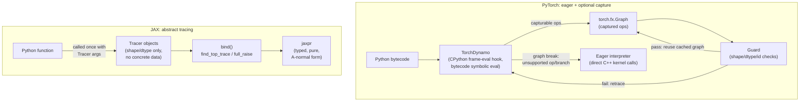
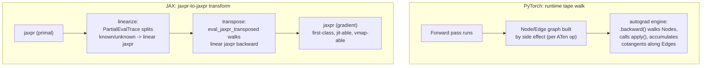
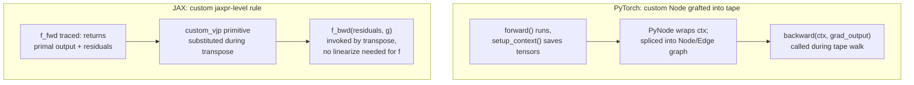
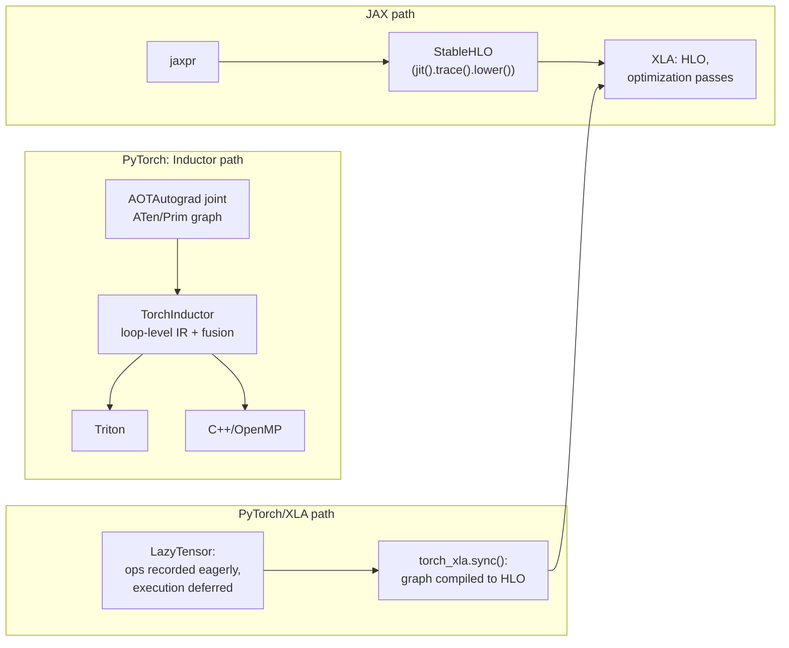
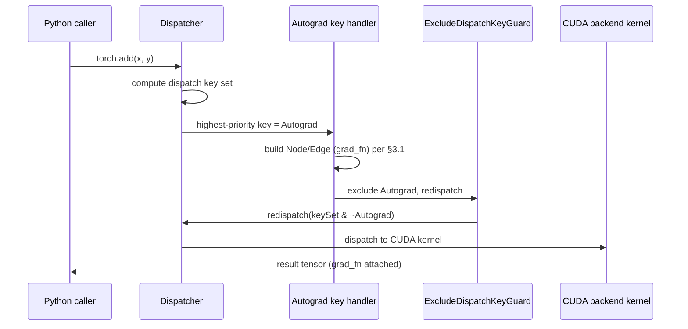
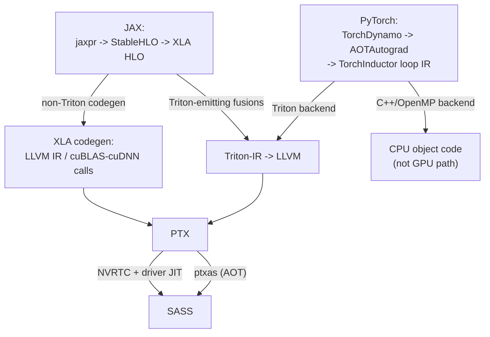

# Chapter 246: JAX and PyTorch Internals — Tracing, Autodiff, and Compilation

**Target audiences:** Systems and driver developers who need to know what actually runs on the
GPU underneath a training loop; graphics and ML application developers debugging `torch.compile`
graph breaks or unexpected JAX retracing; anyone who has read Chapter 245's tour of JAX's
user-facing API and wants to know what happens underneath `jax.jit` and `jax.grad`.

Chapter 245 covered JAX's programming model from the outside — `jax.numpy`, the core
transformations, pytrees, sharding APIs. This chapter opens the box, for both JAX and its
dominant peer, PyTorch. The two frameworks solve the same problem — turn Python numerical code
into optimized device kernels, with automatic differentiation along the way — from opposite
starting points: JAX traces pure functions into an explicit intermediate representation by
construction; PyTorch starts from eager, mutable, arbitrary Python and only optionally captures a
graph, tolerating whatever it cannot capture by falling back to the interpreter. Rather than
treating each framework as a separate silo, this chapter is organized by *mechanism* — graph
capture, purity, autodiff, lowering, runtime dispatch, distribution, and the final descent to
hardware — putting PyTorch and JAX side by side within each section. The compiler tier both
frameworks eventually reach is covered in [Chapter 91 §7](../part-04-mesa-architecture/ch91-mlir-gpu-compilation.md)
(HLO/MHLO/StableHLO/CHLO and the XLA pipeline) and is not restated here; this chapter owns the
front end — the Python-to-IR journey — and hands off at the StableHLO/Inductor boundary.

---

## Table of Contents

1. [Graph Capture](#1-graph-capture)
   - [1.1 PyTorch Eager Execution as the Baseline](#11-pytorch-eager-execution-as-the-baseline)
   - [1.2 TorchDynamo: Bytecode Analysis, Guards, and Graph Breaks](#12-torchdynamo-bytecode-analysis-guards-and-graph-breaks)
   - [1.3 JAX Tracing: Tracer Objects and jaxpr](#13-jax-tracing-tracer-objects-and-jaxpr)
2. [Functional Purity and What It Buys](#2-functional-purity-and-what-it-buys)
   - [2.1 Why JAX Forbids Side Effects During Tracing](#21-why-jax-forbids-side-effects-during-tracing)
   - [2.2 Why Dynamo Needs Guards Instead](#22-why-dynamo-needs-guards-instead)
3. [Autodiff Mechanics](#3-autodiff-mechanics)
   - [3.1 PyTorch's Tape-Based Autograd Engine](#31-pytorchs-tape-based-autograd-engine)
   - [3.2 AOTAutograd: Capturing the Joint Graph](#32-aotautograd-capturing-the-joint-graph)
   - [3.3 JAX's grad as a Jaxpr-to-Jaxpr Transform](#33-jaxs-grad-as-a-jaxpr-to-jaxpr-transform)
   - [3.4 Custom Gradient Rules](#34-custom-gradient-rules)
4. [Lowering and Codegen](#4-lowering-and-codegen)
   - [4.1 TorchInductor: Loop-Level IR to Triton and C++](#41-torchinductor-loop-level-ir-to-triton-and-c)
   - [4.2 JAX's Path: jaxpr to StableHLO](#42-jaxs-path-jaxpr-to-stablehlo)
   - [4.3 PyTorch/XLA: A Third Path](#43-pytorchxla-a-third-path)
   - [4.4 Beyond torch.compile: RL-Trained Kernel Generation](#44-beyond-torchcompile-rl-trained-kernel-generation)
5. [Runtime and Dispatch](#5-runtime-and-dispatch)
   - [5.1 The ATen Dispatcher](#51-the-aten-dispatcher)
   - [5.2 CUDA Streams and Graphs Under Eager Execution](#52-cuda-streams-and-graphs-under-eager-execution)
   - [5.3 PJRT: Compiled Executables and the jit Cache](#53-pjrt-compiled-executables-and-the-jit-cache)
6. [Distribution](#6-distribution)
   - [6.1 PyTorch DDP: Bucketed All-Reduce](#61-pytorch-ddp-bucketed-all-reduce)
   - [6.2 PyTorch FSDP: Sharding as Communication Scheduling](#62-pytorch-fsdp-sharding-as-communication-scheduling)
   - [6.3 JAX/XLA: GSPMD and shard_map as Compiler Mechanics](#63-jaxxla-gspmd-and-shard_map-as-compiler-mechanics)
7. [Reaching the Hardware](#7-reaching-the-hardware)
8. [Comparison Table](#8-comparison-table)
9. [Integrations](#9-integrations)
10. [Roadmap](#10-roadmap)

---

## 1. Graph Capture

### 1.1 PyTorch Eager Execution as the Baseline

PyTorch's default execution mode has no graph at all: each Python-level tensor operation calls
directly into a C++ kernel and returns a concrete result immediately. There is no staging step —
a Python `if` on a tensor's value works exactly as it would on any other Python object, because
by the time the `if` executes, the tensor already holds real data. This is what makes PyTorch
"eager": every operation is fully evaluated as the interpreter reaches it, and the model
definition *is* the model execution. `torch.compile` (built on TorchDynamo, described next)
layers optional graph capture on top of this without changing the default.

### 1.2 TorchDynamo: Bytecode Analysis, Guards, and Graph Breaks

TorchDynamo is `torch.compile`'s frontend. Rather than tracing at the tensor-operation level the
way earlier PyTorch graph-capture tools (`torch.jit.trace`, `torch.fx.symbolic_trace`) did, it
hooks CPython's frame evaluation API and performs symbolic evaluation of a function's *bytecode*,
one instruction at a time, interpreting Python control flow itself rather than only the tensor
operations embedded in it. As it walks the bytecode it accumulates a `torch.fx.Graph` — a
sequence of PyTorch operator calls — recording each tensor operation it observes.
[Source: UW PLSE, "How does torch.compile work?"](https://uwplse.org/2025/04/28/torchdynamo.html)

Because the input function can contain arbitrary Python — file I/O, third-party library calls,
data-dependent branching — Dynamo cannot always capture the whole function as one graph. Two
mechanisms make this tractable instead of requiring purity up front:

- **Guards.** For every captured graph, Dynamo emits a guard function: a set of boolean checks
  (tensor shape, dtype, device, Python-level scalar values, object identity) that must all hold
  for the cached compiled graph to be safely reused on a later call. If the guard passes, the
  compiled graph runs directly, skipping re-tracing and re-compilation entirely. If it fails —
  say, a tensor arrives with a different shape — Dynamo falls back to the Python interpreter for
  that call, retraces the new code path, and caches the new `(graph, guard)` pair alongside the
  old one.
  [Source: UW PLSE, "How does torch.compile work?"](https://uwplse.org/2025/04/28/torchdynamo.html)
- **Graph breaks.** When Dynamo hits something it cannot represent in an FX graph — a
  data-dependent Python branch on a value it does not know at trace time, an unsupported library
  call — it does not error out. It ends the current FX graph at that point, lets the Python
  interpreter execute the unsupported instruction(s) directly, and starts a new FX graph
  afterward. A single compiled function can therefore be split into several FX graphs stitched
  together by ordinary interpreted Python, at the cost of a CPU–GPU synchronization point at each
  break. [Source: UW PLSE, "How does torch.compile work?"](https://uwplse.org/2025/04/28/torchdynamo.html)

`torch._dynamo.explain` surfaces exactly this graph/guard/break structure for a given call:

```python
import torch

def f(x):
    if x.sum() > 0:      # data-dependent branch on a *traced* tensor's value
        return x * 2
    return x - 1

print(torch._dynamo.explain(f)(torch.randn(4)))
```
```text
Graph Count: 2
Graph Break Count: 1
Op Count: 3
Break Reasons: [GraphBreakReason(reason='...data-dependent branch...', ...)]
```
The `if x.sum() > 0` line is exactly the case §1.3 below rules out for JAX by construction: Dynamo
tolerates it by ending one FX graph, letting the interpreter evaluate the branch, and starting a
second FX graph — hence Graph Count: 2 for a one-branch function.
[Source: PyTorch docs, "Working with Graph Breaks"](https://docs.pytorch.org/docs/stable/compile/programming_model.graph_breaks_index.html)

This design is the direct consequence of Dynamo's starting assumption: the input is unrestricted
Python, so the compiler must be able to *give up gracefully* rather than reject the program.
Contrast this with JAX's tracing model below, which instead restricts what the traced function is
allowed to do in the first place.

### 1.3 JAX Tracing: Tracer Objects and jaxpr

`jax.jit` (and every other JAX transformation — `grad`, `vmap`, `pmap`) does not analyze Python
bytecode at all. It calls the user's function once, but with ordinary array arguments replaced by
**`Tracer`** objects — lightweight stand-ins that carry an abstract value (shape and dtype, not
concrete data) instead of real numbers. Every JAX primitive operation (`lax.add`, `lax.dot`,
etc.) checks its arguments through a `bind` call. `bind` finds the "top" active trace via
`find_top_trace`, "raises" any plain (non-Tracer) arguments into that trace's Tracer type via
`full_raise`, and asks the trace to `process_primitive` the operation — which is where a Tracer
records the operation instead of executing it numerically, and returns a new output `Tracer`
representing the (not-yet-computed) result. Ordinary Python control flow — `if`, `for`, function
calls — runs exactly as normal, but because Tracers propagate through any code that touches them,
whatever operations the traced function performs on those Tracers get recorded as a side effect
of simply running the Python function once.
[Source: JAX Autodidax tutorial](https://docs.jax.dev/en/latest/autodidax.html)

Autodidax's own pedagogical reference implementation (a from-scratch re-derivation of JAX's core
interpreter stack that mirrors, without being a literal copy of, `jax/core.py`) makes the
mechanism concrete:

```python
def bind(prim, *args, **params):
  top_trace = find_top_trace(args)
  tracers = [full_raise(top_trace, arg) for arg in args]
  outs = top_trace.process_primitive(prim, tracers, params)
  return [full_lower(out) for out in outs]

def find_top_trace(xs) -> Trace:
  top_main = max((x._trace.main for x in xs if isinstance(x, Tracer)),
                 default=trace_stack[0], key=op.attrgetter('level'))
  if dynamic_trace and dynamic_trace.level > top_main.level:
    top_main = dynamic_trace
  return top_main.trace_type(top_main)
```
`bind` looks up the currently active trace, lifts (`full_raise`) any plain values into that
trace's `Tracer` type, and asks the trace to `process_primitive` — the call this section's prose
describes above.
[Source: JAX Autodidax tutorial, "Part 1: Transformations as interpreters"](https://docs.jax.dev/en/latest/autodidax.html)

The recorded output is a **jaxpr**: JAX's own intermediate representation, explicitly typed,
purely functional, first-order, and in a restricted A-normal form — each `JaxprEqn` binds the
result of one primitive application to fresh variables, and a `Jaxpr` is a list of such equations
plus input/output variable lists (both are Python `NamedTuple`s in the reference
implementation). Building a jaxpr from a function is handled by a dedicated `JaxprTrace` /
`JaxprTracer` pair that plugs into the same generic `bind` machinery described above — jaxpr
construction is not a special case bolted onto tracing, it is one instantiation of the general
interpreter-stack pattern that `grad`, `vmap`, and `jit` all share.
[Source: JAX Autodidax tutorial](https://docs.jax.dev/en/latest/autodidax.html)

Building and printing a jaxpr for a trivial function shows the resulting IR directly:

```python
jaxpr, consts, _ = make_jaxpr_v1(lambda x: 2. * x,
                                  raise_to_shaped(get_aval(3.)))
print(jaxpr)
```
```text
{ lambda a:float64[] .
  let b:float64[] = mul 2.0 a
  in ( b ) }
```
(This is Autodidax's own pedagogical `make_jaxpr_v1`, built directly on the `bind` machinery
above; the printed form matches what production JAX's public `jax.make_jaxpr` emits for the same
function.) [Source: JAX Autodidax tutorial](https://docs.jax.dev/en/latest/autodidax.html)

Because tracing runs the Python function exactly once with abstract values, any Python-level
branch that depends on a *traced* value's concrete data cannot be resolved — there is no fallback
to "run it anyway and see": the value genuinely does not exist yet. This is the origin of JAX's
functional-purity requirement, covered next.



## 2. Functional Purity and What It Buys

### 2.1 Why JAX Forbids Side Effects During Tracing

A `Tracer` is a stand-in for a value that will exist only after compilation and execution — at
trace time it carries shape/dtype metadata, not data. Consequently:

- **Data-dependent Python control flow on a traced value is not just discouraged, it is
  impossible to satisfy correctly**: `if x > 0` needs a concrete boolean, and a Tracer cannot
  produce one without executing the computation, which is exactly what tracing exists to avoid
  doing eagerly. (JAX still supports data-dependent branching through explicit primitives —
  `lax.cond`, `lax.while_loop`, `lax.switch` — which get traced into the jaxpr as first-class
  branch/loop nodes rather than being resolved by the Python interpreter.)
- **Mutation and side effects (printing, appending to a Python list, mutating a global) do not
  compose with caching.** `jax.jit` traces a function once per distinct combination of input
  shapes/dtypes/static arguments and reuses the resulting compiled executable afterward
  (§5.3); a `print` or list-append embedded in the traced function only happens during that
  one tracing pass, not on every subsequent call, silently diverging from what the Python source
  appears to say happens on every call. This is a direct restatement, from the compiler side,
  of Chapter 245's `.at[idx].set(val)` functional-update discussion.

The purity requirement, in other words, is not a stylistic preference — it falls directly out of
the tracing mechanism in §1.3: a Tracer *is* an abstract placeholder, and anything that requires a
concrete value or an observable effect at trace time is asking the placeholder to do something it
structurally cannot.

### 2.2 Why Dynamo Needs Guards Instead

Dynamo starts from the opposite premise: the input function is arbitrary Python, mutation and all,
and it is not JAX's job (nor Dynamo's) to reject that. Instead of forbidding what tracing cannot
represent, Dynamo's guard-and-graph-break machinery (§1.2) accepts that some subset of any given
call will not be capturable and arranges to fall back to the real interpreter for exactly that
subset, on every call where the guard indicates it is still needed. The guard check is the
run-time price of tolerating impurity: JAX pays a strict up-front restriction on what code can be
traced at all; PyTorch pays a per-call guard-evaluation cost (and a potential graph break with a
synchronization point) in exchange for accepting unrestricted Python. Neither is free — they are
different points on the same trade-off between how much of the input language a tracer must
support and how much confidence the compiler can have that a cached artifact is still valid.

## 3. Autodiff Mechanics

### 3.1 PyTorch's Tape-Based Autograd Engine

PyTorch's autograd is built dynamically, during the forward pass, as a graph of `Node` and `Edge`
C++ objects. When a tensor is created with `requires_grad=True`, `TensorImpl` allocates an
`AutogradMeta` struct holding a `grad_` tensor and a `grad_fn` pointer.
[Source: PyTorch blog, "How Computational Graphs are Constructed in PyTorch"](https://pytorch.org/blog/computational-graphs-constructed-in-pytorch/)

Every differentiable ATen operation has an autograd-generated wrapper (produced at build time from
`tools/autograd/derivatives.yaml` by `gen_variable_type.py`) that, when any input requires a
gradient: allocates a `Node` subclass for that operation (e.g. `MulBackward0` for a
multiplication), collects `Edge` objects pointing back to each input's own `grad_fn` (or to a
gradient-accumulator `Node` for leaf tensors) via `collect_next_edges`, attaches those edges to the
new `Node` via `set_next_edges`, performs the actual redispatch to the real ATen kernel, and
finally writes the new `Node` onto the *output* tensor's `grad_fn` via `set_history`. `Node`
exposes a virtual `apply()` that each generated subclass overrides with the closed-form local
backward formula (a `MulBackward0::apply` for example computes each input's cotangent from the
incoming gradient and the *other* saved input). `torch.autograd.Function` lets users write this
same `Node`/`Edge` wiring by hand in Python via `forward`/`backward` static methods, wrapped in a
C++ `PyNode` that calls back into the Python interpreter when `apply` runs.
[Source: PyTorch blog, "How Computational Graphs are Constructed in PyTorch"](https://pytorch.org/blog/computational-graphs-constructed-in-pytorch/)

The result is a directed graph of `Node`s connected by `Edge`s — informally called a "tape" — that
is rebuilt from scratch on every forward pass. Because the graph reflects whatever Python control
flow the forward pass actually took (an `if` branch not taken this iteration simply does not
appear in this iteration's graph), the same model code can vary its control flow between calls
without any special handling — there is no cached graph to invalidate, because there was never a
cache in the eager path to begin with. `.backward()` walks this graph from the output `Node`(s)
back toward the leaves, invoking each `Node`'s `apply()` and accumulating gradients along shared
`Edge`s (a tensor used in more than one downstream operation receives the sum of the cotangents
flowing back along each edge).

Introspecting the tape directly on a small expression shows the `Node`/`Edge` structure the prose
above describes:

```python
>>> x = torch.tensor(2.0, requires_grad=True)
>>> y = torch.tensor(3.0, requires_grad=True)
>>> z = (x * y) + x
>>> z.grad_fn                     # the Node that produced z
<AddBackward0 object at 0x...>
>>> z.grad_fn.next_functions      # Edges to each input's own grad_fn
((<MulBackward0 object at 0x...>, 0), (<AccumulateGrad object at 0x...>, 0))
```
The second edge points to an `AccumulateGrad` node rather than another `*Backward0` node because
`x` is itself a leaf tensor — exactly the "gradient-accumulator `Node` for leaf tensors" the prose
above mentions.
[Source: PyTorch docs, "Autograd mechanics"](https://docs.pytorch.org/docs/stable/notes/autograd.html)

### 3.2 AOTAutograd: Capturing the Joint Graph

The tape described above is PyTorch's *eager* autodiff path — it exists independently of
`torch.compile` and predates it. Inside `torch.compile`, the FX graph that TorchDynamo hands off
(§1.2) is not directly what gets compiled; it first passes through **AOTAutograd**, which traces
both the forward *and* backward computation ahead of time (rather than deferring the backward
graph's construction to a later, separate `.backward()` call) and produces a single functional
joint graph. AOTAutograd uses a `__torch_dispatch__`-based tracing mechanism — intercepting at the
dispatcher level below Python (§5.1) rather than the bytecode level Dynamo operates at — and
represents the resulting joint graph as an `torch.fx.GraphModule`, purely as a container, not as
its own tracing mechanism. It also **functionalizes** the graph, rewriting any in-place mutation
into an equivalent out-of-place operation, and resolves tensor aliasing, so that the graph handed
to the backend compiler has the same purity properties JAX's tracer requires by construction. The
joint graph is then partitioned back into separate forward and backward graphs, each handed to the
configured backend compiler (TorchInductor by default, §4.1). Having both forward and backward
available ahead of time as one graph, rather than one appearing only once `.backward()` is called,
is what enables joint-graph optimizations such as recomputation/activation-checkpointing decisions
made across the forward/backward boundary.
[Source: PyTorch DeepWiki, "AOT Autograd and Functionalization"](https://deepwiki.com/pytorch/pytorch/2.4-aot-autograd-and-functionalization);
[Source: functorch AOT Autograd documentation](https://docs.pytorch.org/functorch/stable/aot_autograd.html)

`aot_export_module` (in `torch/_functorch/aot_autograd.py` — an underscore-prefixed, semi-public
module, not part of the frozen public API, but the standard inspection entry point) exposes the
resulting joint graph directly:

```python
from torch._functorch.aot_autograd import aot_export_module

# trace_joint=True asks for both forward and backward in one graph;
# it expects the traced module to return a scalar loss
gm, signature = aot_export_module(model, (example_input,), trace_joint=True)
gm.print_readable()   # the functionalized joint torch.fx.GraphModule
```
[Source: PyTorch source, `torch/_functorch/aot_autograd.py`](https://github.com/pytorch/pytorch/blob/main/torch/_functorch/aot_autograd.py)

### 3.3 JAX's grad as a Jaxpr-to-Jaxpr Transform

JAX's `grad` is not a special-cased backward-pass interpreter — it is implemented as a
*transformation from one jaxpr to another*, built out of two more primitive transformations:
**linearization** (forward-mode-flavored, producing `vjp` — vector-Jacobian product) and
**transposition**.

Linearization uses **partial evaluation**: a `PartialEvalTrace` splits a computation into a
"known" part (computable now, from concrete/static data) and an "unknown" part (depends on the
traced input), represented per-value as a `PartialVal`. This effectively "unzips" the original
jaxpr into a primal jaxpr (the forward computation, including whatever residual values the
backward pass will need) and a second, purely *linear* jaxpr expressing the Jacobian-vector
product as a function of an input tangent.
[Source: JAX Autodidax tutorial](https://docs.jax.dev/en/latest/autodidax.html)

Reverse-mode differentiation then falls out of a second transform, transposition, applied only to
that linear jaxpr: `eval_jaxpr_transposed` walks the linear jaxpr's equations *backward*, applying
each primitive's registered `transpose_rule` to propagate a cotangent from each equation's output
back to its inputs, accumulating cotangents where a value was consumed more than once. `grad` is
then simply: linearize the function to get the linear jaxpr, transpose that linear jaxpr, and
evaluate the transposed jaxpr on a seed cotangent (typically 1.0 for a scalar-valued function).
[Source: JAX Autodidax tutorial](https://docs.jax.dev/en/latest/autodidax.html)

The Autodidax reference implementation of `eval_jaxpr_transposed` shows the backward walk plainly
— it is a Python loop over `jaxpr.eqns[::-1]`, not a compiled kernel:

```python
def eval_jaxpr_transposed(jaxpr, args, cotangents):
  primal_env, ct_env = {}, {}
  def read_cotangent(v):
    return ct_env.pop(v, np.zeros(v.aval.shape, v.aval.dtype))
  def write_cotangent(x, val):
    if type(x) is Var and val is not None:
      ct_env[x] = add(ct_env[x], val) if x in ct_env else val

  map(write_primal, jaxpr.in_binders, args)
  map(write_cotangent, jaxpr.outs, cotangents)
  for eqn in jaxpr.eqns[::-1]:                      # walk the linear jaxpr backward
    primals_in = map(read_primal, eqn.inputs)
    cts_in = map(read_cotangent, eqn.out_binders)
    cts_out = transpose_rules[eqn.primitive](cts_in, *primals_in, **eqn.params)
    map(write_cotangent, eqn.inputs, cts_out)        # accumulate where a value fans out
  return [read_cotangent(v) for v, x in zip(jaxpr.in_binders, args) if type(x) is UndefPrimal]
```
(Trimmed for brevity — `read_primal`/`write_primal` and `UndefPrimal` handling are elided; see the
source for the full definition.) [Source: JAX Autodidax tutorial, "Part 3: reverse-mode autodiff"](https://docs.jax.dev/en/latest/autodidax.html)

The structural difference from §3.1 is worth stating plainly: PyTorch's `Node`/`Edge` graph is a
runtime data structure built by side effect as ATen kernels execute, walked once by an interpreter
loop (the autograd engine) at `.backward()` time. JAX's reverse-mode gradient is itself *another
jaxpr* — a first-class IR value that can be further traced, `jit`-compiled, `vmap`-ed over, or
composed with other transformations, because transposition is defined as a jaxpr-to-jaxpr
function rather than as an imperative graph walk over live objects.



### 3.4 Custom Gradient Rules

Both frameworks provide an escape hatch for operations whose derivative should not be derived
automatically — because it is numerically unstable to differentiate through directly, involves a
non-differentiable step, or calls out to code the autodiff system cannot trace at all (e.g. custom
CUDA kernels). PyTorch's mechanism is `torch.autograd.Function` (§3.1): a `forward`/`backward`
static-method pair the user writes directly, wired into the `Node`/`Edge` tape via `PyNode`. JAX's
mechanisms are `jax.custom_jvp` (register a custom forward-mode Jacobian-vector-product rule) and
`jax.custom_vjp` (register a custom reverse-mode rule directly, bypassing linearize-then-transpose
for that primitive) — both operate at the jaxpr-transformation level described in §3.3 rather than
by inserting a node into a runtime tape, consistent with autodiff being a program transform rather
than a graph interpreter in JAX's model.

A `torch.autograd.Function` subclass separates the traced forward computation from the context
setup a modern `torch.compile`-compatible implementation needs, via a dedicated `setup_context`
staticmethod rather than mutating `ctx` inside `forward` itself:

```python
class Exp(torch.autograd.Function):
    @staticmethod
    def forward(x):
        return torch.exp(x)

    @staticmethod
    def setup_context(ctx, inputs, output):
        x, = inputs
        ctx.save_for_backward(output)   # save the *output*, not x — exp'(x) == exp(x)

    @staticmethod
    def backward(ctx, grad_output):
        output, = ctx.saved_tensors
        return grad_output * output
```
[Source: PyTorch docs, "Extending torch.autograd"](https://docs.pytorch.org/docs/2.9/notes/extending.html)

`jax.custom_vjp` registers the forward/backward pair directly as a jaxpr-level rule, sidestepping
`linearize`/transpose entirely for the wrapped primitive:

```python
import jax

@jax.custom_vjp
def f(x, y):
    return jax.numpy.sin(x) * y

def f_fwd(x, y):
    return f(x, y), (jax.numpy.cos(x), jax.numpy.sin(x), y)   # primal output, residuals

def f_bwd(res, g):
    cos_x, sin_x, y = res
    return (cos_x * y * g, sin_x * g)                          # cotangents w.r.t. (x, y)

f.defvjp(f_fwd, f_bwd)
```
[Source: JAX docs, "Custom derivative rules"](https://docs.jax.dev/en/latest/notebooks/Custom_derivative_rules_for_Python_code.html)



## 4. Lowering and Codegen

### 4.1 TorchInductor: Loop-Level IR to Triton and C++

TorchInductor is `torch.compile`'s default backend compiler, taking the ATen/Prim-level joint (or
forward/backward-split) graph AOTAutograd produces as input. It lowers that graph further into its
own **loop-level intermediate representation** — a small, Python-implemented IR (on the order of a
few dozen operators) deliberately kept simple to make adding new operator lowerings easy — and
performs its own optimizations over that IR, notably fusion: grouping adjacent pointwise/reduction
operations into a single generated kernel rather than emitting one kernel launch per operator.
[Source: "Unleashing PyTorch Performance with TorchInductor"](https://blog.gopenai.com/unleashing-pytorch-performance-with-torchinductor-a-deep-dive-1f01e8b36efa)

From that fused loop-level IR, Inductor generates code through one of two backends: **Triton**
(OpenAI's GPU kernel language) for GPU targets, and vectorized, OpenMP-parallel **C++** for CPU
targets. [Source: "Unleashing PyTorch Performance with TorchInductor"](https://blog.gopenai.com/unleashing-pytorch-performance-with-torchinductor-a-deep-dive-1f01e8b36efa)
The Triton path is itself a further compilation stage — Triton lowers its own kernels through
Triton-IR down to PTX via LLVM, a step this chapter does not re-derive (see §7 and Chapter 66 for
what happens once PTX exists).

### 4.2 JAX's Path: jaxpr to StableHLO

JAX's lowering path is comparatively direct: the jaxpr produced by tracing (§1.3) is lowered to
**StableHLO**, the MLIR-based, versioned, portable operation set that [Chapter 91 §7](../part-04-mesa-architecture/ch91-mlir-gpu-compilation.md)
describes in full — its op set, its relationship to HLO/MHLO/CHLO, and the OpenXLA governance
structure around it. That chapter also covers what happens to StableHLO once it leaves JAX's hands
(lowering to HLO, XLA's optimization passes, and codegen to library calls, LLVM IR, or Triton
kernels). This chapter's contribution ends at the jaxpr→StableHLO emission step: unlike Inductor,
JAX itself does not choose Triton-vs-C++ or hand-roll a loop IR — that decision-making lives
entirely in XLA, downstream of the boundary this chapter hands off at.

The current API surfaces this lowering explicitly through a `trace`/`lower`/`as_text` chain on a
`jit`-wrapped function, rather than compiling straight to an executable:

```python
import jax

def f(x, y):
    return jax.numpy.sin(x) * y

lowered = jax.jit(f).trace(1.0, 2.0).lower()
print(lowered.as_text())   # StableHLO MLIR module text
```
[Source: JAX docs, "Understanding Jaxprs" / AOT compilation](https://docs.jax.dev/en/latest/aot.html)

### 4.3 PyTorch/XLA: A Third Path

PyTorch/XLA gives PyTorch a second graph-capture route into the same XLA backend JAX uses, and its
capture model differs from both TorchDynamo and JAX tracing: rather than analyzing bytecode
(Dynamo) or replacing inputs with abstract Tracers up front (JAX), PyTorch/XLA uses a **LazyTensor**
model. Operations on XLA-backed tensors execute eagerly from the Python caller's perspective but
are actually deferred — each op is recorded into an implicit, accumulating computation graph
rather than immediately dispatched to hardware, and this deferred graph is only compiled and
executed when a synchronization point is hit (historically implicit on results being read; more
recent versions expose this explicitly via `torch_xla.sync()`). This makes PyTorch/XLA graph
capture *value-driven* rather than *bytecode-driven* or *trace-abstraction-driven* — a third
distinct strategy for the same underlying problem of turning eager-looking Python into a
compilable graph. The PyTorch/XLA project's own repository signals an intended eventual
consolidation of this bridge — described there in terms of a successor project referred to
informally as "TorchTPU" — though the scope and timeline of that transition were not
independently verifiable at the time of writing, and any statement about a specific replacement
date should be treated as unconfirmed. *Note: needs verification against current PyTorch/XLA
project status before citing a specific migration timeline.*

```python
import torch_xla
import torch_xla.core.xla_model as xm

x = torch.randn(4, 4, device=xm.xla_device())
y = torch.randn(4, 4, device=xm.xla_device())
z = x @ y                    # recorded into the deferred graph, not yet executed
torch_xla.sync()             # explicit synchronization point: compile + execute the deferred graph
```
[Source: PyTorch/XLA docs, "LazyTensor guide"](https://docs.pytorch.org/xla/master/learn/lazytensor.html)



### 4.4 Beyond torch.compile: RL-Trained Kernel Generation

§4.1–§4.3 all describe *compilers* — deterministic transformations from a captured graph down to
Triton, C++, or HLO, tuned by fixed heuristics and autotuning sweeps over a bounded search space
(block sizes, tiling, fusion groups). **ByteDance's CUDA Agent** takes a different approach to
the same last-mile problem — generating a fast kernel for a given PyTorch operator — by training
an agent to write and iteratively optimize raw CUDA kernels through reinforcement learning
rather than through a fixed compiler pipeline.
[Source: ByteDance, "CUDA Agent"](https://cuda-agent.github.io)

The system has three components. A **data synthesis pipeline** builds roughly 6,000 training
tasks from real PyTorch operators, execution-tested and filtered so every task has a verified
correct reference implementation to grade against. A **skill-augmented environment** gives the
agent a ReAct-style write→compile→profile loop with explicit tools for profiling, compilation,
and debugging — the agent can inspect why a candidate kernel is slow or wrong and revise it,
rather than emitting one shot and stopping, which is the same iterate-and-verify structure a
human CUDA performance engineer would use manually. **Stable RL training** proceeds in stages:
single-turn supervised warmup, then Rejection Fine-Tuning on the agent's own best trajectories,
then multi-turn agentic RL with up to 128k context and as many as 150 training turns per task —
letting the training process reward a kernel not just for correctness but for measured speedup
over successive revisions.
[Source: ByteDance, "CUDA Agent"](https://cuda-agent.github.io)

On KernelBench, the reported results are a 98.8% overall pass rate and a 2.11x overall speedup
against `torch.compile` — the TorchInductor-generated Triton/C++ output §4.1 describes — with the
largest gains concentrated on the hardest optimization tasks, where the agent's reported results
outperform general-purpose coding models (Claude Opus, Gemini 3 Pro) prompted to write CUDA
directly rather than trained specifically on this task.
[Source: ByteDance, "CUDA Agent"](https://cuda-agent.github.io)

The relationship to §4.1's compiler pipeline is complementary rather than substitutive: Inductor
and Triton generate a kernel deterministically for *any* graph in bounded compile time, which is
what makes them usable as `torch.compile`'s default, always-on backend; an RL-trained kernel
agent instead spends a much larger, non-deterministic search budget (up to 150 iterative
write/profile/revise turns) chasing a better kernel for one specific, high-value operator — the
same "spend more compute for a bigger win on a narrower target" trade-off a human performance
engineer hand-tuning a hot kernel makes, rather than a competing default compilation path.
*Note: needs verification — the pass-rate and speedup figures above are as reported by ByteDance's
own project page; no independent reproduction of these benchmark results was performed for this
chapter.*

## 5. Runtime and Dispatch

### 5.1 The ATen Dispatcher

Every PyTorch operator call — `torch.add`, `x.mul(y)` — resolves to a specific kernel through
**the dispatcher**: conceptually a table of function pointers indexed by operator and by
**dispatch key**, where each key represents one cross-cutting concern (a device backend such as
CPU or CUDA, autograd, autocast, tracing, and others). Rather than selecting one key directly, the
dispatcher computes a **dispatch key set** — a bitset combining keys carried by the input tensors
themselves, a thread-local "locally included" set (used for modal functionality like tracing), a
global set, and a thread-local "locally excluded" set used to mask out keys that have already been
handled — and dispatches to whichever key has the highest priority among those still present after
exclusion. [Source: ezyang, "Let's talk about the PyTorch dispatcher"](https://blog.ezyang.com/2020/09/lets-talk-about-the-pytorch-dispatcher/)

Autograd illustrates why the exclusion set matters: when autograd is enabled, the Autograd key has
the highest priority, so the autograd handler runs first — this is exactly the code path that
builds the `Node`/`Edge` graph described in §3.1 — and then, via an RAII guard, adds Autograd to
the thread-local exclude set before **redispatching** the same operator call. The redispatch skips
the now-excluded Autograd key entirely and reaches the actual CPU/CUDA backend kernel, and the
guard ensures any *further* nested dispatches during that call also bypass autograd, preventing
infinite recursion back into the autograd handler.
[Source: ezyang, "Let's talk about the PyTorch dispatcher"](https://blog.ezyang.com/2020/09/lets-talk-about-the-pytorch-dispatcher/)

Kernels can be registered per exact (operator, key) pair, as a catch-all across all keys for one
operator, or as a fallback across all operators for one key, with the more specific registration
taking precedence. Because C++ kernels are statically typed but the dispatcher must also support
generic, reflective calling conventions (needed for things like the JIT tracer or
mobile/production deployment), PyTorch maintains two calling conventions side by side — an
"unboxed" convention using native C++ argument types, and a "boxed" convention passing arguments as
a generic `IValue` (a tagged union covering every type ATen operators can take or return) — with
automatic adapters bridging the two where a kernel and its caller disagree on convention.
`TensorImpl` is the object this whole machinery operates on: it owns the tensor's storage pointer,
shape/stride metadata, dtype, device, layout, and — as seen in §3.1 — the `AutogradMeta` pointer
that makes a tensor differentiable; the Python-visible `Tensor` object is a reference-counted
handle around a `TensorImpl`, not the storage itself.
[Source: ezyang, "Let's talk about the PyTorch dispatcher"](https://blog.ezyang.com/2020/09/lets-talk-about-the-pytorch-dispatcher/);
[Source: PyTorch blog, "How Computational Graphs are Constructed in PyTorch"](https://pytorch.org/blog/computational-graphs-constructed-in-pytorch/)

The redispatch-after-exclusion pattern described above is implemented directly in the C++ core,
via an RAII guard that pushes onto the thread-local excluded-key set for the scope of a call:

```cpp
// simplified from aten/src/ATen/core/dispatch/Dispatcher.h and
// c10/core/impl/LocalDispatchKeySet.h
{
  c10::impl::ExcludeDispatchKeyGuard guard(c10::DispatchKey::Autograd);
  // any dispatcher call made here has Autograd excluded from its key set
  return op.redispatch(dispatchKeySet & c10::after_autograd_keyset, args...);
}
// guard destructor restores the previous excluded-key set on scope exit
```
(Trimmed and simplified — the real call sites thread the dispatch key set through generated
per-operator boxed/unboxed wrappers rather than a single inline block.)
[Source: PyTorch source, `aten/src/ATen/core/dispatch/Dispatcher.h`](https://github.com/pytorch/pytorch/blob/main/aten/src/ATen/core/dispatch/Dispatcher.h)



### 5.2 CUDA Streams and Graphs Under Eager Execution

Eager dispatch, as described above, pays a real per-operation cost: every tensor op is a separate
Python-to-C++-to-dispatcher-to-kernel round trip, and on the GPU side, a separate kernel launch
with its own CPU-side launch overhead. PyTorch's answer for reducing that overhead without
requiring a full `torch.compile` capture is the same CUDA Graph capture-and-replay mechanism
covered in depth in [Chapter 66 §6](../part-15-nvidia-stack/ch66-cuda-runtime.md) (stream capture
in §6.1, updating captured graph parameters without reinstantiation in §6.2): a sequence of eager
PyTorch operations issued on a capturing CUDA stream is recorded once as a CUDA graph and can then
be replayed with a single launch, amortizing per-kernel launch overhead across all iterations that
reuse the same captured graph — a narrower, execution-time complement to the compile-time capture
strategies in §1.

```python
g = torch.cuda.CUDAGraph()

# warmup on a side stream first (not shown) — required before capture
with torch.cuda.graph(g):
    y = model(static_input)   # eager ops recorded once into g, not executed per-call

for _ in range(num_iters):
    static_input.copy_(next_batch())
    g.replay()                # single launch replays the whole recorded op sequence
```
[Source: PyTorch docs, "CUDA semantics" — Graphs](https://docs.pytorch.org/docs/2.9/notes/cuda.html#cuda-graphs)

### 5.3 PJRT: Compiled Executables and the jit Cache

Where PyTorch's runtime model centers on per-operation dispatch (§5.1), JAX's runtime model centers
on ahead-of-time-compiled, reusable executables. **PJRT** ("Pretty much Runs on Anything") is the
device-plugin interface JAX (and, via PyTorch/XLA, PyTorch) uses to talk to CPU, GPU, and TPU
backends: a `PjRtClient` manages all communication with a device and encapsulates the state needed
for that communication, and compiling a StableHLO/HLO program through that client yields a
`PjRtLoadedExecutable` — an in-memory compiled artifact, ready to be invoked directly with input
buffers, without any further compilation step.
[Source: OpenXLA, "PJRT C++ Device API Overview"](https://openxla.org/xla/pjrt/cpp_api_overview);
[Source: Google Open Source Blog, "PJRT: Simplifying ML Hardware and Framework Integration"](https://opensource.googleblog.com/2023/05/pjrt-simplifying-ml-hardware-and-framework-integration.html)

`jax.jit` sits on top of this: the first call with a given combination of input shapes, dtypes,
and static arguments triggers tracing (§1.3) and compilation, producing a `PjRtLoadedExecutable`
that is cached and keyed on that shape/dtype/static-argument signature; subsequent calls matching
the same signature skip tracing and compilation entirely and invoke the cached executable directly.
This is the JAX-side analogue of PyTorch's guard mechanism (§1.2, §2.2) — both frameworks avoid
redundant compilation by checking a cache key before falling back to a (re-)tracing path — but
where a Dynamo guard failure produces a partial graph break and continued eager execution for the
uncached portion, a `jax.jit` cache miss retraces and recompiles the *entire* function before any
of it runs, consistent with JAX's all-or-nothing, whole-function tracing model from §1.3.

## 6. Distribution

This section covers how each framework's distributed-training primitives become device-to-device
communication; the user-facing sharding API (`Mesh`, `NamedSharding`, `PartitionSpec`, `shard_map`)
is Chapter 245 §5's territory and is not repeated here.

### 6.1 PyTorch DDP: Bucketed All-Reduce

`DistributedDataParallel` replicates the full model on every rank and keeps replicas synchronized
by all-reducing gradients after each backward pass. Rather than issuing one all-reduce per
parameter (which would leave the network mostly idle waiting on many small transfers), DDP groups
parameter gradients into **buckets** — the parameter-to-bucket mapping is fixed at construction
time based on a bucket-size limit and each parameter's size — and issues one all-reduce per bucket.
Gradient-ready hooks fire as each parameter's backward computation completes, and once every
parameter in a bucket has a ready gradient, that bucket's all-reduce is launched, overlapping
communication for already-ready buckets with backward computation still running for the rest of
the graph.
[Source: "TAGC: Optimizing Gradient Communication in Distributed Transformer Training"](https://arxiv.org/pdf/2504.05638)

```python
import torch.distributed as dist
from torch.nn.parallel import DistributedDataParallel as DDP

dist.init_process_group("nccl", rank=rank, world_size=world_size)
model = MyModel().to(rank)
ddp_model = DDP(model, device_ids=[rank])   # wraps model, registers per-parameter grad hooks

loss = ddp_model(batch).mean()
loss.backward()          # bucketed all-reduces fire here, overlapped with backward compute
optimizer.step()
```
[Source: PyTorch docs, "Distributed Data Parallel"](https://docs.pytorch.org/docs/2.9/notes/ddp.html)

### 6.2 PyTorch FSDP: Sharding as Communication Scheduling

`FullyShardedDataParallel` keeps only a shard of each parameter, gradient, and optimizer state resident
per rank rather than a full replica. Mechanically, FSDP can be understood as decomposing DDP's
single all-reduce into two separate collectives: an **all-gather** (to reconstruct a full,
unsharded parameter — held internally as a `FlatParameter`, with the original per-tensor
parameters exposed as views into it — immediately before it is needed for compute) and a
**reduce-scatter** (to both reduce and re-shard the gradient immediately after it is produced,
rather than keeping a full unsharded copy anywhere). A registered gradient hook on the
`FlatParameter` performs this post-backward reduce-scatter. To avoid two back-to-back
communication calls stalling the backward pass, FSDP overlaps them: it issues the reduce-scatter
for the FlatParameter that just finished backward at the same time as the all-gather for the
*next* FlatParameter it will need (backward prefetching), and analogously prefetches the next
unit's all-gather during forward computation of the current one — both scheduled on separate CUDA
streams from the compute stream so communication and computation overlap rather than serialize.
[Source: "PyTorch FSDP: Experiences on Scaling Fully Sharded Data Parallel"](https://arxiv.org/pdf/2304.11277)

*Note: the `FlatParameter`-based mechanism described above is the original (FSDP1) design. As of
PyTorch 2.11, the recommended API is **FSDP2** (`fully_shard`), which replaces the single
flattened `FlatParameter` with per-parameter `DTensor` sharding — the communication-overlap
scheduling described above is the same idea, but classic `FullyShardedDataParallel` is now
considered deprecated in favor of it:*

```python
from torch.distributed.fsdp import fully_shard

for layer in model.layers:
    fully_shard(layer)     # shard each layer's parameters as DTensors
fully_shard(model)         # then the root module, wiring up prefetch order
```
[Source: PyTorch docs, "FullyShardedDataParallel"](https://docs.pytorch.org/docs/2.9/fsdp.html)

### 6.3 JAX/XLA: GSPMD and shard_map as Compiler Mechanics

JAX's sharding story runs through the same StableHLO/XLA pipeline as everything else in §4.2. When
a `jax.jit`-ed function's arguments and outputs carry sharding annotations (`NamedSharding` — the
user-facing API from Chapter 245 §5), or when `shard_map` demands explicit per-shard code, XLA's
**GSPMD** partitioner — a general SPMD partitioning pass operating on the HLO graph — propagates
sharding decisions across ops that were not explicitly annotated, using a priority-based
conflict-resolution scheme when an op's inputs carry incompatible sharding, and then rewrites the
whole-array HLO graph into a single per-device program (making compile time roughly constant in
the number of partitions, since only one program is compiled rather than one per device) with the
necessary collectives inserted directly into that program. GSPMD's resharding operations map onto
specific collectives: an **all-gather** to replicate data along a sharded dimension, an
**all-to-all** to move which dimension is sharded, **collective-permute** to reorder devices, and
**dynamic-slice** to shard a previously replicated dimension.
[Source: "GSPMD: General and Scalable Parallelization for ML Computation Graphs"](https://arxiv.org/pdf/2105.04663)
An MLIR-based successor to GSPMD's partitioning approach, referred to as **Shardy**, has been
under active development within the OpenXLA project, built from a merger of the GSPMD and PartIR
lines of work; its production-readiness and default status relative to GSPMD were not verified for
this chapter and should be checked against current OpenXLA documentation before relying on either
as "the current default." *Note: needs verification.*
[Source: OpenXLA, "Shardy Overview"](https://openxla.org/shardy/overview)

Where PyTorch's DDP/FSDP schedule collectives *explicitly*, as part of hooks the framework itself
wires into the backward pass (§6.1, §6.2), GSPMD's collectives are inserted *by the compiler*, as
a consequence of propagating sharding constraints through an already-captured HLO graph — a direct
extension of the graph-capture-first, compiler-driven pattern that distinguishes JAX's whole
pipeline from PyTorch's eager-dispatch-first one.

`shard_map` (now promoted to a top-level `jax.shard_map` API, paired with `jax.make_mesh`) is the
explicit counterpart to implicit `NamedSharding` propagation: the user writes per-shard code
directly, and the compiler inserts only the collectives that code's own logic requires:

```python
import jax
from jax.sharding import PartitionSpec as P

mesh = jax.make_mesh((8,), ('x',))

@jax.jit
def parallel_matmul(a, b):
    return jax.shard_map(
        lambda a, b: jax.numpy.dot(a, b),
        mesh=mesh, in_specs=(P('x', None), P(None, None)), out_specs=P('x', None),
    )(a, b)
```
[Source: JAX docs, "shard_map"](https://docs.jax.dev/en/latest/notebooks/shard_map.html)

```mermaid
graph TD
    subgraph "PyTorch DDP: framework-scheduled collectives"
        D1["backward() runs"] --> D2["grad-ready hooks fire\nper parameter"]
        D2 --> D3["bucket all-reduce\nissued explicitly by DDP"]
    end
    subgraph "PyTorch FSDP2: framework-scheduled, finer-grained"
        F1["fully_shard() wraps\neach layer as DTensor"] --> F2["forward: all-gather\nprefetched per unit"]
        F2 --> F3["backward: reduce-scatter\noverlapped with next all-gather"]
    end
    subgraph "JAX GSPMD/shard_map: compiler-inserted"
        J1["sharded jaxpr / StableHLO"] --> J2["GSPMD propagates sharding,\nresolves conflicts"]
        J2 --> J3["compiler inserts all-gather,\nall-to-all, collective-permute,\ndynamic-slice as needed"]
    end
```



## 7. Reaching the Hardware

Both lowering paths in §4 eventually produce GPU source that still has to become an actual
executable binary. TorchInductor's Triton backend and XLA's Triton-emission path for fusions
(noted in Chapter 91 §7.1) both hand generated kernels to Triton's own compiler, which lowers
through Triton-IR and LLVM to PTX. XLA's non-Triton codegen paths (direct LLVM IR emission, or
calls into cuBLAS/cuDNN) reach PTX or a prebuilt cubin by their own separate routes, covered in
Chapter 91 §7.1's codegen discussion. From PTX onward, every path converges on the same mechanisms
this book covers in [Chapter 66](../part-15-nvidia-stack/ch66-cuda-runtime.md): PTX generated or
loaded at run time is compiled to SASS either by the ahead-of-time `ptxas` assembler (Chapter 66
§1.5) or, for PTX embedded and JIT-compiled at load/run time, via NVRTC and the CUDA driver's own
JIT compiler (Chapter 66 §5, including the nvJitLink-based PTX-to-cubin path in §5.4). Neither
JAX's nor PyTorch's compiled paths bypass this final stage — it is the same driver-level JIT
boundary regardless of which framework, and which of Inductor/XLA, produced the PTX. For a
differently-layered GPU compilation path outside the ML-framework space entirely — one that
targets SPIR-V rather than PTX and does not route through either Triton or XLA —
[Chapter 152](../part-07a-gpu-apis/ch152-rust-gpu-ecosystem.md) covers the Rust GPU ecosystem's
`rustc`-based shader compilation as a point of comparison.



## 8. Comparison Table

| | Eager PyTorch | `torch.compile` | JAX (`jax.jit`) |
|---|---|---|---|
| Capture mechanism | None — direct dispatch per op | TorchDynamo: CPython bytecode analysis, guards, graph breaks | Abstract tracing: `Tracer` objects through `bind` |
| Captured IR | — | `torch.fx.Graph` → AOTAutograd joint graph | `jaxpr` |
| Purity requirement | None | None (guards + graph breaks tolerate impurity) | Required — traced function must be side-effect-free |
| Autodiff strategy | Tape: `Node`/`Edge` graph built at runtime, walked by `.backward()` | AOTAutograd: ahead-of-time joint forward+backward graph, functionalized | Program transform: linearize (partial eval) then transpose, itself a jaxpr |
| Default compiler backend | — (dispatcher → kernel directly) | TorchInductor: loop-level IR → Triton (GPU) / C+++OpenMP (CPU) | jaxpr → StableHLO → XLA (Ch91 §7) |
| Runtime compiled-artifact model | Per-op dispatch (§5.1); optional CUDA Graph replay | Guard-cached compiled graph, falls back to eager on miss | PJRT `PjRtLoadedExecutable`, cached on shape/dtype/static-arg signature |
| Distributed-training primitive | `DistributedDataParallel`: bucketed all-reduce | (same as eager/DDP, or FSDP) | GSPMD auto-partitioning or explicit `shard_map`, compiler-inserted collectives |

## 9. Integrations

- **Chapter 245 (The JAX Ecosystem)**: this chapter explains the mechanism behind the
  transformations Chapter 245 covers as user-facing API — §1.3 and §3.3 are the tracing and
  autodiff internals behind `jax.jit`/`jax.grad`/`jax.vmap`; §6.3 is the compiler-side mechanics
  behind Chapter 245 §5's `Mesh`/`NamedSharding`/`shard_map` sharding API.
- **Chapter 91 (MLIR and the Emerging GPU Compiler Infrastructure), §7**: owns the HLO/MHLO/
  StableHLO/CHLO ecosystem and the XLA compilation pipeline that §4.2 and §6.3 hand off into;
  this chapter does not restate that material.
- **Chapter 66 (CUDA Runtime, Streams, and NVRTC)**: §1.5 (`ptxas`), §5 (NVRTC and the CUDA
  driver's JIT path), and §6 (CUDA Graph capture and replay) are the mechanisms §5.2 and §7
  cross-reference for what happens once Inductor- or XLA-generated code reaches PTX.
- **Chapter 152 (Rust GPU Ecosystem)**: a differently-layered GPU compilation path (Rust →
  SPIR-V) referenced in §7 as a comparison point against the CUDA-centric paths this chapter
  traces.
- **Chapter 48 (ROCm and Machine Learning on Linux GPUs) and Chapter 108 (ROCm and HIP)**: own
  the ROCm/HIP install matrix and AMD backend status for both frameworks' compiled paths;
  referenced but not restated here.

## 10. Roadmap

### Near-term (6-12 months)
- **Shardy's rollout relative to GSPMD continues.** OpenXLA's Shardy partitioner (§6.3) has been
  developed as an MLIR-native successor to GSPMD's sharding-propagation approach; its trajectory
  toward becoming JAX's default partitioner, versus remaining an opt-in alternative alongside
  GSPMD, is worth tracking directly against OpenXLA's own documentation rather than assumed from
  this chapter.
  [Source: OpenXLA, "Shardy Overview"](https://openxla.org/shardy/overview)
- **`torch.compile`'s graph-break surface keeps shrinking.** Ongoing PyTorch work targets
  specific classes of graph breaks identified in real workloads (§1.2), reducing the frequency
  with which a `torch.compile`-wrapped model falls back to eager execution mid-function; the
  general guard-and-fallback architecture itself is not expected to be replaced, only its
  coverage extended.
  [Source: "GraphMend: Code Transformations for Fixing Graph Breaks in PyTorch 2"](https://arxiv.org/pdf/2509.16248)

### Medium-term (1-3 years)
- **PyTorch/XLA's relationship to `torch.compile`'s own XLA-independent path (§4.1) is likely to
  keep evolving**, given the signals (§4.3) that PyTorch/XLA's maintainers anticipate some form of
  successor project; whether that consolidates PyTorch's two distinct XLA-facing routes or leaves
  them as parallel options is not yet settled publicly.
- **Compiler-driven distribution (GSPMD/Shardy-style auto-partitioning) and explicitly-scheduled
  distribution (DDP/FSDP-style hook-based collectives, §6.1–§6.2) are likely to keep converging in
  capability** even as they remain architecturally distinct — PyTorch's own DTensor/`shard_map`-like
  work continues to bring compiler-assisted sharding decisions into a framework whose default
  distributed primitives have historically been hand-scheduled.

### Long-term
- **The front-end/back-end split this chapter is organized around — bytecode-and-guards tracing
  versus pure-functional tracing — looks likely to persist as a genuine design fork rather than
  converge**, since it follows directly from each framework's foundational commitment (arbitrary
  Python tolerance for PyTorch, functional purity for JAX) rather than from an incidental
  implementation choice either project would trivially abandon.
- **The hardware-facing tail of both pipelines (§7) is likely to keep converging further**, as
  more of PyTorch's own default compiled path (Inductor's Triton backend) and JAX/XLA's
  Triton-emission path for fusions both route increasingly large fractions of generated code
  through the same Triton→LLVM→PTX pipeline, narrowing what is actually framework-specific to the
  front-end stages this chapter covers.

---

*Copyright © 2026 jreuben11. Licensed under [CC BY 4.0](https://creativecommons.org/licenses/by/4.0/).*
