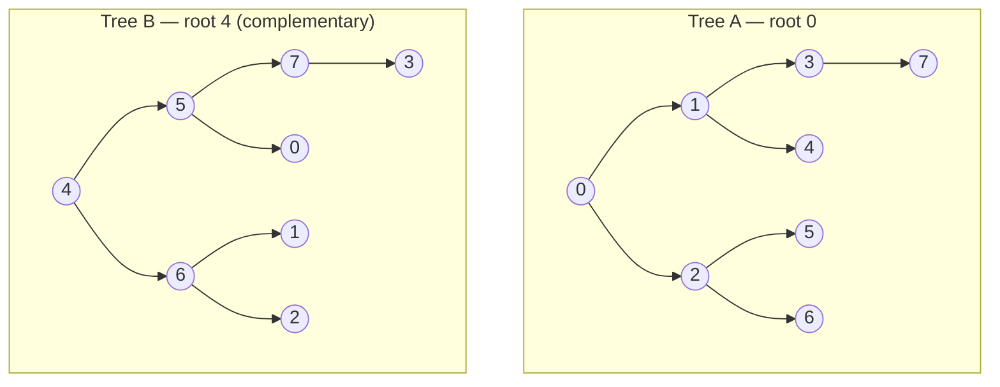
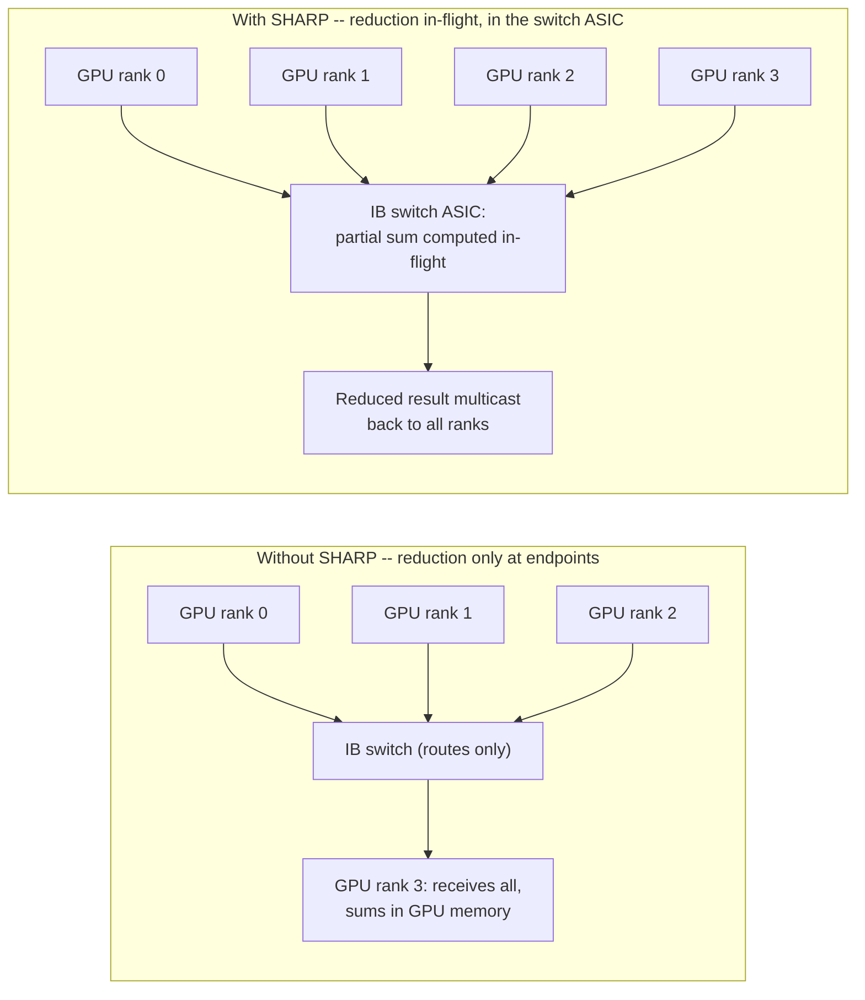
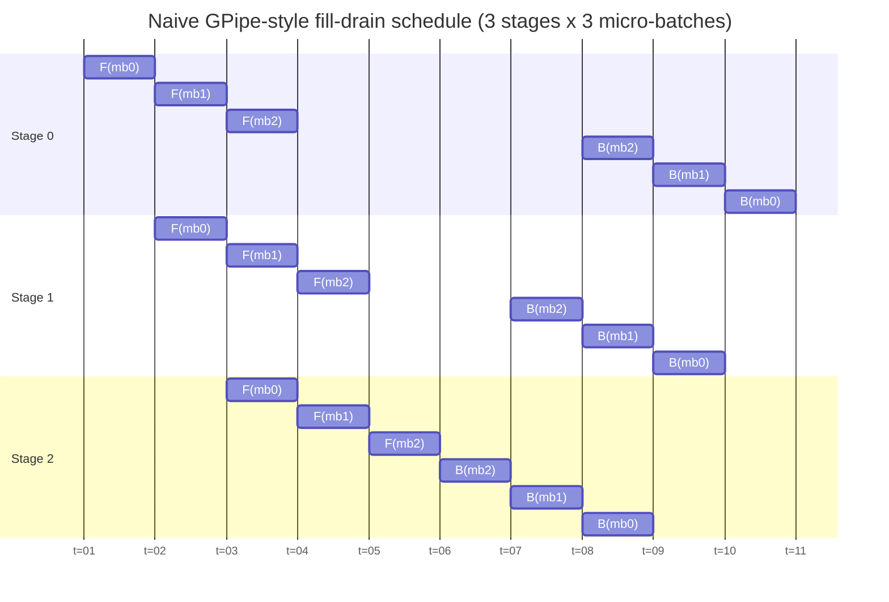
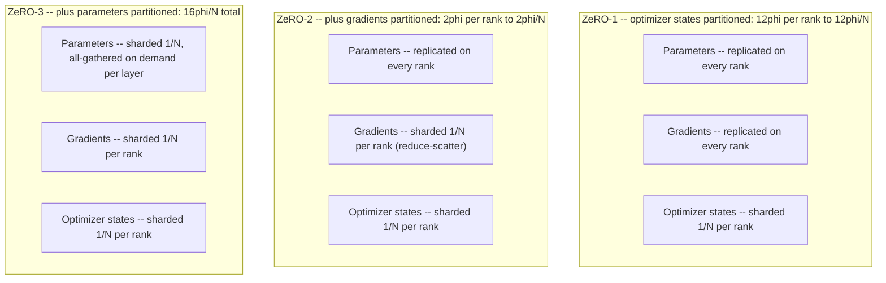
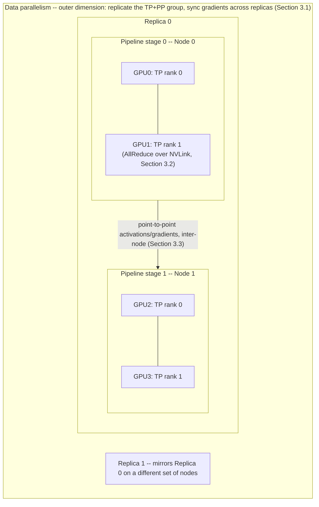
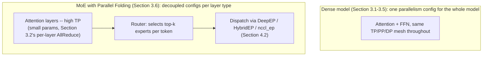
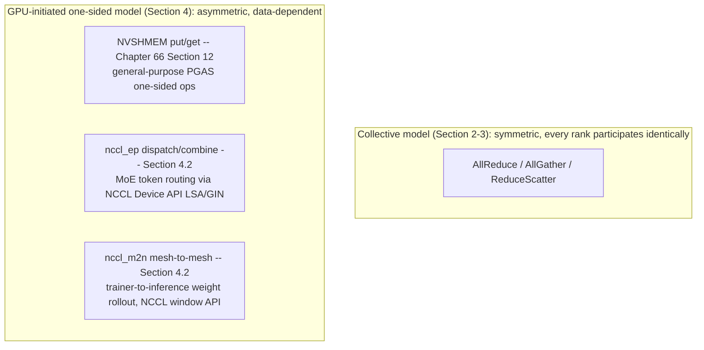
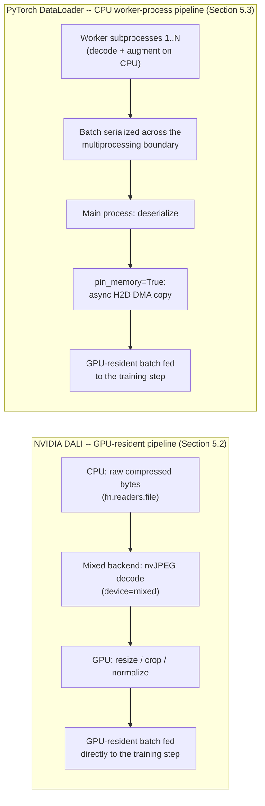
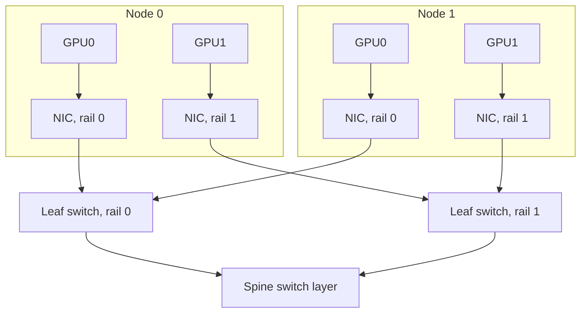
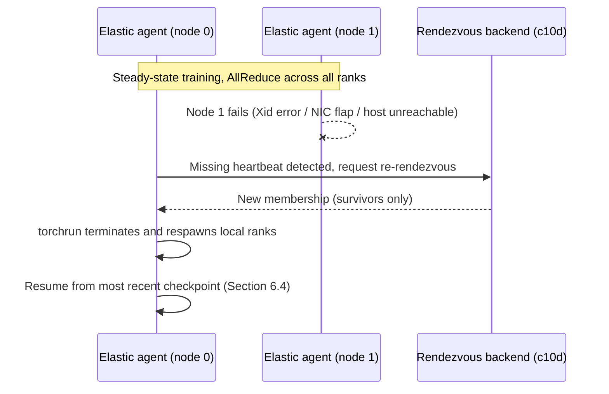

# Chapter 249: Distributed Training Infrastructure — NCCL/RCCL, Parallelism Strategies, and GPU Data Loading

**Target audiences:** AI/ML systems engineers building or operating multi-node training
clusters on Linux GPUs; systems developers who own the InfiniBand/RoCE fabric and Kubernetes
scheduling layer beneath a training job; anyone who has read Chapter 246's account of how a
single compiled training step reaches a GPU and wants to know what happens once that step has
to run identically, in lockstep, across hundreds of GPUs. Chapter 246 §6 covered DDP, FSDP,
and GSPMD as *framework mechanisms* — hooks and compiler passes that emit collectives. This
chapter covers what those collectives run on top of: the communication library, the strategies
for deciding what to shard and when, the data pipeline that has to keep every GPU fed, and the
cluster infrastructure that makes a multi-node job survivable. Chapter 66 §18 already documents
NCCL's core API, ring/tree AllReduce, and per-communicator transport selection in detail; this
chapter does not restate that material — it starts where Chapter 66 §18 stops, at multi-node
topology and the parallelism strategies built on top of NCCL's primitives.

---

## Table of Contents

1. [Scope: What This Chapter Assumes](#1-scope-what-this-chapter-assumes)
2. [Collective Communication at Multi-Node Scale](#2-collective-communication-at-multi-node-scale)
   - [2.1 Double Binary Tree: NCCL's Latency-Optimized Algorithm](#21-double-binary-tree-nccls-latency-optimized-algorithm)
   - [2.2 Topology-Aware Selection: NCCL_TOPO_FILE and Multi-Node Rings](#22-topology-aware-selection-nccl_topo_file-and-multi-node-rings)
   - [2.3 RCCL at Multi-Node Scale](#23-rccl-at-multi-node-scale)
   - [2.4 SHARP: In-Network Reduction Acceleration](#24-sharp-in-network-reduction-acceleration)
3. [Parallelism Strategies](#3-parallelism-strategies)
   - [3.1 Data Parallelism: Scaling DDP/FSDP Across Nodes](#31-data-parallelism-scaling-ddpfsdp-across-nodes)
   - [3.2 Tensor Parallelism: Intra-Layer Sharding](#32-tensor-parallelism-intra-layer-sharding)
   - [3.3 Pipeline Parallelism: Inter-Layer Sharding and the Bubble](#33-pipeline-parallelism-inter-layer-sharding-and-the-bubble)
   - [3.4 3D and Hybrid Parallelism: DeepSpeed ZeRO and Megatron-LM](#34-3d-and-hybrid-parallelism-deepspeed-zero-and-megatron-lm)
   - [3.5 JAX's Alternative: GSPMD and shard_map](#35-jaxs-alternative-gspmd-and-shard_map)
   - [3.6 Expert Parallelism: Megatron Core's Parallel Folding for MoE](#36-expert-parallelism-megatron-cores-parallel-folding-for-moe)
   - [3.7 TorchTitan: A PyTorch-Native Training Platform](#37-torchtitan-a-pytorch-native-training-platform)
   - [3.8 DistributedDataParallel (DDP)](#38-distributeddataparallel-ddp)
   - [3.9 Fully Sharded Data Parallel (FSDP2)](#39-fully-sharded-data-parallel-fsdp2)
   - [3.10 Tensor Parallel (TP)](#310-tensor-parallel-tp)
   - [3.11 Device Mesh](#311-device-mesh)
   - [3.12 RPC-based Distributed Training](#312-rpc-based-distributed-training)
   - [3.13 Monarch Framework](#313-monarch-framework)
   - [3.14 Custom Extensions](#314-custom-extensions)
4. [GPU-Initiated Communication: NVSHMEM and NCCL Extensions](#4-gpu-initiated-communication-nvshmem-and-nccl-extensions)
   - [4.1 NVSHMEM: One-Sided Communication for Data-Dependent Communication Patterns](#41-nvshmem-one-sided-communication-for-data-dependent-communication-patterns)
   - [4.2 nccl-extensions: nccl_ep and nccl_m2n](#42-nccl-extensions-nccl_ep-and-nccl_m2n)
5. [GPU-Accelerated Data Loading](#5-gpu-accelerated-data-loading)
   - [5.1 The CPU Data-Loading Bottleneck](#51-the-cpu-data-loading-bottleneck)
   - [5.2 NVIDIA DALI: A GPU-Resident Pipeline](#52-nvidia-dali-a-gpu-resident-pipeline)
   - [5.3 PyTorch DataLoader: Worker-Process Prefetching](#53-pytorch-dataloader-worker-process-prefetching)
   - [5.4 JAX Input Pipelines: tf.data and Grain](#54-jax-input-pipelines-tfdata-and-grain)
6. [Cluster Topology and Scheduling](#6-cluster-topology-and-scheduling)
   - [6.1 InfiniBand and RoCE Fabric Considerations](#61-infiniband-and-roce-fabric-considerations)
   - [6.2 Kubernetes GPU Scheduling for Training Jobs](#62-kubernetes-gpu-scheduling-for-training-jobs)
   - [6.3 Elastic and Fault-Tolerant Restart](#63-elastic-and-fault-tolerant-restart)
   - [6.4 Checkpointing at Scale](#64-checkpointing-at-scale)
   - [6.5 Experiment Tracking and Data Versioning: Weights & Biases and DVC](#65-experiment-tracking-and-data-versioning-weights--biases-and-dvc)
   - [6.6 LLM Output Evaluation: DeepEval](#66-llm-output-evaluation-deepeval)
   - [6.7 GPU Health Diagnostics and Management: DCGM, Xid Errors, and Fabric Manager](#67-gpu-health-diagnostics-and-management-dcgm-xid-errors-and-fabric-manager)
7. [Integrations](#7-integrations)
8. [Roadmap](#8-roadmap)

---

## 1. Scope: What This Chapter Assumes

This chapter assumes Chapter 66 §18's coverage of NCCL's core API (`ncclCommInitRank`,
`ncclAllReduce`/`ncclReduceScatter`/`ncclAllGather`, `ncclGroupStart`/`ncclGroupEnd`),
single-communicator ring- and tree-AllReduce mechanics, and per-communicator transport
selection (NVLink vs. PCIe vs. InfiniBand) as already covered — this chapter does not
re-derive any of it. It also assumes Chapter 246 §6's account of *how* PyTorch DDP/FSDP and
JAX GSPMD/`shard_map` turn framework-level sharding decisions into collective calls; this
chapter is about what happens once those collectives have to run across more than one node,
and about the strategic question DDP/FSDP/GSPMD leave open — *which* parallelism strategy, or
combination of strategies, a given model and cluster size actually calls for. It also assumes
the NVLink/NVSwitch peer-to-peer DMA primitives from Chapters 4 and 49, and the single-node
multi-GPU partitioning pattern already introduced for rendering workloads in Chapter 69.

## 2. Collective Communication at Multi-Node Scale

### 2.1 Double Binary Tree: NCCL's Latency-Optimized Algorithm

Chapter 66 §18.3 describes NCCL's tree-AllReduce as a latency-optimized alternative to the
ring algorithm for small tensors, without detailing its internal structure. The specific
algorithm NCCL uses, from NCCL 2.4 onward, is a **double binary tree**. A single binary tree
used for reduction is bandwidth-inefficient because roughly half of all ranks are leaves that
each handle only one link's worth of traffic, while interior nodes carry disproportionately
more; NCCL's double binary tree exploits the fact that in a binary tree with N ranks, at most
half of the ranks are interior nodes and at least half are leaves, so a second, complementary
binary tree can be constructed in which every leaf of the first tree becomes an interior node
of the second and vice versa. Running an AllReduce over both trees simultaneously — half of
each rank's data on each tree — means every rank does both interior-node and leaf work, and
the two trees together give full bandwidth utilization at logarithmic latency, rather than the
linear latency ring-AllReduce pays as node count grows.
[Source: NCCL 2.4 double binary tree design](https://github.com/NVIDIA/nccl/issues/272)

The practical consequence is that NCCL's algorithm choice is not simply "ring for large
tensors, tree for small ones" as a fixed cutoff; NCCL builds both ring and (double binary)
tree topologies over the detected hardware graph during communicator initialization and
selects per-call based on message size and the cost model computed from the detected topology,
with `NCCL_ALGO` (accepting `Ring`, `Tree`, or a comma-separated set) available to force one
explicitly for benchmarking or debugging. At multi-node scale, the tree topology is
particularly important because it is the mechanism that bounds AllReduce latency growth to
`O(log N)` in the number of participating GPUs, which matters directly for the small,
frequent, latency-sensitive collectives that tensor parallelism (§3.2) issues inside every
transformer layer, as distinct from the large, infrequent, bandwidth-bound AllReduce a
data-parallel gradient sync issues once per step.

The complementary-tree construction, concretely, for 8 ranks: every rank is a leaf in exactly
one tree and an interior node in the other, so every rank does both kinds of work across the
two trees combined.



Ranks `{4,5,6,7}` are leaves of Tree A and interior nodes of Tree B; ranks `{0,1,2,3}` are
interior nodes of Tree A and leaves of Tree B — the exact swap the prose above describes, run
simultaneously with half of each rank's chunk on each tree.
[Source: NCCL 2.4 double binary tree design](https://github.com/NVIDIA/nccl/issues/272)

### 2.2 Topology-Aware Selection: NCCL_TOPO_FILE and Multi-Node Rings

Chapter 66 §18.4 covers NCCL's per-communicator transport probing (NVLink, PCIe, InfiniBand)
at communicator init time. At cluster scale, that probing is driven by an explicit topology
model rather than only live hardware queries. NCCL builds an internal topology graph — GPUs,
NICs, CPUs/NUMA nodes, and the PCIe/NVLink/network links between them — by combining what it
discovers via `nvidia-smi`-equivalent queries and `/sys` PCIe topology with, optionally, a
pre-supplied description. **`NCCL_TOPO_FILE`** points NCCL at an XML file describing this
topology in place of (or supplementing) live auto-detection, which is useful in environments
where NCCL's live probing does not see the true fabric layout — virtualized/containerized
GPU environments where PCIe topology is obscured, or clusters where an operator wants to pin
a known-good topology rather than rely on re-detection on every job launch. NCCL defaults to
loading a system-provided topology file at `/var/run/nvidia-topologyd/virtualTopology.xml` if
one is present, and **`NCCL_TOPO_DUMP_FILE`** writes NCCL's own detected topology back out to
XML, which is the standard way to capture a known-good topology description for later reuse
via `NCCL_TOPO_FILE`.
[Source: NCCL environment variables reference](https://docs.nvidia.com/deeplearning/nccl/user-guide/docs/env.html)

```bash
# Pin a known-good topology, capture the live-detected one for later reuse,
# and keep every ring/tree channel on its assigned NIC (rail).
NCCL_TOPO_FILE=/etc/nccl/cluster-topology.xml \
NCCL_TOPO_DUMP_FILE=/var/log/nccl/detected-topology.xml \
NCCL_CROSS_NIC=0 \
torchrun --nnodes=4 --nproc-per-node=8 --rdzv-backend=c10d train.py
```
[Source: NCCL environment variables reference](https://docs.nvidia.com/deeplearning/nccl/user-guide/docs/env.html)

This topology graph is what NCCL's channel-search algorithm consumes to build its rings and
(double binary) trees across an entire multi-node job rather than a single node's GPUs: rings
and trees are constructed to traverse the fastest available path between adjacent members —
NVLink/NVSwitch within a node, then GPUDirect RDMA over InfiniBand or RoCE between nodes — and
**`NCCL_CROSS_NIC`** controls whether a given ring or tree is allowed to switch which physical
NIC it uses partway through, trading strict same-NIC-per-channel locality (avoiding crossing
network rails, `NCCL_CROSS_NIC=0`) against the flexibility to route around a congested or
unavailable path (`NCCL_CROSS_NIC=1`, or NCCL's topology-dependent default of `2`).
[Source: NCCL environment variables reference](https://docs.nvidia.com/deeplearning/nccl/user-guide/docs/env.html)
This is the mechanism that connects the fabric design decisions in §6.1 (rail-optimized
topology, which NIC a given GPU is wired to) to the collective algorithm NCCL actually runs: a
rail-optimized fabric is specifically designed so that the GPU-to-NIC mapping NCCL's topology
graph discovers lines up with the ring/tree structure NCCL wants to build, minimizing the
cross-rail hops that `NCCL_CROSS_NIC` would otherwise have to negotiate.

### 2.3 RCCL at Multi-Node Scale

Chapter 66 §18.6 and Chapter 48's RCCL section cover RCCL as an ABI-compatible NCCL
replacement for AMD GPUs, using Infinity Fabric/XGMI intra-node and InfiniBand (via
UCX/RDMA) or RoCE inter-node. The topology-graph and channel-search model described above is
architecturally the same on RCCL's side — RCCL performs its own topology detection via
`rocm_agent_enumerator` and constructs ring/tree channels across the detected XGMI and network
links (Chapter 48's RCCL section) — but the concrete transport bandwidths differ: an 8-GPU
MI300X node's fully-connected XGMI mesh gives every GPU direct peer-to-peer DMA to every other
GPU in the node (Chapter 48), which changes the intra-node portion of the topology graph RCCL
builds relative to a partially-connected NVLink/NVSwitch topology, while the inter-node
portion converges on the same InfiniBand/RoCE fabric considerations covered in §6.1 regardless
of GPU vendor. AMD's ROCm roadmap has signaled a new RDMA transport layer, referred to as ROCm
Optiq, intended to eventually replace RCCL's current libfabric-based network backend for
scale-out InfiniBand clusters (noted in Chapter 48's roadmap); its production maturity was not
independently verified for this chapter. *Note: needs verification against current ROCm
release notes before citing Optiq as shipping.*

Set against §4's NVSHMEM and nccl-extensions coverage, RCCL is closer to parity with NCCL on
GPU-initiated, device-API-driven communication than the "NVIDIA ships it, AMD doesn't" framing
of §4 might suggest — the gap is narrower there than it is for §2.4's SHARP. RCCL's own source
tree carries a `src/gin/` subsystem implementing **GIN (GPU-Initiated Networking)** — RCCL's
name for the same class of capability §4.2 describes for NCCL's Device API: collective
operations issued directly from GPU kernels, bypassing the host-side proxy thread. It ships two
backends selected via `NCCL_GIN_TYPE` — a GDA (GPU Direct Async) backend that posts InfiniBand
QueuePair work requests from device code, built on **rocSHMEM**, and an "Anvil SDMA" backend
that drives AMD's SDMA engine directly from the GPU — plus a rocSHMEM-linked `alltoall_wg`
offload path in RCCL itself, which is functionally the same MoE-token-dispatch shape `nccl_ep`
(§4.2) targets. The organizational difference is that AMD folded this into RCCL's core rather
than shipping a separate extensions repository the way NVIDIA does; no AMD equivalent of
`nccl_m2n`'s disjoint trainer/inference mesh-to-mesh rollout was found.
[Source: ROCm/rccl, `src/gin/README.md`](https://github.com/ROCm/rocm-systems/blob/develop/projects/rccl/src/gin/README.md)

On the NVSHMEM side (§4.1), AMD's direct analogue is **rocSHMEM**, an OpenSHMEM-like,
GPU-centric one-sided communication library with the same symmetric-heap model, offering three
backends: IPC (load/store), Reverse Offload (host-forwarded to a CPU-side MPI/OpenSHMEM
implementation), and GDA (the same device-to-NIC-direct path RCCL's GIN GDA backend builds on).
*Note: needs verification — rocSHMEM's own documentation describes the RO and GDA backends as
"provided as-is with limited support from AMD or AMD Research," which reads as less
production-hardened than NVSHMEM's status inside NVIDIA's stack; treat rocSHMEM as functional
parity in design, not yet confirmed parity in maturity.*
[Source: ROCm/rocSHMEM README](https://github.com/ROCm/rocm-systems/blob/develop/projects/rocshmem/README.md)

### 2.4 SHARP: In-Network Reduction Acceleration

§2.1's double binary tree and §2.2's topology-aware channel construction both optimize *where*
NCCL's ring/tree AllReduce traffic flows, but the reduction arithmetic itself still happens at
the endpoints — GPUs (or, in the ring case, NICs performing GPUDirect RDMA writes into
neighboring GPU memory) doing the actual summation. **SHARP** (Scalable Hierarchical
Aggregation and Reduction Protocol) is NVIDIA's in-network computing technology for NVIDIA
Quantum InfiniBand switches: the switch ASIC itself performs partial reductions on data as it
transits the fabric, rather than only routing it, so gradients are summed *in-flight* instead
of being routed to every participating rank for endpoint-side summation. This is a genuinely
different mechanism from §2.1's tree algorithm, not merely a faster implementation of it — a
software tree still moves every byte to an endpoint that adds it; SHARP removes most of that
endpoint arithmetic and a large fraction of the associated data movement entirely, at the cost
of requiring specific switch hardware and firmware rather than running over commodity IB/RoCE
fabric.
[Source: NVIDIA, "In-Network Computing With NVIDIA SHARP"](https://resources.nvidia.com/en-us-accelerated-networking-resource-library/network-computing-nvidia-sharp)

NCCL exposes SHARP through **CollNet**, and it is worth being precise about what CollNet
actually is: it is a *plugin interface*, not a piece of hardware or a fixed implementation.
NCCL's network plugin API (`ncclNet`) covers ordinary point-to-point send/receive; CollNet is a
separate, optional companion struct a network plugin can *additionally* implement to expose
in-network collective operations to NCCL. NCCL itself contains no in-network reduction logic —
it only knows how to call into a CollNet-capable plugin if one is present and one of the
CollNet-family algorithms (`Collnet`/`CollnetChain`/`CollnetDirect`, selected via `NCCL_ALGO`)
is selected for a given collective. Whether CollNet actually accelerates anything therefore
depends entirely on which plugin, if any, is loaded. NVIDIA's own CollNet implementation is the
**NCCL-RDMA-SHARP plugin** (`libnccl-net.so`, shipped as part of NVIDIA's HPC-X/MLNX_OFED
stack), which is what actually talks to Quantum InfiniBand switches and drives SHARP's in-switch
aggregation — CollNet is the socket, the RDMA-SHARP plugin is what plugs into it. Enabling the
NVIDIA path is a communicator-init-time environment decision, not a per-call one:

```bash
# Enable the CollNet transport and let NCCL prefer it for AllReduce/AllGather/ReduceScatter
# where a SHARP-capable path exists across the whole communicator.
NCCL_COLLNET_ENABLE=1 \
NCCL_ALGO=CollNet \
LD_LIBRARY_PATH=/opt/hpcx/nccl_rdma_sharp_plugin/lib:$LD_LIBRARY_PATH \
torchrun --nnodes=4 --nproc-per-node=8 --rdzv-backend=c10d train.py
```
[Source: NVIDIA, "NCCL-RDMA-SHARP Plugins"](https://networking-docs.nvidia.com/hpcxum/2131lts/nccl-rdma-sharp-plugins)

CollNet/SHARP has real prerequisites beyond the environment variables above: **NVIDIA Quantum-2
InfiniBand switches** running SHARP-capable firmware, **ConnectX-6 Dx or ConnectX-7** HCAs, and
a **SHARP Aggregation Manager** daemon running on the cluster to allocate and coordinate the
limited number of concurrent aggregation trees the switch fabric can support — SHARP is not a
feature that appears simply by upgrading NCCL, and does not run over RoCE, only InfiniBand.
CollNet/SHARP support for the AllReduce algorithm itself dates to NCCL 2.19; NCCL 2.27 extended
SHARP acceleration to AllGather and ReduceScatter as well, and — notably for §3.4's ZeRO/FSDP
traffic pattern, which is dominated by reduce-scatter and all-gather rather than AllReduce —
combined it with **NVLS** (NVLink SHARP, §2.1's complementary-tree algorithm's hardware-
accelerated sibling, built on NVSwitch multicast) into a two-tier reduction: NVLS performs the
in-node reduction across a node's GPUs using NVSwitch's SHARP-capable multicast hardware, and
IB SHARP performs the inter-node reduction across nodes, so that the switch fabric does
reduction work at both the intra-node and inter-node hop rather than only one. This is the
relationship to keep straight against Chapter 66's brief mention of an "NVLink SHARP-capable
switch fabric" in its NVLS discussion: that is the intra-node, NVSwitch-domain half of this same
two-tier design, not a separate technology — this section's InfiniBand-fabric SHARP is the
inter-node half.
[Source: NVIDIA Developer Blog, "Enabling Fast Inference and Resilient Training with NCCL 2.27"](https://developer.nvidia.com/blog/enabling-fast-inference-and-resilient-training-with-nccl-2-27/)



Reported gains are workload- and scale-dependent: NVIDIA has cited up to 2.5x higher collective
throughput with SHARP-accelerated NCCL relative to non-SHARP paths, and a roughly 2.7x reduction
in the number of streaming multiprocessors a collective call occupies (6 SMs per GPU versus 16
for a traditional ring-based collective) — SMs a SHARP-offloaded collective frees up are SMs the
overlapping compute kernel gets to keep, which matters most for the small, frequent,
latency-sensitive AllReduces §2.1 already identified as the case the tree algorithm is optimized
for (tensor parallelism's per-layer boundary, §3.2). *Note: needs verification — these figures
come from NVIDIA marketing/blog material rather than an independently reproduced benchmark; treat
as directional rather than a guaranteed multiplier for any specific cluster and workload.*
[Source: NVIDIA, "In-Network Computing With NVIDIA SHARP"](https://resources.nvidia.com/en-us-accelerated-networking-resource-library/network-computing-nvidia-sharp)

Unlike §2.3's GIN/rocSHMEM comparison, this is the one place where RCCL trails NCCL for a
structural, not merely maturity, reason. RCCL's own codebase still carries the CollNet plugin
interface and NVLS/SHARP documentation it inherited from its NCCL fork lineage — down to doc
text describing "third-generation NVSwitch systems... Hopper and later GPU architectures,"
which is stale NVIDIA-specific boilerplate rather than anything functional on AMD hardware. That
inherited plugin *interface* means a switch vendor could in principle write a CollNet plugin for
RCCL, but no such plugin was found to exist. The underlying reason this gap persists is that
SHARP is switch-ASIC silicon NVIDIA acquired with Mellanox and controls end to end — it is not
something AMD can add by writing more RCCL code, only by a switch vendor choosing to build and
ship a CollNet implementation against RCCL's inherited plugin surface. AMD's own intra-node
fabric (Infinity Fabric/XGMI, §2.3) likewise has no published NVLS-equivalent multicast-reduction
capability. *Note: needs verification — absence of a public CollNet/SHARP plugin for RCCL is
based on not finding one, not on a vendor statement that none exists; worth rechecking against
current ROCm and Mellanox/NVIDIA-switch-ecosystem documentation before treating this as a
permanent gap.*

NVIDIA's own switch-side SHARP product documentation (the "SHARP Update Manager" / `sharpum`
docs, currently at revision 3.8.0 against Quantum-2-generation firmware) gives the multi-tenant
capacity numbers behind the "limited number of concurrent aggregation trees" constraint noted
above: a Quantum-2 (NDR, QM9700-series) switch supports up to **1023 aggregation trees per
subnet — 511 low-latency (LL) trees and 511 streaming-aggregation trees** — with multiple
streaming-aggregation operations able to run concurrently on a single switch ASIC. The LL/
streaming split matters operationally: LL trees are the small-message, latency-sensitive path
§2.1 already covers as the tree algorithm's target case, while streaming trees are built for
the sustained, high-volume aggregation of ML gradient reduction, where SHARP incrementally
aggregates arriving partial sums rather than waiting for a complete message before reducing.
Which tree class a job draws from — and how many of the subnet's 1023 total trees are free — is
managed by the **SHARP Aggregation Manager** referenced above, which is also the daemon a
cluster operator queries and configures via `sharp_cmd`/`sharp_daemon` when provisioning trees
for a multi-tenant subnet shared across concurrent training jobs.
[Source: NVIDIA, "Scalable Hierarchical Aggregation and Reduction Protocol (SHARP), Rev 3.8.0"](https://docs.nvidia.com/networking/display/nvidia-scalable-hierarchical-aggregation-and-reduction-protocol-sharp-rev-3-8-0.0.pdf)
[Source: NVIDIA Quantum-2 QM9700 Series datasheet](https://www.nvidia.com/en-us/networking/quantum2/)

## 3. Parallelism Strategies

The strategies in this section answer a question Chapter 246 §6 deliberately left open:
DDP/FSDP and GSPMD/`shard_map` are *mechanisms* for expressing a sharding decision as
collectives, but they do not by themselves decide *what* to shard — the whole model
replicated (data parallelism), individual layers' weights (tensor parallelism), or the layer
sequence itself (pipeline parallelism). Real large-model training combines several of these
simultaneously, and the combination is usually driven by a framework purpose-built for it —
DeepSpeed or Megatron-LM on the PyTorch side, GSPMD's auto-partitioner on the JAX side — rather
than composed by hand.

### 3.1 Data Parallelism: Scaling DDP/FSDP Across Nodes

Data parallelism — the strategy Chapter 246 §6.1–§6.2 already covers in mechanism — replicates
(DDP) or shards (FSDP) the model across ranks and partitions the *data*, not the model, so
each rank processes a different micro-batch and synchronizes gradients (DDP's bucketed
AllReduce) or parameters/gradients/optimizer state (FSDP's all-gather/reduce-scatter pair)
after each step. At multi-node scale, the collectives Chapter 246 describes simply run over a
communicator that spans multiple nodes instead of one, which is exactly the scenario §2.1–§2.2
address: the tree algorithm's logarithmic latency and the topology-aware ring/tree construction
matter more as node count grows, because a purely bandwidth-optimal ring's latency term
(proportional to the number of ranks) starts to dominate at scale. Data parallelism alone does
not reduce per-GPU memory pressure the way FSDP's sharding or the strategies below do when a
single layer, or the model as a whole, no longer fits in one GPU's memory even with FSDP's
full-parameter sharding — which is the scenario tensor and pipeline parallelism exist for.

### 3.2 Tensor Parallelism: Intra-Layer Sharding

Tensor parallelism (also called intra-layer or "model" parallelism) splits the weight matrices
*inside* individual layers across GPUs, rather than splitting which layers each GPU owns.
Megatron-LM's approach to a transformer MLP block is the canonical example: the first linear
layer's weight matrix is partitioned column-wise across GPUs (each GPU computes a
disjoint slice of the hidden activations, requiring no communication for that matmul alone,
since each GPU has all the input activations already), and the second linear layer's weight
matrix is partitioned row-wise, so that each GPU's partial output must be summed across GPUs
to produce the correct final result — an **AllReduce** placed at the boundary between the two
linear layers. Self-attention is partitioned analogously, splitting attention heads across
GPUs so each GPU computes a subset of heads independently, with an AllReduce again needed
where the per-head outputs are concatenated and projected back down. This means every
transformer layer contributes a small number of AllReduces (typically two: one after
attention, one after the MLP) rather than one large AllReduce per training step the way data
parallelism does — many more, smaller, latency-sensitive collectives, which is exactly the
workload §2.1's tree algorithm is optimized for and which is why tensor parallelism is
conventionally confined to GPUs connected by the highest-bandwidth, lowest-latency link
available (NVLink/NVSwitch within a node) rather than spanning nodes over InfiniBand.
[Source: Megatron-LM, "Efficient Large-Scale Language Model Training on GPU Clusters"](https://arxiv.org/pdf/2104.04473)

Megatron-LM's implementation makes the column/row split concrete as two module types. The
first linear layer of an MLP block is a `ColumnParallelLinear`, whose docstring states the
partitioning directly:

```python
# megatron/core/tensor_parallel/layers.py (NVIDIA/Megatron-LM)
class ColumnParallelLinear(torch.nn.Module):
    """Linear layer with column parallelism.

    The linear layer is defined as Y = XA + b. A is parallelized along
    its second dimension as A = [A_1, ..., A_p].
    ...
    gather_output:
        If true, call all-gather on output and make Y available to all
        GPUs, otherwise, every GPU will have its output which is Y_i = XA_i
    """
```

No AllReduce is needed here because every GPU already holds the full input activations
(`copy_to_tensor_model_parallel_region` in `forward()` replicates the input rather than
partitioning it). The second linear layer, `RowParallelLinear`, is where the AllReduce this
section describes actually appears, at the tail of `forward()`:

```python
# megatron/core/tensor_parallel/layers.py — RowParallelLinear.forward() (abridged)
output_parallel = self._forward_impl(input=input_parallel, weight=self.weight, ...)
if self.sequence_parallel:
    output_ = reduce_scatter_to_sequence_parallel_region(output_parallel, group=self.tp_group)
else:
    # Sum the partial matmul results computed on each GPU's row-slice of A.
    output_ = reduce_from_tensor_model_parallel_region(output_parallel, group=self.tp_group)
```
[Source: NVIDIA/Megatron-LM, `megatron/core/tensor_parallel/layers.py`](https://github.com/NVIDIA/Megatron-LM/blob/main/megatron/core/tensor_parallel/layers.py)

### 3.3 Pipeline Parallelism: Inter-Layer Sharding and the Bubble

Pipeline parallelism instead partitions the model *sequentially*: each GPU (or group of GPUs)
owns a contiguous subset of the model's layers as one pipeline **stage**, and a training batch
is split into smaller **micro-batches** that flow through the stages like an assembly line —
stage `i` finishes its forward pass on micro-batch `k` and hands the activations to stage
`i+1`, while stage `i` immediately begins its forward pass on micro-batch `k+1`. The
unavoidable cost is the **pipeline bubble**: at the start of a batch, later stages sit idle
waiting for the first micro-batch to arrive through earlier stages, and symmetrically at the
end of a batch, earlier stages sit idle waiting to receive the corresponding backward pass;
with `p` pipeline stages and `m` micro-batches per batch, the bubble time fraction is
`(p-1)/m` under the naive fill-drain (GPipe-style) schedule, meaning more micro-batches per
batch amortizes the fixed fill/drain cost, at the expense of more activation memory held
simultaneously (one set per in-flight micro-batch).
[Source: Megatron-LM, "Efficient Large-Scale Language Model Training on GPU Clusters"](https://arxiv.org/pdf/2104.04473)

The naive fill-drain schedule below (`p=3` stages, `m=3` micro-batches) makes the bubble
visible directly: Stage 2 sits idle before its first forward arrives, and Stage 0 sits idle
after its last forward while it waits for the backward pass to propagate back through Stages 2
and 1.



1F1B interleaves each stage's own forward and backward passes into this same diagonal shape
instead of waiting for every stage's forwards to finish first, which is what bounds in-flight
activation sets to pipeline depth rather than micro-batch count; the bubble area at the
corners — proportional to `(p-1)/m` — is unchanged by that reordering, only the peak memory is.

Megatron-LM's default schedule, **1F1B** ("one-forward-one-backward"), interleaves forward and
backward micro-batch execution per stage rather than running all forwards before any backward,
which bounds the number of in-flight activation sets to the pipeline depth rather than the
micro-batch count, reducing peak activation memory relative to the naive schedule at the same
bubble fraction; an **interleaved** variant assigns each GPU multiple smaller, non-contiguous
stages rather than one contiguous block, further shrinking the bubble fraction at the cost of
more frequent, smaller point-to-point transfers between stages.
[Source: Megatron-LM, "Efficient Large-Scale Language Model Training on GPU Clusters"](https://arxiv.org/pdf/2104.04473)
Communication between pipeline stages is point-to-point (activations forward, gradients
backward across the stage boundary), not a collective in the AllReduce sense — a materially
different communication pattern from both data parallelism's periodic AllReduce and tensor
parallelism's per-layer AllReduce, which is part of why pipeline-parallel stage boundaries are
the dimension most tolerant of being placed across the *slower* inter-node link in a hybrid
deployment (§3.4), rather than being confined to intra-node NVLink the way tensor parallelism
usually is.

### 3.4 3D and Hybrid Parallelism: DeepSpeed ZeRO and Megatron-LM

Real large-model training combines data, tensor, and pipeline parallelism — commonly called
**3D parallelism** — because each strategy alone hits a different wall: data parallelism does
not shrink per-GPU model memory (mitigated by FSDP/ZeRO sharding), tensor parallelism's
per-layer AllReduce traffic makes it impractical across the slower inter-node fabric, and
pipeline parallelism's bubble overhead grows as pipeline depth increases relative to available
micro-batches. The standard placement, followed by both Megatron-LM and DeepSpeed's 3D
configurations, nests the strategies by communication cost: tensor-parallel groups confined to
GPUs within one node (highest-bandwidth NVLink/NVSwitch link, absorbing the most frequent
small AllReduces), pipeline-parallel stages spanning across nodes (point-to-point-only
traffic, tolerant of higher inter-node latency), and data parallelism as the outermost
dimension replicating the whole tensor+pipeline-parallel group across as many such groups as
the cluster has capacity for.

**DeepSpeed's ZeRO** (Zero Redundancy Optimizer) approaches the same memory problem from the
data-parallelism side rather than by introducing model-parallel dimensions: instead of every
data-parallel rank holding a full replica of optimizer state, gradients, and parameters, ZeRO
partitions them across the data-parallel group in three increasing stages. **ZeRO-1**
partitions only the optimizer states (for Adam, the 32-bit master weights and first/second
moment estimates), cutting optimizer-state memory from `12Φ` to `12Φ/N` for `N`-way data
parallelism (`Φ` = parameter count) with no additional communication beyond the DDP-style
gradient AllReduce. **ZeRO-2** additionally partitions gradients — each rank retains only the
reduced gradient shard corresponding to its optimizer-state shard, using a reduce-scatter in
place of an AllReduce, dropping gradient memory from `2Φ` to `2Φ/N`. **ZeRO-3** additionally
partitions the parameters themselves, gathering each layer's full parameter shard via
all-gather immediately before it is needed for compute and releasing it again afterward,
bringing total per-rank model-state memory down to `16Φ/N` (mixed-precision Adam) — the same
all-gather/reduce-scatter decomposition Chapter 246 §6.2 describes for PyTorch FSDP, since
FSDP was built following the same partitioning strategy ZeRO-3 introduced.
[Source: DeepSpeed, "Zero Redundancy Optimizer" tutorial](https://www.deepspeed.ai/tutorials/zero/)

```json
// deepspeed_config.json -- a ZeRO-3 configuration, offloading both
// optimizer states and parameters to host memory between uses (ZeRO-Infinity)
{
  "zero_optimization": {
    "stage": 3,
    "offload_optimizer": { "device": "cpu", "pin_memory": true },
    "offload_param": { "device": "cpu", "pin_memory": true },
    "overlap_comm": true,
    "contiguous_gradients": true,
    "stage3_max_live_parameters": 1e9,
    "stage3_prefetch_bucket_size": 5e8
  }
}
```
[Source: DeepSpeed, "DeepSpeed Configuration JSON"](https://www.deepspeed.ai/docs/config-json/)



**ZeRO-Offload** and its successor **ZeRO-Infinity** extend ZeRO-3 by moving the partitioned
optimizer state and, for ZeRO-Infinity, parameters as well, out to CPU memory or even NVMe
storage between uses, trading additional PCIe/NVMe transfer latency for the ability to train
models whose full state would not fit in aggregate GPU memory at all.
[Source: DeepSpeed, "Zero Redundancy Optimizer" tutorial](https://www.deepspeed.ai/tutorials/zero/)
DeepSpeed and Megatron-LM are commonly composed directly — DeepSpeed's ZeRO data-parallel
sharding as the outer dimension, Megatron-LM's tensor- and pipeline-parallel implementation as
the inner dimensions — which is the origin of "Megatron-DeepSpeed" as a combined training
stack for very large models.
[Source: "Using DeepSpeed and Megatron to Train Megatron-Turing NLG 530B"](https://arxiv.org/pdf/2201.11990)

### 3.5 JAX's Alternative: GSPMD and shard_map

Chapter 246 §6.3 describes GSPMD and `shard_map` (the user-facing API for which is Chapter 245
§5's `Mesh`/`NamedSharding`/`PartitionSpec`) as compiler-mechanical alternatives to PyTorch's
explicitly-scheduled DDP/FSDP hooks: rather than a framework wiring specific collectives into
specific backward-pass hooks, sharding annotations on a `jax.jit`-ed function's arguments
propagate through the traced HLO graph, and XLA's GSPMD partitioner rewrites the whole-array
program into a single per-device SPMD program with the necessary collectives inserted
automatically. The strategies in §3.1–§3.4 are not PyTorch-specific concepts that JAX lacks —
they are expressible as different `PartitionSpec`/`Mesh` configurations over the same GSPMD
mechanism: a `Mesh` axis used to shard the batch dimension expresses data parallelism: an axis
used to shard a weight matrix's output-feature dimension expresses tensor parallelism; pipeline
parallelism is expressible but is less commonly auto-partitioned end-to-end than data/tensor
sharding, since inter-stage scheduling (§3.3's bubble-minimizing 1F1B ordering) is a scheduling
decision GSPMD's data-flow-driven sharding propagation does not natively express, and is more
commonly handled by explicit `shard_map`-based control flow or a dedicated pipelining library
layered on top of JAX rather than by GSPMD auto-partitioning alone. The practical distinction
Chapter 246 §6.3 draws — PyTorch's collectives scheduled explicitly by the framework versus
JAX's collectives inserted by the compiler as a consequence of sharding-constraint propagation
— applies identically whether the sharding in question expresses data, tensor, or a hybrid
strategy; this chapter's parallelism *taxonomy* is the same across both frameworks, only the
mechanism generating the resulting NCCL calls differs.

`shard_map` makes this concrete: the same primitive expresses whichever strategy the chosen
`PartitionSpec` describes. Sharding only the contraction dimension (`'y'` below) with a
`psum` to combine partial results is structurally the same AllReduce §3.2 places at a
tensor-parallel layer boundary; sharding only a leading batch dimension instead (`P('x', None)`)
would express data parallelism over the same API with no `psum` needed inside the function body.

```python
from jax.sharding import Mesh, PartitionSpec as P
import jax.numpy as jnp
import jax

mesh = jax.make_mesh((4, 2), ('x', 'y'))
jax.set_mesh(mesh)

a = jax.device_put(jnp.arange(8 * 16.).reshape(8, 16), P('x', 'y'))
b = jax.device_put(jnp.arange(16 * 4.).reshape(16, 4), P('y', None))

@jax.shard_map(in_specs=(P('x', 'y'), P('y', None)), out_specs=P('x', None))
def matmul_tensor_parallel(a_block, b_block):
    partial = jnp.dot(a_block, b_block)
    return jax.lax.psum(partial, 'y')  # the AllReduce §3.2 places at a layer boundary

c = matmul_tensor_parallel(a, b)
```
[Source: JAX, "SPMD multi-device parallelism with shard_map"](https://docs.jax.dev/en/latest/notebooks/shard_map.html)
(Older code commonly imports the same primitive as `jax.experimental.shard_map.shard_map`;
current JAX exposes it directly as `jax.shard_map`.)



### 3.6 Expert Parallelism: Megatron Core's Parallel Folding for MoE

§3.4's 3D parallelism (data/tensor/pipeline) and §3.1–§3.5's taxonomy generally assume a dense
model — every token exercises every parameter. Mixture-of-Experts (MoE) models break that
assumption: a router selects a small subset of "expert" FFN blocks per token, so most of the
model's parameters sit idle for any given token, and training at scale needs a fifth
parallelism axis — **expert parallelism (EP)** — that places different experts on different
GPUs and routes tokens to wherever their selected expert lives, on top of whatever data/tensor/
pipeline configuration §3.1–§3.4 already established for the model's non-MoE (attention/
LayerNorm) layers. §4.2's `nccl_ep` is the *communication mechanism* for the token dispatch/
combine this requires; this section covers the *parallelism strategy and system-engineering*
layer above it, following NVIDIA's own treatment in Megatron Core.
[Source: NVIDIA, "Scalable Training of Mixture-of-Experts Models with Megatron Core"](https://arxiv.org/abs/2603.07685)

Megatron Core's central architectural move is **Parallel Folding**: rather than forcing
attention layers and MoE layers to share one parallelism configuration, Parallel Folding
decouples the two, letting attention layers run under high tensor parallelism (where §3.2's
per-layer AllReduce cost is justified by attention's relatively small parameter count) while
MoE layers run primarily under expert parallelism instead — since an MoE FFN's parameters
dwarf attention's, but each token only touches a handful of experts, EP's all-to-all dispatch
traffic scales with *token count* rather than *parameter count*, unlike TP's AllReduce, which
scales with parameter count regardless of how sparse the computation is. The paper frames the
resulting design space as breaking three interdependent constraints it calls the **"three
walls"**:

- **Memory wall** — fine-grained activation recomputation (recomputing only the MoE FFN's
  activations rather than a whole transformer block), precision-aware optimizer state, and
  CPU/NVMe offloading strategies, all aimed at the same per-GPU parameter/gradient/optimizer-
  state memory pressure §3.4's ZeRO stages address for dense models, but applied to a
  model whose *total* parameter count (summed across all experts) can be an order of magnitude
  larger than its *active* parameter count per token.
- **Communication wall** — the EP all-to-all's cost is dominated by dispatcher efficiency at
  the bytes-moved and network-utilization level; Megatron Core integrates **DeepEP** (DeepSeek's
  open-source MoE dispatch/combine kernels, built on NVSHMEM) and a comparable **HybridEP** path
  as pluggable dispatchers beneath its EP layer — a different implementation from §4.2's
  `nccl_ep`, though solving the identical dispatch/combine problem; a training stack can choose
  between them based on cluster topology and NCCL/NVSHMEM version constraints.
- **Compute-efficiency wall** — routing sends a variable, load-imbalanced number of tokens to
  each expert, which turns a dense model's uniform, large-batch GEMMs into many small,
  irregularly-shaped ones per expert; Megatron Core addresses this with **grouped GEMM** kernels
  (batching the per-expert matmuls into a single kernel launch rather than one launch per
  expert), permutation-fusion (fusing the token-to-expert gather/scatter into the surrounding
  kernels rather than materializing it as a separate memory-bound pass), and CUDA Graph capture
  of the resulting kernel sequence to amortize the launch-overhead cost that many small,
  irregular kernels would otherwise incur.



Reduced-precision training compounds all three walls at once: comprehensive FP8 (Hopper+) and
FP4 (Blackwell+) support with **selective precision** — applying the lowest safe precision per
tensor rather than uniformly across the model — cuts activation memory (memory wall) and
all-to-all traffic volume (communication wall) simultaneously, while grouped-GEMM kernels
targeting the same low-precision formats improve the third. The paper's framing is that these
three walls are interdependent rather than separable engineering problems — a fix that reduces
communication volume but increases activation memory (or vice versa) is not a net win, so
Megatron Core's MoE stack optimizes them jointly rather than one at a time.
[Source: NVIDIA, "Scalable Training of Mixture-of-Experts Models with Megatron Core"](https://arxiv.org/abs/2603.07685)
*Note: needs verification — this section summarizes the paper's own stated architecture and
results; independent reproduction of its throughput/memory claims was not performed for this
chapter.*

**A practical user guide.** Megatron Core ships as an installable package rather than requiring
a full Megatron-LM checkout. The fastest path is `uv pip install "megatron-core[training]"` from
PyPI, or `uv pip install -e .` against a `git clone` of the source tree for development against
unreleased flags; either way the package requires Python ≥3.10 and PyTorch ≥2.6.0. For a
preconfigured environment with the matching CUDA/NCCL/TransformerEngine stack, NVIDIA publishes
the NGC container `nvcr.io/nvidia/pytorch:26.01-py3`, which bundles Megatron Core alongside the
rest of the training toolchain.
[Source: Megatron-LM, `README.md`](https://github.com/NVIDIA/Megatron-LM)

The MoE-specific and Parallel-Folding CLI flags (as exposed by `megatron/training/arguments.py`
and consumed by `pretrain_gpt.py`-style entry points) include:

| Flag | Purpose |
| --- | --- |
| `--num-experts N` | Total number of experts in each MoE layer. |
| `--moe-router-topk K` | Experts selected per token (default `2`). |
| `--moe-router-load-balancing-type` | `aux_loss` \| `seq_aux_loss` \| `global_aux_loss` \| `sinkhorn` \| `quantile_balancing` \| `none`. |
| `--moe-aux-loss-coeff` | Weight of the load-balancing auxiliary loss term. |
| `--expert-model-parallel-size` | EP degree — how many GPUs each expert set is split across. |
| `--expert-tensor-parallel-size` | **ETP**, the Parallel-Folding knob: tensor-parallel degree applied *only* to MoE layers, decoupled from the attention-layer `--tensor-model-parallel-size`. |
| `--moe-grouped-gemm` | Enables the grouped-GEMM kernels from the "compute-efficiency wall" discussion above. |
| `--moe-token-dispatcher-type` | `allgather` \| `alltoall` \| `flex` — the EP dispatch/combine implementation. |
| `--moe-permute-fusion` | Fuses token-to-expert gather/scatter into surrounding kernels. |
| `--moe-router-fusion` | Fused router kernel; requires TransformerEngine ≥2.7.0. |
| `--moe-shared-expert-intermediate-size` | Size of an always-active "shared expert" FFN run alongside the routed experts (as in DeepSeek-MoE-style architectures). |
| `--fp8-format` / `--fp8-recipe` | Selects the reduced-precision format/recipe used by the selective-precision path described above. |

[Source: Megatron-LM, `megatron/training/arguments.py`](https://github.com/NVIDIA/Megatron-LM/blob/main/megatron/training/arguments.py)

The following is Megatron Core's own reference launch command for pretraining a Mixtral-8x7B-
style MoE model across 32 GPUs (4 nodes × 8 GPUs), combining EP, ETP (Parallel Folding), and PP:

```bash
#!/bin/bash
# 32-GPU (4-node) Mixtral 8x7B pretraining, adapted from megatron/core/transformer/moe/README.md
GPUS_PER_NODE=8
NNODES=4
MASTER_ADDR=localhost
MASTER_PORT=6000
NODE_RANK=0
WORLD_SIZE=$((GPUS_PER_NODE * NNODES))

DISTRIBUTED_ARGS="--nproc_per_node $GPUS_PER_NODE --nnodes $NNODES --node_rank $NODE_RANK \
    --master_addr $MASTER_ADDR --master_port $MASTER_PORT"

MODEL_ARGS=(
    --num-layers 32
    --hidden-size 4096
    --num-attention-heads 32
    --seq-length 4096
    --max-position-embeddings 32768
)

MOE_ARGS=(
    --num-experts 8
    --moe-router-topk 2
    --moe-router-load-balancing-type aux_loss
    --moe-aux-loss-coeff 1e-2
    --moe-grouped-gemm
    --moe-token-dispatcher-type alltoall
)

PARALLEL_ARGS=(
    --tensor-model-parallel-size 1        # attention layers: TP=1
    --expert-tensor-parallel-size 2       # MoE layers: ETP=2 -- Parallel Folding decouples this from TP above
    --expert-model-parallel-size 8        # MoE layers: EP=8
    --pipeline-model-parallel-size 4
)

torchrun $DISTRIBUTED_ARGS pretrain_gpt.py \
    "${MODEL_ARGS[@]}" "${MOE_ARGS[@]}" "${PARALLEL_ARGS[@]}" \
    --micro-batch-size 1 \
    --global-batch-size 256 \
    --train-iters 500000 \
    --bf16
```

[Source: Megatron-LM, `megatron/core/transformer/moe/README.md`](https://github.com/NVIDIA/Megatron-LM/blob/main/megatron/core/transformer/moe/README.md)

The `--tensor-model-parallel-size 1` / `--expert-tensor-parallel-size 2` split in `PARALLEL_ARGS`
is Parallel Folding in CLI form: attention runs with no tensor parallelism (TP=1) while the MoE
FFN layers run at ETP=2, independently of the attention-layer setting — the constraint §3.6's
prose describes (breaking the EP≤DP coupling by giving MoE layers their own tensor-parallel
degree) is enforced purely by supplying different values to `--tensor-model-parallel-size` and
`--expert-tensor-parallel-size` on the same command line.
*Note: needs verification — exact default values and flag availability should be checked against
the Megatron Core version actually installed, since MoE CLI flags have changed across releases.*

### 3.7 TorchTitan: A PyTorch-Native Training Platform

Where §3.4's Megatron-LM and DeepSpeed are separate codebases layered on top of PyTorch — with
their own custom CUDA kernels, model-definition conventions, and parallelism-composition
code — **TorchTitan** (`github.com/pytorch/torchtitan`, PyTorch team, BSD license) takes the
opposite approach: a small, "PyTorch-native platform for rapid experimentation and large-scale
training," built entirely on PyTorch's own distributed primitives (**DTensor**, **FSDP2**,
`torch.compile`) rather than reimplementing sharding and communication as a separate framework
layer. Its stated design goals are ease of understanding/extension, minimal code changes when
composing multiple parallelism dimensions, and a codebase built from small, swappable, reusable
components rather than a monolithic training loop — a direct contrast to Megatron-LM's
dedicated model-parallel kernel library.
[Source: PyTorch, "torchtitan" GitHub repository](https://github.com/pytorch/torchtitan)

TorchTitan composes the same parallelism dimensions §3.1–§3.6 already cover — data parallelism
via **FSDP2** (per-parameter sharding, the successor to the FSDP algorithm §3.4 traces to
ZeRO-3) and **HSDP**, tensor parallelism (including an async-TP variant that overlaps TP
communication with compute), pipeline parallelism (with zero-bubble scheduling, addressing the
same bubble-overhead problem §3.3 introduces), and **context parallelism** for long-sequence
training (sharding the sequence dimension across GPUs to reach context lengths up to roughly 1M
tokens, a dimension outside §3.1–§3.6's model-parallel taxonomy since it shards activations
along the sequence axis rather than the model's parameters or expert set) — all as composable,
independently togglable dimensions applied to a given model definition via `parallelize_module`-
style functions operating on PyTorch's `DTensor`, rather than requiring the model to be
rewritten against a parallelism-aware model-definition API the way Megatron-LM's own transformer
implementation is. It also supports MoE models directly (with MXFP8 training for both dense and
MoE models on Blackwell-generation GPUs), meta-device model initialization (materializing model
structure without allocating parameter storage until sharding is applied, avoiding an
out-of-memory instantiation step for models too large for a single GPU), `torch.compile`
integration, Float8/MXFP8 quantized training, and PyTorch Distributed Checkpoint (DCP) for
sharding-topology-agnostic checkpointing — the same reshard-on-load concern §6.4 covers for
checkpointing generally.
[Source: PyTorch, "torchtitan" GitHub repository](https://github.com/pytorch/torchtitan)

TorchTitan is explicitly a research/reference platform rather than a drop-in replacement for
Megatron-LM's production-hardened kernel library — it has been used to train Llama 3, Qwen,
DeepSeek, and GPT-OSS-family models at verified scales up to 512 GPUs, which is meaningful but
substantially smaller than the multi-thousand-GPU scales Megatron-LM and Megatron Core (§3.4,
§3.6) are routinely run at in production. The practical choice between the two is less "which
is more capable" than "which trade-off a team wants": Megatron Core's custom kernels and years
of production tuning at the largest scales, versus TorchTitan's smaller codebase built entirely
from upstream PyTorch primitives, which is easier to read, extend, and keep in sync with new
PyTorch distributed features as they land.
*Note: needs verification — TorchTitan's own documentation does not provide a direct feature-
for-feature comparison against Megatron-LM/DeepSpeed; the contrast above is this chapter's own
synthesis from each project's stated design goals and verified scale, not a claim either
project makes about the other.*

**A practical user guide.** As of TorchTitan v0.3.0 (2026-09-03), the project's configuration
system changed materially from earlier releases: TOML configuration files under
`torchtitan/models/*/train_configs/*.toml` — the primary interface through v0.2.2 — have been
replaced by a pure **Python dataclass config system** (`Trainer.Config`, populated via the
`tyro` CLI library), selected with `--module`/`--config` flags rather than a `--job.config_file`
path. Anyone following an older tutorial that references `.toml` files is looking at the
legacy, pre-v0.3.0 interface; the Python system is what current TorchTitan actually runs.
[Source: torchtitan, `run_train.sh`](https://github.com/pytorch/torchtitan/blob/v0.3.0/run_train.sh)
[Source: torchtitan, `torchtitan/config/README.md`](https://github.com/pytorch/torchtitan/blob/v0.3.0/torchtitan/config/README.md)

*Installation:*

```bash
# From source (recommended for tracking main)
git clone https://github.com/pytorch/torchtitan
cd torchtitan
pip install -r requirements.txt

# Nightly PyTorch + nightly torchtitan (swap cu130 for your platform, e.g. rocm6.3)
pip3 install --pre torch --index-url https://download.pytorch.org/whl/nightly/cu130 --force-reinstall
pip install --pre torchtitan --index-url https://download.pytorch.org/whl/nightly/cu130

# Stable release from PyPI
pip install torchtitan
```

[Source: torchtitan, `README.md`](https://github.com/pytorch/torchtitan/blob/v0.3.0/README.md)

*Configuration.* A run is defined by a Python function returning a `Trainer.Config` — e.g.
`torchtitan/models/llama3/config_registry.py` — rather than a TOML file. The `ParallelismConfig`
dataclass exposes the composable parallelism dimensions as explicit degree fields:
`data_parallel_shard_degree` (`-1` consumes all leftover ranks), `data_parallel_replicate_degree`,
`tensor_parallel_degree`, `pipeline_parallel_degree`, `context_parallel_degree`, and — for MoE
models — `expert_parallel_degree` (default `1`). These must satisfy the mesh constraint
`dp_shard * cp * tp == efsdp * ep`, i.e. the attention-layer mesh (data-parallel-shard ×
context-parallel × tensor-parallel) and the expert-layer mesh (expert-FSDP × expert-parallel)
must multiply out to the same total device count. Legacy `--section.option`-style CLI flags
(e.g. `--parallelism.tensor_parallel_degree`) still work for backward compatibility but the
project's stated direction is to phase them out in favor of `torchtitan_recipes`-style config
functions.
[Source: torchtitan, `torchtitan/config/configs.py`](https://github.com/pytorch/torchtitan/blob/v0.3.0/torchtitan/config/configs.py)
[Source: torchtitan, `torchtitan/models/llama3/config_registry.py`](https://github.com/pytorch/torchtitan/blob/v0.3.0/torchtitan/models/llama3/config_registry.py)

*Launching a run:*

```bash
# Quickstart: 8 GPUs, llama3_8b config
MODULE=llama3 CONFIG=llama3_8b ./run_train.sh

# What run_train.sh does under the hood (NGPU/MODULE/CONFIG default to 8/llama3/llama3_debugmodel)
torchrun --nproc_per_node=${NGPU} --rdzv_backend c10d \
    -m torchtitan.train --module ${MODULE} --config ${CONFIG}

# Single-GPU dry-run validation without a real distributed backend
COMM_MODE=fake_backend MODULE=llama3 CONFIG=llama3_debugmodel ./run_train.sh

# Simulated multi-GPU behavior on one physical GPU (v0.3.0+)
COMM_MODE=local_tensor MODULE=llama3 CONFIG=llama3_debugmodel ./run_train.sh

# A custom recipe combining FSDP2 + context parallelism on 4 GPUs
NGPU=4 MODULE=torchtitan_recipes.tests.features CONFIG=llama3_debugmodel_fsdp2_cp2 ./run_train.sh
```

`NGPU` must equal the product of the configured parallelism degrees — TorchTitan does not infer
world size from the config, it only validates that the launched world size is consistent with it.
[Source: torchtitan, `run_train.sh`](https://github.com/pytorch/torchtitan/blob/v0.3.0/run_train.sh)
[Source: torchtitan, `torchtitan/config/README.md`](https://github.com/pytorch/torchtitan/blob/v0.3.0/torchtitan/config/README.md)

*MoE model support.* `expert_parallel_degree` is consumed by several model families shipped in
the repo: `deepseek_v3`, `deepseek_v4`, `gpt_oss`, `kimi_k2_7`, `kimi_k3`, `qwen3_5`, and
`qwen3_8`.
[Source: torchtitan, `torchtitan/models/deepseek_v3/config_registry.py`](https://github.com/pytorch/torchtitan/blob/v0.3.0/torchtitan/models/deepseek_v3/config_registry.py)
*Note: needs verification — no `llama4` model directory exists under `torchtitan/models/` or
`torchtitan/experiments/` at v0.3.0; a "Llama 4 MoE" entry should not be assumed present unless
re-checked against the version in use.*

*Checkpointing.* `BaseCheckpointManager.Config` exposes `enable`, `folder` (default
`"checkpoint"`), `interval` (default `500` steps), `keep_latest_k` (default `10`), `load_step`
(default `-1`, i.e. latest), `last_save_model_only`, `last_save_in_hf`, `initial_load_in_hf`, and
`export_dtype`. The DCP-backed subclass adds `async_mode`, one of `"disabled"`, `"async"`, or
`"async_with_pinned_mem"`. Checkpoints are written under `<folder>/step-<N>` (e.g.
`checkpoints/step-100`), reusing PyTorch's Distributed Checkpoint (DCP) format for the
sharding-topology-agnostic reshard-on-load behavior §6.4 covers generally.
[Source: torchtitan, `torchtitan/components/checkpointer/dcp.py`](https://github.com/pytorch/torchtitan/blob/v0.3.0/torchtitan/components/checkpointer/dcp.py)
[Source: torchtitan, `torchtitan/components/checkpointer/base.py`](https://github.com/pytorch/torchtitan/blob/v0.3.0/torchtitan/components/checkpointer/base.py)

*Compile and quantized training.* `CompileConfig` exposes `enable`, `components` (default
`["model", "loss"]`), `backend` (default `"inductor"`), and `enable_async_tensor_parallel`.
MXFP8 quantized training additionally requires an NVIDIA B200-class GPU (SM100/SM100a), a
PyTorch nightly, and TorchAO ≥0.18.0 (with the `nvidia-cutlass-dsl`/`apache-tvm-ffi`
dependencies); it uses 1×32 block scaling with `torch.float8_e4m3fn` storage, and is invoked by
selecting a config such as `llama3_debugmodel_mxfp8()`, which supplies an MXFP8 converter in the
model's `converters` list.
[Source: torchtitan, `torchtitan/components/quantization/mxfp8/README.md`](https://github.com/pytorch/torchtitan/blob/v0.3.0/torchtitan/components/quantization/mxfp8/README.md)
*Note: needs verification — the MXFP8 README's dedicated "Usage" code snippet was not
independently re-verified for this chapter; the `llama3_debugmodel_mxfp8()`-style config-registry
pattern shown above is a verified substitute, not a direct quote of that snippet.*

### 3.8 DistributedDataParallel (DDP)

`torch.nn.parallel.DistributedDataParallel` (DDP) is PyTorch's original, and still most widely
deployed, data-parallel wrapper — the mechanism §3.1 refers to when it says "scaling DDP/FSDP
across nodes." Every rank holds a full replica of the model; DDP registers autograd hooks on
each parameter so that, as gradients become ready during the backward pass, they are bucketed
and reduced with an AllReduce, overlapping communication with the remaining backward computation
rather than waiting for the whole backward pass to finish first.

```python
import torch
import torch.distributed as dist
from torch.nn.parallel import DistributedDataParallel as DDP

dist.init_process_group(backend="nccl")
rank = dist.get_rank()
torch.cuda.set_device(rank)

model = MyModel().to(rank)
ddp_model = DDP(model, device_ids=[rank])

optimizer = torch.optim.AdamW(ddp_model.parameters(), lr=1e-4)
for inputs, targets in dataloader:
    optimizer.zero_grad()
    loss = loss_fn(ddp_model(inputs.to(rank)), targets.to(rank))
    loss.backward()   # gradient AllReduce happens here, overlapped with backward compute
    optimizer.step()
```

[Source: PyTorch, `torch.nn.parallel.DistributedDataParallel` docs](https://docs.pytorch.org/docs/stable/generated/torch.nn.parallel.DistributedDataParallel.html)
[Source: PyTorch, "Getting Started with Distributed Data Parallel"](https://docs.pytorch.org/tutorials/intermediate/ddp_tutorial.html)

For gradient accumulation over several micro-batches before an optimizer step, wrapping the
non-final micro-batches in `ddp_model.no_sync()` suppresses the per-backward-pass AllReduce so
that only the last micro-batch in the accumulation window triggers communication:

```python
for i, (inputs, targets) in enumerate(dataloader):
    is_last_microbatch = (i + 1) % grad_accum_steps == 0
    context = ddp_model.no_sync() if not is_last_microbatch else contextlib.nullcontext()
    with context:
        loss = loss_fn(ddp_model(inputs), targets) / grad_accum_steps
        loss.backward()
    if is_last_microbatch:
        optimizer.step()
        optimizer.zero_grad()
```

[Source: PyTorch, `DistributedDataParallel.no_sync` docs](https://docs.pytorch.org/docs/stable/generated/torch.nn.parallel.DistributedDataParallel.html#torch.nn.parallel.DistributedDataParallel.no_sync)

DDP's central limitation is the one §3.4 motivates ZeRO/FSDP around: every rank stores a full
copy of parameters, gradients, and optimizer state, so per-GPU memory does not shrink as more
GPUs are added — DDP scales throughput, not per-GPU model capacity. §3.9 covers FSDP2, PyTorch's
current answer to that limitation.

### 3.9 Fully Sharded Data Parallel (FSDP2)

FSDP2 is PyTorch's per-parameter data-parallel sharding implementation, exposed through the
`fully_shard` API in `torch.distributed.fsdp`. Where DDP (§3.8) replicates full parameters on
every rank, FSDP2 shards each parameter's storage across the data-parallel group and
all-gathers only the shards a given forward/backward step actually needs, then reshards
afterward — the same ZeRO-3-style memory/communication trade-off §3.4 introduces, but
implemented as PyTorch-native `DTensor`-backed sharding rather than a separate framework.

`fully_shard` is applied module-by-module, conventionally from the innermost transformer blocks
outward to the root model, so that each call wraps progressively more of the model in its own
sharding/communication group:

```python
from torch.distributed.fsdp import fully_shard, MixedPrecisionPolicy, CPUOffloadPolicy

mp_policy = MixedPrecisionPolicy(param_dtype=torch.bfloat16, reduce_dtype=torch.float32)

for layer in model.layers:               # shard each transformer block first
    fully_shard(layer, mp_policy=mp_policy)
fully_shard(model, mp_policy=mp_policy)   # then the root model

optimizer = torch.optim.AdamW(model.parameters(), lr=1e-4)
for inputs, targets in dataloader:
    optimizer.zero_grad()
    loss = loss_fn(model(inputs), targets)
    loss.backward()
    optimizer.step()
```

[Source: PyTorch, "Getting Started with Fully Sharded Data Parallel (FSDP2)"](https://docs.pytorch.org/tutorials/intermediate/FSDP_tutorial.html)
[Source: PyTorch, `torch.distributed.fsdp.fully_shard` docs](https://docs.pytorch.org/docs/stable/distributed.fsdp.fully_shard.html)

Key configuration knobs on `fully_shard`:

- **`reshard_after_forward`** — whether to free the all-gathered full parameters immediately
  after the forward pass (trading extra all-gather traffic in backward for lower peak memory) or
  keep them materialized until backward completes (the opposite trade-off); this is the
  per-module lever for tuning the memory/communication balance FSDP2 exposes.
- **`MixedPrecisionPolicy`** — controls the dtype used for sharded parameter storage
  (`param_dtype`) separately from the dtype used for gradient reduction (`reduce_dtype`), so a
  model can compute in bfloat16 while still reducing gradients in float32 for numerical
  stability.
- **`CPUOffloadPolicy`** — offloads sharded parameters to host memory between uses, extending
  effective GPU memory capacity at the cost of PCIe transfer latency, for models too large to fit
  even in sharded form across the available GPUs.

[Source: PyTorch, `torch.distributed.fsdp` docs](https://docs.pytorch.org/docs/stable/fsdp.html)

The original FSDP1 wrapper (`torch.distributed.fsdp.FullyShardedDataParallel`) is formally
deprecated: its own tutorial page now carries an explicit banner directing readers to the FSDP2
tutorial instead, so new code should use `fully_shard` rather than the FSDP1 class.
[Source: PyTorch, "Getting Started with Fully Sharded Data Parallel(FSDP)" (FSDP1, deprecated)](https://docs.pytorch.org/tutorials/intermediate/FSDP1_tutorial.html)

### 3.10 Tensor Parallel (TP)

PyTorch's native Tensor Parallel API — `torch.distributed.tensor.parallel` — implements the same
intra-layer sharding strategy §3.2 introduces conceptually (splitting individual weight matrices
across GPUs so that a single large linear layer's GEMM is computed as several smaller, parallel
GEMMs), but expressed as `DTensor` sharding annotations applied to an existing model rather than
a rewritten model-parallel layer implementation.

```python
from torch.distributed.tensor.parallel import (
    parallelize_module, ColwiseParallel, RowwiseParallel, SequenceParallel,
)
from torch.distributed.device_mesh import init_device_mesh

tp_mesh = init_device_mesh("cuda", (8,))

parallelize_module(
    model,
    tp_mesh,
    {
        "attention.wq": ColwiseParallel(),
        "attention.wk": ColwiseParallel(),
        "attention.wv": ColwiseParallel(),
        "attention.wo": RowwiseParallel(),
        "feed_forward.w1": ColwiseParallel(),
        "feed_forward.w2": RowwiseParallel(),
        "norm": SequenceParallel(),
    },
)
```

[Source: PyTorch, "Large Scale Transformer model training with Tensor Parallel"](https://docs.pytorch.org/tutorials/intermediate/TP_tutorial.html)
[Source: PyTorch, `torch.distributed.tensor.parallel` docs](https://docs.pytorch.org/docs/stable/distributed.tensor.parallel.html)

`ColwiseParallel` shards a linear layer's output dimension (each rank computes a column-slice of
the output, requiring no communication until the result is consumed), `RowwiseParallel` shards
the input/contraction dimension (requiring an AllReduce to sum partial results across ranks —
the mechanism §3.2 describes for TP's per-layer communication cost), and `SequenceParallel`
extends sharding to the sequence dimension for the norm/dropout layers that sit between
column-wise and row-wise sharded blocks, avoiding replicating those activations on every rank.
`loss_parallel()` is a context manager that computes the loss directly against a still-sharded
final-layer output, avoiding an unnecessary all-gather of the full vocabulary-sized logits
tensor purely to compute a scalar loss.

*Note: needs verification / explicitly flagged by upstream — as of PyTorch 2.13 and 2.14, the
official documentation states plainly: "Tensor Parallelism APIs are experimental and subject to
change." Code built against `torch.distributed.tensor.parallel` should be pinned to a tested
PyTorch version and re-validated on upgrade, unlike DDP (§3.8) or FSDP2 (§3.9), which are
stable APIs.*

TP is rarely used alone — it is usually composed with FSDP2 across two dimensions of a
`DeviceMesh` (§3.11), tensor-parallel within a node (where TP's AllReduce can use fast NVLink)
and FSDP-sharded across nodes:

```python
# 2D composition: TP within a node, FSDP2 across nodes -- adapted from
# github.com/pytorch/examples/blob/main/distributed/tensor_parallelism/fsdp_tp_example.py
mesh_2d = init_device_mesh("cuda", (dp_size, tp_size), mesh_dim_names=("dp", "tp"))
tp_mesh = mesh_2d["tp"]
dp_mesh = mesh_2d["dp"]

parallelize_module(model, tp_mesh, {"attention.wq": ColwiseParallel(), ...})
fully_shard(model, mesh=dp_mesh)
```

[Source: PyTorch examples, `distributed/tensor_parallelism/fsdp_tp_example.py`](https://github.com/pytorch/examples/blob/main/distributed/tensor_parallelism/fsdp_tp_example.py)
*Note: this replaces an earlier reference to `torchtitan/models/llama3/parallelize.py`, which no
longer exists at that path after a torchtitan refactor (current equivalents live in
`torchtitan/distributed/tensor_parallel.py` and per-model `sharding.py` files, §3.7); the
`pytorch/examples` file above is the current, stable citation for this composition pattern.*

### 3.11 Device Mesh

`torch.distributed.device_mesh.init_device_mesh` is the shared abstraction underneath §3.8–§3.10
and TorchTitan's `ParallelismConfig` (§3.7): a `DeviceMesh` is an N-dimensional array of ranks,
where each dimension corresponds to one parallelism strategy (data-parallel, tensor-parallel,
pipeline stage, context-parallel, and so on), and PyTorch's parallelism APIs consume mesh
objects — or named sub-meshes sliced out of a larger mesh — rather than raw process groups.

```python
from torch.distributed.device_mesh import init_device_mesh

# 32 GPUs arranged as an 8 (data-parallel) x 4 (tensor-parallel) 2D mesh
mesh_2d = init_device_mesh("cuda", (8, 4), mesh_dim_names=("dp", "tp"))

dp_mesh = mesh_2d["dp"]   # sub-mesh: the data-parallel dimension only
tp_mesh = mesh_2d["tp"]   # sub-mesh: the tensor-parallel dimension only

fully_shard(model, mesh=dp_mesh)
parallelize_module(model, tp_mesh, {...})
```

[Source: PyTorch, `torch.distributed.device_mesh.init_device_mesh` docs](https://docs.pytorch.org/docs/stable/distributed.html#torch.distributed.device_mesh.init_device_mesh)

Slicing a mesh by dimension name (`mesh_2d["dp"]`, `mesh_2d["tp"]`) is what lets a single
`init_device_mesh` call at the top of a training script feed every downstream parallelism API —
FSDP2's `fully_shard(mesh=...)`, TP's `parallelize_module(mesh, ...)`, and pipeline-parallel
stage assignment — with a consistent, non-overlapping view of which ranks belong to which
strategy, rather than each API independently constructing and tracking its own process groups
the way pre-`DeviceMesh` PyTorch code had to.

### 3.12 RPC-based Distributed Training

`torch.distributed.rpc` predates DDP/FSDP2's data-parallel model and implements a general
remote-procedure-call primitive: a rank can invoke a function on another rank's process
(`rpc_sync`/`rpc_async`) or construct a live handle to an object living on a remote rank
(`remote`, returning an `RRef`), rather than every rank executing identical code in lockstep. Its
main current use is parameter-server-style architectures, where worker ranks hold data/model
shards but a small number of dedicated server ranks own optimizer state.

```python
import torch.distributed.rpc as rpc

rpc.init_rpc(name=f"worker{rank}", rank=rank, world_size=world_size)

if rank == 0:
    # Invoke a function on rank 1's process and block for the result
    result = rpc.rpc_sync("worker1", some_function, args=(x, y))

    # Construct a remote reference to a parameter-server object living on rank 1
    ps_rref = rpc.remote("worker1", ParameterServer, args=(model_config,))
    fut = ps_rref.rpc_async().update(gradients)
    fut.wait()

rpc.shutdown()
```

[Source: PyTorch, `torch.distributed.rpc` docs](https://docs.pytorch.org/docs/stable/rpc.html)
[Source: PyTorch, "Implementing a Parameter Server Using Distributed RPC Framework"](https://docs.pytorch.org/tutorials/intermediate/rpc_param_server_tutorial.html)

Per current official documentation, RPC is **"stable and in maintenance mode"** — actively
supported, but not receiving new feature development, as PyTorch's distributed-training
investment has shifted toward the DTensor/FSDP2/TP stack (§3.9–§3.10). This is distinct from
"deprecated": some community discussion (e.g. GitHub issue #149393) characterizes RPC as
deprecated or scheduled for removal, but that reading is not corroborated by the official docs
as of this writing and should be treated as unconfirmed rather than repeated as fact.
[Source: PyTorch, `torch.distributed.rpc` docs](https://docs.pytorch.org/docs/stable/rpc.html)
*Note: needs verification — RPC's maintenance-mode status and the community claims to the
contrary should be re-checked against the PyTorch release actually targeted, since this is an
area of active discussion upstream.*

One RPC-based API is confirmed fully removed rather than merely deprecated: the old
`torch.distributed.pipeline.sync.Pipe` pipeline-parallelism implementation (built on RPC) is gone
as of roughly PyTorch 2.4, replaced by `torch.distributed.pipelining` — a non-RPC pipeline-
parallel implementation migrated from the standalone PiPPy project — which is what §3.3's and
§3.7's pipeline-parallelism coverage refers to for current PyTorch code.
[Source: PyTorch, `torch.distributed.pipelining` docs](https://docs.pytorch.org/docs/stable/distributed.pipelining.html)

### 3.13 Monarch Framework

**Monarch** (`github.com/meta-pytorch/monarch`, PyPI package `torchmonarch`) is an actor-based,
single-controller distributed programming framework for PyTorch, built by Meta's PyTorch team.
Where DDP/FSDP2/TP (§3.8–§3.10) are *data-parallel/model-parallel execution mechanisms* — every
rank runs the same training step, and the framework's job is to shard tensors and insert
collectives — Monarch is an *orchestration layer* sitting above those mechanisms: a Python
frontend drives a mesh of remote actor processes (backed by a Rust runtime, `hyperactor` and
`hyperactor_mesh`) from a single controller script, closer in spirit to Ray or a distributed
actor system than to DDP's SPMD model. Monarch does not replace DDP/FSDP2/TP — a Monarch actor
can itself run a standard FSDP2 training step internally; Monarch's contribution is coordinating,
scheduling, and fault-handling across many such actors/processes from one script.
[Source: Meta, `meta-pytorch/monarch` GitHub repository](https://github.com/meta-pytorch/monarch)

```python
import monarch
from monarch.actor import Actor, endpoint, this_host

class TrainerActor(Actor):
    @endpoint
    def train_step(self, batch):
        ...
        return loss.item()

# Spawn a mesh of actor processes on the local host's GPUs
procs = this_host().spawn_procs({"gpus": 8})
trainers = procs.spawn("trainers", TrainerActor)

# Call an endpoint across every actor in the mesh
losses = trainers.train_step.call(batch).get()
```

[Source: Meta, `meta-pytorch/monarch` GitHub repository](https://github.com/meta-pytorch/monarch)

Install with `pip install torchmonarch`. Monarch was announced 2025-10-22/23 and was at v0.6.0
at the time of this writing — it is **explicitly experimental and not production-stable**, and
its API surface should be expected to change across releases. It is the foundation for
`torchforge`, a reinforcement-learning post-training library, and integrates with `TorchFT` for
fault-tolerant training, extending fault handling to the actor-mesh level rather than requiring
each individual training script to implement its own retry/restart logic.
[Source: Meta, `meta-pytorch/monarch` GitHub repository](https://github.com/meta-pytorch/monarch)
*Note: needs verification — Monarch's API is under active, rapid development (some current
official examples use an async `await proc_mesh(...)` form instead of the synchronous
`this_host().spawn_procs(...)` shown above); code samples above should be re-checked against the
installed `torchmonarch` version before being treated as stable usage guidance.*

### 3.14 Custom Extensions

Every parallelism strategy in §3.8–§3.13 eventually bottoms out in PyTorch operators; writing a
new fused kernel — a custom collective, a fused MoE dispatch kernel, or simply a faster attention
variant — requires registering it as a PyTorch custom operator rather than hand-editing PyTorch
internals. `torch.utils.cpp_extension` provides the build path, and `torch.library` provides the
registration/autograd/`torch.compile` integration path.

*Build path.* Two routes exist: ahead-of-time compilation via a `setup.py` using
`CppExtension`/`CUDAExtension` + `BuildExtension`, or just-in-time compilation via
`torch.utils.cpp_extension.load()`/`load_inline()` for iterating without a separate build step.
A real, buildable `setup.py` from PyTorch's own reference extension repository:

```python
from setuptools import setup
from torch.utils.cpp_extension import CppExtension, CUDAExtension, BuildExtension, CUDA_HOME
import torch

use_cuda = torch.cuda.is_available() and CUDA_HOME is not None
extension = CUDAExtension if use_cuda else CppExtension
sources = ["extension_cpp/csrc/muladd.cpp"] + (
    ["extension_cpp/csrc/cuda/muladd_kernel.cu"] if use_cuda else []
)

setup(
    name="extension_cpp",
    ext_modules=[extension(
        "extension_cpp._C", sources,
        extra_compile_args={"cxx": ["-O3", "-DPy_LIMITED_API=0x03090000"], "nvcc": ["-O3"]},
        py_limited_api=True,   # requires torch >= 2.6.0
    )],
    cmdclass={"build_ext": BuildExtension},
    options={"bdist_wheel": {"py_limited_api": "cp39"}},
)
```

[Source: PyTorch, `pytorch/extension-cpp`, `extension_cpp/setup.py`](https://github.com/pytorch/extension-cpp/blob/main/extension_cpp/setup.py)
[Source: PyTorch, `torch.utils.cpp_extension` docs](https://docs.pytorch.org/docs/stable/cpp_extension.html)

*Operator registration.* Current PyTorch documentation presents two C++ registration paths: the
traditional non-ABI-stable `at::Tensor`/`TORCH_LIBRARY`/`TORCH_LIBRARY_IMPL` macros, and a newer
**ABI-stable** path (`torch::stable::Tensor`, `STABLE_TORCH_LIBRARY`/`STABLE_TORCH_LIBRARY_IMPL`,
`TORCH_BOX()` boxing), recommended starting with PyTorch 2.10 because a single compiled `.so`
built against the stable ABI can run across multiple LibTorch versions without recompilation.
Plain `TORCH_LIBRARY` remains the fallback for pre-2.10 PyTorch or for APIs not yet exposed on
the stable surface.

```cpp
// ABI-stable registration path (PyTorch >= 2.10)
STABLE_TORCH_LIBRARY(extension_cpp, m) {
  m.def("mymuladd(Tensor a, Tensor b, float c) -> Tensor");
}
STABLE_TORCH_LIBRARY_IMPL(extension_cpp, CUDA, m) {
  m.impl("mymuladd", TORCH_BOX(&mymuladd_cuda));
}
```

[Source: PyTorch, "Custom C++ and CUDA Operators"](https://docs.pytorch.org/tutorials/advanced/cpp_custom_ops.html)
*Note: the classic `pytorch.org/tutorials/advanced/cpp_extension.html` ("LLTM") tutorial this
material used to live under has been retired; `cpp_custom_ops.html` is the current, correct
citation for C++/CUDA custom-operator registration.*

Every custom operator also needs a `register_fake` meta kernel — shape/dtype-only, touching no
real data — so that `torch.compile`/`torch.export` can trace through it without executing the
real (C++/CUDA/Triton) implementation:

```python
@torch.library.register_fake("extension_cpp::mymuladd")
def _(a, b, c):
    return torch.empty_like(a)
```

[Source: PyTorch, "Custom C++ and CUDA Operators"](https://docs.pytorch.org/tutorials/advanced/cpp_custom_ops.html)

*Python-only path.* For operators that don't need C++/CUDA at all (e.g. wrapping an existing
NumPy/SciPy call, or a pure-Python fallback), `torch.library.custom_op` registers a Python
function directly as a PyTorch operator:

```python
import torch
from torch import Tensor

@torch.library.custom_op("mylib::numpy_sin", mutates_args=())
def numpy_sin(x: Tensor) -> Tensor:
    x_np = x.numpy()
    return torch.from_numpy(np.sin(x_np))

@numpy_sin.register_fake
def _(x):
    return torch.empty_like(x)
```

[Source: PyTorch, "Python Custom Operators"](https://docs.pytorch.org/tutorials/advanced/python_custom_ops.html)

*Triton kernels.* For Triton kernels specifically, `torch.library.triton_op` combined with
`wrap_triton` is preferred over a plain `custom_op` wrapper when `torch.compile` compatibility
matters: `torch.compile` traces *into* a `triton_op`-registered kernel to apply its own
optimizations, whereas `custom_op` treats the operator as an opaque, un-traceable callable.
Per PyTorch's own compatibility table, plain Triton kernels and `triton_op` support AOTInductor
export and subsystems like `FlopCounterMode` and CPU fallback, while `custom_op` does not support
AOTInductor but does guarantee `fullgraph=True` compilation in all cases — the choice between
them is a trade-off, not a strict upgrade in either direction.

```python
from torch.library import triton_op, wrap_triton

@triton_op("mylib::mysin", mutates_args={})
def mysin(x: torch.Tensor) -> torch.Tensor:
    out = torch.empty_like(x)
    wrap_triton(sin_kernel)[(x.numel(),)](x, out, x.numel(), BLOCK_SIZE=4)
    return out
```

[Source: PyTorch, "Using User-Defined Triton Kernels with `torch.compile`"](https://docs.pytorch.org/tutorials/recipes/torch_compile_user_defined_triton_kernel_tutorial.html)

*Autograd.* For operators that need to participate in training, `torch.library.register_autograd`
is the explicitly recommended way to add a backward pass — preferred over directly subclassing
`torch.autograd.Function`, per the tutorial's own stated warning: some compositions of
`autograd.Function` with PyTorch's operator-registration APIs have led to silent numerical
incorrectness when combined with `torch.compile`. Mechanically, `op.register_autograd(backward,
setup_context=setup_context)` registers a backward function that must itself be composed only of
operators PyTorch already understands (a Triton call used inside a backward must itself be
wrapped in its own `triton_op`).
[Source: PyTorch, "Python Custom Operators"](https://docs.pytorch.org/tutorials/advanced/python_custom_ops.html)
*Note: needs verification — the exact PyTorch version where `register_autograd` became the
documented default recommendation over `torch.autograd.Function` should be checked against the
version actually targeted; this is presented here as current guidance, not a historical claim
about when it changed.*

## 4. GPU-Initiated Communication: NVSHMEM and NCCL Extensions

Every collective in §2–§3 shares one structural assumption: all ranks in the communicator issue
the *same* call at (approximately) the same time — an AllReduce, an all-gather, a
reduce-scatter, all symmetric operations where every rank sends and receives a predictable,
statically-known amount of data to/from every other rank. Some communication patterns that arise
in modern training and inference workloads do not fit that shape: **Mixture-of-Experts (MoE)**
token routing sends each token to a small, data-dependent subset of experts that differs
token-by-token and step-by-step, so the volume and destination of what each GPU sends to each
other GPU is not known until runtime; resharding a set of weights from a trainer's device mesh to
a disjoint inference deployment's device mesh is a one-time bulk data-movement operation between
two groups of ranks that were never part of the same collective communicator at all. Both call
for **GPU-initiated, one-sided** communication — a GPU kernel directly issuing a put or get
against a specific remote address on a specific remote rank, without a symmetric collective call
every other rank has to participate in — rather than the collective model §2–§3 are built around.

### 4.1 NVSHMEM: One-Sided Communication for Data-Dependent Communication Patterns

Chapter 66 §12 already covers NVSHMEM's mechanics in full — the symmetric heap, PE addressing,
GPU-kernel-initiated `nvshmem_put`/`nvshmem_get` without a CPU round-trip, and its NVLink/PCIe
p2p and InfiniBand+GPUDirect RDMA transports — and is not restated here. NVSHMEM is NVIDIA's GPU
implementation of **OpenSHMEM**, the PGAS (Partitioned Global Address Space)/SHMEM one-sided
programming-model standard; current NVSHMEM releases implement the OpenSHMEM 1.3 API surface and
additionally expose a number of OpenSHMEM 1.4/1.5 APIs, extended with the GPU-specific
kernel-side put/get and symmetric-heap machinery Chapter 66 §12 describes.
[Source: NVSHMEM documentation, "Introduction"](https://docs.nvidia.com/nvshmem/api/index.html)

What is specific to *this* chapter is why a distributed training job reaches for NVSHMEM's
one-sided model instead of NCCL's collectives in the first place: MoE all-to-all token dispatch
is the canonical case. Each GPU's router decides, per token, which expert(s) — potentially
resident on any other GPU in the group — should process it; the resulting communication pattern
is a set of variable-sized, data-dependent transfers with no fixed, symmetric shape a collective
call can express in one invocation. NVSHMEM's kernel-initiated put/get lets each GPU issue
exactly the transfers its own routing decisions call for, directly from the kernel that computed
the routing, without a host-side round-trip to set up a matching collective call and without
every other rank needing to agree in advance on how much data is coming. This is the same
underlying need NCCL's own newer **Device API** — used by `nccl_ep` below — was built to serve;
the two are related in *purpose* (both move GPU-initiated, data-dependent communication off the
collective model and onto one-sided/device-initiated primitives) but are independent
implementations: `nccl_ep`'s dispatch/combine primitives are built on NCCL's own Device API LSA
(NVLink load/store) and GIN (GPU-Initiated Networking, RDMA put/signal) operations, not on top of
NVSHMEM — the nccl-extensions project's documentation makes no reference to NVSHMEM as a
dependency or building block. *Note: needs verification — this is based on the absence of any
NVSHMEM reference in nccl-extensions' published documentation as of September 2026 rather than an
explicit statement of non-dependency; treat the two as parallel, independently-implemented
approaches to the same problem rather than one being layered on the other.*
[Source: NVIDIA/nccl-extensions README](https://github.com/NVIDIA/nccl-extensions)

### 4.2 nccl-extensions: nccl_ep and nccl_m2n

**nccl-extensions** (`github.com/NVIDIA/nccl-extensions`) is a separate NVIDIA repository —
distinct from the core NCCL library, though it builds directly on NCCL's Device API — providing
"communication patterns for AI, built on top of NCCL device and host APIs," aimed specifically at
the two workload shapes §4 opened with: MoE token shuffle and inference-deployment weight
rollout. It is an actively developed, young project (first commits mid-2026) that its own
README describes as evolving and subject to change, so the API surface below should be read as a
snapshot rather than a stable contract.
[Source: NVIDIA/nccl-extensions README](https://github.com/NVIDIA/nccl-extensions)

**`nccl_ep`** (Expert Parallelism) provides `ncclEpDispatch`/`ncclEpCombine` primitives —
optimized MoE token dispatch (routing each token to its selected expert(s), wherever they live in
the group) and combine (gathering each token's expert outputs back to its originating rank) —
built on NCCL's Device API, using **LSA** (Load/Store Accessible memory — direct NVLink/P2P-PCIe
load/store, no collective call) for intra-node transfers and **GIN** (GPU-Initiated Networking —
one-sided RDMA put/signal operations, issued from device code) for inter-node transfers, so that
neither path requires CPU involvement in the critical dispatch/combine loop and both inherit
NCCL's existing topology detection and transport plugin architecture rather than reimplementing
it. It exposes two selectable execution modes: a **low-latency (LL)** mode for inference-style
small-batch, point-to-point dispatch, and a **high-throughput (HT)** mode for training/prefill-
style large-batch dispatch using hierarchical communication patterns and, on Hopper-generation
GPUs, TMA (Tensor Memory Accelerator) operations.
[Source: NVIDIA/nccl (originating `nccl_ep`, now developed in nccl-extensions)](https://github.com/NVIDIA/nccl/blob/master/contrib/nccl_ep/README.md);
[Source: NVIDIA/nccl-extensions README](https://github.com/NVIDIA/nccl-extensions)

`nccl_ep` originated as a `contrib/` component inside the main NCCL repository before being
moved out into nccl-extensions as its own project — the NCCL repository's `contrib/nccl_ep`
directory now carries a notice pointing contributors and issues to the new location, which is
also the origin of this section's placement here (a genuinely new, MoE/expert-parallelism
communication primitive) rather than as a subsection of §3, since it is a communication
mechanism NCCL/NVSHMEM provide rather than a parallelism *strategy* in the §3.1–§3.5 taxonomy's
sense — MoE expert placement is itself commonly composed with the data/tensor/pipeline
strategies §3 already covers, using `nccl_ep` as the mechanism moving tokens between whichever
GPUs the composed strategy has placed the experts on.

**`nccl_m2n`** (Mesh-to-Mesh Rollout) solves a different, non-MoE problem: reshard a tensor
between two *disjoint* groups of GPU processes — the canonical case being a trainer mesh and a
separately-provisioned inference mesh in a reinforcement-learning weight-rollout pipeline, where
updated policy weights need to move from the ranks that just finished a training step to the
ranks serving inference, and the two groups were never part of the same NCCL communicator to
begin with. `nccl_m2n` performs this as a single, zero-copy call built on NCCL's window API
(the same symmetric-memory-window registration mechanism underlying NCCL's newer one-sided
primitives), rather than requiring an intermediate host-side gather/scatter or a manually
constructed ad hoc communicator spanning both meshes. This is conceptually adjacent to §6.4's
reshard-on-load checkpointing — both move sharded state between two differently-shaped
parallelism configurations — but solves it live, between two running process groups with
different roles, rather than through a checkpoint file on persistent storage.
[Source: NVIDIA/nccl-extensions README](https://github.com/NVIDIA/nccl-extensions)

```python
# Illustrative shape of the nccl_ep dispatch/combine call pair, per the
# nccl-extensions Python bindings (nccl.ep) -- exact signatures are still
# evolving; verify current arguments against the installed package version
# before depending on this in production code.
# pip install "nccl-extensions[cu12]"  (pinned to NCCL 2.30.7 as of Sep 2026)
import nccl.ep

dispatched = nccl.ep.dispatch(tokens, expert_assignment, group=ep_group)  # LSA/GIN, device-initiated
expert_out = run_expert_ffn(dispatched)
combined = nccl.ep.combine(expert_out, expert_assignment, group=ep_group)
```
*Note: needs verification — the nccl-extensions `python/` package's exact API (function names,
argument order) was not directly inspected against source for this chapter; the snippet above
illustrates the dispatch/combine call shape the README describes, not a verified working example.*
[Source: NVIDIA/nccl-extensions README](https://github.com/NVIDIA/nccl-extensions)



## 5. GPU-Accelerated Data Loading

### 5.1 The CPU Data-Loading Bottleneck

A multi-node training job with the collective and parallelism infrastructure of §2–§3 correctly
configured can still be bottlenecked by something upstream of any GPU-to-GPU communication: the
per-step cost of getting the next batch of raw data — decoded, augmented, and laid out in
device memory — ready before the GPU finishes the previous step's compute. Traditional data
pipelines decode and augment on the CPU (JPEG/video decode, resize, crop, color-space
conversion, normalization), and as GPU compute throughput has scaled faster than
single-core CPU throughput, that CPU-side pipeline increasingly cannot keep pace with the GPU's
appetite for the next batch, leaving the GPU idle waiting on data rather than saturated on
compute — a bottleneck that gets strictly worse in multi-node training, where more GPUs need
feeding from the same per-node CPU core count.
[Source: NVIDIA DALI developer page](https://developer.nvidia.com/dali)

### 5.2 NVIDIA DALI: A GPU-Resident Pipeline

**DALI** (Data Loading Library) addresses this by moving the decode-and-augment pipeline onto
the GPU itself rather than only optimizing the CPU-side implementation. A DALI pipeline is
defined as a directed graph of operators — built with the `@pipeline_def` decorator in current
DALI releases — where each operator runs on a **CPU**, **GPU**, or **Mixed** backend; a
canonical pipeline reads raw compressed bytes on the CPU (I/O-bound, not worth moving to the
GPU), decodes them via a `mixed`-backend operator that accepts CPU input and produces
GPU-resident output — for JPEG, backed by NVIDIA's hardware **nvJPEG** decoder, including
support for the dedicated JPEG decode hardware block introduced on NVIDIA A100 — and performs
the remaining resize/crop/normalize augmentation steps as GPU operators, so that from decode
onward, no data crosses back to host memory before reaching the training step.
[Source: NVIDIA DALI documentation](https://docs.nvidia.com/deeplearning/dali/user-guide/docs/index.html);
[Source: "Loading Data Fast with DALI and the New Hardware JPEG Decoder in NVIDIA A100 GPUs"](https://developer.nvidia.com/blog/loading-data-fast-with-dali-and-new-jpeg-decoder-in-a100/)

```python
from nvidia.dali.pipeline import pipeline_def
import nvidia.dali.fn as fn
import nvidia.dali.types as types

@pipeline_def(num_threads=4, device_id=0)
def get_dali_pipeline():
    images, labels = fn.readers.file(file_root="/path/to/images", random_shuffle=True)
    images = fn.decoders.image(images, device="mixed", output_type=types.RGB)  # nvJPEG
    images = fn.resize(images, resize_x=256, resize_y=256)
    images = fn.crop_mirror_normalize(
        images, crop_h=224, crop_w=224,
        mean=[0.485 * 255, 0.456 * 255, 0.406 * 255],
        std=[0.229 * 255, 0.224 * 255, 0.225 * 255],
        mirror=fn.random.coin_flip(),
    )
    return images, labels
```
[Source: NVIDIA DALI documentation, "Getting Started"](https://docs.nvidia.com/deeplearning/dali/user-guide/docs/index.html)

DALI is explicitly framework-portable — the same pipeline definition connects to PyTorch,
TensorFlow, and JAX via framework-specific iterator classes rather than being reimplemented per
framework. The PyTorch integration (`DALIGenericIterator`) yields PyTorch tensors directly from
pipeline outputs; the JAX integration provides an analogous iterator that yields `jax.Array`s
and, notably, accepts a `jax.sharding.Sharding`-compatible object so that DALI-produced batches
land pre-sharded across a `Mesh` in a form compatible with `jax.jit`-ed, GSPMD-partitioned
training steps (§3.5) without an extra host-side reshaping/redistribution pass. DALI also
supports embedding arbitrary JAX functions as pipeline operators via `nvidia.dali.plugin.jax.fn`,
including `jax.jit`-compiled and `shard_map`-based multi-GPU augmentation operators, letting a
custom augmentation step benefit from JAX's own compilation while remaining part of the same
DALI graph.
[Source: NVIDIA DALI JAX plugin documentation](https://docs.nvidia.com/deeplearning/dali/user-guide/docs/plugins/jax_tutorials.html)

### 5.3 PyTorch DataLoader: Worker-Process Prefetching

PyTorch's default `torch.utils.data.DataLoader` takes the opposite architectural approach from
DALI: rather than moving decode/augmentation onto the GPU, it parallelizes the CPU-side
pipeline across processes. Setting `num_workers > 0` spawns that many worker subprocesses, each
holding its own copy of the `Dataset` object, pulling and transforming samples independently
and queuing completed batches back to the main process; `prefetch_factor` controls how many
batches *each* worker is allowed to prepare ahead of when they are actually consumed, so the
total amount of look-ahead buffering scales with `num_workers × prefetch_factor`.
`persistent_workers=True` keeps the worker pool alive across epochs rather than respawning it,
and `pin_memory=True` allocates the returned batch in page-locked host memory so the
host-to-device copy that follows can use an asynchronous DMA transfer instead of a slower
pageable-memory copy.
[Source: PyTorch, "Data Loading Optimization in PyTorch" tutorial](https://docs.pytorch.org/tutorials/intermediate/intermediate_data_loading_tutorial.html)

```python
from torch.utils.data import DataLoader

loader = DataLoader(
    dataset,
    batch_size=256,
    num_workers=8,             # 8 worker subprocesses, each with its own Dataset copy
    prefetch_factor=4,         # each worker stages 4 batches ahead
    persistent_workers=True,   # keep the pool alive across epochs
    pin_memory=True,           # page-locked host memory -> async H2D DMA
)
```
[Source: PyTorch, "Data Loading Optimization in PyTorch" tutorial](https://docs.pytorch.org/tutorials/intermediate/intermediate_data_loading_tutorial.html)

This design has a structural ceiling DALI's GPU-resident approach does not share: because each
worker is a separate Python process, batches returned to the main process must be serialized
and deserialized across the multiprocessing boundary, and that serialization overhead — not
just raw decode/augment compute — can prevent `num_workers`/`prefetch_factor` increases from
scaling throughput linearly, particularly for larger tensors (e.g. video, high-resolution
images) where per-batch serialization cost itself becomes significant.
[Source: PyTorch GitHub issue, "num_worker and prefetch_factor in DataLoader do not scale"](https://github.com/pytorch/pytorch/issues/81412)
`DataLoader` and DALI are not mutually exclusive choices at the framework-integration level —
DALI's `DALIGenericIterator` is designed to be dropped in wherever a `DataLoader`-produced
iterator was previously used — but they represent different answers to where the CPU bottleneck
described in §5.1 should be relieved: more CPU parallelism versus moving the work off the CPU
entirely.

### 5.4 JAX Input Pipelines: tf.data and Grain

JAX does not ship its own built-in data-loading library analogous to `DataLoader`, by design —
consistent with JAX's narrower core-library scope described in Chapter 245, input pipelines are
left to companion libraries rather than built into `jax` itself. The two most common choices in
the JAX ecosystem are **`tf.data`**, TensorFlow's data pipeline API used purely for its
input-pipeline capabilities (decode, shuffle, batch, prefetch) independent of any TensorFlow
model code, and **Grain**, a JAX-ecosystem data-loading library built specifically around
deterministic, checkpointable input pipelines — reproducing the exact same data order after a
restart from a checkpoint, which matters for the elastic/fault-tolerant restart scenarios in
§6.3, where a training job may resume mid-epoch on a different set of hosts than it was running
on when it checkpointed. Both integrate with JAX's `jax.Array`/`Mesh` sharding model the same
way DALI's JAX iterator does (§5.2): the input pipeline is responsible for producing
already-sharded batches (or batches that JAX's own device-put/sharding machinery distributes)
rather than JAX itself owning any decode or augmentation logic.



## 6. Cluster Topology and Scheduling

### 6.1 InfiniBand and RoCE Fabric Considerations

Multi-node collectives (§2) are only as fast as the fabric carrying them, and the two dominant
fabric choices for GPU training clusters — InfiniBand and RoCE (RDMA over Converged Ethernet,
specifically RoCEv2) — both provide the GPUDirect RDMA path NCCL/RCCL use to move data directly
between GPU memory and the NIC without a CPU-side copy, but differ in consistency and typical
latency: a well-tuned InfiniBand fabric commonly achieves single-digit-microsecond latency for
small messages with strong throughput consistency under contention, while RoCEv2 over Ethernet
is more sensitive to congestion and switch configuration (priority flow control, ECN tuning)
to reach comparable latency and loss behavior, though a correctly tuned RoCEv2 fabric is used at
very large scale in production — Meta's, Microsoft Azure's, and AWS's largest GPU training
clusters are built on RoCEv2 over Ethernet rather than InfiniBand.
[Source: "GPU Cluster Networking: InfiniBand vs. RoCE for Large-Scale AI Training"](https://inflect.com/blog/gpu-cluster-networking-infiniband-vs.-roce-for-large-scale-ai-training)
The dominant physical topology for both fabric choices in large training clusters is
**rail-optimized**: each GPU in a node is wired to a specific, consistent NIC ("rail"), and
same-rail NICs across every node in the cluster connect to the same leaf switch, so that a
collective's cross-node hops stay within one rail's switch layer rather than crossing between
rails, minimizing the number of switch hops — and therefore latency and blocking-probability —
an AllReduce's inter-node traffic has to traverse. This is the physical layout that
`NCCL_CROSS_NIC` (§2.2) is tuned against: a correctly rail-aligned fabric lets NCCL's default
same-NIC-per-channel behavior hold without penalty, while a fabric where rail alignment breaks
down (oversubscribed rails, heterogeneous node wiring) is where allowing NCCL to cross NICs
becomes a meaningful lever.
[Source: "GPU Cluster Network Topology Design"](https://introl.com/blog/gpu-cluster-network-topology-fat-tree-dragonfly-rail-optimized-2025)


[Source: "GPU Cluster Network Topology Design"](https://introl.com/blog/gpu-cluster-network-topology-fat-tree-dragonfly-rail-optimized-2025)

### 6.2 Kubernetes GPU Scheduling for Training Jobs

Chapter 240 §7.1 documents the standard Kubernetes GPU-scheduling stack — the NVIDIA device
plugin exposing GPUs as the schedulable `nvidia.com/gpu` resource, the NVIDIA GPU Operator
automating driver/toolkit/monitoring deployment across a cluster, and GPU Feature Discovery
(GFD) labeling nodes with GPU model, memory, and MIG capability — in the context of Physical AI
orchestration (OSMO, Omniverse Farm). The same stack, and specifically the same node labels
GFD produces, is what a training-focused scheduler consumes to make **topology-aware**
placement decisions: because tensor parallelism's per-layer AllReduces (§3.2) are latency-
sensitive enough to require the fastest available link, a training job's tensor-parallel group
needs every one of its ranks placed on GPUs within one node (or one NVSwitch domain), and a
generic Kubernetes scheduler that only tracks GPU *count* per node, without topology awareness,
can scatter a job's pods across nodes in a way that silently forces tensor-parallel
communication onto the slower inter-node fabric. Kubernetes' **Topology Manager**, together
with node-selector/affinity rules driven by GFD's labels, and — on newer clusters — **Dynamic
Resource Allocation (DRA)** exposing richer GPU attributes (including interconnect topology)
directly to the scheduler, are the mechanisms that close this gap, letting a scheduler co-locate
a tensor-parallel group's pods on NVLink-connected GPUs specifically rather than any GPUs with
free capacity.
[Source: "How to Configure Kubernetes Topology-Aware GPU Scheduling"](https://oneuptime.com/blog/post/2026-02-09-topology-aware-gpu-scheduling-nvlink/view)

```yaml
# Pod spec fragment: request 8 GPUs, constrain placement to a known NVLink-connected SKU
resources:
  limits:
    nvidia.com/gpu: 8
affinity:
  nodeAffinity:
    requiredDuringSchedulingIgnoredDuringExecution:
      nodeSelectorTerms:
        - matchExpressions:
            - key: nvidia.com/gpu.product
              operator: In
              values: ["H100-SXM5-80GB"]
```
[Source: "How to Configure Kubernetes Topology-Aware GPU Scheduling"](https://oneuptime.com/blog/post/2026-02-09-topology-aware-gpu-scheduling-nvlink/view)
(`nvidia.com/gpu.product` and its sibling GFD-produced labels are set by GPU Feature Discovery,
Chapter 240 §7.1; requesting the full `nvidia.com/gpu` count on one node, combined with a
label match, is the coarse-grained way of keeping a tensor-parallel group intra-node before
Topology Manager or DRA are configured to do so automatically.)

**NVIDIA Run:ai** is a commercial orchestration layer built directly on top of this stack rather
than a replacement for it: it registers its own scheduler, `runai-scheduler`, with Kubernetes,
and only pods whose `schedulerName` is set to `runai-scheduler` are handled by it — ordinary
pods without that field continue to be handled by the default `kube-scheduler`, so the two
coexist on the same cluster. On top of GFD's per-node GPU labels and the device-plugin-exposed
`nvidia.com/gpu` resource, Run:ai adds a hierarchical **Project/Department quota model** (fair-
share allocation with real-time quota recalculation, gang scheduling so a multi-pod distributed
job is only started once every pod in the group can be placed, and priority queues) and **GPU
fractions**: rather than MIG's fixed, administrator-provisioned hardware partitions, a workload
requests either a fractional share (e.g. `0.5`) or an exact memory amount, and Run:ai's per-node
agent enforces that memory ceiling — giving each fractional workload its own virtual memory
address space and, by default, NVIDIA's own time-slicing for the compute-runtime side of the
split — without any node-level MIG reconfiguration. Because MIG's hardware partitions and
Run:ai's software-level fractions both claim the whole GPU's partitioning scheme, the two cannot
be applied to the same node simultaneously; a cluster chooses one mechanism per node, not per
workload. [Source: NVIDIA Run:ai, "GPU Fractions"](https://run-ai-docs.nvidia.com/self-hosted/2.20/platform-management/runai-scheduler/resource-optimization/fractions)
Following NVIDIA's acquisition of Run:ai (closed late 2024), the scheduling engine itself —
gang scheduling, hierarchical queues/quotas, and GPU sharing via pod annotations, but not the
full commercial platform's UI/API/multi-tenant control plane — was open-sourced as the
standalone **KAI Scheduler** at KubeCon Europe on 2025-04-01 under Apache-2.0 and is now a CNCF
Sandbox project; it remains the scheduling core packaged inside the commercial Run:ai platform,
so a cluster can adopt the same gang-scheduling and fair-share mechanics without the commercial
product. [Source: NVIDIA Developer Blog, "NVIDIA Open Sources Run:ai Scheduler to Foster Community Collaboration"](https://developer.nvidia.com/blog/nvidia-open-sources-runai-scheduler-to-foster-community-collaboration/) [Source: NVIDIA/KAI-Scheduler on GitHub](https://github.com/NVIDIA/KAI-Scheduler)

### 6.3 Elastic and Fault-Tolerant Restart

At the scale multi-node training runs at, some fraction of nodes failing mid-job — a GPU Xid
error, a NIC flapping, a host becoming unreachable — is a statistical certainty rather than an
edge case, and the collective operations in §2 make a hard failure mode explicit: an AllReduce
is a synchronizing operation across every rank in the communicator, so one rank dying leaves
every surviving rank blocked indefinitely waiting on a collective that will never complete,
unless the training infrastructure detects the failure and either restarts the failed rank or
reforms the communicator around the survivors. PyTorch's answer is **`torchrun`**'s elastic
mode, built on **TorchElastic**: an **elastic agent** runs on each node, and agents coordinate
membership and consensus on when to start or resume training through a **rendezvous** backend
(the recommended `c10d` backend, or an `etcd`-based backend for larger or Kubernetes-orchestrated
deployments) rather than through a static, pre-agreed rank list. On a membership change — a node
failing, or, in genuinely elastic deployments, a node joining — `torchrun` terminates and
respawns the affected processes, re-running rendezvous with the new membership and typically
resuming training from the most recent checkpoint (§6.4) rather than restarting the whole job
from scratch.
[Source: PyTorch, "Fault-tolerant Distributed Training with torchrun"](https://docs.pytorch.org/tutorials/beginner/ddp_series_fault_tolerance.html)

```bash
torchrun \
    --nnodes=1:4 \
    --nproc-per-node=$NUM_TRAINERS \
    --max-restarts=3 \
    --rdzv-id=$JOB_ID \
    --rdzv-backend=c10d \
    --rdzv-endpoint=$HOST_NODE_ADDR \
    train.py
```
[Source: PyTorch, "torchrun (Elastic Launch)"](https://docs.pytorch.org/docs/stable/elastic/run.html)
(`--nnodes=1:4` sets an elastic min:max range rather than a fixed node count; a membership
change anywhere in that range triggers the re-rendezvous sequence below rather than aborting.)


[Source: PyTorch, "Fault-tolerant Distributed Training with torchrun"](https://docs.pytorch.org/tutorials/beginner/ddp_series_fault_tolerance.html)

A newer PyTorch-native mechanism, **TorchFT**, aims at a stronger property than checkpoint-based
restart — recovering from a failed rank without necessarily reloading a checkpoint at all,
integrated with the TorchTitan training framework for large-scale runs; its production maturity
and adoption breadth outside of the specific deployments that have reported using it were not
independently verified for this chapter. *Note: needs verification against current TorchFT
project status.*

### 6.4 Checkpointing at Scale

Whether restart is triggered by an elastic-agent-detected failure (§6.3) or a routine
preemption, resuming correctly requires a checkpoint recent enough that the recomputation cost
of the lost steps is acceptable — and at the model sizes 3D parallelism (§3.4) targets, writing
that checkpoint is itself an expensive, synchronizing operation that can stall training for a
meaningful fraction of wall-clock time if done naively. PyTorch's **`torch.distributed.checkpoint`**
(DCP) is built specifically for this: it writes a **sharded** checkpoint format, where each
rank persists only the shard of model/optimizer state it locally holds (consistent with FSDP's
or ZeRO's own sharding, §3.4) rather than gathering a full unsharded copy onto one rank first,
and it supports **asynchronous** checkpointing, in which the GPU-resident state is first staged
into pinned host memory (a fast, blocking copy) and the actual, slower write to persistent
storage then proceeds on a background thread while training continues on the GPU, so the
training loop's stall is bounded by the staging copy rather than by total storage I/O time.
[Source: PyTorch, "Asynchronous Saving with Distributed Checkpoint (DCP)"](https://docs.pytorch.org/tutorials/recipes/distributed_async_checkpoint_recipe.html)

```python
import torch.distributed.checkpoint as dcp
from torch.distributed.checkpoint.stateful import Stateful

class AppState(Stateful):
    def state_dict(self):
        model_sd, optim_sd = get_state_dict(self.model, self.optimizer)
        return {"model": model_sd, "optim": optim_sd}  # each rank's local shard only

# Non-blocking: stages to pinned host memory, then writes on a background thread
future = dcp.async_save(app_state.state_dict(), checkpoint_id=f"{CKPT_DIR}/step{step}")
```
[Source: PyTorch, "Asynchronous Saving with Distributed Checkpoint (DCP)"](https://docs.pytorch.org/tutorials/recipes/distributed_async_checkpoint_recipe.html)

A further wrinkle specific to elastic restart is **reshard-on-load**: a job that checkpointed
under one parallelism configuration (a given tensor-parallel/pipeline-parallel/data-parallel
degree, tied to how many nodes were available at checkpoint time) may need to resume under a
*different* configuration if the available node count changed — DCP's sharded format is
designed to be re-partitioned across a different rank/shard layout on load rather than requiring
an exact match to the configuration that wrote it, which is what makes elastic restart onto a
differently-sized cluster tractable rather than requiring a full-precision, fully-gathered
checkpoint as an intermediate step. JAX's equivalent, Orbax (introduced in Chapter 245 §8),
provides the analogous sharded-checkpoint and cross-mesh-reshaping capability for
GSPMD/`shard_map`-partitioned JAX training state, and is not re-described here.

### 6.5 Experiment Tracking and Data Versioning: Weights & Biases and DVC

Checkpointing (§6.4) preserves the training *state* needed to resume a run; it says nothing
about which hyperparameters produced that state, how the metrics evolved over the run, or which
version of the training data and code produced a given checkpoint in the first place. At the
cluster scale this chapter assumes — many concurrent jobs, elastic restarts that change node
count mid-run (§6.3), and datasets and model weights that are themselves large, versioned
artifacts — that bookkeeping stops being optional. Two tools cover largely non-overlapping halves
of it: **Weights & Biases (W&B)**, a hosted (or self-hosted) experiment-tracking and
dashboarding service, and **DVC (Data Version Control)**, a Git-native tool for versioning data,
pipelines, and lightweight experiments without ever putting large files in Git itself.

W&B's core primitive is the **Run**: a call to `wandb.init()` opens one, `run.log()` streams
scalar and rich-media metrics to it over the course of training, and `run.config` records the
hyperparameters used to produce it, so that every logged metric is queryable against the exact
configuration that generated it. [Source: W&B, "Track experiments"](https://docs.wandb.ai/guides/track/)

```python
import wandb

with wandb.init(entity="<my-team>", project="my-project-name") as run:
    run.config.learning_rate = 0.01

    for epoch in range(num_epochs):
        # training step
        run.log({"loss": loss})

    run.log_artifact(model)
```
[Source: W&B, "Track experiments"](https://docs.wandb.ai/guides/track/)

In a multi-node job, W&B documents three logging patterns rather than prescribing one: log only
from the rank-0/coordinator process (the common case for a single aggregate view of loss and
validation metrics), initialize one Run per process and group them in the UI via
`wandb.init(group=...)`, or — since SDK v0.19.9 — have every worker log into the *same* Run by
sharing a `WANDB_RUN_ID` and passing `mode="shared"`, with W&B aggregating metrics from all
participating processes server-side. [Source: W&B, "Log distributed training experiments"](https://docs.wandb.ai/guides/track/log/distributed-training/)
Dataset and model versioning is a separate primitive, **Artifacts**: a `wandb.Artifact` is
constructed with a name and a type (`"dataset"`, `"model"`, or a free-form string), populated via
`artifact.add_file()`/`add_dir()`, and persisted with `run.log_artifact()`; a downstream run that
consumes it calls `run.use_artifact()`, and W&B builds a lineage graph connecting artifact
versions to the specific runs that produced and consumed them. [Source: W&B, "Artifacts"](https://docs.wandb.ai/guides/artifacts/)
*Note: needs verification* — the exact scope of automatic deduplication (content-hash-based, akin
to DVC's cache below) versus per-version full copies was not confirmed against current docs.
Since 2024, the SDK's internal service process (handling uploads, metric batching, and the local
gRPC server every `wandb.init()` talks to) has been rewritten from Python to Go and shipped as
`wandb-core`, communicating with the Python-facing API over Protocol Buffers; this is reported as
a substantial throughput improvement for high-frequency logging rather than a change to any
user-facing API. [Source: wandb-core on PyPI](https://pypi.org/project/wandb-core/)

DVC takes a different architectural position: rather than a service that receives logged data, it
is a Git extension that versions data and pipelines *as* Git-tracked pointer files. `dvc add`
computes a content hash for a file or directory, moves the content into a local cache, and writes
a small YAML `.dvc` file that Git actually tracks:

```yaml
outs:
  - md5: a304afb96060aad90176268345e10355
    path: data.xml
    desc: Cats and dogs dataset
```
[Source: DVC, "DVC Files"](https://doc.dvc.org/user-guide/project-structure/dvc-files)

`dvc push`/`dvc pull` synchronize that cache against a configured remote (S3, GCS, Azure Blob,
SSH, HDFS, or a plain local/network path); the large file itself never enters Git history — only
the hash pointer does. [Source: DVC documentation](https://doc.dvc.org/) On top of this, `dvc.yaml`
defines a pipeline as a graph of named stages, each with a `cmd`, its `deps` and `params`, and its
`outs`/`metrics`:

```yaml
stages:
  featurize:
    cmd: python src/featurization.py data/prepared data/features
    deps:
      - src/featurization.py
      - data/prepared
    params:
      - featurize.max_features
      - featurize.ngrams
    outs:
      - data/features
```
[Source: DVC, "Data Pipelines"](https://doc.dvc.org/start/data-pipelines/data-pipelines)

`dvc repro` walks that dependency graph and, for each stage, compares the current hashes of its
declared `deps`/`params` against the hashes recorded the last time it ran — stored in the
companion `dvc.lock` file — skipping any stage whose inputs are unchanged rather than
recomputing it, the same incremental-rebuild logic a build system like Make applies to files.
[Source: DVC, "Data Pipelines"](https://doc.dvc.org/start/data-pipelines/data-pipelines) DVC's own
lightweight experiment tracking, `dvc exp run`, reuses this pipeline graph: each experiment is
recorded as a commit on a custom Git ref under `.git/refs/exps` with the current branch tip as its
parent, rather than as a real commit or branch — so sweeping over parameters does not pollute
Git history, and an experiment only becomes a normal commit if explicitly promoted with
`dvc exp apply`/`git checkout`. [Source: DVC, "Experiment Management"](https://doc.dvc.org/user-guide/experiment-management)
**DVCLive** is the companion metric-logging library — `log_metric()`/`log_param()`/`log_plot()`
calls from inside a training loop, comparable in shape to `run.log()` above — that writes into
this same Git-ref/pipeline-metrics structure (or optionally to DVC's hosted Studio dashboard)
rather than to a separate service. [Source: DVC documentation](https://doc.dvc.org/)

The two tools are frequently used together rather than as alternatives: DVC's git-ref-backed
experiments and content-addressed data/pipeline versioning give exact, offline-reproducible
lineage from a specific dataset and code commit to a specific metric, while W&B's hosted
dashboards, cross-run comparison views, and Sweeps hyperparameter-search orchestration are
harder to replicate with DVC's file-and-git-native model — a training pipeline can call DVCLive
for the reproducibility record and `wandb.log()` for the dashboard in the same run.

### 6.6 LLM Output Evaluation: DeepEval

Everything through §6.5 addresses *training-time* observability — loss curves, gradient norms,
data/model versioning. None of it answers the question that matters once a model checkpoint
exists: is its output actually good? **DeepEval** (`deepeval.com`, open source) is an evaluation
framework for exactly that gap, scoring single-turn, multi-turn (conversational), and
agent-trajectory LLM outputs against a battery of 0–1 scored metrics, most of which are
"LLM-as-a-Judge" — using a separate LLM call to grade the model-under-test's output against
stated criteria, rather than relying only on exact-match or embedding-similarity metrics that
predate the LLM-as-judge approach.
[Source: DeepEval documentation](https://deepeval.com)

DeepEval integrates directly into pytest's discovery and execution model rather than requiring
a separate evaluation harness:

```python
from deepeval import assert_test
from deepeval.test_case import LLMTestCase, SingleTurnParams
from deepeval.metrics import GEval

def test_correctness():
    correctness_metric = GEval(
        name="Correctness",
        criteria="Determine if the 'actual output' is correct based on the 'expected output'.",
        evaluation_params=[SingleTurnParams.ACTUAL_OUTPUT, SingleTurnParams.EXPECTED_OUTPUT],
        threshold=0.5
    )
    test_case = LLMTestCase(
        input="...", actual_output="...", expected_output="..."
    )
    assert_test(test_case, [correctness_metric])
```

Run via `deepeval test run test_example.py`; a failing threshold fails the pytest run the same
way an assertion failure would, which is what makes it usable as a CI gate on a training or
fine-tuning pipeline rather than only as an offline research tool. Beyond `GEval` (a
general-purpose custom-criteria judge), DeepEval ships `ConversationalGEval` for multi-turn
dialogue and a `TaskCompletionMetric` for agent-trajectory evaluation — scoring whether an
agentic rollout (the kind §4.2's `nccl_m2n` weight sync feeds into an RL trainer to produce)
actually accomplished its stated task, not just whether any individual response looked
reasonable. It also has framework integrations for LangChain, LangGraph, and CrewAI, and a
companion hosted platform (Confident AI) for tracking evaluation-metric regressions across model
versions over time — the evaluation-side counterpart to §6.5's W&B/DVC experiment tracking.
[Source: DeepEval documentation](https://deepeval.com)

In a distributed training pipeline, DeepEval most naturally sits as a post-training or
periodic-checkpoint gate: after a training run produces a checkpoint (§6.4), an evaluation job
runs a fixed test suite against it and reports scores back into the same experiment-tracking
system §6.5 already logs loss curves to, so a checkpoint's eval-quality trend is visible
alongside its training-loss trend rather than in a separate, disconnected tool.
*Note: needs verification — DeepEval's own docs do not describe a specific distributed-training-
pipeline integration pattern; the checkpoint-gate framing above is this chapter's own synthesis,
not a claim DeepEval's documentation makes.*

### 6.7 GPU Health Diagnostics and Management: DCGM, Xid Errors, and Fabric Manager

A multi-thousand-GPU training run (the scale §3.1–§3.7 and §6.1–§6.6 are all ultimately in
service of) fails routinely not because of a software bug but because a single GPU, NVLink, or
switch degrades mid-run — and at that scale, the operational question shifts from "did training
converge" to "which of these thousands of GPUs is unhealthy, and can the scheduler route around
it before it silently corrupts a checkpoint or hangs the whole job." **NVIDIA Data Center GPU
Manager (DCGM)** is the tool this chapter has already referenced for cluster-level GPU
monitoring — ch55's GPU Operator deployment and ch248's render-farm health-monitoring coverage
both build on it — and this section collects its role specifically as it bears on distributed
training reliability.

DCGM exposes GPU health at several layers relevant to a training job: continuous background
health checks (memory errors, thermal throttling, NVLink/PCIe error counters), on-demand
diagnostics (`dcgmi diag`, run at increasing levels of intrusiveness up to a full stress test),
and **Xid errors** — hardware/driver error codes the NVIDIA kernel driver logs to the kernel
ring buffer (visible via `dmesg` or `nvidia-smi -q` under "Xid") whenever the GPU firmware
detects a fault, ranging from recoverable single-bit ECC errors to unrecoverable ones that
require a node reboot or RMA. A production training scheduler watches for specific Xid codes
(persistent Xid 79, "GPU has fallen off the bus," or Xid 63/64 row-remapping events, are common
triggers) and cordons or drains the affected node automatically, since letting a training job
continue scheduling work onto a degrading GPU risks silent numerical corruption that is far more
expensive to detect after the fact than the cost of restarting from the last checkpoint (§6.4)
on healthy hardware.
[Source: NVIDIA DCGM documentation](https://docs.nvidia.com/datacenter/dcgm/latest/user-guide/index.html)

**NVIDIA Fabric Manager** is the companion piece for multi-GPU nodes and NVSwitch-based
topologies (the NVLink/NVSwitch fabric §2.3's NVLS coverage and §6.2's topology-awareness
coverage both assume): it configures and monitors the NVSwitch fabric itself — establishing
NVLink routing tables at boot, and, on multi-node NVSwitch systems, coordinating fabric state
across nodes so the whole NVLink domain presents a consistent address space. Fabric Manager
failures or NVSwitch-level faults show up as GPU-to-GPU communication failures that can look
like an application-level NCCL hang (the same failure mode §2's collective-communication
coverage assumes correct fabric operation for) rather than an obvious hardware error, which is
why cluster health-checking treats Fabric Manager status and DCGM's NVSwitch error counters as a
prerequisite check before attributing a stalled collective to the training framework itself.
[Source: NVIDIA Fabric Manager documentation](https://docs.nvidia.com/datacenter/tesla/fabric-manager-user-guide/index.html)

At scale, these checks are not run manually per-node but wired into the scheduler (§6.1's Slurm/
Kubernetes coverage) as pre-flight gates and continuous background monitors — a node failing
`dcgmi diag` or reporting persistent Xid errors is excluded from job placement before a training
run starts, and a node developing new Xid errors mid-run triggers the same elastic-resharding/
checkpoint-restart path §6.4 already covers for planned or unplanned node loss, closing the loop
between hardware health signals and the training-continuity machinery the rest of this chapter
describes.
*Note: needs verification — specific Xid code numbers and their conventional operational
handling are widely documented in NVIDIA forum posts and cluster-operator runbooks, but this
section's specific-code examples should be rechecked against current NVIDIA Xid documentation
before being treated as exhaustive or authoritative.*

## 7. Integrations

- **Chapter 66 (CUDA Runtime, Streams, and NVRTC), §18**: owns NCCL's core API, single-
  communicator ring/tree AllReduce mechanics, and per-communicator NVLink/PCIe/InfiniBand
  transport selection; this chapter's §2 builds on that material rather than restating it,
  covering the double-binary-tree algorithm's internal structure, multi-node topology-file-
  driven channel construction, and SHARP in-network reduction acceleration (§2.4) specifically.
- **Chapter 66 (CUDA Runtime, Streams, and NVRTC), §12**: owns NVSHMEM's mechanics — the
  symmetric heap, PE addressing, and GPU-kernel-initiated one-sided put/get — in full; this
  chapter's §4.1 builds on that material rather than restating it, covering only the
  distributed-training-specific angle of *when* a training job reaches for one-sided
  communication (MoE token dispatch) instead of NCCL's collectives.
- **Chapter 246 (JAX and PyTorch Internals), §6**: owns the mechanism by which PyTorch
  DDP/FSDP and JAX GSPMD/`shard_map` turn a sharding decision into scheduled or compiler-
  inserted collectives; this chapter's §3 covers the strategic layer above that mechanism —
  which sharding strategy (data/tensor/pipeline/hybrid) a given model and cluster size calls
  for — and §3.5 maps that same taxonomy onto JAX's compiler-driven sharding.
- **Chapter 245 (The JAX Ecosystem), §5 and §8**: owns the `Mesh`/`NamedSharding`/
  `PartitionSpec`/`shard_map` user-facing sharding API this chapter's §3.5 assumes, and the
  Orbax checkpointing library this chapter's §6.4 cross-references rather than re-describes.
- **Chapter 48 (ROCm and Machine Learning on Linux GPUs)**: owns RCCL's topology detection via
  `rocm_agent_enumerator` and XGMI/Infinity Fabric intra-node transport detail that this
  chapter's §2.3 builds on for multi-node RCCL behavior.
- **Chapter 4 (GPU Memory Management) and Chapter 49 (Multi-GPU and PRIME Render Offload)**:
  own the kernel-level GEM/DMA-BUF/PRIME peer-to-peer DMA primitives that NVLink/XGMI
  transports (§2.1–§2.3) and GPUDirect RDMA (§6.1) are built on.
- **Chapter 69 (Omniverse, USD, and the LIVERPS Stack)**: introduced single-node multi-GPU
  workload partitioning in a rendering context; this chapter's §3 is the training-specific,
  multi-node generalization of that same underlying hardware capability.
- **Chapter 240 (NVIDIA Cosmos, OSMO, and Omniverse Farm), §7.1**: owns the Kubernetes GPU
  Operator/device-plugin/GPU Feature Discovery stack this chapter's §6.2 builds on for
  topology-aware training-job placement specifically, as distinct from Chapter 240's Physical
  AI orchestration use case.

## 8. Roadmap

### Near-term (6–12 months)

- **PyTorch's DTensor/native-sharding work continues narrowing the API gap with JAX's
  `Mesh`/`PartitionSpec` model** (Chapter 246 §6.3's roadmap already flags this convergence at
  the mechanism level); the parallelism-strategy taxonomy in this chapter's §3 is expected to
  remain framework-agnostic even as the specific PyTorch APIs expressing it keep changing.
- **Reshard-on-load checkpointing (§6.4) is an active area of continued optimization** across
  both `torch.distributed.checkpoint` and Orbax, as elastic training makes "resume on a
  differently-shaped cluster" progressively more of a routine operational requirement rather
  than an edge case.
- **nccl-extensions (§4.2) is explicitly an early-stage, evolving project** — its own README
  describes it as under constant development and subject to change — so `nccl_ep` and `nccl_m2n`
  should be expected to keep shifting API surface as MoE and mesh-to-mesh rollout patterns mature
  into more standardized primitives, likely alongside continued growth of NCCL's underlying
  Device API (LSA/GIN) that both are built on.

### Medium-term (1–3 years)

- **AMD's ROCm Optiq transport (§2.3), if it matures as signaled**, would give RCCL a network
  backend developed specifically for scale-out InfiniBand clusters rather than inherited
  libfabric plumbing, narrowing one of the remaining multi-node-scale gaps between the NCCL and
  RCCL ecosystems; its actual production timeline should be verified independently before
  relying on it.
- **TorchFT-style failure recovery without a full checkpoint reload (§6.3)**, if it matures
  beyond its current early integrations, would change the cost model for §6.3/§6.4 together —
  reducing how often the expensive sharded-checkpoint write path needs to be on a training job's
  critical path for fault tolerance specifically, as distinct from routine periodic
  checkpointing for other reasons (evaluation, publishing intermediate artifacts).

### Long-term

- **Rail-optimized InfiniBand/RoCE fabric design (§6.1) and topology-aware Kubernetes GPU
  scheduling (§6.2) are likely to keep converging into a single, more automated placement
  layer**, where the physical fabric topology a cluster operator designs and the
  logical placement decisions a training-job scheduler makes are derived from the same
  topology description rather than being configured and reasoned about separately, reducing
  the operational risk of the mismatch §6.1 and §2.2 describe (a scheduler placing a
  tensor-parallel group across nodes a rail-optimized fabric was specifically designed to keep
  it off of).

---

*Copyright © 2026 jreuben11. Licensed under [CC BY 4.0](https://creativecommons.org/licenses/by/4.0/).*
