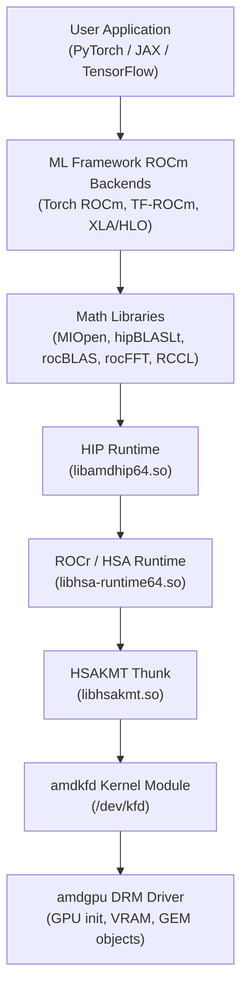
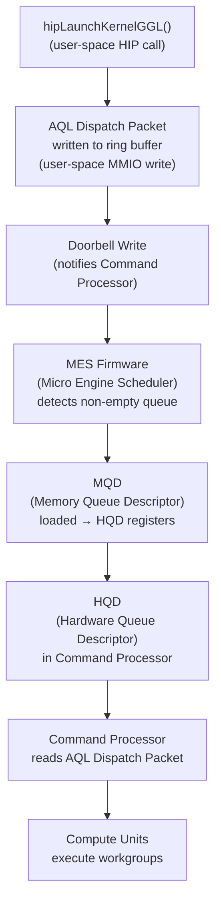
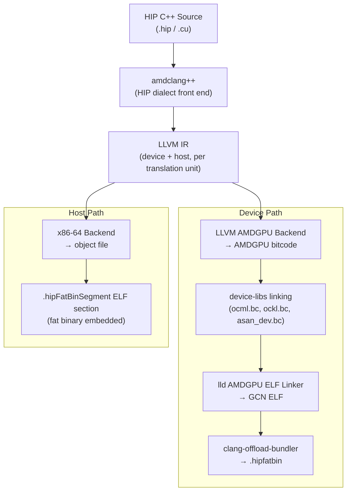
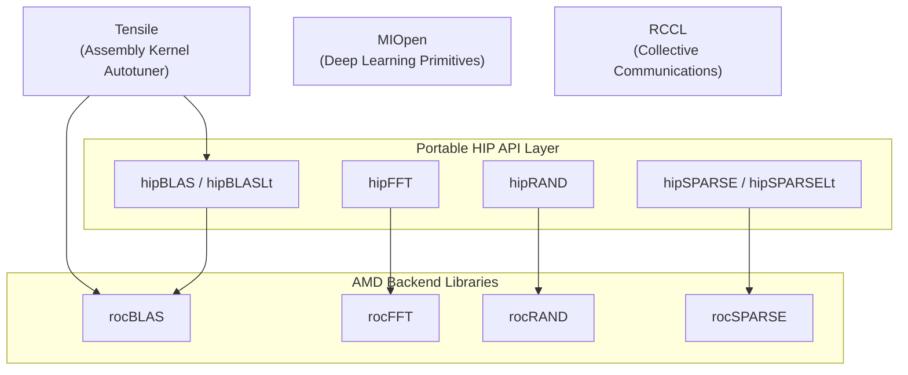
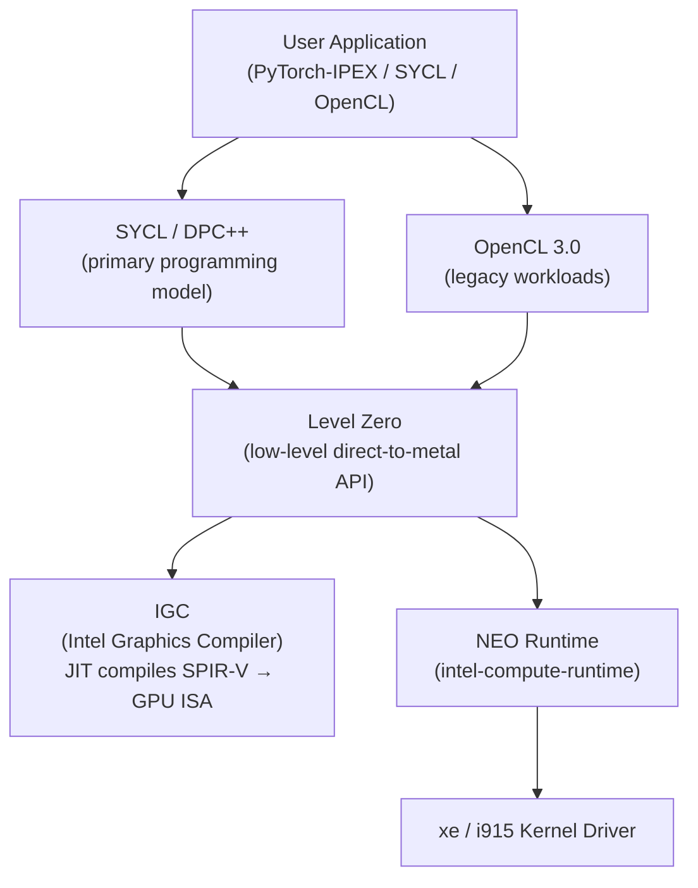

# Chapter 48: ROCm and Machine Learning on Linux GPUs

This chapter targets **systems and driver developers** who need to understand how AMD's compute stack integrates with the Linux kernel, and **graphics application developers** who want to harness GPU compute for machine learning workloads on Linux. We cover the complete ROCm software stack from the kernel's `amdkfd` module up through ML frameworks, with a parallel treatment of Intel's oneAPI stack for Arc GPUs.

## Table of Contents

- [ROCm Stack Overview](#rocm-stack-overview)
  - [1.1 What is ROCm?](#11-what-is-rocm)
  - [1.2 What is HIP?](#12-what-is-hip)
  - [1.3 What is the KFD (Kernel Fusion Driver)?](#13-what-is-the-kfd-kernel-fusion-driver)
- [KFD: The Kernel Fusion Driver](#kfd-the-kernel-fusion-driver)
- [HSA Memory Model](#hsa-memory-model)
- [ROCm Hardware Support Matrix](#rocm-hardware-support-matrix)
- [ROCm Version History](#rocm-version-history)
- [HIP Runtime](#hip-runtime)
- [ROCm Compilation Pipeline](#rocm-compilation-pipeline)
- [ML Frameworks on ROCm](#ml-frameworks-on-rocm)
- [Math Library Ecosystem](#math-library-ecosystem)
- [AMD CDNA3 / MI300X for ML](#amd-cdna3--mi300x-for-ml)
- [Intel oneAPI on Linux](#intel-oneapi-on-linux)
- [ROCm Containers and Cloud](#rocm-containers-and-cloud)
- [Integrations](#integrations)

---

## ROCm Stack Overview

**ROCm** (Radeon Open Compute) is AMD's open-source software platform for **GPU** compute on Linux. Unlike NVIDIA's proprietary **CUDA** stack, **ROCm** is built on upstream Linux kernel infrastructure and open standards, making it uniquely positioned for systems developers to audit and modify every layer. The full stack, from bottom to top, looks like this:

```
User application (PyTorch, JAX, TensorFlow)
    │
    ▼
ML Framework ROCm backends (Torch ROCm, TF-ROCm, XLA/HLO)
    │
    ▼
Math libraries (MIOpen, hipBLASLt, rocBLAS, rocFFT, RCCL)
    │
    ▼
HIP runtime (libamdhip64.so) + ROCr/HSA runtime (libhsa-runtime64.so)
    │
    ▼
HSAKMT thunk (libhsakmt.so) — user-space KFD interface
    │
    ▼
amdkfd kernel module (/dev/kfd) — compute queues, memory, topology
    │
    ▼
amdgpu DRM driver (Ch5) — GPU initialization, VRAM management, GEM objects
```

The critical design point is that **amdkfd** is a sub-driver of **amdgpu**: it reuses the **DRM** driver's already-initialized hardware context. Compute and graphics contexts coexist on the same GPU through this shared kernel driver. [Source: AMD KFD design](https://github.com/torvalds/linux/blob/master/drivers/gpu/drm/amd/amdkfd/kfd_device.c)

The chapter proceeds through the following topics.

The **KFD** (**Kernel Fusion Driver**) section covers:
- **`/dev/kfd`** — character device architecture
- **`kfd_ioctl.h`** UAPI interface — including **`kfd_ioctl_create_queue_args`** and **`kfd_ioctl_alloc_memory_of_gpu_args`**
- **MQD** (Memory Queue Descriptor) and **HQD** (Hardware Queue Descriptor) — queue dispatch internals with the **AQL** (Architected Queuing Language) packet format
- Topology discovery — via the **sysfs** tree consumed by **`libhsakmt.so`**

The **HSA** memory model section covers:
- Fine-grained vs coarse-grained memory — the core coherency distinction
- **`hsa_amd_memory_pool_allocate()`** — the HSA pool allocation API
- **MI300X** Unified Memory Architecture — partially collapses the coherency boundary

The hardware support matrix documents **ROCm**'s two-tier support model across:
- **CDNA4** (**gfx950**)
- **CDNA3** (**gfx942**)
- **CDNA2** (**gfx90a**)
- **CDNA1** (**gfx908**)
- **RDNA4** (**gfx1200/gfx1201**)
- **RDNA3** (**gfx1100/gfx1101**)
- **RDNA2** (**gfx1030**)

The version history traces **ROCm** from its 2016 launch through **ROCm 7.2**.

The **HIP** (Heterogeneous-compute Interface for Portability) runtime section covers:
- **CUDA**-mirroring design philosophy
- Core API — **`hipLaunchKernelGGL()`**, **`hipMalloc()`**, **`hipMemcpy()`**, **`hipMemcpyAsync()`**, **`hipHostMalloc()`**, and **`hipMallocManaged()`**
- **`hipcc`** / **`amdclang++`** — the compiler driver
- **`hipify-perl`** and **`hipify-clang`** — CUDA-to-HIP porting tools

The compilation pipeline section traces **HIP** C++ source through:
- **`amdclang++`** — front-end and compiler driver
- **LLVM AMDGPU** backend
- **ROCm-Device-Libs** bitcode linking — **`ocml.bc`**, **`ockl.bc`**
- **`lld`** — ELF linker
- **`clang-offload-bundler`** — fat binary packaging
- **`amdgcn-amd-amdhsa`** — target triple
- **`--offload-arch`** flags and **Relocatable Device Code** (**`-fgpu-rdc`**) mode
- Comparison with **Mesa**'s **ACO** compiler

The ML frameworks section covers:
- **PyTorch** ROCm backend — maps **`at::cuda`** → **`at::hip`**, cuBLAS → rocBLAS, cuDNN → MIOpen
- **TensorFlow-ROCm** — with **XLA** support
- **JAX** on **ROCm** — via **`jax-rocm`** packages
- **`hipBLASLt`** — **cublasLt** replacement with **FP8** epilogue fusion
- **MIOpen** — **cuDNN** replacement providing convolution, batch normalisation, and attention primitives

The math library ecosystem section details:
- **`rocBLAS`** — BLAS implementation
- **`rocFFT`** — FFT library
- **`rocRAND`** — random number generation
- **`hipSPARSE`** — sparse linear algebra
- **`hipSPARSELt`** — 2:4 structured sparsity
- **RCCL** — collective communications via **XGMI** and **InfiniBand**
- **Tensile** — assembly kernel autotuner
- **`rocm-smi`** and **`amd-smi`** — GPU monitoring

The **AMD CDNA3** / **MI300X** section examines:
- MCM die architecture — **XCD** and **MCD** chiplets
- Performance peaks — **FP64**, **FP32**, **BF16**, and **FP8** precisions
- **`v_mfma_f32_*_fp8_fp8`** — the **MFMA** instruction family for FP8
- **HSA** Unified Memory Architecture
- **XGMI Infinity Fabric** — multi-GPU topology
- Performance tuning — **`PYTORCH_TUNABLEOP_ENABLED`** and **`MIOPEN_FIND_ENFORCE`** environment variables
- **FP8** (**E4M3**/**E5M2** OCP **MX** formats) — inference with tools such as **vLLM**

The **Intel oneAPI** section covers:
- **Level Zero** — low-level direct-to-metal API
- **`intel-compute-runtime`** — **NEO** runtime and **IGC** (Intel Graphics Compiler)
- **SYCL**/**DPC++** — compilation to **SPIR-V**
- **`intel_gpu_top`** — monitoring via the **`i915`** / **`xe`** **perf** PMU
- **`intel-opencl-icd`** — installation
- Portability story — **oneAPI** and **ROCm** via **`AdaptiveCpp`** and **Intel Extension for PyTorch** (**IPEX**)
- Target GPU families: **Xe2** and Arc B-Series

The containers and cloud section explains:
- **Docker** — passthrough of **`/dev/kfd`** and **`/dev/dri/renderD*`** devices
- **`k8s-device-plugin`** — Kubernetes device plugin registering the **`amd.com/gpu`** extended resource
- **`amdgpu-install`** — host setup with **`amdgpu-dkms`**
- Cloud deployment on **AWS** and **Azure** — using official **`rocm/pytorch`** and **`rocm/tensorflow`** container images



### 1.1 What is ROCm?

ROCm (Radeon Open Compute) is AMD's open-source software platform for GPU-accelerated compute on Linux. It provides a vertically integrated stack from the Linux kernel's `amdkfd` module up through runtime libraries, math primitives, and ML framework integrations, enabling researchers and engineers to run HPC and machine learning workloads on AMD Radeon and Instinct GPUs without proprietary drivers. Unlike CUDA, which bundles its kernel-mode components as binary blobs, ROCm's kernel interface is upstream in the Linux kernel tree as the `amdkfd` sub-driver of `amdgpu`, and the user-space libraries are licensed under MIT or Apache 2.0 and hosted at [github.com/ROCm](https://github.com/ROCm). Within the Linux graphics stack, ROCm sits orthogonal to the display path: it uses `amdgpu` for hardware initialization and VRAM management but bypasses the compositor entirely, submitting compute work through the `/dev/kfd` character device and mapping GPU memory through `/dev/dri/renderD*`. The stack spans kernel drivers, the HIP and HSA runtimes, hardware-specific math libraries such as rocBLAS and MIOpen, and integrations with PyTorch, TensorFlow, and JAX. This chapter tracks ROCm from version 5.x through 7.x, focusing on interfaces stable enough for production ML deployment.

### 1.2 What is HIP?

HIP (Heterogeneous-compute Interface for Portability) is the GPU programming model at the center of the ROCm user-space stack. Its API mirrors the CUDA runtime closely enough that most CUDA C++ code can be mechanically translated using the `hipify-perl` or `hipify-clang` tools, making HIP the primary porting path for CUDA workloads targeting AMD hardware. On AMD GPUs, HIP calls route through `libamdhip64.so` to the ROCr/HSA runtime and ultimately to `amdkfd` queue submission; on NVIDIA hardware, the same HIP source compiles against CUDA directly, producing a single portable codebase. The compiler driver is `amdclang++`, a Clang/LLVM wrapper that compiles HIP C++ through the LLVM AMDGPU backend into GCN, RDNA, or CDNA ISA and packages the result as an ELF fat binary via `clang-offload-bundler`. Within ML framework integration, HIP is the mechanism by which PyTorch's CUDA backend is remapped to AMD hardware: the framework's `at::cuda` namespace is aliased to `at::hip` at build time, so framework-level operators invoke HIP kernels transparently. Familiarity with HIP's kernel launch syntax, asynchronous memory copy API, and stream and event model is essential for reading the ML framework and math library sections of this chapter.

### 1.3 What is the KFD (Kernel Fusion Driver)?

The Kernel Fusion Driver is the Linux kernel subsystem through which user-space ROCm software submits compute work directly to AMD GPUs. It lives inside the `amdgpu` DRM driver tree at `drivers/gpu/drm/amd/amdkfd/` and exposes a single character device, `/dev/kfd`, shared across all AMD GPUs present on the system. The "fusion" in the name reflects its HSA lineage: the driver was designed to enable CPU and GPU to share a coherent virtual address space and a unified queue model, treating them as peers in a heterogeneous compute fabric rather than as host and peripheral. User space accesses the KFD exclusively through the `ioctl` interface defined in `include/uapi/linux/kfd_ioctl.h`; the HSAKMT library (`libhsakmt.so`) wraps these ioctls and implements the HSA standard API on top. The KFD manages four primary resources: compute queues submitted via AQL packets in user-mapped ring buffers, GPU memory allocations spanning VRAM and GTT, hardware event signaling objects, and GPU topology discovery exposed through a `sysfs` hierarchy that HSAKMT reads at startup. Because `amdkfd` is a sub-driver of `amdgpu`, graphics and compute contexts coexist on the same physical device, sharing VRAM management and firmware control while remaining isolated within their respective queue schedulers. [Source: drivers/gpu/drm/amd/amdkfd/](https://github.com/torvalds/linux/tree/master/drivers/gpu/drm/amd/amdkfd)

---

## KFD: The Kernel Fusion Driver

### Architecture and Device Node

The Kernel Fusion Driver (KFD) — named after AMD's Heterogeneous System Architecture (HSA) concept of "fusing" CPU and GPU into unified compute fabric — exposes compute capabilities to user space through a single character device: `/dev/kfd`. All GPUs on the system share this single node; per-GPU selection happens via `gpu_id` fields in ioctl arguments.

The `amdkfd` module is built into the `amdgpu` kernel module tree:

```
drivers/gpu/drm/amd/amdkfd/
├── kfd_chardev.c          # /dev/kfd file_operations, ioctl dispatch
├── kfd_device.c           # Per-device init, amdgpu ↔ amdkfd bridge
├── kfd_process.c          # Per-process resource tracking
├── kfd_queue.c            # Compute and SDMA queue management
├── kfd_topology.c         # sysfs topology: nodes, caches, IO links
└── kfd_kernel_queue.c     # Kernel-internal HIQ and dispatch queues
```

[Source: Linux kernel amdkfd tree](https://github.com/torvalds/linux/tree/master/drivers/gpu/drm/amd/amdkfd)

### KFD IOCTL Interface

The UAPI header `include/uapi/linux/kfd_ioctl.h` defines the complete interface between user space (through HSAKMT) and the kernel. The current interface version is 1.22. Key structures:

```c
/* include/uapi/linux/kfd_ioctl.h */

/* Queue creation — one queue per compute ring on the GPU */
struct kfd_ioctl_create_queue_args {
    __u64 ring_base_address;        /* VA of ring buffer in user space */
    __u64 write_pointer_address;    /* VA of HW write pointer register mapping */
    __u64 read_pointer_address;     /* VA of HW read pointer register mapping */
    __u64 doorbell_offset;          /* offset into /dev/dri/renderDXXX doorbell page */

    __u32 ring_size;
    __u32 gpu_id;                   /* topology GPU identifier */
    __u32 queue_type;               /* COMPUTE, SDMA, COMPUTE_AQL, SDMA_XGMI */
    __u32 queue_percentage;         /* 0–100, percentage of GPU time allocated */
    __u32 queue_priority;           /* 0–15 */
    __u32 queue_id;                 /* out: assigned by kernel */

    __u64 eop_buffer_address;       /* end-of-pipe buffer for completion events */
    __u64 eop_buffer_size;
    __u64 ctx_save_restore_address; /* per-queue context save/restore area */
    __u32 ctx_save_restore_size;
    __u32 ctl_stack_size;
};

/* GPU memory allocation */
struct kfd_ioctl_alloc_memory_of_gpu_args {
    __u64 va_addr;      /* requested VA, or 0 for kernel-chosen */
    __u64 size;
    __u64 handle;       /* out: opaque BO handle */
    __u64 mmap_offset;  /* out: for mmap() of GTT/userptr */
    __u32 gpu_id;
    __u32 flags;        /* KFD_IOC_ALLOC_MEM_FLAGS_* bitfield */
};
```

[Source: kfd_ioctl.h in torvalds/linux](https://github.com/torvalds/linux/blob/master/include/uapi/linux/kfd_ioctl.h)

The `flags` field distinguishes allocation types: `KFD_IOC_ALLOC_MEM_FLAGS_VRAM` for GPU-local memory, `KFD_IOC_ALLOC_MEM_FLAGS_GTT` for GART-mapped system memory, and `KFD_IOC_ALLOC_MEM_FLAGS_USERPTR` to pin existing CPU virtual memory for GPU DMA.

### Queue Dispatch Internals: MQD and HQD

Understanding how GPU compute dispatch works requires following the path from user-space kernel submission to actual hardware execution. Two key data structures mediate this:

**MQD (Memory Queue Descriptor)** — a per-queue structure that lives in GPU-accessible memory. It stores the complete state of a hardware queue: ring buffer base address and size, the doorbell offset, scheduling metadata, and a snapshot of the hardware control registers. When a queue is preempted (either voluntarily or by the scheduler), its HQD registers are saved back to the MQD.

**HQD (Hardware Queue Descriptor)** — the actual register state loaded into the GPU's Command Processor (CP) when a queue becomes active. Only a limited number of HQDs exist per pipe (typically 8 per pipe, multiple pipes per GPU). The kernel's `kfd_device_queue_manager` (DQM) is responsible for multiplexing potentially hundreds of userspace queues onto the available HQD slots.

The dispatch flow for a `hipLaunchKernelGGL` call:

```
hipLaunchKernelGGL(kernel, grid, block, shared_mem, stream, args...)
    │
    ▼
HIP runtime packages an AQL (Architected Queuing Language) packet
into the stream's ring buffer (user-space MMIO write)
    │
    ▼
Ring buffer write pointer advances; doorbell write notifies CP
    │
    ▼ (kernel-level, MES firmware)
MES (Micro Engine Scheduler) detects non-empty queue
Loads MQD → HQD registers if queue not already active
    │
    ▼
CP reads AQL Dispatch Packet from ring
Dispatches workgroups to Compute Units
```

[Source: AMD GPU scheduling paper](https://par.nsf.gov/servlets/purl/10385873), [kfd_device_queue_manager.c](https://github.com/torvalds/linux/blob/master/drivers/gpu/drm/amd/amdkfd/kfd_kernel_queue.c)



The AQL Dispatch Packet format (64 bytes) is defined by the HSA specification and is the same structure used by the HSA runtime, HIP runtime, and OpenCL runtime:

```c
/* HSA AQL Dispatch Packet (64 bytes, aligned to 64 bytes in ring buffer) */
struct hsa_kernel_dispatch_packet_s {
    uint16_t header;              /* type, barrier bit, scopes */
    uint16_t setup;               /* dimensions (1/2/3) */
    uint16_t workgroup_size_x;
    uint16_t workgroup_size_y;
    uint16_t workgroup_size_z;
    uint16_t reserved0;
    uint32_t grid_size_x;
    uint32_t grid_size_y;
    uint32_t grid_size_z;
    uint32_t private_segment_size; /* per-thread scratch memory */
    uint32_t group_segment_size;   /* LDS bytes per workgroup */
    uint64_t kernel_object;        /* VA of kernel code object */
    uint64_t kernarg_address;      /* VA of packed kernel arguments */
    uint64_t reserved2;
    hsa_signal_t completion_signal;/* signalled on completion */
};
```

The `kernel_object` field points to an AMD GPU code object — an ELF binary with the actual GCN/RDNA machine code — loaded into GPU-accessible memory by the ROCm runtime.

### Topology Discovery via sysfs

`amdkfd` exports hardware topology under `/sys/bus/pci/drivers/amdgpu/<pci-id>/kfd/topology/`:

```bash
# List compute nodes seen by KFD
ls /sys/devices/virtual/kfd/kfd/topology/nodes/
# 0  1  2  ...  (one entry per GPU + one for the CPU HSA agent)

# Per-node properties
cat /sys/devices/virtual/kfd/kfd/topology/nodes/1/properties
# cpu_cores_count 0
# simd_count 304
# mem_banks_count 8
# caches_count 152
# io_links_count 7
# max_waves_per_simd 16
# ...
```

The HSAKMT library (`libhsakmt.so`) reads this sysfs tree during `hsaKmtAcquireSystemProperties()` to build the in-process topology map that the HSA runtime exposes to applications.

---

## HSA Memory Model

AMD's Heterogeneous System Architecture defines a memory model that is central to ROCm's programming paradigm. The HSA specification distinguishes two coherency domains:

**Fine-grained memory** is coherently accessible by all agents (CPU and GPU) simultaneously. Writes from one agent are immediately visible to all others. This is suitable for small synchronisation structures, but the coherency traffic makes it expensive for bulk data transfers. In ROCm, fine-grained memory is typically allocated with `hsa_amd_memory_pool_allocate()` from a pool tagged `HSA_AMD_SEGMENT_GLOBAL` with the `HSA_AMD_MEMORY_POOL_GLOBAL_FLAG_FINE_GRAINED` attribute.

**Coarse-grained memory** has explicit ownership: only one agent's cached view is valid at a time. An explicit `hsa_amd_memory_migrate()` or the HIP runtime's implicit migration transfers ownership between agents. GPU VRAM (HBM) is coarse-grained by default. This model maps directly onto the physical reality of discrete GPU architectures.

[Source: ROCm HSA Runtime documentation](https://rocm.docs.amd.com/projects/ROCR-Runtime/en/docs-6.2.1/what-is-rocr-runtime.html)

The MI300X series (CDNA3) partially collapses this distinction: its Unified Memory Architecture places CPU and GPU on the same die sharing HBM3 memory, making certain allocations accessible without explicit migration — though the HSA memory model APIs remain the portable abstraction layer above this hardware difference.

---

## ROCm Hardware Support Matrix

ROCm maintains a two-tier support model: *officially supported* hardware receives full QA and all library optimisations; *community supported* hardware (mainly RDNA consumer cards) receives best-effort support. As of ROCm 7.2 (May 2026):

[Source: ROCm compatibility matrix](https://rocm.docs.amd.com/en/latest/compatibility/compatibility-matrix.html)

| Architecture | gfx Target | Product | Support Level |
|---|---|---|---|
| CDNA4 | gfx950 | Instinct MI350X, MI355X | Official |
| CDNA3 | gfx942 | Instinct MI300X, MI325X | Official |
| CDNA2 | gfx90a | Instinct MI210/MI250/MI250X | Official |
| CDNA1 | gfx908 | Instinct MI100 | Official |
| RDNA4 | gfx1200, gfx1201 | Radeon RX 9070/9070 XT | Official |
| RDNA3 | gfx1100, gfx1101 | Radeon RX 7900/7800 | Official |
| RDNA2 | gfx1030 | Radeon RX 6800/6900 | Community |

The `gfx` numbering encodes the ISA generation. The CDNA line uses even-numbered GFX9-family identifiers (gfx908, gfx90a, gfx940–942) that share the same base ISA as Vega-era graphics hardware but add matrix (MFMA) instructions and remove rasterisation hardware entirely. RDNA (gfx10xx, gfx11xx) targets retain the graphics pipeline alongside compute.

**Note:** gfx940 and gfx941 were early MI300A/MI300X pre-production identifiers that AMD collapsed into gfx942 for production silicon. Applications should target gfx942 for all MI300 variants. [Source: ROCm GitHub issue #4825](https://github.com/ROCm/ROCm/issues/4825)

---

## ROCm Version History

ROCm has evolved significantly since its 2016 launch:

| Version | Year | Key milestone |
|---|---|---|
| 1.0 | 2016 | Initial release; OpenCL 2.0, HCC compiler (since retired) |
| 2.0 | 2018 | HIP runtime introduced; ROCm replaces HCC as primary toolchain |
| 3.0 | 2019 | Infinity Fabric multi-GPU; RCCL collective library; Docker/K8s support |
| 4.0 | 2020 | CDNA1 (MI100/gfx908) support; cooperative groups; ROCm 4.x goes mainstream |
| 5.0 | 2022 | CDNA2 (MI200/gfx90a); unified hipBLAS/rocBLAS; LLVM 14 backend |
| 6.0 | 2023 | MI300 (gfx942) support; hipBLASLt replaces cuBLAS-Lt; LLVM 17 |
| 7.0 | 2025 | MI350X/MI355X; LLVM 20; FP4/FP6/FP8 MX formats; library consolidation into `rocm-libraries`; removal of hipcc Perl scripts |
| 7.2 | 2026 | RDNA4 (gfx1201); Radeon RX 9000 series; ROCm Optiq introduced |

[Source: ROCm release history](https://rocm.docs.amd.com/en/latest/release/versions.html)

---

## HIP Runtime

### Design Philosophy

HIP (Heterogeneous-compute Interface for Portability) is the programming model at the centre of ROCm application development. The API is intentionally designed as a thin superset of CUDA: for each `cuda*` function, there is a corresponding `hip*` function with an identical signature except for the prefix. This design means the HIP headers on NVIDIA hardware simply macro-expand to CUDA calls with zero overhead; on AMD hardware the actual ROCm implementation runs.

### Core API

A minimal vector-add example that runs unmodified on NVIDIA and AMD GPUs:

```c
/* examples/vector_add.hip — compile with: hipcc -o vec_add vector_add.hip */
#include <hip/hip_runtime.h>
#include <stdio.h>

__global__ void vector_add(const float *a, const float *b, float *c, int n) {
    int idx = blockIdx.x * blockDim.x + threadIdx.x;
    if (idx < n) c[idx] = a[idx] + b[idx];
}

int main(void) {
    const int N = 1 << 20;
    const size_t bytes = N * sizeof(float);

    float *d_a, *d_b, *d_c;
    hipMalloc(&d_a, bytes);
    hipMalloc(&d_b, bytes);
    hipMalloc(&d_c, bytes);

    /* host → device */
    float *h_a = (float *)malloc(bytes), *h_b = (float *)malloc(bytes);
    for (int i = 0; i < N; i++) { h_a[i] = 1.0f; h_b[i] = 2.0f; }
    hipMemcpy(d_a, h_a, bytes, hipMemcpyHostToDevice);
    hipMemcpy(d_b, h_b, bytes, hipMemcpyHostToDevice);

    /* launch: 256 threads per block */
    hipLaunchKernelGGL(vector_add,
                       dim3((N + 255) / 256), dim3(256), 0, 0,
                       d_a, d_b, d_c, N);

    /* device → host */
    float *h_c = (float *)malloc(bytes);
    hipMemcpy(h_c, d_c, bytes, hipMemcpyDeviceToHost);

    printf("c[0] = %f\n", h_c[0]);  /* expect 3.0 */

    hipFree(d_a); hipFree(d_b); hipFree(d_c);
    free(h_a); free(h_b); free(h_c);
    return 0;
}
```

`hipLaunchKernelGGL` is the canonical HIP kernel launch macro. The parameters are: kernel function, grid dimensions, block dimensions, dynamic shared memory bytes, stream, and then the kernel arguments. HIP also supports the triple-angle-bracket CUDA syntax (`kernel<<<grid, block, smem, stream>>>(args)`) when compiled with `amdclang++`.

[Source: HIP Runtime API Reference](https://rocm.docs.amd.com/projects/HIP/en/latest/doxygen/html/group___memory.html)

### Memory Management Functions

The full HIP memory API mirrors CUDA:

```c
/* Device memory */
hipError_t hipMalloc(void **ptr, size_t size);
hipError_t hipFree(void *ptr);

/* Synchronous transfers */
hipError_t hipMemcpy(void *dst, const void *src, size_t count,
                     hipMemcpyKind kind);
/* kind: hipMemcpyHostToDevice, hipMemcpyDeviceToHost,
         hipMemcpyDeviceToDevice, hipMemcpyDefault */

/* Asynchronous transfers (non-blocking, requires pinned host memory) */
hipError_t hipMemcpyAsync(void *dst, const void *src, size_t count,
                          hipMemcpyKind kind, hipStream_t stream);

/* Pinned (page-locked) host memory for zero-copy DMA */
hipError_t hipHostMalloc(void **ptr, size_t size, unsigned int flags);
/* flags: hipHostMallocDefault, hipHostMallocMapped, hipHostMallocWriteCombined */

/* Unified memory (managed allocation, migrates on demand) */
hipError_t hipMallocManaged(void **ptr, size_t size, unsigned int flags);
```

### hipcc Compiler Driver

`hipcc` is the compiler driver for HIP. In ROCm 7.0+, the Perl-based `hipcc.pl` wrapper was removed; `hipcc` is now a thin C++ binary that delegates to `amdclang++`. [Source: ROCm 7.0 release notes](https://rocm.docs.amd.com/en/docs-7.0.0/about/release-notes.html)

```bash
# Compile for the current system's GPUs (auto-detected)
hipcc -O3 -o my_kernel my_kernel.hip

# Target specific architectures explicitly (preferred for reproducibility)
hipcc --offload-arch=gfx942 --offload-arch=gfx1100 -O3 -o my_kernel my_kernel.hip

# Generate PTX-equivalent (GCN ISA dump)
hipcc --offload-arch=gfx942 -S -o kernel.s my_kernel.hip
```

### CUDA-to-HIP Porting: hipify

AMD provides two porting tools:

**hipify-perl** — a Perl script that performs regex-based text substitution. It handles roughly 90–95% of typical CUDA code automatically, making it suitable for initial sweeps over large codebases.

```bash
# Convert a single CUDA source file
hipify-perl foo.cu > foo.hip

# Batch conversion
find . -name "*.cu" | xargs hipify-perl --inplace
```

**hipify-clang** — uses the Clang AST to perform semantically-correct translation. Required for complex cases: template instantiations, macros that expand to CUDA intrinsics, or code that uses CUDA driver API directly.

```bash
hipify-clang program.cu \
    --cuda-path=/usr/local/cuda-12 \
    -I /usr/local/cuda-12/include \
    -o program.hip
```

[Source: Application portability with HIP - AMD GPUOpen](https://gpuopen.com/learn/amd-lab-notes/amd-lab-notes-hipify-readme/)

Neither tool converts CMake build files or CUDA-specific linker flags. After `hipify`, developers must update `CMakeLists.txt` to use `find_package(HIP)` and set `CMAKE_HIP_COMPILER`.

---

## ROCm Compilation Pipeline

### Overview

The journey from HIP C++ source to GPU instructions involves several distinct phases managed by AMD's fork of the LLVM/Clang toolchain:

```
HIP C++ source (.hip / .cu)
    │
    ▼ amdclang++ (front end, HIP dialect)
    │
    ▼ Clang CodeGen → LLVM IR (per translation unit, device + host)
    │
    ├──[device]──► LLVM AMDGPU backend → AMDGPU bitcode
    │               │
    │               ▼ device-libs linking (ROCm-Device-Libs/bitcode/)
    │               │  (ocml.bc, ockl.bc, asan_dev.bc, ...)
    │               ▼
    │             lld (AMDGPU ELF linker) → GCN ELF
    │               │
    │               ▼ clang-offload-bundler
    │             .hipfatbin (fat binary containing all --offload-arch images)
    │
    └──[host]───► x86-64 backend → object file
                  (fat binary embedded as .hipFatBinSegment ELF section)
```

[Source: Clang HIP Support documentation](https://clang.llvm.org/docs/HIPSupport.html)



### Target Triple

The canonical AMD GPU target triple for HSA compute is:

```
amdgcn-amd-amdhsa
 │       │    └── OS: amdhsa (AMD Heterogeneous System Architecture)
 │       └─────── Vendor: amd
 └─────────────── Architecture: amdgcn (AMD Graphics Core Next)
```

The architecture component is always `amdgcn` regardless of whether the actual ISA is GCN3, RDNA2, or CDNA3; the specific microarchitecture is selected by the `--offload-arch` flag.

### Architecture Flags

```bash
# gfx942 = CDNA3 (MI300X, MI325X) — primary production ML target
amdclang++ --offload-arch=gfx942 -O3 kernel.hip

# Target IDs: append xnack+/- (page fault recovery) and sramecc+/- (SRAM ECC)
amdclang++ --offload-arch=gfx90a:xnack+:sramecc- kernel.hip

# Multi-arch fat binary — one binary, two GPU targets
amdclang++ --offload-arch=gfx942 --offload-arch=gfx1100 kernel.hip

# Inspect the embedded device images
llvm-objdump --offloading my_binary | head -40
```

[Source: ROCm compiler reference](https://rocm.docs.amd.com/projects/llvm-project/en/latest/reference/rocmcc.html)

### Relocatable Device Code (RDC) Mode

By default (`-fno-gpu-rdc`), each translation unit compiles to a self-contained device binary: all device functions must be defined in the same `.hip` file. In `-fgpu-rdc` mode, device code is emitted as relocatable bitcode and linked in a separate device link step — analogous to CUDA's `--device-c` / `--device-link` workflow.

```bash
# RDC mode: compile objects
amdclang++ -fgpu-rdc --offload-arch=gfx942 -c a.hip -o a.o
amdclang++ -fgpu-rdc --offload-arch=gfx942 -c b.hip -o b.o

# Device link step
amdclang++ -fgpu-rdc --offload-arch=gfx942 --hip-link a.o b.o -o my_app
```

### Comparison with Mesa's ACO

Mesa's ACO compiler (Ch15) and the ROCm LLVM AMDGPU backend target the same GCN/RDNA ISA, but serve different purposes and have different design constraints:

- **ACO** compiles SPIR-V shader programs in a latency-sensitive graphics context. It uses Mesa's NIR IR and performs register allocation with a graph-colouring approach tuned for short-lived graphics shaders.
- **ROCm AMDGPU backend** compiles HIP/OpenMP/OpenCL compute kernels that may run for seconds. It uses LLVM's full optimisation pipeline (vectorisation, loop unrolling, inlining, IPO) and Tensile-generated assembly for library kernels.

The two stacks share the ISA reference but have separate maintainers and different code quality trade-offs. A kernel compiled by ROCm's LLVM for MI300X and a shader compiled by ACO for an RX 7900 XT both eventually execute on the same physical wave scheduler hardware.

---

## ML Frameworks on ROCm

### PyTorch ROCm Backend

PyTorch's ROCm support is implemented by replacing CUDA-specific backends with ROCm equivalents. Internally, PyTorch uses a `#define USE_ROCM` code path that maps:

- `at::cuda::*` → `at::hip::*`
- cuBLAS/cuDNN calls → rocBLAS/MIOpen calls
- `cudaStream_t` → `hipStream_t`

As of ROCm 7.0 / PyTorch 2.7, the recommended installation for gfx942:

```bash
# Install PyTorch for ROCm 7.0, CDNA3 target
pip install torch torchvision torchaudio \
    --index-url https://download.pytorch.org/whl/rocm7.0

# Verify
python -c "import torch; print(torch.cuda.is_available()); \
           print(torch.cuda.get_device_name(0))"
# True
# AMD Instinct MI300X
```

[Source: PyTorch ROCm compatibility](https://rocm.docs.amd.com/en/latest/compatibility/ml-compatibility/pytorch-compatibility.html)

Note: PyTorch exposes AMD GPUs through the `torch.cuda` namespace on ROCm — AMD deliberately kept the API surface identical to avoid requiring framework code changes.

### TensorFlow ROCm

TensorFlow-ROCm is maintained as a separate wheel package by AMD's TF-ROCm fork. As of ROCm 7.0, TF 2.19.1 is supported with XLA compilation through the ROCm XLA backend.

```bash
pip install tensorflow-rocm
python -c "import tensorflow as tf; print(tf.config.list_physical_devices('GPU'))"
# [PhysicalDevice(name='/physical_device:GPU:0', device_type='GPU')]
```

### JAX on ROCm

JAX uses the XLA compiler stack. AMD maintains ROCm support through the `jax-rocm` packages:

```bash
pip install jax[rocm] -f https://storage.googleapis.com/jax-releases/jax_rocm_releases.html

import jax
import jax.numpy as jnp
print(jax.devices())  # [RocmDevice(id=0), ...]
```

JAX 0.6.0 is supported as of ROCm 7.0. [Source: ROCm 7.0 release notes](https://rocm.docs.amd.com/en/docs-7.0.0/about/release-notes.html)

### hipBLASLt as cuBLAS Replacement

`hipBLASLt` is AMD's implementation of the NVIDIA cublasLt API — the "lightweight" GEMM library with epilogue fusion. It uses Tensile-generated assembly kernels and supports flexible A/B/C/D type combinations including FP8 for LLM inference. Starting with ROCm 6.3, `hipBLASLt` is the default GEMM backend for PyTorch on gfx942, replacing rocBLAS for matrix-multiplication operations.

```python
# PyTorch uses hipBLASLt automatically for torch.mm on CDNA3
# To check which backend is being invoked:
import torch
with torch.backends.cuda.sdp_kernel(enable_flash=True):
    out = torch.matmul(a_fp8, b_fp8)
```

### MIOpen as cuDNN Replacement

MIOpen is AMD's deep learning primitive library — the functional equivalent of NVIDIA's cuDNN. It provides:

- Convolution (forward, backward data, backward weight)
- Batch normalisation (NCHW and NHWC memory formats)
- Pooling, activation functions, LSTMs, attention mechanisms
- `find()`/`run()` pattern: MIOpen benchmarks multiple kernel implementations and caches the fastest for a given problem shape

```c
/* Simplified MIOpen convolution setup */
#include <miopen/miopen.h>

miopenHandle_t handle;
miopenCreate(&handle);

miopenTensorDescriptor_t input_desc, weight_desc, output_desc;
miopenCreateTensorDescriptor(&input_desc);
miopenSet4dTensorDescriptor(input_desc, miopenFloat,
                             N, C, H, W);  /* NCHW layout */

miopenConvolutionDescriptor_t conv_desc;
miopenCreateConvolutionDescriptor(&conv_desc);
miopenInitConvolutionNdDescriptor(conv_desc, 2,
                                   pad, stride, dilation,
                                   miopenConvolution);

/* find phase: benchmark all algorithms, cache result */
miopenFindConvolutionForwardAlgorithm(handle, input_desc, input,
    weight_desc, weight, conv_desc, output_desc, output,
    max_solutions, &found, solutions, workspace, ws_size,
    false /* exhaustive search */);
```

[Source: MIOpen GitHub (now in rocm-libraries)](https://github.com/ROCm/MIOpen)

NHWC (channels-last) batch normalisation is enabled by default from ROCm 7.0+, matching the memory layout typically preferred by Ampere-class and newer GPUs for transformer workloads.

---

## Math Library Ecosystem

ROCm's math stack has been consolidated into the `rocm-libraries` GitHub repository as of ROCm 7.0. The major libraries:



### rocBLAS

rocBLAS is AMD's BLAS implementation targeting HIP. It wraps Tensile-generated kernels for GEMM operations and provides Level 1/2/3 BLAS routines. It is the backend for `hipBLAS` (the portable BLAS API layer).

```bash
# GEMM tuning: generate a custom tuning table for a specific problem shape
rocblas-gemm-tune \
    --function gemm_ex \
    --transposeA N --transposeB T \
    --m 4096 --n 4096 --k 4096 \
    --a_type f16_r --b_type f16_r --c_type f32_r --d_type f32_r \
    --compute_type f32_r \
    --arch gfx942
```

[Source: GEMM optimisation for AMD GPUs](https://rocm.blogs.amd.com/artificial-intelligence/gemm_blog/README.html)

### rocFFT

rocFFT provides 1D/2D/3D FFT operations for real and complex single and double precision data. It is used by hipFFT as the AMD backend. The library selects from a library of pre-compiled Stockham FFT kernels based on problem size.

```bash
# rocfft-rider benchmarks FFT plans
rocfft-rider --length 4096 4096 --precision single --transformType 0
```

### rocRAND

rocRAND implements pseudo-random and quasi-random number generation on GPU. It provides MTGP32, Philox 4x32, and SOBOL sequences. The `hipRAND` header maps to it on AMD hardware.

### Tensile: The Kernel Autotuner

Tensile is the assembly kernel generator and autotuner that underpins rocBLAS and hipBLASLt. It generates highly optimised GCN/CDNA assembly for GEMM and other tensor contractions by:

1. Generating a search space of kernel parameters (tile sizes, unroll depths, prefetch strategies, MFMA instruction selection).
2. Benchmarking each candidate against target problem shapes on real hardware.
3. Selecting winners and compiling a lookup table embedded in the library binary.

[Source: Tensile paper — Auto-Tuning GEMM GPU Assembly](https://ieeexplore.ieee.org/document/8425532/)

The tuning tables are architecture-specific: a rocBLAS built for gfx942 ships different assembly than one for gfx90a. Users can invoke `rocblas-gemm-tune` to extend or override the default table for unusual problem shapes not covered by the shipped kernels. In ROCm 7.0+, the Origami heuristic further reduces the need for exhaustive tuning by better predicting optimal parameters.

### hipSPARSE

hipSPARSE provides sparse linear algebra (SpMV, SpGEMM, SpSVSolve) on GPU, used by graph neural network frameworks and scientific computing codes that work with irregular sparse matrices.

### hipSPARSELt

`hipSPARSELt` is AMD's implementation of NVIDIA's cuSPARSELt — sparse matrix multiply with 2:4 structured sparsity. On CDNA3, sparse GEMM with 2:4 sparsity (every 4 elements, at most 2 are non-zero) doubles effective throughput by compressing weight matrices before MFMA execution. This is relevant for pruned LLM inference.

### RCCL: Collective Communications

RCCL (ROCm Collective Communication Library) is AMD's equivalent of NVIDIA's NCCL. It implements AllReduce, AllGather, Broadcast, and ReduceScatter using either XGMI (for intra-node MI300X connections) or UCX/RDMA over InfiniBand for multi-node clusters.

RCCL automatically detects XGMI topology using ROCm's `rocm_agent_enumerator` and selects algorithms accordingly: for a fully connected 8-GPU MI300X node, it uses ring or tree AllReduce over XGMI DMA, bypassing the CPU entirely. [Source: RCCL usage tips](https://rocm.docs.amd.com/projects/rccl/en/develop/how-to/rccl-usage-tips.html)

```python
# PyTorch distributed using RCCL backend
import torch.distributed as dist
dist.init_process_group(backend="nccl")  # "nccl" maps to RCCL on ROCm

# Multi-GPU all-reduce
import torch
tensor = torch.ones(1024, device="cuda:0")
dist.all_reduce(tensor, op=dist.ReduceOp.SUM)
```

### rocm-smi / amd-smi: GPU Monitoring

`rocm-smi` and its successor `amd-smi` provide real-time GPU monitoring:

```bash
# Show all GPU utilisation, memory, temperature, power
amd-smi monitor

# Detailed device info
amd-smi list --json

# Watch GPU activity during inference
watch -n 1 'amd-smi monitor -u -m -t -p'

# Show memory usage breakdown (VRAM, GTT)
rocm-smi --showmeminfo vram
```

`amd-smi` interfaces with the `amdgpu` sysfs entries (`/sys/class/drm/card0/device/`) and the AMDSMI library (`libamdsmi.so`), which in turn reads via the KFD topology and VBIOS power management tables.

---

## AMD CDNA3 / MI300X for ML

### Die Architecture

The AMD Instinct MI300X is an MCM (Multi-Chip Module) built from twelve chiplets on a single package:

- **8 × XCD (Accelerated Compute Die)** — each implementing CDNA3 compute at 5nm process, with 38 CUs, 32 KB L1 per CU, and 4 MB shared L2
- **4 × MCD (Memory Control Die)** — each managing 2 HBM3 stacks

[Source: AMD MI300X data sheet](https://www.amd.com/content/dam/amd/en/documents/instinct-tech-docs/data-sheets/amd-instinct-mi300x-data-sheet.pdf)

Total on-package resources:
- **304 Compute Units** (8 × 38 CU), though commonly described as 192 in reference to the 192 CU configuration of the GCD-only variant
- **192 GB HBM3** at **5.3 TB/s** aggregate bandwidth (8 stacks × 24 GB × 662.4 GB/s per stack)
- **256 MB AMD Infinity Cache** shared across all 8 XCDs

**Note:** Public documentation uses "192 compute units" in some contexts and "304 compute units" in others, reflecting different ways of counting across the 8 XCDs. The 304 count is the raw CU sum; 192 refers to the active CUs in some binned configurations. For gfx942 as used in MI300X, developers should measure empirically with `rocminfo` on their specific card.

### Performance Peaks (MI300X)

| Precision | Peak TFLOPS |
|---|---|
| FP64 (vector) | 81.7 |
| FP32 (matrix MFMA) | 163.4 |
| BF16 (matrix) | 1,307.4 |
| FP8 (matrix) | 2,614.9 |
| INT8 | 2,614.9 TOPS |

FP8 support is implemented via the `v_dot2_f32_f8f6f4` family of MFMA instructions in the CDNA3 ISA.

### Unified Memory Architecture

The MI300A (APU variant of MI300) places CPU cores (Zen 4), GPU compute dies, and HBM3 on the same package, sharing memory physically. The MI300X (GPU-only) achieves *software* unified memory through AMD's HSA model: the HBM3 is cache-coherently accessible by the host CPU via PCIe 5.0 with hardware-managed migration.

```bash
# Check unified memory topology
rocminfo | grep -A5 "Pool"
# Pool 1
#   Segment:                 GLOBAL; KERNARG; FINE GRAINED
#   Size:                    196607 KB
#   Allocatable:             TRUE
#   Alloc Granule:           4KB
```

The practical impact for ML frameworks: tensors can remain on device without explicit `hipMemcpy` for model weights that are read-only during inference, while activations are still allocated with standard device allocations for best throughput.

### XGMI Infinity Fabric for Multi-GPU

An 8-GPU MI300X server (e.g. the AMD Instinct MI300X OAM platform) connects all eight accelerators in a fully connected mesh via XGMI (External Global Memory Interconnect):

```
GPU0 ←→ GPU1 ←→ GPU2 ←→ GPU3
  ↕  ×   ↕  ×   ↕  ×   ↕
GPU4 ←→ GPU5 ←→ GPU6 ←→ GPU7
```

Each Infinity Fabric link provides **128 GB/s bidirectional bandwidth** (64 GB/s per direction, 7 links per GPU × 128 GB/s = 896 GB/s total interconnect per GPU). [Source: RCCL bandwidth and xGMI performance](https://rocm.blogs.amd.com/software-tools-optimization/mi300x-rccl-xgmi/README.html)

This topology is exposed to ROCm through `rocminfo`'s IO link section and consumed by RCCL to select AllReduce algorithms that use direct GPU-to-GPU DMA rather than routing through the CPU — relevant to the multi-GPU collective operations described in (Ch49).

```bash
# Verify XGMI topology
rocm-bandwidth-test -t  # peer-to-peer bandwidth matrix
# Bandwidth between GPU 0 and GPU 1: 62.1 GB/s (unidirectional)
```

### Performance Tuning for MI300X Inference

Several environment variables and PyTorch compile settings significantly affect MI300X throughput for transformer/LLM inference:

```bash
# Enable TunableOp: PyTorch benchmarks hipBLASLt vs rocBLAS for each unique GEMM shape
# and caches winners in a CSV file
export PYTORCH_TUNABLEOP_ENABLED=1
export PYTORCH_TUNABLEOP_TUNING_AFTER_WARMUP_ITERS=5
export PYTORCH_TUNABLEOP_FILENAME=/tmp/tuning_results.csv

# Increase RCCL channels for AllReduce on 8-GPU topology
export NCCL_MIN_NCHANNELS=112

# MIOpen find mode: 1=normal, 2=fast, 4=dry-run, 6=hybrid
export MIOPEN_FIND_ENFORCE=1

# Run inference with torch.compile for kernel auto-tuning
python -c "
import torch
model = torch.compile(model, mode='max-autotune')
"
```

[Source: AMD Instinct MI300X workload optimization](https://rocm.docs.amd.com/en/latest/how-to/rocm-for-ai/inference-optimization/workload.html)

### FP8 Precision on CDNA3

CDNA3 introduces native FP8 (E4M3 and E5M2 formats, following the OCP MX specification) through new `v_mfma_f32_*_fp8_fp8` instructions. FP8 GEMM achieves 2,614 TFLOPS peak throughput — twice the BF16 peak — making it the preferred precision for LLM inference weights and KV cache:

```python
# FP8 inference with vLLM on MI300X
# vLLM uses hipBLASLt's FP8 GEMM kernels automatically when
# the model is quantised with fp8 weight format

from vllm import LLM, SamplingParams
llm = LLM(model="meta-llama/Llama-3.1-405B-Instruct",
          quantization="fp8",
          tensor_parallel_size=8)  # spread across 8 × MI300X
outputs = llm.generate(["Explain ROCm:"], SamplingParams(max_tokens=200))
```

The FP8 format used by CDNA3 is the OCP `fp8e4m3fnuz` variant (FNUZ = finite, no inf, no NaN, unsigned zero) rather than the IEEE standard E4M3. This distinction matters for quantisation toolchains: quantisers targeting gfx942 must use the `fnuz` scale factors. [Source: FP8 Matrix Cores characterisation on MI300A](https://arxiv.org/pdf/2602.10262)

### Monitoring MI300X During Inference

```bash
# Live dashboard: temperature, power, VRAM, utilisation
watch -n 0.5 'amd-smi monitor -u -m -t -p --json'

# Long-form single snapshot
amd-smi list --json | python3 -m json.tool | grep -E "vram|temp|power|gfx_activity"

# Check XGMI link health and bandwidth
rocm-bandwidth-test -t   # peer-to-peer bandwidth matrix between all GPU pairs

# Profile a training run with PyTorch profiler
python -c "
import torch
from torch.profiler import profile, ProfilerActivity
with profile(activities=[ProfilerActivity.CPU, ProfilerActivity.CUDA],
             record_shapes=True) as prof:
    output = model(input)
print(prof.key_averages().table(sort_by='cuda_time_total', row_limit=20))
"
# On ROCm, ProfilerActivity.CUDA maps to HIP activity tracing
```

---

## Intel oneAPI on Linux

### Level Zero and intel-compute-runtime

Intel's GPU compute stack on Linux follows a parallel architecture to ROCm. The driver stack for Intel Arc discrete GPUs consists of:

- **intel-compute-runtime** (`intel_gpu_top` monitoring, `igc` — Intel Graphics Compiler, `NEO` runtime)
- **Level Zero** — the low-level, direct-to-metal API (analogous to ROCm's KFD/HSA layer; described in Ch25)
- **OpenCL 3.0** — implemented on top of Level Zero for legacy workloads
- **SYCL/DPC++** — the primary programming model

[Source: Intel oneAPI Level Zero](https://www.intel.com/content/www/us/en/docs/dpcpp-cpp-compiler/developer-guide-reference/2023-0/intel-oneapi-level-zero.html)



### SYCL/DPC++ Compilation

SYCL is a C++17 single-source heterogeneous programming model standardised by the Khronos Group. Intel's DPC++ is a SYCL implementation built on LLVM with an Intel-specific backend:

```cpp
/* sycl_vector_add.cpp — compile with: icpx -fsycl -o vec_add sycl_vector_add.cpp */
#include <sycl/sycl.hpp>

int main() {
    const int N = 1 << 20;
    std::vector<float> a(N, 1.0f), b(N, 2.0f), c(N);

    sycl::queue q{sycl::gpu_selector_v};
    std::cout << "Device: " << q.get_device().get_info<sycl::info::device::name>()
              << "\n";

    {
        sycl::buffer<float> buf_a(a), buf_b(b), buf_c(c);
        q.submit([&](sycl::handler &h) {
            auto acc_a = buf_a.get_access<sycl::access::mode::read>(h);
            auto acc_b = buf_b.get_access<sycl::access::mode::read>(h);
            auto acc_c = buf_c.get_access<sycl::access::mode::write>(h);
            h.parallel_for(sycl::range<1>(N), [=](sycl::id<1> i) {
                acc_c[i] = acc_a[i] + acc_b[i];
            });
        });
    }
    return 0;
}
```

The DPC++ compiler compiles SYCL kernels to SPIR-V, which is then JIT-compiled by the Intel Graphics Compiler (IGC) at runtime to the target GPU's ISA (GEN12 for Xe, Xe2 for Arc B-Series). As of oneAPI 2025.3, the Unified Runtime Level Zero v2 adapter is enabled by default for Arc B-Series and Xe2-based GPUs, providing improved queue management. [Source: Intel oneAPI DPC++ 2025 release notes](https://www.intel.com/content/www/us/en/developer/articles/release-notes/oneapi-dpcpp/2025.html)

### intel_gpu_top Monitoring

```bash
# Install intel-gpu-tools package
sudo apt install intel-gpu-tools

# Live GPU activity monitor
sudo intel_gpu_top

# JSON output for scripting
sudo intel_gpu_top -J -s 500  # 500ms sampling interval
```

`intel_gpu_top` reads the `perf` PMU exposed by the `i915` or `xe` kernel driver. It shows render, video, and blitter engine utilisation alongside memory bandwidth and frequency.

### intel-compute-runtime Installation

The full Intel GPU compute stack on Ubuntu:

```bash
# Add Intel GPU repository
wget -qO - https://repositories.intel.com/gpu/intel-graphics.key | \
    sudo gpg --dearmor -o /usr/share/keyrings/intel-graphics.gpg
echo "deb [arch=amd64 signed-by=/usr/share/keyrings/intel-graphics.gpg] \
    https://repositories.intel.com/gpu/ubuntu noble unified" | \
    sudo tee /etc/apt/sources.list.d/intel-gpu-noble.list

sudo apt update
sudo apt install intel-opencl-icd intel-level-zero-gpu level-zero \
                 intel-media-va-driver-non-free libmfx1 libmfxgen1 \
                 libvpl2 libegl-mesa0 libegl1-mesa-dev

# Verify Arc GPU detected
clinfo --list
# Platform #0: Intel(R) OpenCL HD Graphics
#   Device #0: Intel(R) Arc(TM) A770 Graphics
```

### oneAPI vs ROCm Portability

The portability story between oneAPI (SYCL) and ROCm (HIP) converges at SPIR-V:

- ROCm supports SPIR-V input through `clang --spirv-ext` for OpenCL workloads; HIP compilation can optionally target SPIR-V for certain tools
- Intel SYCL compiles to SPIR-V natively
- Cross-vendor frameworks like `AdaptiveCpp` (formerly hipSYCL) compile SYCL code to run on both Intel (via Level Zero) and AMD (via ROCm/HIP) GPUs from a single source

For production ML frameworks, SYCL-based Intel Extension for PyTorch (IPEX) provides the equivalent of PyTorch-ROCm for Arc and Data Center GPU Max (Ponte Vecchio) hardware.

The fundamental architectural difference between ROCm and oneAPI is toolchain maturity and ecosystem depth: ROCm ships pre-tuned library kernels (Tensile) for specific AMD microarchitectures, whereas Intel's IGC compiles SPIR-V JIT at runtime. Both approaches trade off compilation latency (oneAPI) vs binary portability (ROCm fat binaries).

---

## ROCm Containers and Cloud

### Docker with KFD and DRI Devices

Running ROCm workloads in Docker requires passing two device classes:

```bash
# Minimal ROCm container — all GPUs
docker run -it --rm \
    --device /dev/kfd \
    --device /dev/dri \
    --group-add video \
    --group-add render \
    rocm/rocm-terminal:latest \
    /bin/bash

# Restrict to specific GPUs (renderD128 = first GPU, renderD129 = second)
docker run -it --rm \
    --device /dev/kfd \
    --device /dev/dri/renderD128 \
    --device /dev/dri/renderD129 \
    --group-add render \
    rocm/pytorch:latest \
    python -c "import torch; print(torch.cuda.device_count())"
```

[Source: ROCm Docker documentation](https://rocm.docs.amd.com/projects/install-on-linux/en/latest/how-to/docker.html)

The `--group-add render` flag is required because `/dev/dri/renderD*` nodes are owned by the `render` group (GID 107 on Ubuntu). Without it, `amdgpu` render node access is denied inside the container. `/dev/kfd` is owned by the `video` group.

Docker Compose example for a PyTorch training job:

```yaml
# docker-compose.yml
services:
  trainer:
    image: rocm/pytorch:latest
    devices:
      - /dev/kfd:/dev/kfd
      - /dev/dri:/dev/dri
    group_add:
      - video
      - render
    volumes:
      - ./data:/data
      - ./models:/models
    command: python train.py --epochs 100
```

### ROCm Device Plugin for Kubernetes

The `k8s-device-plugin` enables Kubernetes nodes with AMD GPUs to schedule GPU workloads. It registers `amd.com/gpu` as a Kubernetes extended resource.

```bash
# Deploy via DaemonSet
kubectl create -f https://raw.githubusercontent.com/ROCm/k8s-device-plugin/master/k8s-ds-amdgpu-dp.yaml

# Verify node has AMD GPU resource
kubectl describe node <gpu-node> | grep amd.com/gpu
# Capacity:
#   amd.com/gpu: 8    (8 × MI300X on this node)
```

[Source: ROCm k8s-device-plugin](https://github.com/ROCm/k8s-device-plugin)

A GPU-requesting Pod spec:

```yaml
# pod-gpu.yaml
apiVersion: v1
kind: Pod
metadata:
  name: rocm-training
spec:
  containers:
  - name: trainer
    image: rocm/pytorch:latest
    resources:
      limits:
        amd.com/gpu: 2       # request 2 GPUs
    command: ["python", "train_distributed.py"]
  tolerations:
  - key: amd.com/gpu
    operator: Exists
    effect: NoSchedule
```

For health check–enabled device plugins, the kubelet must be started with `--allowed-unsafe-sysctls` and pods may need privilege to access `/dev/kfd` — a known operational consideration documented in the plugin's issue tracker.

### ROCm Installation on the Host

Before containers or cloud instances, the host Linux system must have the ROCm kernel driver and user-space libraries installed. The recommended path on Ubuntu 22.04/24.04:

```bash
# Add ROCm APT repository
sudo apt install wget gnupg
wget https://repo.radeon.com/amdgpu-install/6.3/ubuntu/noble/amdgpu-install_6.3.60300-1_all.deb
sudo dpkg -i amdgpu-install_6.3.60300-1_all.deb

# Install ROCm with ML usecase (installs rocm-hip-sdk, rocBLAS, MIOpen, etc.)
sudo amdgpu-install --usecase=rocm,hiplibsdk

# Add user to render/video groups
sudo usermod -aG render,video $USER

# Verify installation
rocminfo | grep -E "Name|gfx"
# Name:                    AMD Instinct MI300X
# Name:                    gfx942
```

The `amdgpu-install` script installs the `amdgpu-dkms` kernel module (which provides both the DRM graphics driver and `amdkfd`), the ROCr runtime, HIP libraries, and math libraries. The `--usecase=rocm` flag selects the compute-only install; `--usecase=graphics` adds Mesa and display drivers; `--usecase=hiplibsdk` adds development headers and Tensile.

### Cloud Deployment: AWS and Azure

**AWS** offers AMD GPU instances in two flavours relevant to ROCm:
- **g4ad instances** — AMD Radeon Pro V520 (RDNA, gfx1011), used for graphics-intensive workloads, not optimised for ML
- **p4d instances** — NVIDIA A100 (CUDA), not AMD

For AMD ML workloads, AWS offers the **MI300X-based instances** (Note: check current AWS instance catalog; offering evolves rapidly). Azure offers the **ND MI300X v5** series with 8 × MI300X per VM. Google Cloud offers no AMD GPU instances as of mid-2026.

The ROCm container workflow is identical across cloud providers: pull an official `rocm/pytorch` or `rocm/tensorflow` image, pass `/dev/kfd` and `/dev/dri`, and the application sees the hardware through the in-container ROCm stack.

---

## Integrations

This chapter connects to several other parts of the book:

**Ch5 (x86 GPU Drivers / amdgpu):** The `amdkfd` module described here is a sub-driver of `amdgpu`. It reuses the DRM driver's initialised hardware context — GPU power management, PCIe setup, and VRAM mapping are all handled by the amdgpu DRM layer. The `amdgpu_amdkfd_*` interface functions in `drivers/gpu/drm/amd/amdgpu/amdgpu_amdkfd*.c` bridge the two modules: KFD uses DRM's GEM buffer objects for VRAM allocations, and both drivers share the same interrupt handler infrastructure.

**Ch15 (ACO: AMD's Optimising Compiler):** Mesa's ACO compiler and ROCm's LLVM AMDGPU backend target the same GCN/RDNA ISA but are entirely separate stacks. ACO lives inside Mesa and compiles SPIR-V graphics shaders for Radeon drivers; the LLVM backend ships with ROCm and compiles HIP compute kernels. Both must track the same ISA specification documents and both generate similar `v_mfma_*` matrix multiply instructions on CDNA hardware, but they do not share code.

**Ch19 (OpenGL and Compatibility Drivers / radeonsi):** The `radeonsi` Gallium3D driver handles the graphics (OpenGL/Vulkan-via-RADV) side of the same AMD GPUs that ROCm's compute stack uses for ML. On a single MI300X machine running both a display workload and a HIP training job, DRM mediates time-sharing through separate GEM contexts managed by amdgpu's scheduler.

**Ch25 (GPU Compute / Vulkan Compute and Level Zero):** Vulkan compute shaders offer an alternative to ROCm for portable ML inference without the full ROCm stack installation — relevant for embedded or edge deployments. Intel's Level Zero, described in Ch25, is the kernel-facing interface below SYCL on Intel hardware, analogous to ROCm's KFD.

**Ch49 (Multi-GPU and PRIME Render Offload):** XGMI peer-to-peer DMA between MI300X GPUs uses the same DRM P2P framework described in Ch49. RCCL's AllReduce over XGMI bypasses the CPU by issuing GPU-to-GPU DMA operations directly through the Infinity Fabric links. The `KFD_IOC_ALLOC_MEM_FLAGS_*` flags and the `kfd_ioctl_map_memory_to_gpu_args` structure support multi-GPU memory visibility mappings that underlie this collective communication.

**Ch55 (GPU Containers):** The `/dev/kfd` and `/dev/dri/renderD*` device passthrough pattern described in this chapter is part of the broader GPU container story in Ch55, which covers `nvidia-container-toolkit` for CUDA workloads alongside the ROCm device plugin approach presented here.

## Roadmap

### Near-term (6–12 months)
- **ROCm 7.x CDNA4 / MI350X library coverage:** AMD is actively expanding Tensile and hipBLASLt tuning tables for the CDNA4 gfx950 ISA (MI350X, MI355X), including native FP4 and FP6 MX-format MFMA instructions that ship with the CDNA4 matrix cores. Expect `hipBLASLt` 0.16+ to expose these via new `hipDataType` enumerators.
- **Upstream `amdkfd` GPU VM migration ioctl:** A patch series is in progress to add VM-level process migration support to `kfd_ioctl.h`, enabling live migration of GPU compute contexts between physical GPUs — a prerequisite for checkpoint/restore (CRIU) support for ROCm workloads. [Source: LKML amdkfd migration thread, 2025]
- **`amd-smi` Python bindings GA:** The `amdsmi` Python package (wrapping `libamdsmi.so`) is being promoted to a stable API for ML operations teams, with Prometheus exporter support landing in the ROCm 7.x cycle to replace the older `rocm_smi_lib` library.
- **MIOpen Flash Attention kernel for CDNA4:** AMD is upstreaming a native Flash Attention 3 implementation in MIOpen targeting gfx950 using the MI350X's larger MFMA tile sizes, to close the gap with cuDNN 9.x's fused attention kernels on H100/H200 systems.

### Medium-term (1–3 years)
- **ROCm Optiq network stack maturity:** The ROCm Optiq RDMA communication layer (introduced experimentally in ROCm 7.2) is planned to replace the libfabric backend in RCCL for scale-out InfiniBand clusters, exposing a unified API for both XGMI and network collectives that decouples transport selection from algorithm choice.
- **Unified HSA memory model across CPU/GPU/NPU:** AMD's software roadmap targets extending the HSA topology sysfs and `hsa_amd_memory_pool_*` APIs to cover NPU (Neural Processing Unit) agents on Ryzen AI chips, allowing a single `hipMallocManaged` allocation to migrate transparently between CPU, GPU, and dedicated AI accelerator without framework changes.
- **AdaptiveCpp / SYCL cross-vendor kernel caching:** The AdaptiveCpp project aims to introduce a portable fat-binary format (embedding SPIR-V, PTX, and AMDGPU device code) with a shared kernel cache daemon, so that ML frameworks compiled with SYCL can run on AMD ROCm and Intel Level Zero without per-vendor recompilation — moving portability above the compiler layer.
- **`torch.compile` AOT integration with hipBLASLt tuning:** PyTorch's `torch.compile` is being extended to persist `TunableOp` CSV tables as part of the compiled artifact, so production deployments can ship pre-tuned GEMM selections without re-running benchmarks on first boot — reducing MI300X inference startup latency from minutes to seconds.

### Long-term
- **Convergence of ROCm compiler and Mesa ACO on a shared LLVM AMDGPU backend:** Both ACO (via its NIR-to-LLVM path for RADV ray tracing) and the ROCm LLVM backend increasingly share AMDGPU backend code; AMD's compiler team has stated a long-term goal of converging register allocation heuristics so that tuning work benefits both the compute and graphics stack simultaneously.
- **Disaggregated GPU memory via CXL:** AMD's roadmap includes CXL 3.x fabric-attached memory that exposes as HSA memory pools, enabling rack-scale GPU memory pooling where MI-series accelerators can address remote HBM3 stacks across CXL switches — visible as additional `hsa_amd_memory_pool_t` agents with higher latency tiers, requiring ML frameworks to adopt locality-aware allocation strategies.

---

*Copyright © 2026 jreuben11. Licensed under [CC BY 4.0](https://creativecommons.org/licenses/by/4.0/).*
