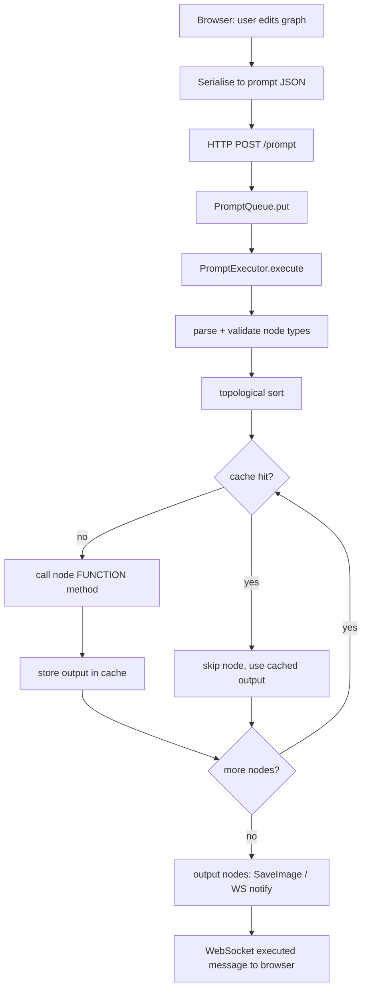
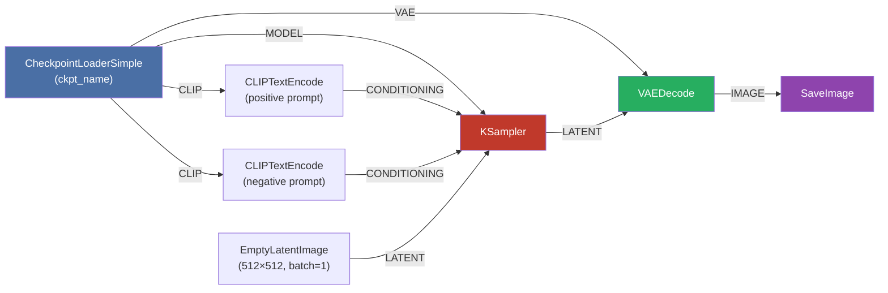
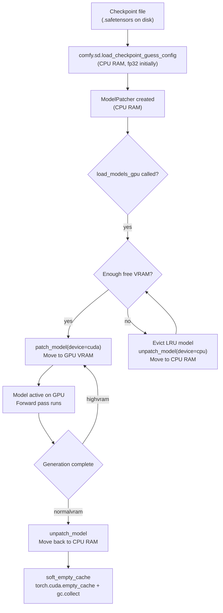
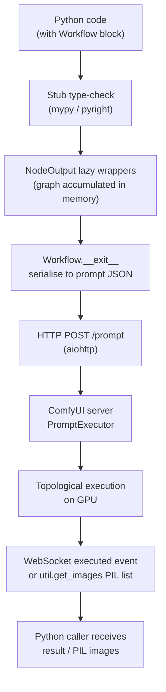
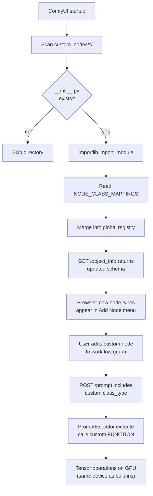
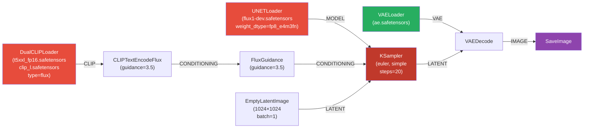
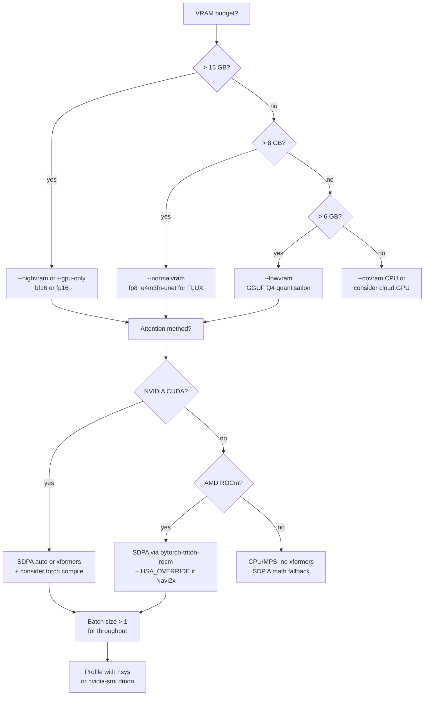
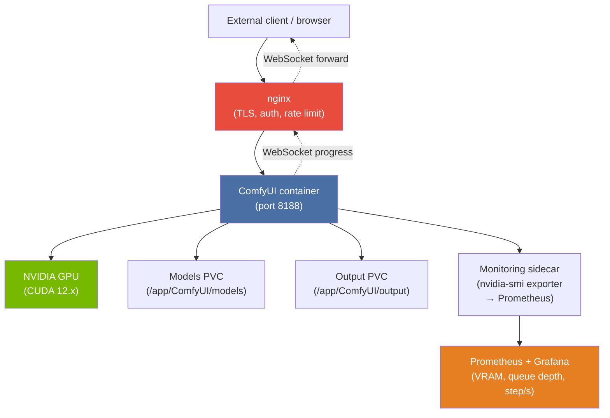

# Chapter 94 — ComfyUI and ComfyScript: Node-Graph AI Image Generation on Linux GPUs

**Audiences:** Graphics application developers and ML engineers who want to understand how ComfyUI
orchestrates diffusion model inference on Linux GPU infrastructure; Python developers who want to
author ComfyUI workflows programmatically using the ComfyScript typed frontend; systems developers
interested in how iterative denoising workloads are scheduled across CUDA, ROCm, and MPS GPU
backends via PyTorch.

---

## Table of Contents

1. [What ComfyUI Is (and What It Is Not)](#1-what-comfyui-is-and-what-it-is-not)
2. [The Node Graph Execution Model](#2-the-node-graph-execution-model)
3. [Core Built-In Nodes](#3-core-built-in-nodes)
4. [The Sampler and Scheduler System](#4-the-sampler-and-scheduler-system)
5. [Memory Management and GPU Selection on Linux](#5-memory-management-and-gpu-selection-on-linux)
6. [The REST API and WebSocket Protocol](#6-the-rest-api-and-websocket-protocol)
7. [ComfyScript: Type-Safe Python Workflows](#7-comfyscript-type-safe-python-workflows)
8. [Custom Node Development](#8-custom-node-development)
9. [FLUX.1 and Modern DiT Architecture Support](#9-flux1-and-modern-dit-architecture-support)
10. [Performance Profiling and Linux-Specific Optimisations](#10-performance-profiling-and-linux-specific-optimisations)
11. [ComfyUI in Production: Docker, APIs, and Automation](#11-comfyui-in-production-docker-apis-and-automation)
12. [Integrations](#12-integrations)

---

## 1. What ComfyUI Is (and What It Is Not)

ComfyUI is a modular, node-based graphical interface and execution engine for diffusion model
inference, primarily Stable Diffusion and its successors (SDXL, SD3, FLUX.1). It is **not** a
training framework, **not** a GUI toolkit in the traditional sense (it runs an
[aiohttp](https://docs.aiohttp.org/) web server and opens a browser tab), and **not** a diffusion
model itself — it is a pipeline orchestrator that schedules GPU kernel calls through PyTorch.
[Source: ComfyUI repository](https://github.com/comfyanonymous/ComfyUI)

### 1.1 ComfyUI vs Other Frontends

**ComfyUI vs Automatic1111 (A1111):** A1111 presents a linear pipeline — enter prompts, click
Generate, done. ComfyUI exposes the full pipeline as a directed acyclic graph (DAG) of nodes,
making every step visible and reconfigurable. This means greater flexibility (multi-pass pipelines,
custom conditioning, arbitrary node ordering) at the cost of a steeper learning curve. A1111 is
faster to use for simple tasks; ComfyUI is the tool of choice when the pipeline itself is the
engineering artifact.

**ComfyUI vs InvokeAI:** InvokeAI provides a canvas-based inpainting and composition UI that
ComfyUI deliberately lacks. ComfyUI's advantage is programmability and extensibility — the node
graph maps directly to code (see §7 on ComfyScript), making it far easier to version-control,
template, and automate workflows programmatically.

### 1.2 Architecture Overview

```
┌────────────────────────────────────────────┐
│  Browser (React, port 8188)                │
│  LiteGraph.js node canvas                  │
└──────────────┬─────────────────────────────┘
               │  HTTP POST /prompt (JSON)
               ▼
┌────────────────────────────────────────────┐
│  aiohttp server  (server.py)               │
│  PromptQueue → PromptExecutor              │
└──────────────┬─────────────────────────────┘
               │  Python function calls
               ▼
┌────────────────────────────────────────────┐
│  Node execution engine  (execution.py)     │
│  Topological sort → per-node dispatch      │
└──────────────┬─────────────────────────────┘
               │  PyTorch tensor operations
               ▼
┌────────────────────────────────────────────┐
│  GPU backend                               │
│  CUDA (NVIDIA) / ROCm HIP (AMD) / MPS     │
└────────────────────────────────────────────┘
```

The web interface is served at `http://127.0.0.1:8188` by default. The frontend is a
[LiteGraph.js](https://github.com/jagenjo/litegraph.js)-based canvas wrapped in a React shell.
[Source: ComfyUI server.py](https://github.com/comfyanonymous/ComfyUI/blob/master/server.py)

### 1.3 GPU Backends

ComfyUI delegates all tensor computation to PyTorch, which means the backend is determined by
which PyTorch wheel is installed:

| Backend | Hardware | PyTorch wheel |
|---------|----------|---------------|
| CUDA | NVIDIA (Ampere, Ada, Hopper, Blackwell) | `pip install torch --index-url https://download.pytorch.org/whl/cu121` |
| ROCm/HIP | AMD Radeon RX 6000/7000, Instinct MI | `pip install torch --index-url https://download.pytorch.org/whl/rocm6.0` |
| MPS | Apple Silicon (M1/M2/M3/M4) | Default macOS PyTorch wheel |
| CPU | Any | Default wheel; very slow |

PyTorch's ROCm wheel exposes the standard `torch.cuda.*` API on top of HIP, so ComfyUI's
`model_management.py` code path is identical for CUDA and ROCm — `torch.cuda.is_available()`
returns `True` on both.
[Source: PyTorch ROCm wheels](https://pytorch.org/get-started/locally/)

### 1.4 Supported Model Families

| Model family | Architecture | VAE latent channels | Notes |
|---|---|---|---|
| SD 1.5 | UNet 2D | 4 | Original; best LoRA/ControlNet ecosystem |
| SDXL | UNet 2D (larger) | 4 | Dual CLIP encoders; 1024px native |
| SD3 | DiT (MMDiT) | 16 | Multimodal diffusion transformer |
| FLUX.1 | DiT (dual-stream) | 16 | 12B params; see §9 |
| PixArt-Σ | DiT | 4 | High-res efficient transformer |
| Cascade | Multi-stage UNet | 4 (stage C) | Würstchen architecture |
| AuraFlow | DiT | 4 | Community open model |

### 1.5 Linux Installation

```bash
# Clone the repository
git clone https://github.com/comfyanonymous/ComfyUI
cd ComfyUI

# Create and activate a virtual environment
python -m venv venv
source venv/bin/activate

# Install Python dependencies (CUDA 12.x variant)
pip install torch torchvision torchaudio \
    --index-url https://download.pytorch.org/whl/cu121
pip install -r requirements.txt

# Launch — opens http://127.0.0.1:8188 in the browser
python main.py

# AMD ROCm: substitute the wheel URL
pip install torch torchvision torchaudio \
    --index-url https://download.pytorch.org/whl/rocm6.0
```

Place checkpoint files (`.safetensors` or `.ckpt`) in `models/checkpoints/`, LoRA files in
`models/loras/`, VAE files in `models/vae/`.

---

## 2. The Node Graph Execution Model

ComfyUI's core is a directed acyclic graph (DAG) of nodes. Each node is a Python class registered
in a global `NODE_CLASS_MAPPINGS` dictionary. The browser frontend serialises the graph to JSON
(referred to as the "prompt"), sends it via `HTTP POST /prompt`, and the server executes nodes in
topological order, caching intermediate outputs.
[Source: execution.py](https://github.com/comfyanonymous/ComfyUI/blob/master/execution.py)

### 2.1 Node Class Anatomy

Every ComfyUI node is a plain Python class with the following class-level attributes:

```python
class ExampleNode:
    @classmethod
    def INPUT_TYPES(cls) -> dict:
        return {
            "required": {
                "model":  ("MODEL",),
                "steps":  ("INT",   {"default": 20, "min": 1, "max": 150}),
                "cfg":    ("FLOAT", {"default": 7.0, "min": 0.0, "max": 100.0, "step": 0.1}),
                "mode":   ("COMBO", {"choices": ["fast", "quality", "draft"]}),
            },
            "optional": {
                "mask": ("MASK",),
            },
        }

    RETURN_TYPES  = ("MODEL", "LATENT")     # types of outputs
    RETURN_NAMES  = ("model", "latent")     # display names (optional)
    FUNCTION      = "run"                   # method to call
    CATEGORY      = "sampling"              # UI menu path
    OUTPUT_NODE   = False                   # True for terminal nodes (SaveImage etc.)

    def run(self, model, steps, cfg, mode, mask=None):
        ...
        return (model, latent_dict)
```

The type name strings understood by the engine include:
`"MODEL"`, `"CONDITIONING"`, `"LATENT"`, `"IMAGE"`, `"MASK"`, `"VAE"`, `"CLIP"`,
`"CONTROL_NET"`, `"INT"`, `"FLOAT"`, `"STRING"`, `"BOOLEAN"`, `"COMBO"`.

### 2.2 The Prompt JSON Format

When the user clicks Queue Prompt in the browser, the graph is serialised to a flat JSON dict
mapping node IDs (strings) to node descriptors:

```json
{
  "4": {
    "class_type": "CheckpointLoaderSimple",
    "inputs": { "ckpt_name": "v1-5-pruned-emaonly.safetensors" }
  },
  "5": {
    "class_type": "EmptyLatentImage",
    "inputs": { "width": 512, "height": 512, "batch_size": 1 }
  },
  "6": {
    "class_type": "CLIPTextEncode",
    "inputs": { "text": "a cyberpunk cat", "clip": ["4", 1] }
  },
  "7": {
    "class_type": "CLIPTextEncode",
    "inputs": { "text": "blurry, low quality", "clip": ["4", 1] }
  },
  "3": {
    "class_type": "KSampler",
    "inputs": {
      "model":        ["4", 0],
      "positive":     ["6", 0],
      "negative":     ["7", 0],
      "latent_image": ["5", 0],
      "seed":         42,
      "steps":        20,
      "cfg":          7.0,
      "sampler_name": "euler",
      "scheduler":    "normal",
      "denoise":      1.0
    }
  },
  "8": {
    "class_type": "VAEDecode",
    "inputs": { "samples": ["3", 0], "vae": ["4", 2] }
  },
  "9": {
    "class_type": "SaveImage",
    "inputs": { "images": ["8", 0], "filename_prefix": "ComfyUI" }
  }
}
```

The value `["4", 0]` is a **link reference**: node ID `"4"`, output index `0`. This is how node
outputs are wired to node inputs without actually passing tensors at serialisation time.

### 2.3 Execution Flow

`PromptExecutor.execute()` in
[execution.py](https://github.com/comfyanonymous/ComfyUI/blob/master/execution.py) drives the
entire run:

1. **Parse:** The prompt JSON is deserialised and validated against the registered node schemas
   from `NODE_CLASS_MAPPINGS`.
2. **Topological sort:** `get_input_data()` resolves link references and determines the
   dependency order. Nodes with no inputs from other nodes (leaf loaders, literal values) come
   first.
3. **Recursive execution:** `recursive_execute()` walks the sorted list, calling each node's
   `FUNCTION` method and storing outputs in an in-memory cache keyed by
   `(node_id, inputs_hash)`.
4. **Cache hits:** If a node's inputs hash matches the cache from a previous run, the node is
   skipped entirely. This is ComfyUI's primary mechanism for fast interactive iteration — changing
   the seed only re-runs nodes downstream of the changed value.
5. **Output collection:** Terminal nodes (`OUTPUT_NODE = True`) trigger side effects (saving
   images, sending WebSocket events) after their function returns.

### 2.4 Model Management Module

`comfy/model_management.py`
([source](https://github.com/comfyanonymous/ComfyUI/blob/master/comfy/model_management.py)) is the
GPU memory coordinator:

```python
# Key public API
comfy.model_management.load_models_gpu(models, memory_required=0)
comfy.model_management.soft_empty_cache(force=False)
comfy.model_management.get_free_memory(device=None)
comfy.model_management.unload_all_models()
comfy.model_management.get_torch_device()
```

`load_models_gpu()` checks available VRAM, evicts least-recently-used models to CPU RAM if
needed, then moves the requested models to GPU.

### 2.5 Mermaid: Prompt Execution Flow



---

## 3. Core Built-In Nodes

The canonical node definitions live in
[nodes.py](https://github.com/comfyanonymous/ComfyUI/blob/master/nodes.py) (2 500+ lines). This
section walks through the nodes used in nearly every workflow.

### 3.1 Checkpoint and Model Loading

**`CheckpointLoaderSimple`** (`class_type: "CheckpointLoaderSimple"`)

Loads a `.safetensors` or `.ckpt` checkpoint from `models/checkpoints/`. Returns the triple
`(MODEL, CLIP, VAE)`. Internally calls
`comfy.sd.load_checkpoint_guess_config(ckpt_path, output_vae=True, output_clip=True,
embedding_directory=...)` which inspects the state-dict shape to determine the architecture
(SD 1.x, SDXL, SD3, etc.) and instantiates the correct model class.

**`LoraLoader`** takes `(MODEL, CLIP)` plus `lora_name`, `strength_model` (float), and
`strength_clip` (float). Calls `comfy.sd.load_lora_for_models()` which merges the LoRA delta
weights into the model's parameter tensors using the standard rank-decomposition formula
`W' = W + α · (BA)`. Multiple `LoraLoader` nodes are chained to stack LoRAs.

### 3.2 Text Conditioning

**`CLIPTextEncode`** tokenises a prompt string using the loaded CLIP model and returns
`CONDITIONING` — a list of `[tensor, {"pooled_output": tensor}]` pairs.
The `clip_skip` parameter (default `-1`, i.e. the last encoder layer) controls which layer's
hidden states are used; SD anime models often benefit from `clip_skip=-2`.

**`CLIPTextEncodeSDXL`** is the SDXL-specific variant with dual encoders (CLIP-L and CLIP-G)
and extra integer inputs: `width`, `height`, `crop_w`, `crop_h`, `target_width`,
`target_height`. These feed SDXL's aesthetic conditioning vectors. Omitting the correct
resolution values degrades output quality noticeably.

**`ConditioningCombine`** concatenates two `CONDITIONING` tensors (useful for multi-subject
prompt mixing). **`ConditioningAverage`** blends two conditionings weighted by a `conditioning_to_strength`
float.

### 3.3 Latent Space Nodes

**`EmptyLatentImage`** returns a zero-filled latent dict:

```python
{"samples": torch.zeros(batch_size, 4, height // 8, width // 8)}
```

For FLUX.1 and SD3 the channel count is 16, not 4; the correct loader (`UNETLoader` — see §9)
automatically determines this.

**`VAEDecode`** converts a latent tensor to a pixel `IMAGE` tensor `[B, H, W, 3]` float `[0,1]`.
**`VAEEncode`** does the reverse, encoding a pixel image into latent space for img2img and
inpainting workflows.

**`VAEDecodeTiled`** / **`VAEEncodeTiled`**: tile-based variants that split the image into
overlapping `tile_size × tile_size` patches (default 512 pixels) before decoding/encoding, then
stitch the results. Essential when the full-resolution decode would exceed VRAM — for example, a
4096 × 4096 output decoded with `VAEDecode` would require ~8 GB of VRAM just for the pixel
tensor; tiling keeps peak allocation near 2 GB.

### 3.4 Sampling

**`KSampler`** — the central denoising node. Inputs:

| Input | Type | Notes |
|-------|------|-------|
| `model` | MODEL | The UNet/DiT to denoise with |
| `positive` | CONDITIONING | Positive text conditioning |
| `negative` | CONDITIONING | Negative text conditioning |
| `latent_image` | LATENT | Starting latent (noise for txt2img) |
| `seed` | INT | RNG seed; deterministic across runs |
| `steps` | INT | Total denoising steps |
| `cfg` | FLOAT | Classifier-Free Guidance scale |
| `sampler_name` | COMBO | Sampler algorithm name |
| `scheduler` | COMBO | Noise schedule curve |
| `denoise` | FLOAT 0–1 | 1.0 = full noise; <1.0 for img2img |

`KSampler` calls `comfy.samplers.common_ksampler()` which sets up the noise, calls
`comfy.samplers.KSampler` (the engine class), and runs the denoising loop.

**`KSamplerAdvanced`** adds fine-grained control for multi-pass pipelines:

- `add_noise` (`"enable"` / `"disable"`) — whether to add fresh noise at `start_at_step`
- `noise_seed` — seed for the noise tensor
- `start_at_step` / `end_at_step` — run only a sub-range of steps; enables base+refiner split
- `return_with_leftover_noise` — keep residual noise for the next sampler stage

### 3.5 Image I/O

**`SaveImage`**: output node (`OUTPUT_NODE = True`); writes PNG files to `output/` with embedded
ComfyUI workflow JSON in the `tEXt` PNG chunk (key `"workflow"`). The `filename_prefix` supports
date tokens such as `%date:yyyy-MM-dd%`. Triggers a `{"type": "executed", ...}` WebSocket event
with the saved filenames.

**`PreviewImage`**: sends the image back over the WebSocket for display in the browser without
saving to disk; useful during iterative development.

**`LoadImage`** / **`LoadImageMask`**: read from `input/`; mask variant extracts the alpha channel
as a `MASK` tensor `[B, H, W]`.

### 3.6 ControlNet Nodes

**`ControlNetLoader`** loads a ControlNet model from `models/controlnet/`.
**`ControlNetApplyAdvanced`** applies it to a `CONDITIONING`:

```python
# Inputs
image:         IMAGE          # preprocessed control image (Canny, depth, pose, etc.)
control_net:   CONTROL_NET    # loaded ControlNet model
strength:      FLOAT          # 0.0–2.0; 1.0 = full strength
start_percent: FLOAT          # step fraction to begin applying (0.0 = from step 0)
end_percent:   FLOAT          # step fraction to stop applying  (1.0 = until end)
# Outputs: (positive CONDITIONING, negative CONDITIONING)
```

### 3.7 Image Processing

**`ImageScale`** / **`ImageScaleBy`**: resize `IMAGE` tensors using `"nearest-exact"`,
`"bilinear"`, `"area"`, `"bicubic"`, or `"lanczos"` interpolation modes. These map directly to
PyTorch's `F.interpolate` mode names.

### 3.8 Mermaid: Standard SD 1.5 Text-to-Image Workflow



*Data type annotations on edges: MODEL (blue), CONDITIONING (orange), LATENT (pink), IMAGE
(green), VAE (teal).*

---

## 4. The Sampler and Scheduler System

The diffusion denoising loop is the GPU-intensive core of every ComfyUI workflow. Each step calls
the UNet or DiT forward pass once or twice (CFG requires two calls), making sampler choice the
primary determinant of both output quality and generation speed.
[Source: comfy/samplers.py](https://github.com/comfyanonymous/ComfyUI/blob/master/comfy/samplers.py)

### 4.1 k-Diffusion Integration

ComfyUI wraps [k-diffusion](https://github.com/crowsonkb/k-diffusion) samplers via the
`comfy.k_diffusion.sampling` namespace. The available sampler algorithm names in
`KSAMPLER_NAMES` (as of mid-2025) include:

```python
KSAMPLER_NAMES = [
    "euler", "euler_cfg_pp", "euler_ancestral", "euler_ancestral_cfg_pp",
    "heun", "heunpp2", "dpm_2", "dpm_2_ancestral",
    "lms", "dpm_fast", "dpm_adaptive",
    "dpmpp_2s_ancestral", "dpmpp_2s_ancestral_cfg_pp",
    "dpmpp_sde", "dpmpp_sde_gpu",
    "dpmpp_2m", "dpmpp_2m_cfg_pp", "dpmpp_2m_sde", "dpmpp_2m_sde_gpu",
    "dpmpp_2m_sde_heun", "dpmpp_2m_sde_heun_gpu",
    "dpmpp_3m_sde", "dpmpp_3m_sde_gpu",
    "ddim", "ddpm", "uni_pc", "uni_pc_bh2",
    "lcm", "ipndm", "ipndm_v", "deis",
    "res_multistep", "res_multistep_cfg_pp",
    "res_multistep_ancestral", "res_multistep_ancestral_cfg_pp",
    "er_sde", "sa_solver", "sa_solver_pece",
]
```

The scheduler (noise curve) names are:

```python
SCHEDULER_NAMES = [
    "normal", "karras", "exponential", "sgm_uniform",
    "simple", "ddim_uniform", "beta", "linear_quadratic", "kl_optimal",
]
```

**Practical recommendations:**
- `euler` + `normal`: fast, predictable; good for testing and draft iterations
- `dpmpp_2m` + `karras`: high quality at 20–30 steps; the community standard for SD 1.5/SDXL
- `dpmpp_3m_sde` + `exponential`: slightly better detail but slower and less reproducible
  (ancestral samplers are stochastic)
- `lcm` + `sgm_uniform`: 4–8 step generation with LCM-LoRA or LCM-distilled checkpoints
- `euler` + `simple`: correct choice for FLUX.1 (rectified flow)

### 4.2 Classifier-Free Guidance (CFG)

At each denoising step, the UNet is called twice when CFG > 1.0:

```python
# Conceptual CFG computation (from comfy/samplers.py)
noise_pred_uncond = model(latent, t, conditioning=negative)
noise_pred_cond   = model(latent, t, conditioning=positive)
noise_pred = noise_pred_uncond + cfg_scale * (noise_pred_cond - noise_pred_uncond)
```

CFG `7.0` is the typical default. Values above `12.0` cause oversaturation and colour banding.
Values below `1.5` produce incoherent outputs that ignore the prompt. CFG = `1.0` is correct for
guidance-distilled models like FLUX.1-schnell that bake the guidance into the model weights.
[Source: classifier-free guidance paper](https://arxiv.org/abs/2207.12598)

### 4.3 ModelPatcher

`comfy.model_patcher.ModelPatcher` wraps the underlying PyTorch `nn.Module`:

```python
class ModelPatcher:
    def patch_model(self, device_to=None, lowvram_model_memory=0):
        """Move model to device_to and apply all registered patches (LoRA, etc.)."""

    def unpatch_model(self, device_to=None, unpatch_weights=True):
        """Remove patches and optionally move back to offload_device (CPU)."""

    def clone(self) -> "ModelPatcher":
        """Shallow clone sharing the underlying model; patches are independent."""
```

LoRA patches are registered via `ModelPatcher.add_patches()` and applied in `patch_model()` by
adding the rank-decomposed delta to the corresponding weight tensor in-place. `unpatch_model()`
reverses this, restoring the original weights.

### 4.4 Rectified-Flow Schedulers (SD3, FLUX)

SD3 and FLUX.1 use rectified flow (flow matching) rather than DDPM noise schedules.
[Source: SD3 paper](https://arxiv.org/abs/2403.03206) The noise trajectory is a straight line
in latent space, which in practice means:

- Fewer steps are needed (4–8 for FLUX-schnell, 20–30 for FLUX-dev)
- The `simple` scheduler is designed for this regime
- CFG and negative prompts are not used for FLUX-schnell (distilled away); `FluxGuidance` node
  provides the single guidance float that replaces the CFG mechanism

### 4.5 DDIM Inversion

Running the sampler backward from a real image latent produces a noise tensor that, when
forward-sampled from, approximately reproduces the original image. This DDIM inversion technique
underpins img2img and style-transfer workflows: encode image → invert to noise → forward-denoise
with a modified prompt → decode output. In ComfyUI this requires `KSamplerAdvanced` with
`denoise < 1.0` to control how much of the inversion is re-denoised.

### 4.6 Mermaid: Denoising Loop

```mermaid
graph TD
    A[Latent tensor x_T\n pure noise at t=T] --> B[Step loop: t = T → 0]
    B --> C{CFG enabled?}
    C -- yes --> D[UNet forward: conditioned]
    C -- yes --> E[UNet forward: unconditioned]
    D --> F["combine: uncond + cfg*(cond - uncond)"]
    E --> F
    C -- no --> G[UNet forward: single pass]
    F --> H[Scheduler: compute x_{t-1} from noise pred]
    G --> H
    H --> I{t == 0?}
    I -- no --> B
    I -- yes --> J[Latent x_0 → VAEDecode → IMAGE]
```

---

## 5. Memory Management and GPU Selection on Linux

Memory management is where Linux GPU stack knowledge is directly applicable to ComfyUI operation.
Understanding the model lifecycle and VRAM pressure is essential for both efficient operation and
debugging OOM failures.
[Source: comfy/model_management.py](https://github.com/comfyanonymous/ComfyUI/blob/master/comfy/model_management.py)

### 5.1 The LoadedModel Abstraction

`model_management.py` maintains a `current_loaded_models` list of `LoadedModel` wrapper objects.
Each `LoadedModel` tracks:

```python
class LoadedModel:
    model: ModelPatcher      # the wrapped UNet/DiT/VAE/CLIP
    device: torch.device     # current device (GPU or CPU)

    def model_memory(self) -> int:
        """Bytes required in VRAM while actively inferencing."""

    def model_size(self) -> int:
        """Total parameter size in bytes."""

    def model_memory_required(self, device: torch.device) -> int:
        """Estimated VRAM needed to load to device."""
```

When `load_models_gpu()` is called with a list of models (e.g., UNet + VAE + CLIP for a single
generation), it:

1. Computes total VRAM required
2. Checks `get_free_memory(device)` (calls `torch.cuda.mem_get_info()`)
3. If insufficient, evicts models from `current_loaded_models` in LRU order until enough VRAM
   is free
4. Calls `model.patch_model(device_to=gpu)` to move each model to the GPU

### 5.2 Memory Strategy CLI Flags

`python main.py` accepts these memory strategy flags:

| Flag | Behaviour | Recommended for |
|------|-----------|-----------------|
| `--gpu-only` | All models stay on GPU; OOM if VRAM insufficient | 24 GB+ VRAM |
| `--highvram` | Models stay on GPU between generations | 16–24 GB VRAM |
| `--normalvram` | (Default) Models moved to CPU RAM when another model needs VRAM | 8–16 GB VRAM |
| `--lowvram` | UNet attention computed in chunks; very slow | 6 GB VRAM |
| `--novram` | Computation on CPU RAM only | No GPU; emergency only |
| `--cpu` | Force CPU even with GPU present | Debugging |

`--lowvram` achieves VRAM reduction by splitting the UNet into sequential blocks and processing
one block at a time, keeping only the active block resident in VRAM. This prevents PyTorch from
allocating the full activation tensor at once, at the cost of much higher latency.

### 5.3 GPU Selection

```bash
# Select GPU 1 via environment variable (works for both CUDA and ROCm)
CUDA_VISIBLE_DEVICES=1 python main.py

# Or via CLI flag
python main.py --cuda-device 1

# For ROCm (HIP equivalent)
HIP_VISIBLE_DEVICES=0 python main.py
```

`get_torch_device()` in `model_management.py`:

```python
def get_torch_device():
    if args.cpu:
        return torch.device("cpu")
    if torch.cuda.is_available():
        return torch.device(torch.cuda.current_device())
    if torch.backends.mps.is_available():
        return torch.device("mps")
    return torch.device("cpu")
```

Because PyTorch's ROCm wheel exposes `torch.cuda.*` functions via the HIP backend, this code
works identically on NVIDIA and AMD hardware.

### 5.4 Cache Management

`soft_empty_cache()` is called after each generation:

```python
def soft_empty_cache(force=False):
    if is_intel_xpu():
        torch.xpu.empty_cache()
    elif torch.cuda.is_available():
        if force or get_free_memory(get_torch_device()) > 1024 * 1024 * 1024:
            torch.cuda.empty_cache()
    gc.collect()
```

**Important:** `torch.cuda.empty_cache()` releases cached-but-unoccupied blocks in PyTorch's
caching allocator back to the CUDA runtime. It does **not** immediately reduce the value reported
by `nvidia-smi` if those blocks are still in PyTorch's pool. This is expected behaviour — the
allocator retains a pool to avoid repeated `cudaMalloc`/`cudaFree` calls.

Setting `PYTORCH_CUDA_ALLOC_CONF=expandable_segments:True` before launching ComfyUI reduces
fragmentation on PyTorch 2.0+ (CUDA 11.7+):

```bash
PYTORCH_CUDA_ALLOC_CONF=expandable_segments:True python main.py
```

### 5.5 Precision Flags

| Flag | Dtype | VRAM saving vs fp32 | Notes |
|------|-------|---------------------|-------|
| (default) | fp16 | 50% | Auto-selected on most GPUs |
| `--force-fp16` | fp16 | 50% | Force even on GPUs where auto prefers fp32 |
| `--force-fp32` | fp32 | 0% | Older NVIDIA (pre-Pascal) or some AMD cards |
| `--bf16-unet` | bfloat16 | 50% | Better range than fp16; requires Ampere+ or ROCm |
| `--fp8_e4m3fn-unet` | fp8 E4M3 | ~75% | Requires PyTorch 2.1+; native on Ada/Hopper |
| `--fp8_e5m2-unet` | fp8 E5M2 | ~75% | Slightly more range than E4M3 |

fp8 quantisation for the UNet reduces VRAM consumption by approximately 50% compared to fp16
with minimal quality loss on most models (FLUX.1 in particular shows negligible degradation in
fp8). [Source: PyTorch fp8 documentation](https://pytorch.org/docs/stable/quantization.html)

### 5.6 Mermaid: Model Lifecycle



---

## 6. The REST API and WebSocket Protocol

ComfyUI exposes a complete JSON REST API served by aiohttp at port 8188, enabling fully headless
programmatic use without the browser frontend.
[Source: server.py](https://github.com/comfyanonymous/ComfyUI/blob/master/server.py)

### 6.1 REST Endpoints

**`POST /prompt`**

Queue a workflow for execution:

```
Body: {"prompt": <workflow_dict>, "client_id": "<uuid4>"}
Returns: {"prompt_id": "<uuid>", "number": <queue_position>, "node_errors": {}}
```

`node_errors` is non-empty if any node in the workflow references an unregistered class type or
has mismatched input types — useful for early validation before GPU execution begins.

**`GET /queue`**

Inspect the execution queue:

```json
{
  "queue_running": [[1, "abc-123", {...prompt...}, {"client_id": "..."}]],
  "queue_pending": []
}
```

**`POST /queue`**

Manage the queue:

```json
{"clear": true}
{"delete": ["<prompt_id1>", "<prompt_id2>"]}
```

**`GET /history`** / **`GET /history/<prompt_id>`**

Retrieve completed generation results:

```json
{
  "abc-123": {
    "prompt": [...],
    "outputs": {
      "9": {
        "images": [
          {"filename": "ComfyUI_00042_.png", "subfolder": "", "type": "output"}
        ]
      }
    },
    "status": {"status_str": "success", "completed": true}
  }
}
```

**`GET /view?filename=<name>&subfolder=<dir>&type=<output|input|temp>`**

Download a generated image as binary PNG.

**`GET /object_info`**

Returns the complete schema of all registered node types including their `INPUT_TYPES`,
`RETURN_TYPES`, and display names. ComfyScript uses this endpoint to generate typed Python stubs.

**`POST /upload/image`**

Multipart form upload placing an image in the `input/` directory. Useful for automating
img2img and inpainting workflows where the control image is programmatically generated.

**`GET /system_stats`**

Returns system and per-device VRAM statistics:

```json
{
  "system": {
    "os": "Linux-6.8.0-generic-x86_64",
    "python_version": "3.11.8",
    "embedded_python": false
  },
  "devices": [{
    "name": "NVIDIA GeForce RTX 4090",
    "type": "cuda",
    "index": 0,
    "vram_total": 25769803776,
    "vram_free": 22548578304,
    "torch_vram_total": 25448923136,
    "torch_vram_free": 22228897792
  }]
}
```

The `torch_vram_*` fields reflect what PyTorch's allocator has reserved, which may differ
from OS-level VRAM readings due to the allocator's caching pool.

### 6.2 WebSocket Protocol

Connect to `ws://127.0.0.1:8188/ws?client_id=<uuid>` (the same client UUID sent with
`POST /prompt`). The server pushes JSON messages:

| `type` | Payload summary | Trigger |
|--------|----------------|---------|
| `"status"` | `{"exec_info": {"queue_remaining": N}}` | Queue depth change |
| `"progress"` | `{"value": 10, "max": 20, "prompt_id": "..."}` | Each sampler step |
| `"executing"` | `{"node": "5", "prompt_id": "..."}` | Node begins execution |
| `"executed"` | `{"node": "9", "output": {...}, "prompt_id": "..."}` | Node completes |
| `"execution_error"` | `{"node_id": "5", "node_type": "KSampler", "exception_message": "...", "traceback": [...]}` | Unhandled exception |
| `"execution_cached"` | `{"nodes": ["4", "6"], "prompt_id": "..."}` | Cache-hit nodes skipped |

### 6.3 Minimal Async Python Client

```python
import asyncio, uuid, json, aiohttp
from pathlib import Path

SERVER    = "http://127.0.0.1:8188"
CLIENT_ID = str(uuid.uuid4())

async def queue_prompt(workflow: dict) -> str:
    """Submit workflow JSON; return the assigned prompt_id."""
    async with aiohttp.ClientSession() as s:
        async with s.post(f"{SERVER}/prompt",
                          json={"prompt": workflow,
                                "client_id": CLIENT_ID}) as r:
            data = await r.json()
            if data.get("node_errors"):
                raise ValueError(f"Node errors: {data['node_errors']}")
            return data["prompt_id"]

async def wait_for_result(prompt_id: str) -> list[str]:
    """Block on WebSocket until the given prompt_id executes; return image filenames."""
    async with aiohttp.ClientSession() as s:
        async with s.ws_connect(
            f"ws://127.0.0.1:8188/ws?client_id={CLIENT_ID}"
        ) as ws:
            async for msg in ws:
                if msg.type != aiohttp.WSMsgType.TEXT:
                    continue
                data = json.loads(msg.data)
                if (data["type"] == "executed"
                        and data["data"]["prompt_id"] == prompt_id):
                    imgs = data["data"]["output"].get("images", [])
                    return [i["filename"] for i in imgs]
                if (data["type"] == "execution_error"
                        and data["data"]["prompt_id"] == prompt_id):
                    raise RuntimeError(data["data"]["exception_message"])
    return []

async def download_image(filename: str, dest: Path) -> None:
    """Download a completed output image by filename."""
    url = f"{SERVER}/view?filename={filename}&subfolder=&type=output"
    async with aiohttp.ClientSession() as s:
        async with s.get(url) as r:
            dest.write_bytes(await r.read())
```

---

## 7. ComfyScript: Type-Safe Python Workflows

[ComfyScript](https://github.com/Chaoses-Ib/ComfyScript) (also mirrored at
[comfyorg/comfyscript](https://github.com/comfyorg/comfyscript)) is a Python frontend that
generates typed stubs from a running ComfyUI server, enabling workflow authoring with full IDE
autocompletion, type checking, and the ability to drive generation from Python scripts or Jupyter
notebooks.
[Source: ComfyScript README](https://github.com/Chaoses-Ib/ComfyScript/blob/main/README.md)

### 7.1 Installation

```bash
# Default async mode (recommended for scripts)
pip install comfy-script[default]

# Or the synchronous wrapper (simpler for notebooks)
pip install comfy-script[sync]
```

Requires a running ComfyUI server. The package is on PyPI as
[comfy-script](https://pypi.org/project/comfy-script/).

### 7.2 Stub Generation

ComfyScript queries `GET /object_info` on the connected server and generates a
`comfy_script/runtime/nodes.pyi` stub file. Every registered node type becomes a typed Python
function or class with:

- Typed parameters matching `INPUT_TYPES` (int, float, str, enumerated combo values)
- Typed return value(s) matching `RETURN_TYPES`
- IDE-visible docstring from the node's `CATEGORY` and description

Stubs are regenerated each time `load()` is called, ensuring they match the custom nodes
actually installed on that server instance.

### 7.3 The Workflow Context Manager

```python
from comfy_script.runtime import *
load("http://127.0.0.1:8188/")      # Connect; generate stubs
from comfy_script.runtime.nodes import *  # Import generated node functions
```

Node calls inside a `with Workflow():` block return lazy `NodeOutput` references rather than
executing immediately. On exit the full graph is serialised as a ComfyUI prompt JSON and
submitted to `POST /prompt`.

```python
with Workflow(wait=True):           # wait=True blocks until generation completes
    model, clip, vae = CheckpointLoaderSimple("v1-5-pruned-emaonly.safetensors")
    pos  = CLIPTextEncode("a cyberpunk cat on a neon-lit rooftop", clip)
    neg  = CLIPTextEncode("blurry, low quality, watermark", clip)
    latent = EmptyLatentImage(512, 512, 1)
    latent = KSampler(model, 42, 20, 7.0, "euler", "normal",
                      pos, neg, latent, 1.0)
    image  = VAEDecode(latent, vae)
    SaveImage(image, "ComfyScript")
```

When `wait=False` (default), the `Workflow` context manager queues the prompt and returns
immediately, allowing multiple workflows to be queued concurrently from a single Python process.

### 7.4 Full txt2img Example

```python
import asyncio
from comfy_script.runtime import *

load("http://127.0.0.1:8188/")
from comfy_script.runtime.nodes import *

async def txt2img(
    prompt:   str,
    negative: str  = "blurry, low quality, watermark",
    steps:    int  = 20,
    cfg:      float = 7.0,
    seed:     int  = 42,
    width:    int  = 512,
    height:   int  = 512,
) -> None:
    with Workflow(wait=True):
        model, clip, vae = CheckpointLoaderSimple(
            "v1-5-pruned-emaonly.safetensors"
        )
        pos    = CLIPTextEncode(prompt, clip)
        neg    = CLIPTextEncode(negative, clip)
        latent = EmptyLatentImage(width, height, 1)
        latent = KSampler(model, seed, steps, cfg,
                          "euler", "normal", pos, neg, latent, 1.0)
        image  = VAEDecode(latent, vae)
        SaveImage(image, "ComfyScript")

asyncio.run(txt2img("a cyberpunk cat on a neon-lit rooftop"))
```

Note: The exact KSampler argument order matches the stub generated from `GET /object_info` on
your specific server; check the generated `.pyi` file if the call raises a type error. Note:
parameter ordering in generated stubs may vary by ComfyScript version — needs verification
against the installed stub for the server's node registration order.

### 7.5 Image Retrieval Without Saving

ComfyScript provides a `util.get_images()` helper that returns `list[PIL.Image.Image]` directly:

```python
with Workflow(wait=True):
    model, clip, vae = CheckpointLoaderSimple("v1-5-pruned-emaonly.safetensors")
    pos    = CLIPTextEncode("a majestic mountain at sunrise", clip)
    neg    = CLIPTextEncode("fog, haze", clip)
    latent = EmptyLatentImage(512, 512, 1)
    latent = KSampler(model, 0, 20, 7.0, "euler", "normal",
                      pos, neg, latent, 1.0)
    image  = VAEDecode(latent, vae)
    images = util.get_images(image)  # list[PIL.Image.Image]; does not save to disk
```

### 7.6 SDXL Workflow with LoRA and Base+Refiner Two-Pass

```python
with Workflow(wait=True):
    # Load base and refiner checkpoints
    base,    clip,  vae       = CheckpointLoaderSimple("sd_xl_base_1.0.safetensors")
    refiner, rclip, _         = CheckpointLoaderSimple("sd_xl_refiner_1.0.safetensors")

    # Stack a LoRA on the base model
    base, clip = LoraLoader(base, clip,
                             "detail_tweaker_xl.safetensors",
                             strength_model=0.8,
                             strength_clip=0.8)

    # SDXL conditioning with aesthetic size vectors
    pos = CLIPTextEncodeSDXL(
        "cinematic portrait, 8k, photorealistic", clip,
        width=1024, height=1024, crop_w=0, crop_h=0,
        target_width=1024, target_height=1024
    )
    neg = CLIPTextEncodeSDXL(
        "blur, ugly, watermark", clip,
        width=1024, height=1024, crop_w=0, crop_h=0,
        target_width=1024, target_height=1024
    )

    latent = EmptyLatentImage(1024, 1024, 1)

    # Base pass: steps 0–20 of 25; leave noise for refiner
    latent = KSamplerAdvanced(
        base, "enable", 42, 25, 7.5,
        "dpmpp_2m", "karras",
        pos, neg, latent,
        0, 20, "enable", 1.0
    )

    # Refiner pass: steps 20–25; add no new noise
    latent = KSamplerAdvanced(
        refiner, "disable", 42, 25, 7.5,
        "dpmpp_2m", "karras",
        pos, neg, latent,
        20, 25, "disable", 1.0
    )

    image = VAEDecode(latent, vae)
    SaveImage(image, "SDXL_refined")
```

### 7.7 Mermaid: ComfyScript Architecture



---

## 8. Custom Node Development

Custom nodes extend ComfyUI without forking the main repository. The community maintains hundreds
of node packs discoverable and installable through
[ComfyUI-Manager](https://github.com/ltdrdata/ComfyUI-Manager).
[Source: ComfyUI custom nodes documentation](https://docs.comfy.org/custom-nodes/overview)

### 8.1 Node Discovery

At startup ComfyUI scans all `custom_nodes/*/` subdirectories. Each package's `__init__.py`
(or `__init__.py`-equivalent top-level module) must export:

```python
NODE_CLASS_MAPPINGS: dict[str, type]         # required
NODE_DISPLAY_NAME_MAPPINGS: dict[str, str]   # optional; human-readable names in UI
```

The discovery code in `nodes.py` does:

```python
for path in Path("custom_nodes").iterdir():
    if path.is_dir() and (path / "__init__.py").exists():
        module = importlib.import_module(f"custom_nodes.{path.name}")
        NODE_CLASS_MAPPINGS.update(module.NODE_CLASS_MAPPINGS)
```

This means custom nodes are globally registered alongside built-in nodes — no configuration
files needed.

### 8.2 Full Custom Node Example

The following implements a Gaussian blur filter operating on `IMAGE` tensors:

```python
import torch
import torch.nn.functional as F
from typing import Tuple

class GaussianBlurNode:
    """Apply Gaussian blur to a ComfyUI IMAGE tensor [B, H, W, C]."""

    @classmethod
    def INPUT_TYPES(cls) -> dict:
        return {
            "required": {
                "image":  ("IMAGE",),
                "radius": ("INT",   {"default": 3,   "min": 1,   "max": 31,   "step": 2}),
                "sigma":  ("FLOAT", {"default": 1.5, "min": 0.1, "max": 20.0, "step": 0.1}),
            }
        }

    RETURN_TYPES  = ("IMAGE",)
    RETURN_NAMES  = ("image",)
    FUNCTION      = "apply_blur"
    CATEGORY      = "image/filters"
    OUTPUT_NODE   = False

    def apply_blur(
        self,
        image:  torch.Tensor,  # shape: [B, H, W, C], float32, [0, 1]
        radius: int,
        sigma:  float,
    ) -> Tuple[torch.Tensor]:
        # F.gaussian_blur expects [B, C, H, W]; permute in
        x = image.permute(0, 3, 1, 2)
        kernel_size = radius * 2 + 1   # must be odd
        blurred = F.gaussian_blur(
            x,
            kernel_size=[kernel_size, kernel_size],
            sigma=[sigma, sigma],
        )
        # Permute back to ComfyUI convention [B, H, W, C]
        return (blurred.permute(0, 2, 3, 1),)


NODE_CLASS_MAPPINGS = {
    "GaussianBlur": GaussianBlurNode,
}
NODE_DISPLAY_NAME_MAPPINGS = {
    "GaussianBlur": "Gaussian Blur (Custom)",
}
```

Install by placing this as `custom_nodes/gaussian_blur/__init__.py` and restarting ComfyUI.

### 8.3 Tensor Type Conventions

These conventions are critical for correctness when writing custom nodes:

| Type name | Tensor shape | dtype | Range | Notes |
|-----------|-------------|-------|-------|-------|
| `IMAGE` | `[B, H, W, C]` | `float32` | `[0.0, 1.0]` | C=3 (RGB); on GPU during execution |
| `MASK` | `[B, H, W]` | `float32` | `[0.0, 1.0]` | 1.0 = masked (keep), 0.0 = ignored |
| `LATENT` | Python `dict` | — | — | Key `"samples"` → `[B, C, H//8, W//8]`; may have `"noise_mask"`, `"batch_index"` |
| `MODEL` | Python object | — | — | `comfy.model_patcher.ModelPatcher` instance |
| `CLIP` | Python object | — | — | `comfy.sd.CLIP` instance |
| `VAE` | Python object | — | — | `comfy.sd.VAE` instance |

The `LATENT` dict convention is important: nodes that receive and return `LATENT` must always
pass through the dict intact, not just the `"samples"` tensor, or keys like `"noise_mask"` used
by inpainting will be silently lost.

### 8.4 IS_CHANGED for Node-Level Memoization

```python
@classmethod
def IS_CHANGED(cls, image, radius, sigma) -> str:
    """Return a hash; if it matches the cached value, ComfyUI skips this node."""
    import hashlib
    h = hashlib.md5(f"{radius}-{sigma}".encode())
    return h.hexdigest()
```

When `IS_CHANGED` is omitted, ComfyUI's default caching compares inputs by identity, which
handles tensor-valued inputs correctly but may over-execute for nodes with complex state.
Nodes that read from disk (e.g., `LoadImage`) use `IS_CHANGED` returning `float("nan")` to
force re-execution on every run.

### 8.5 Web Extension Files

Custom nodes may ship `web/js/*.js` files that are served via `GET /extensions` and loaded by
the browser frontend. These can add:

- Custom widget types (colour pickers, image thumbnails, preview canvases)
- Context menu entries on specific node types
- Additional keyboard shortcuts

The JS files access the LiteGraph API directly; the community convention is to follow the
patterns in [ComfyUI-Impact-Pack](https://github.com/ltdrdata/ComfyUI-Impact-Pack)'s
`web/js/` directory.

### 8.6 Notable Community Node Packs

| Pack | Function |
|------|----------|
| [ComfyUI-Manager](https://github.com/ltdrdata/ComfyUI-Manager) | GUI manager for installing/updating node packs |
| [ComfyUI-Impact-Pack](https://github.com/ltdrdata/ComfyUI-Impact-Pack) | Face detailing, SAM segmentation, detailers |
| [ComfyUI-Advanced-ControlNet](https://github.com/Kosinkadink/ComfyUI-Advanced-ControlNet) | ControlNet with per-step weight curves |
| [WAS-Node-Suite](https://github.com/WASasquatch/was-node-suite-comfyui) | Image processing utilities (200+ nodes) |
| [efficiency-nodes-comfyui](https://github.com/jags111/efficiency-nodes-comfyui) | Condensed loader + sampler + save single nodes |
| [ComfyUI-VideoHelperSuite](https://github.com/Kosinkadink/ComfyUI-VideoHelperSuite) | Video loading, frame manipulation, GIF export |
| [ComfyUI-GGUF](https://github.com/city96/ComfyUI-GGUF) | GGUF-quantised model loading via llama.cpp backend |

### 8.7 Mermaid: Custom Node Pipeline



---

## 9. FLUX.1 and Modern DiT Architecture Support

FLUX.1, developed by [Black Forest Labs](https://github.com/black-forest-labs/flux), represents the
transition from UNet-based architectures (SD 1.5, SDXL) to Diffusion Transformer (DiT)
architectures for high-quality text-to-image generation. ComfyUI added native FLUX support in
mid-2024. [Source: FLUX GitHub](https://github.com/black-forest-labs/flux)

### 9.1 FLUX.1 Architecture Overview

FLUX.1 uses a dual-stream transformer architecture with two phases:

1. **Dual-stream blocks:** image tokens and text tokens are processed in parallel streams
   that attend to each other (analogous to cross-attention in UNet but bidirectional)
2. **Single-stream blocks:** image and text tokens are concatenated and processed jointly

Key differences from SDXL:

| Property | SDXL | FLUX.1-dev |
|----------|------|-----------|
| Architecture | UNet 2D | DiT (dual+single stream) |
| Parameters | ~3.5B | ~12B |
| VAE latent channels | 4 | 16 |
| Text encoders | CLIP-L + CLIP-G | T5-XXL + CLIP-L |
| CFG negative prompts | Yes | No (guidance-distilled) |
| Native resolution | 1024 × 1024 | 1024 × 1024 (any AR) |
| Minimum steps | ~20 | 4 (schnell), 20–30 (dev) |

**FLUX.1-dev** is a 12 B-parameter guidance-distilled model (open weights, non-commercial
license). **FLUX.1-schnell** is further distilled for 4-step generation (Apache 2.0 license).
[Source: FLUX.1 model page](https://huggingface.co/black-forest-labs/FLUX.1-dev)

### 9.2 FLUX Workflow Node Set

FLUX requires separate loaders rather than the all-in-one `CheckpointLoaderSimple`:

**`UNETLoader`** — loads the FLUX transformer weights:

```python
# INPUT_TYPES
{
  "required": {
    "unet_name":    ("UNET",),       # filename from models/unet/
    "weight_dtype": ("COMBO", {
        "choices": ["default", "fp8_e4m3fn", "fp8_e5m2"]
    }),
  }
}
# RETURN_TYPES: ("MODEL",)
```

**`DualCLIPLoader`** — loads the T5-XXL + CLIP-L pair:

```python
{
  "required": {
    "clip_name1": ("CLIP",),    # e.g. "t5xxl_fp16.safetensors"
    "clip_name2": ("CLIP",),    # e.g. "clip_l.safetensors"
    "type":       ("COMBO", {"choices": ["flux", "sdxl", "sd3", "stable_audio"]}),
  }
}
```

**`VAELoader`** — loads the FLUX autoencoder (`ae.safetensors`).

**`CLIPTextEncodeFlux`** — FLUX-specific text encoder node:
[Source: ComfyUI FLUX node docs](https://docs.comfy.org/built-in-nodes/ClipTextEncodeFlux)

```python
{
  "required": {
    "clip_l":   ("STRING", {"multiline": True}),  # short prompt for CLIP-L
    "t5xxl":    ("STRING", {"multiline": True}),  # long prompt for T5-XXL (up to 256 tokens)
    "guidance": ("FLOAT",  {"default": 3.5, "min": 0.0, "max": 100.0}),
    "clip":     ("CLIP",),
  }
}
# RETURN_TYPES: ("CONDITIONING",)
```

T5-XXL accepts up to 256 tokens (vs 77 for CLIP), enabling much more detailed natural-language
prompts. The `guidance` float replaces CFG scale as a single scalar embedded in the conditioning.

**`FluxGuidance`** — applies the guidance embedding to conditioning:
[Source: FluxGuidance node docs](https://comfyui-wiki.com/en/comfyui-nodes/advanced/conditioning/flux/flux-guidance)

```python
{
  "required": {
    "conditioning": ("CONDITIONING",),
    "guidance":     ("FLOAT", {"default": 3.5, "min": 0.0, "max": 100.0}),
  }
}
```

For FLUX-schnell, set `guidance=1.0` (no guidance; the distillation removed it from the model).
For FLUX-dev, `3.5` is the recommended starting point; values 4–7 increase prompt adherence.

### 9.3 VRAM Requirements and Quantisation

| Configuration | VRAM required |
|---------------|--------------|
| FLUX.1-dev fp16 | ~24 GB |
| FLUX.1-dev bf16 | ~24 GB |
| FLUX.1-dev fp8 (UNETLoader `fp8_e4m3fn`) | ~12 GB |
| FLUX.1-dev GGUF Q4_K_M (ComfyUI-GGUF) | ~8 GB |
| FLUX.1-dev GGUF Q2_K (ComfyUI-GGUF) | ~5 GB |

The `--fp8_e4m3fn-unet` CLI flag applies fp8 quantisation to the UNet/DiT at load time
(PyTorch 2.1+). Native fp8 arithmetic requires NVIDIA Ada Lovelace (RTX 4000 series) or Hopper;
on older GPUs it falls back to fp16 with cast operations (slower but numerically equivalent).
[Source: PyTorch fp8 documentation](https://pytorch.org/docs/stable/quantization.html)

GGUF quantisation via [ComfyUI-GGUF](https://github.com/city96/ComfyUI-GGUF) uses the
[llama.cpp](https://github.com/ggerganov/llama.cpp) GGUF backend for transformer weight
quantisation, achieving greater compression than native fp8 at some quality cost.

### 9.4 Mermaid: FLUX.1 Workflow



---

## 10. Performance Profiling and Linux-Specific Optimisations

### 10.1 Attention Kernel Selection

**xFormers:** `pip install xformers` enables memory-efficient attention from Facebook Research.
Activated with the `--use-xformers` flag. Reduces attention complexity from O(N²) memory to
O(N) (tiled computation), critical for generating images above 768 px.
[Source: xFormers](https://github.com/facebookresearch/xformers)

**PyTorch SDPA (PyTorch 2.0+):** `F.scaled_dot_product_attention` automatically dispatches to
Flash Attention 2 (CUDA), Efficient Attention (CPU), or Math fallback. ComfyUI uses SDPA by
default when xFormers is not installed, providing comparable memory efficiency on most NVIDIA
GPUs without a separate install. On AMD ROCm, SDPA dispatches to the Triton-based or MIOpen
attention backend.

**ROCm Flash Attention:** Building `flash-attn` from source with ROCm HIP headers is supported
but involves a ~30-minute compile:

```bash
# ROCm Flash Attention build (ROCm 6.0+)
pip install flash-attn --no-build-isolation
# or via triton backend:
pip install pytorch-triton-rocm
```

### 10.2 `torch.compile`

Wrapping the UNet with `torch.compile` can reduce per-step kernel launch overhead for fixed
input sizes:

```python
import torch
model.model.diffusion_model = torch.compile(
    model.model.diffusion_model,
    fullgraph=True,
    mode="reduce-overhead",  # or "max-autotune" for longer compile, faster runtime
)
```

The first call triggers JIT compilation (30–120 s). Subsequent calls at the same input shape
are significantly faster. Note: `torch.compile` with `fullgraph=True` requires that the UNet
contain no Python control flow that depends on tensor values; some community forks enable this
via a `--use-torch-compile` flag, but it is not stable in vanilla ComfyUI as of mid-2025 —
**needs verification** against the current release.
[Source: torch.compile docs](https://pytorch.org/docs/stable/generated/torch.compile.html)

CUDA graph capture (`torch.cuda.make_graphed_callables` or `CUDAGraph` — see Ch66) is an
alternative for fixed-size inference that eliminates CPU overhead entirely but requires static
input shapes and is not yet integrated in upstream ComfyUI.

### 10.3 Preview Methods

The `--preview-method` flag controls how the browser displays intermediate latents during sampling:

| Method | Cost | Quality | Notes |
|--------|------|---------|-------|
| `none` | Zero | N/A | Fastest; no live preview |
| `latent2rgb` | Minimal | Very low | Linear approx; single matrix multiply |
| `taesd` | Low | Medium | [TAESD](https://github.com/madebyollin/taesd) tiny VAE decode |
| `auto` | Low | Medium | Uses TAESD if available, else latent2rgb |

TAESD (Tiny AutoEncoder for Stable Diffusion) is a 1 MB model that approximates the full VAE
decode at 50–100× lower VRAM and compute cost.
[Source: TAESD repository](https://github.com/madebyollin/taesd)

### 10.4 Batch Generation

`EmptyLatentImage` with `batch_size > 1` runs N images in a single forward pass:

```json
{"class_type": "EmptyLatentImage", "inputs": {"width": 512, "height": 512, "batch_size": 4}}
```

For a batch of 4 at 512 × 512, the UNet processes `[4, 4, 64, 64]` latent tensors in one call.
This is more GPU-efficient than 4 sequential single-image calls because:

1. Matrix multiply operations (the dominant cost) achieve higher FLOP/s with larger batch dimensions
2. Kernel launch overhead amortises across the batch
3. CUDA stream utilisation remains near 100% without idle gaps between launches

Memory scales linearly with batch size, so the optimal batch size for a given GPU is
`floor(free_vram / vram_per_image)`.

### 10.5 ROCm-Specific Configuration

```bash
# Select AMD GPU by index
HIP_VISIBLE_DEVICES=0 python main.py

# Workaround for Navi 2x (RX 6000 series) cards not in ROCm's official support matrix
HSA_OVERRIDE_GFX_VERSION=10.3.0 python main.py

# Monitor GPU utilisation during generation
rocm-smi --showuse --showmemuse

# Check ROCm PyTorch wheel installs the correct version
python -c "import torch; print(torch.version.hip)"
```

The `HSA_OVERRIDE_GFX_VERSION` variable tells the HSA runtime to emulate a different GFX
version, enabling ROCm to run on consumer Navi 2x cards that share silicon with supported
enterprise cards. Note: this workaround is unsupported by AMD and may cause instability on
some operations. **Needs verification** for specific card models.

### 10.6 Profiling with Nsight Systems

```bash
# Profile a ComfyUI generation run with CUDA and NVTX tracing
nsys profile \
  --trace=cuda,nvtx,cudnn \
  --output=/tmp/comfyui_profile \
  python main.py --listen --port 8188 --disable-auto-launch

# In a second terminal, queue a workflow, then Ctrl-C the server
# Open the report in Nsight Systems GUI
nsys-ui /tmp/comfyui_profile.nsys-rep

# Lightweight VRAM + compute utilisation monitoring during generation
nvidia-smi dmon -s um -d 500 -o DT
```

Key things to look for in an Nsight Systems trace:

- **Long gaps between CUDA kernels:** usually Python overhead in the node executor or the
  PyTorch CPU-side dispatch loop; reducible with `torch.compile`
- **Memory transfer spikes:** CPU→GPU model copies indicating a cache miss and model reload;
  suggests `--highvram` or increasing the `current_loaded_models` LRU capacity
- **cuDNN find calls:** first-run algorithm selection; subsequent runs use the cached kernel;
  the `CUDNN_BENCHMARK=1` environment variable enables cuDNN autotuning

### 10.7 Mermaid: Performance Optimisation Decision Tree



---

## 11. ComfyUI in Production: Docker, APIs, and Automation

### 11.1 Docker Deployment

The community-maintained Dockerfile uses an NVIDIA CUDA base image:

```dockerfile
FROM nvidia/cuda:12.1.0-cudnn8-runtime-ubuntu22.04

RUN apt-get update && apt-get install -y \
    python3.11 python3.11-venv python3-pip git \
    && rm -rf /var/lib/apt/lists/*

WORKDIR /app
RUN git clone https://github.com/comfyanonymous/ComfyUI .

RUN python3.11 -m venv /venv && \
    /venv/bin/pip install torch torchvision torchaudio \
        --index-url https://download.pytorch.org/whl/cu121 && \
    /venv/bin/pip install -r requirements.txt

EXPOSE 8188
ENV PYTORCH_CUDA_ALLOC_CONF=expandable_segments:True

ENTRYPOINT ["/venv/bin/python", "main.py"]
CMD ["--listen", "0.0.0.0", "--port", "8188", "--cuda-device", "0"]
```

Running the container:

```bash
docker run --gpus all --rm -it \
  -v "$HOME/comfy-models:/app/ComfyUI/models" \
  -v "$HOME/comfy-output:/app/ComfyUI/output" \
  -p 127.0.0.1:8188:8188 \
  comfyui:latest
```

**Security note:** `--listen 0.0.0.0` exposes the server on all interfaces; ComfyUI has no
built-in authentication. In production, bind to `127.0.0.1` and place an nginx reverse proxy
in front with TLS and HTTP Basic Auth or OAuth2 Proxy.

### 11.2 Kubernetes Deployment

```yaml
apiVersion: v1
kind: Pod
metadata:
  name: comfyui
spec:
  containers:
  - name: comfyui
    image: comfyui:latest
    resources:
      limits:
        nvidia.com/gpu: "1"
        memory: "32Gi"
      requests:
        nvidia.com/gpu: "1"
    env:
    - name: PYTORCH_CUDA_ALLOC_CONF
      value: "expandable_segments:True"
    ports:
    - containerPort: 8188
    volumeMounts:
    - name: models
      mountPath: /app/ComfyUI/models
    readinessProbe:
      httpGet:
        path: /system_stats
        port: 8188
      initialDelaySeconds: 30
      periodSeconds: 10
  volumes:
  - name: models
    persistentVolumeClaim:
      claimName: comfyui-models-pvc
```

The readiness probe on `GET /system_stats` correctly detects when ComfyUI has finished loading
and registered all nodes — the endpoint returns HTTP 200 only after startup is complete.

### 11.3 Workflow Automation

**Polling pattern** (simple, no WebSocket dependency):

```python
import time, json, requests

SERVER = "http://127.0.0.1:8188"

def generate_and_wait(workflow: dict, poll_interval: float = 0.5) -> list[str]:
    """Queue a workflow and poll /history until it completes."""
    resp = requests.post(f"{SERVER}/prompt",
                         json={"prompt": workflow,
                               "client_id": "automation-client"})
    prompt_id = resp.json()["prompt_id"]

    while True:
        history = requests.get(f"{SERVER}/history/{prompt_id}").json()
        if prompt_id in history:
            entry = history[prompt_id]
            if entry["status"]["completed"]:
                return [
                    img["filename"]
                    for node_out in entry["outputs"].values()
                    for img in node_out.get("images", [])
                ]
        time.sleep(poll_interval)
```

**n8n / Apache Airflow integration:** Use an HTTP request node/operator for `POST /prompt`,
then poll `GET /history/<prompt_id>` in a loop, or connect a WebSocket listener node. The
returned `filename` values are passed to a subsequent `GET /view` download step.

### 11.4 Queue Management for Multi-Tenant Deployments

ComfyUI's queue is FIFO with no authentication or per-user prioritisation. For multi-tenant
production environments:

1. Deploy one ComfyUI instance per tenant, or
2. Deploy a shared instance behind an API gateway that:
   - Assigns `client_id` per tenant
   - Rate-limits `POST /prompt` calls
   - Monitors queue depth via `GET /queue` and returns 429 when `queue_pending` exceeds a threshold
3. Drain the queue with `POST /queue {"clear": true}` during maintenance windows

### 11.5 Mermaid: Production Deployment Architecture



---

## 12. Integrations

### Ch25 — GPU Compute

Every ComfyUI denoising step is a sequence of CUDA or HIP kernel launches dispatched through
PyTorch. The UNet/DiT forward pass is dominated by batched matrix multiplications (cuBLAS/
rocBLAS), convolutions (cuDNN/MIOpen on UNet models), and self-attention (Flash Attention 2
or SDPA). The memory management concepts discussed in Ch25 — unified memory, peer DMA for
multi-GPU, and CUDA stream concurrency — apply directly to advanced ComfyUI setups.
Multi-GPU ComfyUI workflows (one GPU per pipeline stage) use `p2p` access between devices
to avoid staging tensors through host memory.

### Ch48 — ROCm and Machine Learning on Linux GPUs

AMD ROCm is ComfyUI's primary alternative GPU backend. When a PyTorch ROCm wheel is installed,
`torch.cuda.*` calls transparently route to HIP: `cudaMalloc` → `hipMalloc`, cuBLAS →
rocBLAS, cuDNN → MIOpen. Ch48 covers the HIP kernel dispatch pipeline, MIOpen attention
backend, and ROCm memory allocator behaviour — all of which directly underpin ComfyUI
generation on Radeon hardware. The `HSA_OVERRIDE_GFX_VERSION` workaround for unsupported
consumer GPUs is discussed in depth in Ch48.

### Ch66 — CUDA Runtime, Streams, and NVRTC

`torch.compile` uses CUDA graph capture (`cudaGraphBeginCapture` / `cudaGraphLaunch`) to
eliminate CPU-side dispatch overhead for the UNet loop, as described in Ch66. NVRTC
JIT-compiles Triton kernels used by Flash Attention and any custom operators that call
`triton.jit`. The CUDA allocator configuration options (`PYTORCH_CUDA_ALLOC_CONF`) interact
with the CUDA Runtime's virtual memory API covered in Ch66.

### Ch42 — Blender GPU: Cycles and EEVEE

Cycles' path-tracing GPU kernel loop and ComfyUI's diffusion denoising loop share a fundamental
structure: an iterative GPU algorithm where each iteration calls a large compute kernel (ray
bounce or UNet step), accumulates results in a framebuffer or latent tensor, and terminates at
a step count. Both encounter the same VRAM pressure from large activation tensors at high
resolutions, and both use tiling (Cycles render tiles; ComfyUI VAEDecodeTiled) to handle images
exceeding VRAM. Ch42's coverage of Cycles' adaptive sampling and denoising passes parallels
ComfyUI's sampler step count and TAESD preview mechanisms.

### Ch55 — GPU Containers and Cloud Compute

Running ComfyUI in Docker with the [NVIDIA Container Toolkit](https://github.com/NVIDIA/nvidia-container-toolkit)
(`--gpus all` in `docker run`) is covered in Ch55. GPU passthrough to Kubernetes pods via the
`nvidia.com/gpu` resource request, persistent volume claims for model storage, and multi-tenant
GPU isolation via MIG (Multi-Instance GPU) or time-slicing are all Ch55 topics directly
applicable to the production ComfyUI deployment patterns in §11.

### Ch69 — NVIDIA Omniverse

Omniverse's AI denoiser and procedural material generation features use diffusion-model
pipelines structurally similar to ComfyUI's: a DiT or UNet backbone conditioned on scene
parameters, producing textures or appearance maps sampled iteratively. USD-based pipelines
can consume ComfyUI-generated textures by referencing output image files via
`UsdGeomImageable` material bindings. Ch69 covers the Omniverse RTX denoiser, which shares
the iterative refinement architecture with diffusion models and similarly relies on high
VRAM bandwidth (hence the relevance of fp8 and quantisation techniques described in §9.3).

---

## References

1. [ComfyUI repository](https://github.com/comfyanonymous/ComfyUI) — canonical source
2. [nodes.py — built-in node definitions](https://github.com/comfyanonymous/ComfyUI/blob/master/nodes.py)
3. [execution.py — PromptExecutor](https://github.com/comfyanonymous/ComfyUI/blob/master/execution.py)
4. [comfy/model_management.py — GPU memory manager](https://github.com/comfyanonymous/ComfyUI/blob/master/comfy/model_management.py)
5. [server.py — REST API server](https://github.com/comfyanonymous/ComfyUI/blob/master/server.py)
6. [ComfyScript repository](https://github.com/Chaoses-Ib/ComfyScript)
7. [ComfyUI-Manager](https://github.com/ltdrdata/ComfyUI-Manager)
8. [FLUX.1 — Black Forest Labs](https://github.com/black-forest-labs/flux)
9. [TAESD — Tiny AutoEncoder for SD](https://github.com/madebyollin/taesd)
10. [torch.compile documentation](https://pytorch.org/docs/stable/generated/torch.compile.html)
11. [k-diffusion samplers](https://github.com/crowsonkb/k-diffusion)
12. [CLIPTextEncodeFlux node documentation](https://docs.comfy.org/built-in-nodes/ClipTextEncodeFlux)
13. [FluxGuidance node documentation](https://comfyui-wiki.com/en/comfyui-nodes/advanced/conditioning/flux/flux-guidance)
14. [xFormers memory-efficient attention](https://github.com/facebookresearch/xformers)
15. [ComfyUI-GGUF (quantised model loader)](https://github.com/city96/ComfyUI-GGUF)
16. [Classifier-free guidance paper (Ho & Salimans, 2022)](https://arxiv.org/abs/2207.12598)
17. [SD3 / flow matching paper (Esser et al., 2024)](https://arxiv.org/abs/2403.03206)
