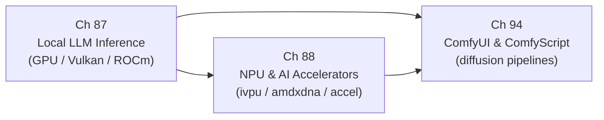

# Part XX — AI/ML Inference on Linux

The Linux graphics stack was originally conceived as a path from pixels in kernel memory to photons on a display panel. Parts I through XIX trace that path: **DRM/KMS** device enumeration, **GEM** buffer management, **Mesa** shader compilation, **Vulkan** WSI, compositor protocols, and browser rendering. Part XX extends the stack in a new direction — using the same GPU hardware, kernel driver interfaces, and **DMA-BUF** buffer-sharing primitives not to render frames but to run neural network inference. AI/ML workloads are now first-class consumers of GPU compute on Linux: the same **VRAM**, the same **PCIe** bus, the same **DRM** scheduling infrastructure that draws your desktop also runs transformer attention heads, diffusion model denoising steps, and low-power NPU inference for always-on voice and vision tasks. Understanding how inference runtimes sit atop the graphics stack — sharing buffer types, queue submissions, and memory allocators with the rendering path — is essential for any developer working at the intersection of graphics and AI on Linux.

## Chapters in This Part

**Chapter 87 — Local LLM Inference on Linux GPUs** covers the complete software path from a **GGUF** model file on disk to generated tokens on screen. It examines the **GGML** tensor engine (**`ggml_cgraph`**, **`ggml_tensor`**, **`ggml_backend_i`**), the **Vulkan** compute backend in **`ggml-vulkan.cpp`** (including **SPIR-V** shader dispatch, **`VK_KHR_cooperative_matrix`**, and **vk_matmul_pipeline_struct** variants), memory-mapped weight loading via **`mmap(2)`** and zero-copy transfer with **Resizable BAR**, and the **Ollama** HTTP inference server's GPU-detection and model-management layer. It also covers **ONNX Runtime** execution providers for **CUDA** and **OpenVINO**, the **ROCm**/**HIP**/**MIOpen** path for AMD hardware, **PagedAttention** KV cache management in **vLLM**, and roofline analysis explaining why token-generation at batch=1 is memory-bandwidth-bound. Readers learn how mainstream inference runtimes map transformer operations onto the same Vulkan and ROCm compute interfaces used by graphics workloads.

**Chapter 88 — NPU and AI Accelerator Integration on Linux** shifts focus from discrete GPU inference to purpose-built neural accelerators embedded in modern AI PC SoCs. It covers the Intel **NPU** (**`ivpu`** kernel driver, **`drivers/accel/ivpu/`**), AMD **XDNA2** (**`amdxdna`** driver, mainline since Linux 6.14), and Qualcomm **Hexagon** DSP/NPU, explaining how the **DRM accel** subsystem (**`drivers/accel/`**, introduced in Linux 6.2) provides a unified kernel interface for non-rendering accelerators. The chapter explains why NPUs complement GPUs architecturally — systolic-array **MMA** units, dedicated on-chip **SRAM**, and always-on low-power domains — and shows how **OpenVINO**, the **XRT/IRON** Ryzen AI SDK, and **PyTorch** dispatch workloads across heterogeneous **CPU + GPU + NPU** topologies. Readers working on AI PC integration or embedded inference will understand the kernel plumbing that sits beneath framework-level NPU dispatch.

**Chapter 94 — ComfyUI and ComfyScript: Node-Graph AI Image Generation** examines **ComfyUI** as a pipeline orchestrator for diffusion model inference, showing how a browser-authored **DAG** of nodes maps onto sequential **PyTorch** GPU kernel calls. It covers the **`PromptExecutor`** topological scheduler (**`execution.py`**), the **`model_management.py`** VRAM allocator with LRU eviction, the **k-diffusion** sampler and scheduler system (**euler**, **dpmpp_2m**, **karras**), **FLUX.1** and **DiT**-architecture support with rectified-flow sampling, and the **ComfyScript** typed Python frontend for programmatic workflow authoring. It closes with Linux-specific performance optimisations, Docker deployment, and the REST/WebSocket API used for automation. This chapter grounds abstract diffusion-model concepts in concrete Python code paths and GPU memory management decisions visible to a Linux systems developer.

## How the Chapters Interrelate

Chapter 87 is the recommended entry point. It establishes the foundational concepts shared across the entire part: the **`ggml_backend_i`** abstraction that decouples tensor operations from the underlying device, **Vulkan** compute dispatch via **SPIR-V** shaders and **vkQueueSubmit**, AMD **ROCm** HIP kernel launches, **ONNX Runtime** execution providers, and the memory-mapping strategy for weight tensors using **`mmap(2)`** and **DMA-BUF**. These primitives reappear in both subsequent chapters.

Chapter 88 builds directly on Chapter 87's GPU inference foundation by introducing the orthogonal case: dedicated silicon that is *not* a general-purpose GPU. Readers who understand how **llama.cpp** dispatches matrix multiplications through **`ggml_backend_i`** to a Vulkan device will immediately recognise the structural parallel when Chapter 88 shows how **OpenVINO** dispatches the same operations to the Intel **NPU** tile via the **`ivpu`** driver and the **DRM accel** character device. The shared thread is the execution-provider or backend plugin model: frameworks treat GPU, NPU, and CPU as interchangeable compute targets behind a common scheduling interface. The **HETERO:NPU,GPU,CPU** OpenVINO composite device and **vLLM**'s **ROCR_VISIBLE_DEVICES** isolation are expressions of the same design principle at different abstraction levels.

Chapter 94 is the application-layer capstone. Where Chapters 87 and 88 focus on runtime internals and kernel driver interfaces, Chapter 94 shows how a production inference application — **ComfyUI** — stitches together the **PyTorch** CUDA/ROCm/Vulkan backends, the **k-diffusion** library, **ControlNet** adapters, and **LoRA** weight patching into a user-facing pipeline. The chapter's **`model_management.py`** VRAM analysis directly applies Chapter 87's KV cache and roofline concepts to the different memory profile of diffusion models (large UNet activations, VAE decode, latent tensors). Its Linux-specific optimisations — **`torch.compile`**, **xformers** attention, **fp8** quantisation for **FLUX.1** — parallel the quantisation formats (**Q4_K_M**, **IQ4_XS**) and **Flash Attention** dispatch discussed in Chapter 87.

The unifying themes across the part are: (1) the backend/execution-provider plugin pattern that decouples ML frameworks from specific hardware; (2) **VRAM** pressure management and quantisation as the primary performance lever; (3) the **DRM** kernel infrastructure — **`drm_gem_object`**, **DMA-BUF**, **`drm_sched`** — appearing beneath every inference runtime whether it targets a discrete GPU, an integrated NPU, or a diffusion pipeline.

## Prerequisites and What Comes Next

Readers should be comfortable with the **DRM/KMS** device model (Part I), **GEM** buffer objects and **DMA-BUF** sharing (Chapters 3–4), **Vulkan** compute pipelines and **SPIR-V** (Part V, especially Chapter 24), and the **ROCm** programming model (Chapter 25). Familiarity with **ONNX Runtime** execution providers and basic transformer architecture (attention, feed-forward layers, KV cache) will reduce the learning curve for Chapter 87, though the chapter is self-contained. The AI inference layer introduced here feeds forward into any future coverage of AI-assisted compositor features, neural video upscaling pipelines, and on-device vision processing that consume the **Wayland** buffer types and **DMA-BUF** handles established in Parts VI and VII.

---
