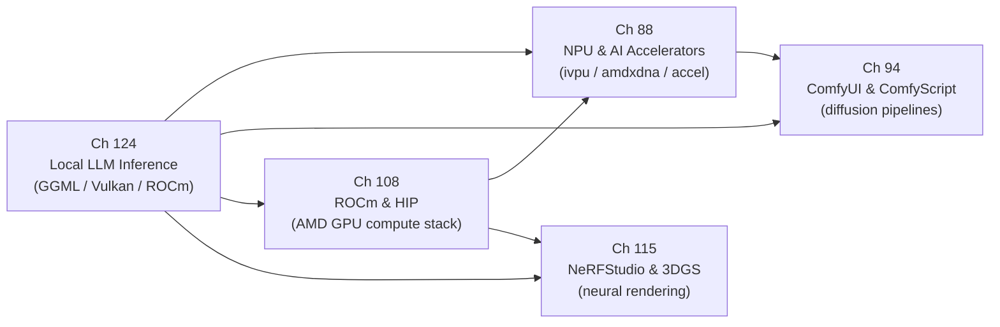

# Part XX — AI/ML Inference on Linux

The Linux graphics stack was originally conceived as a path from pixels in kernel memory to photons on a display panel. Parts I through XIX trace that path: **DRM/KMS** device enumeration, **GEM** buffer management, **Mesa** shader compilation, **Vulkan** WSI, compositor protocols, and browser rendering. Part XX extends the stack in a new direction — using the same GPU hardware, kernel driver interfaces, and **DMA-BUF** buffer-sharing primitives not to render frames but to run neural network inference. AI/ML workloads are now first-class consumers of GPU compute on Linux: the same **VRAM**, the same **PCIe** bus, the same **DRM** scheduling infrastructure that draws your desktop also runs transformer attention heads, diffusion model denoising steps, and low-power NPU inference for always-on voice and vision tasks. Understanding how inference runtimes sit atop the graphics stack — sharing buffer types, queue submissions, and memory allocators with the rendering path — is essential for any developer working at the intersection of graphics and AI on Linux.

## Chapters in This Part

**Chapter 88 — NPU and AI Accelerator Integration on Linux** shifts focus from discrete GPU inference to purpose-built neural accelerators embedded in modern AI PC SoCs. It covers the Intel **NPU** (**`ivpu`** kernel driver, **`drivers/accel/ivpu/`**), AMD **XDNA2** (**`amdxdna`** driver, mainline since Linux 6.14), and Qualcomm **Hexagon** DSP/NPU, explaining how the **DRM accel** subsystem (**`drivers/accel/`**, introduced in Linux 6.2) provides a unified kernel interface for non-rendering accelerators. The chapter explains why NPUs complement GPUs architecturally — systolic-array **MMA** units, dedicated on-chip **SRAM**, and always-on low-power domains — and shows how **OpenVINO**, the **XRT/IRON** Ryzen AI SDK, and **PyTorch** dispatch workloads across heterogeneous **CPU + GPU + NPU** topologies. Readers working on AI PC integration or embedded inference will understand the kernel plumbing that sits beneath framework-level NPU dispatch.

**Chapter 94 — ComfyUI and ComfyScript: Node-Graph AI Image Generation** examines **ComfyUI** as a pipeline orchestrator for diffusion model inference, showing how a browser-authored **DAG** of nodes maps onto sequential **PyTorch** GPU kernel calls. It covers the **`PromptExecutor`** topological scheduler (**`execution.py`**), the **`model_management.py`** VRAM allocator with LRU eviction, the **k-diffusion** sampler and scheduler system (**euler**, **dpmpp_2m**, **karras**), **FLUX.1** and **DiT**-architecture support with rectified-flow sampling, and the **ComfyScript** typed Python frontend for programmatic workflow authoring. It closes with Linux-specific performance optimisations, Docker deployment, and the REST/WebSocket API used for automation. This chapter grounds abstract diffusion-model concepts in concrete Python code paths and GPU memory management decisions visible to a Linux systems developer.

**Chapter 108 — ROCm and HIP: AMD's GPU Compute Stack** is a dedicated deep-dive into AMD's open-source GPU compute platform, covering ROCm from Linux 6.x kernel interfaces up through application-facing ML libraries. It explains the dual personality of **`amdgpu.ko`** — simultaneously the **amdgpu DRM** graphics driver and the **amdkfd** compute extension that exposes **`/dev/kfd`** for HSA queue management and process isolation via **PASID**. The chapter traces the full software stack from **`libhsakmt.so`** and the **HSA Runtime** (**`libhsa-runtime64.so`**) through the **ROCm Common Language Runtime** (**ROCclr/CLR**) to the **HIP** programming model (**`hipMalloc`**, **`hipLaunchKernelGGL`**, **hipify** CUDA portability tools). It covers ML libraries (**rocBLAS**, **hipBLASLt** with TunableOp, **MIOpen** auto-tuning, **RCCL**), the **LLVM/Clang AMDGPU** compiler backend and code-object format, **PyTorch on ROCm** including the CUDA-compatibility shim that allows unmodified CUDA inference code to run on AMD hardware, unified memory via **`hipMallocManaged`** and **HMM** on APUs such as **Strix Halo** (Ryzen AI Max+ 395) with their 128 GB shared pool, and ROCm profiling tools (**rocm-smi**, **rocprof**, **Omniperf**). Hardware coverage spans **CDNA3** (Instinct MI300X with 192 GB HBM3) through consumer **RDNA3/4** GPUs. This chapter is the definitive AMD compute reference for the book, tying together the driver internals introduced in Part II with the inference workloads in Chapters 88 and 124.

**Chapter 115 — NeRFStudio, Neural Radiance Fields, and 3D Gaussian Splatting** bridges the book's graphics and AI pillars by examining how learned scene representations are trained and rendered on Linux GPU hardware. It develops the mathematical foundations of volume rendering (ray marching, transmittance integrals, positional encoding) underlying **Neural Radiance Fields** (NeRF, Mildenhall et al. 2020) and contrasts them with the tile-based rasterization of **3D Gaussian Splatting** (3DGS, Kerbl et al. SIGGRAPH 2023). The chapter then traces the **NeRFStudio** framework architecture: the **`ns-train`** CLI and **tyro** config system, the **Trainer** training loop, the **Nerfacto** flagship model with proposal network and appearance embeddings, **Instant-NGP** with **tiny-cuda-nn** fully-fused hash-encoding MLPs and **CUTLASS** GEMM kernels, and **splatfacto** 3DGS training via the **gsplat** tile-based CUDA rasterizer (forward and backward passes, 2D Gaussians projected via the **EWA** splatting kernel). It covers the **COLMAP** SfM pipeline (**`ns-process-data`**) for camera pose estimation, the **Viser** interactive viewer using WebSocket streaming and **Three.js**, ROCm/HIP portability status for AMD GPUs, and Vulkan-based real-time splat renderers for deployment outside training clusters. The chapter connects neural rendering workloads to the same DRM/KMS and CUDA/ROCm kernel paths seen throughout the part.

**Chapter 124 — Local LLM Inference on Linux GPUs** covers the complete software path from a **GGUF** model file on disk to generated tokens on screen. It examines the **GGML** tensor engine (**`ggml_cgraph`**, **`ggml_tensor`**, **`ggml_backend_i`**), the **Vulkan** compute backend in **`ggml-vulkan.cpp`** (including **SPIR-V** shader dispatch via **glslc**, the **`vk_device_struct`** device abstraction, **`vk_matmul_pipeline_struct`** variants, and **`VK_KHR_cooperative_matrix`**), quantisation formats from **F16**/**BF16** through K-quant block types (**Q4_K_M**, **Q6_K**) and I-quant types (**IQ4_XS**), and memory-mapped weight loading via **`mmap(2)`** and zero-copy transfer with **Resizable BAR**. It also covers the **Ollama** HTTP inference server's GPU-detection and model-management layer, **ONNX Runtime** execution providers for **CUDA** and **OpenVINO** (including **CUDA Graph** capture, **TF32**, and **SkipLayerNorm** graph fusions), the **ROCm**/**HIP**/**MIOpen** path for AMD hardware, **PagedAttention** KV cache management and Automatic Prefix Caching in **vLLM**, and roofline arithmetic-intensity analysis that explains why token generation at batch=1 is memory-bandwidth-bound. Chapter 124 supersedes the brief treatment of LLM inference in the earlier Chapter 87 outline and serves as the canonical in-depth reference for this topic.

## How the Chapters Interrelate

**Chapter 124** is the recommended entry point. It establishes the foundational concepts shared across the entire part: the **`ggml_backend_i`** abstraction that decouples tensor operations from the underlying device, **Vulkan** compute dispatch via **SPIR-V** shaders and **`vkQueueSubmit`**, GGUF memory-mapped weight loading, and the VRAM pressure and quantisation tradeoffs that govern inference on every hardware target. These primitives reappear in all other chapters.

**Chapter 108** is the AMD-specific pillar. Readers who understood Chapter 124's treatment of the ROCm/HIP path for llama.cpp and vLLM will find Chapter 108 expanding that foundation into full depth: the **KFD** kernel interface beneath **`libhsakmt.so`**, the **HSA Runtime** agent enumeration and signal model, **rocBLAS**/**hipBLASLt** GEMM dispatch, **MIOpen** auto-tuning, and the **LLVM/Clang AMDGPU** backend that compiles HIP kernels to GCN/RDNA/CDNA ISA code objects. Chapter 108 also covers the AMD APU unified-memory path (**HMM**, **`hipMallocManaged`**) in detail, which is referenced but not fully explained in Chapter 124's discussion of Strix Halo. After reading both chapters, the reader has a complete picture of how an AMD MI300X or RX 7900 XTX runs transformer inference from user-space framework down to the **`amdgpu.ko`** kernel driver.

**Chapter 88** builds on the GPU inference foundation of Chapter 124 and the AMD kernel internals of Chapter 108 by introducing dedicated silicon that is not a general-purpose GPU. Readers who understand how **llama.cpp** dispatches matrix multiplications through **`ggml_backend_i`** to a Vulkan device, and how **ROCm** routes the same through the **KFD** character device, will immediately recognise the structural parallel when Chapter 88 shows how **OpenVINO** dispatches the same operations to the Intel **NPU** tile via the **`ivpu`** driver and the **DRM accel** character device. The shared thread is the execution-provider or backend plugin model: frameworks treat GPU, NPU, and CPU as interchangeable compute targets behind a common scheduling interface. The **HETERO:NPU,GPU,CPU** OpenVINO composite device and **vLLM**'s **ROCR_VISIBLE_DEVICES** isolation are expressions of the same design principle at different abstraction levels.

**Chapter 115** occupies a unique position: it is the only chapter in the part whose primary workload is not language modelling but scene reconstruction and novel-view synthesis. Its connection to Chapter 124 is the shared **GGML**/**PyTorch** backend infrastructure — the same ROCm/CUDA execution providers, the same VRAM pressure concerns, the same roofline constraints. Its connection to Chapter 108 is the AMD portability question: the **gsplat** tile rasterizer is CUDA-native, and Chapter 115 examines how far **hipify** and community ROCm ports extend coverage to AMD hardware. Chapter 115 also bridges back to the rendering chapters of Parts I–V: the **EWA splatting** projection and tile-based rasterization of 3DGS are conceptually adjacent to the DRM/KMS scanout pipeline and Vulkan rasterization pipeline, and the chapter explicitly covers Vulkan-based real-time renderers for trained splat scenes.

**Chapter 94** is the application-layer capstone. Where Chapters 124, 108, and 88 focus on runtime internals and kernel driver interfaces, Chapter 94 shows how a production inference application — **ComfyUI** — stitches together the **PyTorch** CUDA/ROCm/Vulkan backends, the **k-diffusion** library, **ControlNet** adapters, and **LoRA** weight patching into a user-facing pipeline. The chapter's **`model_management.py`** VRAM analysis directly applies Chapter 124's KV cache and roofline concepts to the different memory profile of diffusion models (large UNet activations, VAE decode, latent tensors). Its Linux-specific optimisations — **`torch.compile`**, **xformers** attention, **fp8** quantisation for **FLUX.1** — parallel the quantisation formats (**Q4_K_M**, **IQ4_XS**) and **Flash Attention** dispatch discussed in Chapter 124, and lean on the AMD ROCm backend comprehensively covered in Chapter 108.

The unifying themes across the part are: (1) the backend/execution-provider plugin pattern that decouples ML frameworks from specific hardware; (2) **VRAM** pressure management and quantisation as the primary performance lever; (3) the **DRM** kernel infrastructure — **`drm_gem_object`**, **DMA-BUF**, **`drm_sched`** — appearing beneath every inference runtime whether it targets a discrete GPU, an integrated NPU, or a diffusion pipeline; and (4) the convergence of rendering and neural representation, most visible in Chapter 115's Gaussian splatting rasterizer but present throughout in the shared Vulkan compute and ROCm infrastructure.

## Prerequisites and What Comes Next

Readers should be comfortable with the **DRM/KMS** device model (Part I), **GEM** buffer objects and **DMA-BUF** sharing (Chapters 3–4), **Vulkan** compute pipelines and **SPIR-V** (Part V, especially Chapter 24), and the **ROCm** programming model (Chapter 25 and Chapter 108). Familiarity with **ONNX Runtime** execution providers and basic transformer architecture (attention, feed-forward layers, KV cache) will reduce the learning curve for Chapter 124, though the chapter is self-contained. The AI inference layer introduced here feeds forward into any future coverage of AI-assisted compositor features, neural video upscaling pipelines, and on-device vision processing that consume the **Wayland** buffer types and **DMA-BUF** handles established in Parts VI and VII.

---
