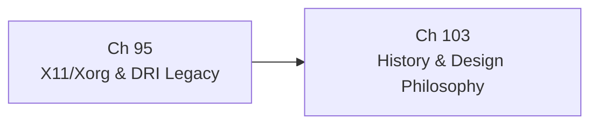

# Part XXI — Platform, Legacy, and History

The Linux graphics stack is not a single coherent design; it is four decades of accumulated engineering decisions, each shaped by the hardware, community norms, and economic constraints of its moment. Part XXI closes the book by examining two dimensions of that accumulation: the protocol and infrastructure that the modern stack replaced, and the narrative history that explains why every layer is the shape it is. Where earlier parts described *how* the kernel **DRM subsystem**, **Mesa**, **Wayland**, and the GPU compiler toolchain work today, this part explains *why* they came to exist and what had to be overcome to build them.

## Chapters in This Part

**Chapter 95 — X11/Xorg Architecture and the DRI Legacy Stack** covers the client-server model of the **X Window System** from its 1987 wire protocol through the **GLX** extension, **AIGLX**, and the three generations of the **Direct Rendering Infrastructure** (**DRI1**, **DRI2**, **DRI3**). Readers will understand how the **Composite** extension and **XRANDR** bolted GPU-accelerated compositing and multi-monitor support onto a protocol not designed for either, and why those bolt-ons produced the security and performance problems that motivated **Wayland**. The chapter concludes with **XWayland** — the X11 server that runs as a Wayland client — giving readers the practical knowledge needed to debug the compatibility layer on which millions of legacy applications still depend in 2026.

**Chapter 103 — History and Design Philosophy of the Linux Graphics Stack** is the book's narrative thread. It traces the arc from the first **X10** server in 1984 through the **DRI Project**, **KMS** and the display revolution, **Gallium3D**, the **Wayland** story, AMD's open-source pivot, and ARM GPU reverse engineering up to the **Vulkan**- and Rust-era stack of 2026. Readers gain a causal account of why **DRM** is separate from **V4L2**, why **Mesa** carries both **Gallium3D** and native **Vulkan** driver paths, and why the community's consistent preference for mechanism over policy produced the architecture described throughout the rest of the book.

## How the Chapters Interrelate

The two chapters form a natural sequence rather than a parallel survey.

Chapter 95 should be read first by anyone who arrived at this book with a Wayland-native background and has never worked directly with **Xorg**, **libX11**, **XCB**, or the **GLX** API. It establishes the concrete legacy: the Unix-domain socket at **`/tmp/.X11-unix/X0`**, the global **X atom** namespace, the **XDND** drag-and-drop protocol, **XGetWindowProperty** as the clipboard mechanism, and the three generations of **DRI** that progressively moved buffer allocation from server to client. Without that foundation, the claim in Chapter 103 that "every Wayland protocol that seems over-engineered is a considered response to a concrete X11 problem" cannot be evaluated — it can only be accepted on faith.

Chapter 103 is the interpretive frame: it explains the Nouveau reverse-engineering project that Chapter 95's DRI evolution implicitly required, AMD's open-source pivot that unlocked the **AMDGPU** driver described in Part XVII, and the community debates around **KMS** that made the clean kernel/userspace split described in Part I possible. Reading Chapter 103 after Chapter 95 means the historical narrative arrives with concrete technical examples already in the reader's working memory, so the "why" lands with full force.

The shared conceptual threads across both chapters are: the **DRM/KMS** subsystem as the universal hardware abstraction layer that X11 legacy bridges and modern Wayland compositors all depend on; the **dma-buf** zero-copy buffer-sharing mechanism whose evolution Chapter 103 narrates and Chapter 95 demonstrates in practice; and the community norm of mechanism-over-policy that Chapter 103 traces to Scheifler and Gettys's X design principles and that explains why **XWayland** is a separate program rather than a compile-time configuration of a monolithic server.

## Prerequisites and What Comes Next

Readers should be familiar with the **DRM/KMS** kernel subsystem (Part I), the **Mesa** userspace architecture (Part IV), and the **Wayland** compositor model (Part VI) before reading this part; Chapters 95 and 99 reference those layers extensively and do not re-explain their internals. Chapter 103 additionally references **Gallium3D**, **LLVM**, and **NIR** from Parts IV and V, and **NVK**/**AMDGPU** from Parts XVI and XVII. This part has no successors in the book — it is the capstone — but engineers moving from here to upstream contribution will find the kernel mailing-list culture and Mesa review process described in Part IX directly applicable to extending the systems this part explains.

---
