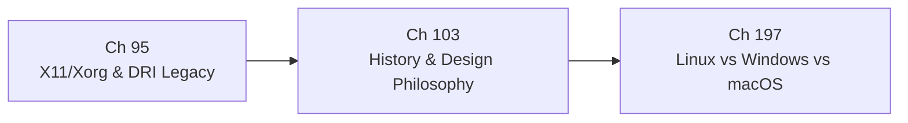

# Part XXI — Platform, Legacy, and History

The Linux graphics stack is not a single coherent design; it is four decades of accumulated engineering decisions, each shaped by the hardware, community norms, and economic constraints of its moment. Part XXI closes the book by examining two dimensions of that accumulation: the protocol and infrastructure that the modern stack replaced, and the narrative history that explains why every layer is the shape it is. Where earlier parts described *how* the kernel **DRM subsystem**, **Mesa**, **Wayland**, and the GPU compiler toolchain work today, this part explains *why* they came to exist and what had to be overcome to build them.

## Chapters in This Part

**Chapter 95 — X11/Xorg Architecture and the DRI Legacy Stack** covers the client-server model of the **X Window System** from its 1987 wire protocol through the **GLX** extension, **AIGLX**, and the three generations of the **Direct Rendering Infrastructure** (**DRI1**, **DRI2**, **DRI3**). Readers will understand how the **Composite** extension and **XRANDR** bolted GPU-accelerated compositing and multi-monitor support onto a protocol not designed for either, and why those bolt-ons produced the security and performance problems that motivated **Wayland**. The chapter concludes with **XWayland** — the X11 server that runs as a Wayland client — giving readers the practical knowledge needed to debug the compatibility layer on which millions of legacy applications still depend in 2026.

**Chapter 103 — History and Design Philosophy of the Linux Graphics Stack** is the book's narrative thread. It traces the arc from the first **X10** server in 1984 through the **DRI Project**, **KMS** and the display revolution, **Gallium3D**, the **Wayland** story, AMD's open-source pivot, and ARM GPU reverse engineering up to the **Vulkan**- and Rust-era stack of 2026. Readers gain a causal account of why **DRM** is separate from **V4L2**, why **Mesa** carries both **Gallium3D** and native **Vulkan** driver paths, and why the community's consistent preference for mechanism over policy produced the architecture described throughout the rest of the book.

**Chapter 197 — The Linux Graphics Stack in Context: Comparison with Windows and macOS** places the full stack in direct competitive comparison with the two dominant proprietary graphics platforms. It identifies where Linux leads (Mesa NIR as open universal shader IR, DMA-BUF cross-process zero-copy, explicit sync as a Wayland protocol primitive, Rust GPU drivers, community reverse-engineering quality, DXVK/VKD3D-Proton translation performance), where Windows and macOS each lead, and — critically — what the Linux community is actively doing to close each gap. Velocity comparisons, feature-parity matrices, and a strategic outlook on the SPIR-V/WGSL convergence conclude the chapter.

## How the Chapters Interrelate

The three chapters form a natural sequence rather than a parallel survey.

Chapter 95 should be read first by anyone who arrived at this book with a Wayland-native background and has never worked directly with **Xorg**, **libX11**, **XCB**, or the **GLX** API. It establishes the concrete legacy: the Unix-domain socket at **`/tmp/.X11-unix/X0`**, the global **X atom** namespace, the **XDND** drag-and-drop protocol, **XGetWindowProperty** as the clipboard mechanism, and the three generations of **DRI** that progressively moved buffer allocation from server to client. Without that foundation, the claim in Chapter 103 that "every Wayland protocol that seems over-engineered is a considered response to a concrete X11 problem" cannot be evaluated — it can only be accepted on faith.

Chapter 103 is the interpretive frame: it explains the Nouveau reverse-engineering project that Chapter 95's DRI evolution implicitly required, AMD's open-source pivot that unlocked the **AMDGPU** driver described in Part XVII, and the community debates around **KMS** that made the clean kernel/userspace split described in Part I possible. Reading Chapter 103 after Chapter 95 means the historical narrative arrives with concrete technical examples already in the reader's working memory, so the "why" lands with full force.

Chapter 197 is the competitive synthesis: it takes the systems described throughout the book and positions them against Windows WDDM/DirectX and macOS Metal — identifying specific gaps (WDDM TDR isolation, DirectStorage, DirectX Agility SDK velocity, macOS HDR timeline) alongside specific Linux responses (drm_gpuvm, io_uring + P2P DMA, Steam Runtime, KWin 6 + wp-color-management-v1). Readers who work across platforms will find this the single most practically useful chapter for understanding where Linux graphics is today and why.

The shared conceptual threads across all three chapters are: the **DRM/KMS** subsystem as the universal hardware abstraction layer that X11 legacy bridges and modern Wayland compositors all depend on; the **dma-buf** zero-copy buffer-sharing mechanism whose evolution Chapter 103 narrates and Chapter 197 positions against peer platform designs; and the community norm of mechanism-over-policy that Chapter 103 traces to Scheifler and Gettys's X design principles and Chapter 197 demonstrates produces competitive GPU driver quality through open selection pressure.

## Prerequisites and What Comes Next

Readers should be familiar with the **DRM/KMS** kernel subsystem (Part I), the **Mesa** userspace architecture (Part IV), and the **Wayland** compositor model (Part VI) before reading this part; Chapters 95 and 99 reference those layers extensively and do not re-explain their internals. Chapter 103 additionally references **Gallium3D**, **LLVM**, and **NIR** from Parts IV and V, and **NVK**/**AMDGPU** from Parts XVI and XVII. This part has no successors in the book — it is the capstone — but engineers moving from here to upstream contribution will find the kernel mailing-list culture and Mesa review process described in Part IX directly applicable to extending the systems this part explains.

---

## Part Roadmap Summary

*Synthesised from the Roadmap sections of this part's chapters.*

### Near-term (6–12 months)

- **XWayland explicit-sync hardening**: The `linux-drm-syncobj-v1` protocol, shipped experimentally in XWayland 24.1 and Mesa 24.1, is being stabilised across GNOME Mutter, KDE KWin, and the NVIDIA driver stack; remaining edge cases with PRIME multi-GPU and GLX compositing paths are being closed in Mesa's `src/glx/`.
- **XWayland fractional-scaling and shell-v1 adoption**: `wp_fractional_scale_v1` integration is reducing HiDPI blurriness at non-integer scales, and the race-free `xwayland-shell-v1` protocol is completing compositor-side adoption (labwc, Hyprland following GNOME and KDE).
- **Wayland HDR and colour-management stabilisation**: The `color-management-v1` protocol and KMS per-plane tone-mapping extensions are solidifying, with GNOME and KDE Plasma targeting end-to-end HDR on AMD and Intel hardware; this work directly affects X11 applications running via XWayland, which inherit the compositor's colour pipeline.
- **Nova Rust driver reaching feature parity**: Nova's Rust-language NVIDIA kernel driver is expected to reach Turing/Ampere feature parity with Nouveau, including GSP-RM firmware power management — a milestone that validates the Rust-in-kernel-DRM approach whose history Chapter 103 traces.
- **DRM accel subsystem growth**: Additional NPU vendors (MediaTek APU, Qualcomm Hexagon, Intel NPU) are upstreaming drivers into the DRM accel subsystem, accelerating the hardware-diversity arc described in Chapter 103's account of the DRI Project's origins.

### Medium-term (1–3 years)

- **Xorg maintenance-only and legacy GLX removal**: The X.Org Foundation is expected to place Xorg in maintenance-only mode; Mesa's indirect GLX path (`LIBGL_ALWAYS_INDIRECT`, server-side GLX request handling) is slated for removal, leaving the modesetting DDX and XWayland as the sole actively-developed X11 surfaces.
- **XDG portal gap closure**: The `org.freedesktop.portal.GlobalShortcuts` and `org.freedesktop.portal.InputCapture` portals are being finalised to replace the last X11-only workflows (global hotkeys, gaming input capture) that currently require XWayland keyboard-grab workarounds.
- **Rust abstractions land in mainline DRM**: GEM, scheduler, and syncobj Rust bindings are expected to reach mainline, enabling new GPU drivers to be written entirely in Rust — fulfilling the modernisation trajectory Chapter 103 traces from the C-only DRI Project through Nova.
- **Explicit sync becomes mandatory**: `linux-drm-syncobj-v1` is expected to become required for all compositors, completing the decade-long migration from implicit to explicit GPU synchronisation and closing the last major correctness gap between open and proprietary NVIDIA stacks — a thread that runs through both the DRI legacy (Chapter 95) and the driver-history narrative (Chapter 103).
- **NVIDIA open-module documentation for Hopper/Blackwell**: NVIDIA's open-kernel-module cadence is likely to yield register-level documentation for current-generation hardware, potentially enabling NVK to cover compute and ML workloads through an open Mesa stack.

### Long-term

- **X11 protocol freeze and GLX deprecation**: As XWayland matures and major toolkits (GTK4, Qt 6) complete EGL-only paths, the X11 protocol is expected to be frozen rather than extended — HDR, VRR, and colour management will be Wayland-only — and Mesa's `src/glx/` implementation deprecated, closing the architectural story Chapter 95 opens.
- **Unified heterogeneous kernel programming model**: Convergence of the DRM graphics and accel subsystems may produce a single memory manager, scheduler, and dma-buf infrastructure covering render, display, video, and AI inference — fulfilling the zero-copy, mechanism-over-policy principles that Chapter 103 traces back to Scheifler and Gettys's X design philosophy.
- **Open-hardware GPU trajectory**: AMD's GPUOpen model, RISC-V GPU ISA initiatives, and emerging community-maintained GPU IP may eventually produce a major GPU line designed from the start for open drivers — rather than the decades of reverse engineering and openness retrofitting that both chapters document.

---

*Copyright © 2026 jreuben11. Licensed under [CC BY 4.0](https://creativecommons.org/licenses/by/4.0/).*
