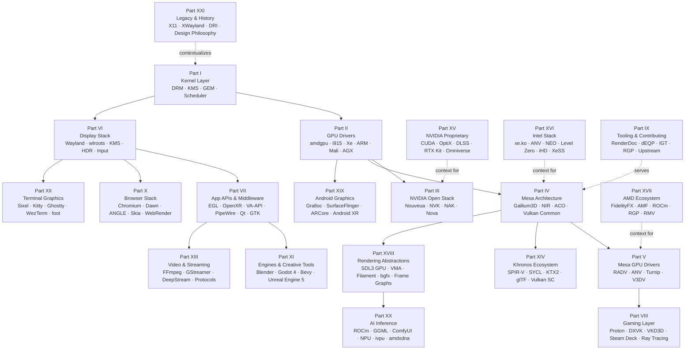

# Introduction

## About This Book

This book is a complete technical reference for the Linux graphics stack — the layered system of kernel subsystems, GPU drivers, userspace libraries, compositor protocols, and application-facing APIs that converts GPU computation into visible output on every Linux-based device, from a desktop workstation running a Wayland compositor to an Android phone running ARCore to a Raspberry Pi booting a minimal terminal session. The central thesis is that this stack is coherent: despite being assembled by dozens of organisations over four decades, its pieces interlock through a small set of shared primitives — **DMA-BUF** file descriptors, **dma_fence** synchronisation, **SPIR-V** shader IR, **DRM format modifiers**, and the **Wayland** display protocol — that appear at every layer boundary. Understanding those shared primitives is understanding the stack.

Expert-level treatment is necessary because the publicly available documentation is fragmented. Kernel subsystem documentation covers DRM and KMS in isolation. Mesa documentation covers the OpenGL and Vulkan driver interfaces but rarely traces a call through the full kernel-to-photon path. Browser architecture documents describe Chromium's GPU process without anchoring it to the DRM nodes it ultimately calls. The result is that engineers who work on one layer — a kernel driver developer, a Vulkan API user, a browser GPU team member, a terminal emulator author — often have only a surface understanding of the layers adjacent to their own. This book treats all twenty-one parts as a single system and draws the connections explicitly.

The book serves four distinct audiences who share a common need: understanding not just the API surface their layer presents but the mechanisms beneath it. A terminal emulator author who understands why the Kitty Graphics Protocol requires server-side image persistence has already understood something about GPU texture lifetime management. A Vulkan application developer who understands why `VK_KHR_wayland_surface` works the way it does has already understood something about `zwp_linux_dmabuf_v1` modifier negotiation. The chapters are written with those connections in mind, and every chapter's **Integrations** section makes them explicit.

## The Four Audiences

### Systems and Driver Developers

This audience arrives with a working knowledge of Linux kernel conventions — kernel modules, slab allocator, reference counting, platform and PCI bus models — and wants to understand how GPU hardware is managed from the kernel side. **Parts I and II** are the core: Part I covers the **DRM** subsystem in full, including the **KMS** display pipeline, **GEM** buffer object lifecycle, **DMA-BUF** cross-process sharing, the **drm_gpu_scheduler** fairness model, and GPU power management. Part II surveys the full range of kernel GPU driver families — **amdgpu** with its IP block decomposition and PM4 ring buffers, **i915** and **xe** with GuC-mediated command submission, **Panfrost** and **Lima** for Mali silicon, **Asahi** for Apple Silicon AGX in Rust, **V3D** for Raspberry Pi VideoCore VI/VII, and **etnaviv** for embedded Vivante GC IP. **Part III** provides the NVIDIA-specific depth: the reverse-engineering history, the **nvkm** object model, the GSP-RM firmware turning point, the Nova Rust kernel driver, and the NVK Vulkan driver written from scratch. **Part IX** covers the operational side: debugging, conformance testing, upstream contribution workflows across kernel, Mesa, and Wayland protocol projects, and the growing role of Rust in all three domains. **Parts XVI and XVII** provide vendor-complete deep dives on the Intel open stack (xe.ko through ANV, NEO/Level Zero, and XeSS) and the AMD developer ecosystem (FidelityFX SDK, AMF, RGP, RMV). Driver developers will also find **Part XIX** relevant as the Android mirror of many kernel-side patterns — **Gralloc**, **HWComposer**, and **SurfaceFlinger** solve structurally identical problems to GBM, KMS, and wlroots, but under Android's HAL constraints.

### Graphics Application Developers

This audience writes software that calls **Vulkan**, **EGL**, **OpenCL**, or **OpenXR** and wants to understand what happens beneath those calls on Linux. **Part VI** is the display-side foundation: how Wayland compositor protocols work, how **GBM** allocation and **linux-dmabuf** modifier negotiation proceed, how atomic KMS commits deliver frames to the display, and how the evolving protocol ecosystem (explicit sync, HDR, colour management) extends the baseline. **Part VII** covers the full application API landscape: Vulkan and EGL mechanics on Linux, GPU compute via OpenCL and ROCm, hardware video decode and encode via VA-API and V4L2, VR/AR via OpenXR and Monado, the PipeWire session layer, Qt6 and GTK4 rendering pipelines, font and text rendering from FreeType through HarfBuzz and Pango, and the Vulkan Video extensions. **Part VIII** covers the gaming context — Wine, DXVK, VKD3D-Proton, Proton packaging, FSR and DLSS upscaling via Vulkan layers, MangoHud GPU metrics, and hardware ray tracing across RADV, ANV, and NVK. **Part XIV** covers the Khronos extended ecosystem: SPIR-V module structure, SYCL portable heterogeneous compute, KTX2 texture compression, glTF 2.0 asset pipelines, and Vulkan SC for safety-critical deployments. **Part XVIII** covers rendering abstraction libraries — SDL3 GPU, VMA, Filament, and bgfx — as well as the frame graph pattern that underlies production renderers across the stack.

### Browser and Web Platform Engineers

This audience works on Chromium, Firefox, or related web platform infrastructure and wants to understand how the browser's GPU abstraction layers map onto the Linux graphics stack below them. **Part X** is the primary reference: Chromium's multi-process GPU architecture with Mojo IPC and the Ozone Wayland backend, ANGLE's OpenGL ES to Vulkan translation layer, Dawn's WebGPU implementation with the Tint WGSL compiler and DawnWire serialisation protocol, the CC/Viz compositing architecture with OOP-D and SharedImage cross-process texture sharing, Skia's Ganesh and Graphite backends with the SkSL shading language, Firefox's WebRender display-list architecture with wgpu-core and the naga shader compiler, and WebAssembly as a deployment target for wgpu-based Rust GPU code. **Part IV** provides the essential prerequisite: the Mesa loader and GLVND dispatch layer, Gallium3D, NIR, ACO, and the Mesa Vulkan common infrastructure that ANGLE's Vulkan backend and Dawn's Mesa backend ultimately target. Browser engineers will also find **Part VI** directly applicable — the `zwp_linux_dmabuf_v1`, `wp_presentation`, and `wp_linux_drm_syncobj_v1` protocols that Chromium's Ozone/Wayland backend and Firefox's native-layer Wayland path both implement are covered in depth there.

### Terminal and TUI Developers

This audience builds terminal emulators, TUI frameworks, or applications that need to render pixel graphics inside a terminal. **Part XII** is dedicated to this domain: the wire-level encoding of the **Sixel** protocol (DCS-framed, inherited from the DEC VT340), the **Kitty Graphics Protocol** with its stateful image IDs, server-side persistence, Unicode placeholder mechanism, and animation support, and the stateless iTerm2 OSC 1337 inline image format. The part then traces how modern terminal emulators — kitty, Alacritty, WezTerm, Ghostty, foot, and VTE — translate decoded image data and character-cell grids into GPU draw calls using HarfBuzz/FreeType glyph atlases, OpenGL or wgpu/Vulkan render pipelines, and how the resulting framebuffer traverses GBM allocation, DRM format modifier negotiation via `zwp_linux_dmabuf_feedback_v1`, and Wayland compositor presentation to reach the display. Terminal developers need the foundational knowledge from Parts I and VI — DRM render nodes, DMA-BUF sharing, wl_surface mechanics — which Part XII references throughout.

## A Map of the Stack

The twenty-one parts of this book form a directed graph that follows GPU resources from hardware enumeration through kernel management, Mesa compilation, Wayland compositing, and application-domain specialisation. The lower layers (Parts I–VI) provide the substrate on which every higher-level stack element depends. The domain stacks (Parts VII–XIV, XIX–XX) represent specialised application of that substrate. The vendor stacks (Parts XV–XVII) go deep on specific GPU families. The operational and historical parts (Parts IX, XXI) frame the whole.



## The Twenty-One Parts at a Glance

**Part I — The Kernel Layer** is the mandatory foundation for every other part. It establishes the **Direct Rendering Manager** (**DRM**) subsystem: how GPU kernel modules register via `struct drm_driver`, how `/dev/dri/cardN` primary nodes and `/dev/dri/renderDN` render nodes provide split privilege levels, how **GEM** buffer objects are allocated and reference-counted, how **DMA-BUF** file descriptors cross process boundaries without copies, how **KMS** atomic commits deliver frames from framebuffer to photon via the CRTC/plane/connector/encoder pipeline, and how the **drm_gpu_scheduler** arbitrates fair GPU time across competing processes using a CFS-inspired virtual-runtime algorithm. Part I also covers advanced display features — VRR, HDR, explicit sync via drm_syncobj — and GPU power management through the Linux runtime PM framework.

**Part II — GPU Drivers** shows how the DRM contracts defined in Part I are implemented for real silicon. The architectural patterns — IP block decomposition, ring-buffer command submission, firmware authentication via PSP or GuC, per-process GPU VA spaces, DEVFREQ thermal scaling, ARM SMMU integration — recur across every driver family despite wildly different hardware. This part covers x86 discrete GPUs (amdgpu, i915, Xe), ARM and embedded drivers (Lima, Panfrost, Panthor, freedreno/MSM), the reverse-engineered Apple Silicon AGX driver written in Rust, the Raspberry Pi V3D/VideoCore driver, the Vivante etnaviv driver for NXP i.MX SoCs, automotive Linux graphics, and multi-GPU PRIME offload. Each driver is examined both as a concrete implementation and as an instance of the common patterns.

**Part III — The Open NVIDIA Stack** is a case study in what happens when hardware documentation is withheld and then partially released. Seventeen years of systematic reverse engineering via mmiotrace and Envytools produced the Nouveau kernel driver, which could never fully reclock GPUs without signed PMU firmware. NVIDIA's 2022 GSP-RM open-source release partially lifted that constraint; the Nova clean-sheet Rust kernel driver built on that foundation represents the forward architecture. NVK, written by Faith Ekstrand at Collabora, is the Mesa Vulkan driver that became possible once the information gap narrowed — it is also the cleanest example in the Mesa tree of how to use the Vulkan common infrastructure from scratch.

**Part IV — Mesa Architecture** covers the shared infrastructure that all Mesa drivers inherit: the EGL platform layer and DRI/GLVND loader dispatch, the **Gallium3D** pipe interface that separates API frontends from GPU backends, **NIR** (New Intermediate Representation) as the universal SSA-form shader IR that connects every language frontend to every ISA backend, the **ACO** AMD shader compiler with its VGPR/SGPR register pressure model and GCN/RDNA instruction selection, and the Mesa Vulkan common layer that provides `vk_object_base`, pipeline cache, and descriptor set infrastructure shared by RADV, ANV, NVK, Turnip, and V3DV. Part IV is the conceptual centre of the book: every subsequent chapter that mentions a shader, a descriptor set, or a Vulkan pipeline object is building on the foundations laid here.

**Part V — Mesa GPU Drivers** makes the Part IV abstractions concrete. RADV (AMD Vulkan) is dissected through PM4 command encoding, SRD-based descriptors, NGG geometry, DCC/HTILE compression, and hardware ray tracing on RDNA2+. ANV (Intel Vulkan) is dissected through genxml packet emission, the EU ISA shader backend, and the bindless surface-state heap. Turnip (Qualcomm Adreno) is examined through its TBDR sysmem/GMEM rendering path and CCU flush ordering. The OpenGL layer — radeonsi, iris, Zink — completes the picture, showing how the same NIR and ISA backends serve both Vulkan and OpenGL clients.

**Part VI — The Display Stack** covers everything between a rendered DMA-BUF and the photons leaving the display panel. The Wayland wire protocol, Unix domain socket IPC, `SCM_RIGHTS` DMA-BUF file descriptor passing, `zwp_linux_dmabuf_v1` format and modifier negotiation, `drmModeAtomicCommit` with IN_FENCE_FD and OUT_FENCE_FD, damage tracking and hardware-plane promotion, the wlroots scene graph, production compositors (Mutter, KWin, Sway, gamescope), XWayland in rootless mode, the libinput input stack, ICC profiling and colord, HDR output via KMS `HDR_OUTPUT_METADATA`, and the evolving staging protocol landscape (explicit sync, colour management, FIFO backpressure, fractional scaling) are all covered. Part VI is the hinge between the substrate (Parts I–V) and every application domain above it.

**Part VII — Application APIs and Middleware** is where application-facing standards meet the kernel and compositor substrate. It covers the complete Vulkan and EGL application model on Linux, GPU compute via OpenCL, ROCm, and Vulkan compute pipelines, hardware video decode and encode via VA-API and the V4L2 stateless codec API, VR/AR via OpenXR and the Monado runtime, the PipeWire unified audio/video session layer with its DMA-BUF zero-copy camera and screen-capture paths, Qt6 and GTK4 GPU rendering pipelines with explicit sync, the full font and text rendering pipeline from FreeType hinting through HarfBuzz OpenType shaping to glyph atlas management, the ROCm/HIP ML compute stack, Vulkan Video extensions, and libcamera with its per-platform PipelineHandler model.

**Part VIII — The Gaming Layer** documents the Windows-compatibility machinery that makes the Linux game catalogue viable. DXVK translates D3D9/10/11 to Vulkan; VKD3D-Proton translates D3D12 to Vulkan; Proton packages both inside a pressure-vessel Steam Runtime container. The synchronisation story — from the Wine wineserver model through esync and fsync to the kernel ntsync driver — is traced in full. Upscaling and overlay tools (FSR 1/2/3, DLSS, NIS, MangoHud, vkBasalt) operate through the Vulkan layer mechanism above the translation stack. Hardware ray tracing on RDNA2 and RTX hardware via VK_KHR_ray_tracing_pipeline closes the technical content; the Steam Deck chapter synthesises all layers into a single shipping product, from the Van Gogh APU unified memory architecture through gamescope's micro-compositor to KMS atomic commit on the OLED display.

**Part IX — Tooling and Contributing** serves the operational needs of everyone who works on the stack professionally. The debugging chapter maps four bug categories — API misuse, compiler bugs, synchronisation errors, performance — to the tools that address each. The conformance chapter covers dEQP/VK-GL-CTS, IGT GPU Tools, piglit, spirv-fuzz, and Mesa's GitLab CI pipeline. The contribution chapter explains the divergent review cultures across kernel DRM (email/b4), Mesa (GitLab/marge-bot), and Wayland protocols (the unstable/staging/stable lifecycle). Deployment chapters cover GPU containers (DRM render node bind-mount, CDI, MIG, Kubernetes DRA), remote display and game streaming, GPU virtualisation (VFIO, SR-IOV, virtio-gpu, Venus, MIG), GPU security (IOMMU isolation, HDCP, confidential computing), and GPU performance analysis methodology using the top-down roofline model.

**Part X — The Browser Rendering Stack** examines how web browsers isolate GPU access behind process boundaries and translate web platform APIs across them. Chromium's multi-process architecture with Mojo IPC, the GPU command buffer ring protocol, the Ozone Wayland backend, and the seccomp-BPF sandbox establish the structural foundation. ANGLE translates OpenGL ES to Vulkan with careful preservation of implicit ordering semantics. Dawn implements WebGPU with DawnWire IPC serialisation, the Tint WGSL compiler, and VMA memory management. The CC/Viz compositor separates layer tree management from frame aggregation and Wayland presentation. Skia's Ganesh and Graphite backends handle tile rasterisation and 2D rendering. Firefox's WebRender collapses paint and composite into batched GPU draw calls using wgpu-core. Part X also covers WebAssembly as a deployment path for Rust/C++ GPU code via wgpu and Emscripten.

**Part XI — Engines and Creative Tools** examines production creative applications through the lens of their GPU abstraction strategies. Bevy with wgpu shows what a Rust-native, ECS-driven, WebGPU-compatible engine looks like at the Mesa interface boundary. Godot 4's RenderingDevice layer shows direct Vulkan usage without an intermediate HAL. Blender is unique in simultaneously driving a deferred PBR rasteriser (EEVEE Next via VKBackend and VKRenderGraph) and a heterogeneous compute path tracer (Cycles via HIP, CUDA, oneAPI, and experimental Vulkan compute). Unreal Engine 5 shows the closed-source high end: HLSL shaders compiled via DXC to SPIR-V, Nanite virtualised geometry on Mesa via VK_EXT_mesh_shader, and Lumen global illumination on RDNA2 ray tracing hardware.

**Part XII — Terminal Graphics** addresses the unique challenge of terminal emulators: they are simultaneously character-cell text-processing engines and GPU-accelerated Wayland clients. Part XII traces the complete path from pixel data encoded in VT escape sequences (Sixel, Kitty Graphics Protocol, iTerm2 OSC 1337) through HarfBuzz/FreeType glyph atlas management and OpenGL/wgpu rendering pipelines to GBM allocation, DRM format modifier negotiation, and Wayland compositor presentation. The architectural diversity of the terminal emulator ecosystem — kitty's OpenGL renderer, Ghostty's SIMD VT parser and libghostty embeddable core, foot's CPU-only wl_shm path, WezTerm's wgpu/WGSL cross-backend design — provides a rich set of case studies in how the same underlying stack can be reached through very different engineering choices.

**Part XIII — Video Streaming on Linux** covers the layer above hardware-accelerated codec paths. FFmpeg's libav* library suite is treated as both a programming API and a practical CLI reference for hardware-accelerated transcoding pipelines. GStreamer's element/pad/caps pipeline model, zero-copy DMA-BUF buffer paths, and the `va` plugin for VA-API integration represent the composable alternative to FFmpeg's library approach. NVIDIA DeepStream specialises the GStreamer foundation for multi-stream AI video analytics with NvBufSurface GPU buffers and TensorRT inference. The codec algorithms chapter provides the mathematical grounding — DCT, motion estimation, DPB management, H.264/H.265/AV1/VVC entropy coding — that makes hardware accelerator behaviour legible. Streaming protocol coverage includes HLS, MPEG-DASH, WebRTC with GStreamer webrtcbin, SRT, and the emerging QUIC-based delivery layer.

**Part XIV — The Khronos Extended Ecosystem** covers the standards infrastructure that ties the stack together across vendor and platform boundaries. The SPIR-V module structure, compilation pipeline from every front-end language, and SPIRV-Tools suite form the keystone. SYCL 2020 with DPC++ and AdaptiveCpp provides portable heterogeneous compute across Intel, AMD, and NVIDIA hardware. KTX2 with Basis Universal supercompression and libktx provides the portable texture asset pipeline. glTF 2.0 provides the runtime-efficient 3D asset interchange format. Vulkan SC, OpenVX, and ANARI cover safety-critical, embedded vision, and scientific rendering specialisations.

**Part XV — NVIDIA Proprietary Graphics Stack** covers the closed-source tier that coexists with and depends upon the open foundation. CUDA Runtime/Driver API, streams, events, NVRTC, and CUDA Graphs establish the compute foundation. OptiX 9 with its BVH construction, Shader Binding Table, Shader Execution Reordering, and Cooperative Vectors neural inference in shader programs represents the application-level ray tracing SDK. DLSS 4 super-resolution, multi-frame generation, Ray Reconstruction denoising, and Reflex low-latency pipelining via the NGX SDK represent the AI-rendering stack. The Omniverse/OpenUSD chapter covers the Hydra rendering delegate architecture, Slang with automatic differentiation, and the Kit SDK. The RTX Kit chapter surveys RTXDI, RTXGI, NRD, RTXNS, and RTXNTC as the MIT-licensed rendering SDK layer beneath NGX.

**Part XVI — The Intel Open Graphics Stack** provides the vendor-complete reference for Intel's end-to-end open stack. The xe.ko kernel driver, written from scratch to replace i915 for discrete Arc and Battlemage GPUs, introduces VM_BIND persistent memory mappings and GuC CTB ring-less command submission. Above it, ANV provides the Vulkan driver, NEO/Level Zero provides the GPGPU compute runtime, iHD provides the VA-API media driver with HuC firmware assistance, and XeSS provides the XMX-accelerated upscaling and frame-generation SDK. Intel's stack is unique in this book in that every layer — kernel, Vulkan, compute, media, upscaling — is fully open source.

**Part XVII — The AMD Developer Ecosystem** covers the application-side view of AMD's GPUOpen programme. The FidelityFX SDK with its `FfxInterface` abstraction, FSR 4 neural upscaling on RDNA 4 via the Upgradable API, and the FFX-SC offline shader compiler form one pillar. The Advanced Media Framework (AMF) with its evolution toward open VA-API delegation forms the second. Radeon GPU Profiler, Radeon Memory Visualizer, and RenderDoc integration form the profiling pillar, including how `VK_AMD_shader_info`, SPM streaming performance counters, and Vulkan loader layer hooks feed their data streams.

**Part XVIII — Rendering Abstraction Libraries** covers the userspace libraries that factor out the structural problems every Vulkan application must solve. SDL3 GPU provides a Metal-inspired, cross-backend GPU surface that eliminates Vulkan bootstrapping ceremony. VMA provides suballocation with TLSF-inspired algorithms, `VMA_MEMORY_USAGE_AUTO` type selection, and VmaVirtualBlock for offset-based management. Filament provides a complete PBR rendering library with a Cook-Torrance BRDF, FrameGraph pass culling and memory aliasing, and multi-backend material compilation via FILAMAT. bgfx provides a cross-platform rendering HAL across eight backends with typed opaque handles and view-sorted draw call submission. The frame graph pattern — pass culling, resource aliasing, automatic barrier insertion — is treated as a unifying architectural theme across Filament, Unreal's RDG, Bevy's RenderGraph, and Firefox WebRender.

**Part XIX — Android Graphics** examines the Android-specific middleware built on the same Linux DRM/DMA-BUF kernel primitives used by the Wayland desktop. Gralloc and AHardwareBuffer provide the shared buffer substrate; BufferQueue and SurfaceFlinger compose surfaces into frames; HWComposer drives DRM atomic commits. Vulkan on Android with hardware vendor ICDs, ANGLE as the system OpenGL ES implementation on Pixel devices, AHardwareBuffer Vulkan interop, and mobile GPU TBDR performance considerations are covered in depth. ARCore builds world-understanding primitives above Camera HAL3 using Visual-Inertial Odometry, zero-copy camera rendering via GL_TEXTURE_EXTERNAL_OES, and the OpenXR loader bundled inside ARCore services.

**Part XX — AI/ML Inference on Linux** documents how the same GPU hardware, kernel driver interfaces, and DMA-BUF buffer-sharing primitives used for rendering now serve as the substrate for neural network inference. Local LLM inference with llama.cpp traces the path from GGUF model files through the ggml_backend_i abstraction to Vulkan compute dispatch and ROCm HIP kernels, explaining why token generation at batch=1 is memory-bandwidth-bound via roofline analysis. The NPU chapter covers the Intel ivpu driver, AMD amdxdna driver, and the DRM accel subsystem (Linux 6.2+) as the kernel interface for non-rendering accelerators. ComfyUI as a diffusion model pipeline orchestrator shows how a browser-authored DAG maps onto PyTorch GPU kernel calls with VRAM pressure management and LRU eviction.

**Part XXI — Platform, Legacy, and History** closes the book by providing the interpretive frame for everything that preceded it. The X11/Xorg chapter covers the DRI1/DRI2/DRI3 evolution, GLX, AIGLX, XWayland in rootless mode, and the concrete legacy — the X atom namespace, XDND, XGetWindowProperty, the global Composite extension — that Wayland's protocol designs were written in response to. The history and design philosophy chapter traces the arc from X10 in 1984 through the DRI project, KMS, Gallium3D, the Wayland story, AMD's open-source pivot, and ARM GPU reverse engineering to the Vulkan- and Rust-era stack of 2026, providing a causal account of why the stack has the shape it does.

## Cross-Cutting Threads

**DMA-BUF zero-copy sharing.** A DMA-BUF is an anonymous file descriptor wrapping a GPU buffer allocation that can be passed between processes, drivers, and subsystems using the kernel's `SCM_RIGHTS` ancillary message mechanism. It appears at every layer boundary in this book: GEM object export at the kernel level (Part I), cross-driver PRIME sharing in multi-GPU systems (Part II), Wayland `zwp_linux_dmabuf_v1` buffer submission (Part VI), VA-API zero-copy video frame sharing (Part VII), GStreamer pipeline zero-copy paths (Part XIII), SPA node buffer negotiation in PipeWire (Part VII), and AHardwareBuffer cross-process sharing on Android (Part XIX). Every API boundary that avoids a CPU copy does so via DMA-BUF.

**dma_fence synchronisation.** The `dma_fence` primitive is a GPU completion event — a lightweight object that can be waited on from CPU or GPU context and attached to a buffer via a `dma_resv` reservation object. It appears as the mechanism for KMS page-flip ordering (Part I), TTM eviction fence-tracking (Part I), DRM syncobj timeline semantics (Part I/III), `VkSemaphore` and `VkFence` backing objects in Vulkan drivers (Part V), the `IN_FENCE_FD`/`OUT_FENCE_FD` pair in KMS atomic commits (Parts I/VI), Android sync_file cross-process fence passing (Part XIX), and the `wp_linux_drm_syncobj_v1` Wayland explicit-sync protocol (Part VI). Understanding dma_fence is understanding GPU synchronisation across the entire stack.

**NIR as Mesa's universal intermediate representation.** NIR (New Intermediate Representation) is the single SSA-form IR that every Mesa driver uses as its shader IR boundary. Every language frontend — GLSL via `glsl_to_nir()`, SPIR-V via `spirv_to_nir()`, WGSL via Tint, WGSL via naga — produces NIR. Every ISA backend — ACO for AMD, BRW/ELK for Intel, NAK for NVIDIA, the freedreno ir3 compiler for Qualcomm — consumes NIR. This means that NIR optimisation passes (dead code elimination, constant propagation, loop unrolling, divergence analysis) benefit every driver and every language simultaneously. NIR appears in Parts IV and V as the compiler middle-end, in Parts X and XI as the browser and engine shader consumption point, and in Parts XVI and XVII as the driver-specific lowering target.

**SPIR-V as the portable shader binary.** SPIR-V is the Khronos binary intermediate representation that serves as the mandatory input format for Vulkan drivers and the portable exchange format for OpenCL 2.1+ and WebGPU. It decouples shader authoring languages from GPU hardware: a SPIR-V module produced by glslang from GLSL, by DXC from HLSL, by Tint from WGSL, or by naga from WGSL will be accepted by any conformant Vulkan driver and lowered through `spirv_to_nir()` into the same NIR pipeline. This portability is the foundation of DXVK and VKD3D-Proton (Part VIII), Dawn and ANGLE (Part X), wgpu and Bevy (Parts X/XI), and Vulkan SC offline compilation (Part XIV).

**Wayland as the universal display IPC layer.** The Wayland protocol is not merely an alternative to X11; it is the universal IPC contract between GPU clients (applications, terminals, browsers, game engines) and the display compositor. On Linux in 2026, virtually every graphical application submits frames to a Wayland compositor via `wl_surface.commit()`, regardless of whether it uses Vulkan, OpenGL, or a software renderer. The `zwp_linux_dmabuf_v1`, `wp_presentation`, `wp_linux_drm_syncobj_v1`, and `wp_color_management_v1` protocol extensions represent the contractual surface that applications must satisfy and compositors must implement. These protocols appear in Parts VI, VII, VIII, X, XII, and XVI as the display integration point for every application domain.

**The mechanism-over-policy design principle.** This design philosophy, articulated in the original X Window System design document by Scheifler and Gettys, runs through every component of the Linux graphics stack. DRM provides buffer allocation mechanisms (GEM, DMA-BUF) but no policy on which process may allocate what. Wayland provides a protocol for buffer submission but no mandated compositor policy on how surfaces are arranged. Mesa provides a shader compilation pipeline but no mandated rendering policy. The consequence is that the same stack can host a minimal embedded kiosk, a full desktop compositor, a VR runtime with exclusive display ownership, and a terminal-only session using identical kernel interfaces. The cost is that integrating these mechanisms requires explicit per-deployment coordination — which is why so much of the complexity visible in Parts VI, VIII, and XIX lies at the integration layer rather than the mechanism layer.

**Rust's growing role in the graphics stack.** Rust is now a first-class language in Linux kernel graphics drivers, Mesa shader compilers, and Wayland compositor toolkits. The Asahi AGX driver (Part II) is the first DRM GPU driver written in Rust to reach mainline Linux. Nova (Part III) is the clean-sheet NVIDIA kernel driver in Rust, using typestate (`FirmwareObject<F, Loaded>`) and `PinInit`-based pinned initialisation to encode the GSP-RM trust boundary in the type system. NAK (Part IV) is the NVIDIA shader compiler backend in Rust, replacing the legacy Nouveau assembly path. The Panthor Tyr successor driver (Part II) and wgpu/naga (Parts X, XI, XX) extend Rust's footprint into GPU command encoding and shader IR compilation. Rust's memory safety guarantees are particularly valuable at the kernel/userspace boundary and in parser-heavy shader compiler code where buffer overflows and use-after-free errors have historically been a source of security vulnerabilities.

**DRM format modifiers as the tiling and compression contract.** A DRM format modifier is a 64-bit integer (values like `DRM_FORMAT_MOD_LINEAR`, `AMD_FMT_MOD_*`, `I915_FORMAT_MOD_*`) that encodes the tiling and compression layout of a GPU buffer alongside its pixel format. Format modifiers are the mechanism by which the GPU's internal buffer layout — hardware-specific scanout tiling, DCC delta-colour-compression metadata, HTILE hierarchical depth — is communicated across process and driver boundaries. They appear in GBM allocation (Part I), DRM framebuffer attachment (Part I), `zwp_linux_dmabuf_feedback_v1` format/modifier table negotiation (Part VI), VA-API surface export (Part VII), and Android Gralloc buffer attributes (Part XIX). An application that fails to correctly negotiate modifiers will produce a buffer that the display hardware rejects or that the compositor copies instead of promoting to a hardware plane.

## Suggested Reading Paths

### Path 1: Kernel and Driver Developer

Begin with Parts I and II to establish the complete DRM/KMS substrate and the full range of kernel GPU driver patterns. Part III provides the NVIDIA-specific depth and the Nova Rust driver architecture. Part IX covers the operational side — debugging with IGT and `dmesg` tracepoints, contributing via `git send-email` to `dri-devel`, and the kernel's UAPI stability guarantees. Then specialise: Part XVI for Intel xe.ko internals, Part XVII for AMD AMDGPU driver details, Part XV for NVIDIA proprietary kernel module interactions with the open stack.

### Path 2: Vulkan Application Developer

A light reading of Part I (Chapters 1, 2, 4) establishes the DRM/DMA-BUF substrate without requiring full kernel driver knowledge. Part IV is the essential core: Gallium3D, NIR, ACO, and the Vulkan common layer. Part V makes the driver implementations concrete. Part VI establishes the display integration layer — linux-dmabuf, atomic commits, explicit sync. Part VII covers the complete application API surface. Then specialise: Part XIV for the Khronos extended ecosystem, Part XVIII for rendering abstraction libraries, Part XI for engine integration patterns.

### Path 3: Browser / WebGPU Engineer

A light reading of Part I and Part IV establishes the substrate that ANGLE, Dawn, and the Mesa Vulkan backends target. Part VI covers the Wayland compositor protocols that Chromium's Ozone backend and Firefox's native Wayland layer implement. Part X is the primary reference. Part XIV provides the SPIR-V and SYCL foundations that connect Dawn's Tint compiler to Mesa's spirv_to_nir path.

### Path 4: Gaming / Compatibility Engineer

Parts I and II establish the kernel scheduling and memory management that DXVK and Proton depend on. Part IV and V establish the Mesa driver layer that DXVK's Vulkan backend targets. Part VIII is the primary reference. Parts XV and XVII provide the NVIDIA DLSS and AMD FidelityFX SDK depth needed for upscaling integration. Part IX covers the debugging and profiling tools (RenderDoc, MangoHud, RGP) that gaming workloads require.

### Path 5: AI / Neural Rendering Engineer

Part IV establishes NIR and SPIR-V as the compute shader substrate. Part VII Chapter 25 surveys the compute API landscape (OpenCL, ROCm, Vulkan compute). Part XIII covers GPU-accelerated video encode and decode pipelines that AI inference systems consume. Part XVIII covers the rendering abstraction libraries that frame AI inference results within graphics pipelines. Part XX is the primary reference for LLM inference, NPU integration, and diffusion model pipelines. Parts XV and XVII provide the NVIDIA CUDA/OptiX and AMD ROCm vendor-specific depth.

### Path 6: Embedded / Automotive Engineer

Part I establishes the kernel substrate, with particular attention to platform driver registration, Device Tree compatible strings, and CMA allocation for MMU-less embedded GPUs. Part II Chapter 6 (ARM embedded drivers), Chapter 73 (Asahi AGX), Chapter 90 (Lima/Panfrost/Panthor), Chapter 92 (Raspberry Pi V3D), and Chapter 99 (automotive Linux graphics) are the core embedded content. Part VI covers the Wayland compositor stack that automotive HMI systems typically deploy. Part XIX covers the Android Graphics stack that automotive infotainment systems built on AOSP rely on. Part XIV Chapter 65 covers Vulkan SC and its ISO 26262 safety-certification requirements.

## Who Built This: Open Source Sponsorship

The Linux graphics stack is one of the most complex multi-organisation open-source collaborations in existence. Understanding who funds what explains why certain components are mature and others are gaps.

| Sponsor | What they fund |
|---|---|
| **Valve** | ACO (RADV shader compiler), Gamescope, Proton, VKD3D-Proton, Steam Deck bring-up, FNA |
| **Intel** | i915, Xe driver, ANV Vulkan, Mesa iris, oneAPI compute-runtime, Media SDK |
| **AMD** | amdgpu, RDNA open hardware docs, RADV maintenance, ROCm, HIP |
| **Google** | Dawn/WebGPU, ANGLE, Chromium GPU compositor, Android GPU stack, Mesa contractor funding |
| **Red Hat** | Mesa (many core developers on payroll), Wayland, kernel DRM, Fedora/RHEL graphics |
| **Collabora** | NVK (Faith Ekstrand), NAK Rust shader compiler, wlroots, kernel bring-up work |
| **Igalia** | WebKit GPU, Chromium contributors, Mesa embedded driver contributions |
| **Qualcomm** | freedreno/Turnip (Adreno open driver), kernel MSM driver |
| **Raspberry Pi Foundation** | vc4/V3D driver, libcamera pipeline handler |
| **NVIDIA** | nvidia-open (partial GSP firmware), co-funding NVK via Collabora, upstream Mesa patches |
| **Samsung** | freedreno contributions, Wayland protocol work |
| **Linaro** | ARM GPU upstreaming, kernel platform driver work, LAVA CI infrastructure |
| **Linux Foundation** | AGL (Automotive Grade Linux), Wayland/Mesa project governance |
| **Independent contributors** | Asahi Lina (Rust AGX driver), Panfrost team (Lyude Paul, Tomeu Vizoso), etnaviv (Christian Gmeiner), the Nouveau community |

Three structural patterns emerge. **Hardware companies** (Intel, AMD, Qualcomm, Raspberry Pi Foundation) fund drivers for their own silicon because upstream kernel and Mesa support reduces their long-term maintenance burden and enables a Linux software ecosystem on their hardware. **Platform companies** (Google, Valve) fund portability and performance work across the whole stack because their products — Chrome, Android, Steam — run on it and depend on its quality. **Specialist consulting firms** (Collabora, Igalia) do the difficult upstream integration work that hardware and platform vendors want completed but do not staff with permanent employees.

The consequence of this funding structure is predictable: components with a clear commercial stakeholder (amdgpu, ANV, Dawn, Proton) tend to be mature and well-maintained; components without one (software rasterisers on new ISAs, HDR compositor infrastructure, cross-vendor profiling tools) accumulate technical debt or simply do not exist.

## Open Problems: Small Projects That Could Close Real Gaps

Despite the stack's depth and maturity, several focused gaps remain where a small, well-scoped project — roughly 1,000–5,000 lines of code — could have outsized impact on the entire ecosystem.

**Cross-vendor GPU timeline visualiser.** A tool that reads `dma_fence` dependency graphs from `/sys/kernel/debug/dri/` and renders a per-process GPU job timeline. Currently the only way to debug compositor-application synchronisation stalls is to read raw kernel tracepoints or use vendor-specific tools. A unified timeline renderer analogous to Chrome's `about:tracing` would serve every part of the stack.

**`gpu-oom` daemon.** Monitors GPU VRAM pressure across processes — via `/sys/class/drm/*/device/mem_info_vram_used` on amdgpu, equivalent sysfs nodes on i915/Xe — and sends SIGTERM to the lowest-priority GPU consumer before VRAM exhaustion triggers a silent hang or GPU reset. Analogous to `earlyoom` for system RAM; the kernel mechanisms are already in place.

**`spirv-diff` — semantic diff for SPIR-V bytecode.** Show which instructions changed between two shader compilations, not which bytes differ. Would make shader compiler regression testing practical for both Mesa developers and application developers chasing GPU-side bugs. SPIRV-Tools provides the parsing infrastructure; the missing piece is a diff and annotation frontend.

**Wayland protocol fuzzer.** Systematic libFuzzer/AFL++ integration for Wayland compositor implementations. The `wayland-scanner`-generated C dispatch code is widely trusted but rarely subjected to adversarial inputs. A corpus of malformed protocol messages would surface compositor crashes before they become exploitable vulnerabilities.

**`drm-lease-ctl`.** A reference CLI for managing DRM leases — the kernel mechanism for exclusive CRTC ownership used by VR runtimes (Monado), multi-seat setups (seatd/logind), and kiosk compositors. Every application that needs a lease currently reimplements the same ioctl sequence. A shared, well-tested reference tool would eliminate the pattern.

**NIR pass visualiser.** An interactive graph renderer that shows Mesa NIR IR after each optimisation pass, diffed graphically between passes. Would dramatically lower the barrier to writing new NIR passes and debugging shader miscompilation across all Mesa drivers.

**Linux HDR compositor reference.** A minimal cage-scale Wayland compositor that implements `wp_color_management_v1`, `frog_color_management_v1`, and `drm_hdr_metadata` in one place for systematic HDR compliance testing. Currently the only way to test HDR compliance is to run a full KDE Plasma or GNOME session.

**`mesa-capstone`.** A GPU disassembler library in the style of the Capstone multi-architecture CPU disassembler, covering RADV/ACO ISA, NAK's NVIDIA SASS encoding, and Intel EU ISA. All per-driver disassemblers already exist in the Mesa tree but are not usable as libraries by external profiling or debugging tools. Extracting and packaging them would enable a generation of GPU tooling.

## What the Full Stack Makes Possible: Unsolved Problems at Layer Boundaries

The preceding section lists small, well-scoped tools that any competent engineer could build given the right documentation. This section is different. It identifies systems that are structurally absent — not because they are hard to implement once specified, but because specifying them requires holding multiple layers of the stack in mind simultaneously. No one currently does.

The central observation is that the Linux graphics stack's layers were designed and are maintained by specialists who, with rare exceptions, know their layer and the interface above and below it. A kernel DRM engineer understands `dma_fence` and the KMS atomic commit path; they do not typically understand Dawn's `DawnWire` serialisation protocol or KWin's frame pacing algorithm. A browser GPU engineer understands Chrome's command buffer ring and its Ozone Wayland backend; they do not typically understand how `drm_gpu_scheduler` arbitrates between competing processes or how GSP-RM P-state transitions are triggered. The result is a set of problems that everyone who works on the stack has felt — missed latency budgets, silent zero-copy regressions, power inefficiency, opaque security surfaces — but that nobody has been positioned to solve end-to-end.

The items below are not incremental improvements to existing tools. They are new categories, each of which requires simultaneously understanding at least three layers that currently have no one person or team spanning them.

### 1. End-to-End Frame Latency Tracer

**The gap.** Every layer of the stack that a frame traverses has its own tracing infrastructure: Chrome's `gpu_trace` via `base::trace_event`, Mesa's `MESA_LOADER_DRIVER_OVERRIDE`-visible debug output, the DRM scheduler's `drm_gpu_scheduler_entity` tracepoints, KMS page-flip events via `drm_vblank_event`, and the Wayland `wp_presentation` timestamp feedback. Each is excellent in isolation. None of them speak to each other.

**Why it matters.** When a Wayland frame arrives at the compositor 2ms late and misses the vblank window, causing a dropped frame visible to the user, the cause could be in any of: the application's render loop, Chrome's command buffer batching, Dawn's buffer upload path, Mesa's command stream encoding, the DRM scheduler's virtual-runtime fairness algorithm, the GSP-RM P-state being wrong for the workload, or KWin's compositor scheduling. Currently diagnosing this requires running five separate tools from five different teams and mentally correlating timestamps across them.

**What it would look like.** A unified frame tracer that instruments the following boundaries with a common monotonic timestamp and a per-frame correlation token:

```
[Chrome/application]
  gl.drawArrays() → DawnWire serialise → GPU process receive
                                               ↓
[Mesa / Vulkan driver]
  vkQueueSubmit → drm_syncobj signal → DRM scheduler enqueue
                                               ↓
[Kernel DRM scheduler]
  drm_sched_entity_push_job → GPU job run → completion fence signal
                                               ↓
[KMS / compositor]
  drm_atomic_commit IN_FENCE_FD wait → CRTC flip → wp_presentation timestamp
```

The data to fill this timeline exists today in `ftrace` (DRM scheduler events), `perf` (KMS page flip events), Chrome's `trace_event`, and the Wayland `wp_presentation` protocol feedback path. The missing piece is a correlator that stitches the `dma_fence` seqno visible in the kernel to the `DawnWire` command buffer ID visible in the browser process to the `wl_surface.commit` serial visible in the compositor.

**Why it requires cross-stack knowledge.** The correlation key — the `dma_fence` completion timestamp — is a kernel primitive. The GPU job identifier that a browser GPU process emits is a Chrome-internal concept. The `wp_presentation` feedback is a Wayland protocol extension. Nobody currently spans kernel fencing, Chrome GPU process internals, and Wayland compositor protocol semantics in a single codebase. Building this tracer requires knowing all three simultaneously in order to design the correlation protocol.

**Concrete value.** Valve's gamescope compositor and Google's ChromeOS team both have internal latency monitoring infrastructure, but neither publishes a reusable cross-layer tool. The game industry regularly ships latency-sensitive titles that target 4ms GPU-to-display budgets on Linux; the absence of this tool means those budgets are measured with hardware frame latency analysers rather than software introspection.

### 2. Zero-Copy Pipeline Validator

**The gap.** The Linux graphics stack's zero-copy design guarantee — that a GPU-rendered buffer travels from `vkQueueSubmit` to display scanout without ever being read or written by a CPU — is well-understood in principle and routinely violated in practice without anyone noticing. A missed format modifier negotiation silently downgrades a scanout-tiled buffer to a linear copy. A compositor that does not implement `zwp_linux_dmabuf_feedback_v1` correctly inserts a CPU blit. An application that allocates with `GBM_BO_USE_RENDERING` but not `GBM_BO_USE_SCANOUT` forces a copy at KMS submission time.

**Why it matters.** On a high-refresh-rate display or under constrained power budgets (laptops, mobile, Steam Deck), unexpected CPU copies in the frame path consume memory bandwidth that raises power draw, increases frame time, and can cause thermal throttling. These copies are invisible to the application developer and invisible to the compositor developer because each sees only their own layer.

**What it would look like.** A runtime validator — structured like `VK_LAYER_KHRONOS_validation` but spanning the kernel-to-compositor path — that:

1. Intercepts `gbm_bo_create_with_modifiers2` calls and records which (format, modifier) pairs are requested and granted
2. Tracks `DRM_IOCTL_PRIME_HANDLE_TO_FD` and `DRM_IOCTL_MODE_ADDFB2` calls to determine whether the buffer reaching KMS carries the same modifier as the one allocated
3. Hooks `dma_buf_mmap` and `begin_cpu_access` to detect any CPU access between GPU render completion and KMS flip
4. Emits a structured report: "frame N: CPU copy inserted at [GBM allocation / compositor import / KMS submission] because [modifier mismatch / missing SCANOUT flag / compositor fallback]"

The mechanism exists: `dma_buf_begin_cpu_access` is auditable from userspace via LD_PRELOAD interception of `mmap`, and format modifier negotiation leaves a complete audit trail in the DRM UAPI call sequence. The missing piece is a tool that connects the GBM allocation decision to the final KMS `DRM_IOCTL_MODE_ADDFB2` call and validates that no copy was inserted between them.

**Why it requires cross-stack knowledge.** The validator must understand GBM modifier semantics (Part I/VI), the `zwp_linux_dmabuf_feedback_v1` negotiation protocol (Part VI), the KMS `IN_FORMATS` blob and `DRM_MODE_FB_MODIFIERS` flag (Part I), and when `dma_buf_begin_cpu_access` is legitimately called for cache coherency vs. when it indicates an unintended CPU copy. These concepts span four separate specifications maintained by three separate communities.

### 3. Cross-Layer Power and Latency Co-Optimiser

**The gap.** GPU P-state transitions on nvidia-open and amdgpu happen reactively: the driver raises the performance state after it observes a workload submission. On a 60 Hz display, the GPU has 16.67ms per frame. If P-state ramp-up takes 2–4ms — which is typical for a cold GSP-RM RPC round trip initiating a P0 transition from P8 idle — then roughly 15–25% of the frame budget is consumed before the GPU is running at full speed.

The compositor knows, 16ms in advance, that a frame is about to be submitted: the `wp_presentation` feedback timestamp tells it exactly when the last frame was presented, and its own frame pacing algorithm tells it when the next `wl_surface.commit` will arrive. The GPU driver does not know this. The two subsystems do not talk to each other.

**What it would look like.** A Wayland protocol extension — call it `wp_gpu_scheduler_hint_v1` — that allows a compositor to signal the expected next frame deadline to the GPU driver. The compositor, having received `wp_presentation` feedback confirming the previous frame presented at time T, sends a hint:

```
wp_gpu_scheduler_hint.set_next_frame_deadline(
    deadline_us: T + frame_interval_us - render_budget_us
)
```

The GPU driver receives this via a DRM ioctl — `DRM_IOCTL_SCHED_FRAME_DEADLINE` — and pre-emptively initiates a P-state boost RPC to GSP-RM (or an amdgpu power profile change) before the application's `vkQueueSubmit` arrives. The effect is that the GPU is already at P0 when the first command buffer arrives, rather than ramping up in response to it.

This pattern is not hypothetical: Android's `ADPF` (Android Dynamic Performance Framework) provides a similar hint via `APerformanceHintManager`, and NVIDIA's Reflex implements the low-latency end of it via the NGX SDK. Neither exists on Linux Wayland. The building blocks — `wp_presentation` timestamps, DRM scheduler deadlines, GSP-RM P-state RPCs — all exist and are documented in this book. The integration layer does not.

**Why it requires cross-stack knowledge.** Designing the protocol requires simultaneously understanding the Wayland `wp_presentation` extension (Part VI), the DRM gpu scheduler's `drm_sched_entity` deadline model (Part I), GSP-RM's P-state RPC interface (Part III), and amdgpu's `pp_power_profile_mode` sysfs interface (Part II). These are four distinct specifications maintained by four distinct communities; nobody currently has a reason to read all four.

**Measurable impact.** For frame-rate-limited workloads where the GPU is idle between frames — the common case in composited desktops — this optimisation eliminates the P-state ramp-up latency from the frame critical path, potentially recovering 10–20% of the per-frame budget currently consumed by reactive frequency scaling. On battery-powered devices, it also enables more aggressive idle power-gating between frames because the driver gains advance notice of when it must be ready.

### 4. Cross-Vendor GPU Shader Performance Model

**The gap.** Every GPU vendor ships a profiler — AMD's Radeon GPU Profiler, NVIDIA's Nsight, Intel's GPU Analyzer — that can explain why a shader performs the way it does on that vendor's hardware. None of them can explain why the same SPIR-V shader performs 3× differently between an RTX 4090 and an RX 7900 XTX, in terms of the compilation decisions each driver made and the hardware architectural differences those decisions expose.

This matters for two categories of developer. First, game and rendering engineers who ship cross-platform titles and need to understand vendor-specific performance cliffs well enough to write shader code that avoids them on all targets. Second, Mesa driver developers — particularly ACO (RADV), NAK (NVK), and ANV developers — who want to compare their compiler's output quality against each other on the same SPIR-V input.

**What it would look like.** A unified cross-vendor shader analysis tool that accepts a SPIR-V module and produces, for each target driver/hardware pair:

1. The compiled ISA listing (from Mesa's existing per-driver disassemblers, packaged as the `mesa-capstone` library described in the previous section)
2. Key occupancy metrics: VGPR/SGPR count for ACO, thread group occupancy for NAK, EU thread count for BRW
3. Static performance estimates: instruction mix (ALU/memory/branch), estimated memory access latency from cache hierarchy models
4. A diff between two targets showing which ISA instructions diverge and at which NIR optimisation pass the divergence was introduced

The NIR layer is the key enabler. Because every Mesa driver compiles through NIR, inserting logging at each NIR pass and correlating with final ISA output would reveal exactly where `nir_lower_idiv` or `nir_opt_algebraic` produced different results for different hardware targets. This instrumentation does not currently exist in a form usable outside the per-driver compilation process.

**Why it requires cross-stack knowledge.** Building this tool requires understanding ACO's VGPR pressure model (Part IV/V), NAK's register allocator (Part III), BRW/ELK's EU thread dispatch (Part XVI), and the NIR optimisation pipeline that feeds all three (Part IV). The ISA disassemblers that would produce the listings are already present in the Mesa tree — one per driver — but are not packageable as libraries because they embed driver-private assumptions. Designing the abstraction layer requires knowing all three ISA representations simultaneously.

### 5. GPU Stack Security Audit Framework

**The gap.** The Linux GPU stack is one of the largest attack surfaces in the Linux kernel that has not been systematically threat-modelled. The attack surface includes:

- DRM ioctls reachable from unprivileged processes via `/dev/dri/renderD128` (the render node, which requires no authentication)
- Mesa's SPIR-V parser (`spirv_to_nir()`) processing untrusted shader bytecode from Vulkan applications
- Chrome's GPU process, which is sandboxed via seccomp-BPF but still has access to a large DRM ioctl allowlist
- The Wayland compositor protocol, which accepts arbitrary integer and fd payloads from any connected client
- GSP-RM firmware RPC channels, which accept protocol messages from the CPU-side nvidia-open kernel module

Each of these has been audited in isolation, by different teams, at different times. No comprehensive model exists that traces the full privilege escalation surface: from a malicious `vkCreateShaderModule()` call in a sandboxed browser tab, through Dawn's WGSL compilation, through Mesa's SPIR-V parser, through a DRM ioctl, into the kernel driver, and potentially into GSP-RM firmware.

**What it would look like.** A structured threat model in the style of Microsoft's STRIDE analysis, applied to the full GPU stack:

- **Spoofing**: Can a process without a DRM authentication token forge another process's GPU context? (Answer: no — render nodes use per-fd handle namespaces. But: DMA-BUF fds passed via SCM_RIGHTS carry no identity; their misuse is not prevented by the kernel.)
- **Tampering**: Can a process corrupt a DMA-BUF shared with a compositor? (Answer: yes, if the buffer was allocated without IOMMU protection and the compositor did not use `DRM_IOCTL_PRIME_FD_TO_HANDLE` on a separate DRM fd. The attack is not theoretical; it was demonstrated in the `virgl` virtual GPU context.)
- **Information disclosure**: Can a shader read GPU memory allocated by another process? (Answer: on most drivers, no — GPU VA spaces are per-context. Exceptions: some GPUs with shared L2 caches have side-channel vulnerabilities; Nouveau on pre-GSP hardware does not reliably clear VRAM between contexts.)
- **Elevation of privilege**: Can a malformed SPIR-V module cause the kernel driver to execute attacker-controlled code? (Answer: no known public exploits; but `spirv_to_nir()` is a C parser processing untrusted bytecode, and its fuzzing coverage is incomplete.)

The audit framework would automate parts of this analysis using a combination of `libFuzzer`-based corpus generation for the DRM ioctl interface and `spirv-fuzz` for the shader parsing path, unified under a coverage reporting harness.

**Why it requires cross-stack knowledge.** The threat model spans the Wayland protocol (Part VI), DRM UAPI security model (Part I), Mesa's SPIR-V parser (Part IV), Chrome's seccomp sandbox allowlist (Part X), and GSP-RM's firmware trust boundary (Part III). Each of those chapters was written by different people with different threat assumptions. Producing a unified model requires someone who has read all five.

### 6. Adaptive Data Path Selector for GPU ML Pipelines

**The gap.** A modern GPU ML pipeline moves data between CPU RAM, GPU VRAM, NVMe storage, and remote GPU VRAM via RDMA fabric. There are at least five distinct kernel-level data paths available:

| Transfer type | Fastest path | Kernel mechanism |
|--------------|-------------|-----------------|
| NVMe → GPU VRAM | GPUDirect Storage (cuFile) | `nvidia-fs.ko` + io_uring |
| CPU RAM → GPU VRAM (small) | gdrcopy BAR mmap | `gdrdrv.ko` + write-combining |
| CPU RAM → GPU VRAM (large) | cudaMemcpy DMA | CUDA driver + PCIe DMA engine |
| GPU VRAM → GPU VRAM (same node) | NVLink P2P | `nv_p2p_get_pages` |
| GPU VRAM ↔ Remote GPU VRAM | GPUDirect RDMA | `nvidia-peermem.ko` + RDMA verbs |

The correct choice depends on: transfer size (gdrcopy beats cudaMemcpy for < 64 KB), PCIe topology (RDMA requires P2P-capable root complex without ACS blocking), IOMMU configuration (affects whether `nvidia-fs` can bypass the CPU DMA path), and NUMA distance between the GPU and the NIC (affects RDMA throughput). None of these parameters are visible to a PyTorch `DataLoader` or a CUDA kernel launch.

**What it would look like.** A runtime data path selector that:

1. At startup, probes the system topology using `pci_p2pdma_distance()` (Linux `p2pdma` API), `numactl --hardware`, and `nvidia-smi topo --matrix` to build a capability matrix of which paths are available between each (GPU, NIC, NVMe) pair
2. For each `cuMemcpy`, `ibv_post_send`, or `cuFileRead` call intercepted via LD_PRELOAD, selects the optimal path from the capability matrix based on transfer size and source/destination device identities
3. Exposes a profiling mode that logs path selections and measured throughput, allowing workload-specific tuning

This is not a fundamentally new idea — NVIDIA's `nccl` (NCCL collective communications library) performs topology-aware path selection for collective operations in distributed training. What does not exist is a general-purpose single-node data path selector that integrates NVMe-direct (GPUDirect Storage), BAR-mmap (gdrcopy), and RDMA paths under a single routing decision framework available outside of CUDA-only workloads.

**Why it requires cross-stack knowledge.** The implementation requires simultaneously understanding the `p2pdma` PCIe peer-to-peer distance API (Part I), HMM page table integration for CPU-GPU unified addressing (Part I), `nvidia-peermem.ko`'s peer memory client interface (Part I/III), GPUDirect Storage's `nvidia-fs` io_uring path (Part I), and RDMA verb registration semantics (Part I). These are all documented in separate kernel subsystem references and GPU vendor developer guides. Nobody has built a system that views them as a routing problem over a unified topology graph, because nobody has previously had reason to read all of them.

### The Common Architecture

Every system above has the same structural characteristic: it requires a protocol or abstraction that spans a layer boundary that is currently a **seam of ignorance** — a point where the people who know the layer above do not know the layer below, and vice versa. The seams are:

| Seam | Above | Below |
|------|-------|-------|
| Browser ↔ Wayland | Chrome command buffer / DawnWire | `wl_surface.commit` / `wp_presentation` |
| Compositor ↔ DRM | KMS atomic commit / explicit sync | `drm_gpu_scheduler` / fence timeline |
| Userspace ↔ Firmware | DRM ioctl / Mesa driver call | GSP-RM RPC / GuC command submission |
| Storage ↔ GPU | cuFile / `io_uring` | `p2pdma` / `nvidia-peermem` peer memory |
| Shader IR ↔ ISA | NIR optimisation pass | ACO/NAK/BRW register allocator |

The book you are reading maps all of these seams explicitly. That mapping is the prerequisite for any engineer who wants to build across them.

---

## How Chapters Are Structured

Each chapter opens with a scope paragraph identifying which of the four audiences it primarily addresses, followed by a local table of contents with heading anchors. Code blocks carry language labels (`c`, `rust`, `bash`, `glsl`, `spirv`) and enough context — file path, function name, kernel version or Mesa tag — that readers can locate the upstream source. Every non-trivial technical claim carries an inline reference linking to the relevant kernel.org, freedesktop.org, or GitHub source. Where a feature landed in a specific kernel or Mesa version, that version is cited inline. Chapters close with an **Integrations** section listing cross-references to related chapters by number, making it practical to follow a concept across the stack rather than reading linearly.

Code excerpts are real upstream snippets wherever possible. When a snippet has been simplified for exposition, the simplification is annotated explicitly. Invented kernel interfaces, Mesa internals, GPU hardware behaviour, and terminal protocol semantics are marked with a "Note: needs verification" callout where certainty is lower than the book's accuracy standard demands.

## A Note on Versions

Kernel references in this book pin to mainline Linux 6.12–6.14 unless otherwise noted. Mesa references pin to the 24.x–25.x release series. Vulkan coverage targets the 1.3 core specification with KHR and EXT extensions current as of mid-2026. All source URLs link to upstream repositories rather than versioned snapshots; readers are encouraged to verify details against the current tree, since the stack evolves rapidly and a specific commit may have been superseded by the time you read this. When a feature landed in a specific kernel or Mesa version, that version is cited inline.

---

*Copyright © 2026 jreuben11. Licensed under [CC BY 4.0](https://creativecommons.org/licenses/by/4.0/).*
